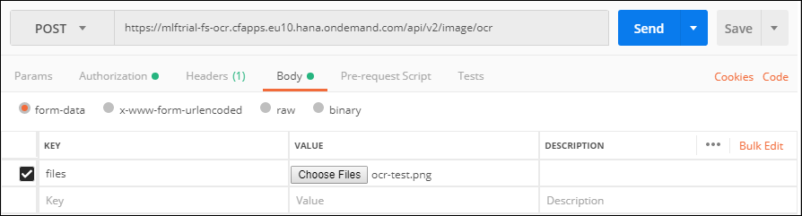
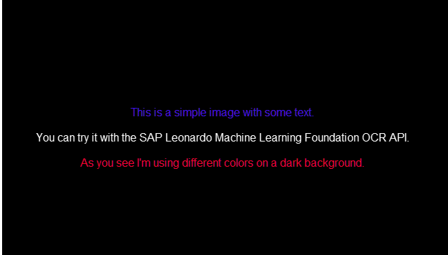

## Prerequisites
 - [Create a Machine Learning Foundation service instance on the Cloud Foundry environment](https://developers.sap.com/tutorials/cp-mlf-create-instance.html)
 - [Install Postman as a REST client](https://developers.sap.com/tutorials/api-tools-postman-install.html)
 - [Get your OAuth Access Token using a REST Client](https://developers.sap.com/tutorials/cp-mlf-rest-generate-oauth-token.html)

## Details
### You will learn
  - Call an API from a REST client like Postman
  - The basics about Machine Learning Foundation Service for Optical Character Recognition (OCR)

[ACCORDION-BEGIN [Step](The Optical Character Recognition Service)]

The Optical Character Recognition (OCR) service recognizes typewritten text from scanned or digital documents.

> ***Differences with the OCR service***
In comparison to the Optical Character Recognition service, the Scene Text Recognition service offers
>
- Works with real-life color images
- Ability to work with font-less text
- Extract word-art / `picturized` text
- Works in different orientations of texts
- Text occurring in natural images like low-contrast, emboss/engrave

>When the formats from which the text has to be read are documents or print media scans, the OCR service should be used whereas in case of natural images (e.g. reading the counter of a utility meter or the number-plate of an automobile), the Scene Text Recognition service should be used.

This is the list of accepted file extensions:

|Name                  | Description
|----------------------|--------------------
| **Archive file**     | `zip`, `tar`, `gz`, `tgz`
| **Image file**       | `jpg`, `png`, `pdf`

The images should be RGB, or 8-bit gray scale.

If an archive file is provided, no additional files can be provided.

The input file (or the archive file) is provided using form data (as an element named ***files*** in the form data).

A series of settings can also be provided as part of the form data (named ***options*** in the form data) using a JSON string format.

| Name                          | Description            | Allowed values
|-------------------------------|------------------------|--------------------
| <nobr><b>`lang`</b></nobr>           | The list of languages (up to 3) for the text submitted separated by commas | <nobr><b>`en`</b>: English (default) </nobr><br><nobr><b>`de`</b>: German</nobr><br><nobr><b>`fr`</b>: French</nobr><br><nobr><b>`es`</b>: Spanish</nobr><br><nobr><b>`ru`</b>: Russian</nobr>
| <nobr><b>`outputType`</b></nobr>     | The output type of the result | <nobr><b>`txt`</b>: plain text (default)</nobr><br><nobr><b>`xml`</b>: text with markup and additional attributes</nobr>
| <nobr><b>`pageSegMode`</b></nobr>    | The page segmentation mode | <nobr>0: Orientation and script detection (OSD) only</nobr><br><nobr>1: Automatic page segmentation with OSD (Default)</nobr><br><nobr>3: Fully automatic page segmentation, but no OSD</nobr><br><nobr>4: Assume a single column of text of variable sizes</nobr><br><nobr>5: Assume a single uniform block of vertically aligned text</nobr><br><nobr>6: Assume a single uniform block of text</nobr><br><nobr>7: Treat the image as a single text line</nobr><br><nobr>8: Treat the image as a single word</nobr><br><nobr>9: Treat the image as a single word in a circle</nobr><br><nobr>10: Treat the image as a single character</nobr><br><nobr>11: Sparse text. Find as much text as possible in no particular order</nobr><br><nobr>12: Sparse text with OSD</nobr><br><nobr>13: Raw line. Treat the image as a single text line, bypassing hacks that are `Tesseract`-specific</nobr>
| <nobr><b>`modelType`</b></nobr>      | Type of the machine learning model for OCR | <nobr><b>`lstmPrecise`</b>: precise model with LSTM cells</nobr><br><nobr><b>`lstmFast`</b>: fast model with LSTM cells</nobr><br><nobr><b>`lstmStandard`</b>: standard model with LSTM cells (Default)</nobr><br><nobr><b>`noLstm`</b>: model without LSTM cells</nobr><br><nobr><b>`all`</b>: model with LSTM cells and standard processing algorithms</nobr><br>

The service will return a JSON response that includes the detected texts within the file in either text or `hOCR` format.

For more details, you can check the [Inference Service for Optical Character Recognition (OCR) on the SAP API Business Hub](https://api.sap.com/api/ocr_api/resource).

[DONE]
[ACCORDION-END]

[ACCORDION-BEGIN [Step](Call the API)]

Open a new tab in ***Postman***.

Make sure that the ***`my-l-foundation`*** environment is selected.

On the **Authorization** tab, select **Bearer Token**, then enter **`{{OAuthToken}}`** as value.


> ### **Note:**: the **`OAuthToken`** environment variable can be retrieved following the [Get your OAuth Access Token using a REST Client](https://developers.sap.com/tutorials/cp-mlf-rest-generate-oauth-token.html) tutorial.

Fill in the following additional information:

Field Name               | Value
:----------------------- | :--------------
<nobr>HTTP Method</nobr> | POST
<nobr>URL<nobr>          | <nobr>`https://mlftrial-fs-ocr.cfapps.eu10.hana.ondemand.com/api/v2/image/ocr`</nobr>

> **Note** As a reminder, the URL depends on you Cloud Platform landscape region but for the trial landscape only ***Europe (Frankfurt)*** provide access to the Machine Learning Foundation services.

On the **Body** tab, keep **`form-data`** selected. Add a new key named **files** and switch it to **File** instead of **Text** (default).

Select your image file.



If you are missing some content to test, you can use the following [image](ocr-test.png):



Click on **Send**.

You should receive a response that includes the text found:


```json
"predictions": [
    "This is a simple image with some text\nYou can try it with the SAP Leonardo Machine Learning Foundation OCR API.\n\nAs you see I'm using different colors on a dark background.\n\f"
]
```

You can also try with the following PDF file [link](ocr-test.pdf).

[DONE]
[ACCORDION-END]

[ACCORDION-BEGIN [Step](Validate your results)]

Provide an answer to the question below then click on **Validate**.

[VALIDATE_1]
[ACCORDION-END]
---
