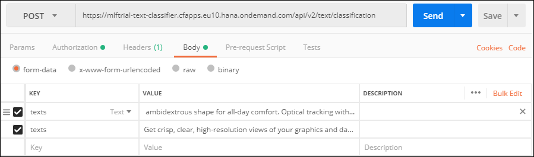
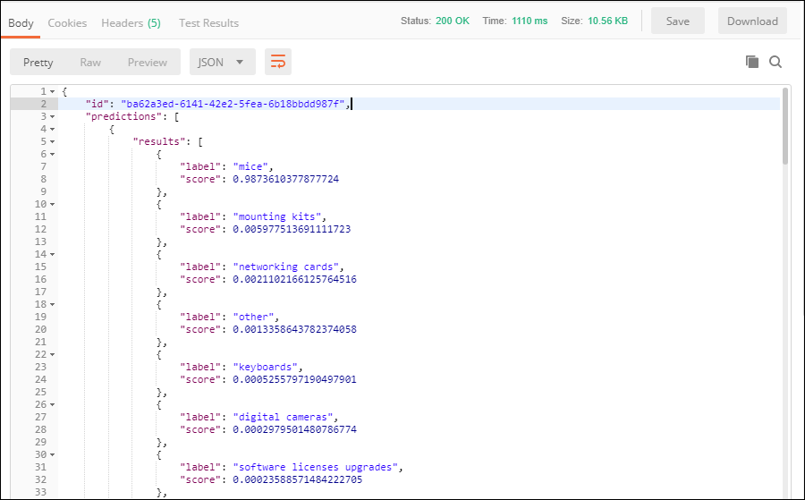

## Prerequisites
 - [Create a Machine Learning Foundation service instance on the Cloud Foundry environment](https://developers.sap.com/tutorials/cp-mlf-create-instance.html)
 - [Install Postman as a REST client](https://developers.sap.com/tutorials/api-tools-postman-install.html)
 - [Get your OAuth Access Token using a REST Client](https://developers.sap.com/tutorials/cp-mlf-rest-generate-oauth-token.html)

## Details
### You will learn
  - Call an API from a REST client like Postman
  - The basics about Machine Learning Foundation Service for Text Classification

> ### **Note:** This service was in alpha version when this tutorial was released.

[ACCORDION-BEGIN [Step](The Text Classification Service)]

The Text Classification service classifies text into a set categories, based on a pre-trained text classification model.

The input text is provided using form data (as an element named ***texts*** in the form data).

The service will return a JSON response that includes the categories predictions along with a score.

For more details, you can check the [Inference Service for Text Classification on the SAP API Business Hub](https://api.sap.com/api/text_classifier_api/resource).

[DONE]
[ACCORDION-END]

[ACCORDION-BEGIN [Step](Call the API)]

Open a new tab in ***Postman***.

Make sure that the ***`my-l-foundation`*** environment is selected.

On the **Authorization** tab, select **Bearer Token**, then enter **`{{OAuthToken}}`** as value.


> ### **Note:**: the **`OAuthToken`** environment variable can be retrieved following the [Get your OAuth Access Token using a REST Client](https://developers.sap.com/tutorials/cp-mlf-rest-generate-oauth-token.html) tutorial.

Fill in the following additional information:

Field Name               | Value
:----------------------- | :--------------
<nobr>HTTP Method</nobr> | POST
<nobr>URL<nobr>          | <nobr>`https://mlftrial-text-classifier.cfapps.eu10.hana.ondemand.com/api/v2/text/classification`</nobr>

> **Note** As a reminder, the URL depends on you Cloud Platform landscape region but for the trial landscape only ***Europe (Frankfurt)*** provide access to the Machine Learning Foundation services.

On the **Body** tab, keep **`form-data`** selected.

Add a new key named **texts** and switch it to **Text**.

Paste the following value:

```text
Ambidextrous shape for all-day comfort.
Optical tracking with 800 dpi sensitivity for precise cursor control.
Works right out of the box just plug and play.
Connector/Port/Interface: USB Left/Right
Hand Use: Left/Right
Mouse Technology: Optical
Wired/Wireless: Wired.
```

Add a new key named **texts** and switch it to **Text**.

Paste the following value:

```text
Get crisp, clear, high-resolution views of your graphics
and data projects with a 1000:1 contrast ratio,
sharp resolutions to 1440 x 900, and fast 5 ms response time
```



Click on **Send**.

You should receive a response that includes a series of entries like this:



```json
{
    "label": "mice",
    "score": 0.9873610377877724
}
```

[DONE]
[ACCORDION-END]

[ACCORDION-BEGIN [Step](Validate your results)]

Provide an answer to the question below then click on **Validate**.

[VALIDATE_1]
[ACCORDION-END]
