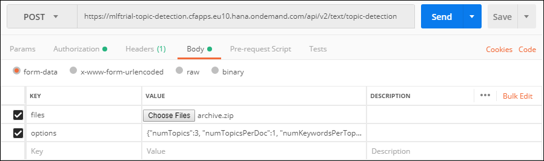
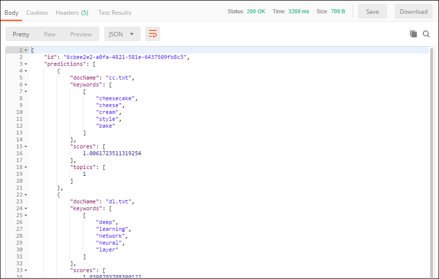

## Prerequisites
 - [Create a Machine Learning Foundation service instance on the Cloud Foundry environment](https://developers.sap.com/tutorials/cp-mlf-create-instance.html)
 - [Install Postman as a REST client](https://developers.sap.com/tutorials/api-tools-postman-install.html)
 - [Get your OAuth Access Token using a REST Client](https://developers.sap.com/tutorials/cp-mlf-rest-generate-oauth-token.html)

## Details
### You will learn
  - Call an API from a REST client like Postman
  - The basics about Machine Learning Foundation Service for Topic Detection

> ### **Note:** This service was in alpha version when this tutorial was released.

[ACCORDION-BEGIN [Step](The Topic Detection Service)]

The Topic Detection service detects and ranks topics from documents.

The input archive file is provided using form data (as an element named ***files*** in the form data).

Note that the archive must include at least 2 documents.

This is the list of accepted file extensions:

|Name                  | Description
|----------------------|--------------------
| **Archive file**     | `zip`, `tar` or `tar.gz`

A series of settings can also be provided as part of the form data (named ***options*** in the form data)  using a JSON string format.

| Name                                      | Description
|-------------------------------------------|--------------------------------------------
| <nobr><b>`numTopics`</b></nobr>           | Total number of topics to be detected  
| <nobr><b>`numTopicsPerDoc`</b></nobr>     | Number of most relevant topics to be listed per document  
| <nobr><b>`numKeywordsPerTopic`</b></nobr> | Number of keywords to be listed per topic  
| <nobr><b>`numFeatures`</b></nobr>         | Maximum number of keywords to be extracted from documents in total

The service will return a JSON response that includes the categories predictions along with a score.

For more details, you can check the following link:

 - [Inference Service for Topic Detection on the SAP API Business Hub](https://api.sap.com/api/topic_detection_api/resource).

[DONE]
[ACCORDION-END]

[ACCORDION-BEGIN [Step](Call the API)]

First, let's build an archive with at least 3 text files (so that we can set `numTopics` equal to 3).

If you are missing some inspiration, use the following articles content to create your text files:

 - <a href="https://en.wikipedia.org/wiki/Machine_learning" target="blank">Wikipedia article on Machine Learning</a>
 - <a href="https://en.wikipedia.org/wiki/Deep_learning" target="blank">Wikipedia article on Deep Learning</a>
 - <a href="https://en.wikipedia.org/wiki/Cheesecake" target="blank">Wikipedia article on Cheesecake</a>

Create a zip out of these text files.

Open a new tab in ***Postman***.

Make sure that the ***`my-l-foundation`*** environment is selected.

On the **Authorization** tab, select **Bearer Token**, then enter **`{{OAuthToken}}`** as value.


> ### **Note:**: the **`OAuthToken`** environment variable can be retrieved following the [Get your OAuth Access Token using a REST Client](https://developers.sap.com/tutorials/cp-mlf-rest-generate-oauth-token.html) tutorial.

Fill in the following additional information:

Field Name               | Value
:----------------------- | :--------------
<nobr>HTTP Method</nobr> | POST
<nobr>URL<nobr>          | <nobr>`https://mlftrial-topic-detection.cfapps.eu10.hana.ondemand.com/api/v2/text/topic-detection`</nobr>

> **Note** As a reminder, the URL depends on you Cloud Platform landscape region but for the trial landscape only ***Europe (Frankfurt)*** provide access to the Machine Learning Foundation services.

On the **Body** tab, keep **`form-data`** selected.

Add a new key named **files** and switch it to **File** instead of **Text** (default).

Select your archive file.

Add a new key named **options** and switch it to **Text**.

Paste the following value:

```JSON
{"numTopics":3, "numTopicsPerDoc":1, "numKeywordsPerTopic":5}
```

This will extract 3 topics, and get the top topic for each document with 5 attached keyword for the topic.



Click on **Send**.

You should receive a response that includes a series of entries:



```json
{
    "docName": "cc.txt",
    "keywords": [
        ["cheesecake", "cheese", "cream", "style", "bake"],
        ["deep", "learning", "network", "neural", "layer" ]
    ],
    "scores": [
        1.0061723511319254,
        0
    ],
    "topics": [
        1,
        2
    ]
}
```

[DONE]
[ACCORDION-END]

[ACCORDION-BEGIN [Step](Validate your results)]

Provide an answer to the question below then click on **Validate**.

[VALIDATE_1]
[ACCORDION-END]
