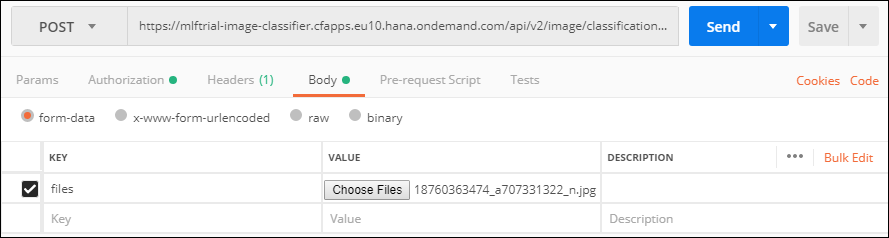
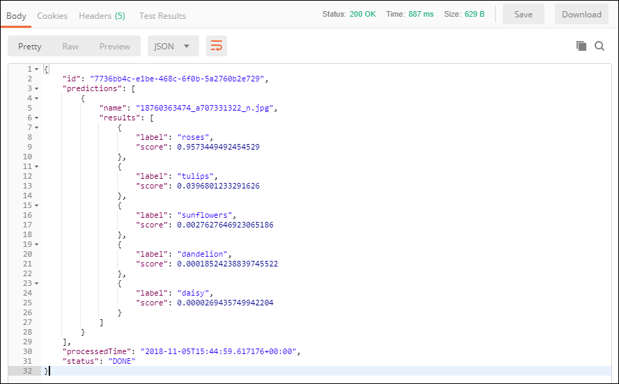

## Prerequisites
 - [Create a Machine Learning Foundation service instance on the Cloud Foundry environment](https://developers.sap.com/tutorials/cp-mlf-create-instance.html)
 - [Install Postman as a REST client](https://developers.sap.com/tutorials/api-tools-postman-install.html)
 - [Get your OAuth Access Token using a REST Client](https://developers.sap.com/tutorials/cp-mlf-rest-generate-oauth-token.html)

## Details
### You will learn
  - Call an API from a REST client like Postman
  - The basics about Machine Learning Foundation Service for Image Classification in the Retraining scenario context

[ACCORDION-BEGIN [Step](The Image Classification Service)]

Just like the Image Classification service, the retrained Image Classification service calculates and returns a list of classifications along with their probabilities for a given image using your predefined categories.

The only difference is in the URL to be called, where you will need to append the following ```/models/{model name}/versions/{model version}```.

This is the list of accepted file extensions:

|Name                  | Description
|----------------------|--------------------
| **Archive file**     | `zip`, `tar`, `gz`, `tgz`
| **Image file**       | `jpg`, `jpe`, `jpeg`, `png`, `gif`, `bmp`

The images should be RGB, or 8-bit gray scale.

If an archive file is provided, no additional files can be provided.

The input file (or the archive file) is provided using form data (as an element named ***files*** in the form data).

The service will return a JSON response that includes the top classification with the associated scores.

For more details, you can check the [Inference Service for Image Classification on the SAP API Business Hub](https://api.sap.com/api/image_classification_api/resource).

[DONE]
[ACCORDION-END]

[ACCORDION-BEGIN [Step](Call the API)]

Open a new tab in ***Postman***.

Make sure that the ***`my-l-foundation`*** environment is selected.

On the **Authorization** tab, select **Bearer Token**, then enter **`{{OAuthToken}}`** as value.


> ### **Note:**: the **`OAuthToken`** environment variable can be retrieved following the [Get your OAuth Access Token using a REST Client](https://developers.sap.com/tutorials/cp-mlf-rest-generate-oauth-token.html) tutorial.

Fill in the following additional information:

Field Name               | Value
:----------------------- | :--------------
<nobr>HTTP Method</nobr> | POST
<nobr>URL<nobr>          | <nobr>`https://mlftrial-image-classifier.cfapps.eu10.hana.ondemand.com/api/v2/image/classification/models/flowers/versions/1`</nobr>

> **Note** As a reminder, the URL depends on you Cloud Platform landscape region but for the trial landscape only ***Europe (Frankfurt)*** provide access to the Machine Learning Foundation services.

On the **Body** tab, keep **`form-data`** selected. Add a new key named **files** and switch it to **File** instead of **Text** (default).

Select one of the image file in the ```flowers/try/roses``` directory.



Click on **Send**.

You should receive a response that includes a series of predictions entries for the input files with only the five flowers category the model was retrained for:



```json
"results": [
    {
        "label": "roses",
        "score": 0.9573449492454529
    },
    {
        "label": "tulips",
        "score": 0.0396801233291626
    },
    {
        "label": "sunflowers",
        "score": 0.0027627646923065186
    },
    {
        "label": "dandelion",
        "score": 0.00018524238839745522
    },
    {
        "label": "daisy",
        "score": 0.0000269435749942204
    }
]
```

[DONE]
[ACCORDION-END]

[ACCORDION-BEGIN [Step](Validate your results)]

Provide an answer to the question below then click on **Validate**.

[VALIDATE_1]
[ACCORDION-END]
