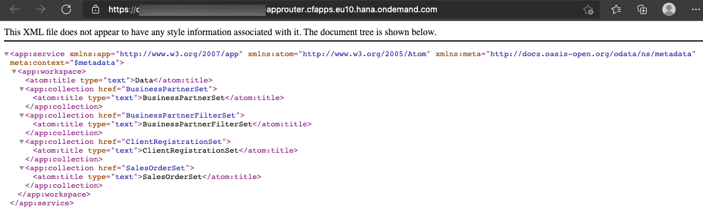
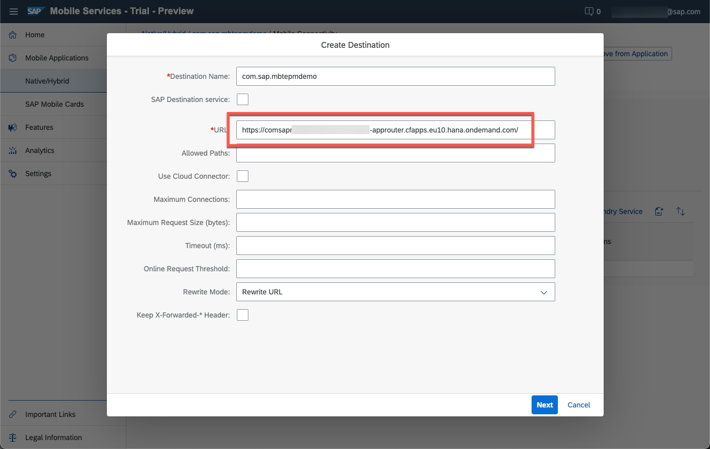
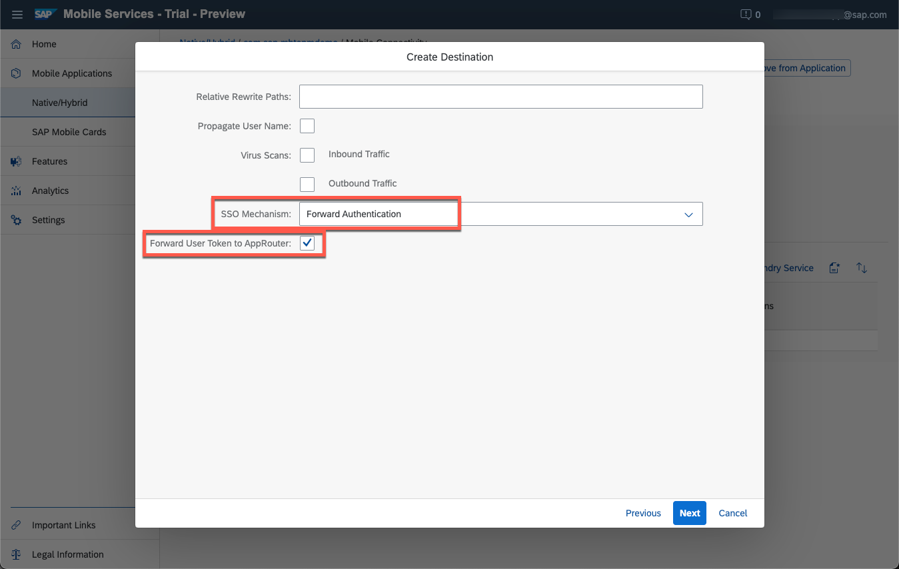

## Prerequisites
 - [Create a simple OData Service with Mobile Back-End Tools](cp-mobile-backend-tools-simple-odata)
 - [Create an Account on the SAP Gateway Demo System](gateway-demo-signup)
 - [Connect SAP Business Technology Platform to Your SAP Gateway Demo System Account (ES5)](cp-portal-cloud-foundry-gateway-connection)
 - Basic understanding of XML format and OData metadata/[Common Schema Definition Language (CSDL)](https://www.odata.org/documentation/odata-version-3-0/common-schema-definition-language-csdl/)
 - [Access SAP Mobile Services](fiori-ios-hcpms-setup)

## Details
### You will learn
  - How to create custom XML annotations to generate an OData service without actual coding
  - Usage of MBT entity handlers for refresh
  - Usage of MBT OData cache databases

---


[ACCORDION-BEGIN [Step 1: ](Create or upload the data model and prepare environment)]

1. To create a cached service with MBT, you can either upload an existing metadata file or you can use the graphical tools in SAP Business Application Studio to start from scratch.

    - For this tutorial please continue editing or copy the MBT project from [Create a simple OData Service with Mobile Back-End Tools](cp-mobile-backend-tools-simple-odata) mentioned in prerequisites. This is not only about the metadata, but also about service instance creation and binding which are not repeated within this tutorial.

2. Add the ES5's GWSAMPLE service to your subaccount's destinations.

    - Save the following context to a new file, using a local text editor like e.g. *Notepad* or *VS Code*, select **File** &rarr; **New File**, paste the content below and save as plain text file.

    ```Plain text file
    Description=ES5 GWSAMPLE Service
    Type=HTTP
    Authentication=BasicAuthentication
    Name=ES5_GWSAMPLE
    ProxyType=Internet
    URL=https\://sapes5.sapdevcenter.com/sap/opu/odata/IWBEP/GWSAMPLE_BASIC/
    sap-client=002
    ```

    - In your subaccount in SAP BTP Cockpit &rarr; select Destinations. Click *Import Destination* and open the file you just created from your file system. Enter the user name and password you defined when registering for the ES5 demo system.

    

    

    - This tutorial assumes that you completed the tutorial [Connect SAP Cloud Platform to Your SAP Gateway Demo System Account (ES5)](cp-portal-cloud-foundry-gateway-connection) where you registered for an ES5 user and learned how to manage an SAP BTP destination. You can alternatively rename your ES5 destination and append the OData service's sub-path ``/sap/opu/odata/IWBEP/GWSAMPLE_BASIC/``to the URL of the destination.

3. Back in SAP Business Application Studio, to allow consumption of the destination in your application, create and bind a destination service instance.

    - Make sure you are logged in to Cloud Foundry by clicking at bottom left corner of your status bar to initiate a valid session

    - Select **Terminal** &rarr; **New Terminal** and execute the following command:

        ```Terminal
        cf create-service destination lite <subaccount>_<space>_MbtEpmDemoService-destination
        ```

    >As in the previous tutorial, replace `<subaccount>_<space>_MbtEpmDemoService` with your actual application name in all the occurrences

4. Reference the destination service instance in `manifest.yml` by adding the instance name (that you just created it with) to the **services** of your application (last line only) as below:

    ```YAML
    applications:
      - buildpack: sap_java_buildpack
        name: <subaccount>_<space>_MbtEpmDemoService
        path: target/odata-service-1.0.0.war
        env:
          TARGET_RUNTIME: tomee7
        services:    
          - <subaccount>_<space>_MbtEpmDemoService-xsuaa
          - <subaccount>_<space>_MbtEpmDemoService-destination
    ```


[DONE]
[ACCORDION-END]

[ACCORDION-BEGIN [Step 2: ](Annotate your entities for data load from source system)]

1. Open your `metadata.csdl.xml` with **right-click** &rarr; **Open With** &rarr; **Code Editor**

2. Add `edmx` references to the declarations in the first lines - you will need three additional namespaces to be available for the cache database: *SQL*, *Cache* and *HTTP* as in the example below:

    ```XML
    <?xml version="1.0" encoding="utf-8"?>
    <edmx:Edmx Version="4.0" xmlns:edmx="http://docs.oasis-open.org/odata/ns/edmx" xmlns:xsi="http://www.w3.org/2001/XMLSchema-instance" xsi:schemaLocation="http://docs.oasis-open.org/odata/ns/edmx http://docs.oasis-open.org/odata/odata/v4.0/os/schemas/edmx.xsd http://docs.oasis-open.org/odata/ns/edm http://docs.oasis-open.org/odata/odata/v4.0/os/schemas/edm.xsd">
        <edmx:Reference Uri="https://oasis-tcs.github.io/odata-vocabularies/vocabularies/Org.OData.Core.V1.xml">
            <edmx:Include Namespace="Org.OData.Core.V1" Alias="Core"/>
        </edmx:Reference>
        <edmx:Reference Uri="vocabularies/com.sap.cloud.server.odata.sql.v1.xml">
            <edmx:Include Namespace="com.sap.cloud.server.odata.sql.v1" Alias="SQL"/>
        </edmx:Reference>    
        <edmx:Reference Uri="vocabularies/com.sap.cloud.server.odata.cache.v1.xml">
            <edmx:Include Namespace="com.sap.cloud.server.odata.cache.v1" Alias="Cache"/>
        </edmx:Reference>
        <edmx:Reference Uri="vocabularies/com.sap.cloud.server.odata.http.v1.xml">
            <edmx:Include Namespace="com.sap.cloud.server.odata.http.v1" Alias="HTTP"/>
        </edmx:Reference>
        [...]
    ```

3. To be able to use the Download Query mentioned in the next step, it will be necessary to flatten the `BusinessPartner` entity type. Therefore move the properties of `CT_Address` into `BusinessPartner` directly.

    ```XML
            <Property Name="AddressType" Type="Edm.String" Nullable="false" MaxLength="2"/>
            <Property Name="Building" Type="Edm.String" Nullable="false" MaxLength="10"/>
            <Property Name="City" Type="Edm.String" Nullable="false" MaxLength="40"/>
            <Property Name="Country" Type="Edm.String" Nullable="false" MaxLength="3"/>
            <Property Name="PostalCode" Type="Edm.String" Nullable="false" MaxLength="10"/>
            <Property Name="Street" Type="Edm.String" Nullable="false" MaxLength="60"/>
            <!--<Property Name="Address" Type="Self.CT_Address" Nullable="false"/>-->
    ```

3. Within the entity type ``BusinessPartner``, add annotations to define the cache refresh query and value mapping:

    ```XML
    <Annotation Term="Cache.RefreshBy" String="loadAll"/>
    <Annotation Term="HTTP.Destination" String="ES5_GWSAMPLE"/>
    <Annotation Term="HTTP.Request" Qualifier="loadAll" String="GET /BusinessPartnerSet">
      <Annotation Term="HTTP.ResponseBody">
        <String>
        {"d":{"results":
        [{
          "Address": {
              "AddressType": "${entity.AddressType}",
              "Building": "${entity.Building}",
              "City": "${entity.City}",
              "Country": "${entity.Country}",
              "PostalCode": "${entity.PostalCode}",
              "Street": "${entity.Street}"
          },
          "BusinessPartnerID": "${entity.BusinessPartnerID}",
          "BusinessPartnerRole": "${entity.BusinessPartnerRole}",
          "CompanyName": "${entity.CompanyName}",
          "FaxNumber": "${entity.FaxNumber}",
          "LegalForm": "${entity.LegalForm}",
          "PhoneNumber": "${entity.PhoneNumber}"
        }]
        }}                        
        </String>
      </Annotation>
      <Annotation Term="HTTP.RequestHeaders">
        <String>
        {
          "Accept": "application/json"
        }
        </String>
      </Annotation>
    </Annotation>
    ```

    >Within the annotation `HTTP.Request`, you can specify query options to your own choice. The annotation `HTTP.ResponseBody` defines the value mapping from source to the service that is being created here in JSON-style. For the use-case of this tutorial this is trivial as the referenced service was used as a template for the data model. Further options available are described [in the documentation for cache databases](https://help.sap.com/doc/f53c64b93e5140918d676b927a3cd65b/Cloud/en-US/docs-en/guides/getting-started/mbt/cache-databases.html#entity-handlers-for-http).

4. Add the same type of annotations to entity type ``SalesOrder``.

    ```XML
    <Annotation Term="Cache.RefreshBy" String="loadAll"/>
    <Annotation Term="HTTP.Destination" String="ES5_GWSAMPLE"/>
    <Annotation Term="HTTP.Request" Qualifier="loadAll" String="GET /SalesOrderSet">
      <Annotation Term="HTTP.ResponseBody">
        <String>
        {"d":{"results":
        [{
          "BillingStatus": "${entity.BillingStatus}",
          "BillingStatusDescription": "${entity.BillingStatusDescription}",
          "CustomerID": "${entity.BusinessPartnerID}",
          "CurrencyCode": "${entity.CurrencyCode}",
          "CustomerName": "${entity.CustomerName}",
          "SalesOrderID": "${entity.SalesOrderID}",
          "DeliveryStatus": "${entity.DeliveryStatus}",
          "DeliveryStatusDescription": "${entity.DeliveryStatusDescription}",
          "GrossAmount": "${entity.GrossAmount}",
          "LifecycleStatus": "${entity.LifecycleStatus}",
          "LifecycleStatusDescription": "${entity.LifecycleStatusDescription}",
          "NetAmount": "${entity.NetAmount}",
          "Note": "${entity.Note}",
          "NoteLanguage": "${entity.NoteLanguage}",
          "CustomerName": "${entity.CustomerName}",
          "TaxAmount": "${entity.TaxAmount}"
        }]
        }}                        
        </String>
      </Annotation>
      <Annotation Term="HTTP.RequestHeaders">
        <String>
        {
          "Accept": "application/json"
        }
        </String>
      </Annotation>
    </Annotation>
    ```

5. Finally, add required annotations to the *Entity Container* at the end of the document, as in the following example

    ```XML
    [...]
    <EntityContainer Name="Com_sap_mbtepmdemoService">
      <!--<Annotation Term="Cache.ODataBackend" String="ES5_GWSAMPLE"/> -->
      <Annotation Term="SQL.CacheDatabase"/>
      <Annotation Term="SQL.TrackChanges"/>
      <Annotation Term="SQL.TrackDownloads" />
    [...]
    ```

    >**Hint:** If no custom logic or mapping is required, the annotation `Cache.ODataBackend` can be used to [replicate/cache an OData service](https://help.sap.com/doc/f53c64b93e5140918d676b927a3cd65b/Cloud/en-US/docs-en/guides/getting-started/mbt/cache-databases.html#odata-back-end-systems) without having to map all the entity handlers manually and can save a lot of effort for such cases.

[DONE]
[ACCORDION-END]

[ACCORDION-BEGIN [Step 3: ](Add Client-Filter and Client-Registration entities to customise a download query)]

1. Within your Schema, add the following two additional entity types.

    ```XML
    <EntityType Name="BusinessPartnerFilter">
        <Annotation Term="SQL.ClientFilter" xmlns="http://docs.oasis-open.org/odata/ns/edm"/>
        <Key>
            <PropertyRef Name="FilterID"/>
        </Key>
        <Property Name="CountryFilter" Type="Edm.String" Nullable="true" MaxLength="3"/>
        <Property Name="FilterID" Type="Edm.Int64" Nullable="false"/>
    </EntityType>
    <EntityType Name="ClientRegistration">
        <Key>
            <PropertyRef Name="ClientID"/>
        </Key>
        <Property Name="AuthorizedUser" Type="Edm.String" Nullable="true" MaxLength="200"/>
        <Property Name="ClientGUID" Type="Edm.Guid" Nullable="false">
            <Annotation Term="Core.Immutable" xmlns="http://docs.oasis-open.org/odata/ns/edm"/>
        </Property>
        <Property Name="ClientID" Type="Edm.Int64" Nullable="false"/>
    </EntityType>
    ```

    >By adding a ClientRegistration entity, users will be able to register to the service. This will e.g. enable download tracking, upload of client filters and automatically populate the user ID field in the service, e.g. available for download queries. More information can be found in [Enabling Client Registrations](https://help.sap.com/doc/f53c64b93e5140918d676b927a3cd65b/Cloud/en-US/docs-en/guides/getting-started/mbt/client-registrations.html)

2. Add the new entity types to the entity container at the end of the document

    ```XML
    <EntityContainer Name="Com_sap_mbtepmdemoService">
      [...]
        <EntitySet Name="BusinessPartnerFilterSet" EntityType="Self.BusinessPartnerFilter"/>
        <EntitySet Name="ClientRegistrationSet" EntityType="Self.ClientRegistration"/>
    </EntityContainer>
    ```

3. Add an annotation to the `BusinessPartner` entity type to make use of the added Filter entity.

    ```XML
    <Annotation Term="SQL.DownloadQuery" xmlns="http://docs.oasis-open.org/odata/ns/edm"
       String="select entity.* from BusinessPartner entity, BusinessPartnerFilter filter
                    where entity.Country=filter.CountryFilter
                    "/>
    ```

    >Thanks to this query, an app using this service will only be able to download business partners after specifying a region and according to the specified value(s) receive a restricted set of business partners only. Additionally this query will enforce requiring client registrations for data queries.

4. Add a similar download query for `SalesOrder` to follow the referential constraint of the association.

    ```XML
    <Annotation Term="SQL.DownloadQuery" xmlns="http://docs.oasis-open.org/odata/ns/edm" String="
                    select entity.* from SalesOrder entity where entity.BusinessPartnerID in
                    (select bp.BusinessPartnerID from BusinessPartner bp, BusinessPartnerFilter filter
                    where bp.Country=filter.CountryFilter)
                    "/>
    ```

5. Build and deploy the service by executing build task ``csdl-to-war`` from *Terminal* menu &rarr; *Run Task*.

    - Take care of your ``manifest.yml`` file. Depending on the MBT release, there might be an issue which deletes the content of the app router's destination. If you notice it is missing, recover the destination and run ``cf push`` from terminal to deploy without building the service.

        As a **workaround**, you can also remove the whole app router application part in `manifest.yml` after successful `cf push`. This will result in the approuter remaining unchanged during deployment.

For reference please double check with the following documents.

  <details>
  <summary>metadata.csdl.xml</summary>

```XML
<?xml version="1.0" encoding="utf-8"?>
<edmx:Edmx Version="4.0" xmlns:edmx="http://docs.oasis-open.org/odata/ns/edmx" xmlns:xsi="http://www.w3.org/2001/XMLSchema-instance" xsi:schemaLocation="http://docs.oasis-open.org/odata/ns/edmx http://docs.oasis-open.org/odata/odata/v4.0/os/schemas/edmx.xsd http://docs.oasis-open.org/odata/ns/edm http://docs.oasis-open.org/odata/odata/v4.0/os/schemas/edm.xsd">
    <edmx:Reference Uri="https://oasis-tcs.github.io/odata-vocabularies/vocabularies/Org.OData.Core.V1.xml">
        <edmx:Include Namespace="Org.OData.Core.V1" Alias="Core"/>
    </edmx:Reference>
    <edmx:Reference Uri="vocabularies/com.sap.cloud.server.odata.sql.v1.xml">
        <edmx:Include Namespace="com.sap.cloud.server.odata.sql.v1" Alias="SQL"/>
    </edmx:Reference>    
    <edmx:Reference Uri="vocabularies/com.sap.cloud.server.odata.cache.v1.xml">
        <edmx:Include Namespace="com.sap.cloud.server.odata.cache.v1" Alias="Cache"/>
    </edmx:Reference>
    <edmx:Reference Uri="vocabularies/com.sap.cloud.server.odata.http.v1.xml">
        <edmx:Include Namespace="com.sap.cloud.server.odata.http.v1" Alias="HTTP"/>
    </edmx:Reference>
    <edmx:DataServices>
        <Schema Namespace="com.sap.mbtepmdemo" Alias="Self" xmlns="http://docs.oasis-open.org/odata/ns/edm">
            <ComplexType Name="CT_Address">
                <Property Name="AddressType" Type="Edm.String" Nullable="false" MaxLength="2"/>
                <Property Name="Building" Type="Edm.String" Nullable="false" MaxLength="10"/>
                <Property Name="City" Type="Edm.String" Nullable="false" MaxLength="40"/>
                <Property Name="Country" Type="Edm.String" Nullable="false" MaxLength="3"/>
                <Property Name="PostalCode" Type="Edm.String" Nullable="false" MaxLength="10"/>
                <Property Name="Street" Type="Edm.String" Nullable="false" MaxLength="60"/>
            </ComplexType>
            <EntityType Name="BusinessPartner">
                <Annotation Term="Cache.RefreshBy" String="loadAll"/>
                <Annotation Term="HTTP.Destination" String="ES5_GWSAMPLE"/>
                <Annotation Term="HTTP.Request" Qualifier="loadAll" String="GET /BusinessPartnerSet">
                    <Annotation Term="HTTP.ResponseBody">
                        <String>
                        {"d":{"results":
                        [
                            {
                                "Address": {
                                    "AddressType": "${entity.AddressType}",
                                    "Building": "${entity.Building}",
                                    "City": "${entity.City}",
                                    "Country": "${entity.Country}",
                                    "PostalCode": "${entity.PostalCode}",
                                    "Street": "${entity.Street}"
                                },
                                "BusinessPartnerID": "${entity.BusinessPartnerID}",
                                "BusinessPartnerRole": "${entity.BusinessPartnerRole}",
                                "CompanyName": "${entity.CompanyName}",
                                "FaxNumber": "${entity.FaxNumber}",
                                "LegalForm": "${entity.LegalForm}",
                                "PhoneNumber": "${entity.PhoneNumber}"
                            }
                        ]
                        }}                        
                        </String>
                    </Annotation>
                    <Annotation Term="HTTP.RequestHeaders">
                        <String>
                            {
                                "Accept": "application/json"
                            }
                        </String>
                    </Annotation>
                </Annotation>
                <Annotation Term="SQL.DownloadQuery" xmlns="http://docs.oasis-open.org/odata/ns/edm" String="
                    select entity.* from BusinessPartner entity, BusinessPartnerFilter filter
                    where entity.Country=filter.CountryFilter
                    "/>
                <Key>
                    <PropertyRef Name="BusinessPartnerID"/>
                </Key>
                <Property Name="AddressType" Type="Edm.String" Nullable="false" MaxLength="2"/>
                <Property Name="Building" Type="Edm.String" Nullable="false" MaxLength="10"/>
                <Property Name="City" Type="Edm.String" Nullable="false" MaxLength="40"/>
                <Property Name="Country" Type="Edm.String" Nullable="false" MaxLength="3"/>
                <Property Name="PostalCode" Type="Edm.String" Nullable="false" MaxLength="10"/>
                <Property Name="Street" Type="Edm.String" Nullable="false" MaxLength="60"/>
                <!--<Property Name="Address" Type="Self.CT_Address" Nullable="false"/>-->
                <Property Name="BusinessPartnerID" Type="Edm.Int64" Nullable="false"/>
                <Property Name="BusinessPartnerRole" Type="Edm.String" Nullable="false" MaxLength="3"/>
                <Property Name="CompanyName" Type="Edm.String" Nullable="false" MaxLength="80"/>
                <Property Name="FaxNumber" Type="Edm.String" Nullable="false" MaxLength="30"/>
                <Property Name="LegalForm" Type="Edm.String" Nullable="false" MaxLength="10"/>
                <Property Name="PhoneNumber" Type="Edm.String" Nullable="false" MaxLength="30"/>
                <NavigationProperty Name="ToSalesOrders" Type="Collection(Self.SalesOrder)" Partner="ToBusinessPartner"/>
            </EntityType>
            <EntityType Name="SalesOrder">
                <Annotation Term="Cache.LoadAfter" String="BusinessPartner"/>
                <Annotation Term="Cache.RefreshBy" String="loadAll"/>
                <Annotation Term="HTTP.Destination" String="ES5_GWSAMPLE"/>
                <Annotation Term="HTTP.Request" Qualifier="loadAll" String="GET /SalesOrderSet">
                    <Annotation Term="HTTP.ResponseBody">
                        <String>
                        {"d":{"results":
                        [
                            {
                                "BillingStatus": "${entity.BillingStatus}",
                                "BillingStatusDescription": "${entity.BillingStatusDescription}",
                                "CustomerID": "${entity.BusinessPartnerID}",
                                "CurrencyCode": "${entity.CurrencyCode}",
                                "CustomerName": "${entity.CustomerName}",
                                "SalesOrderID": "${entity.SalesOrderID}",
                                "DeliveryStatus": "${entity.DeliveryStatus}",
                                "DeliveryStatusDescription": "${entity.DeliveryStatusDescription}",
                                "GrossAmount": "${entity.GrossAmount}",
                                "LifecycleStatus": "${entity.LifecycleStatus}",
                                "LifecycleStatusDescription": "${entity.LifecycleStatusDescription}",
                                "NetAmount": "${entity.NetAmount}",
                                "Note": "${entity.Note}",
                                "NoteLanguage": "${entity.NoteLanguage}",
                                "CustomerName": "${entity.CustomerName}",
                                "TaxAmount": "${entity.TaxAmount}"
                            }
                        ]
                        }}                        
                        </String>
                    </Annotation>
                    <Annotation Term="HTTP.RequestHeaders">
                        <String>
                            {
                                "Accept": "application/json"
                            }
                        </String>
                    </Annotation>
                </Annotation>
                <Annotation Term="SQL.DownloadQuery" xmlns="http://docs.oasis-open.org/odata/ns/edm" String="
                    select entity.* from SalesOrder entity where entity.BusinessPartnerID in
                    (select bp.BusinessPartnerID from BusinessPartner bp, BusinessPartnerFilter filter
                    where bp.Country=filter.CountryFilter)
                    "/>
                <Key>
                    <PropertyRef Name="SalesOrderID"/>
                </Key>
                <Property Name="BillingStatus" Type="Edm.String" Nullable="true" MaxLength="1"/>
                <Property Name="BillingStatusDescription" Type="Edm.String" Nullable="true" MaxLength="60"/>
                <Property Name="BusinessPartnerID" Type="Edm.Int64" Nullable="false"/>
                <Property Name="ChangedAt" Type="Edm.DateTimeOffset" Nullable="true" Precision="7"/>
                <Property Name="CreatedAt" Type="Edm.DateTimeOffset" Nullable="true" Precision="7"/>
                <Property Name="CurrencyCode" Type="Edm.String" Nullable="true" MaxLength="5"/>
                <Property Name="CustomerID" Type="Edm.String" Nullable="false" MaxLength="10"/>
                <Property Name="CustomerName" Type="Edm.String" Nullable="true" MaxLength="80"/>
                <Property Name="DeliveryStatus" Type="Edm.String" Nullable="true" MaxLength="1"/>
                <Property Name="DeliveryStatusDescription" Type="Edm.String" Nullable="true" MaxLength="60"/>
                <Property Name="GrossAmount" Type="Edm.Decimal" Nullable="true" Precision="16" Scale="3"/>
                <Property Name="LifecycleStatus" Type="Edm.String" Nullable="true" MaxLength="1"/>
                <Property Name="LifecycleStatusDescription" Type="Edm.String" Nullable="true" MaxLength="60"/>
                <Property Name="NetAmount" Type="Edm.Decimal" Nullable="true" Precision="16" Scale="3"/>
                <Property Name="Note" Type="Edm.String" Nullable="true" MaxLength="255"/>
                <Property Name="NoteLanguage" Type="Edm.String" Nullable="true" MaxLength="2"/>
                <Property Name="SalesOrderID" Type="Edm.Int64" Nullable="false"/>
                <Property Name="TaxAmount" Type="Edm.Decimal" Nullable="true" Precision="16" Scale="3"/>
                <NavigationProperty Name="ToBusinessPartner" Type="Self.BusinessPartner" Nullable="false" Partner="ToSalesOrders">
                    <ReferentialConstraint Property="BusinessPartnerID" ReferencedProperty="BusinessPartnerID"/>
                </NavigationProperty>
            </EntityType>

            <EntityType Name="BusinessPartnerFilter">
                <Annotation Term="SQL.ClientFilter" xmlns="http://docs.oasis-open.org/odata/ns/edm"/>
                <Key>
                    <PropertyRef Name="FilterID"/>
                </Key>
                <Property Name="CountryFilter" Type="Edm.String" Nullable="true" MaxLength="3"/>
                <Property Name="FilterID" Type="Edm.Int64" Nullable="false"/>
            </EntityType>
            <EntityType Name="ClientRegistration">
                <Key>
                    <PropertyRef Name="ClientID"/>
                </Key>
                <Property Name="AuthorizedUser" Type="Edm.String" Nullable="true" MaxLength="200"/>
                <Property Name="ClientGUID" Type="Edm.Guid" Nullable="false">
                    <Annotation Term="Core.Immutable" xmlns="http://docs.oasis-open.org/odata/ns/edm"/>
                </Property>
                <Property Name="ClientID" Type="Edm.Int64" Nullable="false"/>
            </EntityType>
            <EntityContainer Name="Com_sap_mbtepmdemoService">
                <!--<Annotation Term="Cache.ODataBackend" String="SAP_GATEWAY_GWSAMPLE"/> -->
                <Annotation Term="SQL.CacheDatabase"/>
                <Annotation Term="SQL.TrackChanges"/>
                <Annotation Term="SQL.TrackDownloads" />
                <EntitySet Name="BusinessPartnerSet" EntityType="Self.BusinessPartner">
                    <NavigationPropertyBinding Path="ToSalesOrders" Target="SalesOrderSet"/>
                </EntitySet>
                <EntitySet Name="SalesOrderSet" EntityType="Self.SalesOrder">
                    <NavigationPropertyBinding Path="ToBusinessPartner" Target="BusinessPartnerSet"/>
                </EntitySet>
                <EntitySet Name="BusinessPartnerFilterSet" EntityType="Self.BusinessPartnerFilter"/>
                <EntitySet Name="ClientRegistrationSet" EntityType="Self.ClientRegistration"/>
            </EntityContainer>
        </Schema>
    </edmx:DataServices>
</edmx:Edmx>
```
</details>
&nbsp;

  <details>
  <summary>manifest.yml</summary>

```YAML remember to replace *<subaccount>_<space>_* with your own name
---
applications:
  - buildpack: sap_java_buildpack
    name: <subaccount>_<space>_MbtEpmDemoService
    path: target/odata-service-1.0.0.war
    env:    
      SET_LOGGING_LEVEL: '{odata: TRACE, sap.xs.console: TRACE, sap.xs.odata: TRACE}'
      TARGET_RUNTIME: tomee7
    services:    
      - <subaccount>_<space>_MbtEpmDemoService-xsuaa
      - <subaccount>_<space>_MbtEpmDemoService-destination
  - name: <subaccount>_<space>_MbtEpmDemoService-approuter
    path: approuter
    buildpacks:    
      - nodejs_buildpack
    memory: 128M
    services:    
      - <subaccount>_<space>_MbtEpmDemoService-xsuaa
    env:
      destinations: >
        [
          {
            "name":"odata",
            "url":"https://<subaccount><space>MbtEpmDemoService.cfapps.eu10.hana.ondemand.com",
            "forwardAuthToken": true
          }
        ]
```
</details>
&nbsp;

  <details>
  <summary>manifest.yml without app router (workaround)</summary>

```YAML remember to replace *<subaccount>_<space>_* with your own name
---
applications:
  - buildpack: sap_java_buildpack
    name: <subaccount>_<space>_MbtEpmDemoService
    path: target/odata-service-1.0.0.war
    env:    
      SET_LOGGING_LEVEL: '{odata: TRACE, sap.xs.console: TRACE, sap.xs.odata: TRACE}'
      TARGET_RUNTIME: tomee7
    services:    
      - <subaccount>_<space>_MbtEpmDemoService-xsuaa
      - <subaccount>_<space>_MbtEpmDemoService-destination
```
</details>

&nbsp;

[VALIDATE_4]
[ACCORDION-END]

[ACCORDION-BEGIN [Step 4: ](Examine and test your OData service)]

1. If not noted down previously, find the application route (URL) assigned to the app router in the space of SAP Business Technology Platform Cockpit and click it

    

    - A new browser tab will open, showing the service document

        

3. Call `/BusinessPartnerSet` or `SalesOrderSet` and notice an error that the `Client-Instance-ID` header is missing.

    >Due to the custom download query incorporating the `BusinessPartnerFilter`, you can only query this data set if you registered to the service and sent your `Client-Instance-ID` header representing your registration. Without a filter uploaded, you will still see an empty response.

    >You can perform such a [Client Registration](https://help.sap.com/doc/f53c64b93e5140918d676b927a3cd65b/Cloud/en-US/docs-en/guides/getting-started/mbt/client-registrations.html#registration-header) also in a REST client, while the recommended approach would be to use a mobile application that automates this procedure.

---

[DONE]
[ACCORDION-END]

[ACCORDION-BEGIN [Step 5: ](Reference your OData service in SAP Mobile Services)]

1. Log in to SAP Mobile Services Cockpit, e.g. [mobile-service-cockpit-web.cfapps.eu10.hana.ondemand.com](https://mobile-service-cockpit-web-preview.cfapps.eu10.hana.ondemand.com/), depending on your landscape provider and region.

    - Select your Organisation and Space

    - Initial setup and access to SAP Mobile Services is described in [Access SAP Mobile Services](fiori-ios-hcpms-setup) (mentioned in prerequisites)

2. Select **Mobile Applications** &rarr; **Mobile/Hybrid** in SAP Mobile Services cockpit and click **New**

    

3. Fill out the form with the following values and make sure to select the previously created XSUAA instances on the first selection screen.

    | **Field** | **Value** |
    |----|----|
    | ID | `com.yourcompany.MbtEpmDemo` |
    | Name | `My Businesspartners` |
    | Description | MDK-based demo for MBT registrations for My Customers  |
    | Vendor | SAP |
    | XSUAA Service | `<subaccount>_<space>_MbtEpmDemoService-xsuaa` |
    | Domain of Application Route | *keep default* |

    

4. Select type of application as **Mobile Development Kit Application** and click **Finish** to proceed with default features.

5. Select **Mobile Connectivity** and create a new destination by clicking on the **Create** button.

    

    

6. In the wizard: on first page  page fill in the URL (application route) of your app router as examined in the previous step.

    

7. Press **Next** to skip pages for **Custom Headers** and **Annotations**. On the following page select **SSO Mechanism** &rarr; **Forward Authentication** and tick the box **Forward User Token to App Router**. Finally press *Next* and then *Finish*

    

**Congratulations!** You have successfully created an OData Cache-Database with MBT, linked it to SAP Mobile Services and are now ready for client development.

[VALIDATE_6]
[ACCORDION-END]
