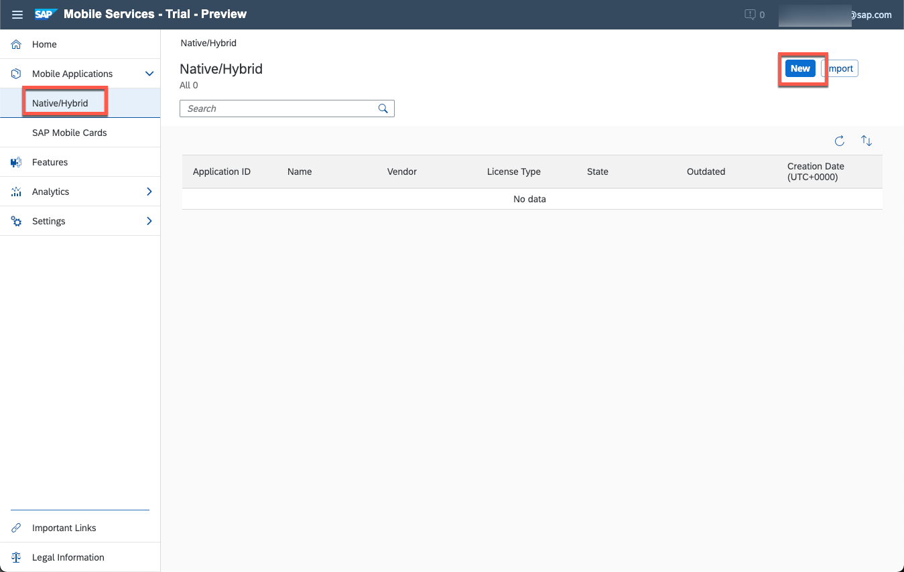

# Create a Cached OData Service for Improved Offline OData

<!-- description --> Create and configure an SAP Mobile Services mobile back-end tools (MBT) OData service with a cache database attached to an existing web service to enhance it with delta tracking and client filter

## Prerequisites

 - [Create a simple OData Service with Mobile Back-End Tools](cp-mobile-backend-tools-simple-odata)
 - [Create an Account on the SAP Gateway Demo System](gateway-demo-signup)
 - [Connect SAP Business Technology Platform to Your SAP Gateway Demo System Account (ES5)](cp-portal-cloud-foundry-gateway-connection)
 - Basic understanding of XML format and OData metadata/[Common Schema Definition Language (CSDL)](https://www.odata.org/documentation/odata-version-3-0/common-schema-definition-language-csdl/)
 - [Access SAP Mobile Services](fiori-ios-hcpms-setup)

## You will learn

  - How to create custom XML annotations to generate an OData service without actual coding
  - Usage of MBT entity handlers for refresh
  - Usage of MBT OData cache databases

---

### Create or upload the data model and prepare environment

1. To create a cached service with MBT, you can either upload an existing metadata file or you can use the XML Editor in SAP Business Application Studio to start from scratch.

    - For this tutorial please continue editing or copy the MBT project from [Create a simple OData Service with Mobile Back-End Tools](cp-mobile-backend-tools-simple-odata) mentioned in prerequisites. This is not only about the metadata, but also about service instance creation and binding which are not repeated within this tutorial.

2. Make sure that the ES5 Gateway Demo System is set up as a destination in your subaccount, as described in the Tutorial [Connect SAP Cloud Platform to Your SAP Gateway Demo System Account (ES5)](cp-portal-cloud-foundry-gateway-connection).

    - The code samples in this tutorial will assume the name as `ES5`. If you used a custom name or added a unique identifier, please make sure to adapt in the code samples where applicable.

3. Back in SAP Business Application Studio, to allow consumption of the destination in your application, add a service instance of type destination to your application's `mtad.yaml`.

    Open the file `mtad.yaml` that you created in the previous Tutorial [Create a Simple OData Service with Mobile Back-End Tools](cp-mobile-backend-tools-simple-odata).

    In the application's **requires** section, after `- name: MbtEpmDemoService-xsuaa` (line 20), add another line with

    ```YAML
          - name: MbtEpmDemoService-destination
    ```

    on the same level.

    At the end of the file (resources section), paste the following:

    ```YAML
      - name: MbtEpmDemoService-destination
        type: org.cloudfoundry.managed-service   
        parameters:
          service: destination
          service-plan: lite
    ```

    - For reference please double check with the full `mtad.yaml` file content.

    ```YAML
    ---
    ID: MbtEpmDemoService
    _schema-version: "3.3"
    version: 1.0.0
    modules:
      -
        # application
        name: MbtEpmDemoService
        # module
        path: srv/target/odata-service-1.0.0.war
        type: java
        parameters:    
          memory: 1G
          disk: 2G
          instances: 1
        properties:    
          SET_LOGGING_LEVEL: '{odata: TRACE, sap.xs.console: TRACE, sap.xs.odata: TRACE}'
          TARGET_RUNTIME: tomee7
        requires:
          - name: MbtEpmDemoService-xsuaa
          - name: MbtEpmDemoService-destination
        # Providing default-url can be re-used for the app router
        provides:
          -
            name: mbtepmdemo-odata
            properties:
              url: ${default-url}
      -
        # approuter
        name: MbtEpmDemoService-approuter
        type: nodejs
        path: srv/approuter
        requires:
          - name: MbtEpmDemoService-xsuaa
          # require
          - name: mbtepmdemo-odata
        parameters:
          buildpack: nodejs_buildpack
          instances: 1
          memory: 128M
        properties:
          destinations: >
            [
              {"name":"odata","url":"~{mbtepmdemo-odata/url}","forwardAuthToken": true}
            ]  
    resources:
      - name: MbtEpmDemoService-xsuaa
        type: org.cloudfoundry.managed-service   
        parameters:
          service: xsuaa
          service-plan: application
          path: srv/xs-security.json
      - name: MbtEpmDemoService-destination
        type: org.cloudfoundry.managed-service   
        parameters:
          service: destination
          service-plan: lite
    ```

4. To further allow deployments with `cf push` or `csdl-to-war`, also reference the destination service instance in `manifest.yml` by adding the instance name to the **services** of your application (last line only) as in the reference below:

    ```YAML
    applications:
      - buildpack: sap_java_buildpack
        name: MbtEpmDemoService
        path: target/odata-service-1.0.0.war
        random-route: true
        env:
          TARGET_RUNTIME: tomee7
        services:    
          - MbtEpmDemoService-xsuaa
          - MbtEpmDemoService-destination
    ```


### Annotate your entities for data load from source system


1. Open your `metadata.csdl.xml` with text editor.

2. Add `edmx` references to the declarations in the first lines - you will need three additional namespaces to be available for the cache database: *SQL*, *Cache* and *HTTP*.

    Paste line 6-14 from the snippet below into your `metadata.csdl.xml` file (after line 5):

    ```XML
    <?xml version="1.0" encoding="utf-8"?>
    <edmx:Edmx Version="4.0" xmlns:edmx="http://docs.oasis-open.org/odata/ns/edmx" xmlns:xsi="http://www.w3.org/2001/XMLSchema-instance" xsi:schemaLocation="http://docs.oasis-open.org/odata/ns/edmx http://docs.oasis-open.org/odata/odata/v4.0/os/schemas/edmx.xsd http://docs.oasis-open.org/odata/ns/edm http://docs.oasis-open.org/odata/odata/v4.0/os/schemas/edm.xsd">
        <edmx:Reference Uri="https://oasis-tcs.github.io/odata-vocabularies/vocabularies/Org.OData.Core.V1.xml">
            <edmx:Include Namespace="Org.OData.Core.V1" Alias="Core"/>
        </edmx:Reference>
        <edmx:Reference Uri="vocabularies/com.sap.cloud.server.odata.sql.v1.xml">
            <edmx:Include Namespace="com.sap.cloud.server.odata.sql.v1" Alias="SQL"/>
        </edmx:Reference>    
        <edmx:Reference Uri="vocabularies/com.sap.cloud.server.odata.cache.v1.xml">
            <edmx:Include Namespace="com.sap.cloud.server.odata.cache.v1" Alias="Cache"/>
        </edmx:Reference>
        <edmx:Reference Uri="vocabularies/com.sap.cloud.server.odata.http.v1.xml">
            <edmx:Include Namespace="com.sap.cloud.server.odata.http.v1" Alias="HTTP"/>
        </edmx:Reference>
        <edmx:DataServices>
        [...]
    ```

3. To be able to use the Download Query mentioned in the next step, it will be necessary to flatten the `BusinessPartner` entity type. Therefore move the properties of `CT_Address` into `BusinessPartner` directly.

    To achieve this, replace line 29 with the snippet below:

    ```XML
            <Property Name="AddressType" Type="Edm.String" Nullable="false" MaxLength="2"/>
            <Property Name="Building" Type="Edm.String" Nullable="false" MaxLength="10"/>
            <Property Name="City" Type="Edm.String" Nullable="false" MaxLength="40"/>
            <Property Name="Country" Type="Edm.String" Nullable="false" MaxLength="3"/>
            <Property Name="PostalCode" Type="Edm.String" Nullable="false" MaxLength="10"/>
            <Property Name="Street" Type="Edm.String" Nullable="false" MaxLength="60"/>
            <!--<Property Name="Address" Type="Self.CT_Address" Nullable="false"/>-->
    ```

3. Within the entity type `BusinessPartner`, add annotations to define the cache refresh query and value mapping.

    You can paste them anywhere inside the `<EntityType Name="BusinessPartner">` definition, e.g. before the closing tag `</EntityType>` (line 43 if you strictly followed without any blank lines).

    ```XML
    <Annotation Term="Cache.RefreshBy" String="loadAll"/>
    <Annotation Term="HTTP.Request" Qualifier="loadAll" String="GET /sap/opu/odata/IWBEP/GWSAMPLE_BASIC/BusinessPartnerSet">
      <Annotation Term="HTTP.ResponseBody">
        <String>
        {"d":{"results":
        [{
          "Address": {
              "AddressType": "${entity.AddressType}",
              "Building": "${entity.Building}",
              "City": "${entity.City}",
              "Country": "${entity.Country}",
              "PostalCode": "${entity.PostalCode}",
              "Street": "${entity.Street}"
          },
          "BusinessPartnerID": "${entity.BusinessPartnerID}",
          "BusinessPartnerRole": "${entity.BusinessPartnerRole}",
          "CompanyName": "${entity.CompanyName}",
          "FaxNumber": "${entity.FaxNumber}",
          "LegalForm": "${entity.LegalForm}",
          "PhoneNumber": "${entity.PhoneNumber}"
        }]
        }}                        
        </String>
      </Annotation>
      <Annotation Term="HTTP.RequestHeaders">
        <String>
        {
          "Accept": "application/json"
        }
        </String>
      </Annotation>
    </Annotation>
    ```

    >Within the annotation `HTTP.Request`, you can specify query options to your own choice. The annotation `HTTP.ResponseBody` defines the value mapping from source to the service that is being created here in JSON-style. For the use-case of this tutorial this is trivial as the referenced service was used as a template for the data model. Further options available are described [in the documentation for cache databases](https://help.sap.com/doc/f53c64b93e5140918d676b927a3cd65b/Cloud/en-US/docs-en/guides/getting-started/mbt/cache-databases.html#entity-handlers-for-http).

4. Add the same type of annotations to entity type ``SalesOrder`` inside the tag `<EntityType Name="SalesOrder">` (e.g. before line 101 if you strictly followed without any blank lines).

    ```XML
    <Annotation Term="Cache.RefreshBy" String="loadAll"/>
                <Annotation Term="HTTP.Request" Qualifier="loadAll" String="GET /sap/opu/odata/IWBEP/GWSAMPLE_BASIC/SalesOrderSet">
      <Annotation Term="HTTP.ResponseBody">
        <String>
        {"d":{"results":
        [{
          "BillingStatus": "${entity.BillingStatus}",
          "BillingStatusDescription": "${entity.BillingStatusDescription}",
          "CustomerID": "${entity.BusinessPartnerID}",
          "CurrencyCode": "${entity.CurrencyCode}",
          "CustomerName": "${entity.CustomerName}",
          "SalesOrderID": "${entity.SalesOrderID}",
          "DeliveryStatus": "${entity.DeliveryStatus}",
          "DeliveryStatusDescription": "${entity.DeliveryStatusDescription}",
          "GrossAmount": "${entity.GrossAmount}",
          "LifecycleStatus": "${entity.LifecycleStatus}",
          "LifecycleStatusDescription": "${entity.LifecycleStatusDescription}",
          "NetAmount": "${entity.NetAmount}",
          "Note": "${entity.Note}",
          "NoteLanguage": "${entity.NoteLanguage}",
          "CustomerName": "${entity.CustomerName}",
          "TaxAmount": "${entity.TaxAmount}"
        }]
        }}                        
        </String>
      </Annotation>
      <Annotation Term="HTTP.RequestHeaders">
        <String>
        {
          "Accept": "application/json"
        }
        </String>
      </Annotation>
    </Annotation>
    ```

5. Finally, add required annotations to the *Entity Container* at the end of the document.

    Therefore, paste lines 3-6 from the snippet below inside tag `<EntityContainer Name="Com_sap_mbtepmdemoService">` (after line 136).

    ```XML
    [...]
    <EntityContainer Name="Com_sap_mbtepmdemoService">
        <Annotation Term="Cache.HttpDestination" String="ES5"/>
        <Annotation Term="SQL.CacheDatabase"/>
        <Annotation Term="SQL.TrackChanges"/>
        <Annotation Term="SQL.TrackDownloads" />
    [...]
    ```

    >**Hint:** If no custom logic or mapping is required, the annotation `Cache.ODataBackend` can be used to [replicate/cache an OData service](https://help.sap.com/doc/f53c64b93e5140918d676b927a3cd65b/Cloud/en-US/docs-en/guides/getting-started/mbt/cache-databases.html#odata-back-end-systems) without having to map all the entity handlers manually and can save a lot of effort for such cases.

6. Execute task `csdl-to-war-nodeploy` to verify and build the service.
7. Run `cf deploy` from Terminal to create and bind the service instances in addition to deploy everything.
8. You can now access the data from source system via your cached OData service by executing the URL from approuter, as in the last step of the previous tutorial of this mission. The data can be accessed by appending either `BusinessPartnerSet` or `SalesOrderSet` to the URL.

    >The URL should look like the following: `https://[your-org]-[your-space]-mbtepmdemoservice-approuter.cfapps.[landscape-host].hana.ondemand.com/BusinessPartnerSet`
    - If you experience any issues on querying the data, please try to sort them out first before continuing with the next step. After the next step it will become much more difficult.
    - The service should return corresponding data from the source system and render it in a simple table. You can use standard OData query parameters to restrict the returned data.

### Add Client-Filter and Client-Registration entities to customise a download query

1. Within your Schema, add the following two additional entity types.

    You can paste the following snippet e.g. right before (outside) your Entity Container definition (before line 136).

    ```XML
    <EntityType Name="BusinessPartnerFilter">
        <Annotation Term="SQL.ClientFilter" xmlns="http://docs.oasis-open.org/odata/ns/edm"/>
        <Key>
            <PropertyRef Name="FilterID"/>
        </Key>
        <Property Name="CountryFilter" Type="Edm.String" Nullable="true" MaxLength="3"/>
        <Property Name="FilterID" Type="Edm.Int64" Nullable="false"/>
    </EntityType>
    <EntityType Name="ClientRegistration">
        <Key>
            <PropertyRef Name="ClientID"/>
        </Key>
        <Property Name="AuthorizedUser" Type="Edm.String" Nullable="true" MaxLength="200"/>
        <Property Name="ClientGUID" Type="Edm.Guid" Nullable="false">
            <Annotation Term="Core.Immutable" xmlns="http://docs.oasis-open.org/odata/ns/edm"/>
        </Property>
        <Property Name="ClientID" Type="Edm.Int64" Nullable="false"/>
    </EntityType>
    ```

    >By adding a ClientRegistration entity, users will be able to register to the service. This will e.g. enable download tracking, upload of client filters and automatically populate the user ID field in the service, e.g. available for download queries. More information can be found in [Enabling Client Registrations](https://help.sap.com/doc/f53c64b93e5140918d676b927a3cd65b/Cloud/en-US/docs-en/guides/getting-started/mbt/client-registrations.html)

2. Add the new entity types (line 3-4 from the snippet below) to the entity container (inside tag `<EntityContainer Name="Com_sap_mbtepmdemoService">`), e.g. right after the annotations you previously added (line 158).

    ```XML
    <EntityContainer Name="Com_sap_mbtepmdemoService">
      [...]
        <EntitySet Name="BusinessPartnerFilterSet" EntityType="Self.BusinessPartnerFilter"/>
        <EntitySet Name="ClientRegistrationSet" EntityType="Self.ClientRegistration"/>
    </EntityContainer>
    ```

3. Add an annotation to the `BusinessPartner` entity type to make use of the added Filter entity.

    Therefore paste the following snippet inside tag `<EntityType Name="BusinessPartner">`, e.g. after last `</Annotation>` closing tag (after line 74).

    ```XML
    <Annotation Term="SQL.DownloadQuery" xmlns="http://docs.oasis-open.org/odata/ns/edm"
       String="select entity.* from BusinessPartner entity, BusinessPartnerFilter filter
                    where entity.Country=filter.CountryFilter
                    "/>
    ```

    >Thanks to this query, an app using this service will only be able to download business partners after specifying a region and according to the specified value(s) receive a restricted set of business partners only. Additionally this query will enforce requiring client registrations for data queries.

4. Add a similar download query for `SalesOrder` to follow the referential constraint of the association.

    Paste the snippet inside tag `<EntityType Name="SalesOrder">`, e.g. also after last `</Annotation>` closing tag (after line 139).

    ```XML
    <Annotation Term="SQL.DownloadQuery" xmlns="http://docs.oasis-open.org/odata/ns/edm" String="
                    select entity.* from SalesOrder entity where entity.BusinessPartnerID in
                    (select bp.BusinessPartnerID from BusinessPartner bp, BusinessPartnerFilter filter
                    where bp.Country=filter.CountryFilter)
                    "/>
    ```

5. Build and deploy the service by executing build task `csdl-to-war-nodeploy` from *Terminal* menu &rarr; *Run Task*.

    Click **Terminal** &rarr; **New Terminal**, enter `cf deploy` in order to deploy the full Multi-Target-Archive (MTA).

    For reference please double check with the following CSDL file content.

    ```XML
    <?xml version="1.0" encoding="utf-8"?>
    <edmx:Edmx Version="4.0" xmlns:edmx="http://docs.oasis-open.org/odata/ns/edmx" xmlns:xsi="http://www.w3.org/2001/XMLSchema-instance" xsi:schemaLocation="http://docs.oasis-open.org/odata/ns/edmx http://docs.oasis-open.org/odata/odata/v4.0/os/schemas/edmx.xsd http://docs.oasis-open.org/odata/ns/edm http://docs.oasis-open.org/odata/odata/v4.0/os/schemas/edm.xsd">
        <edmx:Reference Uri="https://oasis-tcs.github.io/odata-vocabularies/vocabularies/Org.OData.Core.V1.xml">
            <edmx:Include Namespace="Org.OData.Core.V1" Alias="Core"/>
        </edmx:Reference>
        <edmx:Reference Uri="vocabularies/com.sap.cloud.server.odata.sql.v1.xml">
            <edmx:Include Namespace="com.sap.cloud.server.odata.sql.v1" Alias="SQL"/>
        </edmx:Reference>    
        <edmx:Reference Uri="vocabularies/com.sap.cloud.server.odata.cache.v1.xml">
            <edmx:Include Namespace="com.sap.cloud.server.odata.cache.v1" Alias="Cache"/>
        </edmx:Reference>
        <edmx:Reference Uri="vocabularies/com.sap.cloud.server.odata.http.v1.xml">
            <edmx:Include Namespace="com.sap.cloud.server.odata.http.v1" Alias="HTTP"/>
        </edmx:Reference>
        <edmx:DataServices>
            <Schema Namespace="com.sap.mbtepmdemo" Alias="Self" xmlns="http://docs.oasis-open.org/odata/ns/edm">
                <ComplexType Name="CT_Address">
                    <Property Name="AddressType" Type="Edm.String" Nullable="false" MaxLength="2"/>
                    <Property Name="Building" Type="Edm.String" Nullable="false" MaxLength="10"/>
                    <Property Name="City" Type="Edm.String" Nullable="false" MaxLength="40"/>
                    <Property Name="Country" Type="Edm.String" Nullable="false" MaxLength="3"/>
                    <Property Name="PostalCode" Type="Edm.String" Nullable="false" MaxLength="10"/>
                    <Property Name="Street" Type="Edm.String" Nullable="false" MaxLength="60"/>
                </ComplexType>
                <EntityType Name="BusinessPartner">
                    <Key>
                        <PropertyRef Name="BusinessPartnerID"/>
                    </Key>
                    <Property Name="AddressType" Type="Edm.String" Nullable="false" MaxLength="2"/>
                    <Property Name="Building" Type="Edm.String" Nullable="false" MaxLength="10"/>
                    <Property Name="City" Type="Edm.String" Nullable="false" MaxLength="40"/>
                    <Property Name="Country" Type="Edm.String" Nullable="false" MaxLength="3"/>
                    <Property Name="PostalCode" Type="Edm.String" Nullable="false" MaxLength="10"/>
                    <Property Name="Street" Type="Edm.String" Nullable="false" MaxLength="60"/>
                    <!--<Property Name="Address" Type="Self.CT_Address" Nullable="false"/>-->
                    <Property Name="BusinessPartnerID" Type="Edm.Int64" Nullable="false"/>
                    <Property Name="BusinessPartnerRole" Type="Edm.String" Nullable="false" MaxLength="3"/>
                    <Property Name="CompanyName" Type="Edm.String" Nullable="false" MaxLength="80"/>
                    <Property Name="FaxNumber" Type="Edm.String" Nullable="false" MaxLength="30"/>
                    <Property Name="LegalForm" Type="Edm.String" Nullable="false" MaxLength="10"/>
                    <Property Name="PhoneNumber" Type="Edm.String" Nullable="false" MaxLength="30"/>
                    <NavigationProperty Name="ToSalesOrders" Type="Collection(Self.SalesOrder)" Partner="ToBusinessPartner"/>
                    <Annotation Term="Cache.RefreshBy" String="loadAll"/>
                    <Annotation Term="HTTP.Request" Qualifier="loadAll" String="GET /sap/opu/odata/IWBEP/GWSAMPLE_BASIC/BusinessPartnerSet">
                        <Annotation Term="HTTP.ResponseBody">
                            <String>
                            {"d":{"results":
                            [{
                            "Address": {
                                "AddressType": "${entity.AddressType}",
                                "Building": "${entity.Building}",
                                "City": "${entity.City}",
                                "Country": "${entity.Country}",
                                "PostalCode": "${entity.PostalCode}",
                                "Street": "${entity.Street}"
                            },
                            "BusinessPartnerID": "${entity.BusinessPartnerID}",
                            "BusinessPartnerRole": "${entity.BusinessPartnerRole}",
                            "CompanyName": "${entity.CompanyName}",
                            "FaxNumber": "${entity.FaxNumber}",
                            "LegalForm": "${entity.LegalForm}",
                            "PhoneNumber": "${entity.PhoneNumber}"
                            }]
                            }}                        
                            </String>
                        </Annotation>
                        <Annotation Term="HTTP.RequestHeaders">
                            <String>
                            {
                            "Accept": "application/json"
                            }
                            </String>
                        </Annotation>
                    </Annotation>
                    <Annotation Term="SQL.DownloadQuery" xmlns="http://docs.oasis-open.org/odata/ns/edm"
    String="select entity.* from BusinessPartner entity, BusinessPartnerFilter filter
                    where entity.Country=filter.CountryFilter
                    "/>
                </EntityType>
                <EntityType Name="SalesOrder">
                    <Key>
                        <PropertyRef Name="SalesOrderID"/>
                    </Key>
                    <Property Name="BillingStatus" Type="Edm.String" Nullable="true" MaxLength="1"/>
                    <Property Name="BillingStatusDescription" Type="Edm.String" Nullable="true" MaxLength="60"/>
                    <Property Name="BusinessPartnerID" Type="Edm.Int64" Nullable="false"/>
                    <Property Name="ChangedAt" Type="Edm.DateTimeOffset" Nullable="true" Precision="7"/>
                    <Property Name="CreatedAt" Type="Edm.DateTimeOffset" Nullable="true" Precision="7"/>
                    <Property Name="CurrencyCode" Type="Edm.String" Nullable="true" MaxLength="5"/>
                    <Property Name="CustomerID" Type="Edm.String" Nullable="false" MaxLength="10"/>
                    <Property Name="CustomerName" Type="Edm.String" Nullable="true" MaxLength="80"/>
                    <Property Name="DeliveryStatus" Type="Edm.String" Nullable="true" MaxLength="1"/>
                    <Property Name="DeliveryStatusDescription" Type="Edm.String" Nullable="true" MaxLength="60"/>
                    <Property Name="GrossAmount" Type="Edm.Decimal" Nullable="true" Precision="16" Scale="3"/>
                    <Property Name="LifecycleStatus" Type="Edm.String" Nullable="true" MaxLength="1"/>
                    <Property Name="LifecycleStatusDescription" Type="Edm.String" Nullable="true" MaxLength="60"/>
                    <Property Name="NetAmount" Type="Edm.Decimal" Nullable="true" Precision="16" Scale="3"/>
                    <Property Name="Note" Type="Edm.String" Nullable="true" MaxLength="255"/>
                    <Property Name="NoteLanguage" Type="Edm.String" Nullable="true" MaxLength="2"/>
                    <Property Name="SalesOrderID" Type="Edm.Int64" Nullable="false"/>
                    <Property Name="TaxAmount" Type="Edm.Decimal" Nullable="true" Precision="16" Scale="3"/>
                    <NavigationProperty Name="ToBusinessPartner" Type="Self.BusinessPartner" Nullable="false" Partner="ToSalesOrders">
                        <ReferentialConstraint Property="BusinessPartnerID" ReferencedProperty="BusinessPartnerID"/>
                    </NavigationProperty>
                    <Annotation Term="Cache.RefreshBy" String="loadAll"/>
                    <Annotation Term="HTTP.Request" Qualifier="loadAll" String="GET /sap/opu/odata/IWBEP/GWSAMPLE_BASIC/SalesOrderSet">
                        <Annotation Term="HTTP.ResponseBody">
                            <String>
                            {"d":{"results":
                            [{
                            "BillingStatus": "${entity.BillingStatus}",
                            "BillingStatusDescription": "${entity.BillingStatusDescription}",
                            "CustomerID": "${entity.BusinessPartnerID}",
                            "CurrencyCode": "${entity.CurrencyCode}",
                            "CustomerName": "${entity.CustomerName}",
                            "SalesOrderID": "${entity.SalesOrderID}",
                            "DeliveryStatus": "${entity.DeliveryStatus}",
                            "DeliveryStatusDescription": "${entity.DeliveryStatusDescription}",
                            "GrossAmount": "${entity.GrossAmount}",
                            "LifecycleStatus": "${entity.LifecycleStatus}",
                            "LifecycleStatusDescription": "${entity.LifecycleStatusDescription}",
                            "NetAmount": "${entity.NetAmount}",
                            "Note": "${entity.Note}",
                            "NoteLanguage": "${entity.NoteLanguage}",
                            "CustomerName": "${entity.CustomerName}",
                            "TaxAmount": "${entity.TaxAmount}"
                            }]
                            }}                        
                            </String>
                        </Annotation>
                        <Annotation Term="HTTP.RequestHeaders">
                            <String>
                            {
                            "Accept": "application/json"
                            }
                            </String>
                        </Annotation>
                    </Annotation>
                    <Annotation Term="SQL.DownloadQuery" xmlns="http://docs.oasis-open.org/odata/ns/edm" String="
                    select entity.* from SalesOrder entity where entity.BusinessPartnerID in
                    (select bp.BusinessPartnerID from BusinessPartner bp, BusinessPartnerFilter filter
                    where bp.Country=filter.CountryFilter)
                    "/>
                </EntityType>
                <EntityType Name="BusinessPartnerFilter">
                    <Annotation Term="SQL.ClientFilter" xmlns="http://docs.oasis-open.org/odata/ns/edm"/>
                    <Key>
                        <PropertyRef Name="FilterID"/>
                    </Key>
                    <Property Name="CountryFilter" Type="Edm.String" Nullable="true" MaxLength="3"/>
                    <Property Name="FilterID" Type="Edm.Int64" Nullable="false"/>
                </EntityType>
                <EntityType Name="ClientRegistration">
                    <Key>
                        <PropertyRef Name="ClientID"/>
                    </Key>
                    <Property Name="AuthorizedUser" Type="Edm.String" Nullable="true" MaxLength="200"/>
                    <Property Name="ClientGUID" Type="Edm.Guid" Nullable="false">
                        <Annotation Term="Core.Immutable" xmlns="http://docs.oasis-open.org/odata/ns/edm"/>
                    </Property>
                    <Property Name="ClientID" Type="Edm.Int64" Nullable="false"/>
                </EntityType>
                <EntityContainer Name="Com_sap_mbtepmdemoService">
                    <Annotation Term="Cache.HttpDestination" String="ES5"/>
                    <Annotation Term="SQL.CacheDatabase"/>
                    <Annotation Term="SQL.TrackChanges"/>
                    <Annotation Term="SQL.TrackDownloads"/>
                    <EntitySet Name="BusinessPartnerFilterSet" EntityType="Self.BusinessPartnerFilter"/>
                    <EntitySet Name="ClientRegistrationSet" EntityType="Self.ClientRegistration"/>
                    <EntitySet Name="BusinessPartnerSet" EntityType="Self.BusinessPartner">
                        <NavigationPropertyBinding Path="ToSalesOrders" Target="SalesOrderSet"/>
                    </EntitySet>
                    <EntitySet Name="SalesOrderSet" EntityType="Self.SalesOrder">
                        <NavigationPropertyBinding Path="ToBusinessPartner" Target="BusinessPartnerSet"/>
                    </EntitySet>
                </EntityContainer>
            </Schema>
        </edmx:DataServices>
    </edmx:Edmx>
    ```

### Examine and test your OData service

   1. If not noted down previously, find the application route (URL) assigned to the app router in the space of SAP Business Technology Platform Cockpit and click it

        

       - A new browser tab will open, showing the service document

        

   2. Call `/BusinessPartnerSet` or `SalesOrderSet` and notice an error that the `Client-Instance-ID` header is missing.

        >Due to the custom download query incorporating the `BusinessPartnerFilter`, you can only query this data set if you registered to the service and sent your `Client-Instance-ID` header representing your registration. Without a filter uploaded, you will still see an empty response.
        >You can perform such a [Client Registration](https://help.sap.com/doc/f53c64b93e5140918d676b927a3cd65b/Cloud/en-US/docs-en/guides/getting-started/mbt/client-registrations.html#registration-header) also in a REST client, while the recommended approach would be to use a mobile application that automates this procedure.

---

### Reference your OData service in SAP Mobile Services

1. Log in to SAP Mobile Services Cockpit, e.g. [mobile-service-cockpit-web.cfapps.eu10.hana.ondemand.com](https://mobile-service-cockpit-web-preview.cfapps.eu10.hana.ondemand.com/), depending on your landscape provider and region.

    - Select your Organisation and Space

    - Initial setup and access to SAP Mobile Services is described in [Access SAP Mobile Services](fiori-ios-hcpms-setup) (mentioned in prerequisites)

2. Select **Mobile Applications** &rarr; **Native/MDK** in SAP Mobile Services cockpit and click **New**

    

3. Fill out the form with the following values and make sure to select the previously created XSUAA instances on the first selection screen.

    | **Field** | **Value** |
    |----|----|
    | ID | `com.sap.MbtEpmDemo` |
    | Name | `My Businesspartners` |
    | Description | MDK-based demo for MBT registrations for My Customers  |
    | Supplier | `SAP` |
    | Domain of Application Route | *keep default* |

    

    Press **Next**

4. Select the XSUAA Service instance that was created for the OData service: `MbtEpmDemoService-xsuaa` from the dropdown.

    

    Press **Next**

5. Disable **Enable Role Settings** and click **Next**.

4. Select type of application as **Mobile Development Kit Application** and click **Finish** to proceed with default features.

5. Select **Mobile Connectivity** and create a new destination by clicking on the **Create** button.

    

    

6. In the wizard: on first page  page fill in the URL (application route) of your app router as examined in the previous step. Select **Rewrite Mode** to **No Rewriting** and press **Next**.

    

    >This should look like the following: `https://abc-def-ghi-mbtepmdemoservice-approuter.cfapps.eu10.hana.ondemand.com`.
    >You can alternatively skip the app router and link the OData service directly as `https://abc-def-ghi-mbtepmdemoservice.cfapps.eu10.hana.ondemand.com`. Then you need to disable `Forward User Token to AppRouter`.

7. Press **Next** to skip pages for **Custom Headers** and **Annotations**. On the following page select **SSO Mechanism** &rarr; **Forward Authentication** and tick the box **Forward User Token to App Router**. Finally press *Next* and then *Finish*

    

10. Test the OData service and identity propagation by pressing the icon **Launch in browser** from **Mobile Connectivity** feature before continuing to the next tutorial.

    

    In case of problems, please double check the following points of failure:

    - Faulty browser session, try using another browser or private browsing feature
    - SSO Mechanism (Forward Authentication) missing
    - `Forward User Token to AppRouter` missing
    - XSUAA in security settings is the default instance instead of `MbtEpmDemoService-xsuaa`
    - OData Service or approuter is not working properly


**Congratulations!** You have successfully created an OData Cache-Database with MBT, linked it to SAP Mobile Services and are now ready for client development.
