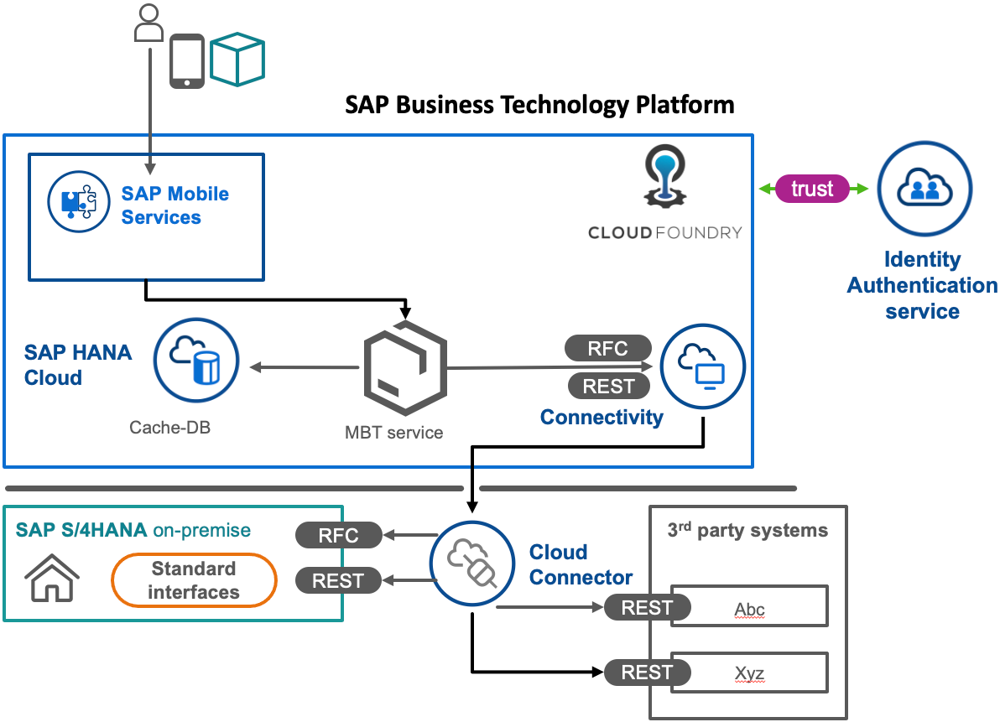

## Prerequisites
 - It might be helpful to know the [Basic concepts of OData protocol](odata-01-intro-origins) for better understanding of the topic.

## Details
### You will learn
  - Why you might want to use Mobile Back-End Tools
  - What is the relation between OData and the database
  - Why you might want to cache data for a mobile use case
  - How client registrations and filters can solve some common mobile offline challenges

---

[ACCORDION-BEGIN [Step 1: ](Introduction to Mobile Back-End Tools)]

In essence, MBT is a set of tools that allow you to generate a full featured OData web service without writing a line of code. The tools are designed to transparently convert OData models into a persistence and offer transparent OData functionality including delta calculations out of the box.

Beyond that over-simplification, MBT, as a feature of SAP Mobile Services, is a set of tools that have the target of solving several challenges which may arise in mobile application's synchronisation for offline capabilities.

Therefore they offer (optional) features, e.g. targeting integration (as a cache), download tracking, client filters and further customizations.

MBT is available as a [Marketplace extension](https://marketplace.visualstudio.com/items?itemName=SAPSE.vsc-extension-mbt) for Visual Studio Code or as part of SAP Business Application Studio in the preset for *"SAP Mobile Application"*.

[VALIDATE_1]
[ACCORDION-END]

[ACCORDION-BEGIN [Step 2: ](What you will build)]

This tutorial and it's mission will give you an introduction to possible usage of Mobile Back-end Tools [Cache Databases](https://help.sap.com/doc/f53c64b93e5140918d676b927a3cd65b/Cloud/en-US/docs-en/guides/getting-started/mbt/cache-databases.html). It is intended to give a simplified scenario with technical introduction of the technology while keeping requirements also available to trial users.

You can run so-generated OData services in SAP Business Technology Platform (BTP) or on Premise (on Apache Tomcat, TomEE or Eclipse Virgo).

  - If you plan to run the generated service in SAP BTP

    - SAP Business Application Studio will be better choice for most developers as it allows you to leverage the same environment during design time and run time.

    - The CSDL graphical modeler is only available in SAP Business Application Studio.

    - SAP Business Application Studio as a cloud solution will run out of the box with the preset for *SAP Mobile Services* and does not require a manual setup of your development environment as well as being OS agnostic

  - If you plan to run the generated service in an on premise architecture

    - You can still connect it via SAP Cloud Connector to SAP Mobile Services, but you might want to generate and develop the service in an on-premise architecture leveraging the Visual Studio Code extension for mobile back-end tools

    - For Visual Studio Code you need to [setup your own environment locally](https://help.sap.com/doc/f53c64b93e5140918d676b927a3cd65b/Cloud/en-US/docs-en/guides/getting-started/mbt/setup.html#visual-studio-code-extension)

The following diagram depicts an exemplary architecture for an MBT-based service in mobile solution context:

>In this tutorial's mission, the target system is connected as a publicly available HTTP destination. In a real-world scenario, you might connect your system in a similar way if it is a cloud system or via SAP Cloud Connector if it is an on premise system.

[DONE]
[ACCORDION-END]

[ACCORDION-BEGIN [Step 3: ](Role of CSDL and database)]

OData's declarative way of defining the model as well as operations works in a way that allows a mapping between OData operations and operations on an actual database.

Therefore, usually MBT's central starting point is the metadata file, respectively Common Schema Definition Language (CSDL) document. In SAP Business Application Studio, MBT can leverage the CSDL graphical modeler to simplify working with OData models.

On the one hand, MBT provides runnable tasks that generate a database persistence or persistence descriptor (SQL), reflecting the whole OData model. On the other hand, MBT can build a transparent OData service [based on existing database tables](https://help.sap.com/doc/f53c64b93e5140918d676b927a3cd65b/Cloud/en-US/docs-en/guides/getting-started/mbt/existing-tables.html).

Different database types are supported depending on the runtime. Following databases may e.g. be used with the tools in certain environments (Derby and H2 only for testing, please refer to documentation and/or Product Availability Matrix for official support statements):

  - SAP ASE

  - Apache Derby

  - H2 database

  - SAP HANA

  - Azure SQL or Microsoft SQL Server

  - Oracle Database

  - PostgreSQL

  - SAP SQL Anywhere

[DONE]
[ACCORDION-END]

[ACCORDION-BEGIN [Step 4: ](Benefit of caching mobile app data)]

Most of the applications built in an enterprise environment are not a stand-alone use case but must be integrated into existing ecosystems, data and business processes. Therefore, MBT offers to link and map operations on your OData service to operations on another interface.

Typically, when developing a new Mobile App, you have to choose a technology as best-fit for your architecture. You can therefore build new services on the source system, replicate data to another system or cache relevant parts of your data for easy-to-use mobile consumption.

This may come in handy if you want to build a service on top of legacy interfaces, if you want to decrease load on the referenced system or if you want to add more efficient delta capabilities for better user experience of your client apps without modifying the back-end interface.

[DONE]
[ACCORDION-END]

[ACCORDION-BEGIN [Step 5: ](Benefit of client registrations)]

In MBT, [Client Registrations](https://help.sap.com/doc/f53c64b93e5140918d676b927a3cd65b/Cloud/en-US/docs-en/guides/getting-started/mbt/client-registrations.html), beyond the user identity, reflect one specific offline data store. This identification allows precise change determination beyond timestamp-based calculation, especially in combination with client filters.

A client registration requires the service to contain an entity on which an offline store registers with a `uuid`. This ID must be sent with any upcoming user request in the HTTP-header `Client-Instance-ID`.

[DONE]
[ACCORDION-END]

[ACCORDION-BEGIN [Step 6: ](What is a Client Filter?)]

Many use cases shall allow the user to select what data can be downloaded into the client database.

This can e.g. be geographical, organisational or historical requirements. MBT therefore allows `ClientFilter`-annotated entities that are supposed to be leveraged in [custom download queries](https://help.sap.com/doc/f53c64b93e5140918d676b927a3cd65b/Cloud/en-US/docs-en/guides/getting-started/mbt/change-tracking.html#download-queries-using-filter-entities) for a specific offline store.

After registering to the service, clients can therefore upload one or more entities to the filter entity to manage data downloaded in other entities.

Example:

  - A sales representative working in one specific area on a specific day could upload a filter to only retrieve customer data with sales orders for customers in that specific area within the last two years.

[DONE]
[ACCORDION-END]

---

**Congratulations!** You have now learned about some of the features MBT offers, so you can proceed to try them out in this mission's further tutorials.

---
