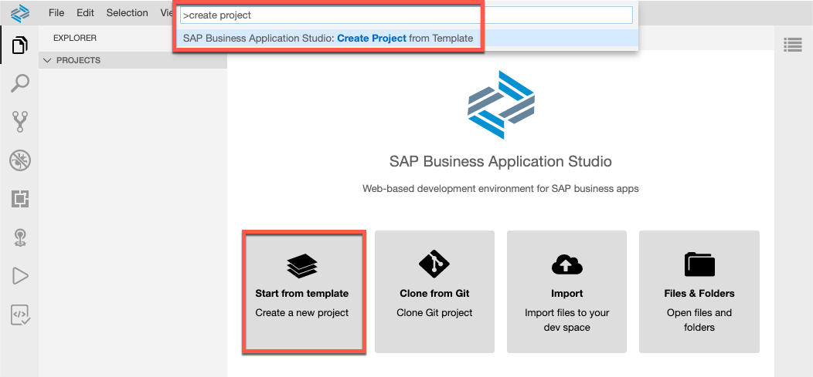
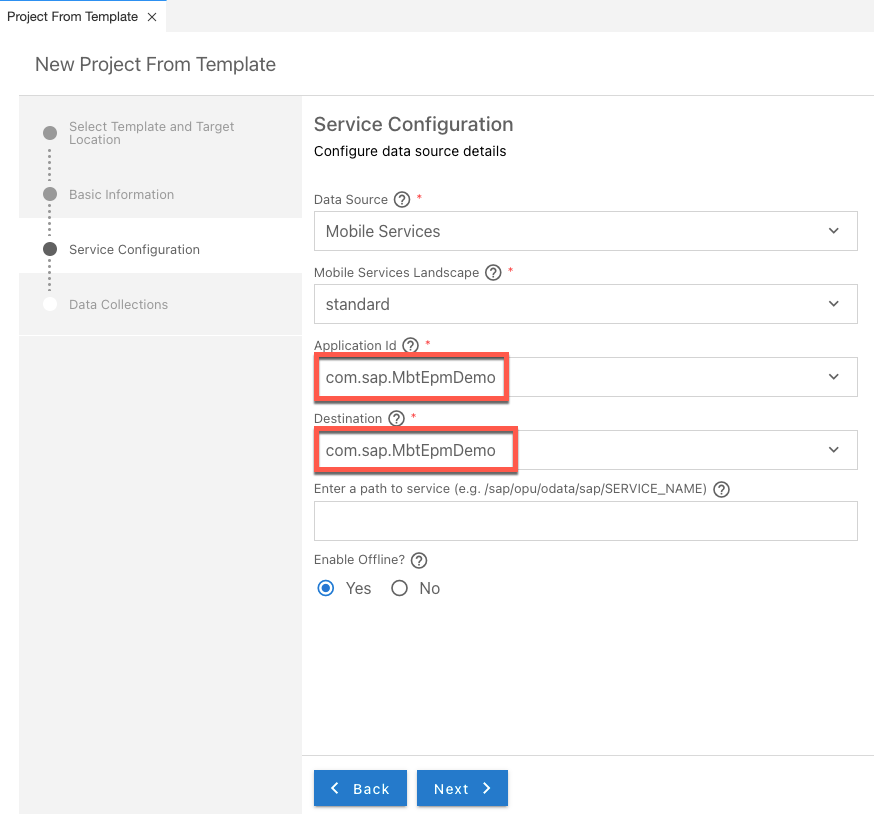
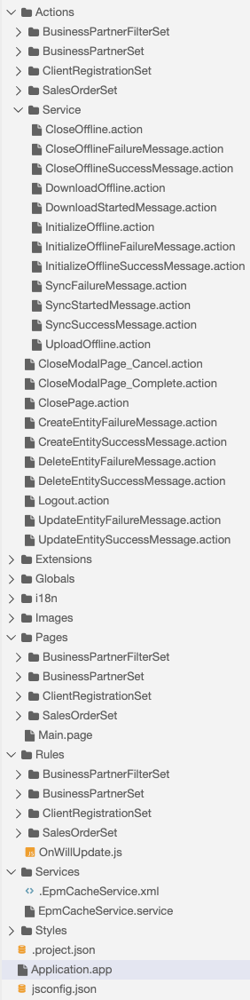

# Onboard an MDK Client to Your OData Cache Database

<!-- description --> Implement onboarding for an app based on SAP Mobile Services, mobile development kit (MDK) to your OData Cache Database based on SAP Mobile Services, mobile back-end tools (MBT)

## Prerequisites

- This tutorial requires that you have a running OData Cache Database in your space, connected to SAP Mobile Services. It is based on the project created in [Create a cached OData Service for improved Offline OData](cp-mobile-backend-tools-cache-db)
- **Tutorial** [Set Up SAP Business Application Studio for Multi-Channel Development](cp-mobile-bas-setup)
- **Download and install:** **SAP Mobile Services Client** on your [iOS](https://apps.apple.com/us/app/sap-mobile-services-client/id1413653544) or [Android](https://play.google.com/store/apps/details?id=com.sap.mobileservices.client) device (If you are connecting to `AliCloud` accounts then you will need to brand your [custom MDK client](cp-mobile-dev-kit-build-client) by allowing custom domains.)

## You will learn

- How to create an MDK sample app using a template in SAP Business Application Studio
- How to deploy an MDK app to Mobile Services and run it in mobile client
- How to onboard an MDK app to an OData Service destination in SAP Mobile Services that [requires client registrations](https://help.sap.com/doc/f53c64b93e5140918d676b927a3cd65b/Cloud/en-US/docs-en/guides/getting-started/mbt/client-registrations.html)
- How to work with client filters

## Intro

In some cases where the OData producer implements specific synchronisation logic and/or requires  download tracking on OData producer side, you might face an OData service that requires client registrations. For these services, before data can be synchronised via an `InitializeOffline.action`, a registration procedure must be sent to the OData producer.

This tutorial shall give an example how you could implement such an initialization procedure for an SAP Mobile Services, mobile development kit (MDK) client. The tutorial shares a lot of common steps with the tutorial [Quick Start with the Mobile Development Kit (MDK)](cp-mobile-dev-kit-quick-start), but focuses on another scenario. These common steps are similar, but not equal and do in case of this tutorial not cover the MDK web client. It is still recommendable to go through both tutorials if you want to learn more about MDK.

---

### Create a new MDK project in SAP Business Application Studio

This step includes creating the mobile development kit project in the editor.

1. Launch the [Dev space](cp-mobile-bas-setup) in SAP Business Application Studio.

2. From the **Welcome page**, select **Start from template** or (alternatively) select **View** &rarr; **Find Command**, type in 'Open Template' and select **Open Template Wizard**.

    

3. Select **MDK Project** and click **Start**.

    

4. In **Basic Information** step, provide the below information and click **Next**:

    | Field | Value |
    |----|----|
    | `MDK template type`| Select `CRUD` from the dropdown |
    | `Your project name` | `EpmCacheApp` |
    | `Your application name` | <default name is same as project name, you can provide any name of your choice> |

    

    >If you see *Cloud foundry token expired, continue without mobile services connection?* message, then set up the Cloud Foundry environment again by navigating to **View** menu > **Find Command**> **CF: Login to Cloud foundry** to initiate a valid session and click Start Over.

5. In **Service Configuration** step, provide or select the below information and click **Next**:

    | Field | Value |
    |----|----|
    | `Data Source` | Select `Mobile Services` from the dropdown |
    | `Mobile Services Landscape` | `standard` |
    | `Application Id` | As specified in the previous tutorial: `com.sap.MbtEpmDemo` |
    | `Destination` | As specified in the previous tutorial: `com.sap.MbtEpmDemo` |
    | `Enter a path to service` | Blank (leave it empty) |
    | `Enable Offline` | **Yes** |

    

6. In **OData Collections** step, click **Select all data collections** &rarr; **Yes**.

    

    >In [this tutorial](cp-mobile-backend-tools-cache-db), server-side configuration for this MDK app was already done.

7. After clicking **Finish**, the wizard will generate your MDK Application based on your selections and open it in a new workspace. You should now see the `EpmCacheApp` project in the workspace.

### Get familiar with generated project structure

This is how the project structure looks like within the workspace.



These are the [metadata definitions](https://help.sap.com/doc/3642933ef2e1478fb1578ef2acba4ae9/Latest/en-US/reference/schemadoc/App.schema.html) available in the editor and the format in which these metadata definitions are stored in the editor. Just to brief on some of these:

- **`InitializeOffline.action`**: This action will initialize the offline store in the MDK mobile client and will download the required data to the offline store on the mobile device. In Web environment, it will initialize the service to be consumed in online mode.

- **`DownloadOffline.action`** and **`UploadOffline.action`**: These actions are applicable to Mobile client only. Using app initialization, data is downloaded to the offline store. If you want to have the application download any updated data from the backend server or upload changed data to the backend server, these actions will be needed.

- **`InitializeOfflineSuccessMessage.action`**, **`IninitializeOfflineFailureMessage.action`** and other *Success* or *Failure* *Message actions*: These are messages showing up in the app on a successful or failure of data initialization, sync etc.

- **`Main.page`**: This is the first page of your MDK application that is shown. For this application you will use this as a launching page to get to application functionality.

- **`OnWillUpdate.js`**: This rule is applicable to Mobile client only. MDK applications automatically download updates and apply them to the client without the end-user needing to take any action. The `OnWillUpdate` rule empowers the user to run business logic before the new definitions are applied. This allows the app designer to include logic to prompt the user to accept or defer applying the new definitions based on their current activity. For example, if the end-user is currently adding new customer details or in the middle of a transaction, they will be able to defer the update. The app will prompt again the next time it checks for updates.

- **`Application.app`**: this is the main configuration file for your application from within SAP Business Application Studio. Here you set your start page (here in this tutorial, it is main.page), action settings for different stages of the application session lifecycle, push notifications, and more.

>You can find more details about [metadata definitions](https://help.sap.com/doc/69c2ce3e50454264acf9cafe6c6e442c/Latest/en-US/docs-en/reference/schemadoc/App.schema.html).

### Create rules required for the registration process

The approach for handling the service onboarding introduced here will leverage MDK Online communication to send a registration before the initial synchronization of the offline store is made.

The procedure consists of an additional MDK Service for online communication, additional actions, modified actions and rules for controlling the flow and generating randoms.  

1. Create a rule to make an app-unique `Client-Instance-ID` available to other MDK components.

    - Right-click the folder `Rules` &rarr; select **MDK: New Rule File**.

    - In the wizard select **Empty JS Rule**, then **Next**, fill the name `GetOrGenerateClientInstanceId` &rarr; **Next** and **Finish**.

    - Paste the following content to the file:

    ```JS
    var clientAPI;
    let FINAL_INSTANCE_ID_KEY = "KEY_CLIENT_INSTANCE_ID";

    /**
     * Functions checks availability of Client-Instance-ID in appSettings Key-Value Store and returns or generates, persists and returns it.
     * @returns {String} uuidv4-compliant string
     */
    export default function GetOrGenerateClientInstanceId(clientAPI) {
        let appSettings = clientAPI.nativescript.appSettingsModule;
        console.log("Rule GetOrGenerateClientInstanceId: entered");
        if(appSettings.hasKey(FINAL_INSTANCE_ID_KEY)){
            let sClientInstanceId = appSettings.getString(FINAL_INSTANCE_ID_KEY);
            console.log("Rule GetOrGenerateClientInstanceId: returning CID: " + sClientInstanceId);
            return sClientInstanceId;
        } else {
            console.log("Rule GetOrGenerateClientInstanceId: Generating CID");
            //Using unsafe simple Math UUID generation
            let sClientInstanceId = 'xxxxxxxx-xxxx-4xxx-yxxx-xxxxxxxxxxxx'.replace(/[xy]/g, function(c) {
                var r = Math.random() * 16 | 0, v = c == 'x' ? r : (r & 0x3 | 0x8);
                return v.toString(16);
            });
            console.log("Rule GetOrGenerateClientInstanceId: generated CID: " + sClientInstanceId);
            appSettings.setString(FINAL_INSTANCE_ID_KEY, sClientInstanceId);
            console.log("Rule GetOrGenerateClientInstanceId: persisted CID: " + sClientInstanceId);
            return sClientInstanceId;
        }
    }
    ```

    

2. In the same way, create another Rule `RandomInt64` and paste the following content:

    ```JS
    var clientAPI;

    /**
     * Will generate a random positive number in Int64 range
     * @returns {number} random int
     */
    export default function RandomInt64(clientAPI) {
        let min = 0, max = 2147483647;
        let iRandom = Math.floor(Math.random() * (max - min + 1) ) + min;
        console.log("Rule RandomInt64: generated Number: " + iRandom)
        return iRandom;
    }
    ```

### Create MDK Service for online and map rules

1. Duplicate Service `com_sap_MbtEpmDemo.service` and `.com_sap_MbtEpmDemo.xml` by copying and pasting them in the same directory, then rename them to `com_sap_MbtEpmDemoOnline.service` and `.com_sap_MbtEpmDemoOnline.xml` keeping the corresponding endings.

    

2. Open `com_sap_MbtEpmDemoOnline.service`, disable **Enable Offline Store** and save.

    

3. Edit `com_sap_MbtEpmDemo.service` to reflect the created rule for custom header. Therefore open `com_sap_MbtEpmDemo.service`, expand **Headers** and enter the following:

    | Name | Value |
    | ---- | ----- |
    | Client-Instance-ID | `/EpmCacheApp/Rules/GetOrGenerateClientInstanceId.js` |

    >You can alternatively open the **Object Browser** via the button next to the **Value** field (chain icon). Find and double click `GetOrGenerateClientInstanceId` from *Rules*

    

4. Expand folders **Actions** &rarr; **Service**, duplicate `InitializeOffline.action` and rename the copy to `InitializeOnline.action`.
5. Click it to open and switch **Service** through dropdown to `EpmCacheServiceOnline.service`. Remove all the **Defining Requests**.

    

6. Click `ClientRegistrationSet_CreateEntity.action` from folder `Actions` &rarr; `ClientRegistrationSet` to open the file.

7. Switch service to `/EpmCacheApp/Services/EpmCacheServiceOnline.service`

8. Via **Object Browser**, locate and insert rule `RandomInt64.js` as value for `ClientId`. Alternatively you can paste `/EpmCacheApp/Rules/RandomInt64.js`

9. In **Headers** section, add the following entry:

    | Name | Value |
    | ---- | ----- |
    | Client-Instance-ID | `/EpmCacheApp/Rules/GetOrGenerateClientInstanceId.js` |

    Your action should now look like below:

    

### Modify UI for client filter upload

To allow proper upload of a filter entity, modify `BusinessPartnerFilterSet_Create.page` to meet requirements

1. Click `BusinessPartnerFilterSet_Create.page` from **Pages** &rarr; `BusinessPartnerFilterSet` folder to open it with **MDK page Editor**.

2. Expand **Form Cell Controls** on the **Controls** pane and drag a list picker control it into the existing section.

3. Via right-click, delete the `CountryFilter` and `FilterID` elements.

4. Edit the properties of the so-created list picker control

    | Property | Value |
    | - | - |
    | Name | `CountryPicker` |
    | Caption | `Choose Country for subscription` |
    | Behavior &rarr; `IsPickerDismissedOnSelection` | **true** |

5. In **Data** section add three exemplary values for picker items (for which data exists in the referenced system)

    | Property | Value |
    | - | - |
    | `item0` | `DE` |
    | `item1` | `GB` |
    | `item2` | `US` |

    

6. Open `BusinessPartnerFilterSet_CreateEntity.action` to reflect the change made in the UI and link the rule.

   - For property `CountryFilter`, via Object Browser choose **selected value** of the picker control created (`#Page:BusinessPartnerFilterSet_Create/#Control:CountryPicker/#SelectedValue`).

   - For property `FilterId`, link the rule `RandomInt64.js` (`/EpmCacheApp/Rules/RandomInt64.js`).

    

### Put everything together and switch onboarding flow

1. Like in step 3, create a new rule. This one shall control the onboarding flow and will be triggered from `Application.app`.

    - Right-click folder **Rules** &rarr; select **MDK: New Rule File**.

    - In the wizard select **Empty JS Rule** &rarr; **Next**, fill the name  `BootstrapOffline` &rarr; **Next** &rarr; **Finish**.

    - Paste the following content to the file:

    ```JS
    let FINAL_INSTANCE_ID_KEY = "KEY_CLIENT_INSTANCE_ID";
    let FINAL_INSTANCE_ID_KEY_REGISTERED = "KEY_CLIENT_INSTANCE_ID_REGISTERED";

    export default async function BootstrapOffline(clientAPI) {
        let LOG_PREFIX = "Rule BootstrapOffline: ";
        console.log(LOG_PREFIX + "entered")
        let appSettings = clientAPI.nativescript.appSettingsModule;
        if (appSettings.hasKey(FINAL_INSTANCE_ID_KEY) && appSettings.hasKey(FINAL_INSTANCE_ID_KEY_REGISTERED)) {
            let sInstanceId = appSettings.getString(FINAL_INSTANCE_ID_KEY);
            console.log(LOG_PREFIX + "instance ID found: " + sInstanceId);
            clientAPI.executeAction("/EpmCacheApp/Actions/Service/InitializeOffline.action");
            return sInstanceId;
        } else {
            return new Promise( async function(
                fnResolve,
                fnReject
            ) {
                try{
                    console.log(LOG_PREFIX + "Registration missing or bootstrap incomplete - initializing sequence - opening online service");
                    await clientAPI.executeAction("/EpmCacheApp/Actions/Service/InitializeOnline.action");
                    console.log(LOG_PREFIX + "Online service opened - performing registration for client instance ID");
                    await clientAPI.executeAction("/EpmCacheApp/Actions/ClientRegistrationSet/ClientRegistrationSet_CreateEntity.action");
                    appSettings.setBoolean(FINAL_INSTANCE_ID_KEY_REGISTERED, true);
                    fnResolve(appSettings.getString(FINAL_INSTANCE_ID_KEY));
                    await clientAPI.executeAction("/EpmCacheApp/Actions/Service/InitializeOffline.action");
                    console.log(LOG_PREFIX + "Offline Store initialized");
                    await clientAPI.executeAction("/EpmCacheApp/Actions/Service/SyncStartedMessage.action");
                    console.log(LOG_PREFIX + "Starting Sync");
                } catch (error) {
                    fnReject(error);
                }
            });
        }
    }
    ```

2. Update `Application.app`, to run the so-created rule `BootstrapOffline` instead of initializing OData directly for event `OnDidUpdate` and `OnLaunch`.

    

### Deploy and activate the application

So far, you have learned how to build an MDK application in the SAP Business Application Studio editor. Now, deploy this application definition to Mobile Services to consume it as Mobile application.

1. Right-click `Application.app` and select **MDK: Deploy**.

    <!-- border -->

2. Select deploy target as **Mobile Services**.

      First deployment starts to Mobile Services (for Mobile application).

   <!-- border -->

   You should see successful messages for the deployment including the current revision.

### Populate the QR code for onboarding the Mobile app

SAP Business Application Studio has a feature to generate QR code for onboarding the mobile app.

Click the `Application.app` to open it in MDK Application Editor and click **Application QR Code** icon to populate the QR code.

<!-- border -->

<!-- border -->

### Run the app

> Make sure that all application instances are started in SAP BTP Cockpit, as **trial landscapes shut down applications every day**.


Follow [these steps](https://github.com/SAP-samples/cloud-mdk-tutorial-samples/blob/master/Onboarding-Android-client/Onboarding-Android-client.md) to on-board the MDK client.

Once you accept app update, you will see the list of entities on the **Main** page, **LOGOUT** and **SYNC** options at bottom of the page and Offline store is being initialized. Click either entity, it navigates to detail page, you can create, update, delete a record.

If you followed only this series of tutorials, the OData service cannot accept create, delete or update-requests on `CustomerSet` and `SalesOrderSet`. You can still modify data locally, but you will not be able to successfully synchronize.

Perform the following steps to verify all the mechanisms work.

1. Open page `ClientRegistrationSet`. You will notice that your personal user ID was populated by the backend as a result of the registration. Go back to main screen.

2. Open page `BusinessPartnerSet` or `SalesOrderSet`. You will notice that both pages are empty. Go back to the main screen.

3. Open page `BusinessPartnerFilterSet` and create a new entity by pressing the "plus" button.

    - Select **GB** and press the save button.

4. Navigate back to the main screen and press **SYNC** to perform a synchronization (flush and refresh).

5. Open page `BusinessPartnerSet` again. You will notice that business partners as well as related sales orders by customers in **GB** were downloaded.

6. Optionally, create another Filter for **DE** or **US**. You will notice, after synchronization, that corresponding data was populated in the business partner page.

    >The crucial advantage of this kind of filtering is, that the defining requests in the app remain stable so that the Offline Store definition does not have to be modified and delta tokens remain valid. Only the OData producer recognizes the filter and will send different data on the next download query for this specific registration.

    

**Congratulations!** You have created a simple MDK-Based mobile application that can register to a cache database and make use of client-filters.

---
