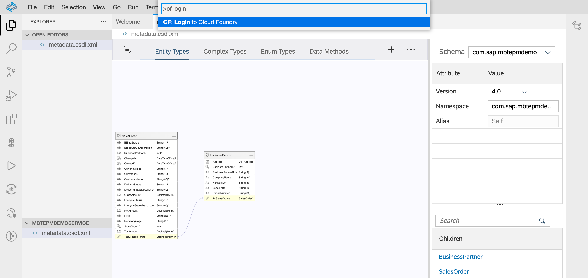
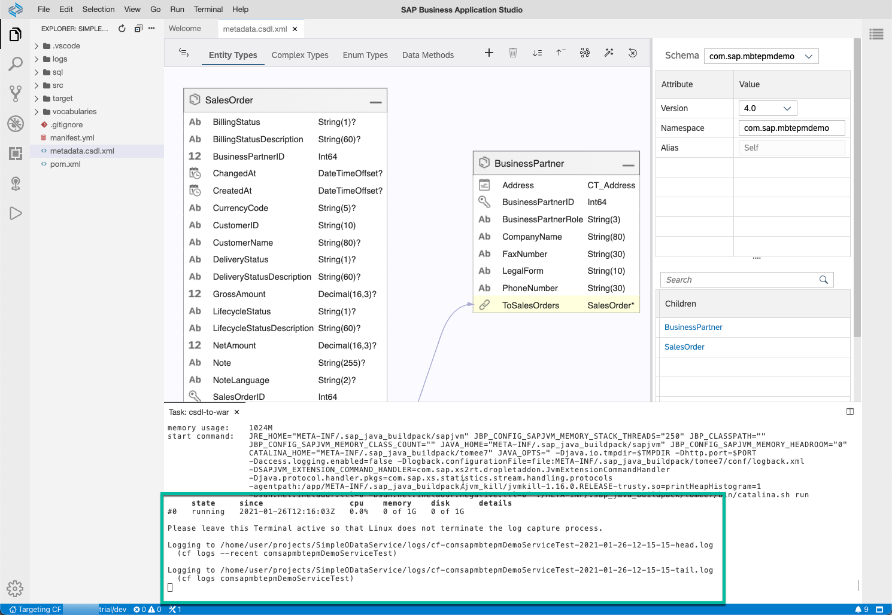
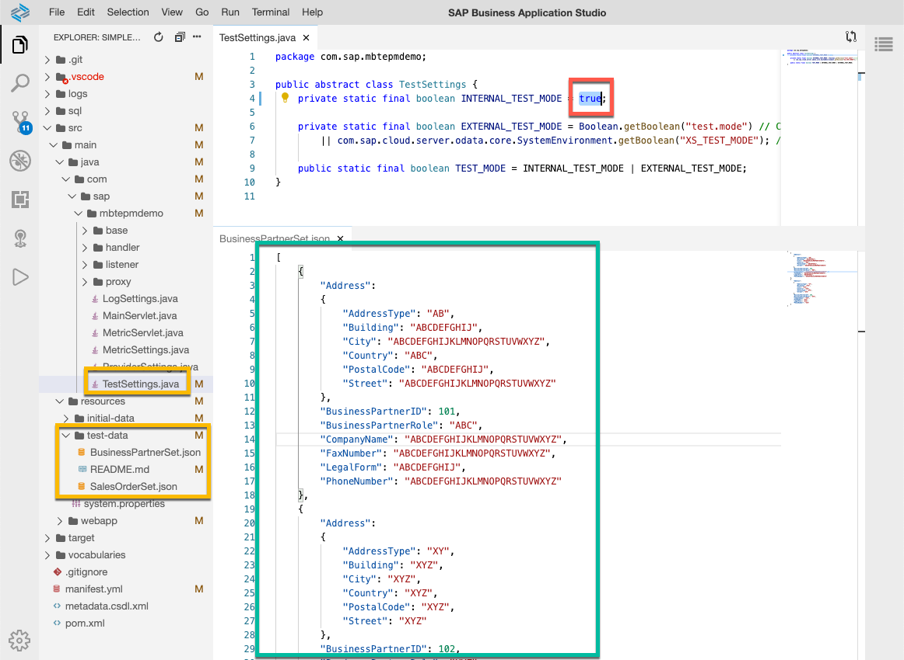
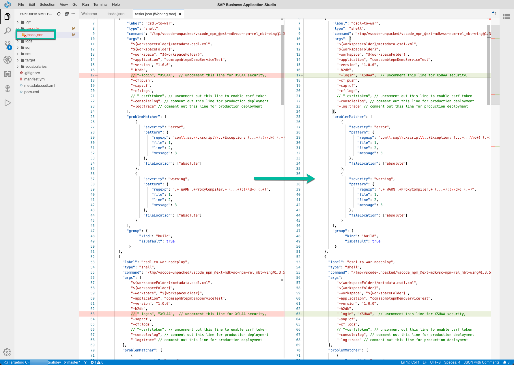
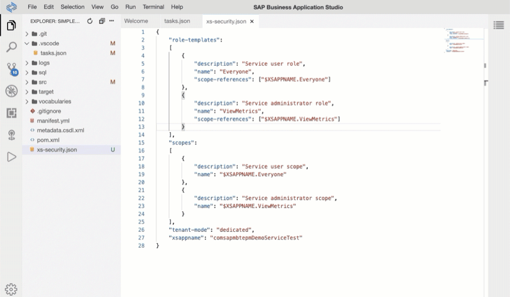

# Create a Simple OData Service with Mobile Back-End Tools
<!-- description --> Create and deploy a simple OData Service with SAP Mobile Services, mobile back-end tools (MBT).

## Prerequisites
  - [Get Ready to Develop on SAP Business Technology Platform](group.scp-1-get-ready)
  - [Setup your Business Application Studio environment for Mobile](cp-mobile-bas-setup)
  - [Learn about OData Fundamentals](odata-01-intro-origins)
  - If you want to reproduce this tutorial in Visual Studio Code instead of SAP Business Application Studio, make sure to follow [installation instructions for Visual Studio Code extension](https://help.sap.com/doc/f53c64b93e5140918d676b927a3cd65b/Cloud/en-US/docs-en/guides/getting-started/mbt/setup.html#visual-studio-code-extension) and [Cloud Foundry CLI](https://docs.cloudfoundry.org/cf-cli/install-go-cli.html) including [`multiapps` plugin](https://github.com/cloudfoundry/multiapps-cli-plugin). This tutorial does not focus on setup and specifics as it focuses on SAP Business Application Studio which is pre-configured and ready-to-go.

## You will learn
  - How OData metadata (CSDL) is structured
  - How to deploy an OData service with SAP Mobile Services, mobile back-end tools
  - How to create an app router and configure login

## Intro
The mobile back-end tools are a set of tools that enable a developer to model an OData service and generate a Java EE web application to implement the OData service, along with automatic creation of the necessary database tables within a pre-existing database schema.

In this tutorial, you will rebuild a small part of the `GWSAMPLE_BASIC` OData service publicly available on the SAP Gateway Demo system (ES5) using the XML Editor in SAP Business Application Studio. In further tutorials you can therefore extend, connect and build an app on top of it.

---

### Create metadata file in SAP Business Application Studio


1. Launch the [Dev space](cp-mobile-bas-setup) in SAP Business Application Studio.

2. Open your workspace's default projects folder.

    Select the **Explorer** panel from the **Activity Bar** and click **Open Folder**.

    Enter **projects** in the popup prompt and click **OK**.

    

3. Click **New Folder** icon next to **PROJECTS**.

    Name the folder `MBTEPMDemoService`.

    From **Activity Bar** menu, select **File** &rarr; **Open Folder**, select the folder, and click **OK**.

    > This will be the root folder of the OData service. It is important that this is specifically opened, because the following commands will deploy files to the currently opened folder.

4. Select **View** &rarr; **Command Palette...** or press [CMD] / [CTRL] + [SHIFT] + [P] keys.

5. Type `MBT` and select **MBT: New OData CSDL document (metadata)** and press **Enter**.

    

6. Answer the prompts with the following values:

    | **Prompt** | **Value** |
    |----|----|
    | Choose OData version| `4.0` |
    | Schema namespace | `com.sap.mbtepmdemo` |
    | Namespace alias name | `Self` |
    | Metadata file name | `metadata.csdl.xml` |

The command creates a blank metadata file for you that you can now open and edit with the XML editor.

### Add entities to the OData service

1. Open the file `metadata.csdl.xml`, paste the following content and save.

    ```XML
    <?xml version="1.0" encoding="utf-8"?>
    <edmx:Edmx Version="4.0" xmlns:edmx="http://docs.oasis-open.org/odata/ns/edmx" xmlns:xsi="http://www.w3.org/2001/XMLSchema-instance" xsi:schemaLocation="http://docs.oasis-open.org/odata/ns/edmx http://docs.oasis-open.org/odata/odata/v4.0/os/schemas/edmx.xsd http://docs.oasis-open.org/odata/ns/edm http://docs.oasis-open.org/odata/odata/v4.0/os/schemas/edm.xsd">
        <edmx:Reference Uri="https://oasis-tcs.github.io/odata-vocabularies/vocabularies/Org.OData.Core.V1.xml">
            <edmx:Include Namespace="Org.OData.Core.V1" Alias="Core"/>
        </edmx:Reference>
        <edmx:DataServices>
            <Schema Namespace="com.sap.mbtepmdemo" Alias="Self" xmlns="http://docs.oasis-open.org/odata/ns/edm">
                <ComplexType Name="CT_Address">
                    <Property Name="AddressType" Type="Edm.String" Nullable="false" MaxLength="2"/>
                    <Property Name="Building" Type="Edm.String" Nullable="false" MaxLength="10"/>
                    <Property Name="City" Type="Edm.String" Nullable="false" MaxLength="40"/>
                    <Property Name="Country" Type="Edm.String" Nullable="false" MaxLength="3"/>
                    <Property Name="PostalCode" Type="Edm.String" Nullable="false" MaxLength="10"/>
                    <Property Name="Street" Type="Edm.String" Nullable="false" MaxLength="60"/>
                </ComplexType>
                <EntityType Name="BusinessPartner">
                    <Key>
                        <PropertyRef Name="BusinessPartnerID"/>
                    </Key>
                    <Property Name="Address" Type="Self.CT_Address" Nullable="false"/>
                    <Property Name="BusinessPartnerID" Type="Edm.Int64" Nullable="false"/>
                    <Property Name="BusinessPartnerRole" Type="Edm.String" Nullable="false" MaxLength="3"/>
                    <Property Name="CompanyName" Type="Edm.String" Nullable="false" MaxLength="80"/>
                    <Property Name="FaxNumber" Type="Edm.String" Nullable="false" MaxLength="30"/>
                    <Property Name="LegalForm" Type="Edm.String" Nullable="false" MaxLength="10"/>
                    <Property Name="PhoneNumber" Type="Edm.String" Nullable="false" MaxLength="30"/>
                    <NavigationProperty Name="ToSalesOrders" Type="Collection(Self.SalesOrder)" Partner="ToBusinessPartner"/>
                </EntityType>
                <EntityType Name="SalesOrder">
                    <Key>
                        <PropertyRef Name="SalesOrderID"/>
                    </Key>
                    <Property Name="BillingStatus" Type="Edm.String" Nullable="true" MaxLength="1"/>
                    <Property Name="BillingStatusDescription" Type="Edm.String" Nullable="true" MaxLength="60"/>
                    <Property Name="BusinessPartnerID" Type="Edm.Int64" Nullable="false"/>
                    <Property Name="ChangedAt" Type="Edm.DateTimeOffset" Nullable="true" Precision="7"/>
                    <Property Name="CreatedAt" Type="Edm.DateTimeOffset" Nullable="true" Precision="7"/>
                    <Property Name="CurrencyCode" Type="Edm.String" Nullable="true" MaxLength="5"/>
                    <Property Name="CustomerID" Type="Edm.String" Nullable="false" MaxLength="10"/>
                    <Property Name="CustomerName" Type="Edm.String" Nullable="true" MaxLength="80"/>
                    <Property Name="DeliveryStatus" Type="Edm.String" Nullable="true" MaxLength="1"/>
                    <Property Name="DeliveryStatusDescription" Type="Edm.String" Nullable="true" MaxLength="60"/>
                    <Property Name="GrossAmount" Type="Edm.Decimal" Nullable="true" Precision="16" Scale="3"/>
                    <Property Name="LifecycleStatus" Type="Edm.String" Nullable="true" MaxLength="1"/>
                    <Property Name="LifecycleStatusDescription" Type="Edm.String" Nullable="true" MaxLength="60"/>
                    <Property Name="NetAmount" Type="Edm.Decimal" Nullable="true" Precision="16" Scale="3"/>
                    <Property Name="Note" Type="Edm.String" Nullable="true" MaxLength="255"/>
                    <Property Name="NoteLanguage" Type="Edm.String" Nullable="true" MaxLength="2"/>
                    <Property Name="SalesOrderID" Type="Edm.Int64" Nullable="false"/>
                    <Property Name="TaxAmount" Type="Edm.Decimal" Nullable="true" Precision="16" Scale="3"/>
                    <NavigationProperty Name="ToBusinessPartner" Type="Self.BusinessPartner" Nullable="false" Partner="ToSalesOrders">
                        <ReferentialConstraint Property="BusinessPartnerID" ReferencedProperty="BusinessPartnerID"/>
                    </NavigationProperty>
                </EntityType>
                <EntityContainer Name="Com_sap_mbtepmdemoService">
                    <EntitySet Name="BusinessPartnerSet" EntityType="Self.BusinessPartner">
                        <NavigationPropertyBinding Path="ToSalesOrders" Target="SalesOrderSet"/>
                    </EntitySet>
                    <EntitySet Name="SalesOrderSet" EntityType="Self.SalesOrder">
                        <NavigationPropertyBinding Path="ToBusinessPartner" Target="BusinessPartnerSet"/>
                    </EntitySet>
                </EntityContainer>
            </Schema>
        </edmx:DataServices>
    </edmx:Edmx>
    ```

2. Take note of the different parts in the CSDL document:

    - Top declarations and references
      
        - XML namespace declarations
  
        - EDMX references for annotation includes relevant for MBT
    
    - `DataServices` part
        
        - The `DataServices` declaration describes the actual data model of the service
        
        - In the given example, it contains a complex type, two entity types and an entity container for the entity set declarations

### Generate and run the service

1. Select **View** &rarr; **Command Palette...** (or press **Shift + CTRL/CMD + P**).

2. Type `cf login`, click **CF: Login to Cloud Foundry**

    Follow the prompts to select your organization and space by clicking on the home button in the lower-left corner.

    

    >If the correct **Cloud Foundry Organization** and **Space** are not shown, take care to use the correct API endpoint in the dialog. In case of doubt, double check the `API Endpoint` in **BTP Cockpit**, **Overview** of the **Subaccount**, e.g. `https://api.cf.us10-001.hana.ondemand.com`.

3. Select **View** &rarr; **Command Palette...** (or press **Shift + CTRL/CMD + P**).

4. Type `MBT` and select **MBT: Create tasks.json file**.

5. In the input dialog, confirm the options as given in the following table:

    | Prompt | Value |
    |----|----|
    | `Generate odata service for Cloud Foundry`| *Yes, Cloud Foundry* |
    | `applicationName` | `MbtEpmDemoService` |
    | `application version` | *1.0.0* |
    | `Generate odata service with Spring Boot style` | *No (Java EE style)* |
    | `Select database type` | *H2 Database* |
    | `Target folder where generate odata service` | *Keep Default* |
    | `Do you want to add MTA support` | *Yes* |
    | `Enter the module name of MTA project` | `srv` |
    | `...` (no description) | `/home/user/projects/MBTEPMDemoService/metadata.csdl.xml` or the path that matches your previously created file |
    | `Should enable offline feature when run 'setup-mobile-app' task?` | *Yes* (not relevant for this tutorial) |
    | `Should assign features for MDK app when run 'setup-mobile-app' task?` | *Yes* (not relevant for this tutorial) |
    | `Enter the Cloud Foundry destination service name` | `MbtEpmDemoService-destination` |

    > Make sure to not use underscores in the application name

    > The selected database type will be corresponding, explicit database for the MBT OData service.  For the sake of simplicity, for this tutorial's purpose an embedded H2 database type is used, which is not supported for productive use.

6. Select **Terminal** &rarr; **Run Task** and select the task `csdl-to-war-nodeploy` to generate and build the service.

7. Open the file `manifest.yml` in `srv` folder and add a line with `random-route: true`.

    Check with the following example for reference:

    ```YAML manifest.yml
    ---
    applications:
      - # application
        name: MbtEpmDemoService
        # module
        path: deploy/odata-service-1.0.0.war
        random-route: true
        buildpacks:
          # buildpack
          - sap_java_buildpack
        instances: 1
        memory: 2G
        disk: 2G
        env:
          TARGET_RUNTIME: tomee7
          # jco-config
          USE_JCO: false
          # log-config
          # [console]
          # debug-opts
          # [none]
        # services:
          # db-service
          # [h2db]
          # destination-service
          # [no-destinations]
    ```
    >When inserting snippets to YAML files, pay attention to the indentation of the lines, as YAML is indentation-sensitive. Before pasting, make sure that your cursor is set to beginning of an empty line.

    >**Hint:** You can indent multiple line back or forward by selecting them and pressing **(Shift + TAB)** or **(TAB)** on your keyboard.

8. Select **Terminal** &rarr; **Run Task** and select the task `csdl-to-war` to generate, deploy and run the service to your space. You can observe in the Terminal if the run was successful.

    

9.  (Optional) If you want your service to load test data, you can switch `TEST_MODE` to `true`. Therefore you execute task `csdl-to-war-test` or edit the variable in file `TestSettings.java` from your workspace at the path `srv` &rarr; `src` &rarr; `main` &rarr; `java` &rarr; `com` &rarr; `sap` &rarr; `mbtepmdemo` &rarr; `TestSettings.java`.

    You can also edit the generated test data inside the folder `srv` &rarr; `src` &rarr; `main` &rarr; `resources` &rarr; `test-data`. The test data is stored in the `.json` files. You will have to re-run the build task `csdl-to-war` again to reflect this change.

    

>In case you struggle on generating the service, you might find the [documentation](https://help.sap.com/doc/f53c64b93e5140918d676b927a3cd65b/Cloud/en-US/docs-en/guides/getting-started/mbt/generating.html) helpful.

**At this point you created an OData service that you can already use for prototyping, development etc. In the next step you will learn how to implement authentication, which might not be necessary for pure testing purposes.**

### Configure authentication and app router

If the service shall be accessible independently and authentication is required, an Authorization and Trust Management Service (XSUAA) service binding as well as an app router will be required for your OData service. If you are looking for more details of this service, you might want to go through [Secure a Basic Node.js App with the Authorization and Trust Management Service (XSUAA)](cp-cf-security-xsuaa-create) tutorial and its references, already covering the same for another application type.

1. Open the file ``tasks.json`` from folder ``.vscode`` and uncomment the line `"-login", "XSUAA",` in the configurations `csdl-to-war` and `csdl-to-war-nodeploy` as shown below.

    >Sometimes it may happen that, due to automatic formatting in SAP Business Application Studio, comments may have been removed from `tasks.json` file. You can try to restore them with **Undo** [CMD] / [CNTRL] + [Z]. Alternatively, recreate the file or add the parameters `"-login", "XSUAA",` manually. Take care of the parameter order, as some parameters are interpreted as a pair, key (prefixed with "-") and value.

    

    >Due to this change, after generating the service again it will not only require XSUAA authentication, but also create a default ``xs-security.json`` file.

2. To update the project and generate the file, select **Terminal** &rarr; **Run Task** and select the task `csdl-to-war-nodeploy`.

    >In your workspace, a file ``xs-security.json`` will be generated inside `srv` folder. It contains standard roles and corresponding scopes: ``Everyone`` (for users) as well as ``ViewMetrics`` and ``Àdministrator`` (for administrators). Later you will reference this file to create a service instance via MTA.

3. Right-click the `srv` folder in your workspace, then click **New Folder**, name it `approuter` and confirm with **OK**.

4. Right-click the folder `approuter` in your workspace and select **New File** for two files `package.json` and `xs-app.json` with the content below.

    ```JSON package.json
    {
      "name": "approuter",
      "dependencies": {
        "@sap/approuter": "*"
      },
      "scripts": {
        "start": "node node_modules/@sap/approuter/approuter.js"
      }
    }
    ```

    >You may ignore the error `The "@sap/approuter" package is not installed(npm_dependency_issues)`. This is expected and not an issue.

    ```JSON xs-app.json
    {
      "routes": [{
        "source": "^/",
        "target": "/",
        "destination": "odata"
      }]
    }
    ```

    

5. Finally, the XSUAA service binding need to be reflected for deployment. You can achieve this by adding them to the ``manifest.yml`` that was generated in your workspace.

    - To bind the XSUAA service instance, add the following lines:

    ```YAML
        services:    
          - MbtEpmDemoService-xsuaa
    ```

    >**Important:** Do not execute the ``csdl-to-war`` tasks anymore. First we need to create the service instances via the Multi-Target-Archive. When they are created, you can work with ``csdl-to-war`` again in order to push just the OData service. This will be quicker than deploying the full MTA.

    For reference check the full `manifest.yml` file content.

    ```YAML
    ---
    applications:
      -
        # application
        name: MbtEpmDemoService
        # module
        path: deploy/odata-service-1.0.0.war
        random-route: true
        buildpacks:
          # buildpack
          - sap_java_buildpack
        instances: 1
        memory: 2G
        disk: 2G
        env:
          TARGET_RUNTIME: tomee7
          # jco-config
          USE_JCO: false
          # log-config
          # [console]
          # debug-opts
          # [none]
        services:    
          - MbtEpmDemoService-xsuaa
          # db-service
          # [h2db]
          # destination-service
          # [no-destinations]
    ```

6. Create a MTA deployment descriptor.

    Duplicate the file `mta.yaml` by copying and pasting the file in the same directory.

    Rename the copied file to `mtad.yaml`.

    Replace the content with the following to include all required resources:

    ```YAML mtad.yaml
    ---
    ID: MbtEpmDemoService
    _schema-version: '3.3'
    version: 1.0.0
    modules:
      - # application
        name: MbtEpmDemoService
        # module
        path: srv/deploy/odata-service-1.0.0.war
        type: java
        parameters:    
          memory: 1G
          disk: 2G
          instances: 1
        properties:    
          SET_LOGGING_LEVEL: '{odata: TRACE, sap.xs.console: TRACE, sap.xs.odata: TRACE}'
          TARGET_RUNTIME: tomee7
        requires:
          - name: MbtEpmDemoService-xsuaa
        # provide default-url to be re-used for the app router's destination
        provides:
          - name: mbtepmdemo-odata
            properties:
              url: ${default-url}
      - # approuter
        name: MbtEpmDemoService-approuter
        type: nodejs
        path: srv/approuter
        requires:
          - name: MbtEpmDemoService-xsuaa
          # require
          - name: mbtepmdemo-odata
        parameters:
          buildpack: nodejs_buildpack
          instances: 1
          memory: 128M
        properties:
        # reference the provided URL for automatic linking
          destinations: >
            [
              {"name":"odata","url":"~{mbtepmdemo-odata/url}","forwardAuthToken": true}
            ]  
    resources:
      - name: MbtEpmDemoService-xsuaa
        type: org.cloudfoundry.managed-service   
        parameters:
          service: xsuaa
          service-plan: application
          path: srv/xs-security.json
    ```

7. Click **Terminal** &rarr; **New Terminal**, type `cf deploy` and press Enter.

    Wait for the deployment to be finished. MTA deployment may take a while, especially when it is initially deployed. When the command terminates it will show a terminal output like the following (green box).

    

8.  Open and examine the OData service using the approuter via your browser.

    Find the application route either from the terminal output (red box) or via the applications in BTP Cockpit, as in the following screenshot.

    

    >Take note: If you created your Cloud Foundry environment in a `-00x`-environment (like e.g. `us10-001`, currently used in SAP BTP Trial by default), you might receive the error `"The redirect_uri has an invalid domain"`. If this is the case, you will have to allow-list your application uri in the `xs-security.json` file and re-run `cf deploy`. 

    ```json
      [...]
      "tenant-mode": "dedicated",
      "xsappname": "MbtEpmDemoService",
      "oauth2-configuration":
      {
          "redirect-uris": ["https://*.us10-001.hana.ondemand.com/**", "https://*.eu10-004.hana.ondemand.com/**", "https://*.eu10.hana.ondemand.com/**"]
      },
    ```

---

**Congratulations!** You just created a stand-alone OData service with Mobile Back-End Tools. You can now continue with the next Tutorial of the mission to configure the service as Cache-DB and integrate data from another system.

---
