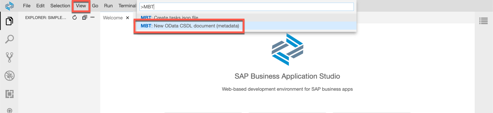
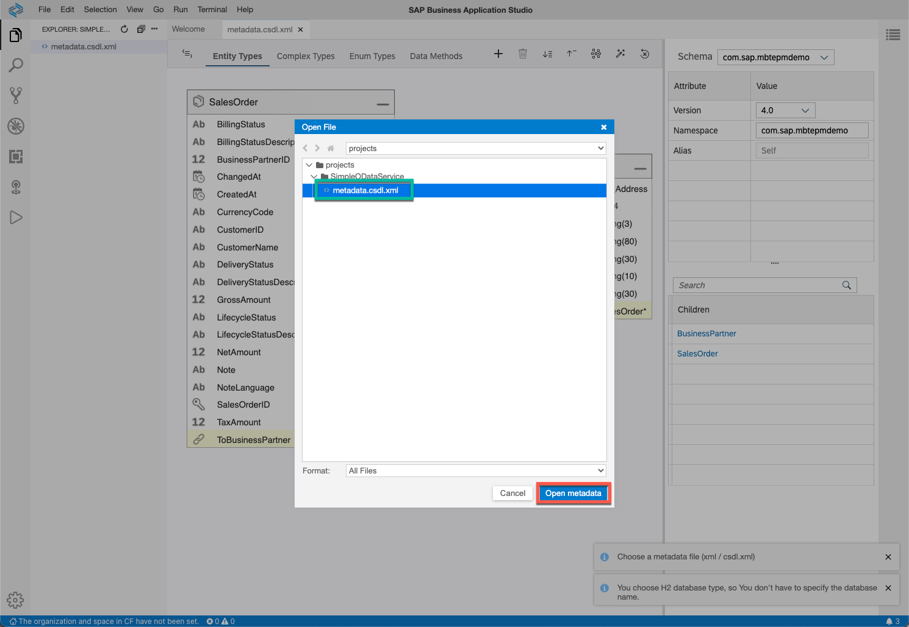

## Prerequisites
  - [Get Ready to Develop on SAP Business Technology Platform](group.scp-1-get-ready)
  - [Setup your Business Application Studio environment for Mobile](cp-mobile-bas-setup)

## Details
### You will learn
  - How to use graphical editor to create your OData model
  - How to deploy an OData service with SAP Mobile Services, mobile back-end tools
  - How to create an app router and configure login

The mobile back-end tools is a set of tools that enable a developer to model an OData service and generate a Java EE web application to implement the OData service, along with automatic creation of the necessary database tables within a pre-existing database schema.

In this tutorial, you will rebuild a small part of the `GWSAMPLE_BASIC` OData service publicly available on the SAP Gateway Demo system (ES5), using the MBT graphical modeler in SAP Business Application Studio. In further tutorials you can therefore extend, connect and build an app on top of it.

---

[ACCORDION-BEGIN [Step 1: ](Create metadata file in SAP Business Application Studio)]

1. Launch the [Dev space](cp-mobile-bas-setup) in SAP Business Application Studio.

2. Assuming you start from your `projects` folder, select **File** &rarr; **New Folder**.

    Name the folder `MBTEPMDemoService`.

    Select **File** &rarr; **Open**, select the folder, and click **Open**.

3. Select **View** &rarr; **Find Command**.

4. Select **MBT: New OData CSDL document (metadata)** and press **Enter**.

    

5. Answer the prompts with the following values:

    | **Prompt** | **Value** |
    |----|----|
    | Choose OData version| `4.0` |
    | Schema namespace | `com.sap.mbtepmdemo` |
    | Namespace alias name | `Self` |
    | Metadata file name | `metadata.csdl.xml` |

The command creates a blank metadata file for you that you can now open and edit with the graphical editor.

[DONE]
[ACCORDION-END]

[ACCORDION-BEGIN [Step 2: ](Add entities to the OData service)]

In the end of this step, the content of the CSDL file is linked, so you do not have to build all the properties. Anyway you are encouraged to create complex type, entities, some properties and especially the association yourself in Graphical Modeler.

1. Having **complex Types** selected, click the **+** button to add a new complex type with name ``CT_Address``

    

2. From **Complex Types**, select the type ``CT_Address`` and click **+** to add the following properties:

    | **Name** | **Type** | **Max Length** |
    |----|----|----|
    | ``AddressType`` | *String* | *2* |
    | ``Building`` | *String* | *10* |
    | ``City`` | *String* | *40* |
    | ``Country`` | *String* | *3* |
    | ``PostalCode`` | *String* | *10* |
    | ``Street`` | *String* | *60* |

    

3. Having **Entity Types** selected, press the **+** button to add a new entity type with name ``BusinessPartner``

    

4. Select the entity and click **+** to add the following properties:

    | **Name** | **Type** | **Max Length** |
    |----|----|----|
    | ``Address`` | ``CT_Address`` |  |
    | ``BusinessPartnerRole`` | *String* | *3* |
    | ``CompanyName`` | *String* | *80* |
    | ``LegalForm`` | *String* | *10* |
    | ``PhoneNumber`` | *String* | *30* |
    | ``FaxNumber`` | *String* | *30* |
    | ``EmailAddress`` | *String* | *255* |

5. Repeat sub-step **3** and **4** for the entity ``SalesOrder`` and the following attributes. Tick the checkbox **nullable** for the marked properties.

    | **Name** | **Type** | **Max Length** | **Nullable** |
    |----|----|----|----|
    | ``Note`` | *String* | *255* | *tick* |
    | ``NoteLanguage`` | *String* | *2* | *tick* |
    | ``CustomerID`` | *String* | *10* | *tick* |
    | ``CustomerName`` | *String* | *80* | *tick* |
    | ``CurrencyCode`` | *String* | *5* | *tick* |
    | ``GrossAmount`` | *Decimal* | *Precision: 16, Scale: 3* | *tick* |
    | ``NetAmount`` | *Decimal* | *Precision: 16, Scale: 3* | *tick* |
    | ``TaxAmount`` | *Decimal* | *Precision: 16, Scale: 3* | *tick* |
    | ``LifecycleStatus`` | *String* | *1* | *tick* |
    | ``LifecycleStatusDescription`` | *String* | *60* | *tick* |
    | ``BillingStatus`` | *String* | *1* | *tick* |
    | ``BillingStatusDescription`` | *String* | *60* | *tick* |
    | ``DeliveryStatus`` | *String* | *1* | *tick* |
    | ``DeliveryStatusDescription`` | *String* | *60* | *tick* |
    | ``CreatedAt`` | ``DateTimeOffset`` | | *tick* |
    | ``ChangedAt`` | ``DateTimeOffset`` | | *tick* |

6. Having ``BusinessPartner`` selected, click **+** and add the **Navigation to** ``SalesOrders`` with the following properties:

    - Tick *Navigation* and *Collection*
    - Name: ``ToSalesOrders``
    - Type: ``SalesOrder``
    - Partner: ``ToBusinessPartner``

    This will create the association as well as the bi-directional navigation properties.

    

> You can also open the CSDL file as XML document instead of the graphical editor - either by clicking **Switch Editor** (icon) button in the top left corner of the graphical modeler or by right-clicking the file &rarr; **Open with** &rarr; **Code Editor**. This is especially helpful if you want to import parts of existing models or perform advanced changes which exceed the graphical modeler's capabilities.

  <details>
  <summary> **Click to expand** to see the full CSDL file.</summary>

```XML
<?xml version="1.0" encoding="utf-8"?>
<edmx:Edmx Version="4.0" xmlns:edmx="http://docs.oasis-open.org/odata/ns/edmx" xmlns:xsi="http://www.w3.org/2001/XMLSchema-instance" xsi:schemaLocation="http://docs.oasis-open.org/odata/ns/edmx http://docs.oasis-open.org/odata/odata/v4.0/os/schemas/edmx.xsd http://docs.oasis-open.org/odata/ns/edm http://docs.oasis-open.org/odata/odata/v4.0/os/schemas/edm.xsd">
    <edmx:Reference Uri="https://oasis-tcs.github.io/odata-vocabularies/vocabularies/Org.OData.Core.V1.xml">
        <edmx:Include Namespace="Org.OData.Core.V1" Alias="Core"/>
    </edmx:Reference>
    <edmx:DataServices>
        <Schema Namespace="com.sap.mbtepmdemo" Alias="Self" xmlns="http://docs.oasis-open.org/odata/ns/edm">
            <ComplexType Name="CT_Address">
                <Property Name="AddressType" Type="Edm.String" Nullable="false" MaxLength="2"/>
                <Property Name="Building" Type="Edm.String" Nullable="false" MaxLength="10"/>
                <Property Name="City" Type="Edm.String" Nullable="false" MaxLength="40"/>
                <Property Name="Country" Type="Edm.String" Nullable="false" MaxLength="3"/>
                <Property Name="PostalCode" Type="Edm.String" Nullable="false" MaxLength="10"/>
                <Property Name="Street" Type="Edm.String" Nullable="false" MaxLength="60"/>
            </ComplexType>
            <EntityType Name="BusinessPartner">
                <Key>
                    <PropertyRef Name="BusinessPartnerID"/>
                </Key>
                <Property Name="Address" Type="Self.CT_Address" Nullable="false"/>
                <Property Name="BusinessPartnerID" Type="Edm.Int64" Nullable="false"/>
                <Property Name="BusinessPartnerRole" Type="Edm.String" Nullable="false" MaxLength="3"/>
                <Property Name="CompanyName" Type="Edm.String" Nullable="false" MaxLength="80"/>
                <Property Name="FaxNumber" Type="Edm.String" Nullable="false" MaxLength="30"/>
                <Property Name="LegalForm" Type="Edm.String" Nullable="false" MaxLength="10"/>
                <Property Name="PhoneNumber" Type="Edm.String" Nullable="false" MaxLength="30"/>
                <NavigationProperty Name="ToSalesOrders" Type="Collection(Self.SalesOrder)" Partner="ToBusinessPartner"/>
            </EntityType>
            <EntityType Name="SalesOrder">
                <Key>
                    <PropertyRef Name="SalesOrderID"/>
                </Key>
                <Property Name="BillingStatus" Type="Edm.String" Nullable="true" MaxLength="1"/>
                <Property Name="BillingStatusDescription" Type="Edm.String" Nullable="true" MaxLength="60"/>
                <Property Name="BusinessPartnerID" Type="Edm.Int64" Nullable="false"/>
                <Property Name="ChangedAt" Type="Edm.DateTimeOffset" Nullable="true" Precision="7"/>
                <Property Name="CreatedAt" Type="Edm.DateTimeOffset" Nullable="true" Precision="7"/>
                <Property Name="CurrencyCode" Type="Edm.String" Nullable="true" MaxLength="5"/>
                <Property Name="CustomerID" Type="Edm.String" Nullable="false" MaxLength="10"/>
                <Property Name="CustomerName" Type="Edm.String" Nullable="true" MaxLength="80"/>
                <Property Name="DeliveryStatus" Type="Edm.String" Nullable="true" MaxLength="1"/>
                <Property Name="DeliveryStatusDescription" Type="Edm.String" Nullable="true" MaxLength="60"/>
                <Property Name="GrossAmount" Type="Edm.Decimal" Nullable="true" Precision="16" Scale="3"/>
                <Property Name="LifecycleStatus" Type="Edm.String" Nullable="true" MaxLength="1"/>
                <Property Name="LifecycleStatusDescription" Type="Edm.String" Nullable="true" MaxLength="60"/>
                <Property Name="NetAmount" Type="Edm.Decimal" Nullable="true" Precision="16" Scale="3"/>
                <Property Name="Note" Type="Edm.String" Nullable="true" MaxLength="255"/>
                <Property Name="NoteLanguage" Type="Edm.String" Nullable="true" MaxLength="2"/>
                <Property Name="SalesOrderID" Type="Edm.Int64" Nullable="false"/>
                <Property Name="TaxAmount" Type="Edm.Decimal" Nullable="true" Precision="16" Scale="3"/>
                <NavigationProperty Name="ToBusinessPartner" Type="Self.BusinessPartner" Nullable="false" Partner="ToSalesOrders">
                    <ReferentialConstraint Property="BusinessPartnerID" ReferencedProperty="BusinessPartnerID"/>
                </NavigationProperty>
            </EntityType>
            <EntityContainer Name="Com_sap_mbtepmdemoService">
                <EntitySet Name="BusinessPartnerSet" EntityType="Self.BusinessPartner">
                    <NavigationPropertyBinding Path="ToSalesOrders" Target="SalesOrderSet"/>
                </EntitySet>
                <EntitySet Name="SalesOrderSet" EntityType="Self.SalesOrder">
                    <NavigationPropertyBinding Path="ToBusinessPartner" Target="BusinessPartnerSet"/>
                </EntitySet>
            </EntityContainer>
        </Schema>
    </edmx:DataServices>
</edmx:Edmx>
```
</details>

&nbsp;

[DONE]
[ACCORDION-END]


[ACCORDION-BEGIN [Step 3: ](Generate and run the service)]

1. Log in to Cloud Foundry and follow the prompts to select your organization and space by clicking on the home button in the lower-left corner.

    

2. Select **View** &rarr; **Find Command** (or press **Shift + CTRL/CMD + P**).

3. Type `MBT` and select **MBT: Create tasks.json file**.

4. In the input dialog, confirm the options as given in the following table:

    > **Important:** Replace the application name `<subaccount>_<space>_` with a string actually representing your BTP sub account and space, e.g. `d00xxxxxtrial_dev_`:

    | Prompt | Value |
    |----|----|
    | `Generate odata service for Cloud Foundry`| *Yes, Cloud Foundry* |
    | `applicationName` | `<subaccount>_<space>_MbtEpmDemoService` |
    | `application version` | *1.0.0* |
    | `Generate odata service with Spring Boot style` | *No (Java EE style)* |
    | `Select database type` | *H2 Database* |
    | `Target folder where generate odata service` | *Keep Default* |
    | `Do you want to add MTA support` | *No* |

    > The selected database type will be corresponding, explicit database for the MBT OData service.  For the sake of simplicity, for this tutorial's purpose an embedded H2 database type is used, which is not supported for productive use.

5. In the last step of the wizard, an **Open File** dialog comes up. Locate `metadata.csdl.xml` file from your workspace and click **Open Metadata**.

    

6. Select **Terminal** &rarr; **Run Task** and select the task `csdl-to-war` to generate, deploy and run the service to your space. You can observe in the Terminal if the run was successful.

    

7. If you want your service to load test data, you can switch `TEST_MODE` to `true`. Then open the file `TestSettings.java` from your workspace at the path `src` &rarr; `main` &rarr; `java` &rarr; `com` &rarr; `sap` &rarr; `mbtepmdemo` &rarr; `TestSettings.java`.

    You can also edit the generated test data inside the folder `src` &rarr; `main` &rarr; `resources` &rarr; `test-data`. The test data is stored in the `.json` files. You will have to re-run the build task `csdl-to-war` again to reflect this change.

    

>In case you struggle on generating the service, you might find the [documentation](https://help.sap.com/doc/f53c64b93e5140918d676b927a3cd65b/Cloud/en-US/docs-en/guides/getting-started/mbt/generating.html) helpful.

[DONE]
[ACCORDION-END]

[ACCORDION-BEGIN [Step 4: ](Configure authentication and app router)]

If the service shall be accessible independently and authentication is required, an Authorization and Trust Management Service (XSUAA) service binding as well as an app router will be required for your OData service. If you are looking for more details of this service, you might want to go through [Secure a Basic Node.js App with the Authorization and Trust Management Service (XSUAA)](cp-cf-security-xsuaa-create) tutorial and its references, already covering the same for another application type.

1. Open the file ``tasks.json`` from folder ``.vscode`` and uncomment the line `"-login", "XSUAA",` in **every** of the configurations as shown below.

    

    >Due to this change, after generating the service again it will not only require XSUAA authentication, but also create a default ``xs-security.json`` file.

2. To update the project and generate the file, select **Terminal** &rarr; **Run Task** and select the task `csdl-to-war`.

    >In your workspace a file ``xs-security.json`` will appear that contains two basic roles: ``Everyone`` (for users) and ``ViewMetrics`` (for administrators). Use this file to create a service instance via Terminal in the next sub-step.

3. Select **Terminal** &rarr; **New Terminal** and type the following after the *$* character.

    > **Important:** In the snippet below, replace ``<subaccount>_<space>_MbtEpmDemoService`` with your actual application name which is defined in ``tasks.json`` or `manifest.yml`.

    > This will be the service instance name and should look like e.g. `d00xxxxxtrial_dev_MbtEpmDemoService-xsuaa`.

    ```Terminal
    cf create-service xsuaa application <subaccount>_<space>_MbtEpmDemoService-xsuaa -c xs-security.json
    ```

    

    >The service will require an app router to handle authentication for it. The following sub-steps will show you how.

4. Select a file in project root -- e.g. `metadata.csdl.xml` -- then select **File** &rarr; *New Folder* and name it ``approuter``.

    >The file selection is only intended to make sure the folder is created in the project root.

5. Right-click the folder `approuter` in your workspace and select **New File** for two files `package.json` and `xs-app.json` with the content below.

    ```JSON package.json
    {
      "name": "approuter",
      "dependencies": {
        "@sap/approuter": "*"
      },
      "scripts": {
        "start": "node node_modules/@sap/approuter/approuter.js"
      }
    }
    ```

    ```JSON xs-app.json
    {
      "routes": [{
        "source": "^/",
        "target": "/",
        "destination": "odata"
      }]
    }
    ```

    

6. Find out application **route** for your deployment via deployment log. When scrolling up the terminal log after executing the task ``csdl-to-war``, you can find the application route as in the screenshot below. Mark and copy it to your clipboard, then save it somewhere for later as it will be required for the next sub-step.

    

    The application **route** is the same that you can also obtain when investigating on your application in SAP BTP Cockpit, within your space.

7. Finally, the app router and XSUAA service binding need to be reflected for deployment. You can achieve this by adding them to the ``manifest.yml`` that was generated in your workspace.

    - Initially, your `manifest.yml` should look like this, just having a different application **name** instead of `<subaccount>_<space>_MbtEpmDemoService`.

    ```YAML
    applications:
      - buildpack: sap_java_buildpack
        name: <subaccount>_<space>_MbtEpmDemoService
        path: target/odata-service-1.0.0.war
        env:
          TARGET_RUNTIME: tomee7
    ```

    >When inserting these snippets, pay attention to the indentation of the lines, as YAML is indentation-sensitive. Before pasting, make sure that your cursor is set to beginning of an empty line.

    >**Hint:** You can indent multiple line back or forward by selecting them and pressing **(Shift + TAB)** or **(TAB)** on your keyboard.

    - To bind the XSUAA service instance, add the following lines, replacing `<subaccount>_<space>_MbtEpmDemoService` with your own application name:

    ```YAML
        services:    
          - <subaccount>_<space>_MbtEpmDemoService-xsuaa
    ```

    - To also reflect your app router, add the following lines, adjusting the URL path to what you copied in the last sub-step. Don't forget to replace ``<subaccount>_<space>_MbtEpmDemoService`` with your actual application name in all the instance names.

    ```YAML
      - name: <subaccount>_<space>_MbtEpmDemoService-approuter
        path: approuter
        buildpacks:    
          - nodejs_buildpack
        memory: 128M
        services:    
          - <subaccount>_<space>_MbtEpmDemoService-xsuaa
        env:
          destinations: >
            [
              {
                "name":"odata",
                "url":"https://<subaccount><space>mbtepmdemoservice.cfapps.eu10.hana.ondemand.com",
                "forwardAuthToken": true
              }
            ]
    ```

    

    >**Important:** Temporarily, do not execute ``csdl-to-war`` tasks anymore, as those might remove the destination in *manifest.yml*. Instead use ``cf push`` from *Terminal*.

    >**Hint:** Make sure that the service name bound to both application as well as app router exactly match the name you defined in sub-step 3 when you created the XSUAA service instance via terminal.

      <details>
      <summary> **Click to expand** - for reference please see the following manifest file content. </summary>

      - Each occurrence of `d00xxxxxtrial_dev_MbtEpmDemoService` must be replaced with your application **name**

      - The URL `https://d00xxxxxtrialdevmbtepmdemoservice.cfapps.eu10.hana.ondemand.com` must be changed to reflect your application **route**.

    ```YAML
    ---
    applications:
      - buildpack: sap_java_buildpack
        name: d00xxxxxtrial_dev_MbtEpmDemoService
        path: target/odata-service-1.0.0.war
        env:    
          SET_LOGGING_LEVEL: '{odata: TRACE, sap.xs.console: TRACE, sap.xs.odata: TRACE}'
          TARGET_RUNTIME: tomee7
        services:    
          - d00xxxxxtrial_dev_MbtEpmDemoService-xsuaa
      - name: d00xxxxxtrial_dev_MbtEpmDemoService-approuter
        path: approuter
        buildpacks:    
          - nodejs_buildpack
        memory: 128M
        services:    
          - d00xxxxxtrial_dev_MbtEpmDemoService-xsuaa
        env:
          destinations: >
            [
              {
                "name":"odata",
                "url":"https://d00xxxxxtrialdevmbtepmdemoservice.cfapps.eu10.hana.ondemand.com",
                "forwardAuthToken": true
              }
            ]
    ```
      </details>

8. Execute ``cf push`` from Terminal to deploy everything including the binding defined in ``manifest.yml``

    

    **Congratulations!** You have successfully created a standalone OData service and are now ready for client development. Alternatively you can continue customizing it into a cache database.

[VALIDATE_4]
[ACCORDION-END]


---
