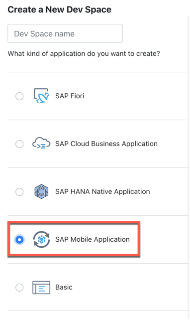
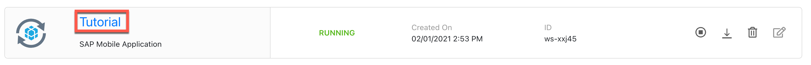
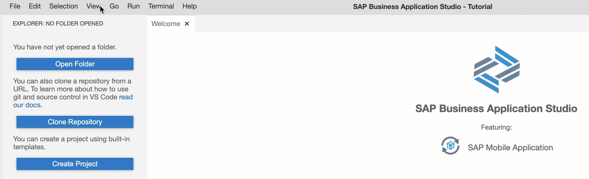
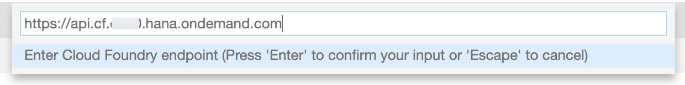
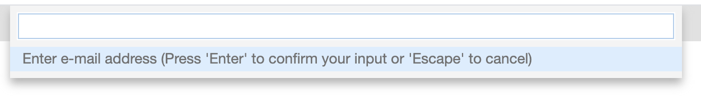
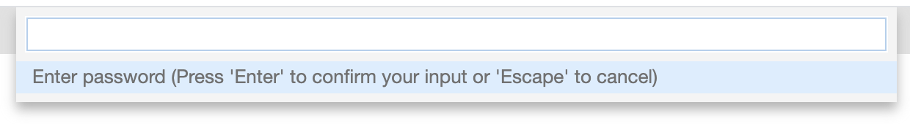
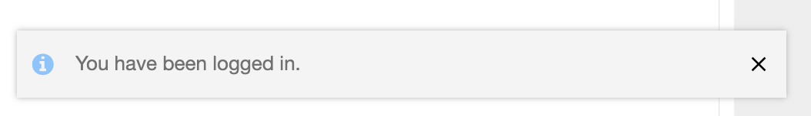
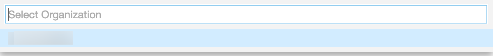
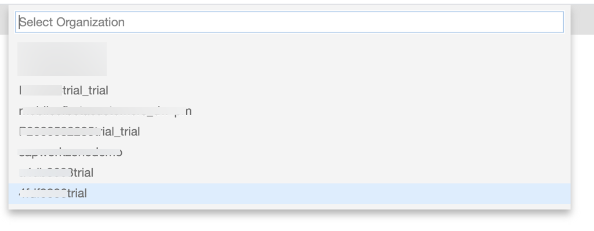
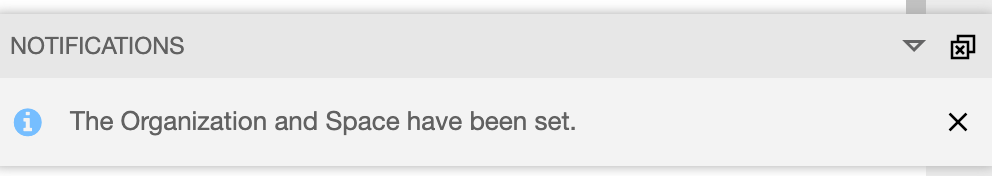

## Prerequisites
 - [Set Up SAP Business Application Studio for Development](appstudio-onboarding).

## Details
### You will learn
  - How to create a development space in SAP Business Application Studio
  - How to connect to your Cloud Foundry target in SAP Business Application Studio

SAP Business Application Studio is the next-generation web-based IDE hosted on SAP Business Technology Platform (BTP) in the Cloud Foundry environment. In this tutorial, you will set up your SAP Business Application Studio for developing mobile apps.

---

[ACCORDION-BEGIN [Step 1: ](Create a development space)]

1. Log into your Business Application Studio and click **Create Dev Space**.

2. Select **SAP Mobile Application**, enter a name (`Tutorial`) for your dev space and click **Create Dev Space**.

    !

    Your dev space will be created and the status will change to running.

3. Click your dev space's name to open it.

    !

[VALIDATE_1]
[ACCORDION-END]

[ACCORDION-BEGIN [Step 2: ](Configure Cloud Foundry environment)]

1. Navigate to **View** menu > **Find Command**> **CF: Login to Cloud foundry**.

    !

2. Verify the URL and **Click Enter** on your keyboard.

    !

    > SAP Business Application Studio pre-populates the end-point of the environment it is running in.

    > If you want to connect to a different environment, modify the API endpoint by copying it from your target SAP BTP account:

    > *SAP BTP Cockpit &rarr; Sub-account &rarr; API Endpoint*

3. When prompted, **enter your e-mail address** you use to log in to the SAP BTP account.

    !

4. **Enter your password** you use to log in to the SAP BTP account.

    !

    > Upon successful login, you will see a toast message at the bottom right corner of your screen.

    > !

5. Select the organization in which you have enabled Mobile Services.

    !

6. Select the space in which you have enabled Mobile Services.

    !

    > Upon successful setup, you will see a toast message at the bottom right corner of your screen.

    > !

[DONE]
[ACCORDION-END]

---

Congratulations, you have successfully configured SAP Business Application Studio to build multi-channel applications.

You can now build [**Mobile Development Kit apps**](mission.mobile-dev-kit-get-started) or [**SAP Mobile Cards apps**](https://developers.sap.com/tutorial-navigator.html?tag=products:content-and-collaboration/sap-mobile-cards) using Business Application studio.

---
