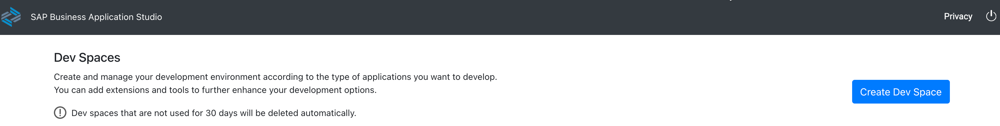
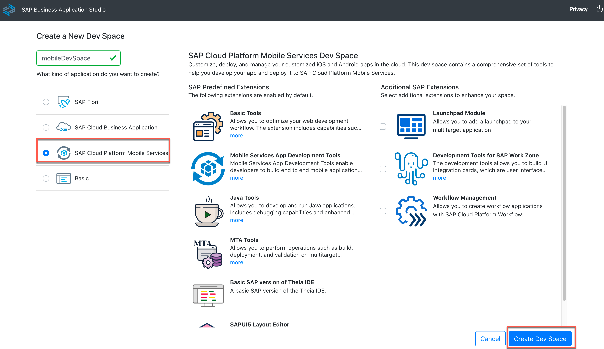
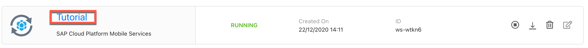
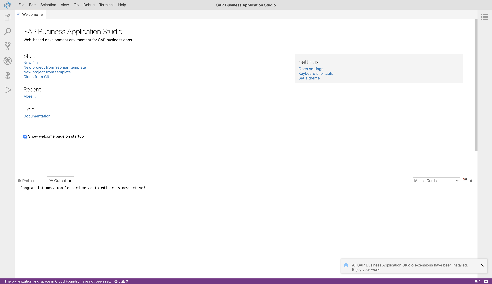
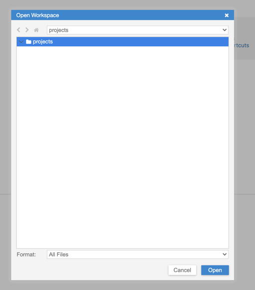
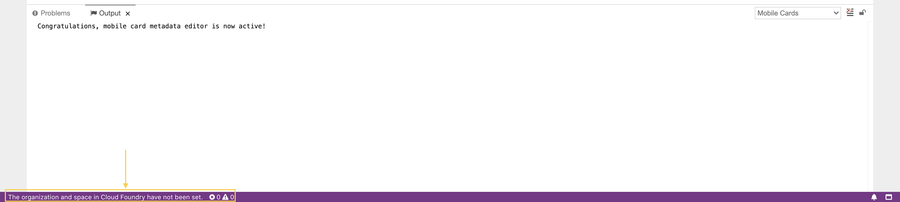
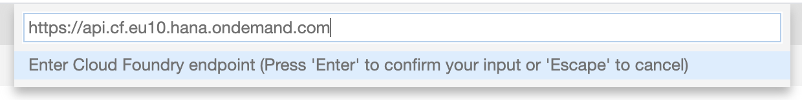
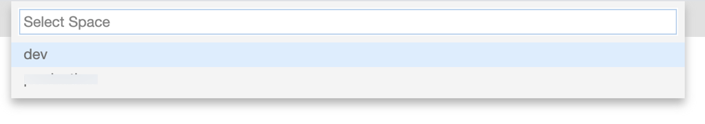
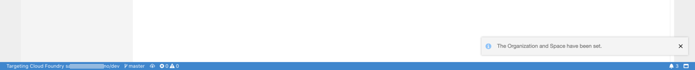

## Prerequisites
 - You have [Set Up SAP Business Application Studio for Development](appstudio-onboarding).

## Details
### You will learn
  - How to create a development space in SAP Business Application Studio
  - How to connect to your Cloud Foundry target in SAP Business Application Studio

SAP Business Application Studio is the next-generation web-based IDE hosted on SAP Cloud Platform in the Cloud Foundry environment. In this tutorial, you will set up your SAP Business Application Studio for developing mobile apps.

---

[ACCORDION-BEGIN [Step 1: ](Create a development space)]

Log into your Business Application Studio and click **Create Dev Space**.

!

Select SAP Cloud Platform Mobile Services, enter a name (`Mobile`) for your dev space and click **Create**.

!

Your dev space will be created and the status will change to running.

[VALIDATE_1]
[ACCORDION-END]

[ACCORDION-BEGIN [Step 2: ](Set up your workspace)]

Click your dev space's name to open it.

!

Wait till your workspace loads completely.

There is no workspace opened yet, click **Open Workspace**.

!

Select projects, Click **Open**.

!

[DONE]
[ACCORDION-END]

[ACCORDION-BEGIN [Step 3: ](Configure Cloud Foundry environment)]

In the bottom left corner of your status bar, click the message **`The organization and space in Cloud Foundry have not been set.`**.

!

Verify the URL and **Click Enter** on your keyboard.

!

> SAP Business Application Studio pre-populates the end-point of the environment it is running in. If you want to connect to a different environment, modify the API endpoint by copying it from your target SAP Cloud Platform account: *SAP Cloud Platform Cockpit &rarr; Sub-account &rarr; API Endpoint*

When prompted, **enter your e-mail address** you use to log in to the SAP Cloud Platform account.

!

Next, **enter your password** you use to log in to the SAP Cloud Platform account.

!

Upon successful login, you will see a toast message at the bottom right corner of your screen.

!

Select the organisation in which you have enabled Mobile Services.

!

 Select the space in which you have enabled Mobile Services.

!

Upon successful setup, you will see a toast message at the bottom right corner of your screen, and the bottom status bar will highlight CF connection details.

!

[DONE]
[ACCORDION-END]

**Congratulations!** You have successfully configured SAP Business Application Studio to build mobile apps.

---
