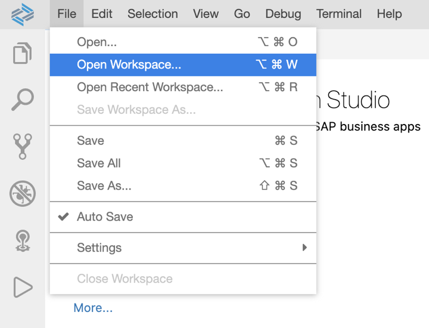

## Prerequisites
 - [You have access to Business Application Studio](https://developers.sap.com/tutorials/appstudio-onboarding.html)

## Details
### You will learn
  - How to create a development space in Business Application Studio
  - How to connect to your Cloud Foundry Target in SAP Business Application Studio

SAP Business Application Studio is the next generation web based IDE hosted on SAP Cloud Platform in the Cloud Foundry environment. In this tutorial, you will learn how to create your first card in SAP Business Application Studio. [Click here to learn more about SAP Mobile Cards in SAP Business Application Studio.](https://help.sap.com/doc/f53c64b93e5140918d676b927a3cd65b/Cloud/en-US/docs-en/guides/getting-started/mck/mck-2-2-development-bas.html)

---

[ACCORDION-BEGIN [Step 1: ](Create a Development Space)]

Log into your Business Application Studio and click **Create Dev Space**.

!

Select SAP Cloud Platform Mobile Services, enter a name (`mobileDevSpace`) for your dev space and click **Create**.

!

Your dev space will be created and the status will change to running.

[VALIDATE_1]
[ACCORDION-END]

[ACCORDION-BEGIN [Step 2: ](Set Up Your Workspace)]

Click on your dev space's name to open it.

!

Wait till your workspace loads completely.

!

In the menu bar, go to File &rarr; Open Workspace, click **Open Workspace**.

!

Select projects, Click **Open**.

!

[DONE]
[ACCORDION-END]

[ACCORDION-BEGIN [Step 3: ](Configure Cloud Foundry Target)]

In the bottom left corner of your status bar, click on the message **`The organization and space in Cloud Foundry have not been set.`**.

!

Verify the URL and **Click Enter** on your keyboard.

!

> SAP Business Application Studio pre-populates the end-point of the environment it is running in.

When prompted, **enter your e-mail address** you use to log in to the SAP Cloud Platform account.

!

Next, **enter your password** you use to log in to the SAP Cloud Platform account.

!

Upon successful login, you will see a toast message at the bottom right corner of your screen.

!

 Select the organisation in which you have enabled Mobile Services.

!

 Select the space in which you have enabled Mobile Services.

!

Upon successful setup, you will see a toast message at the bottom right corner of your screen, and the bottom status bar will highlight CF connection details.

!

[DONE]
[ACCORDION-END]

**Congratulations!** You have completed this tutorial.

You have configured SAP Business Application Studio to build mobile apps.

---
