## Details
### You will learn
 - How to implement actions within a SAP Mobile Card

 Using the sample data service that is part of SAP Cloud Platform Mobile Services, you will connect to a system and add an action to approve or reject a sales order.

 Actions allow users to trigger a REST call from a card. This tutorial will change the status of a sales order from the sample service. After completing the tutorial, you can change the sales order's status from **New** to **Approved** or **Rejected**. This allows you to build simple workflow solutions for the mobile device.

 

---

[ACCORDION-BEGIN [Step 1: ](Get familiar with real world use case)]

A company wants to allow managers to approve sales order on a mobile device.

The action card could be of type Automatic Instance Card to load all requests in a certain state. So, the query asks for all items of the sales order that need to be approved. Each item of the result set would show as a single card. The manager can then select an action on the card and approve or reject the sales order.

[DONE]
[ACCORDION-END]

[ACCORDION-BEGIN [Step 2: ](Create a new action card)]

Make sure you have logged into SAP Cloud Platform Mobile Services cockpit. Navigate to **SAP Mobile Cards** to look into Mobile Cards configuration.

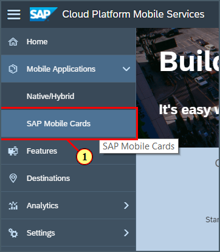

Click the **Create a New Card** icon.

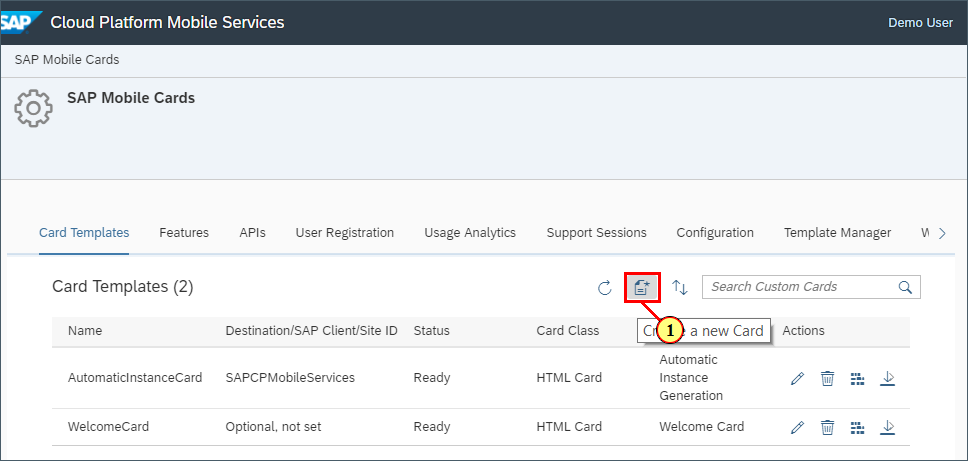

Provide the required information as per below.

| Field | Value |
|----|----|
| **Name** | `ActionCard` |
| **Destination** | `com.sap.edm.sampleservice.v2` |
| **Template Source** | `Template Manager` |
| **HTML Template** | `Sample Sales Orders Template` |

> If you see a pop-up, click OK.

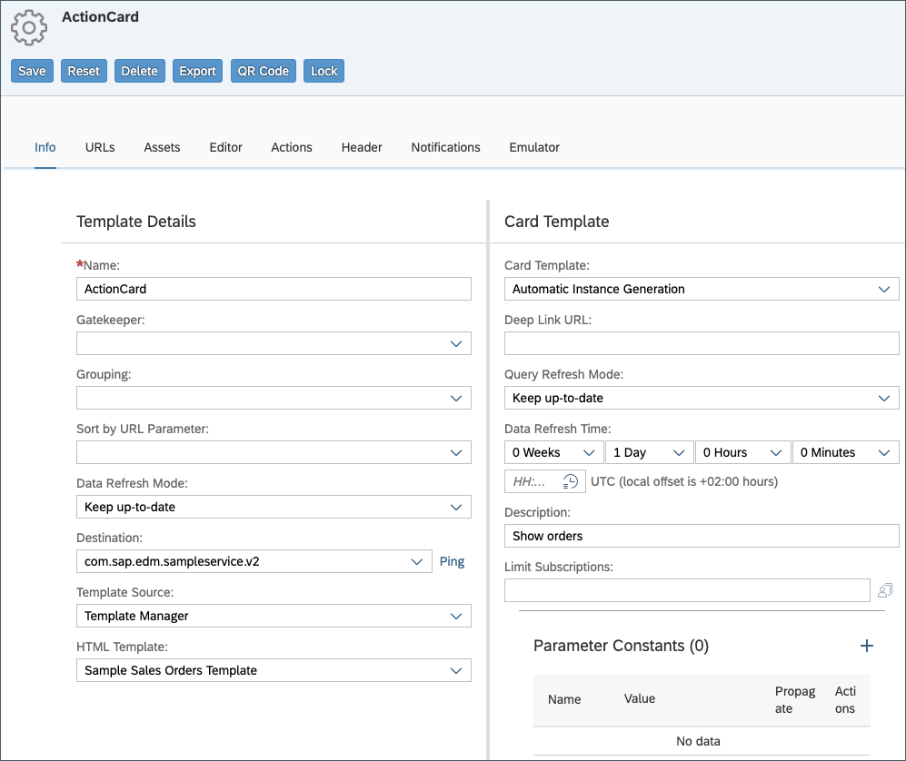

>**Destination** defines the root for the queries that are going to be used for this card.

Navigate to the **URLs** tab to view data endpoint definitions.

Click **Get Data** to retrieve sample JSON response based on a defined URL.

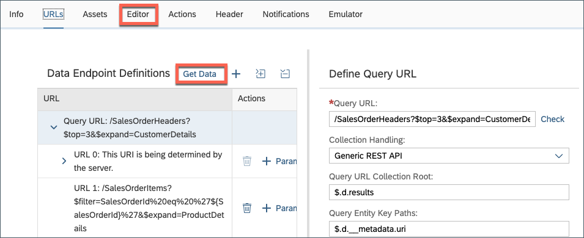

Click **URL 0** to view the sample JSON response. You can format JSON data by clicking on icon as per below screenshot.

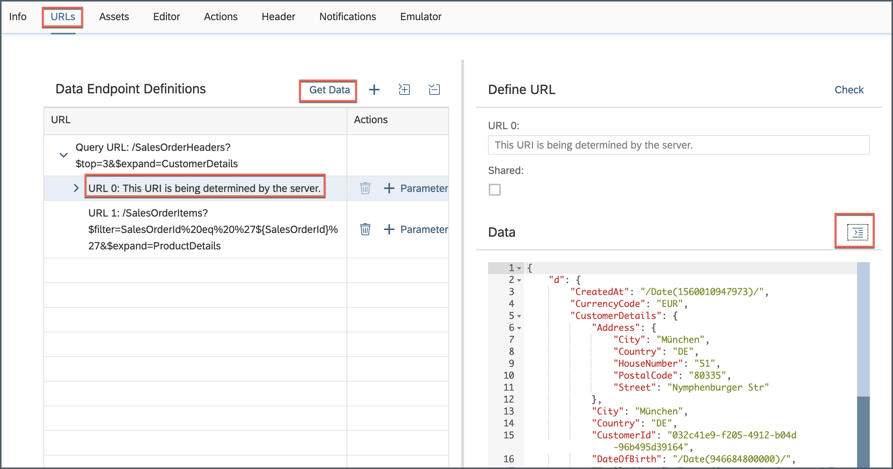

[DONE]
[ACCORDION-END]

[ACCORDION-BEGIN [Step 3: ](Update the card's title)]

Click **Editor**.

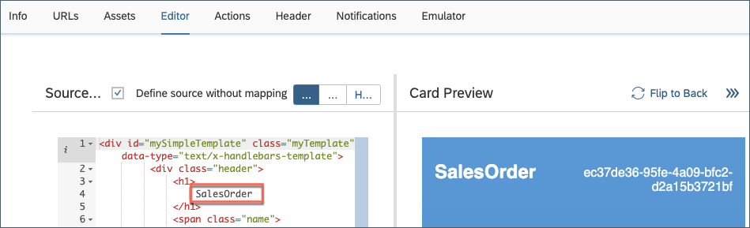

Replace `SalesOrder` text with **Action Card** to rename the title of card. This helps later to identify the right card on the device.

[DONE]
[ACCORDION-END]

[ACCORDION-BEGIN [Step 4: ](Add actions to the card)]

Navigate to the **Actions** tab to start adding actions to the card.

>The default value for behavior for an action is **INACTIVE**. An inactive action does not allow any new actions after a successful call.

Click the **+** icon to add an action and provide the required information:

| Field | Value |
|----|----|
| **Name** | `Accept` |
| **Label** | `accept` |
| **URL** | `/SalesOrderHeaders('${SalesOrderId}')` |
| **HTTP Method** | `PATCH` |
| **Action Body** | `{"LifeCycleStatusName": "Accepted", "LifeCycleStatus": "A"}` |

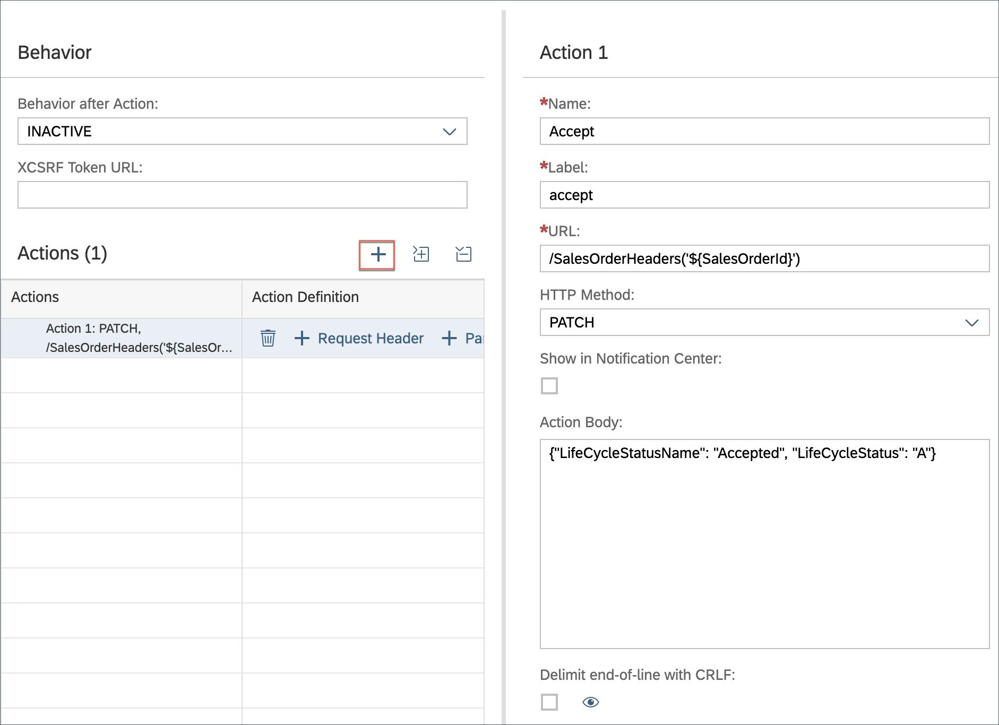

>Here `URL` will call the current `SalesOrder` which the card represents.

>`${SalesOrderId}` defines the placeholder where the current `SalesOrderID` will be put in from the OData JSON response. 

>**Action Body** will patch the `SalesOrder` status from `New` to `Accepted` if the action is triggered.

Now, create a **Request Header** for the `Accept` action. Click the **+** icon and provide the required information:

| **Field** | **Value** |
|----|----|
| **X-Requested-With** | `XMLHttpRequest` |

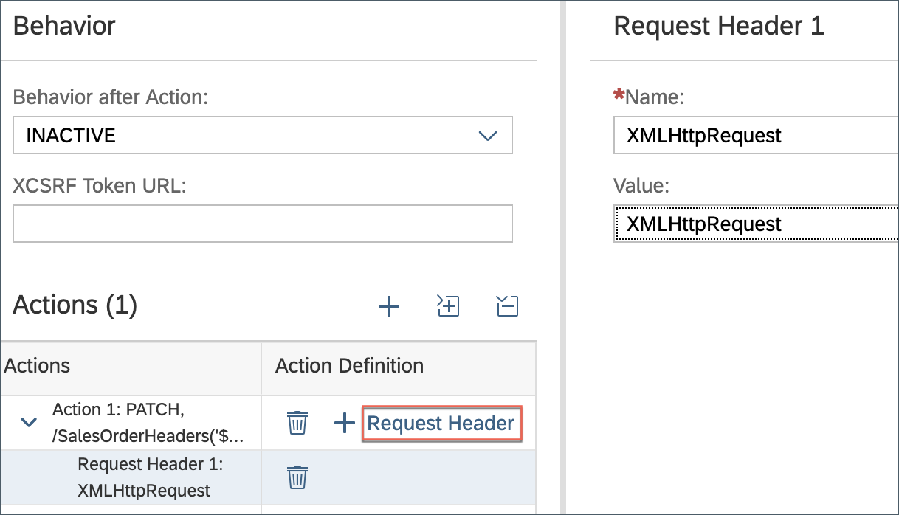

Click the **+** icon to create another action and provide the required information:

| Field | Value |
|----|----|
| **Name** | `Reject` |
| **Label** | `reject` |
| **URL** | `/UpdateSalesOrderStatus?id='${SalesOrderId}'&newStatus='R'`|
| **HTTP Method** | `POST` |

>This `URL` will call the OData function `UpdateSalesOrderStatus`, which is implemented on the sample service and passes the current  `SalesOrderID` as well as the new status. This is the second option to change a `SalesOrder` status.

Now, create a **Request Header** for the `Reject` action. Click the **+** icon and provide the required information:

| Field | Value |
|----|----|
| **X-Requested-With** | `XMLHttpRequest` |

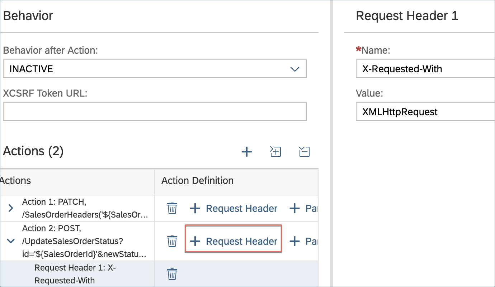

Click **Save**.

[VALIDATE_1]
[ACCORDION-END]

[ACCORDION-BEGIN [Step 5: ](Subscribe to the card in SAP Mobile Cards)]

In the SAP Mobile Cards application, click **More** | **Subscriptions**.

Click `ActionCard` under the **All** tab.

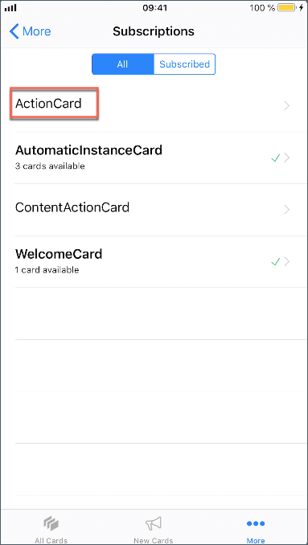

Click **Subscribe** to activate the `ActionCard` subscription.

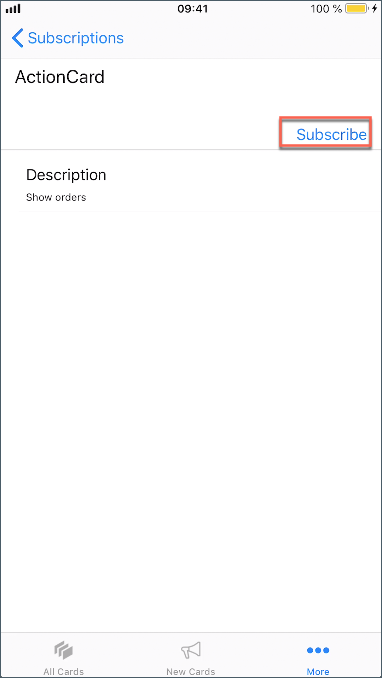

Click **All Cards** or **New Cards** to view this card.

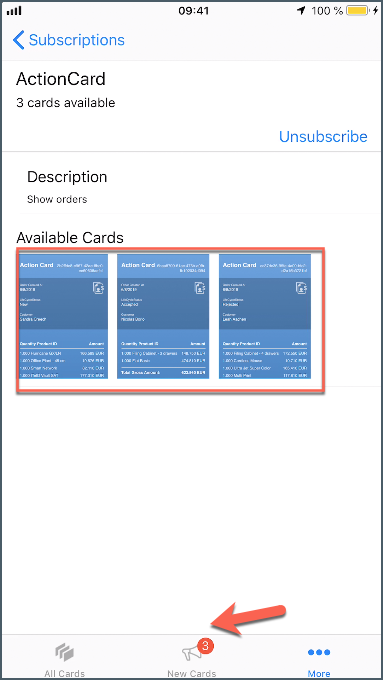

Click the **action icon** at the bottom-left to open the available actions on the card and click **accept** to accept the card and trigger a change in status.

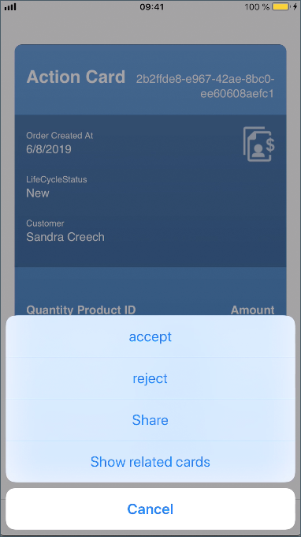

You will see a successful completion of the REST call.

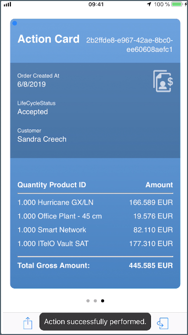

>In case of any failure, you can navigate to **Activity Logs** by clicking on **More** | **Logs** and then look in **Pending Actions**.

>

[DONE]
[ACCORDION-END]

[ACCORDION-BEGIN [Step 6: ](Cross verify status update in the back end)]

In the Mobile Services cockpit, click **Connectivity** under the **Features** tab.

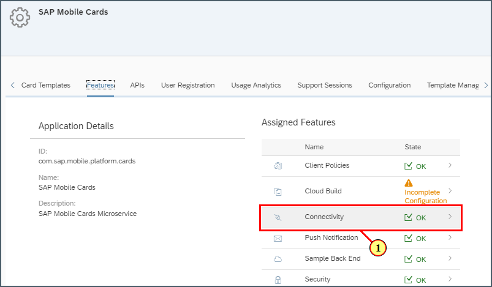

Click the **OData destination test** icon.

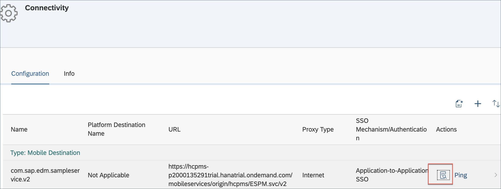

Click **Next**.

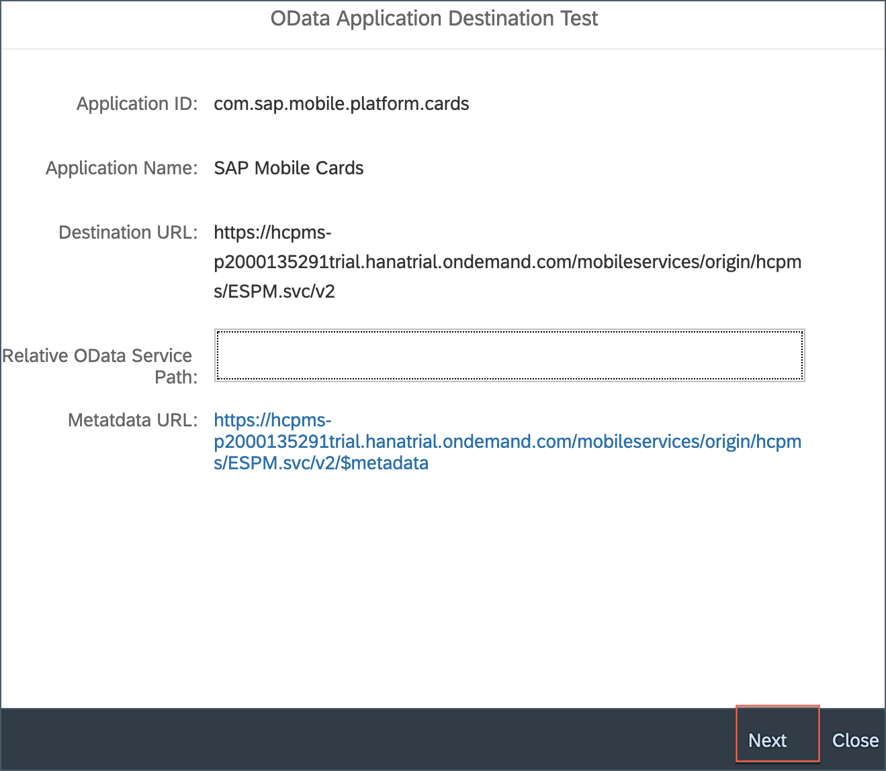

Make sure entity set `SalesOrderHeaders` is selected. Here you can see entity data.

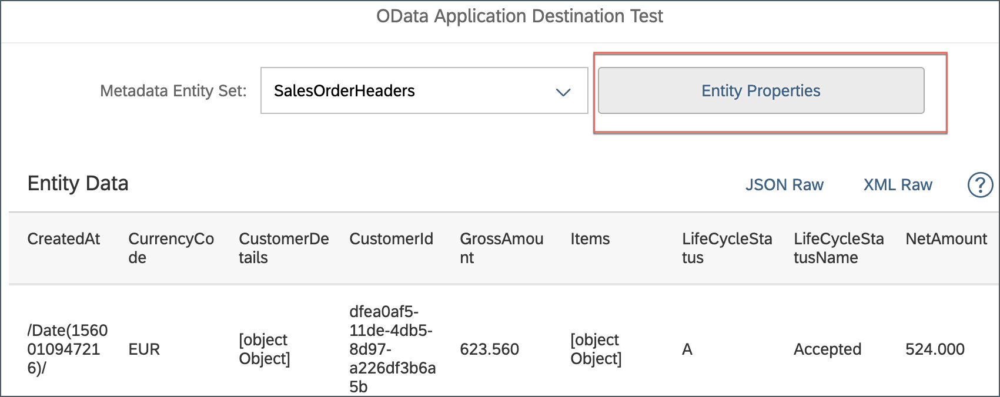

If you can not find particular data set, click on **Entity Properties** to select some properties, click **OK**.

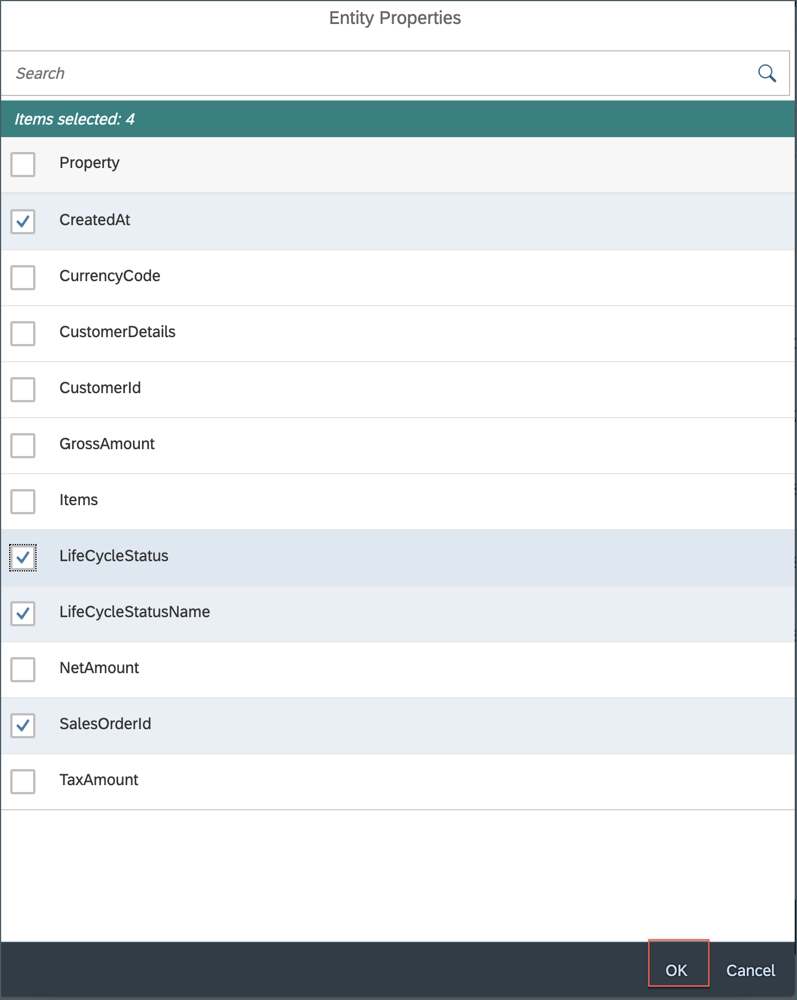

See that the `SalesOrder` has changed the status accordingly.

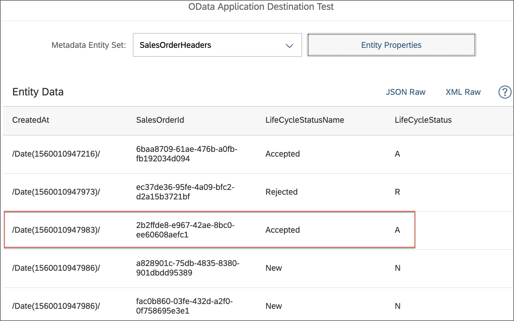

[DONE]

[ACCORDION-END]
