## Prerequisites
 - **Tutorial:** [Create Cards Automatically with the Automatic Instance Generation Template](cp-mobile-cards-automatic-instance-generation)

## Details
### You will learn
 - How to deploy a new version of an SAP Mobile Card
 - How to implement actions within an SAP Mobile Card
 - How to take an end user's input within an SAP Mobile Card
 - How SAP Mobile Card can be used for Approval workflows

 Using the sample data service that is part of SAP Cloud Platform Mobile Services, you will connect to a system and add an action to approve or reject a sales order.

 Actions allow users to trigger a REST call from a card. This tutorial will change the status of a sales order. After completing the tutorial, you can change the sales order's status from **New** to **Approved** or **Rejected**. This allows you to build simple workflow solutions for the mobile device.

---

[ACCORDION-BEGIN [Step 1: ](Get familiar with real world use case)]

A sales manager in a company usually needs to log into her computer to Approve or Reject Sales Order that her team has created. Since she is constantly on the move, she wants a way to perform these actions on her Mobile Device.

In this tutorial, you will see how you can quickly mobilize this use-case using SAP Mobile Cards. The Automatic Instance card will show three cards with the sales order information. Each card will have the Approve / Reject action. The sales manager can then select an action on a specific card to approve or reject the respective sales order.

!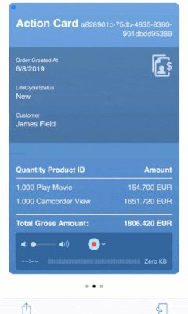
!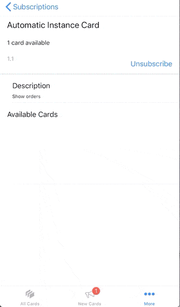

[DONE]
[ACCORDION-END]

[ACCORDION-BEGIN [Step 2: ](Create a new version of the card)]

Please ensure that you have completed the [Automatic Instance Generation tutorial](cp-mobile-cards-automatic-instance-generation) before you proceed with the following steps.

> At any given time, only one version of a card can be productive. You need to create a new version of the card to make any changes. While you are working on a new version, the end-users can keep using the productive version. Once you deploy the new version, the end-user's card will be updated.

Make sure you have logged in to SAP Cloud Platform Mobile Services cockpit. Navigate to **SAP Mobile Cards** to look into Mobile Cards configuration.

!

Click **Automatic Instance Card** in the Card Templates tab.

!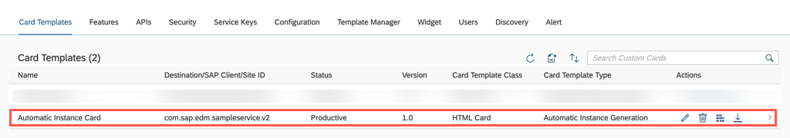

Click new **Version** button  in the Versions table to create a new version.

!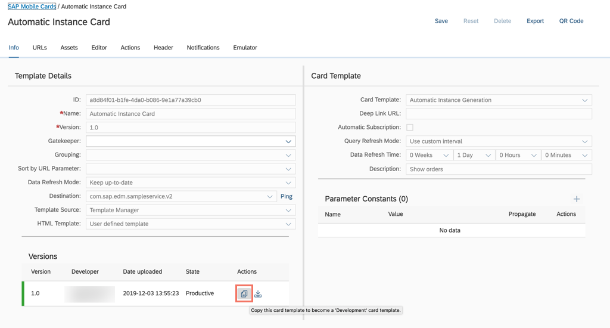

Click **Yes** on the Confirmation dialog.

!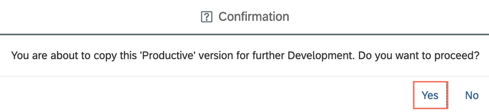

Click the **Edit** Button  for the new version of the card.

!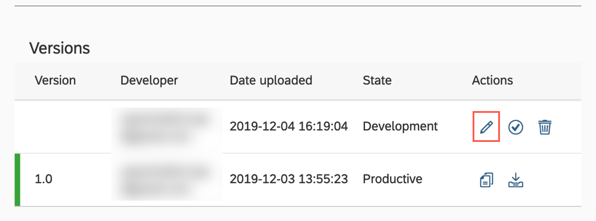

Enter the version as **1.1** and click **Save**.

!

> You will be re-directed to the Card Templates Tab.

Click **Automatic Instance Card** in the Card Templates tab.

!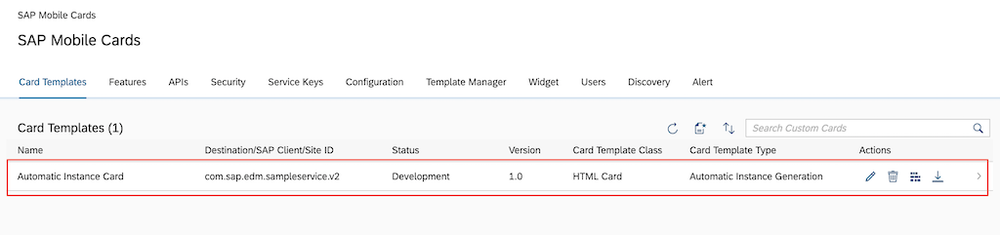

A new card with the version `1.1` is created, and the state of this card is Development.

!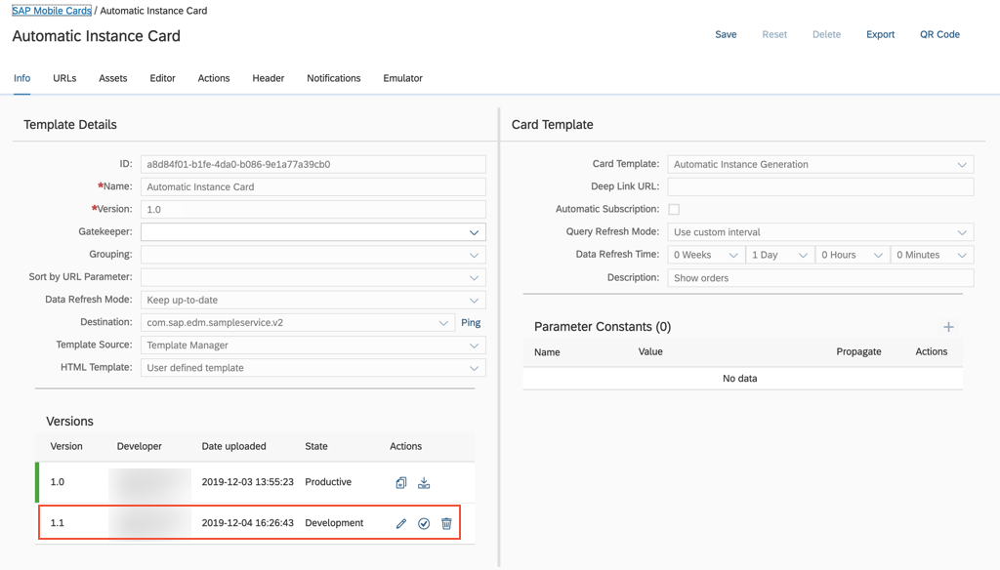

[DONE]
[ACCORDION-END]

[ACCORDION-BEGIN [Step 3: ](Update the card title)]

Click the **Edit** button for the development `1.1 version` card.

> To ensure you are editing the correct version, please notice the green vertical bar in the Versions Table. This bar indicates the version of the current view on SAP Cloud Platform Mobile Services Cockpit.

!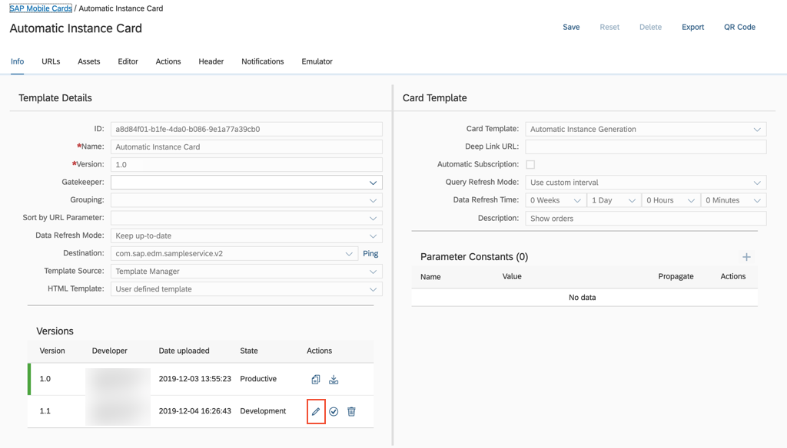

Click the **Editor** tab.

!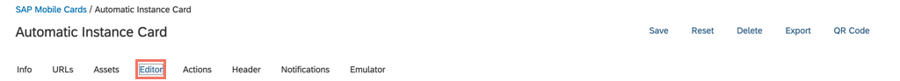

Replace `SalesOrder` text with **Action Card** to rename the title of the card.

!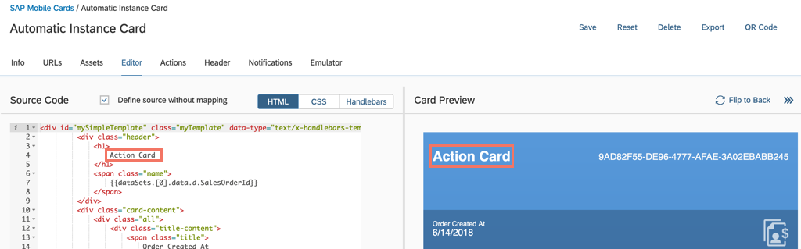

[DONE]
[ACCORDION-END]

[ACCORDION-BEGIN [Step 4: ](Add Approve Action)]

Click the **Actions** tab.

!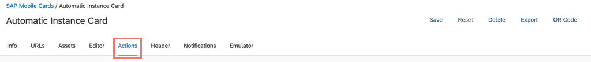

Add `/` as the XCSRF Token URL.

!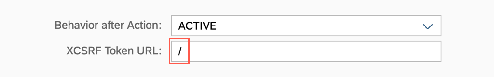

Click the  icon to add an action and provide the required information:

| Field | Value |
|----|----|
| **Name** | `approve` |
| **Label** | `Approve` |
| **URL** | `/SalesOrderHeaders('${SalesOrderId}')` |
| **Behavior after Action** | `ACTIVE` |
| **HTTP Method** | `PATCH` |
| **Consider Action As** | `Positive` |
| **Action Body** | `{"LifeCycleStatusName": "Accepted", "LifeCycleStatus": "A"}` |

> Making an action active allows the user to perform the action multiple times.

!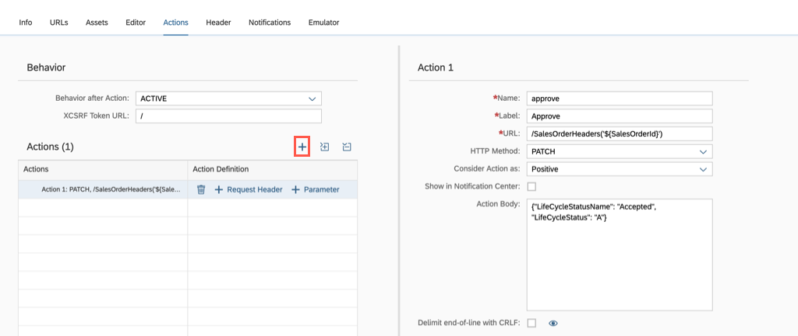

>Here **URL** will call the current `SalesOrder` which the card represents.

>`${SalesOrderId}` defines the placeholder where the current `SalesOrderID` will be put in from the OData JSON response. !

>**Consider Action As** will assign an icon for the actions on Android.

>**Action Body** will patch the `SalesOrder` status from `New` to `Accepted` if the action is triggered.

[VALIDATE_1]
[ACCORDION-END]

[ACCORDION-BEGIN [Step 5: ](Add Reject Action)]

Click the  icon to create another action.

!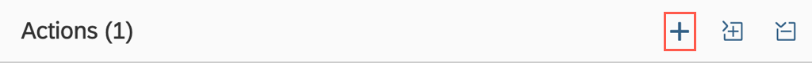

> For Reject, we want the Sales Manager to provide a reason. Thus, we will create an **Action Parameter** before we fill the details for the action.

Click  **Parameter** button to create an action parameter and provide the required information:

| Field | Value |
|----|----|
| **Name** | `reasonForRejection` |
| **Label** | `Please provide a reason for rejection` |
| **Data Type** | `Edm.String` |
| **Maximum Length** | `255` |
| **Is Nullable** | `Uncheck` |

!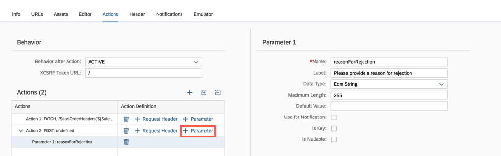

> In SAP Mobile Cards, you can allow the user to provide an input while performing an action. This input is stored in an Action Parameter.

Click **Action 2** in the Actions table and provide the required information:

| Field | Value |
|----|----|
| **Name** | `reject` |
| **Label** | `Reject` |
| **URL** | `/SalesOrderHeaders('${SalesOrderId}')` |
| **Behavior after Action** | `ACTIVE` |
| **HTTP Method** | `PATCH` |
| **Consider Action As** | `Negative` |
| **Action Body** | `{"LifeCycleStatusName": "Rejected: ${reasonForRejection}", "LifeCycleStatus": "R"}` |

!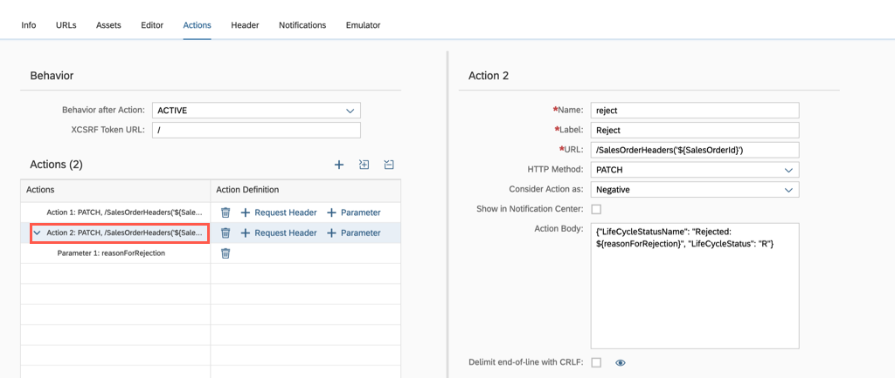

>We are storing the user's input in the Action Parameter `reasonForRejection`. We then send the value in this parameter as part of the body. Upon successful execution, the card will display the reason entered by the user.

Click **Save** to save the changes made.

!

[VALIDATE_2]
[ACCORDION-END]

[ACCORDION-BEGIN [Step 6: ](Deploy a new version of the Card)]

Click **Automatic Instance Card** in the Card Templates tab.

!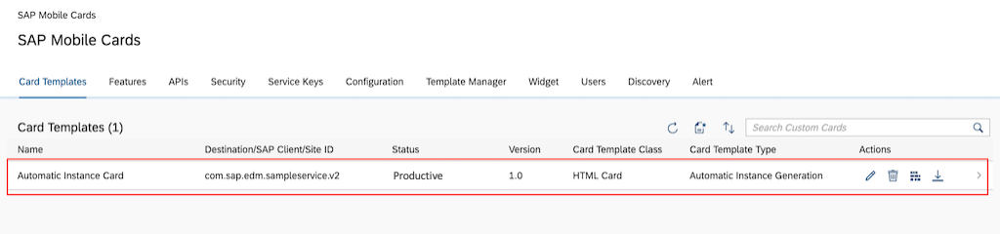

Click the **Info** tab.

!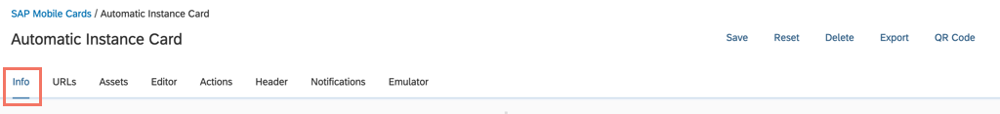

In the Versions table, click the  icon to change the state to **Productive**.

!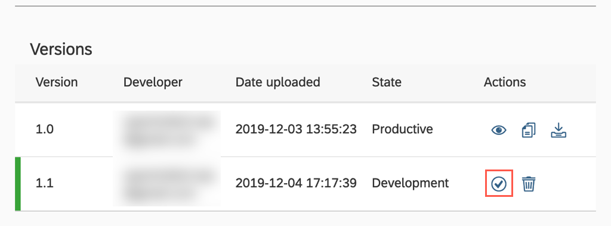

Choose **Yes** to confirm.

Notice that the **State** of the versions has changed. The newly published version - `1.1` is now in **Productive** state, and the older version - `1.0` is now in *Backup* state.

!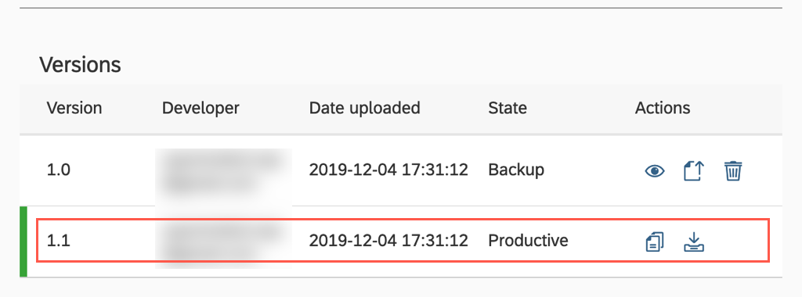

[DONE]
[ACCORDION-END]

[ACCORDION-BEGIN [Step 7: ](Subscribe to the card in SAP Mobile Cards)]

>Make sure you are choosing the right device platform tab ( **Android** or **iOS** ) **above**.

> The SAP Mobile Services client syncs new versions periodically. In the interest of time, you can choose to un-subscribe and subscribe the card to **force the changes immediately**.

[OPTION BEGIN [Android]]

Do a pull refresh.

!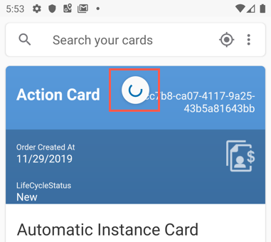

In the card properties view, notice that the version of the `Automatic Instance Card` is **1.1**.

!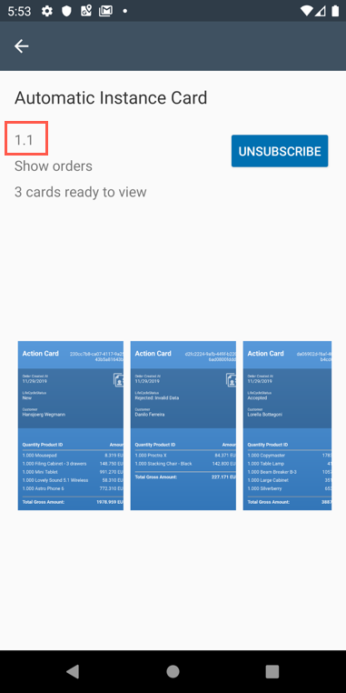

Tap  'Back' to see the latest cards downloaded on the device and tap  button to expand the card action menu.

> The data is dynamically generated by the sample service on SAP Cloud Platform Mobile Service server. Thus, the data inside the card on your device may be different than what you see in the screenshot.

!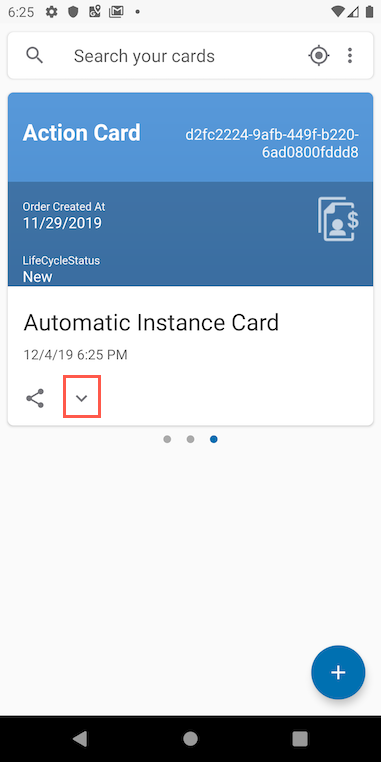

Tap **Reject** to reject the Sales Order.

!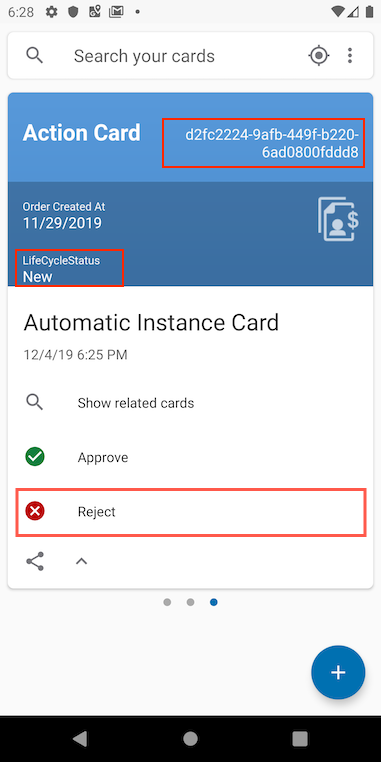

> The icons seen here appear because of the `Consider Action As` property.

> Make a note of the `LifeCycleStatus` and Action Card Id.

Enter a reason for Rejection and Tap on **Reject**.

!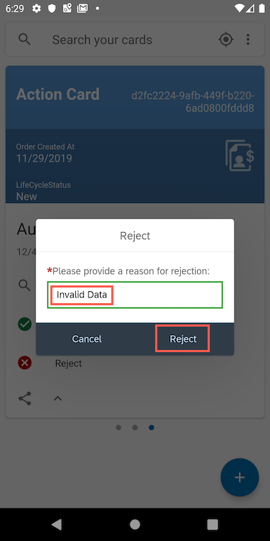

> The user is asked for a reason because we added an action parameter for the reject option.

You will now see 2 toast messages: `Performing Action` and `Performed Action Successfully`.

!
!

Tap on the card to open it. Notice, that the Life `LifeCycleStatus` has changed from `New` to `Rejected: Invalid Data`.

!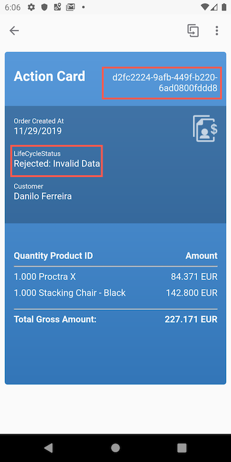

Now, let's assume that the necessary action has been taken, and this Sales Order can be approved.

Tap on the **Action Bar** button to view the actions and then tap on **Approve**.

!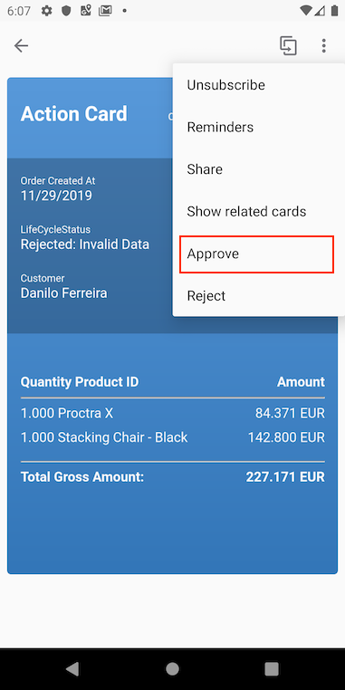

You will now see 2 toast messages: `Performing Action` and `Performed Action Successfully`.

!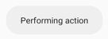
!

For the same card, `LifeCycleStatus` has changed from `Rejected: Invalid Data` to `Accepted`.

!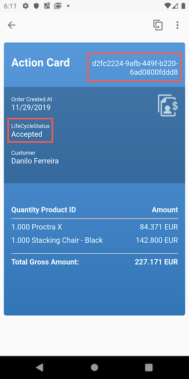

[OPTION END]

[OPTION BEGIN [iOS]]

Do a pull refresh.

!

In the card properties view, notice that the version of the `Automatic Instance Card` is **1.1**.

!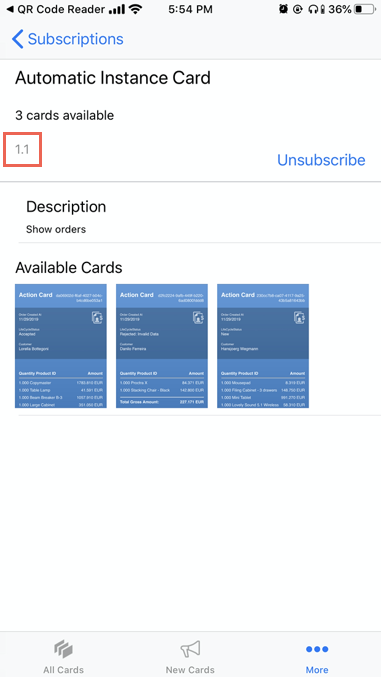

Tap New Cards to to see latest cards downloaded on the device.

!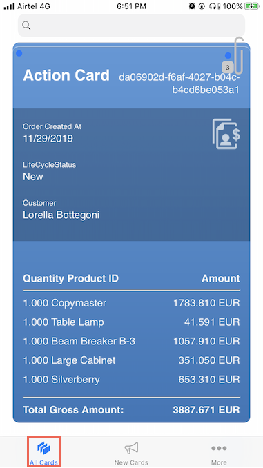

> The data is dynamically generated by the sample service on SAP Cloud Platform Mobile Service server. Thus, the data inside the card on your device may be different than what you see in the screenshot.

Tap on a card to open it.

!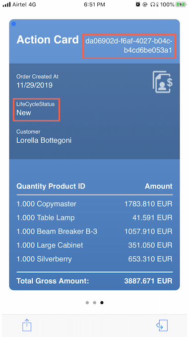

> Make a note of the `LifeCycleStatus` and Action Card Id.

Tap on the **Action Menu** button  to view the actions.

!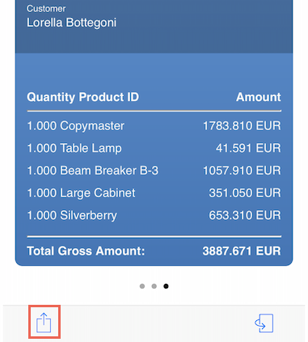

Tap **Reject** to reject the Sales Order.

!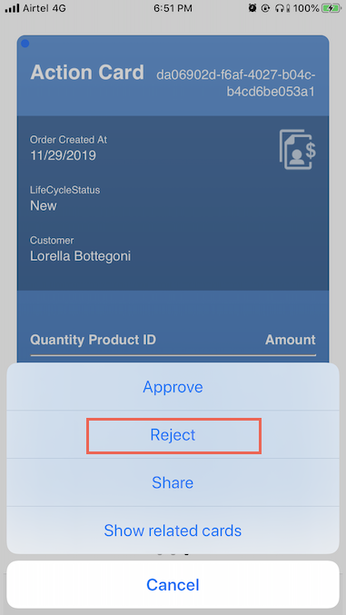

Enter a reason for Rejection and Tap on **Reject**.

!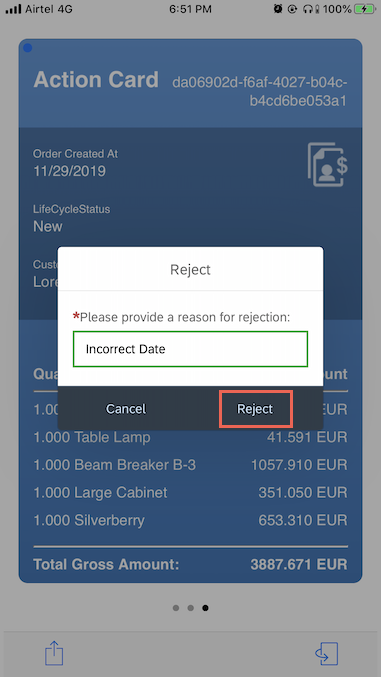

> The user is asked for a reason because we added an action parameter for the reject option.

You will now see 2 toast messages: `Performing Action` and `Action Successfully Performed`.

!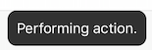
!

Notice, that the Life `LifeCycleStatus` has changed from `New` to `Rejected: Incorrect Date`.

!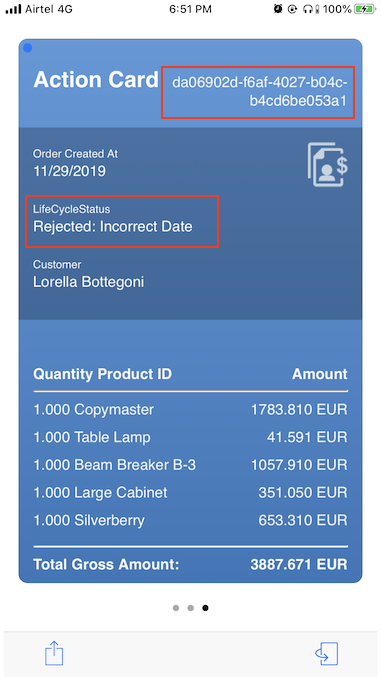

Now, let's assume that the necessary action has been taken, and this Sales Order can be approved.

Tap on the **Action Menu** button  to view the actions.

!

Tap **Approve** to reject the Sales Order.

!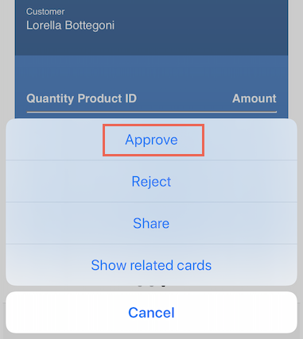

You will now see 2 toast messages: `Performing Action` and `Action Successfully Performed`.

!
!

Notice, that the Life `LifeCycleStatus` has changed from `Rejected: Incorrect Date` to `Aceepted`.

!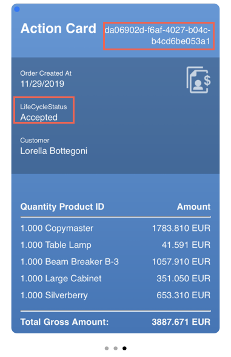

[OPTION END]

[DONE]
[ACCORDION-END]

[ACCORDION-BEGIN [Step 8: ](Cross verify status update in the back end)]

In the Mobile Services cockpit, click **Connectivity** under the **Features** tab.

!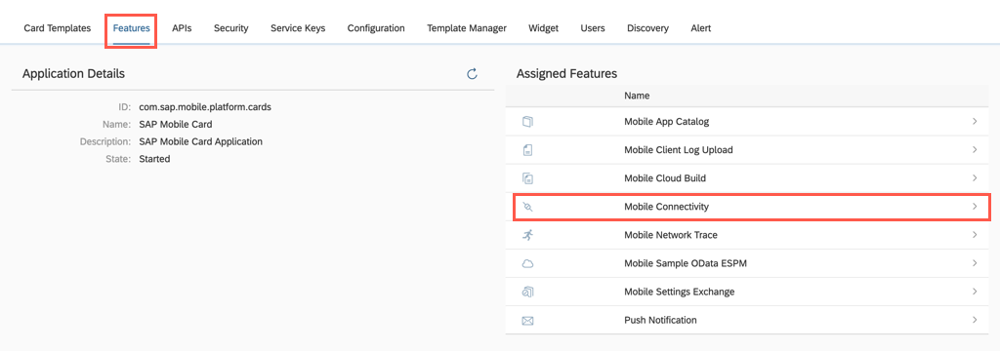

For the `com.sap.edm.sampleservice.v2` sample service, click the **OData destination test** icon .

!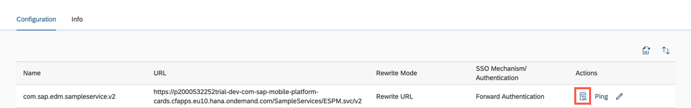

Click **Next**.

!

Select `SalesOrderHeaders` as the Metadata Entity Set.

!

If you cannot find particular data set, click **Entity Properties** to select some properties, then click **OK**.

!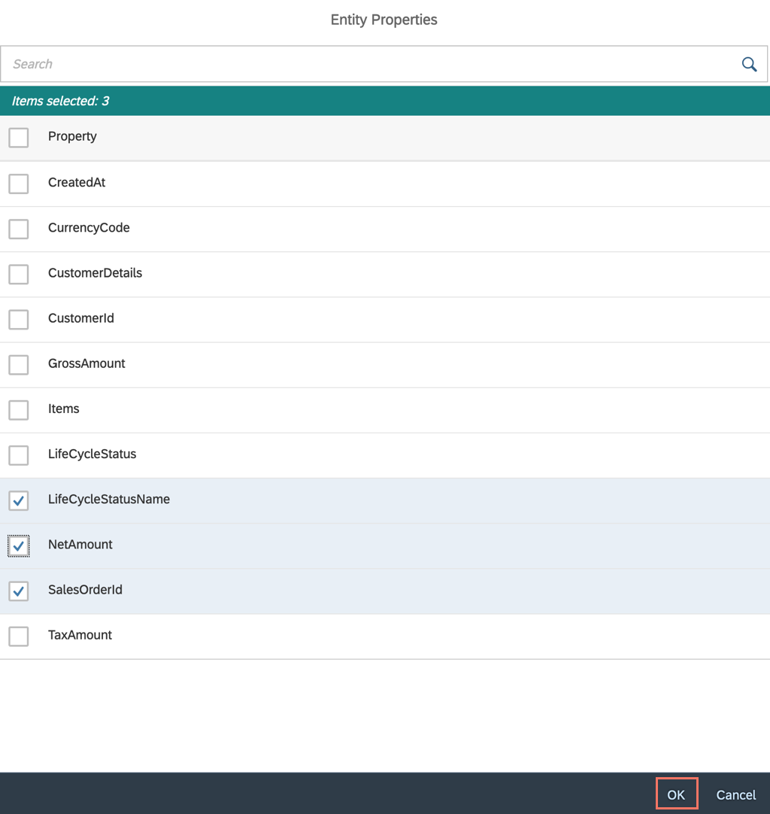

Verify the `LifeCycleStatus` for the Sales Orders on which you have performed an action.

!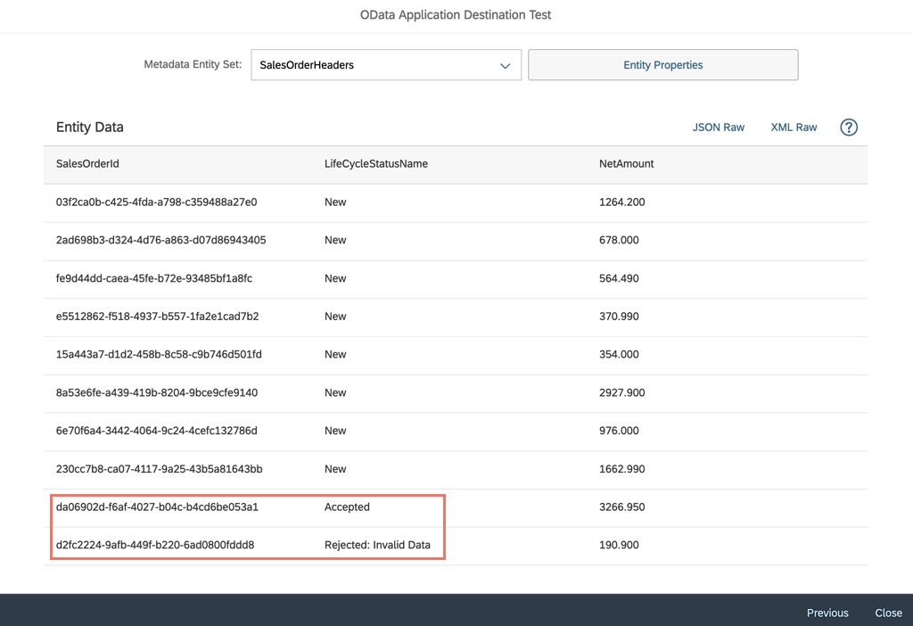

> In the attached screenshot, Accept & Reject actions have been performed on two different cards.

Congratulations, you have built a work-flow capable SAP Mobile Cards. You can now use this knowledge to build other workflow applications.

[DONE]
[ACCORDION-END]
