## Prerequisites
- [Completed the starter mission](mission.mobile-cards-get-started) or [Set up Mobile Services on your SAP Business Technology Platform account](cp-mobile-cards-setup)
- [Set up SAP Business Application Studio for Mobile Development](cp-mobile-bas-setup)
- [Created your first card in SAP Business Application Studio](cp-mobile-cards-bas-basic-card)
- **Install SAP Mobile Cards Application:**
   <table><tr><td align="center">! Android</td><td align="center">! iOS</td></tr></table>

## Details
### You will learn
 - How to create a Card template that shows one card instance for each record.
 - How to work with Query URLs.
 - How to implement actions within an SAP Mobile Card
 - How SAP Mobile Card can be used for Approval workflows

After completing the tutorial, you can reset the sales order's current status to **New** or **Approved** or **Rejected**. This allows you to build simple workflow solutions for the mobile device.

---

[ACCORDION-BEGIN [Step 1: ](Get Familiar With The Real World Use Case)]

A sales manager in a company usually needs to log into her computer to Approve or Reject Sales Order that her team has created. In some cases, she also wants to reset the status of the order from Rejected or Approved back to New. Since she is constantly on the move, she wants a way to perform these actions on her Mobile Device.

In this tutorial, you will see how you can quickly mobilise this use-case using SAP Mobile Cards. The Multi Instance card will show three cards with the sales order information. Each card will have the details of one sales order and the action to accept/reject the order or reset the order status.

>For this tutorial, you will use Mobile Services sample backend to retrieve top 3 sales orders.

[DONE]
[ACCORDION-END]

[ACCORDION-BEGIN [Step 2: ](Create A Sales Order Card Using A Template)]

1. Open your Business Application Studio, and enter your Development space.

    !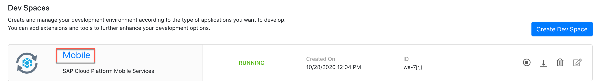

    > If your dev space is not running, click the Play Button -  to start it.

    > !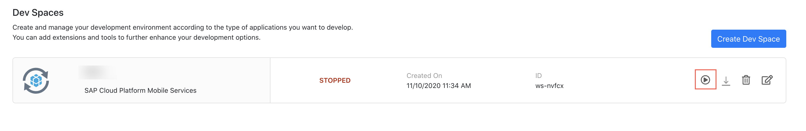

2. In the menu bar, go to View &rarr; Find Command, click Find Command.

    !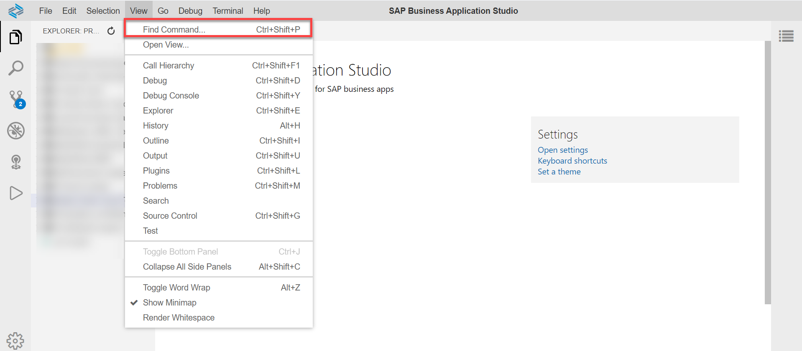

    >  For faster development, you can use the shortcut key.

3. Type *Mobile Cards: New*, and select **Mobile Cards: New From Template**.

    !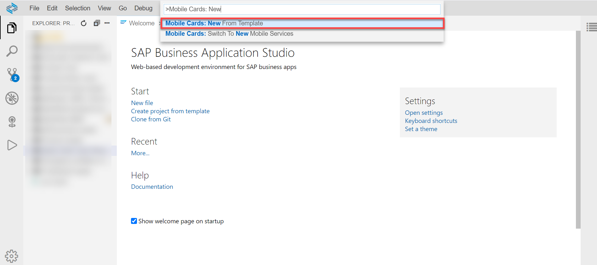

4. Select **Sales Order Approval Card - Multi Instance**.

    !

5. Enter a name for the card; e.g. **Action Card**.

    !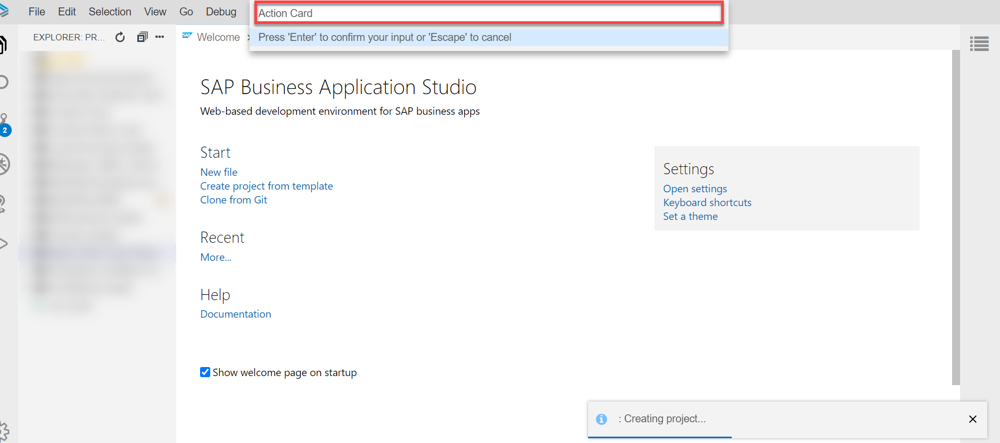

6. Open **metadata.json** file from the project explorer.

    !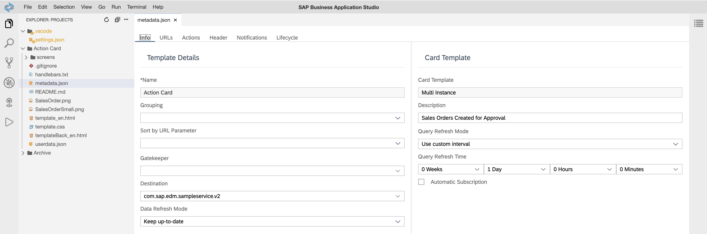

    > **Destination** defines the root for the queries to be used for this card.

7. Click on the **Actions** tab, to view the *Approve* and *Reject* actions.

    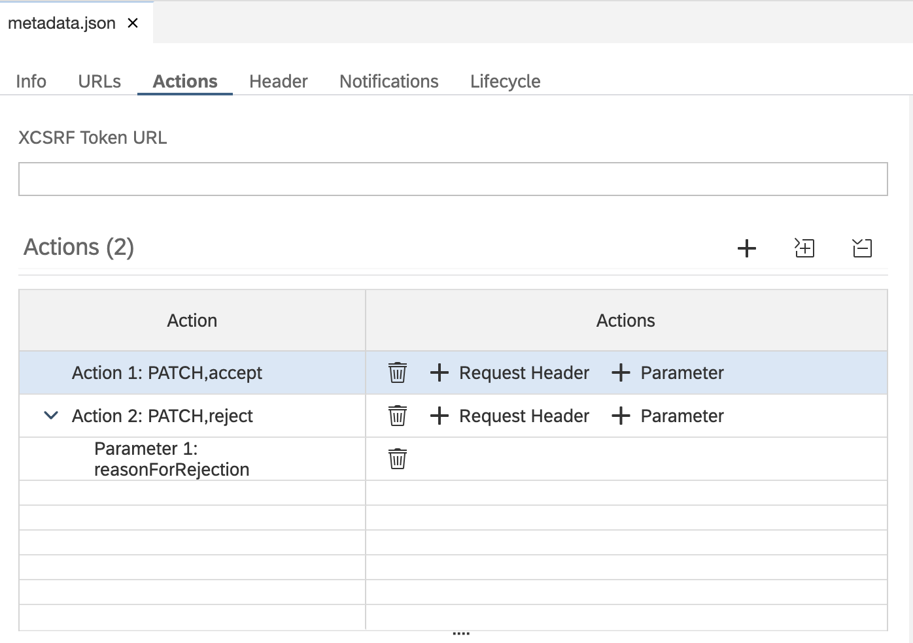

    > Actions allow users to trigger a REST call from a card. Whenever an action is performed, the changes are reflected in the backend and in the mobile card the lifecycle status of the order is changed (according to the action i.e. approve or reject).

    > For reject action, parameter is added through which the user is prompted to add a reason why he/she is rejecting the order.

[VALIDATE_1]
[ACCORDION-END]

[ACCORDION-BEGIN [Step 3: ](Adding reset action in the card)]

1. Click the add icon () to add an action and provide the following information:

    | Field | Value |
    |----|----|
    | **Name** | `reset` |
    | **Label** | `Reset` |
    | **URL** | `/SalesOrderHeaders('${SalesOrderId}')` |
    | **Behavior after Action** | `ACTIVE` |
    | **HTTP Method** | `PATCH` |
    | **Consider Action As** | `Neutral` |
    | **Action Body** | `{"LifeCycleStatusName": "New", "LifeCycleStatus": "N"}` |

    !

    > `${SalesOrderId}` in the URL is a parameter defined in the URLs tab..

    > !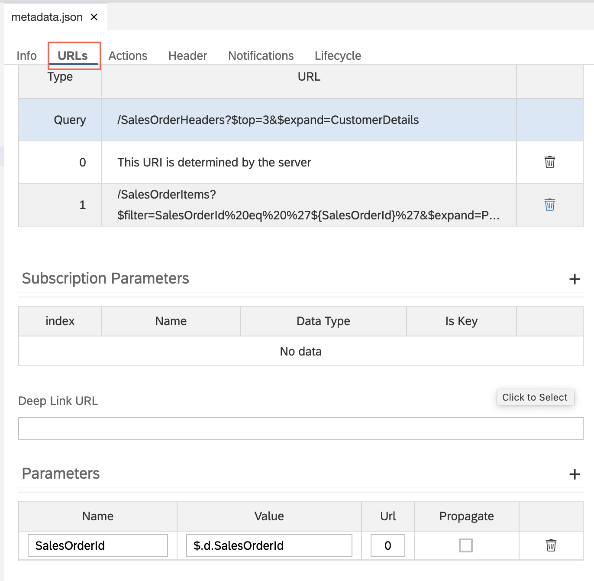

    > Making an action active allows the user to perform another action. For details, [click here](https://help.sap.com/doc/f53c64b93e5140918d676b927a3cd65b/Cloud/en-US/docs-en/guides/getting-started/mck/mck-development-features.html#behavior-after-action).

    > **Consider Action As** assigns an icon for the action seen on the Android device.

[DONE]
[ACCORDION-END]

[ACCORDION-BEGIN [Step 4: ](Deploy and publish the card)]

1. Open Find Command, search for *Mobile Cards* and select **Mobile Cards: Deploy**.

    !

2. Select **Action Card**.

    !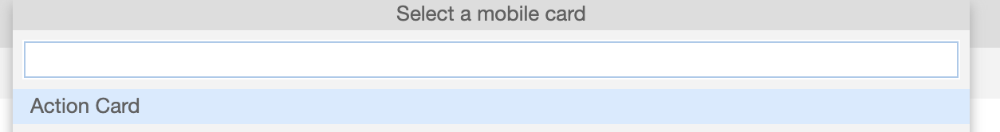

    > If prompted to enter your username & password, enter the login details you use to login to the Mobile Service cockpit.

    > Your will receive a success message when your card is successfully deployed.

    > !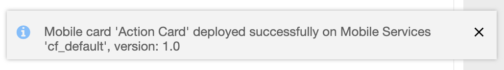

3. Open Find Command, search for *Mobile Cards* and select **Mobile Cards: Publish**.

    !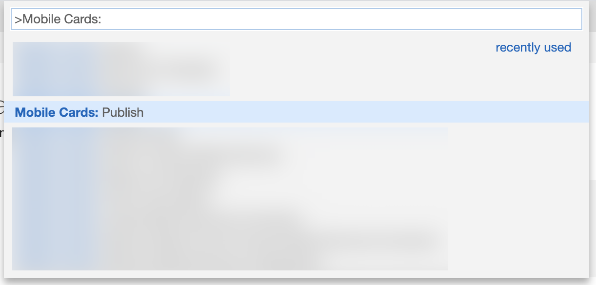

    > If prompted to enter your username & password, enter the login details you use to login to the Mobile Service cockpit.

    > Your will receive a success message when your card is successfully published.

    > !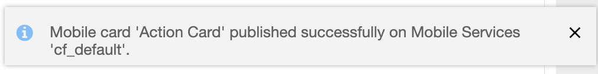

    > By default, the status of newly created cards is **Development**, and thereby can't be seen on the mobile device. By publishing the card, the card becomes productive and accessible on the device. [Click here](https://help.sap.com/doc/f53c64b93e5140918d676b927a3cd65b/Cloud/en-US/docs-en/guides/getting-started/mck/mck-managing-cards.html#card-life-cycle) to learn more about the card lifecycle.

[DONE]
[ACCORDION-END]

[ACCORDION-BEGIN [Step 5: ](Perform actions on your device)]

>Make sure you are choosing the right device platform tab ( **Android** or **iOS** ) **above**.

[OPTION BEGIN [Android]]

1. Perform **Pull Refresh** in the SAP Mobile Cards Android client.

    !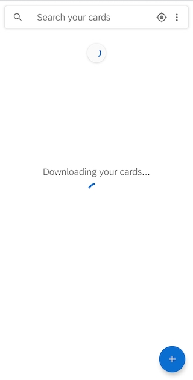

    > The SAP Mobile Services client syncs new versions periodically. In the interest of time, you may choose to un-subscribe and subscribe the card to **force the changes immediately**.

    > !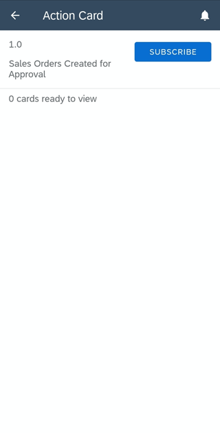

2. Tap expand actions button () to expand the actions menu.

    !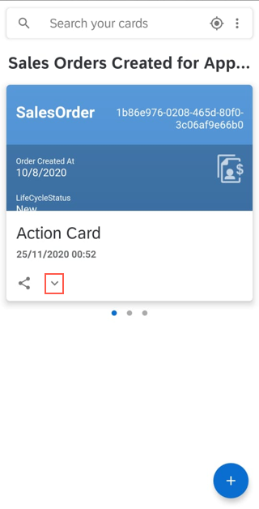

    > The icons seen here appear because of the `Consider Action As` property.

3. Make a note of the `LifeCycleStatus` and the `SalesOrderId`, and tap **Approve Order**.

    !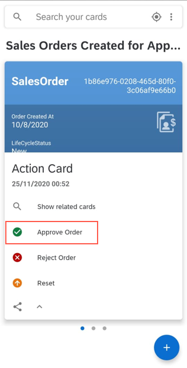

    > You will see a toast messages when the action is being performed 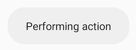

    > and a message when it is completed successfully 

4. **Tap** on the card to open it, and notice the `LifeCycleStatus`.

    !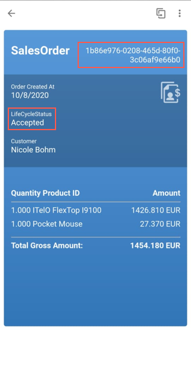

    > The data is dynamically generated by the sample service on SAP Mobile Service server. Thus, the data inside the card on your device may be different than what you see in the screenshot.

5. Select another card, **tap** on it to open it, and make a note of the `Customer` and `LifeCycleStatus`.

    !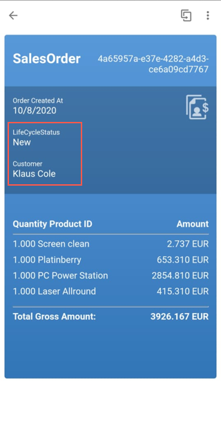

6. **Tap** actions menu (), and **tap** **Reject Order**.

    !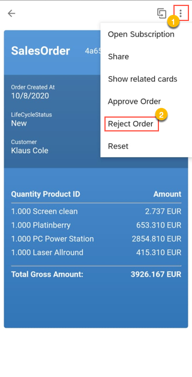

7. Enter a reason for Rejection and Tap **Reject Order**.

    !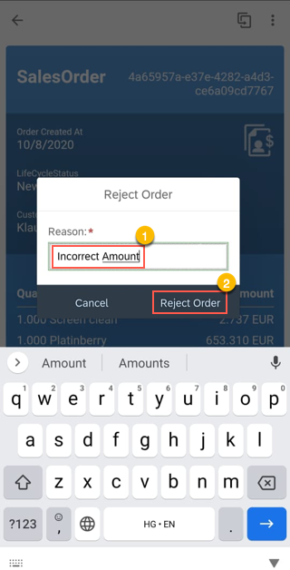

    > The user is asked for a reason because we added an action parameter for the reject option.

8. **Tap** the back icon **&larr;** until you return to the cards list view, and re-open the card and notice the `LifeCycleStatus` for the respective customer.

    !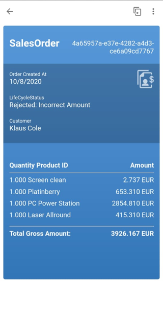

[OPTION END]

[OPTION BEGIN [iOS]]

1. Perform **Pull Refresh** in the SAP Mobile Cards iOS client.

    !

    > The SAP Mobile Services client syncs new versions periodically. In the interest of time, you may choose to un-subscribe and subscribe the card to **force the changes immediately**.

    > !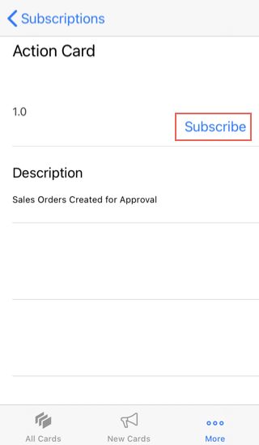

2. **Tap** on a card to open it, and make a note of the `Customer` and `LifeCycleStatus`.

    !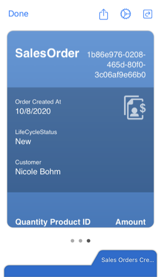

3. **Tap** the actions menu (), and **tap** **Approve Order**.

    !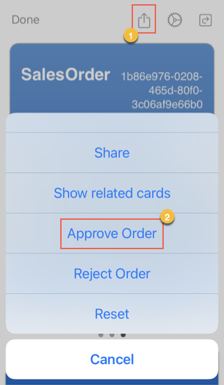

    > You will see a toast messages when the action is being performed 

    > and a message when it is completed successfully 

    > If the lifecycle status of the card isn't updated, click done and perform a pull refresh.

4. Select another card, **tap** on it to open it, and make a note of the `Customer` and `LifeCycleStatus`.

    !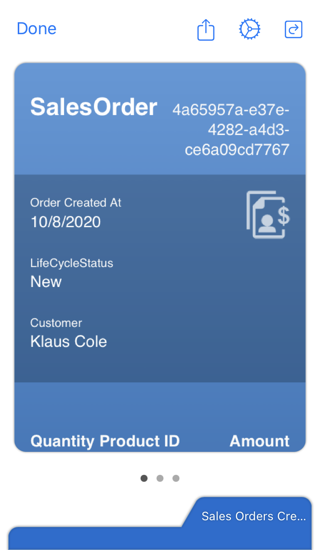

5. **Tap** the actions menu (), and **tap** **Reject Order**.

    !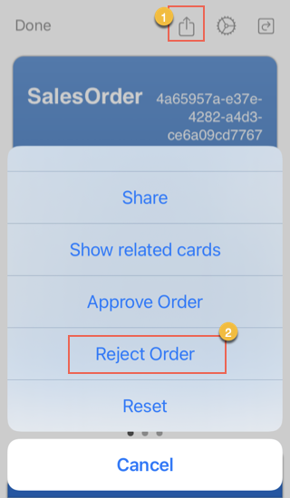

6. Enter a reason for Rejection and Tap **Reject Order**.

    !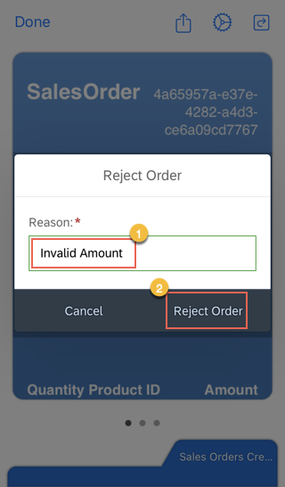

    > The user is asked for a reason because we added an action parameter for the reject option.

    > If the lifecycle status of the card isn't updated, click done and perform a pull refresh.

[OPTION END]

[DONE]
[ACCORDION-END]

[ACCORDION-BEGIN [Step 6: ](View changes on the back end)]

1. In the Mobile Services cockpit, click **Mobile Connectivity** under the **Features** tab.

    !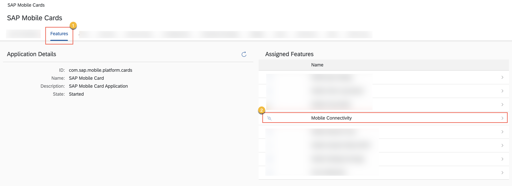

2. For the `com.sap.edm.sampleservice.v2` sample service, click the **Launch in Browser** button .

    !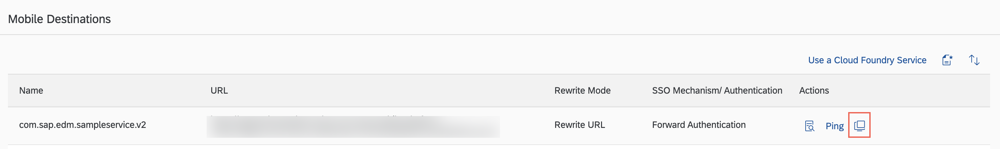

3. In the browser window that opens, replace `?auth=uaa` with `/SalesOrderHeaders`.

    !

4. Scan the `LifeCycleStatusName` column to identify records that reflect the actions performed by you.

    !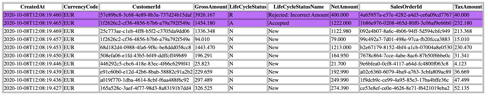

> Keep this browser window open. It will be used in the next step.

[DONE]
[ACCORDION-END]

[ACCORDION-BEGIN [Step 7: ](Reset the status for the rejected card)]

>Make sure you are choosing the right device platform tab ( **Android** or **iOS** ) **above**.

Now, let's assume that the necessary action has been taken for the rejected card. We will now reset the status of the card in this step.

[OPTION BEGIN [Android]]

1. Scroll through the cards, and **tap** on the card that was rejected.

    !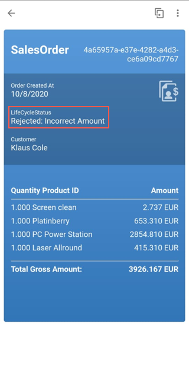

2. **Tap** the actions menu (), and **tap** **Reset**.

    !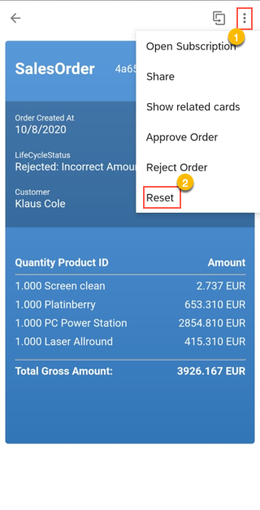

3. **Tap &larr;** until you return to the cards list view, and re-open the card and notice the `LifeCycleStatus`.

        !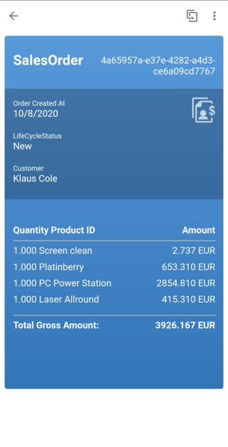

[OPTION END]

[OPTION BEGIN [iOS]]

1. Scroll through the cards, and **tap** on the card that was rejected.

    !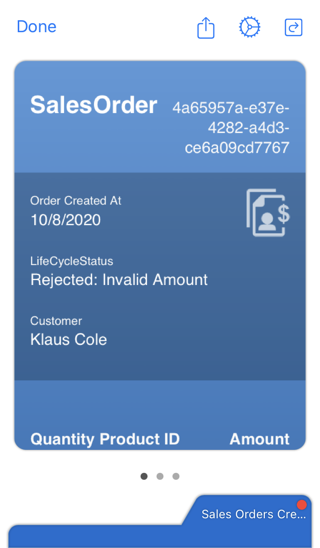

2. **Tap** the actions menu (), and **tap** **Reset**.

    !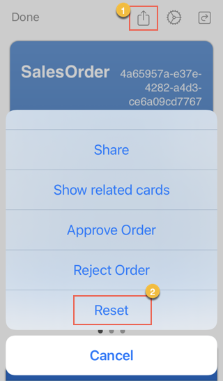

3. Notice the `LifeCycleStatus` after the card is refreshed.

    !

[OPTION END]

[DONE]
[ACCORDION-END]

[ACCORDION-BEGIN [Step 8: ](Verify status on the back end)]

1. Refresh the `com.sap.edm.sampleservice.v2` sample service browser window.

    !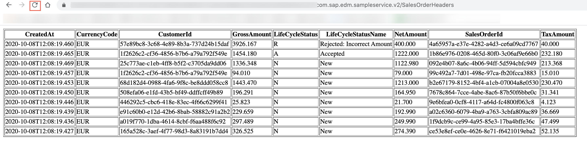

2. Notice the `LifeCycleStatus` for the record that was previously `Rejected: Incorrect Amount`.

    !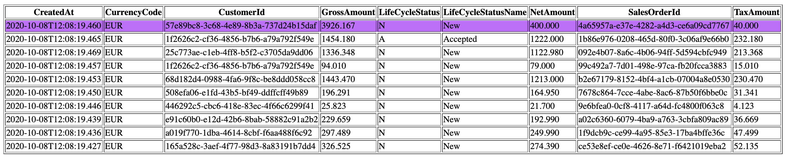

    > It should now be **New**.

**Congratulations!** You have built an approval card with actions using SAP Mobile Cards.

[DONE]
[ACCORDION-END]
