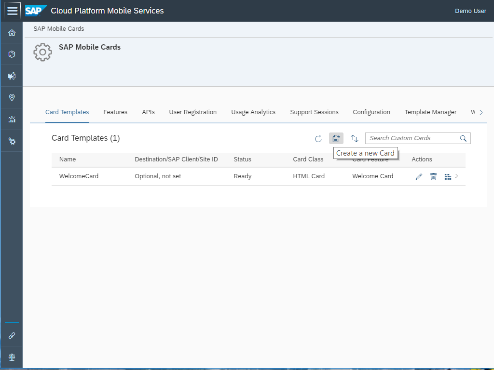
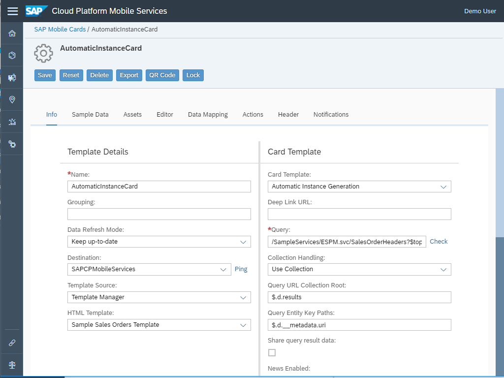
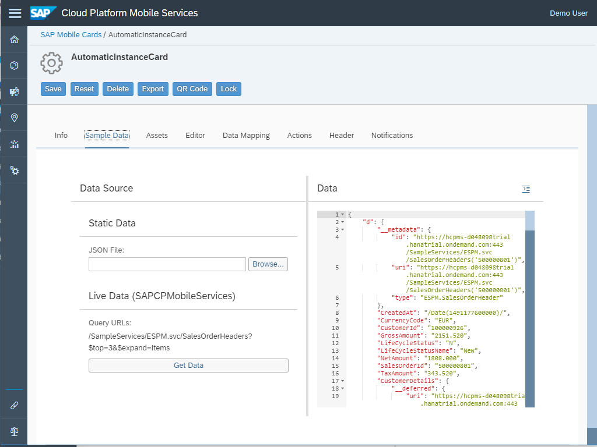
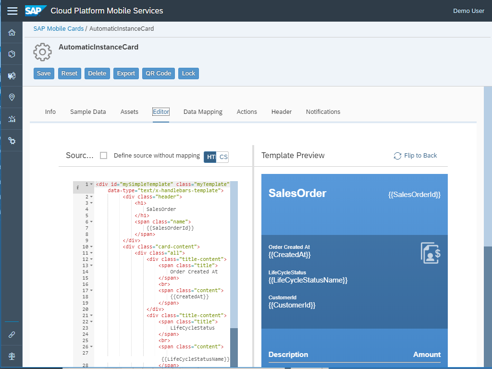
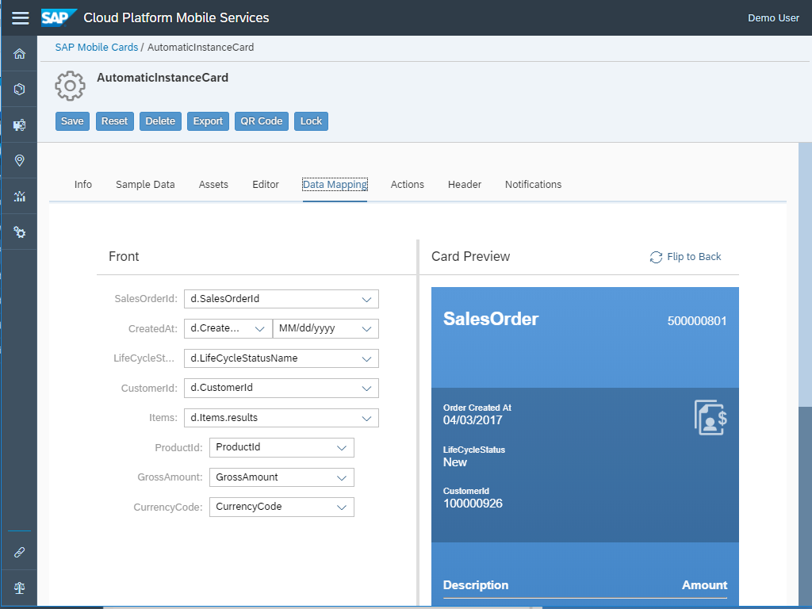
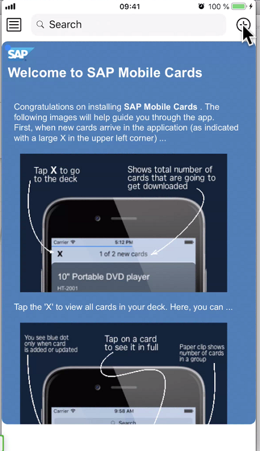
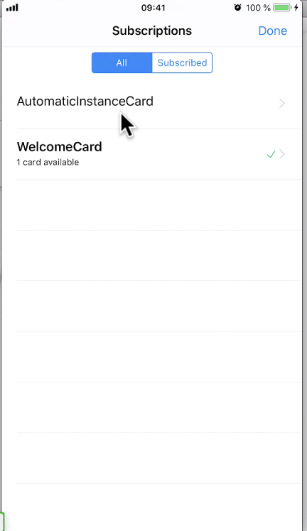
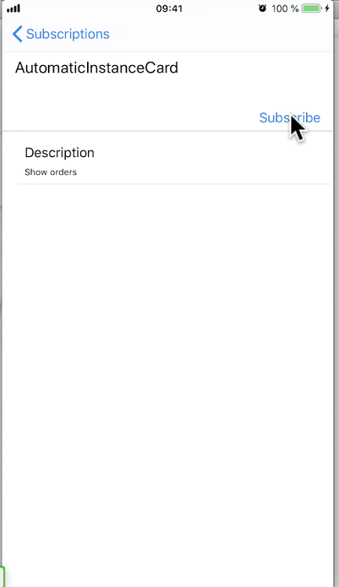
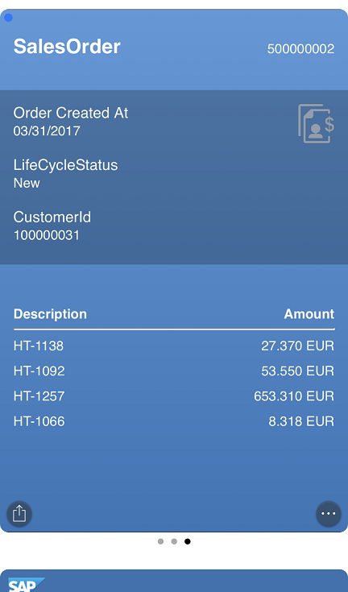

## Prerequisites

## Details
### You will learn
 - How to generate mobile cards with the Automatic Instance Generation type

---

[ACCORDION-BEGIN [Step 1: ](Get familiar with real world use case)]

A company wants to show the last three pay slips to your employee on a mobile device. The query for this solution would ask for the top 3 pay slips sorted by date.

The Automatic Instance card will show three cards with pay slip information. Each card would be one of the last three months (April, May, June). As soon as the result set changes (when a new pay slip is available), the cards will be updated. The new month plus the last two months would show (May, June, July).

[DONE]
[ACCORDION-END]

[ACCORDION-BEGIN [Step 2: ](Create Automatic Instance card)]

Make sure you have logged in to SAP Cloud Platform Mobile Services cockpit. Navigate to **SAP Mobile Cards** to look into Mobile Cards configuration.

Click on the **Create a New Card** icon.

Provide the required information:

| Field | Value |
|----|----|
| **Name** | `AutomaticInstanceCard` |
| **Destination** | `SAPCPMobileServices` |
| **Template Source** | `Template Manager` |
| **HTML Template** | `Sample Sales Order Template` |

> If you see a pop-up, click **OK** for the confirmation.

> **Destination** defines the root for the queries to be used for this card.

>The Type **Automatic Instance Generation** will create a card instance for each result in the result set returned by the query. The query is based on the destination. This query returns a result set of three sales orders from the sample services.

Click **Sample Data** to view the sample JSON response. The JSON response here represents one result set from the three cards the query would return. This data is used by the data mapper to render a sample card in the editor.

Click **Editor** to view the HTML that builds this card. The HTML describes the layout of the card. The [Handlebars](https://handlebarsjs.com/) `{{}}` are the placeholders where the data mapper will put the actual JSON response values during runtime.

Click **Data Mapping** to view the Mapping between the HTML that contains handlebars and the actual JSON data. The data mapper does the mapping of the Handlebars placeholders to the actual JSON entities. The actual result shows in the card to the right.

Click **Save** to save the card and make it available for the SAP Mobile Cards application.

You will see a pop-up asking whether you want to lock this mobile card or not. **Yes** means to do any modifications to this card, you need to unlock it first. For this tutorial, click **No**.

[VALIDATE_1]
[ACCORDION-END]

[ACCORDION-BEGIN [Step 3: ](Subscribe to the card in SAP Mobile Cards)]

To ensure that the client refreshes, pull down the Welcome card to trigger a manual refresh and then click the **+** icon to subscribe a new card.

Click `AutomaticInstanceCard` under the **All** tab.

Click **Subscribe** to trigger the download of the Automatic Instance cards in your SAP Mobile Cards app.

Click a card to open it.

Congratulations, you have built a query-based card that creates an instance of a card for each query result set.

Here you can view respective sales order items details by clicking on the three dots at the bottom-right.

[DONE]
[ACCORDION-END]
