## Prerequisites

## Details
### You will learn
 - How to create a Card template that shows one card instance for each record.
 - How to work with Automatic Instance Generation Card and Query URLs.

---

[ACCORDION-BEGIN [Step 1: ](Get familiar with real world use case)]

A sales manager in a company usually needs to log into her computer to see the details of a Sales Order. Since she is constantly on the move, she wants a way to see the latest 3 sales orders on her phone.

In this tutorial, you will see how you can quickly mobilize this use-case using SAP Mobile Cards. The Automatic Instance card will show three cards with the sales order information. Each card would have the details of one sales order.

!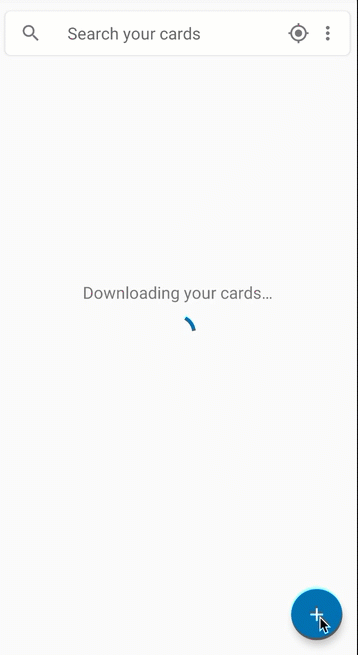
!

>For this tutorial, you will use Mobile Services sample backend to retrieve top 3 sales orders.

[DONE]
[ACCORDION-END]

[ACCORDION-BEGIN [Step 2: ](Create an Automatic Instance card)]

Make sure you have logged in to SAP Cloud Platform Mobile Services cockpit. Navigate to **SAP Mobile Cards** to look into Mobile Cards configuration.

Click the **Create Card Template** icon .

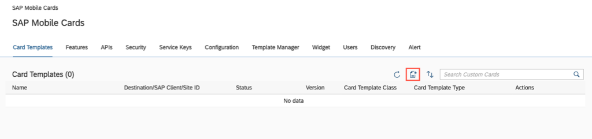

Provide the required information:

| Field | Value |
|----|----|
| **Name** | `Automatic Instance Card` |
| **Version** | `1.0` |
| **Destination** | `com.sap.edm.sampleservice.v2` |
| **Template Source** | `Template Manager` |
| **HTML Template** | `Sample Sales Orders Template` |
| **Card Template** | `Automatic Instance Generation` |

> If you see a notification, click **`X`** to close it.
  

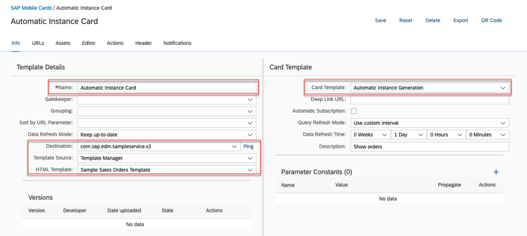

> **Destination** defines the root for the queries to be used for this card.

>The Type **Automatic Instance Generation** will create a card instance for each result in the result set returned by the query. The query is based on the destination. This query returns a result set of three sales orders from the sample services.

Click the **URLs** tab, to view the sample JSON response. The JSON response here represents one result set out of the three that the query would return. This data is used by the data mapper to render a sample card in the editor.

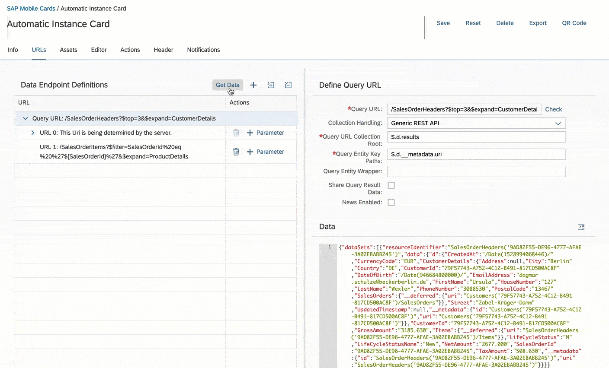

We store the `SalesOrderId` returned from the `SalesOrderHeader` URL in a **URL Parameter**. We then use this URL Parameter to fetch the details of the `SalesOrderItems`. The `SalesOrderItems` URL is queried 3 times, one for each `SalesOrderHeader` fetched in the first URL. The URL Parameter allows us to dynamically fetch the details.

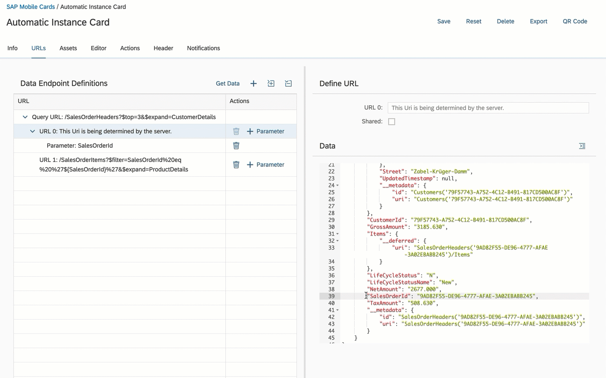

Click **Editor** to view the HTML that builds this card. The HTML describes the layout of the card. The [Handlebars](https://handlebarsjs.com/) `{{}}` are the placeholders where the data mapper will put the actual JSON response values during runtime.

Click **Save**.

[VALIDATE_1]
[ACCORDION-END]

[ACCORDION-BEGIN [Step 3: ](Set card status to productive)]

By default, the status of newly created cards is **Development**. Cards can be subscribed to only when they are in a **Productive** state.

Click **Automatic Instance Card** in the Card Templates tab.

Under **Actions**, click the check mark icon  to change the state to **Productive**.

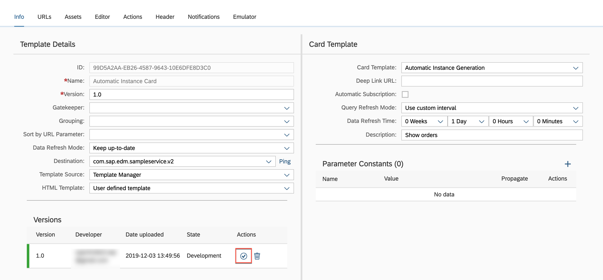

Choose **Yes** to confirm.

You will notice that the **State** has been changed to **Productive**.

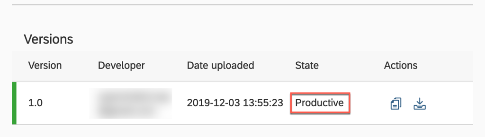

[DONE]
[ACCORDION-END]

[ACCORDION-BEGIN [Step 4: ](Subscribe to the card in SAP Mobile Cards)]

>Make sure you are choosing the right device platform tab ( **Android** or **iOS** ) **above**.

[OPTION BEGIN [Android]]

In the SAP Mobile Cards Android client, tap **+** | **Subscriptions**.

Tap `Automatic Instance Card` under the **All Subscriptions** tab.

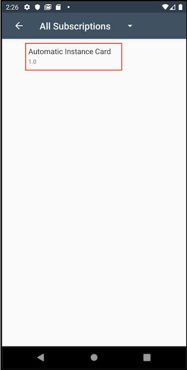

Tap **Subscribe** to trigger the download of the Automatic Instance cards in your SAP Mobile Cards app.

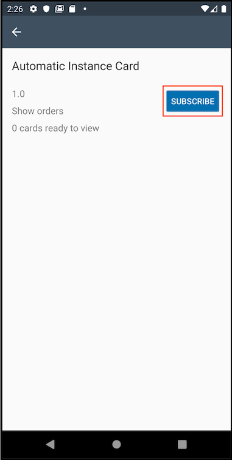

Tap  'Back' to to see latest cards downloaded on the device.

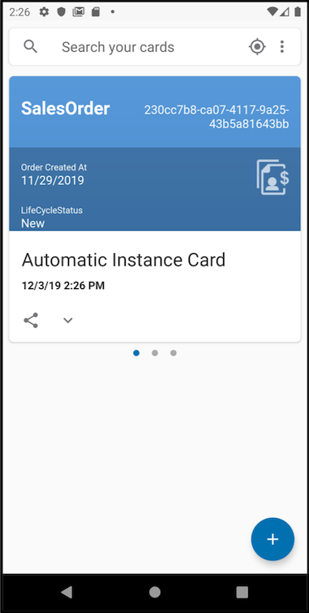

> The data is dynamically generated by the sample service on SAP Cloud Platform Mobile Service server. Thus, the data inside the card on your device may be different than what you see in the screenshot.

Tap a card to open it.

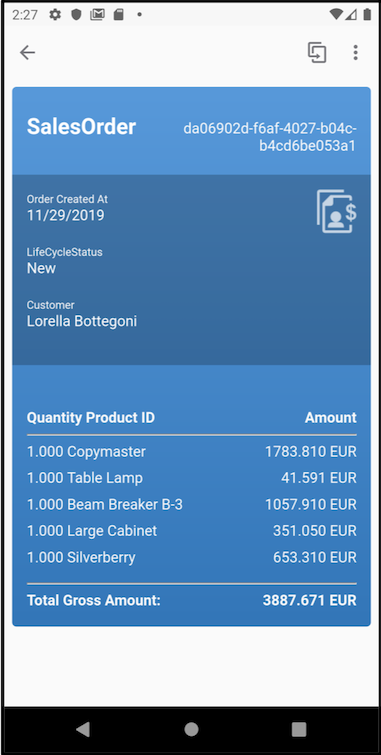

Tap on the **flip** button  to view the other side of the card.

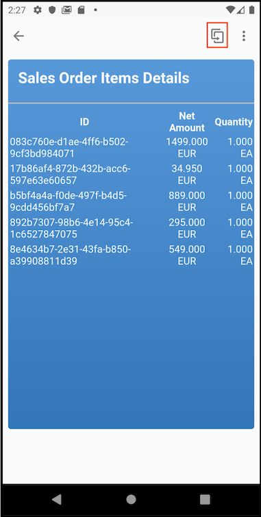

[OPTION END]

[OPTION BEGIN [iOS]]

In the SAP Mobile Cards iOS client, tap **More** | **Subscriptions**.

Tap `Automatic Instance Card` under the **All** tab.

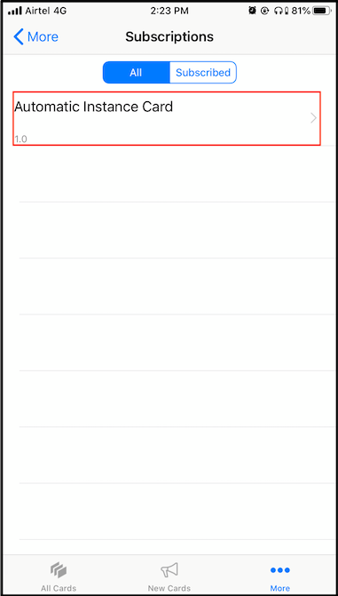

Tap **Subscribe** to trigger the download of the Automatic Instance cards in your SAP Mobile Cards app.

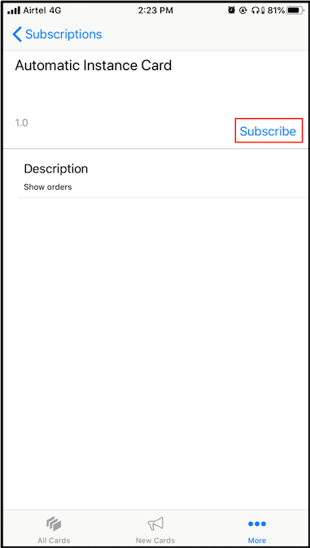

Tap **New Cards** to to see latest cards downloaded on the device.

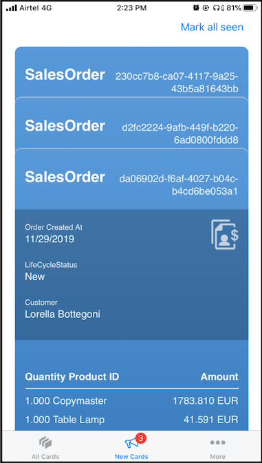

> The data is dynamically generated by the sample service on SAP Cloud Platform Mobile Service server. Thus, the data inside the card on your device may be different than what you see in the screenshot.

Tap on **All Cards**.

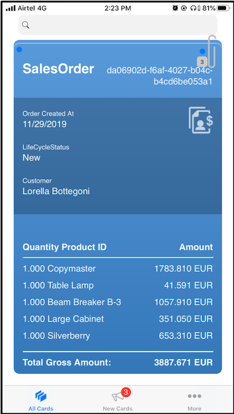

Tap a card to open it.

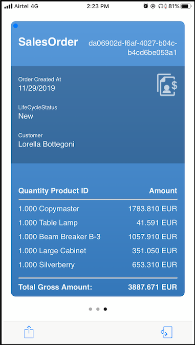

Tap on the **flip** button  to view the other side of the card.

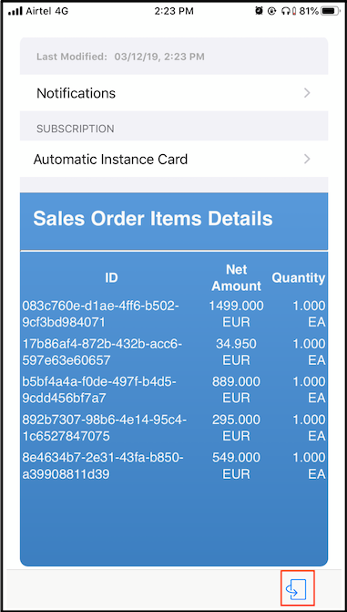

[OPTION END]

Congratulations, you have built a query-based card that creates an instance of a card for each query result set. The sales manager can now view the latest sales order on her mobile device.

[DONE]
[ACCORDION-END]
