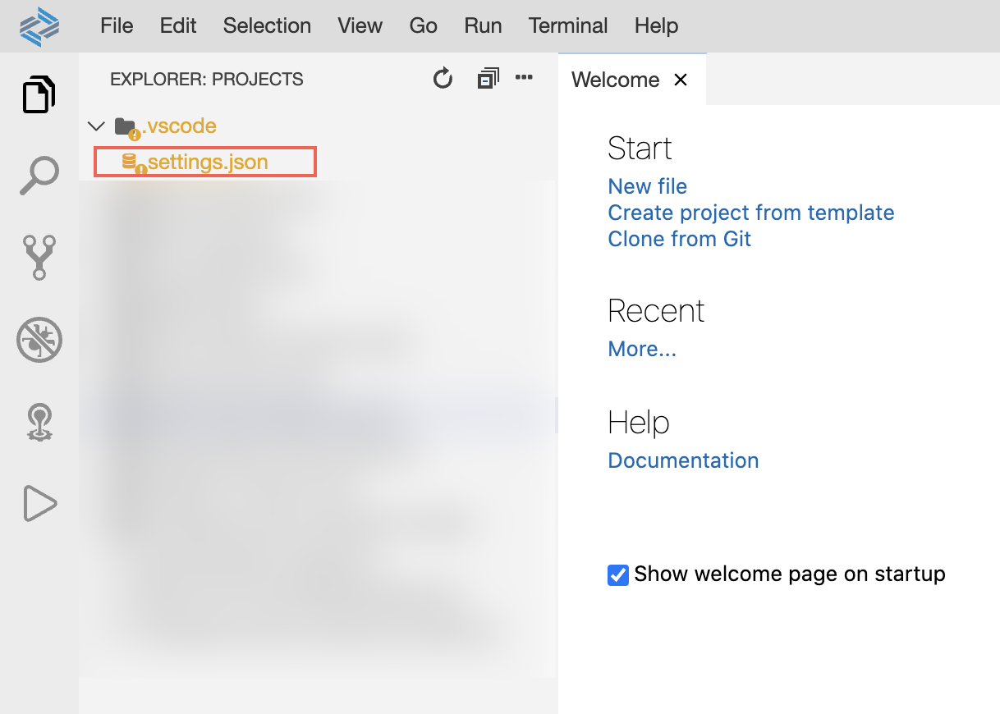
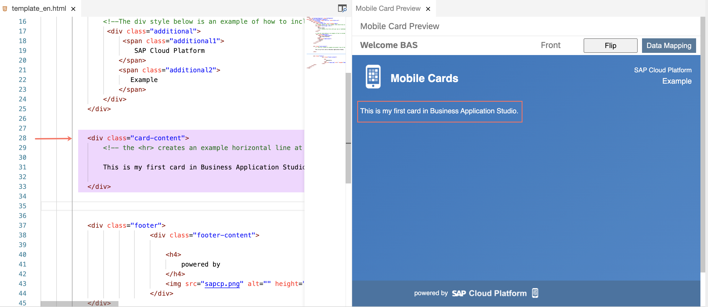
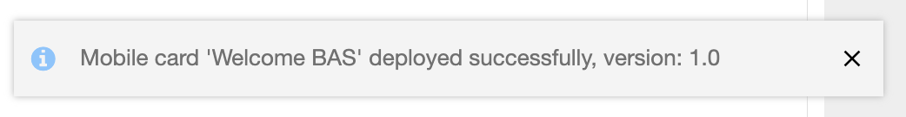
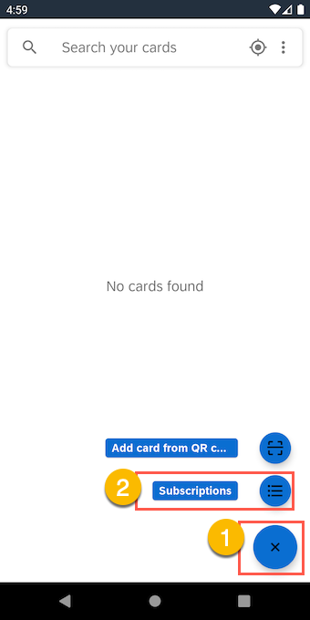
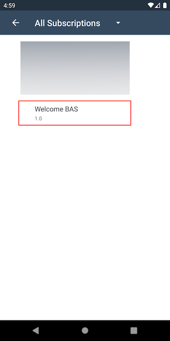
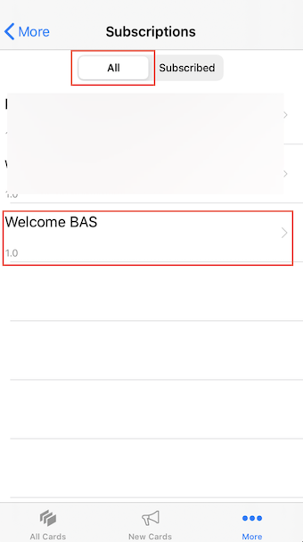

## Prerequisites
 - [You have set up your SAP Cloud Platform Mobile Services account](https://developers.sap.com/tutorials/cp-mobile-cards-setup.html)
 - You have set up your Business Application Studio for Mobile Technologies

## Details
### You will learn
  - Create a card using a template in Business Application Studio. [Click here to learn more about SAP Mobile Cards in SAP Business Application Studio.](https://help.sap.com/doc/f53c64b93e5140918d676b927a3cd65b/Cloud/en-US/docs-en/guides/getting-started/mck/mck-2-2-development-bas.html)
  - Design and develop SAP Mobile Cards in Business Application Studio
  - Deploy a card to SAP Cloud Platform Mobile Services from Business Application Studio
---

[ACCORDION-BEGIN [Step 1: ](Create Mobile Service Connection)]

Open Business Application Studio and enter your dev workspace.

!

In the menu bar, go to View &rarr; Find Command, click **Find Command**.

!

> For faster development, setup a shortcut key for Find Command and use it.

Type Mobile Cards and select **Mobile Cards: Create Service Connection**.

!

Enter a name for your Mobile Services connection; e.g. `cf-ms-trial`

!

Enter the Admin API of your Mobile Services Cockpit.

!

> You can find the Admin API in the Important Links section of your Mobile Services cockpit.
  !

Upon successful connection, you will see a toast message at the bottom right corner of your screen.

!

[DONE]
[ACCORDION-END]

[ACCORDION-BEGIN [Step 2: ](Create a New Card)]

Open Find Command, search for `mobile cards` and select **Mobile Cards: New**.

!

> You may be prompted to enter your username & password. If so, please provide the details and proceed.

Select **Basic Mobile Card Template**.

!

Enter a name for the card; e.g. `Welcome BAS`.

!

In your File Explorer, expand `Welcome BAS` Folder.

!

[VALIDATE_1]
[ACCORDION-END]

[ACCORDION-BEGIN [Step 3: ](Modify the Card)]

In your File Explorer, click **metadata.json**.

!

Add a description; e.g. `Created in SAP Business Application Studio`.

!

In your File Explorer, click **template_en.html**.

!

> If you see a confirmation dialog for `.mckstate`, click Yes.
  !

Open Find Command, search for `mobile cards` and select **Mobile Cards: Preview**.

!

A preview window for your card will open to the side.

!

Collapse `<div class="card-content">` and replace the enclosing code inclusive of the div tags with the following code and save the file.

```html
<div class="card-content">
  This is my first card in Business Application Studio.
</div>
```

!

[DONE]
[ACCORDION-END]

[ACCORDION-BEGIN [Step 4: ](Deploy the Card from SAP Business Application Studio)]

Open Find Command, search for `mobile cards` and select **Mobile Cards: Deploy**.

!

Select the card you have created; e.g. `Welcome BAS`.

!

Upon successful deployment, you will see a toast message at the bottom right corner of your screen.

!

[DONE]
[ACCORDION-END]

[ACCORDION-BEGIN [Step 5: ](Publish the Card in Mobile Service Cockpit)]

Open your Mobile Services Cockpit.

!

Click **SAP Mobile Cards**.

!

Click on your card; e.g. `Welcome BAS`.

!

In the Versions table, click the  icon to change the state to **Productive**.

!

Choose **Yes** to confirm.

!

The status of the card should now be **Productive**.

!

[DONE]
[ACCORDION-END]

[ACCORDION-BEGIN [Step 6: ](View the Card on Your Device)]

>Make sure you are choosing the right device platform tab ( **Android** or **iOS** ) **above**.

[OPTION BEGIN [Android]]

In the SAP Mobile Cards Android client, tap **+** | **Subscriptions**.

!

Tap **Welcome BAS** under the **All Subscriptions** tab.

!

Tap **Subscribe** to trigger the download of the card in your SAP Mobile Cards app.

!

> Notice the description.

Tap  'Back' to to see latest cards downloaded on the device.

!

[OPTION END]

[OPTION BEGIN [iOS]]

In the SAP Mobile Cards iOS client, tap **More** &rarr; **Subscriptions**.

!

Tap **All** tab &rarr; **Welcome BAS**.

!

Tap **Subscribe** to trigger the download of the card in your SAP Mobile Cards app.

!

Tap **New Cards** to to see latest cards downloaded on the device.


[OPTION END]

[DONE]
[ACCORDION-END]

**Congratulations!** You have completed this tutorial.

You have created your first card through SAP Business Application Studio.

---
