## Prerequisites
 - [Completed the starter mission](mission.mobile-cards-get-started) or [Set up Mobile Services on your SAP Business Technology Platform account](cp-mobile-cards-setup)
 - [Set up SAP Business Application Studio for Mobile Development](cp-mobile-bas-setup)
 - **Install SAP Mobile Cards Application:**
    <table><tr><td align="center">!<br>Android</td><td align="center">!<br>iOS</td></tr></table>

## Details
### You will learn
  - How to create a card using a template in SAP Business Application Studio
  - How to design and develop SAP Mobile Cards in SAP Business Application Studio
  - How to deploy a card to SAP Mobile Services from SAP Business Application Studio

Click [here](https://help.sap.com/doc/f53c64b93e5140918d676b927a3cd65b/Cloud/en-US/docs-en/guides/getting-started/mck/mck-development-bas.html) to learn more about SAP Mobile Cards in SAP Business Application Studio.

---

[ACCORDION-BEGIN [Step 1: ](Create Mobile Service connection)]

1. Open Business Application Studio and enter your dev workspace.

    !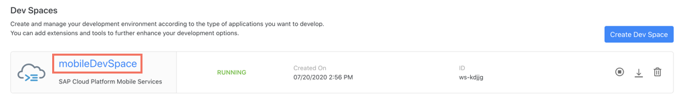

2. In the menu bar, go to View &rarr; Find Command, click **Find Command**.

    !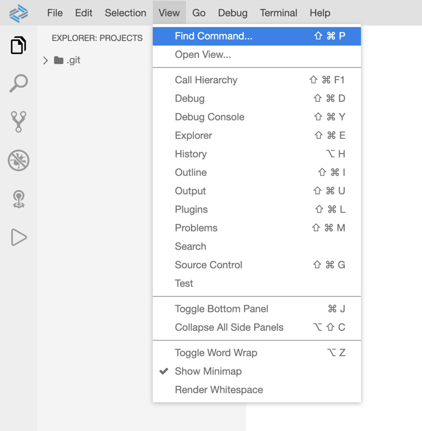

    > For faster development, you can use the shortcut key.

3. Type *Mobile Cards* and select **Mobile Cards: Create Service Connection**.

    !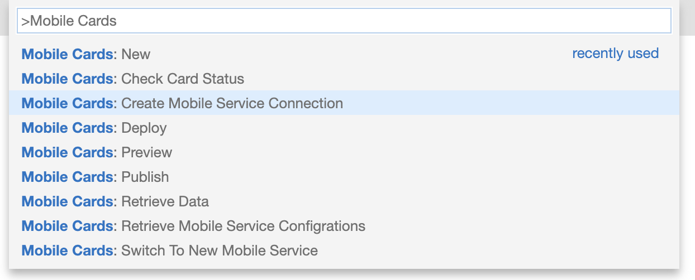

4. Enter a name for your Mobile Services connection; e.g. `cf-ms-trial`.

    !

5. Enter the Admin API of your Mobile Services Cockpit.

    !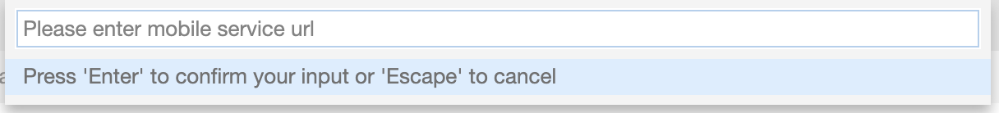

    > You can find the Admin API in the Important Links section of your Mobile Services cockpit.

    > !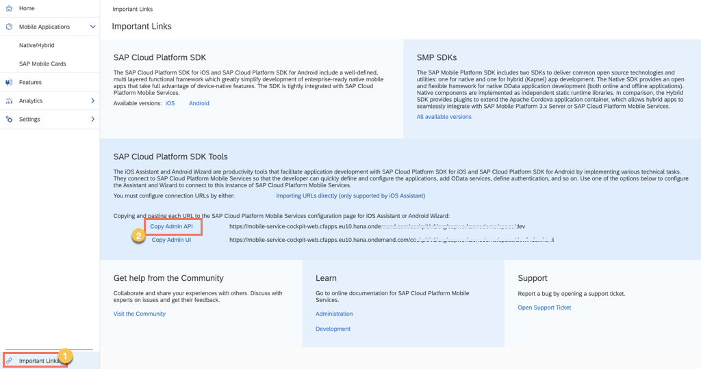

    > Upon successful connection, you will see a toast message at the bottom right corner of your screen.

    > !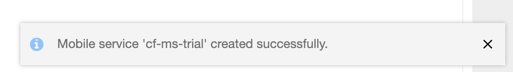

[DONE]
[ACCORDION-END]

[ACCORDION-BEGIN [Step 2: ](Create a new card)]

1. Open Find Command, search for `Create Project from Template` and select **SAP Business Application Studio: Create Project from Template**.

    !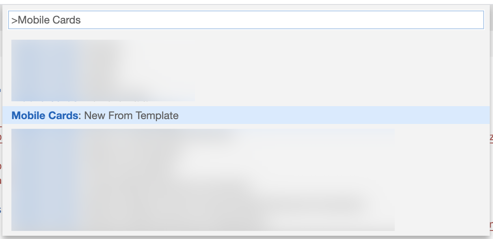

2. Select **SAP Mobile Cards** &rarr; Click **Start**.

    !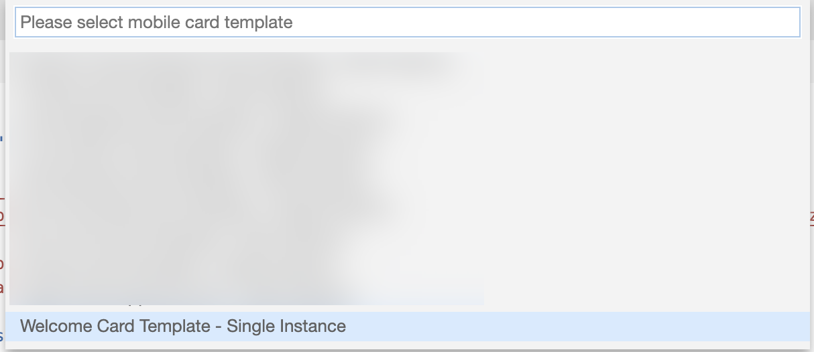

2. Select **Welcome Card Template - Single Instance** &rarr; Enter a name for the card; e.g. `Welcome BAS` &rarr; Click **Finish**.

    !

4. In your File Explorer, expand `Welcome BAS` Folder.

    !

    > You can learn more about the file structure [here](https://help.sap.com/doc/f53c64b93e5140918d676b927a3cd65b/Cloud/en-US/docs-en/guides/getting-started/mck/mck-development-features.html).

[VALIDATE_1]
[ACCORDION-END]

[ACCORDION-BEGIN [Step 3: ](Modify the card)]

1. In your File Explorer, click **metadata.json**.

    !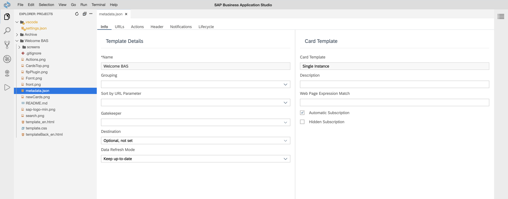

2. Add a description; e.g. **Created in SAP Business Application Studio**.

    !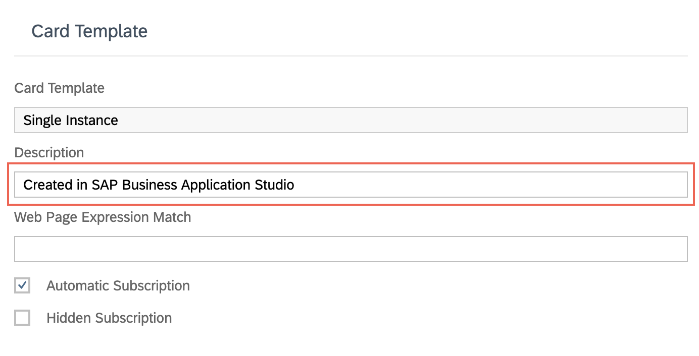

3. In your File Explorer, click **template_en.html**.

    !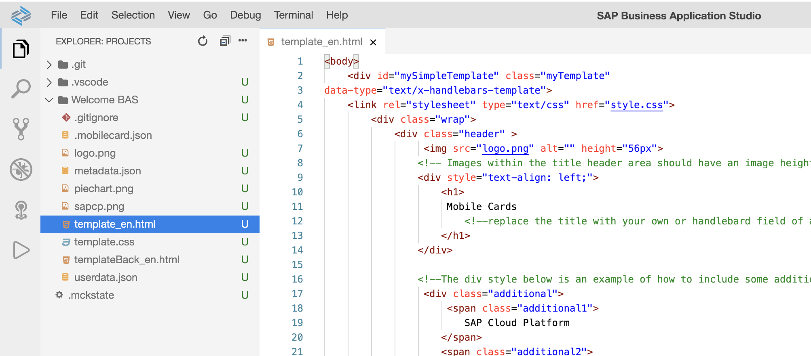

4. Open Find Command, search for *Mobile Cards* and select **Mobile Cards: Preview**.

    !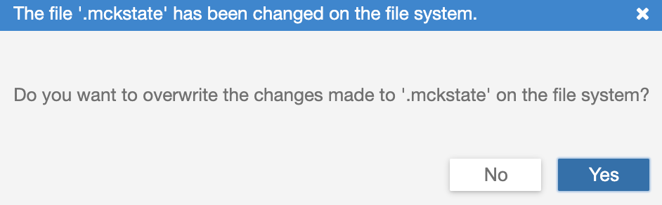

    > A preview window for your card will open to the side.

    > !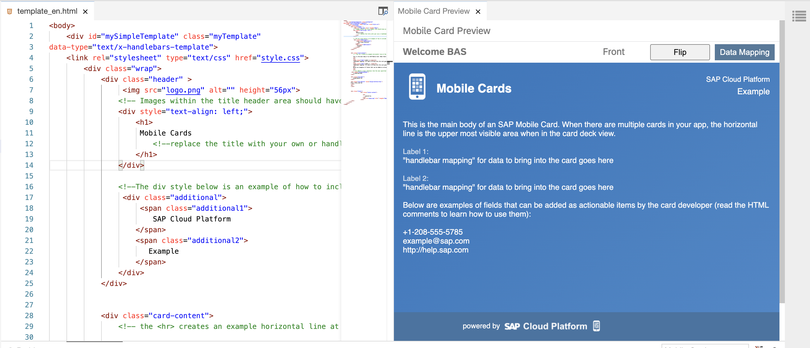

5. Collapse `<div class="card-content">` and replace the enclosing code inclusive of the div tags with the following code and save the file.

    ```HTML
    <div class="card-content">
      This is my first card in Business Application Studio.
    </div>
    ```

    !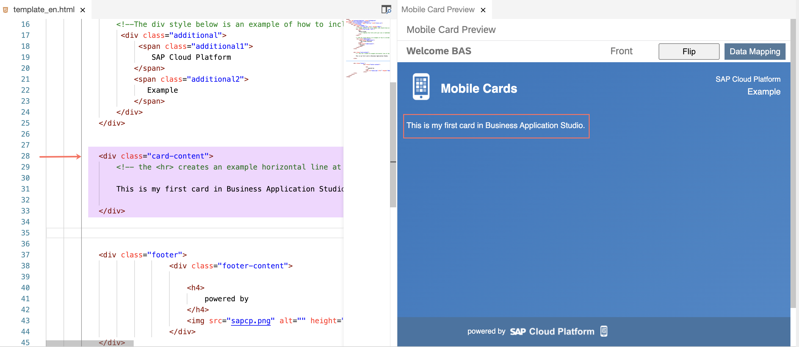

[DONE]
[ACCORDION-END]

[ACCORDION-BEGIN [Step 4: ](Deploy and publish card)]

1. Open Find Command, search for *Mobile Cards* and select **Mobile Cards: Deploy**.

    !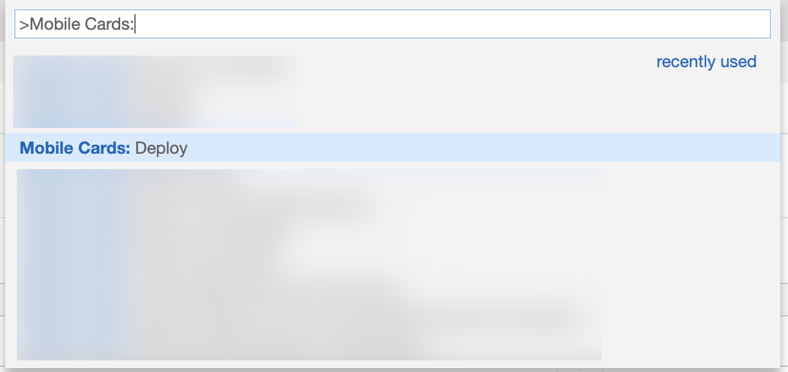

2. Select the card you have created; e.g. `Welcome BAS`.

    !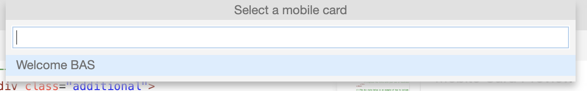

    > Upon successful deployment, you will see a toast message at the bottom right corner of your screen.

    > !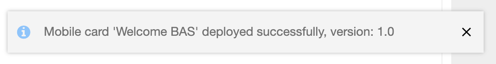

[DONE]
[ACCORDION-END]

[ACCORDION-BEGIN [Step 5: ](Publish card in Mobile Service cockpit)]

1. Open your Mobile Services Cockpit.

    !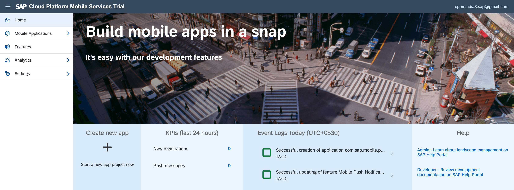

2. Click **SAP Mobile Cards**.

    !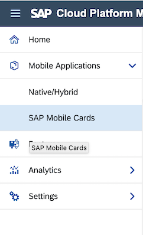

3. Click on your card; e.g. `Welcome BAS`.

    !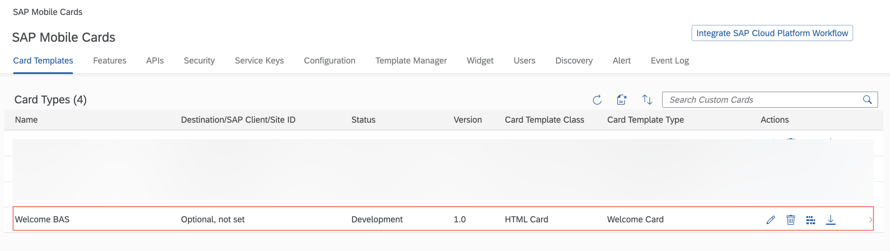

4. In the Versions table, click the  icon to change the state to **Productive**.

    !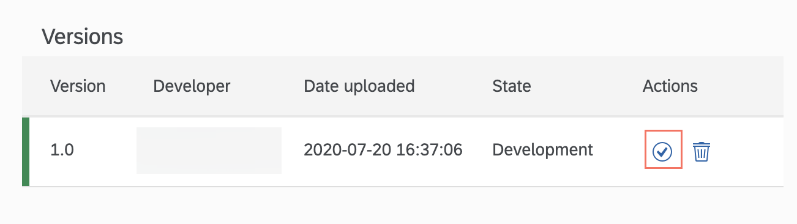

5. Choose **Yes** to confirm.

    !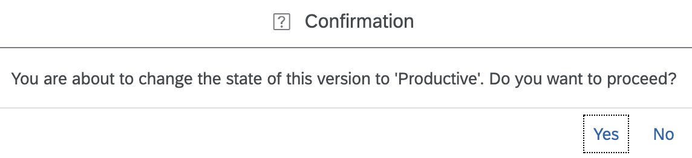

[VALIDATE_2]
[ACCORDION-END]

[ACCORDION-BEGIN [Step 6: ](View card on your device)]

>Make sure you are choosing the right device platform tab ( **Android** or **iOS** ) **above**.

[OPTION BEGIN [Android]]

1. Perform **Pull Refresh** in the SAP Mobile Cards Android client.

    !

    > If the card is not downloaded automatically, *re-subscribe* to the Supplier Contact Card in the All Subscriptions section.

    > !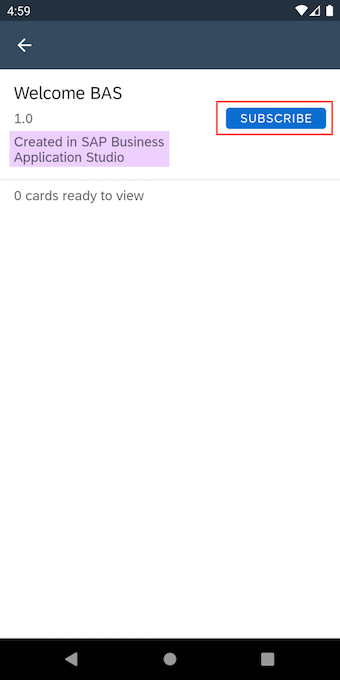

2. Tap on the card to open it, and notice the changes you made to the html file.

    !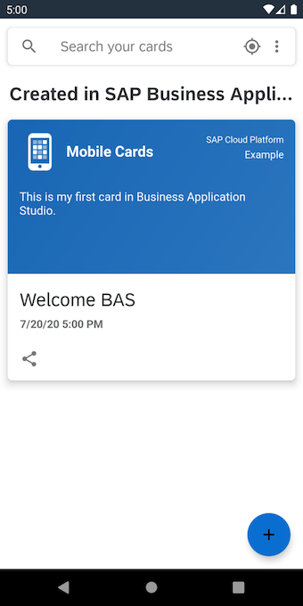

[OPTION END]

[OPTION BEGIN [iOS]]

1. Perform **Pull Refresh** in the SAP Mobile Cards iOS client.

    !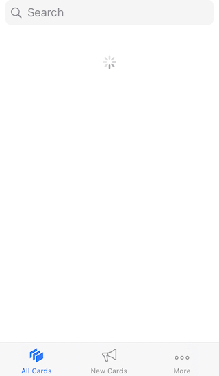

    > If the card is not downloaded automatically, *re-subscribe* to the Supplier Contact Card in *More &rarr; Subscriptions &rarr; All &rarr; Supplier Contact Card*.

    > !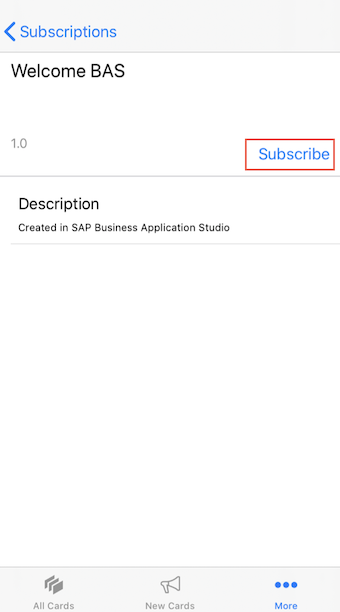

2. Tap on the card to open it, and notice the changes you made to the html file.

    !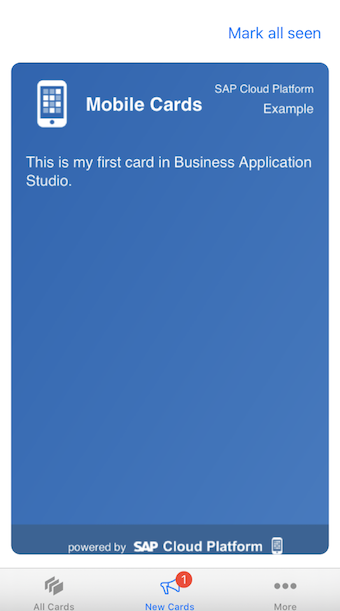

[OPTION END]

[DONE]
[ACCORDION-END]

---

**Congratulations!** You have created your first card through SAP Business Application Studio.

You can now build more [**SAP Mobile Cards apps**](https://developers.sap.com/tutorial-navigator.html?tag=products:content-and-collaboration/sap-mobile-cards) using SAP Business Application Studio.

---
