## Prerequisites
- [Create Your First Mobile Card (Welcome) Using Boosters](cp-mobile-cards-welcome)
- **Install SAP Mobile Cards Application:**
   <table><tr><td align="center">! Android</td><td align="center">! iOS</td></tr></table>

## Details
### You will learn
  - How to create a card using SAP Business Technology Platform Boosters
  - How to create a card with context specific actions
  - How to perform contact actions without saving the contact details on your mobile phone

---

[ACCORDION-BEGIN [Step 1: ](The real-world use cases)]

1. **Supplier Contact Card Use Case**

    Your are a supplier relationship manager. As a part of your job you are required to frequently interact with and even visit the suppliers. Since the list of suppliers keeps changing from month to month and product to product, you find it difficult to store the information of active suppliers on your mobile phone.

    Thus, you are looking for a solution that keeps the contact information of the active suppliers in one place. Furthermore, you want the ability to call, text, e-mail etc. without having to save these numbers in your contacts app. Finally, you want the solution to run on both Android and iOS with minimal development effort.

2. **Sales Order Approval Card Use Case**

    You are a sales manager. You usually need to log into your computer to Approve or Reject Sales Order(s) raised by your teammates. Since you too are constantly on the move, you want to avoid using your computer for performing these actions.

    Thus, you are looking for a solution that let's you approve or reject an order and provide comments on your mobile device. While you have an Android device, other managers like you have iOS device. Thus, you want the solution to run on both Android and iOS.

The SAP Mobile Cards [Contact Card Template](https://github.com/SAP-samples/mobile-cards-templates/tree/master/Contact%20Card%20Template%20-%20Multi%20Instance) and [Sales Order Approval Card Template](https://github.com/SAP-samples/mobile-cards-templates/tree/master/Sales%20Order%20Approval%20Card%20-%20Multi%20Instance) are [multi-instance cards](https://help.sap.com/doc/f53c64b93e5140918d676b927a3cd65b/Cloud/en-US/docs-en/guides/getting-started/mck/mck-development-features.html#card-types-and-templates), which allow you to represent the details maintained in your back-end system as multiple cards.

[DONE]
[ACCORDION-END]

[ACCORDION-BEGIN [Step 2: ](Create cards using Boosters)]

1. Log into your [SAP BTP Trial account](https://account.hanatrial.ondemand.com)

2. Click **Enter Your Trial Account**

    !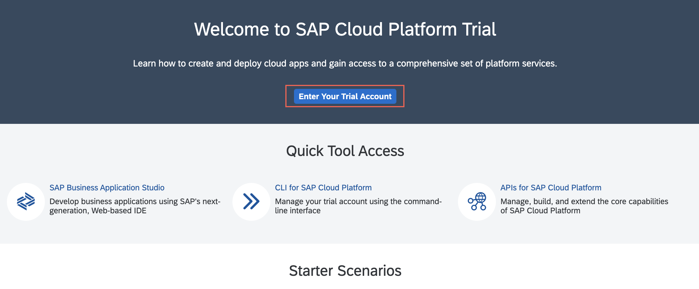

3. Click **Boosters** option in the Side Navigation Bar

    !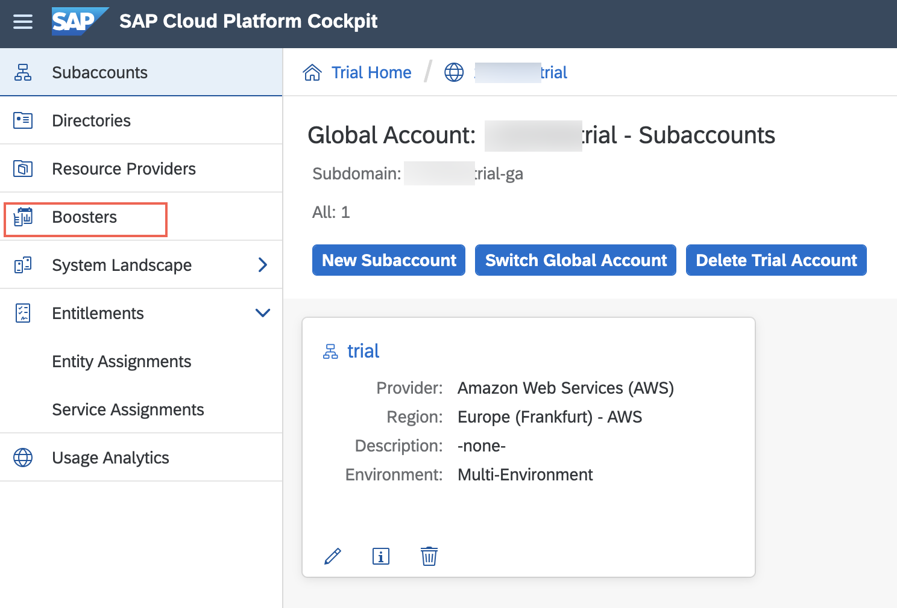

4. Search for **Mobile**, and click **Start** for *Build a Micro App for SAP Mobile Cards*.

    !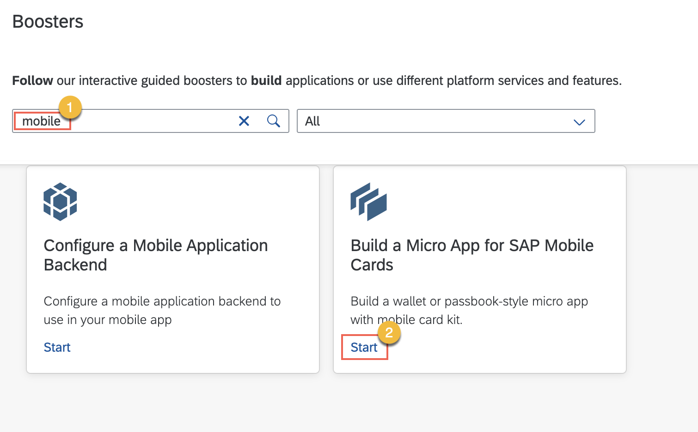

5. Click **Next** in the *Check Prerequisites* step.

    !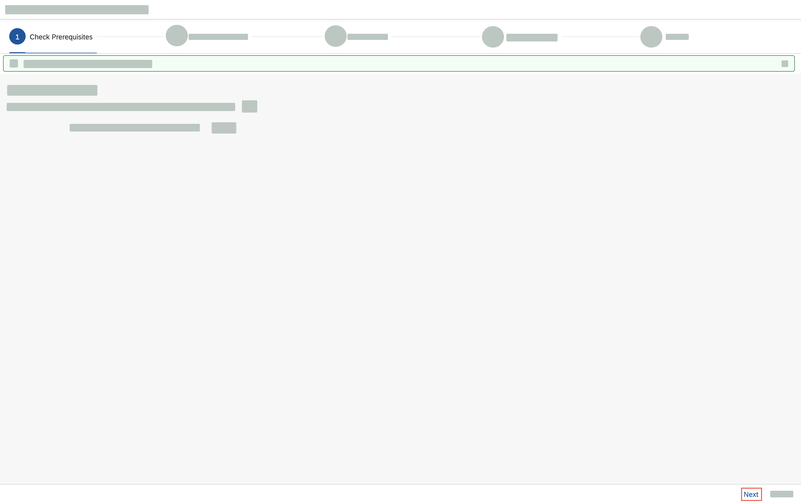

6. Select the target **Subaccount** and **Space**, and click **Next** in the *Select Subaccount* step.

    !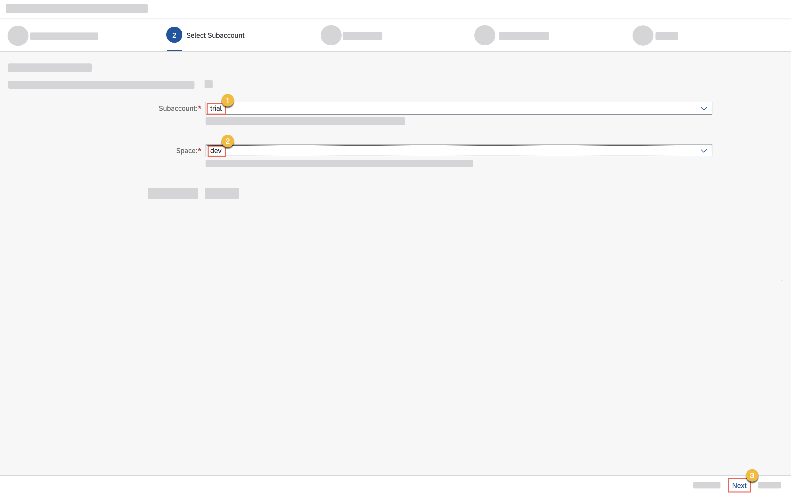

    > If the status of Mobile Card Kit is not **Available**, complete the prerequisite [tutorial to create a welcome card](cp-mobile-cards-welcome).

7. Select **Contact Card Template - Multi Instance** card, and **Sales Order Approval Card - Multi Instance**, and click **Next** in the *Select Cards* step.

    !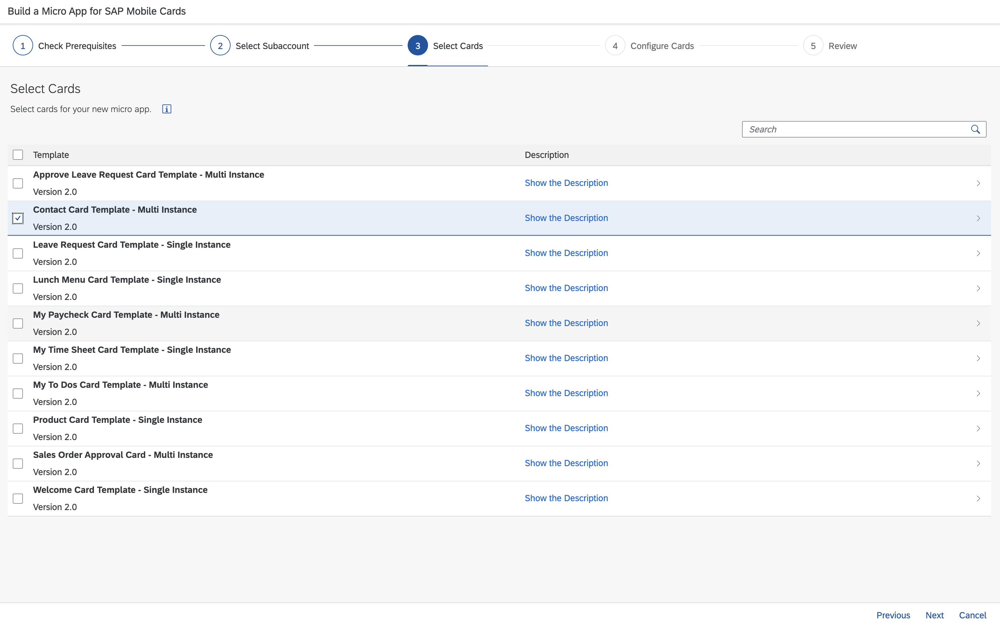

8. Enter the following details, and click **Next** in the *Configure Cards* step.

    |Card Template Type| Input Value|
    |---|---|
    |*Contact Card Template - Multi Instance*| `Supplier Contact Card`|
    |*Sales Order Approval Card - Multi Instance*| `Sales Order Approval Card`|

    !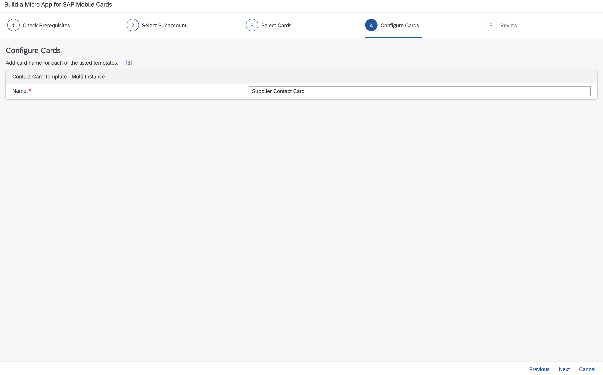

9. Review the details you've entered, and click **Finish** in the *Review* step.

    !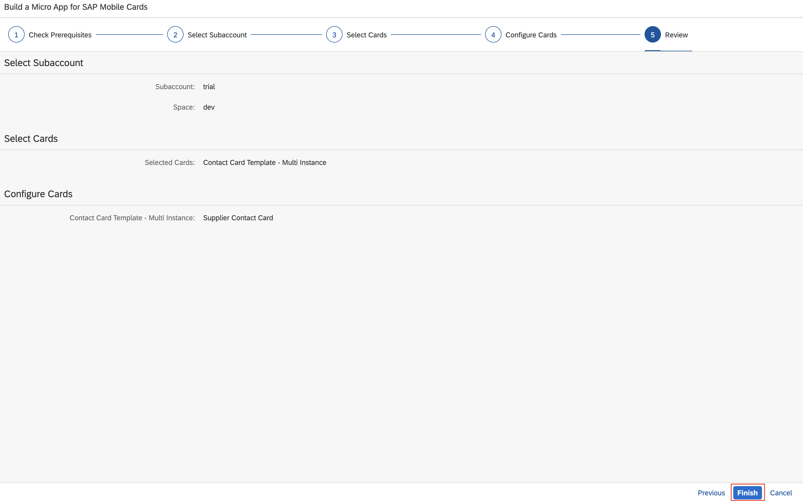

[DONE]
[ACCORDION-END]

[ACCORDION-BEGIN [Step 3: ](View supplier contact card on your mobile device)]

>Make sure you are choosing the right device platform tab ( **Android** or **iOS** ) **above**.

[OPTION BEGIN [Android]]

> If you can see the supplier card, skip to step 6.

1. *Tap* the Add button  in the SAP Mobile Cards Android application.

    !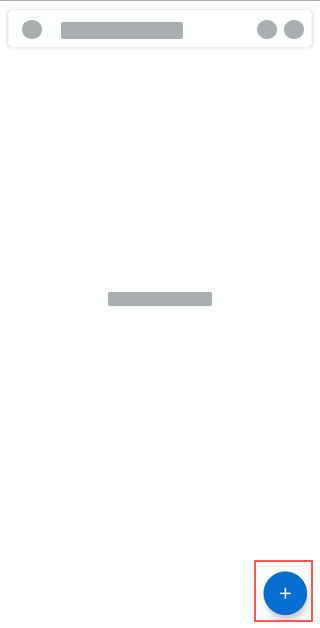

2. *Tap* **Subscriptions**.

    !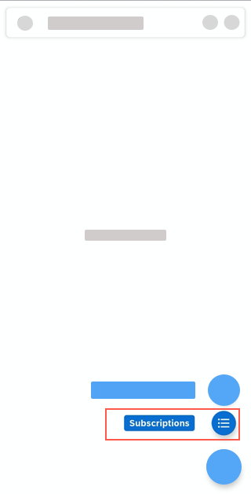

3. *Tap* **Supplier Contact Card**.

    !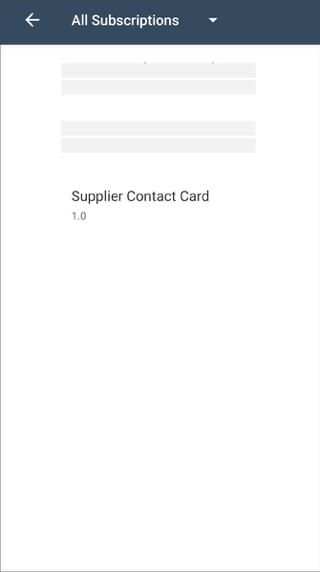

4. *Tap* **Subscribe**.

    !

5. *Tap* back **&larr;** twice to go back to the card view.

    !

6. Enter **travel adapter** in the search bar of the app, and *Tap* the card.

    !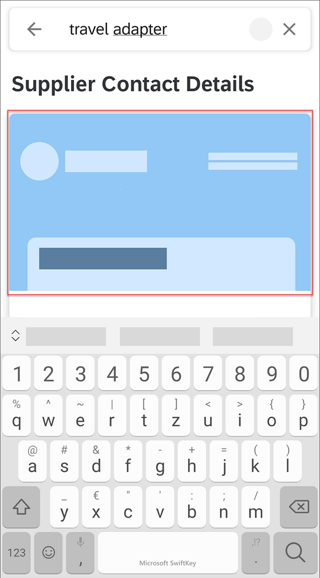

    > The app is capable of searching the details within the card. So, as a relationship supplier manager, if you know that you want to procure travel adapters, you can simply search for it in the search bar, and the app will show a list of all the suppliers that supply a travel adapter as cards.

7. *Tap* the actions menu ().

    !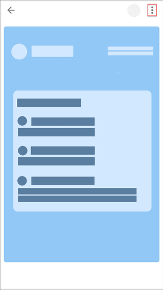

8. *Tap* on `Call`, `SMS`, `Open Maps` and `Email` action to perform the corresponding action.

    !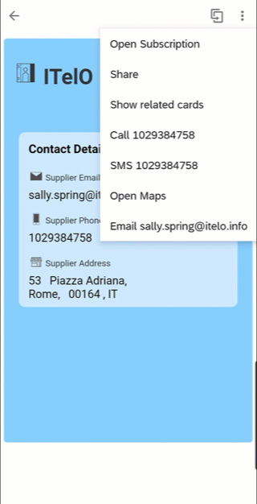

[OPTION END]

[OPTION BEGIN [iOS]]

> If you can see the supplier card, skip to step 5.

1. *Tap* **More** &rarr; **Subscriptions** in the SAP Mobile Cards iOS application.

    !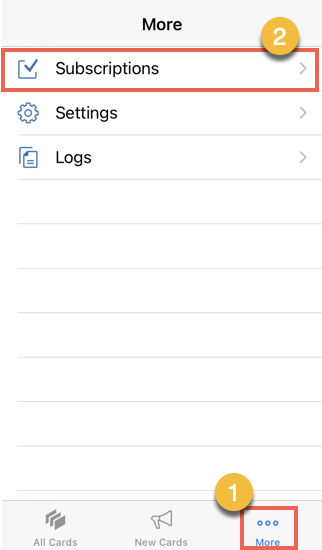

2. *Tap* the **All** tab, and then *tap* **Office Products**.

    !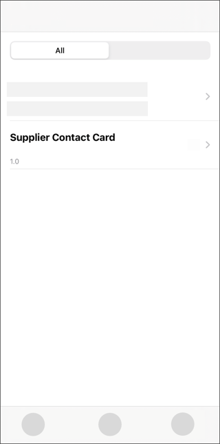

3. *Tap* **Subscribe**.

    !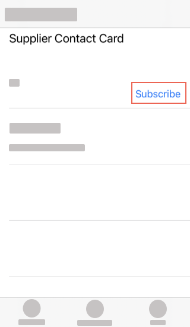

4. *Tap* **All Cards**.

    !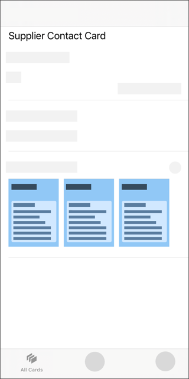

5. *Tap* a card to open it, and see the contact details of the supplier on the front of the card.

    !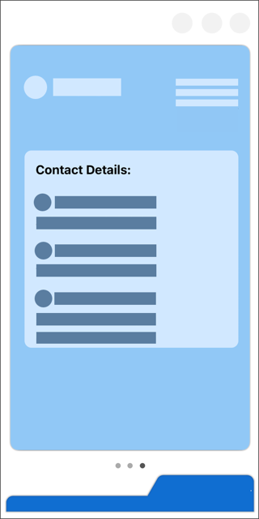

    > If you are on a trial landscape, you will see a maximum of 3 card instances, i.e. 3 products.

    > Use the carousel to swipe left/right and select a card.

6. *Tap* the flip card button , and then *Tap* the actions button  to view the actions.

    !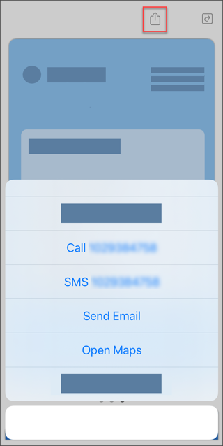

7. *Tap* `Call`, `SMS`,`Email`, and `Open Maps` action to perform the corresponding action.

    !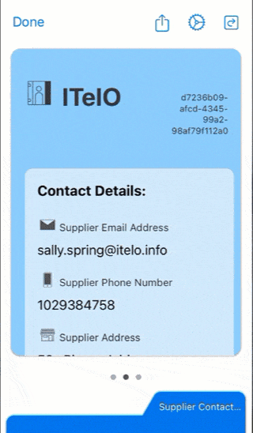

[OPTION END]

[VALIDATE_1]
[ACCORDION-END]

[ACCORDION-BEGIN [Step 4: ](View sales order approval card on your mobile device)]

>Make sure you are choosing the right device platform tab ( **Android** or **iOS** ) **above**.

[OPTION BEGIN [Android]]

> If you can see the supplier card, skip to step 6.

1. *Tap* the Add button  in the SAP Mobile Cards Android application.

    !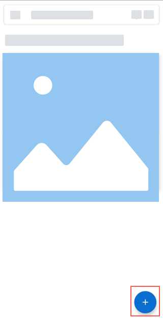

2. *Tap* **Subscriptions**.

    !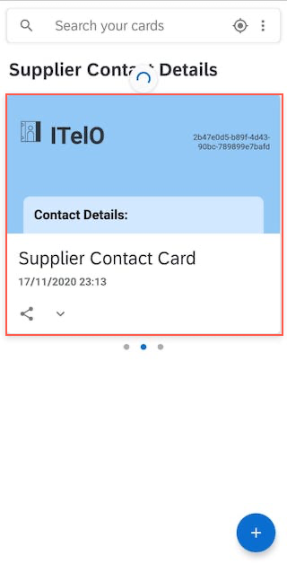

3. *Tap* **Sales Order Approval Card**.

    !

4. *Tap* **Subscribe**.

    !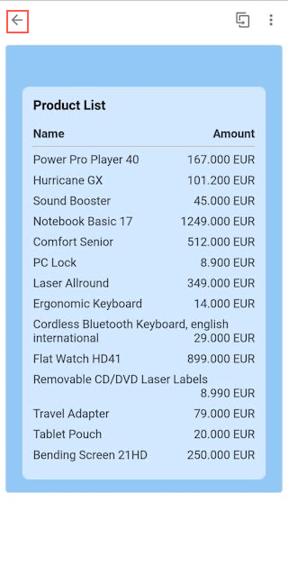

5. *Tap* back **&larr;** twice to go back to the card view.

    !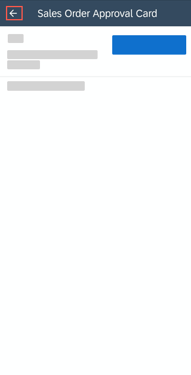

6. *Tap* on a card to open it.

    !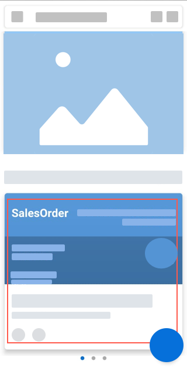

7. *Tap* the actions menu (), and *Tap* **Approve Order**.

    !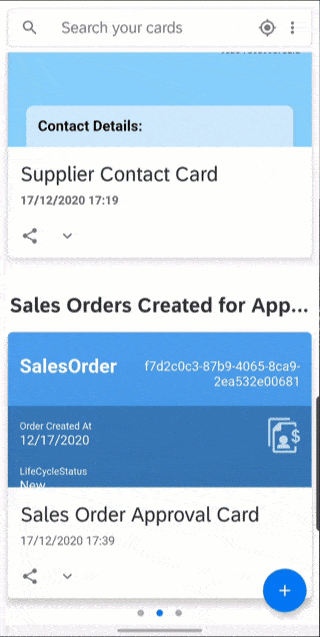

    > The value for `LifeCycleStatus` changes to Accepted.

8. *Tap* back (&larr;) &rarr; *Expand* the **actions menu** in the main view &rarr; *Tap* Reject Order &rarr; *Enter* a reason e.g. `Invalid Amount` &rarr; *Tap* **Reject Order**.

    !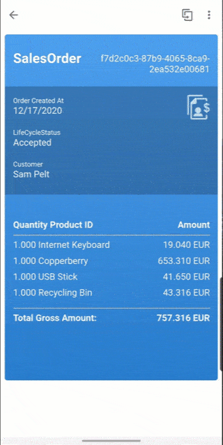

    > The value for `LifeCycleStatus` changes to Rejected: Invalid Amount.

[OPTION END]

[OPTION BEGIN [iOS]]

> If you can see the supplier card, skip to step 5.

1. *Tap* **More** &rarr; **Subscriptions** in the SAP Mobile Cards iOS application.

    !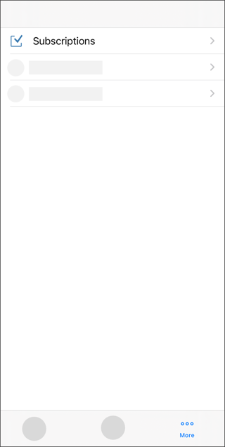

2. *Tap* the **All** tab, and then *tap* **Sales Order Approval Card**.

    !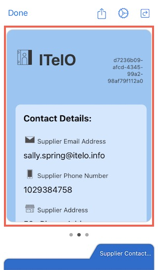

3. *Tap* **Subscribe**.

    !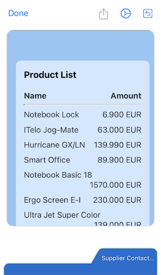

4. *Tap* **All Cards**.

    !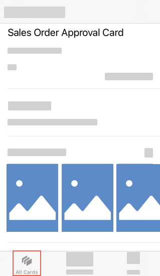

5. *Tap* a card to open it.

    !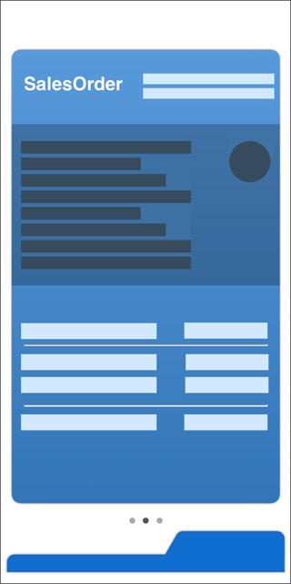

    > If you are on a trial landscape, you will see a maximum of 3 card instances, i.e. 3 products.

    > Use the carousel to swipe left/right and select a card.

6. *Tap* the flip card button  &rarr; *Tap* on the actions button  &rarr; *Tap* on **Approve Order**.

    !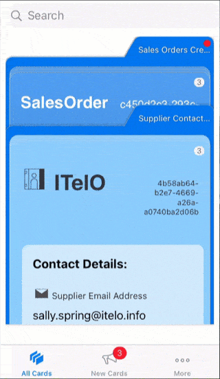

    > The value for `LifeCycleStatus` changes to Accepted.

7. *Tap* the actions button  &rarr; *Tap* **Reject Order** &rarr; *Enter* a reason e.g. `Invalid Amount` &rarr; *Tap* **Reject Order**.

    !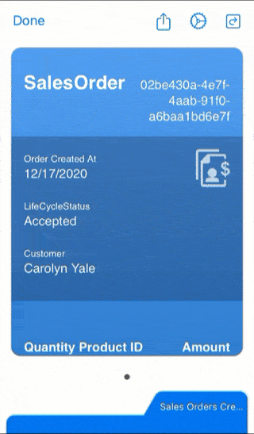

[OPTION END]

[VALIDATE_2]
[ACCORDION-END]

**Congratulations!** You have successfully built a contact card and an approval card that enhances an employee's work-life.

---
