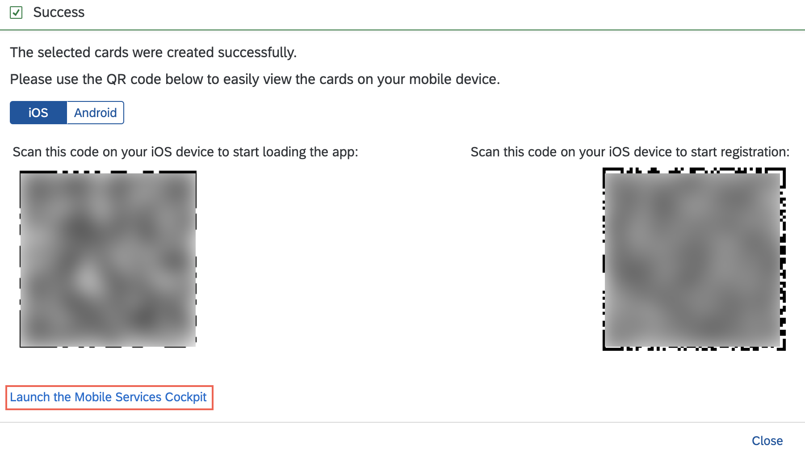
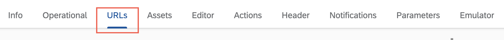
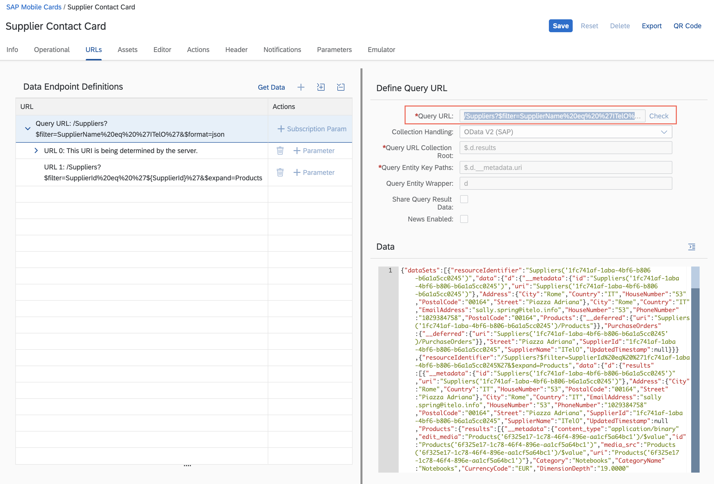
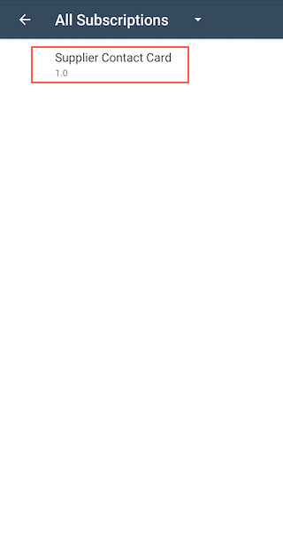
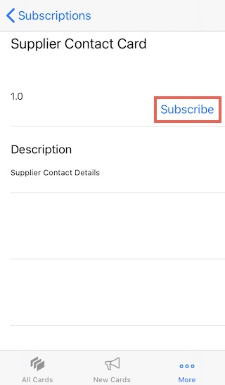

## Prerequisites
- [Create Your First Mobile Card (Welcome) Using Boosters](cp-mobile-cards-welcome)
- **Install SAP Mobile Cards Application:**
   <table><tr><td align="center">! Android</td><td align="center">! iOS</td></tr></table>

## Details
### You will learn
  - How to create a card using SAP Cloud Platform Boosters
  - How to create a card with context specific actions
  - How to perform contact actions without saving the contact details on your mobile phone

---

[ACCORDION-BEGIN [Step 1: ](Get Familiar With The Real World Use Case)]

Your are a supplier relationship manager. As a part of your job you are required to frequently interact with and even visit the suppliers. Since the list of suppliers keeps changing from month to month and product to product, you find it difficult to store the information of active suppliers on your mobile phone.

Thus, you are looking for a solution that keeps the contact information of the active suppliers in one place. Furthermore, you want the ability to call, text, e-mail etc. without having to save these numbers in your contacts app. Finally, you want the solution to run on both Android and iOS with minimal development effort.

The SAP Mobile Cards [Contact Card Template](https://github.com/SAP-samples/mobile-cards-templates/tree/master/Contact%20Card%20Template%20-%20Multi%20Instance) is a [multi-instance card](https://help.sap.com/doc/f53c64b93e5140918d676b927a3cd65b/Cloud/en-US/docs-en/guides/getting-started/mck/mck-development-features.html#card-types-and-templates) that allows you to represent the details of your supplier that are maintained in your IT system. It also provides contextual actions.

[DONE]
[ACCORDION-END]

[ACCORDION-BEGIN [Step 2: ](Create A Contact Card Using Boosters)]

1. Log into your [SAP CP Trial account](https://account.hanatrial.ondemand.com)

2. Click **Enter Your Trial Account**

    !

3. Click **Boosters** option in the Side Navigation Bar

    !

4. Search for **Mobile**, and click **Start** for *Build a Micro App for SAP Mobile Cards*.

    !

5. Click **Next** in the *Check Prerequisites* step.

    !

6. Select the target **Subaccount** and **Space**, and click **Next** in the *Select Subaccount* step.

    !

    > If the status of Mobile Card Kit is not **Available**, complete the prerequisite [tutorial to create a welcome card](cp-mobile-cards-welcome).

7. Select **Contact Card Template - Multi Instance** card, and click **Next** in the *Select Cards* step.

    !

8. Enter `Supplier Contact Card` as the name of the card, and click **Next** in the *Configure Cards* step.

    !

9. Review the details you've entered, and click **Finish** in the *Review* step.

    !

[DONE]
[ACCORDION-END]

[ACCORDION-BEGIN [Step 3: ](Open The Card In Mobile Services Cockpit)]

1. Click **Launch the Mobile Services Cockpit** to open the mobile services cockpit where the *Supplier Contact Card* has been deployed.

    !

    > The mobile services cockpit is used to perform [administrator actions](https://help.sap.com/doc/f53c64b93e5140918d676b927a3cd65b/Cloud/en-US/docs-en/guides/getting-started/mck/mck-managing-cards.html) for the cards. Thus, you may bookmark the **Mobile Services cockpit URL** for quick access in future.

2. Click **Supplier Contact Card** in the Card Templates tab.

    !

3. Click **URLs** tab.

    !

4. Notice that the Query URL filters the Suppliers whose name is `ITelO`.

    !

[DONE]
[ACCORDION-END]

[ACCORDION-BEGIN [Step 4: ](View The Supplier Contact Card On Your Mobile Device)]

>Make sure you are choosing the right device platform tab ( **Android** or **iOS** ) **above**.

[OPTION BEGIN [Android]]

1. Perform **Pull Refresh** in the SAP Mobile Cards Android client.

    !

    > If the card is not downloaded automatically, *re-subscribe* to the Supplier Contact Card in the All Subscriptions section.

    > !

2. **Tap** a card to open it. You can see the contact details of the supplier on the front of the card.

    !

    > Use the carousel to swipe left/right and select a card.

3. **Tap**  to flip the card and view the list of products sold by the supplier.

    !

4. **Tap &larr;** until you return to the cards list view.

    !

5. Enter **travel adapter** in the search bar of the app, and **Tap** the card.

    !

    > The app is capable of searching the details within the card. So, as a relationship supplier manager, if you know that you want to procure travel adapters, you can simply search for it in the search bar, and the app will show a list of all the suppliers that supply a travel adapter as cards.

6. Tap on  to view the actions.

    !

7. **Tap** on `Call`, `SMS`, `Open Maps` and `Email` action to perform the corresponding action.

    !

[OPTION END]

[OPTION BEGIN [iOS]]

1. Perform **Pull Refresh** in the SAP Mobile Cards iOS client.

    !

    > If the card is not downloaded automatically, *re-subscribe* to the Supplier Contact Card in *More &rarr; Subscriptions &rarr; All &rarr; Supplier Contact Card*.

    > !

2. **Tap** a card to open it. You can see the contact details of the supplier on the front of the card.

    !

    > Use the carousel to swipe left/right and select a card.

3. **Tap**  to flip the card and view the list of products sold by the supplier.

    !

4. **Tap** , and then **Tap** on  to view the actions.

    !

6. **Tap** on `Call`, `SMS`,`Email`, and `Open Maps` action to perform the corresponding action.

    !

Congratulations, you have successfully built a contact card that enhances a supplier relationship manager's work-life!

[OPTION END]

[VALIDATE_1]
[ACCORDION-END]

---
