## Prerequisites
- [Completed the starter mission](mission.mobile-cards-get-started) or [Set up Mobile Services on your SAP Business Technology Platform account](cp-mobile-cards-setup)
- [Set up SAP Business Application Studio for Mobile Development](cp-mobile-bas-setup)
- [Created your first card in SAP Business Application Studio](cp-mobile-cards-bas-basic-card)
- **Install SAP Mobile Cards Application:**
   <table><tr><td align="center">!<br>Android</td><td align="center">!<br>iOS</td></tr></table>

## Details
### You will learn
  - How to implement a card with content-based actions
  - How to use native mobile device capabilities with SAP Mobile Cards
  - How to design, deploy and publish a new version of a card
  - How to implement subscription parameters

---

[ACCORDION-BEGIN [Step 1: ](The real-world use case)]

It is your first day in a new organisation. During the orientation program, you are told that if you require any supplies for your work/workspace, you can raise a request through a mobile application.

To make the navigation easy from hundreds of products, you want to select the category of a product and then select an item. You also want the capability to contact the supplier to check the status of your order.

[DONE]
[ACCORDION-END]

[ACCORDION-BEGIN [Step 2: ](Create a new product card)]

1. Open your Business Application Studio, and enter your Development space.

    !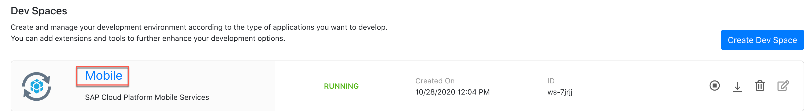

    > If your dev space is not running, click the Play Button -  to start it.

    > !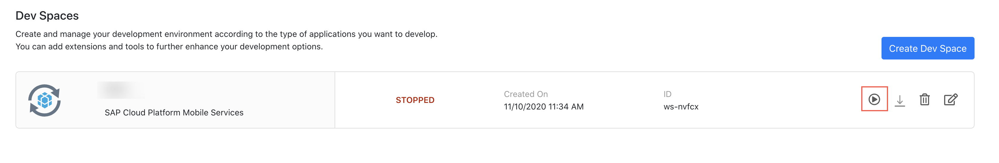

2. In the menu bar, go to View &rarr; Find Command, click Find Command.

    !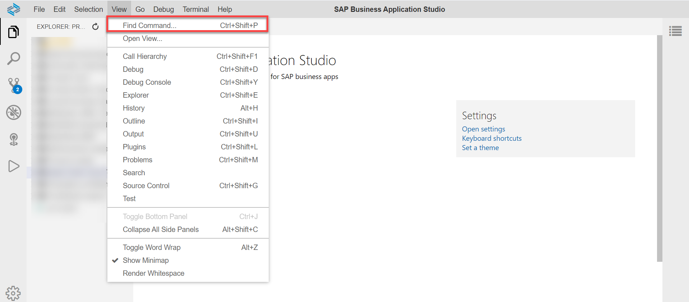

    >  For faster development, you can use the shortcut key.

3. Type *Mobile Cards: New*, and select **Mobile Cards: New From Template**.

    !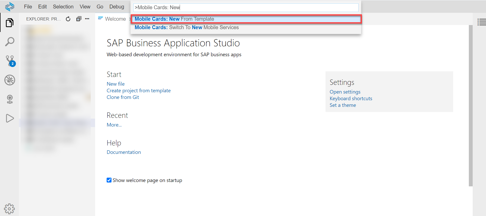

4. Select **Product Card Template - Single Instance**.

    !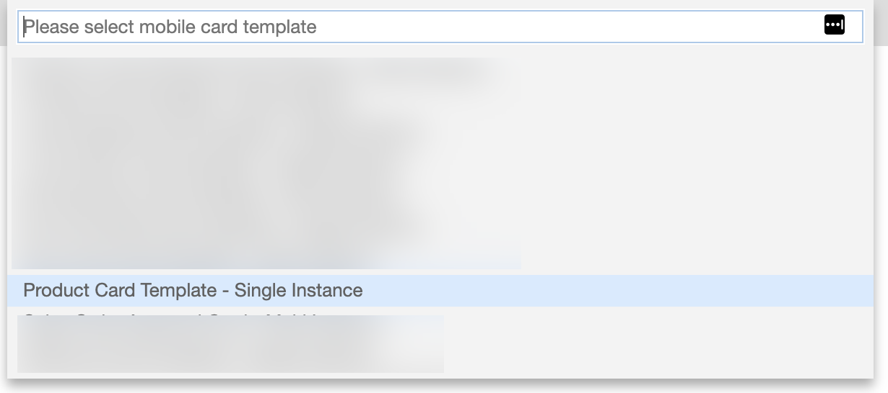

5. Enter a name for the card; e.g. **Office Products**.

    !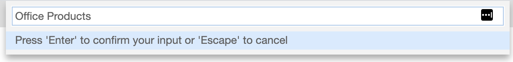

6. Open **metadata.json** file from the project explorer, and notice the `Card Template` and `Description`.

    !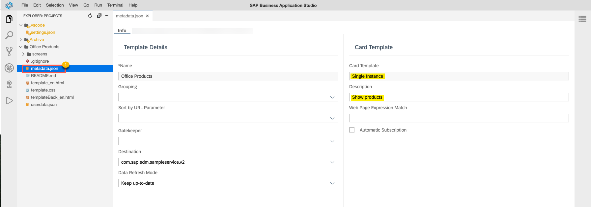

7. Right click on **metadata.json**, and click *Open With* &larr; **Code Editor**.

    !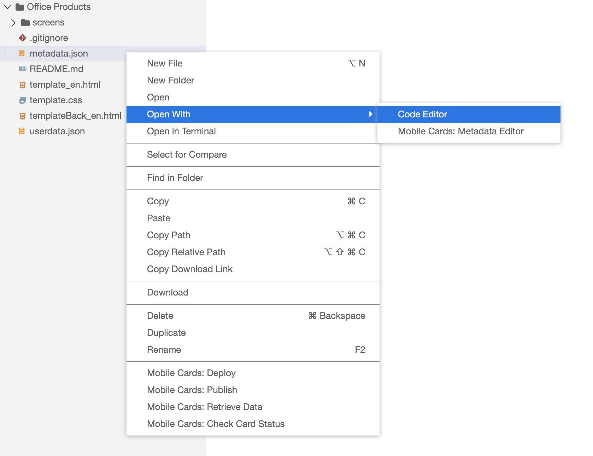

    > By default, the Application Studio launches the Metadata Editor for `metadata.json` file. To edit the raw json file, you must use the code editor option.

8. Change `CustomType` from `SingleInstance` to `Query`.

    !

9. Change `Description` and `DescriptionEnglish` from `Show products` to `Available Products`.

    !

10. Open **metadata.json** file from the project explorer, and verify the following changes.

    | Field | Value |
    | --- | --- |
    | Card Template | Multi Instance |
    | Description | Available Products |

    !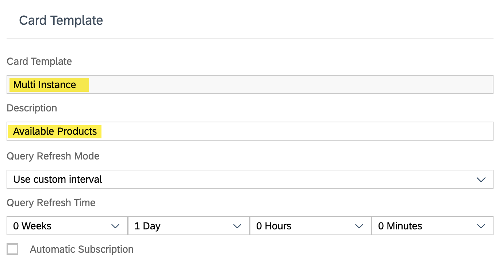

    > By changing the `CustomType` to `Query` makes the card a Multi Instance card. This change is the reason for the Query Refresh Mode and Query Refresh Time options to become visible.

    > You can learn more about Single Instance and Multi Instance cards [here](https://help.sap.com/doc/f53c64b93e5140918d676b927a3cd65b/Cloud/en-US/docs-en/guides/getting-started/mck/mck-development-features.html#card-types-and-templates).

[VALIDATE_1]
[ACCORDION-END]

[ACCORDION-BEGIN [Step 3: ](Identify product categories from the back end)]

1. In the Mobile Services cockpit, click **Mobile Connectivity** under the **Features** tab.

    !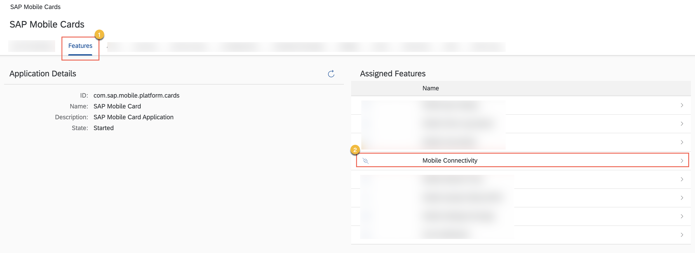

2. For the `com.sap.edm.sampleservice.v2` sample service, click the **Launch in Browser** button 

    !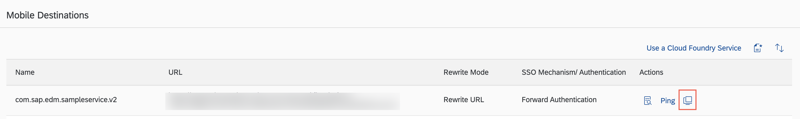

3. In the browser window that opens, add `/ProductCategories` before `?auth=uaa`.

    !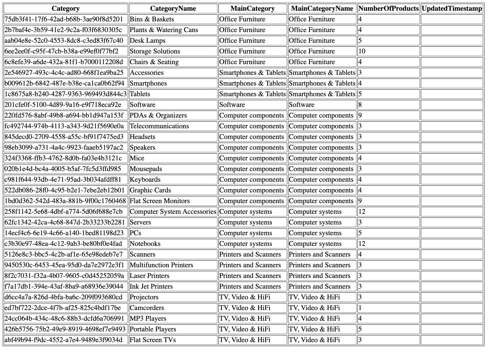

4. Make a note of 3 Category Names. e.g. `Accessories`, `Software` & `Headsets`.

    !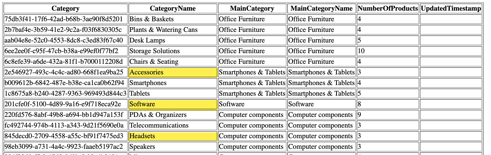

[DONE]
[ACCORDION-END]

[ACCORDION-BEGIN [Step 4: ](Prepare test data for designing)]

1. In the project explorer of your Application Studio space, open **metadata.json** file &larr; URLs Tab.

    !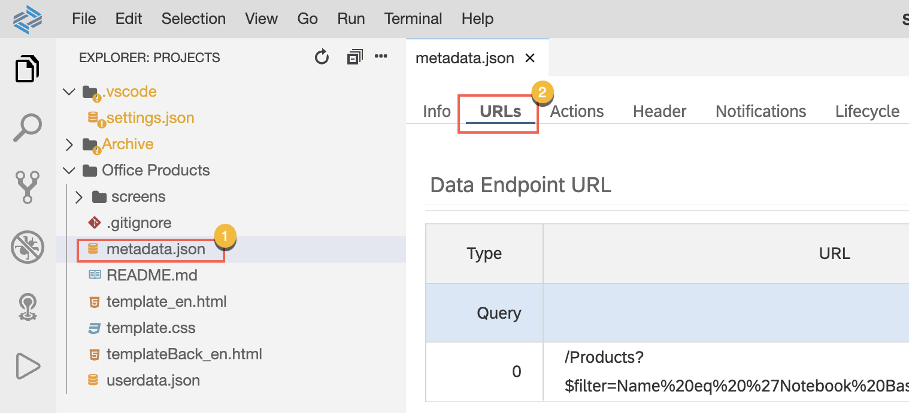

2. Change *Collection Handling* to `OData V2 (SAP)` and enter this value `/Products?$filter=Category%20eq%20%27Keyboards%27&$expand=SupplierDetails,StockDetails&$format=json` in the *Query`* field.

    !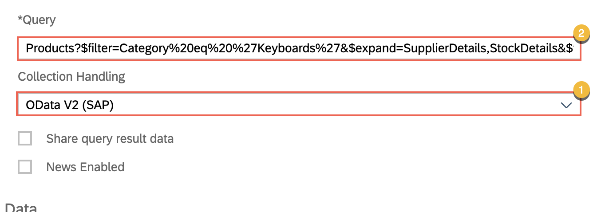

3. Open **userdata.json** file from the project explorer.

    !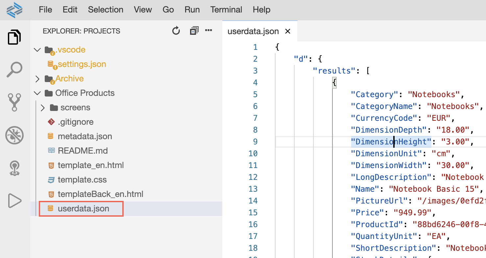

    > Since we have modified the Query URL, we must update our `userdata.json` to capture how the data would be received by the application.

4. Open Find Command, search for *Mobile Cards* and select **Mobile Cards: Retrieve Data**.

    !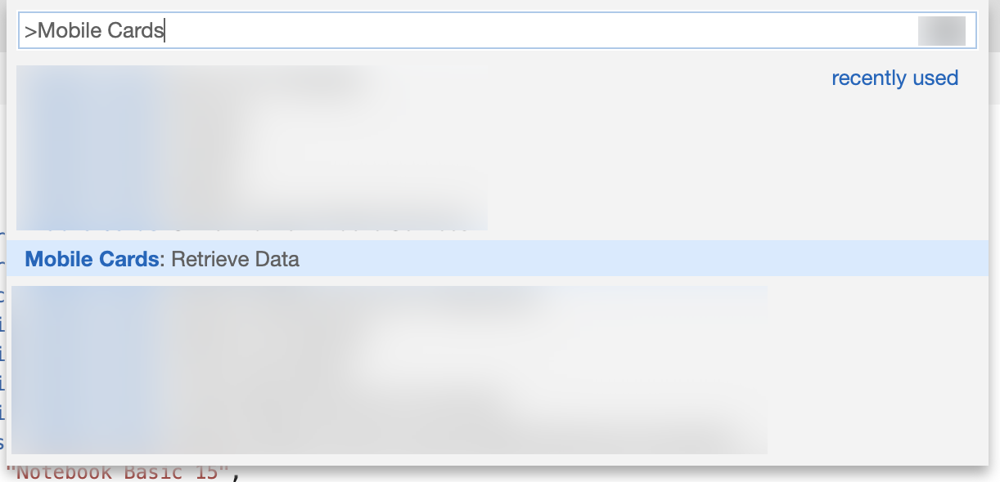

    > Your will receive a success message when the action is completed successfully.

    > !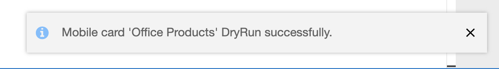

The data in `userdata.json` can now be used to design the card. You can learn more about Test Data for card design [here](https://help.sap.com/doc/f53c64b93e5140918d676b927a3cd65b/Cloud/en-US/docs-en/guides/getting-started/mck/mck-development-features.html#test-data-for-designing).

[DONE]
[ACCORDION-END]

[ACCORDION-BEGIN [Step 5: ](Design your card)]

1. Delete **templateBack_en.html** file from the project explorer.

    !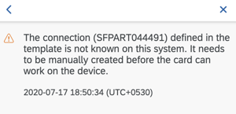

    > By default, every card has two sides: front & back. By deleting this file, we ensure that our card has only one side - the front side.

2. Open **template_en.html** file from the project explorer.

    !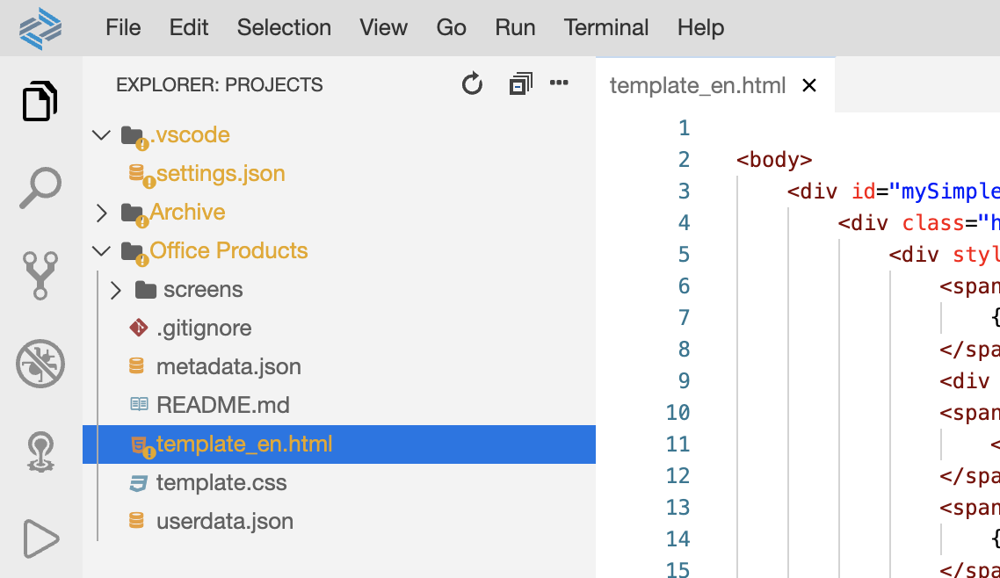

3. Open Find Command, search for *Mobile Cards* and select **Mobile Cards: Preview**.

    !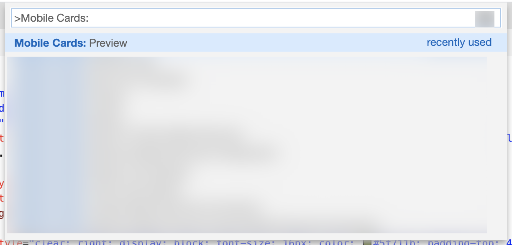

    > The preview window will open to the side.

    > !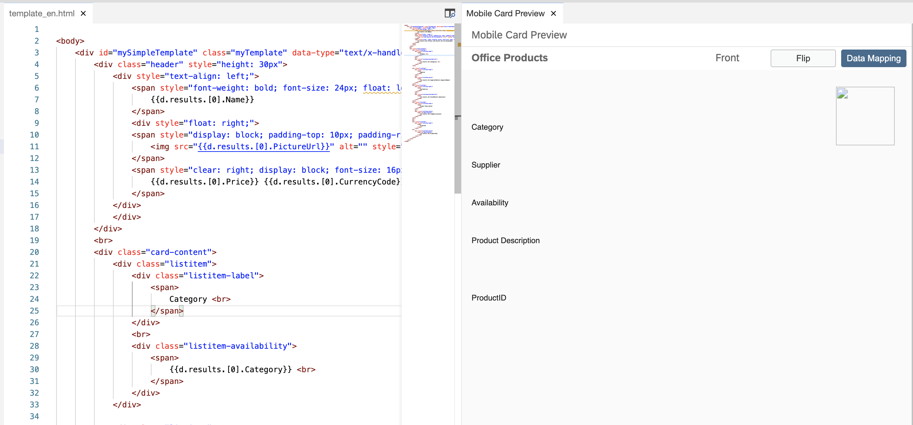

4. Replace `{{d.results.[0].Name}}` with `{{d.Name}}` in the `template_en.html` file.

    > Since we have updated our `userdata.json` file, the preview window will now show the name.

    > !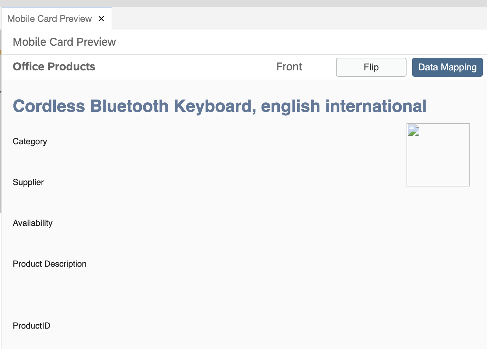

5. Copy the following code to make similar changes throughout the HTML file.

    ```HTML
    <body>
      <div id="mySimpleTemplate" class="myTemplate" data-type="text/x-handlebars-template">
          <div class="header" style="height: 30px">
              <div style="text-align: left;">
                  <span
                      style="font-weight: bold; font-size: 24px; float: left; color: #5f799b; display: inline; padding-top: 8px">
                      {{d.Name}}
                  </span>
                  <div style="float: right;">
                      <span style="display: block; padding-top: 10px; padding-right:10px;">
                          
                      </span>
                      <span style="clear: right; display: block; font-size: 16px; color: #5f711b; padding-top: 4px;">
                          {{d.Price}} {{d.CurrencyCode}}
                      </span>
                  </div>
              </div>
          </div>
          <br>
          <br>
          <div class="card-content">
              <div class="listitem">
                  <div class="listitem-label">
                      <span>
                          Category <br>
                      </span>
                  </div>
                  <br>
                  <div class="listitem-availability">
                      <span>
                          {{d.Category}} <br>
                      </span>
                  </div>
              </div>
              <br>
              <div class="listitem">
                  <div class="listitem-label">
                      <span>
                          ProductID
                      </span>
                  </div>
                  <br>
                  <div class="listitem-value">
                      <span id="description">
                          {{d.ProductId}}
                      </span>
                  </div>
              </div>
              <br>
              <div class="listitem">
                  <div class="listitem-label">
                      <span>
                          Product Description
                      </span>
                  </div>
                  <br>
                  <div class="listitem-value">
                      <span id="description">
                          {{d.LongDescription}}
                      </span>
                  </div>
              </div>
              <br>
              <div class="listitem">
                  <div class="listitem-label">
                      <span>
                          Availability
                      </span>
                  </div>
                  <br>
                  <div class="listitem-availability">
                      <span>
                          {{d.StockDetails.Quantity}}
                      </span>
                  </div>
              </div>
              <br>
              <div class="listitem">
                  <div class="listitem-label">
                      <span>
                          Supplier
                      </span>
                  </div>
                  <br>
                  <div class="listitem-value">
                      <span>
                          {{d.SupplierDetails.SupplierName}}
                      </span>
                  </div>
              </div>
              <br>
          </div>
      </div>
    </body>
    ```
    !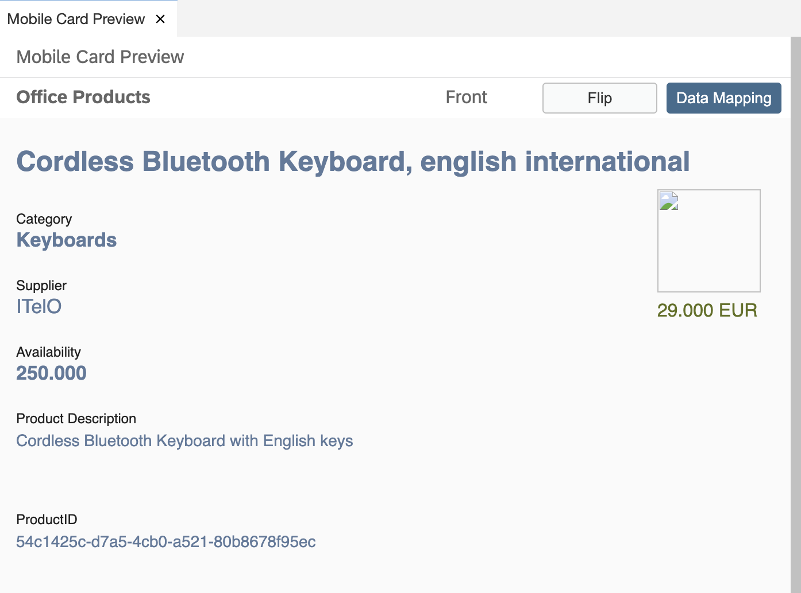

    > The Image at the top right corner of the card can't be seen since, the image refers to a relative URL on the back end.

6. To place an order with the supplier, we are expected to send an e-mail. Thus, add the following code block under the `Supplier <div>` in the `template_en.html` file.

    ```HTML
    <div class="listitem">
        <div class="listitem-label">
            <span>
                Email Address
            </span>
        </div>
        <br>
        <div class="listitem-value">
            <div class="c2g_email">
                <span>
                    {{d.SupplierDetails.EmailAddress}}
                </span>
            </div>
        </div>
    </div>
    <br>
    ```

    !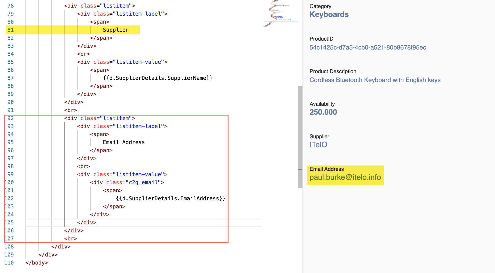

    > `c2g_email` class validates the data stored in `{{d.SupplierDetails.EmailAddress}}` and shows an action to send an e-mail.
    > This tag is called a content-based action. You can learn more about it [here](https://help.sap.com/doc/f53c64b93e5140918d676b927a3cd65b/Cloud/en-US/docs-en/guides/getting-started/mck/mck-development-features.html#content-based-actions).

    > To format your HTML file, right click on your file and select Format Document.

    >  !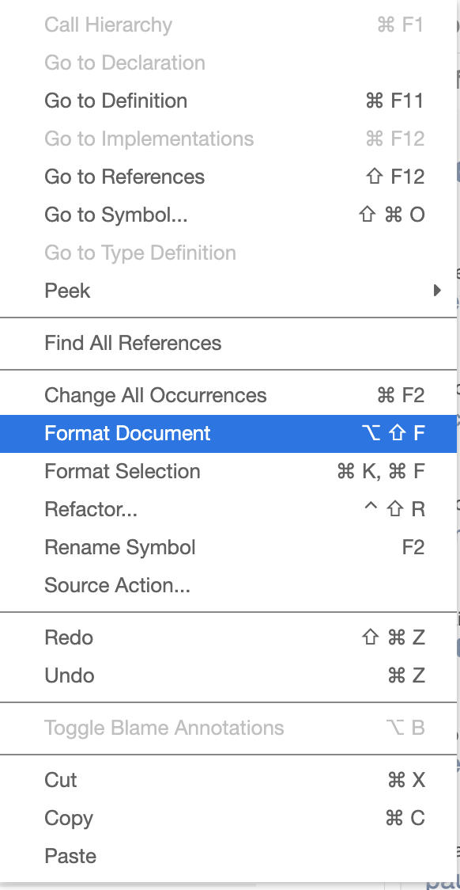

7. To follow-up on the order, you want to call or text the supplier. Thus, add the following code block under the `Email Address <div>` in the `template_en.html` file.

    ```HTML
    <div class="listitem">
        <div class="listitem-label">
            <span>
                Phone Number
            </span>
        </div>
        <br>
        <div class="listitem-value">
            <div class="c2g_phoneNumber">
                <span>
                    {{d.SupplierDetails.PhoneNumber}}
                </span>
            </div>
        </div>
    </div>
    ```

    !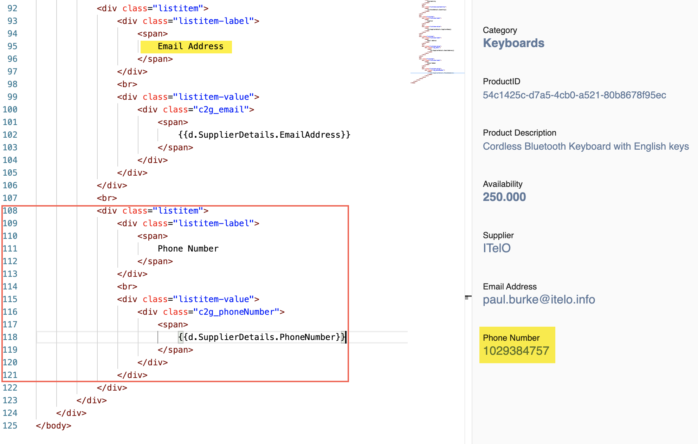

    > *c2g_phoneNumber* is the [content-based action](https://help.sap.com/doc/f53c64b93e5140918d676b927a3cd65b/Cloud/en-US/docs-en/guides/getting-started/mck/mck-development-features.html#content-based-actions).

    <!-- > You can copy the final version of the code from this file. -->

[VALIDATE_2]
[ACCORDION-END]

[ACCORDION-BEGIN [Step 6: ](Deploy and publish the card)]

1. Open Find Command, search for *Mobile Cards* and select **Mobile Cards: Deploy**.

    !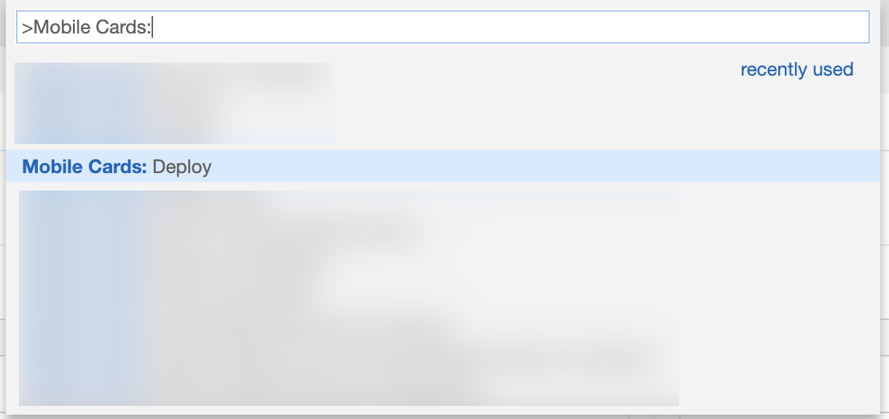

2. Select **Office Products**.

    !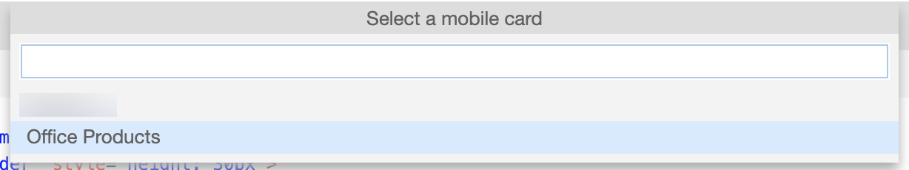

    > If prompted to enter your username & password, enter the login details you use to login to the Mobile Service cockpit.

    > Your will receive a success message when your card is successfully deployed.

    > !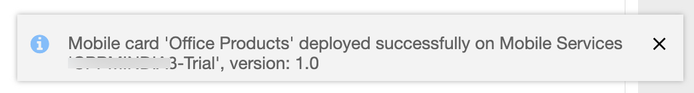

3. Open Find Command, search for *Mobile Cards* and select **Mobile Cards: Publish**.

    !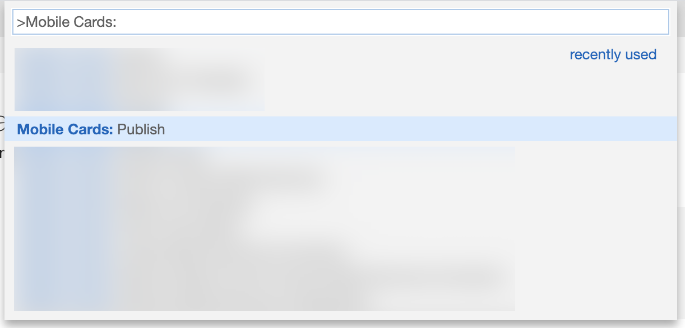

    > If prompted to enter your username & password, enter the login details you use to login to the Mobile Service cockpit.


4. Select **Office Products**.

    !

    > Your will receive a success message when your card is successfully published.

    > !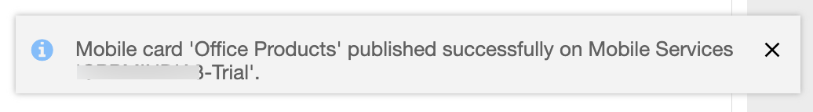

    > By default, the status of newly created cards is **Development**, and thereby can't be seen on the mobile device. By publishing the card, the card becomes productive and accessible on the device. [Click here](https://help.sap.com/doc/f53c64b93e5140918d676b927a3cd65b/Cloud/en-US/docs-en/guides/getting-started/mck/mck-managing-cards.html#card-life-cycle) to learn more about the card lifecycle.

[DONE]
[ACCORDION-END]

[ACCORDION-BEGIN [Step 7: ](View the card on your mobile device)]

>Make sure you are choosing the right device platform tab ( **Android** or **iOS** ) **above**.

[OPTION BEGIN [Android]]

1. Tap the Add button  in the SAP Mobile Cards Android application.

    !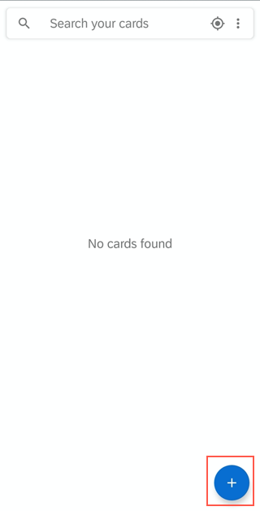

2. Tap **Subcriptions**.

    !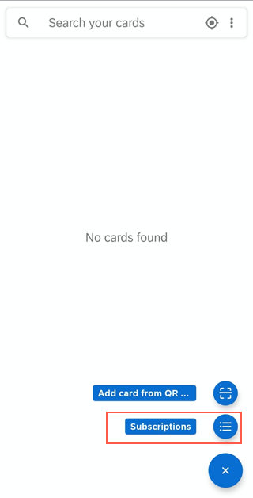

3. Tap **Office Products**.

    !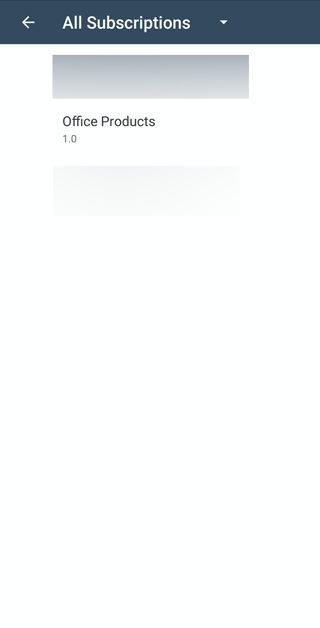

4. Notice the description, and tap **Subscribe**.

    !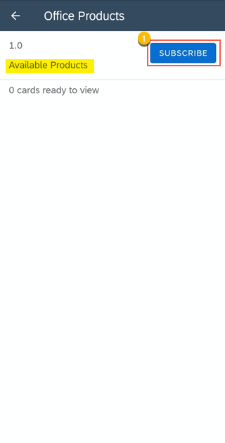

5. Tap back **&larr;** twice to go back to the card view.

    !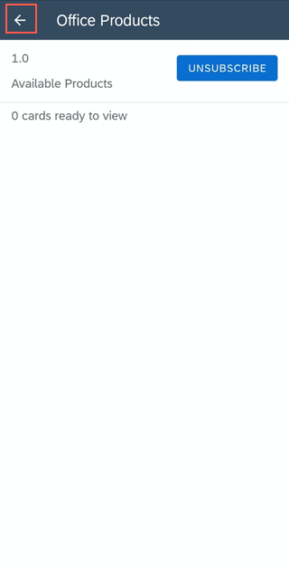

6. Scroll through the carousel, and tap a card to open it.

    !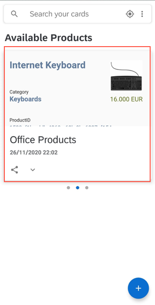

    > If you are on a trial landscape, you will see a maximum of 3 card instances, i.e. 3 products.

7. **Tap** the actions menu (), and **tap** **Email** to send an e-mail to raise an order.

    !

8. Now that you have raised an order, **tap** the actions menu (), and **tap** **SMS or Call** to contact the supplier for a follow-up on the order.

    !

[OPTION END]

[OPTION BEGIN [iOS]]

1. Tap **More** &rarr; **Subscriptions** in the SAP Mobile Cards iOS application.

    !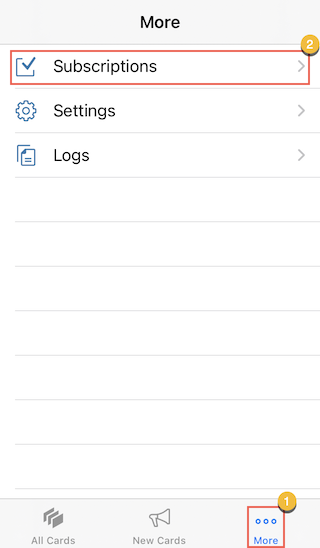

2. Tap the **All** tab, and then tap **Office Products**.

    !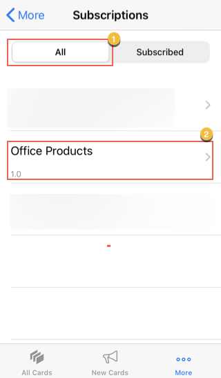

3. Notice the description, and tap **Subscribe**.

    !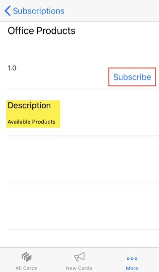

4. Tap **All Cards**.

    !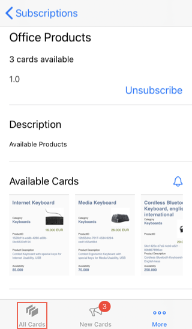

5. Tap a card to open it.

    !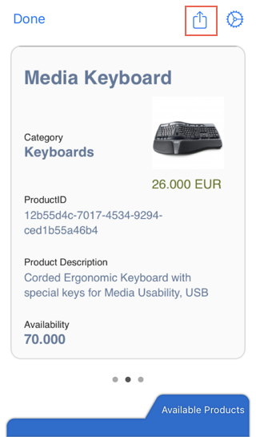

    > If you are on a trial landscape, you will see a maximum of 3 card instances, i.e. 3 products.

6. **Tap** the actions menu (), and **tap** **Email** to send an e-mail to raise an order.

    !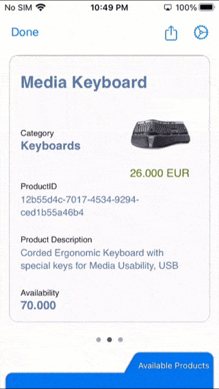

7. Now that you have raised an order, **tap** the actions menu (), and **tap** **SMS or Call** to contact the supplier for a follow-up on the order.

    !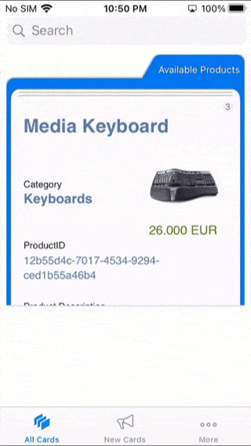

[OPTION END]

[DONE]
[ACCORDION-END]

[ACCORDION-BEGIN [Step 8: ](Add category selection)]

1. In the project explorer of your Application Studio space, open **metadata.json** file &larr; URLs Tab.

    !

2. Click add button () located above the *Parameters* table.

    !


    > The parameter defined here is a Global parameter. As suggested by the name, this parameter is accessible throughout the card. To learn more about URL parameters, [click here](https://help.sap.com/doc/f53c64b93e5140918d676b927a3cd65b/Cloud/en-US/docs-en/guides/getting-started/mck/mck-development-features.html#parameters).

3. Enter the following details to create the parameter:

    | Field | Value | Details |
    | --- | --- | --- |
    | Name | `product_Id` | Name of the parameter variable which will be used as the reference.
    | Value | `d.ProductId` | The product Id value as returned by the back end. |
    | Url | `0` | The URL serial number in the Data Endpoint URL table that returns the respective value.  

    !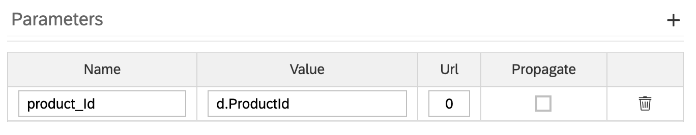

4. Click add button () located above the *Subscription Parameters* table.

    !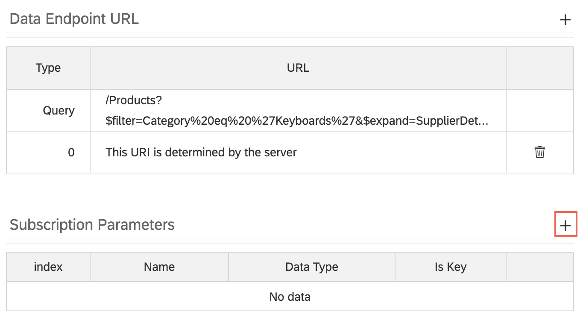

    > The parameter defined here is a Subscription parameter. A Subscription parameter allows the user to provide an input that is used to define the Query URL. To learn more about Subscription parameters, [click here](https://help.sap.com/doc/f53c64b93e5140918d676b927a3cd65b/Cloud/en-US/docs-en/guides/getting-started/mck/mck-development-features.html#parameters).

5. Enter the following details to create the Subscription parameter:

    | Field | Value | Details |
    | --- | --- | --- |
    | Name | *selected_Category* | Name of the parameter variable which will be used as the reference. |
    | Label | *Select A Category* | The text seen by the end user. |
    | Data Type | *SelectList* | A drop-down list. |
    | List Name | *Product_Categories* | You can create multiple lists in SAP Mobile Cards. This option lets you reuse an already created list. <br> *This option should be selected after filling the list options.* |
    | Is Nullable | Uncheck | The end-user must choose an option to proceed. |

    | Field | Value | Details |
    | --- | --- | --- |
    | Name | *Product_Categories* | Name of the select list. <br> *This name can be seen as an option of the List Name*. |

    | Label | Value |
    | --- | --- |
    | Accessories | *Accessories* |
    | Software | *Software* |
    | Headsets | *Headsets* |

    !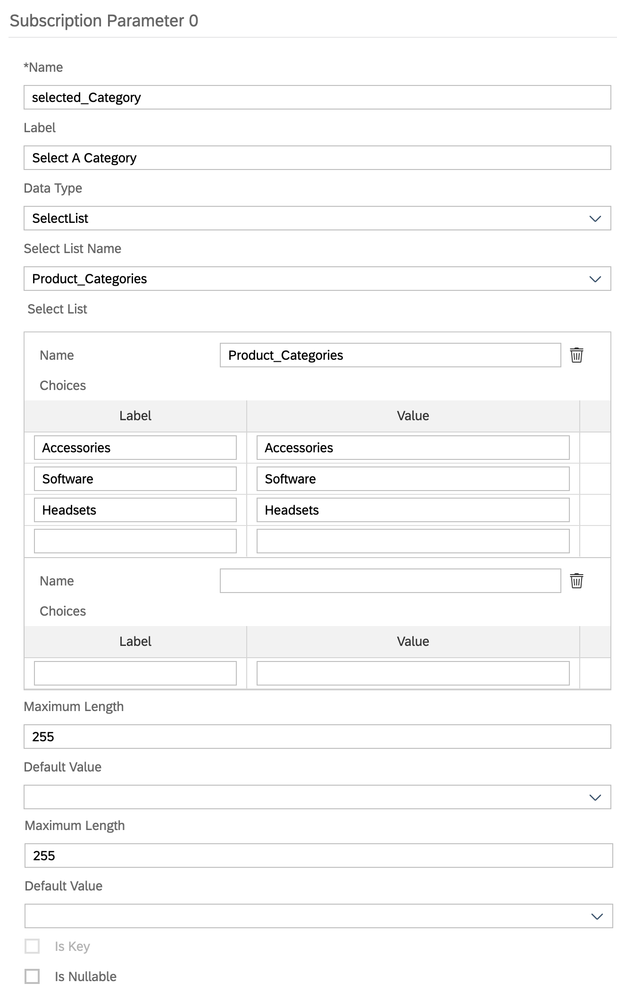

    > These values in the select list are categories that will be used to filter the response from the back end.

6. In the Query URL, replace *Keyboards* with *$selected_Category*.

    > The final query URL should be:

    >  ```
        /Products?$filter=Category%20eq%20%27${selected_Category}%27&$expand=SupplierDetails,StockDetails&$format=json
        ```

    !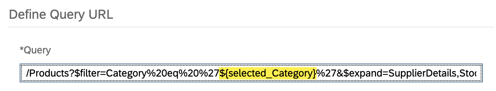

7. In the **Lifecycle** tab, update the version to `1.1`.

    !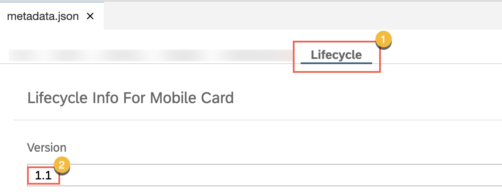

[DONE]
[ACCORDION-END]

[ACCORDION-BEGIN [Step 9: ](Deploy and publish a new version of the card)]

1. Open Find Command, search for *Mobile Cards* and select **Mobile Cards: Deploy**.

    !

2. Select **Office Products**.

    !

    > If prompted to enter your username & password, enter the login details you use to login to the Mobile Service cockpit.

    > Your will receive a success message when your card is successfully deployed.

    > !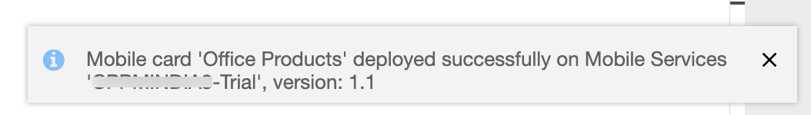

3. In the **Lifecycle** tab, click the navigate button (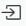) to open Mobile Services cockpit.

    !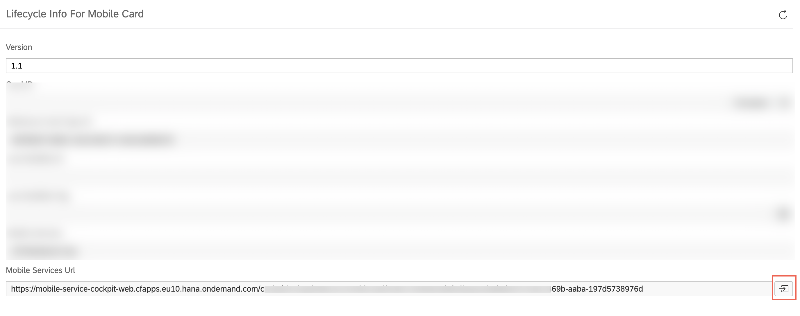


4. Click **Office Products**.

    !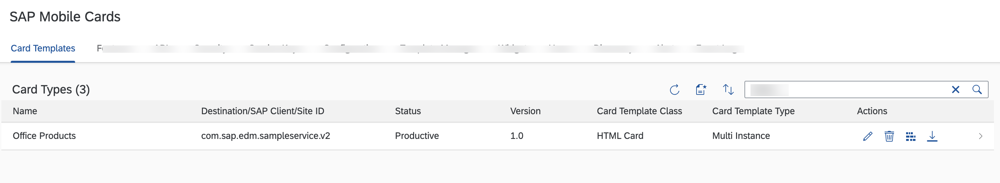

5. Click **Publish** button () for version `1.1` in the versions table to make the card productive.

    !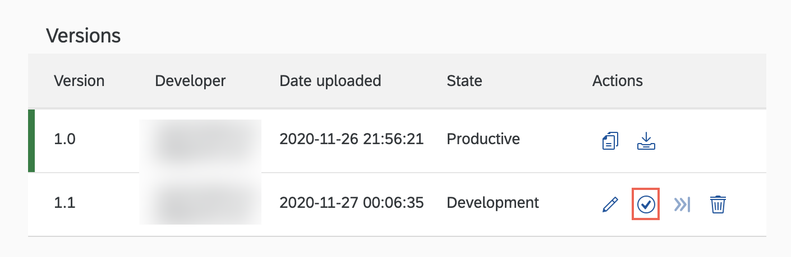

    > Earlier in this tutorial we published the card in business application studio. The option to publish a card (and maintain the lifecycle of a card) is available in the mobile services cockpit as well.

    > For details, please [click here](https://help.sap.com/doc/f53c64b93e5140918d676b927a3cd65b/Cloud/en-US/docs-en/guides/getting-started/mck/mck-managing-cards.html#card-life-cycle).

6. Click **Yes**.

    !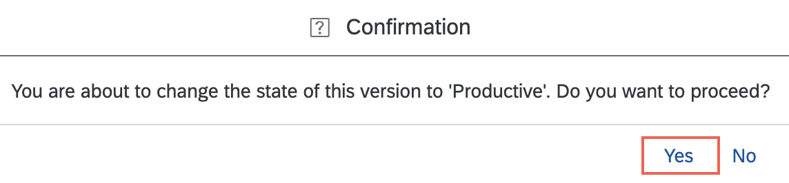

[DONE]
[ACCORDION-END]

[ACCORDION-BEGIN [Step 10: ](View the new version of the card on your mobile device)]

>Make sure you are choosing the right device platform tab ( **Android** or **iOS** ) **above**.

[OPTION BEGIN [Android]]

1. Perform **Pull Refresh** in the SAP Mobile Cards Android application.

    !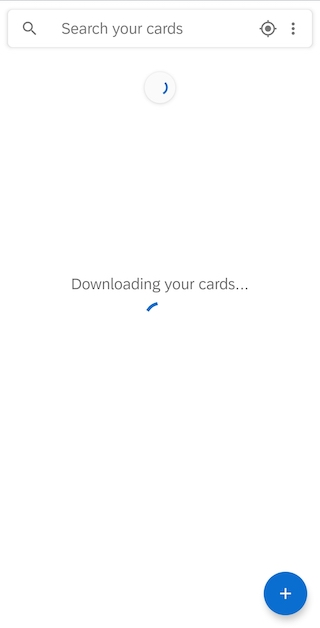

2. Tap the Add button .

    !

2. Tap **Subscriptions**.

    !

3. Tap **Office Products**.

    !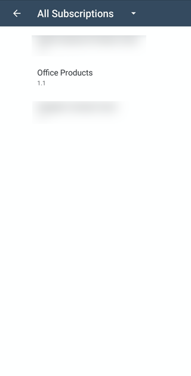

    > You may notice a check mark momentarily.  

4. Notice the version, and tap **Subscribe**.

    !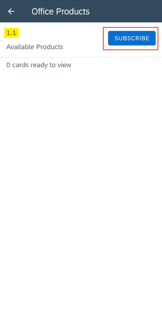

5. Select **Headsets**, click **Submit**.

    !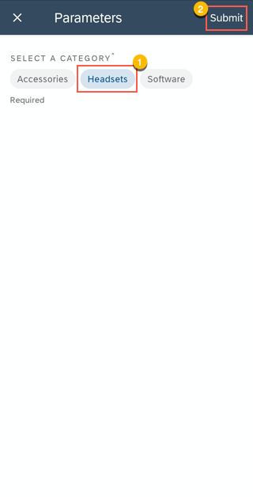

    > The list we defined in the subscription parameters can be seen here. Upon selection, products from this category will be shown as cards.

6. Tap back **&larr;** twice to go back to the card view.

    !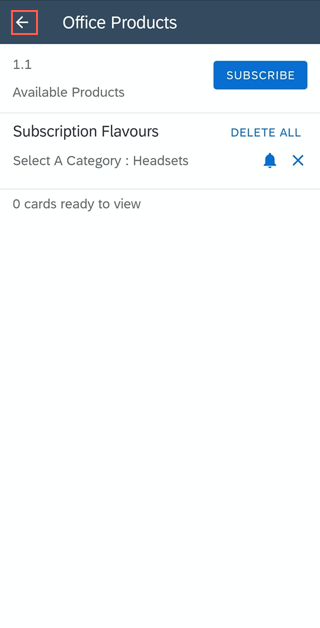

You can subscribe to other categories. Each category is grouped together and has the content actions.

!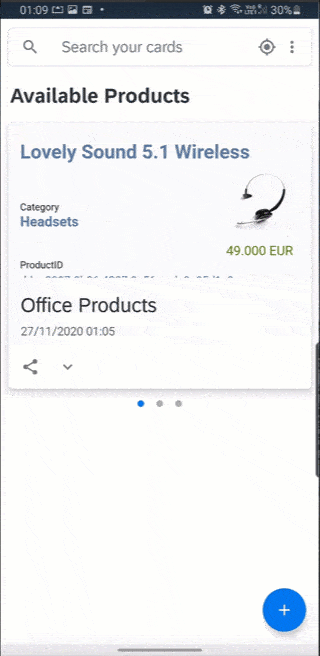

[OPTION END]

[OPTION BEGIN [iOS]]

1. Perform **Pull Refresh** in the SAP Mobile Cards iOS application.

    !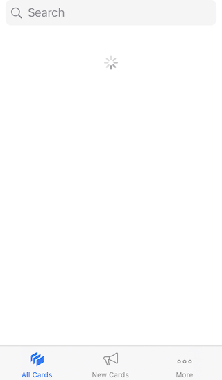

2. Tap **More** &rarr; **Subscriptions**.

    !

3. Tap the **All** tab, and then tap **Office Products**.

    !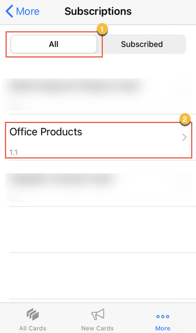

    > You may notice a check mark momentarily.  

4. Notice the version, and tap **Subscribe**.

    !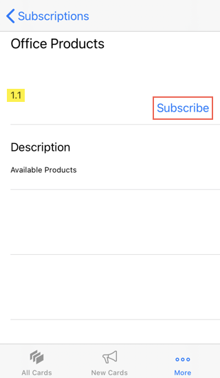

5. Select **Headsets**, click **Submit**.

    !

    > The list we defined in the subscription parameters can be seen here. Upon selection, products from this category will be shown as cards.

6. Tap **All Cards**, and then tap on a card to open it.

    !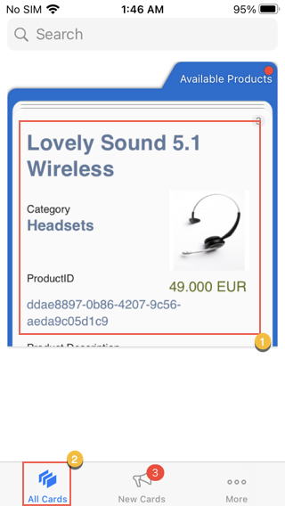

You can subscribe to other categories. Each category is grouped together and has the content actions.

!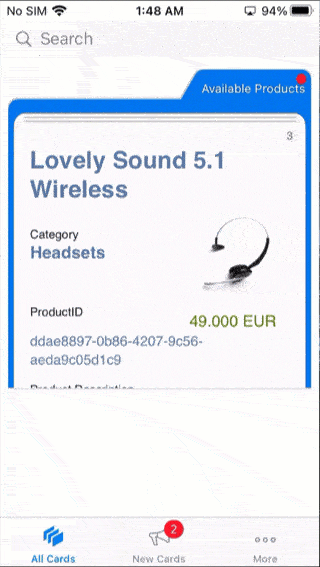

[OPTION END]

**Congratulations!** You have built a card which takes user input to show the data and then provides contextual actions.

[VALIDATE_3]
[ACCORDION-END]
