## Details
### You will learn
  - How to implement a card with content-based actions
  - How to use native mobile device capabilities with SAP Mobile Cards

---

[ACCORDION-BEGIN [Step 1: ](Get familiar with real world use case)]

A procurement manager at a company is about to visit the company's partner vendor. Rather than making a note of the company's details, the procurement manager uses SAP Mobile Cards with content based actions. The procurement manager can call the vendor, open the address in the maps app or send an email to the vendor from within SAP Mobile Cards App.

!
!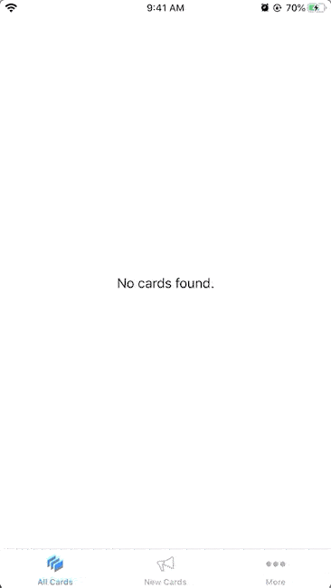

[DONE]
[ACCORDION-END]

[ACCORDION-BEGIN [Step 2: ](Create a new action card)]

Make sure you have logged in to the **SAP Cloud Platform Mobile Services cockpit**. Navigate to **SAP Mobile Cards** to look into Mobile Cards configuration.


Click the **Create Card Template** icon .

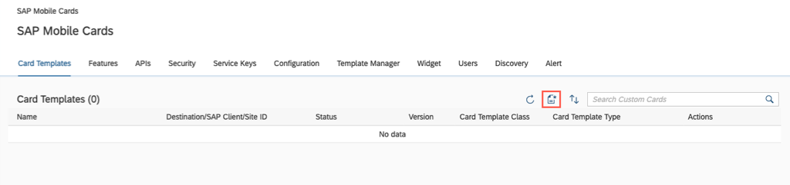

Provide the required information:

| Field | Value |
|----|----|
| **Name** | `Content Action Card` |
| **Version** | `1.0` |
| **Destination** | `com.sap.edm.sampleservice.v2` |
| **Template Source** | `Template Manager` |
| **HTML Template** | `Sample Product Template` |
| **Card Template** | `Server Managed Card` |

> If you see a notification, click **`X`** to close it.
  

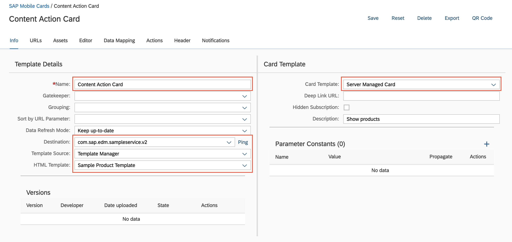

[DONE]
[ACCORDION-END]

[ACCORDION-BEGIN [Step 3: ](Implement the card with content-based actions)]

Navigate to the **Editor** tab and click **Flip to Back** to implement actions on the content.

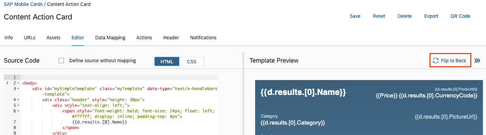

Replace the **Supplier Address** span, as highlighted in the image, with the following code.

```HTML
<span class="listitem-value">
    <div class="c2g_address">
        {{d.results.[0].SupplierDetails.Street}}
        &nbsp;
        {{d.results.[0].SupplierDetails.HouseNumber}}
        <br>
        {{d.results.[0].SupplierDetails.PostalCode}}
        &nbsp;
        {{d.results.[0].SupplierDetails.City}}
        ,
        {{d.results.[0].SupplierDetails.Country}}
    </div>
</span>
```

 

>By adding the `c2g_address` tag to the address, SAP Mobile Cards client can now parse the address and offer the user to show it on a map.

Next, replace the **Supplier Email** span, as highlighted in the image, with the following code.

```HTML
<span class="listitem-value">
    <div class="c2g_email">
      {{d.results.[0].SupplierDetails.EmailAddress}}
    </div>
</span>
```

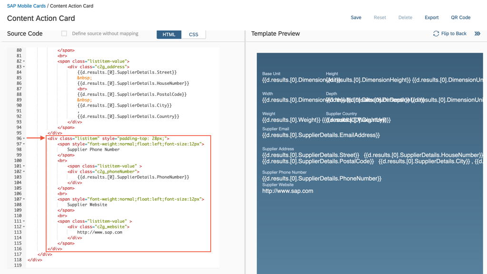

>By adding the `c2g_email` tag to the email, SAP Mobile Cards client can now parse the email correctly and offer the user to start writing an email directly to the contact email address of the card.

Finally, add new entries for **Supplier Phone Number** and **Supplier Website** by pasting the entire code-block below.

```HTML
<div class="listitem" style="padding-top: 28px;">
    <span style="font-weight:normal;float:left;font-size:12px">
        Supplier Phone Number
    </span>
    <br>
        <span class="listitem-value" >
        <div class="c2g_phoneNumber">
            {{d.results.[0].SupplierDetails.PhoneNumber}}
        </div>
    </span>
    <br>
    <span style="font-weight:normal;float:left;font-size:12px">
        Supplier Website
    </span>
    <br>
    <span class="listitem-value" >
        <div class="c2g_website">
            http://www.sap.com
        </div>
    </span>
</div>
```


>By adding the `c2g_phoneNumber` tag to the phone number, SAP Mobile Cards client can now parse the phone number correctly and offer the user to start a call or send an SMS directly to the contact number of the card.

>By adding the `c2g_website` tag to a link the card will allow the user to open an external link from a card. This allows to show more details to a card or give users direct access to relevant information outside the card.

Click **Save**.

!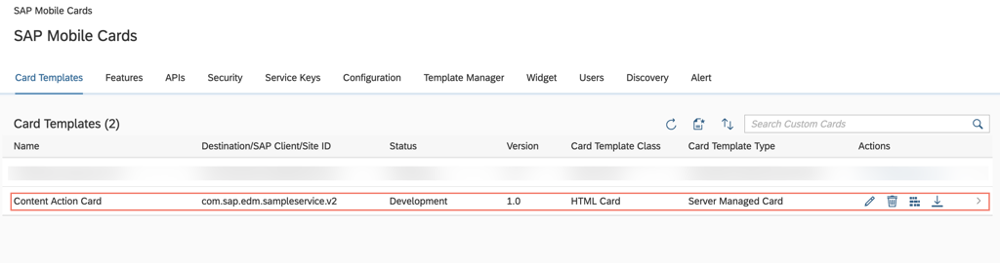

[VALIDATE_1]
[ACCORDION-END]

[ACCORDION-BEGIN [Step 5: ](Set card status to productive)]

By default, the status of newly created cards is **Development**. Cards can be subscribed to only when they are in a **Productive** state.

Click **Content Action Card** in the Card Templates tab.

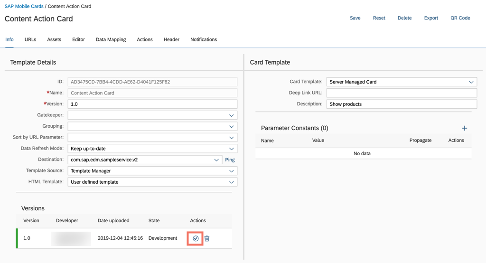

Under **Actions**, click the  icon to change the state to **Productive**.


Choose **Yes** to confirm.

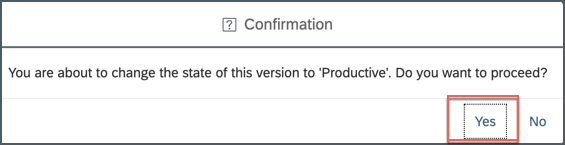

You will notice that the **State** has been changed to **Productive**.


[DONE]
[ACCORDION-END]

[ACCORDION-BEGIN [Step 6: ](Subscribe to the card in SAP Mobile Cards)]

>Make sure you are choosing the right device platform tab ( **Android** or **iOS** ) **above**.

[OPTION BEGIN [Android]]

In the SAP Mobile Cards Android client, tap **+** | **Subscriptions**.

!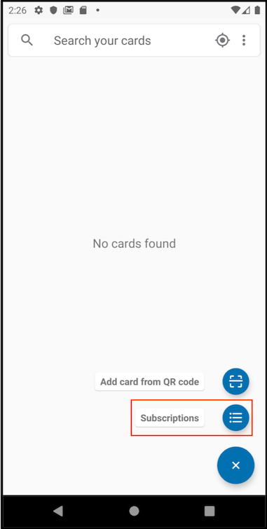

Tap `Content Action Card` under the **All Subscriptions** tab.

!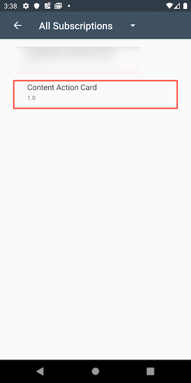

Tap **Subscribe** to trigger the download of the Content Action Card in your SAP Mobile Cards app.

!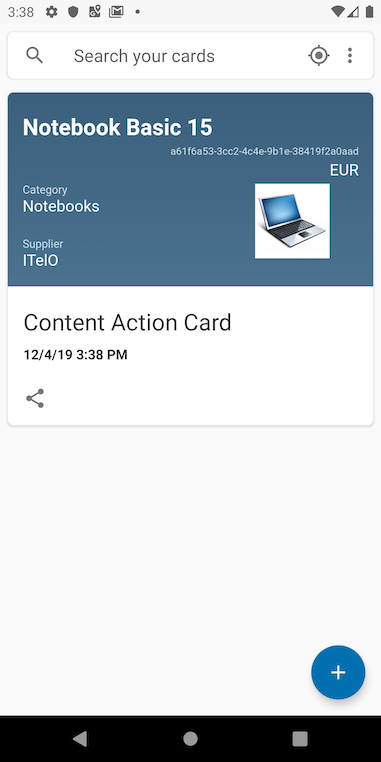

Tap  'Back' icon to to see the latest cards downloaded to the device.

!

> The data is dynamically generated by the sample service on SAP Cloud Platform Mobile Service server. Thus, the data inside the card on your device may be different than what you see in the screenshot.

Select a card to open it.

!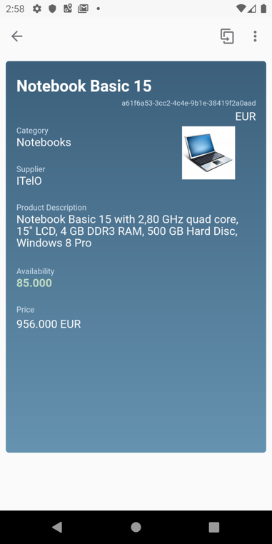

Tap on the **flip** button  to view the other side of the card.

!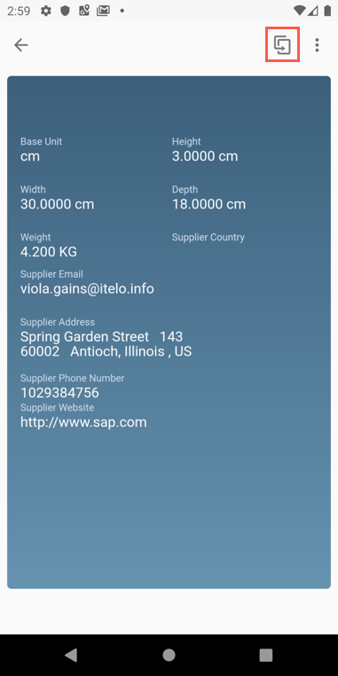

Tap on the **Action Bar** button , and then tap **Open Maps**.

!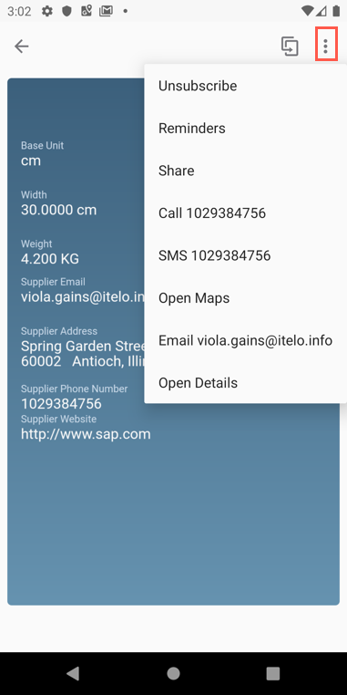

> SAP Mobile Cards App passes the supplier's address to the maps application.

Tap  'Back' to to see the latest cards downloaded on the device.

!

Tap  button to expand the card action menu.

!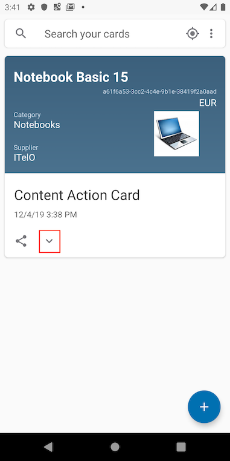

Tap on **Email `abc@xyz.com`** action to draft an email to the supplier.

!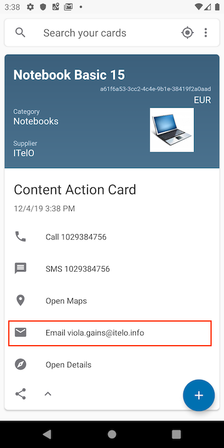

> SAP Mobile Cards launches the default mail client and populates the receiver's email id.

[OPTION END]

[OPTION BEGIN [iOS]]

In the SAP Mobile Cards iOS client, tap **More** | **Subscriptions**.


Tap `Content Action Card` under the **All** tab.

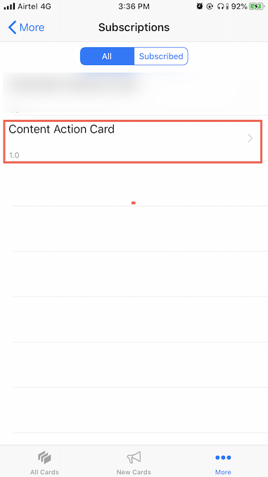

Tap **Subscribe** to trigger the download of the Content Action Card in your SAP Mobile Cards app.

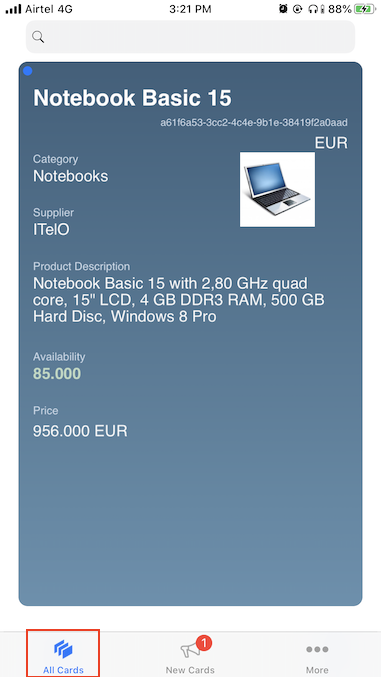

Tap on **All Cards**.


> The data is dynamically generated by the sample service on SAP Cloud Platform Mobile Service server. Thus, the data inside the card on your device may be different than what you see in the screenshot.

Tap any card to open it.

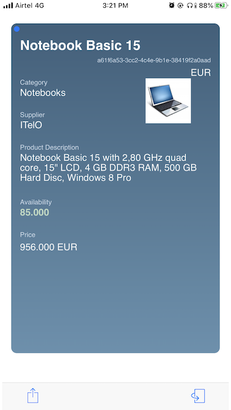

Tap on the **flip** button  to view the other side of the card.

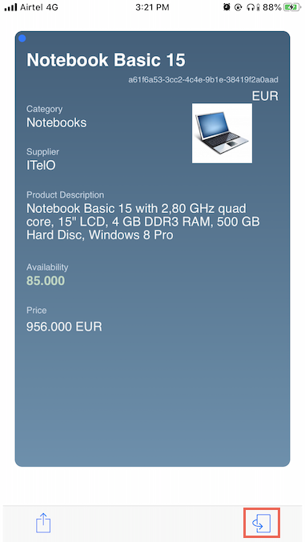

Tap on the **flip** button  to return to the front view of the card.

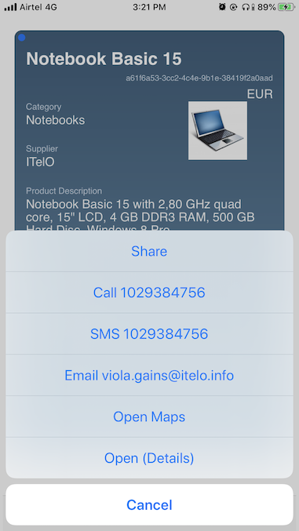

Tap on the **Action Menu**  button to view the content based actions.

!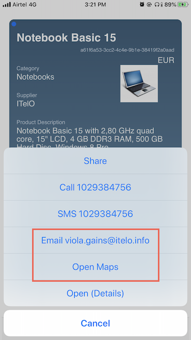

Tap on **Email `abc@xyz.com`** action to draft an email to the supplier, or tap on **Open Maps** action to view the location of the supplier on the default maps client.

!

[OPTION END]

>In case of any failure, you can navigate to **Activity Logs** by clicking on **More** | **Logs** and then look in **Pending Actions**.

Congratulations, you have built a content action card that creates action based on the content.

[DONE]
[ACCORDION-END]
