## Details

### You will learn

 - How to implement the card with content based actions. Content based actions allow users to trigger a phone call, send an email, open maps app or launch a website with more details from a card.
 - How to enable cards to trigger any of the content based actions from a card. This allows you to enable mobile device capabilities from a card.

---

[ACCORDION-BEGIN [Step 1: ](Get familiar with real world use case)]

A company wants to mobilize a paper based customer ticketing service process where a technician has to work on it. With content based actions enabled on a card, the technician can launch the maps application on the device with the customer address to help him to find the customer. The content based card allows him to call the customer with a single click.

[DONE]
[ACCORDION-END]

[ACCORDION-BEGIN [Step 2: ](Create a new action card in SAP Cloud Platform Mobile Services)]

Make sure you have logged in to SAP Cloud Platform Mobile Services cockpit. Navigate to **SAP Mobile Cards** to look into Mobile Cards configuration.

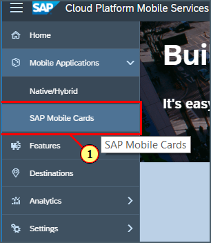

Click on create icon to create a new card.

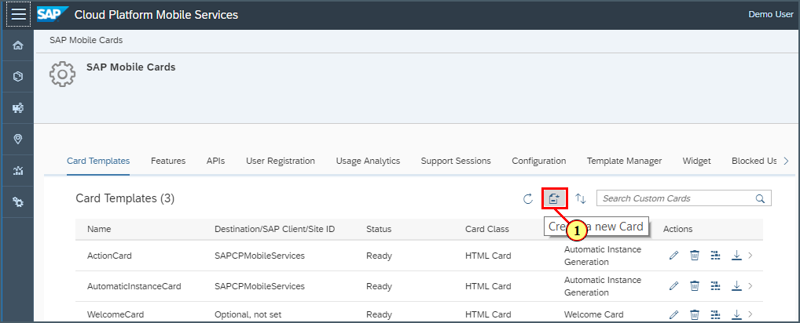

Provide the required information as per below.

| Field | Value |
|----|----|
| Name | `ContentActionCard` |
| Destination | choose `SAPCPMobileServices` |
| Template Source | choose `Template Manager` |
| HTML Template | choose `Sample Product Template` |

> If you see a pop-up, click OK for the confirmation.

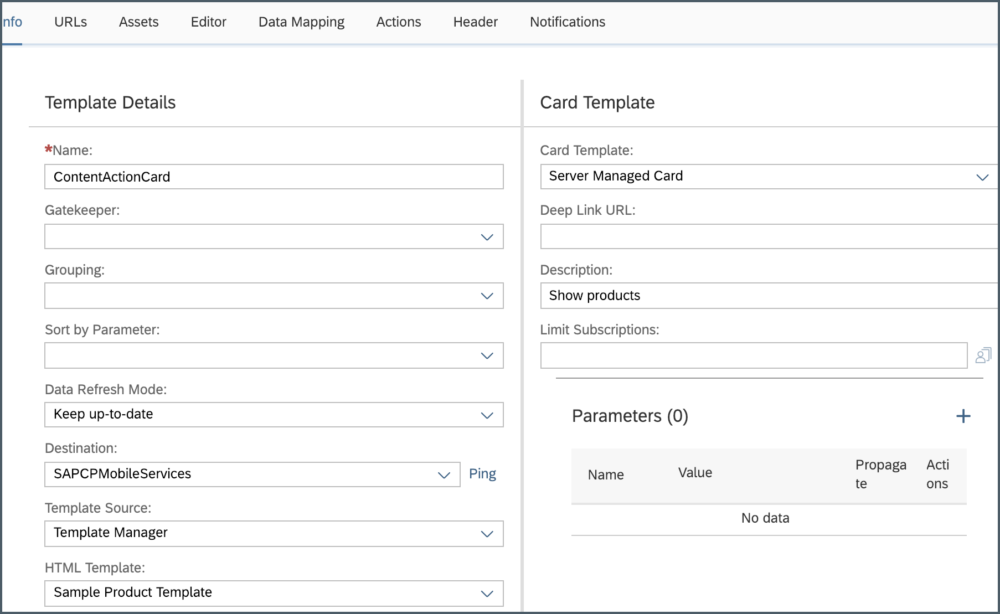

[DONE]
[ACCORDION-END]

[ACCORDION-BEGIN [Step 3: ](Implement the card with content based actions)]

Navigate to **Editor** tab, click **Flip to Back** to implement actions on the content.

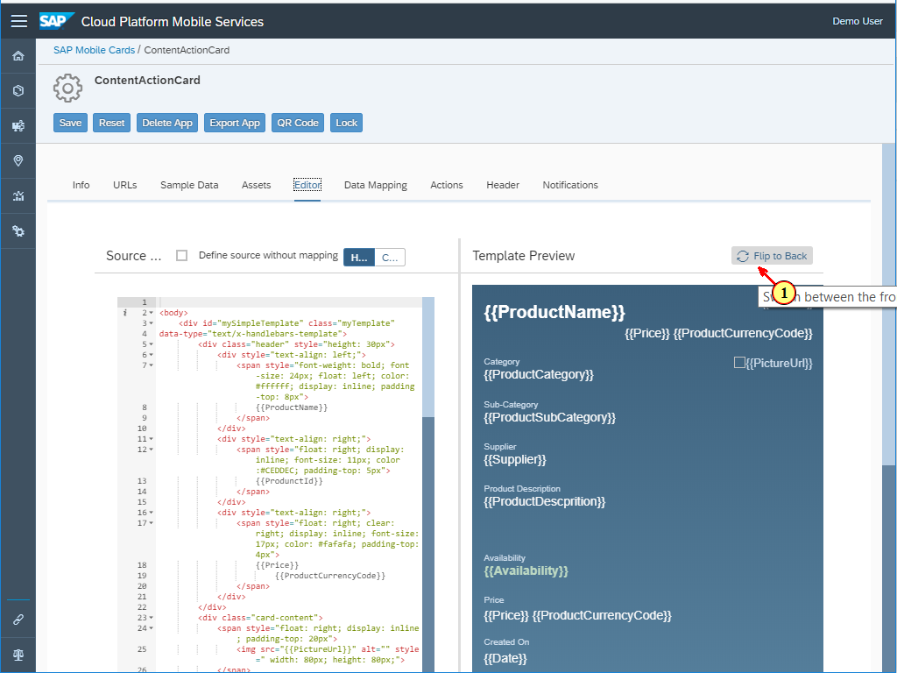

Copy and paste the following div tag before `{{street}}` into the **address** span to declare the address.

```html
<div class="c2g_address">
```
Add below closing div tag right before the closing span tag.

```html
</div>
```

 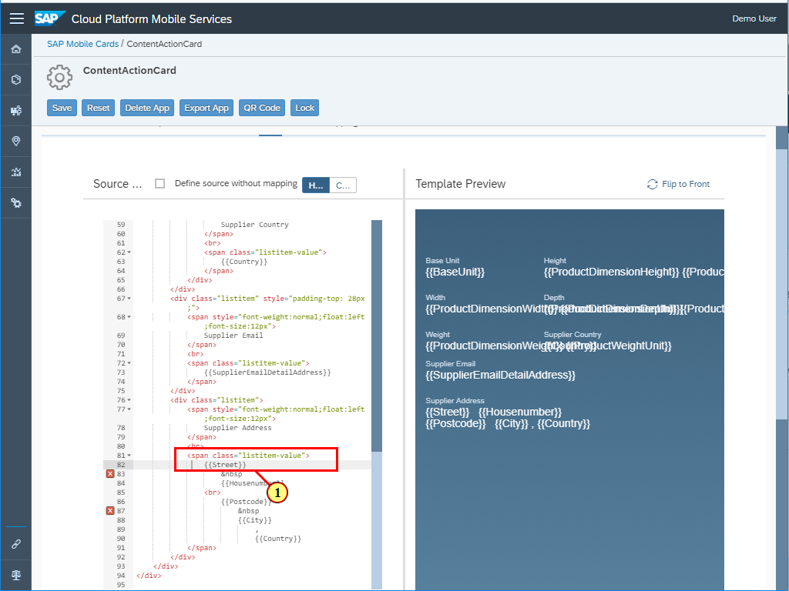

>By adding the `c2g_address` tag to the address, SAP Mobile Cards client can now parse the address and offer the user to show it on a map.

Next, copy and paste the following div tag before `{{SupplierEmailDetailAddress}}` into the **email** span to declare the email address.

```html
<div class="c2g_email">
```
Add below closing div tag right before the closing span tag.

```html
</div>
```
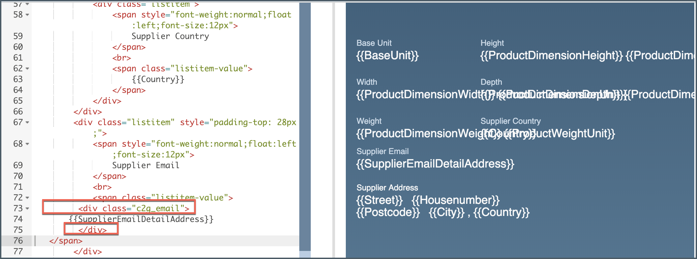

>By adding the `c2g_email` tag to the email, SAP Mobile Cards client can now parse the email correctly and offer the user to start writing an email directly to the contact email address of the card.

Next, copy and paste the following div tag before the address class tag to add a phone number to the card.

```html
<div class="listitem" style="padding-top: 28px;">
<span style="font-weight:normal;float:left;font-size:12px">
Supplier Phone
</span>
<br>
<span class="listitem-value" >
<div class="c2g_phoneNumber">
{{PhoneNumber}}
</div>
</span>
<br>
<span class="c2g_website"> http://www.sap.com</span>
</div>
```

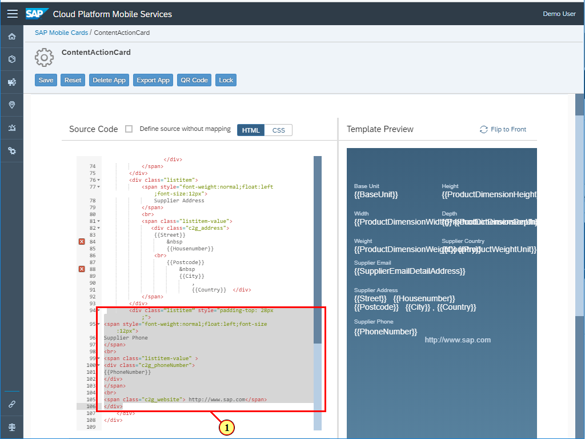

>By adding the `c2g_phoneNumber` tag to the phone number, SAP Mobile Cards client can now parse the phone number correctly and offer the user to start a call or send an SMS directly to the contact number of the card.

>By adding the `c2g_website` tag to a link the card will allow the user to open an external link from a card. This allows to show more details to a card or give users direct access to relevant information outside the card.

Click on **Save**.

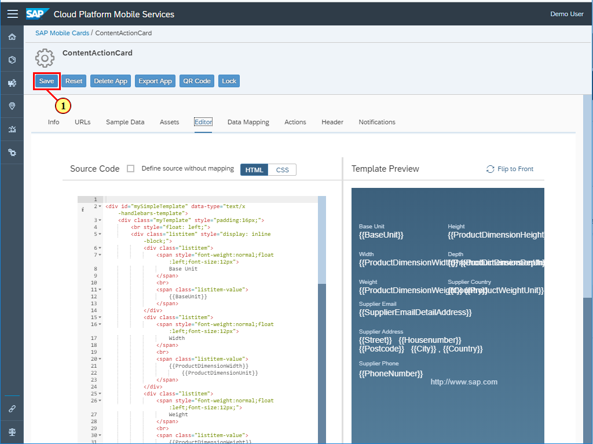

Click on **No** to allow editing of the card again.

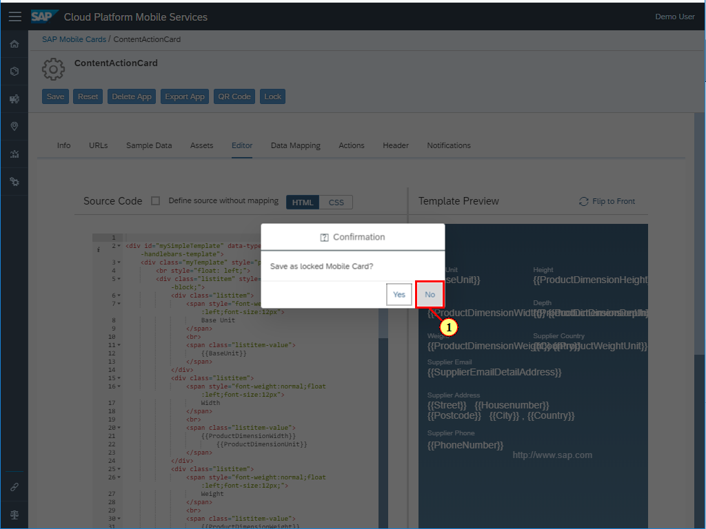

[VALIDATE_1]
[ACCORDION-END]

[ACCORDION-BEGIN [Step 4: ](Subscribe this card in your Mobile Cards application)]

In SAP Mobile Cards application, click on plus icon to open the subscriptions.

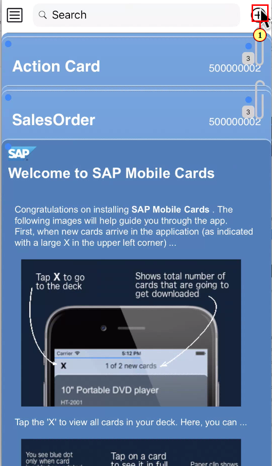

Click `ContentActionCard` under **All** tab.

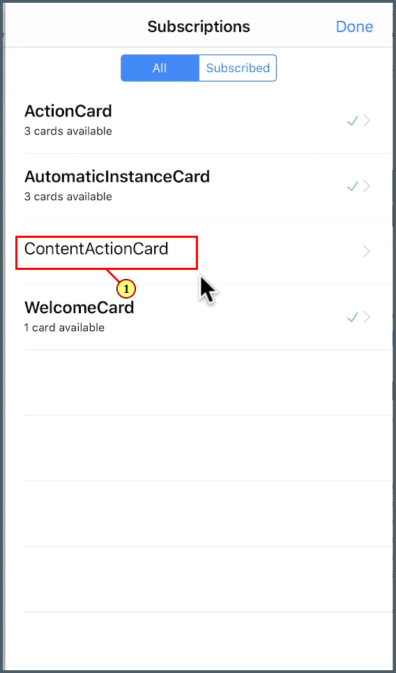

Click **Subscribe** to activate the `ContentActionCard` subscription.

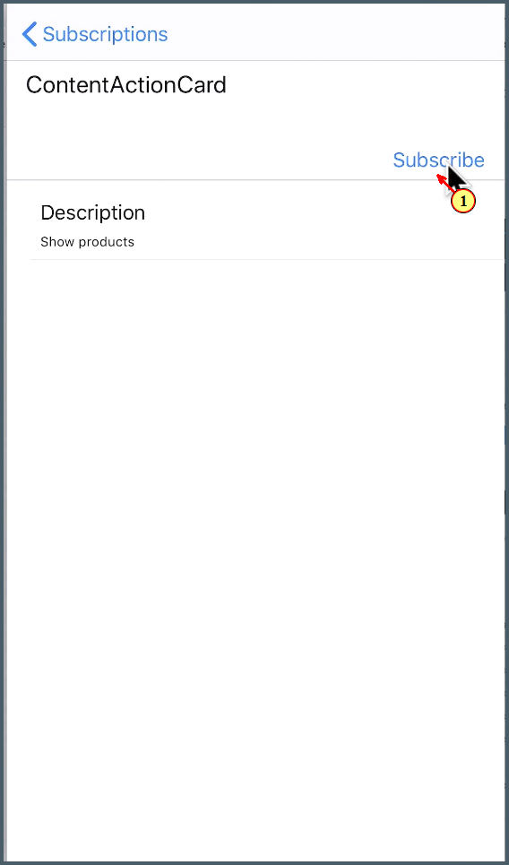

Click on the card to open it.

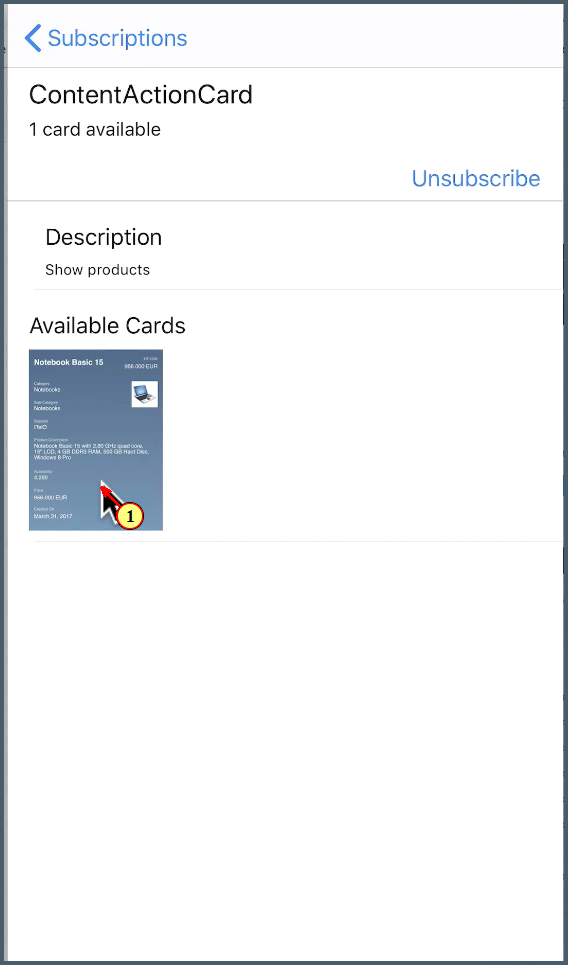

Here, you can see a preview of cards and then click on **Done**.

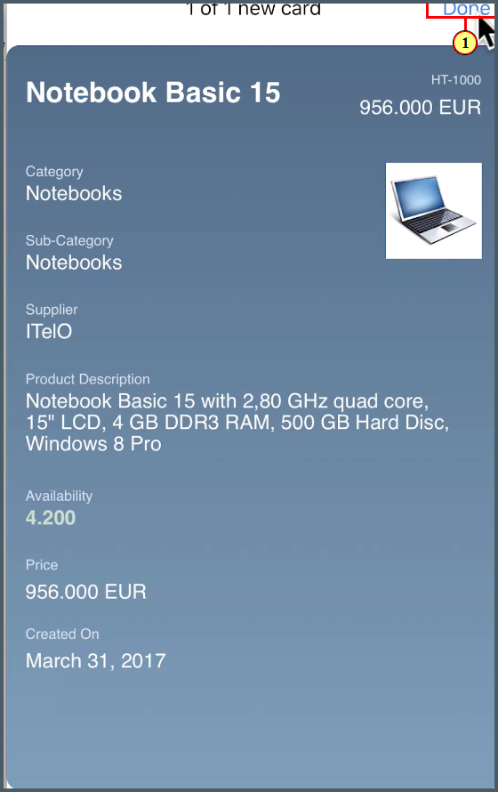

Click on action icon on left bottom to open the available actions on the card.

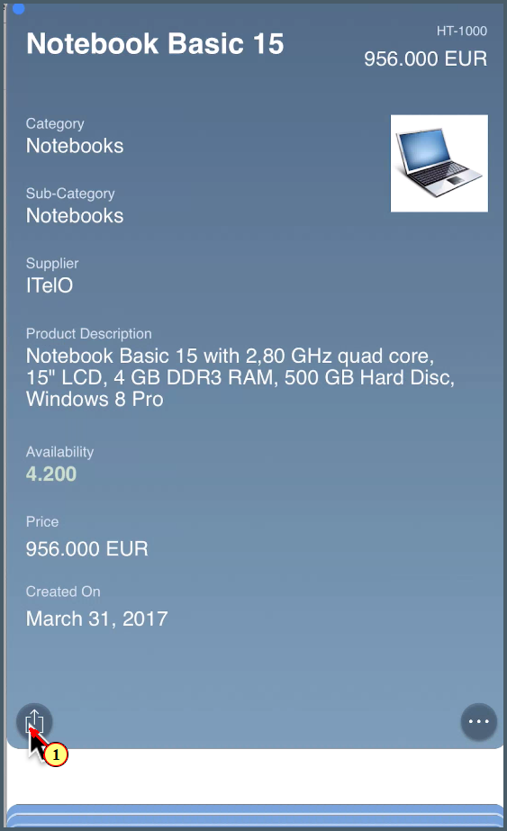

Congratulations, you added content based actions to your card.

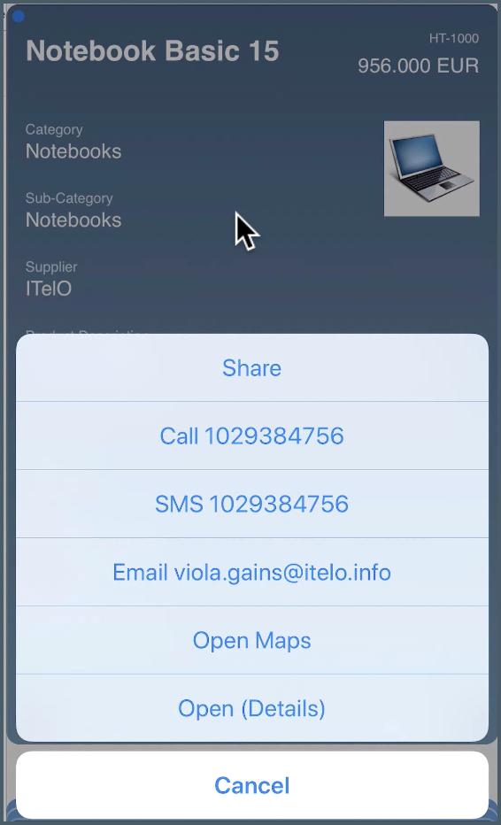
[DONE]
[ACCORDION-END]
