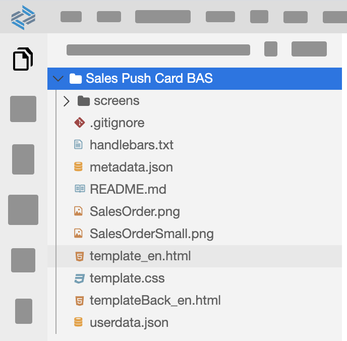
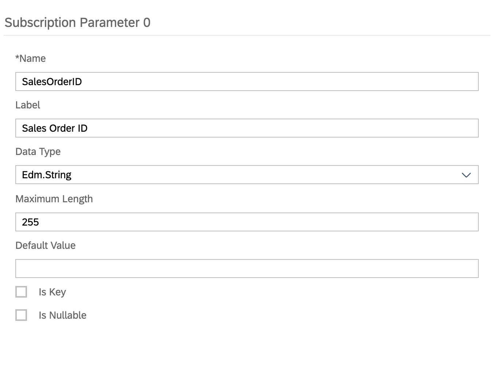
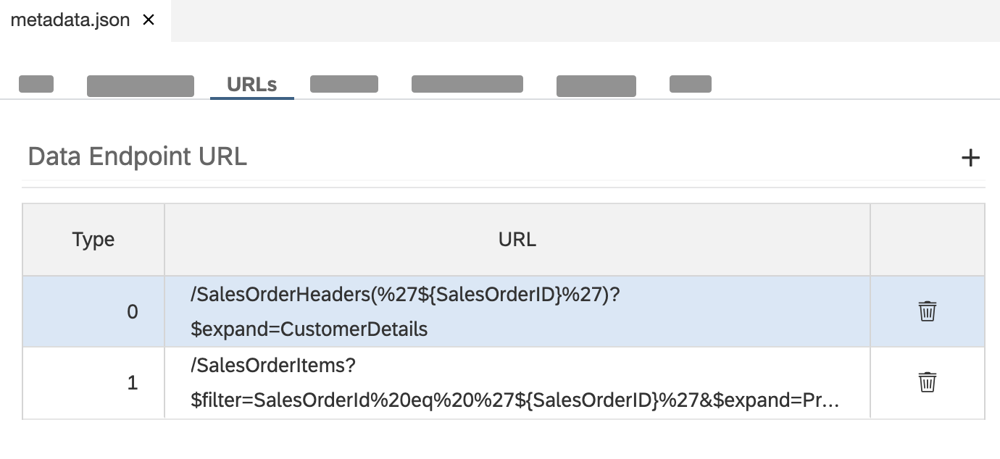
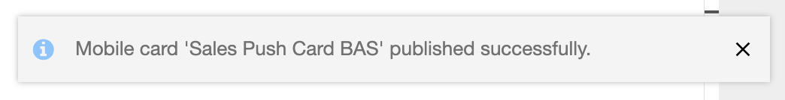

## Prerequisites
- You have [Set Up SAP Mobile Cards](cp-mobile-cards-setup).
- You have [Set Up SAP Business Application Studio for Mobile Development](cp-mobile-bas-setup).

## Details
### You will learn
  - how to modify the card type to single instance in Business Application Studio
  - how to add subscription parameters to SAP Mobile cards
  - how to deploy and publish a card to SAP Mobile Services from Business Application Studio

---

[ACCORDION-BEGIN [Step 1: ](Understand the use case)]

Watson is a salesperson who has created a Sales Order.

Alice is the sales manager who needs to approve this request. However, Alice has 20 salespeople reporting to her. Thus, she wants to be immediately notified when a new request is created.

[DONE]
[ACCORDION-END]

[ACCORDION-BEGIN [Step 2: ](Create Sales Order Approval Card using a template)]

1. Open Business Application Studio and enter your dev workspace.

    !

2. In the menu bar, go to View &rarr; Find Command, click **Find Command**.

    !

    > For faster development, you can use the shortcut keys mentioned in the menu item.

3. Search for `Mobile Cards` and select **Mobile Cards: New From Template**.

    !

4. Select **Sales Order Approval Card - Multi Instance**.

    !

5. Enter a name for the card; e.g. `Sales Push Card BAS`.

    !

6. A folder called `Sales Push Card BAS` is created.

    !

[DONE]
[ACCORDION-END]

[ACCORDION-BEGIN [Step 3: ](Modify card type)]

1. In your File Explorer, right click on **`metadata.json`**, and select Open With &rarr; Code Editor.

    !

    > [Click here to learn more about editing a card in Business Application Studio](https://help.sap.com/doc/f53c64b93e5140918d676b927a3cd65b/Cloud/en-US/docs-en/guides/getting-started/mck/mck-development-bas.html)

2. **Replace** the `CustomType` attribute:

    |  Old Value  | New Value |
    |  :------------- | :------------- |
    | `Query` | **`SingleInstance`**|

    !

3. In your File Explorer, click **metadata.json**, and notice the Card Template in the `Info` tab.

    !

[VALIDATE_1]
[ACCORDION-END]

[ACCORDION-BEGIN [Step 4: ](Add a subscription parameter)]

1. In the `metadata.json` file, open **URLs** tab.

    !

2. **Delete** the `SalesOrderId` parameter in the Parameters table.

    !

3. In the *Subscription Parameter* table, add a new subscription.

    !

    > [Click here to learn more about Subscription Parameters in SAP Mobile Cards.](https://help.sap.com/doc/f53c64b93e5140918d676b927a3cd65b/Cloud/en-US/docs-en/guides/getting-started/mck/mck-development-features.html#subscription-parameters)

4. Add the following details to create a new Subscription Parameter: `SalesOrderID`.

    |  Field Name     | Value |
    |  :------------- | :------------- |
    |  Name           | **`SalesOrderID`** |
    |  Label           | **`Sales Order ID`** |
    |  Data Type    | **`Edm.String`** |
    |  Maximum Length | **`255`** |

    !

5. In the Data Endpoint URL tab, replace the old URLs with the following:

    |  URL Type     |  URL | Destination |
    |  :------------- | :------------- | : ----- |
    |  0           | **`/SalesOrderHeaders(%27${SalesOrderID}%27)?$expand=CustomerDetails`** |  **`Optional, not set`** |
    |  1           | **`/SalesOrderItems?$filter=SalesOrderId%20eq%20%27${SalesOrderID}%27&$expand=ProductDetails`** | **`Optional, not set`** |

    !

[DONE]
[ACCORDION-END]

[ACCORDION-BEGIN [Step 5: ](Deploy and publish card)]

1. Open Find Command, search for `mobile cards` and select **Mobile Cards: Deploy**.

    !

2. Select the card you have created; e.g. `Sales Push Card BAS`.

    !

3. Upon successful deployment, you will see a toast message at the bottom right corner of your screen.

    !

4. Open Find Command, search for `mobile cards` and select **Mobile Cards: Publish**.

    !

5. Select the card you have created; e.g. `Sales Push Card BAS`.

    !

6. Upon successful publish, you will see a toast message at the bottom right corner of your screen.

    !

[DONE]
[ACCORDION-END]

Congratulations! You have created a card type that can now add cards to your device through push notification upon a request made from an external system.

**Click [here](cp-mobile-cards-push-sales-card) to see how you can trigger a request from an external system**.

---
