## Prerequisites
- You have [Set Up SAP Mobile Cards](cp-mobile-cards-setup).
- You have [Set Up SAP Business Application Studio for Mobile Development](cp-mobile-bas-setup).
- You have configured a connection between your SAP Business Application Studio and the SAP Mobile Services cockpit.

## Details
### You will learn
  - Create a Web Page Matching card using a template in Business Application Studio
  - Design and develop SAP Mobile Cards in Business Application Studio
  - Deploy and Publish a card to SAP Mobile Services from Business Application Studio

Add additional information: Background information, longer prerequisites

---

[ACCORDION-BEGIN [Step 1: ](Understand the use case)]

Watson, a salesperson, has created a Sales Order.

Alice is the sales manager who needs to approve this request. Since she is constantly on the move, she wants the ability to approve the request on her mobile device.

In this tutorial, you will create a card and send a push notification to Alice as soon as Watson creates a request.

[DONE]
[ACCORDION-END]

[ACCORDION-BEGIN [Step 2: ](Create a Web Page Matching card)]

Open Business Application Studio and enter your dev workspace.

!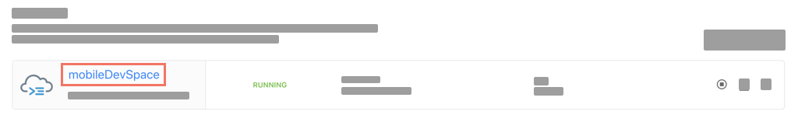

In the menu bar, go to View &rarr; Find Command, click **Find Command**.

!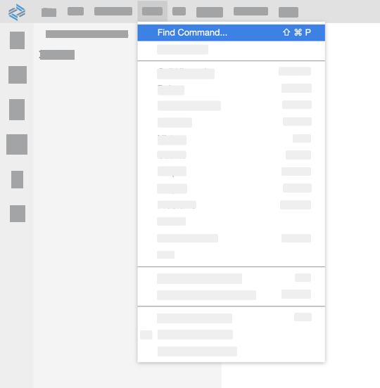

> For faster development, setup a *shortcut key* for *Find Command* and use it.

Search for `mobile cards` and select **Mobile Cards: New**.

!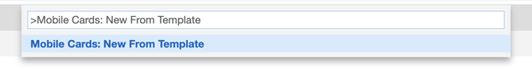

Enter a name for the card; e.g. `Sales Push Card BAS`.

!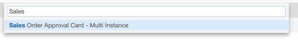

A folder called `Sales Push Card BAS` is created.

!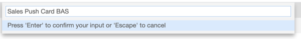

[DONE]
[ACCORDION-END]

[ACCORDION-BEGIN [Step 3: ](Modify card type)]

In your File Explorer, right click on **`metadata.json`**, and select Open With &rarr; Code Editor.

!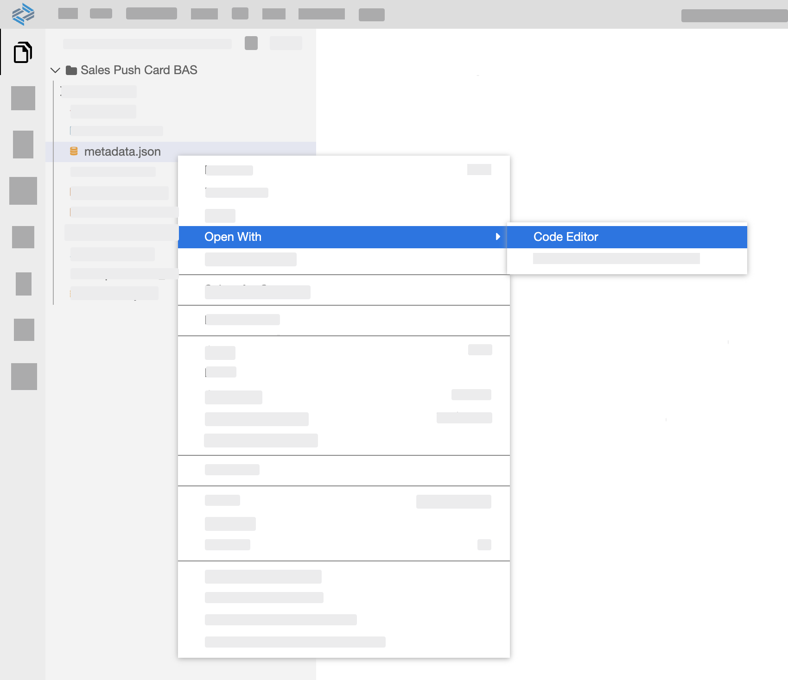

> [Click here to learn more about editing a card in Business Application Studio](https://help.sap.com/doc/f53c64b93e5140918d676b927a3cd65b/Cloud/en-US/docs-en/guides/getting-started/mck/mck-2-2-development-bas.html#editing-a-card)

Replace the entire code in the file `metadata.json` with the following, and save your changes.

```JSON
{
    "Name": "Sales Push Card BAS",
    "Connection": "com.sap.edm.sampleservice.v2",
    "CustomType": "SAP_CARD_TYPE_WEB_PAGE",
    "ResourceIdentifiers": [
        {
            "ImagePaths": "$.d.results.[0].PictureUrl",
            "Order": 0,
            "Shared": false,
            "Uri": "AddURL"
        }
    ],
    "UrlMatch": "ChangeValue",
    "RefreshInterval": null,
    "QueryInterval": null,
    "QueryURL": null,
    "QueryConfiguration": null,
    "CardClass": "HtmlTemplate",
    "AutoSubscribe": false,
    "SubscribableTo": {
        "Users": []
    },
    "Descriptions": [
        {
            "language": "EN",
            "text": "A push card created in BAS using SalesOrder data"
        }
    ],
    "NotificationMessages": null,
    "ActionConfiguration": null,
    "QueryReturnsEntityCollection": false,
    "GroupName": null,
    "Locked": false,
    "NotificationRules": [],
    "APNSEnabled": true,
    "HiddenSubscription": false,
    "AppLaunchUrl": null,
    "NewsEnabled": false,
    "SubscriptionParameters": [],
    "GatekeeperConfiguration": null,
    "CustomRequestProperties": null,
    "SortCardsWith": null
}
```

> In the code above, you are changing the Card Template type from Server Managed Card to Web Page Matching Card.

In your File Explorer, click **metadata.json**.

!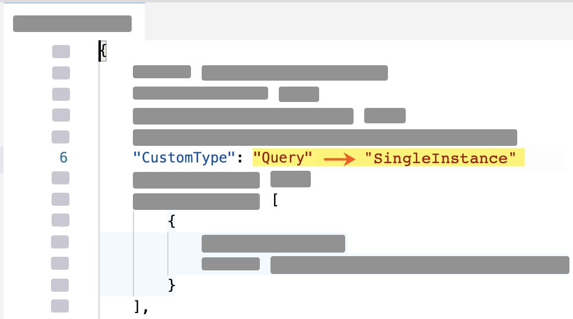

In the Card Template section, update the Web Page Expression Match with `SalesOrderHeaders({ID1})`.

!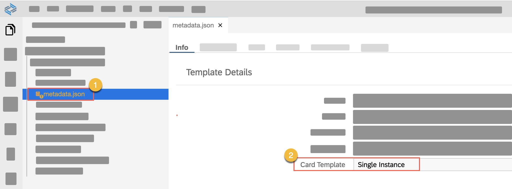

Open the URLs Tab

!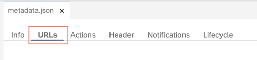

Update the URL with `/SalesOrderHeaders(${ID1})`.

!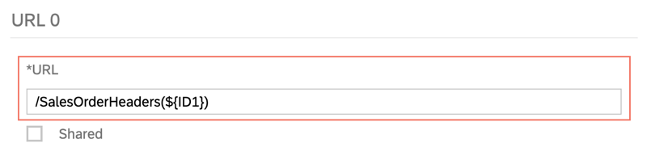

In the Parameters section click **+** to add a new parameter.

!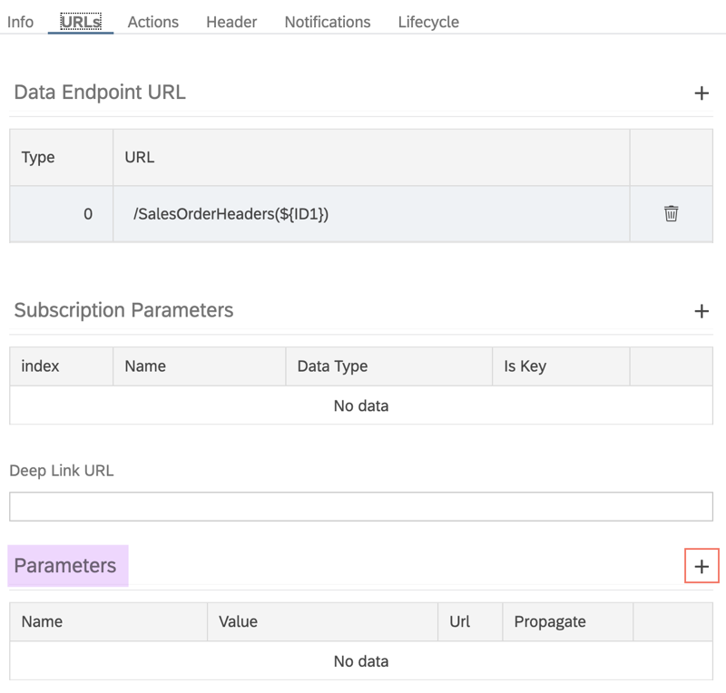

Enter the values as indicated in the table:

|Name|Value|
|---|---|
|`SalesOrderId`| `$.d.SalesOrderId` |

> [Click here to learn more about Parameters in SAP Mobile Cards.](https://help.sap.com/doc/f53c64b93e5140918d676b927a3cd65b/Cloud/en-US/docs-en/guides/getting-started/mck/mck-2-3-development-features.html#parameters)

!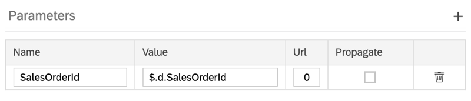

[DONE]
[ACCORDION-END]

[ACCORDION-BEGIN [Step 4: ](Add approve action)]

In your File Explorer, click **metadata.json** and go to the Actions Tab.

!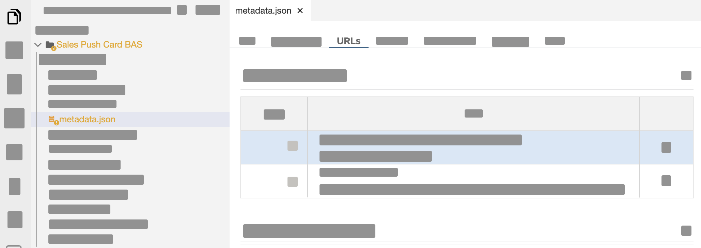

Click **+** to add an action.

!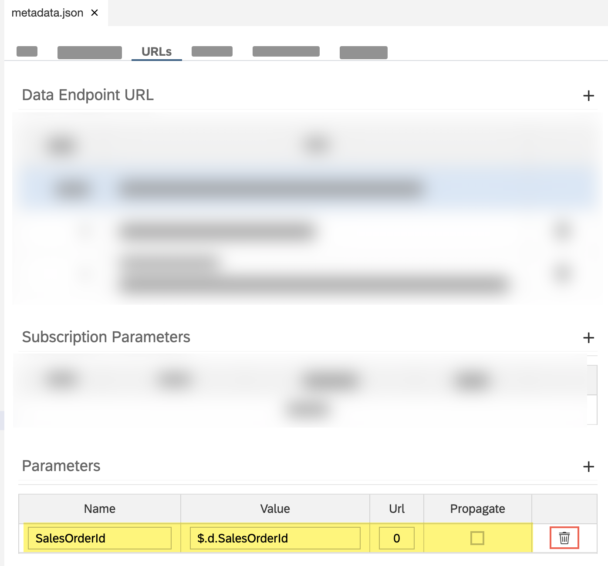

Enter the values as indicated in the table:

| Field | Value |
|----|----|
| **Name** | `accept` |
| **Label** | `Accept Status` |
| **URL** | `/SalesOrderHeaders('${SalesOrderId}')` |
| **Behavior after Action** | `ACTIVE` |
| **HTTP Method** | `PATCH` |
| **Consider Action As** | `Positive` |
| **Show In Notification Center** | ! |
| **Action Body** | `{"LifeCycleStatusName": "Accepted", "LifeCycleStatus": "A"}` |

 !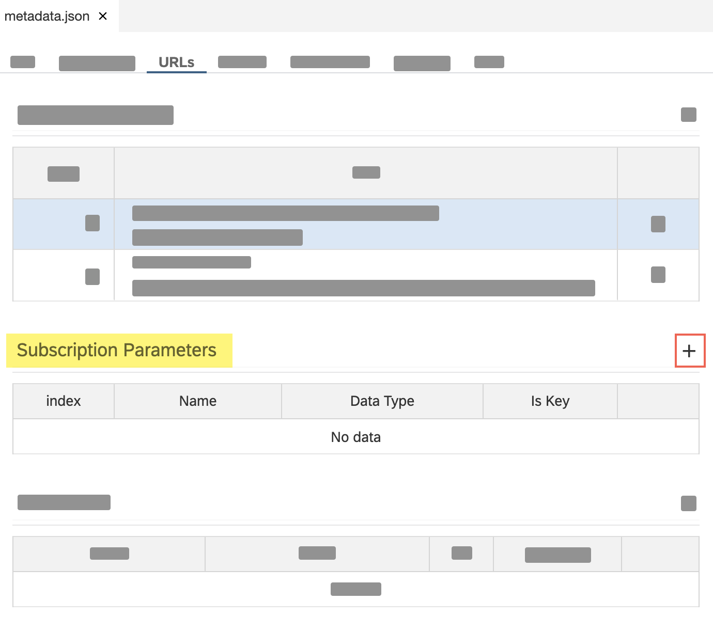

> [Click here to learn more about Actions in SAP Mobile Cards.](https://help.sap.com/doc/f53c64b93e5140918d676b927a3cd65b/Cloud/en-US/docs-en/guides/getting-started/mck/mck-2-3-development-features.html#parameters)

 Save the changes you've made to **metadata.json**

[DONE]
[ACCORDION-END]

[ACCORDION-BEGIN [Step 5: ](Update design of card)]

In your File Explorer, click **`userdata.json`**.

!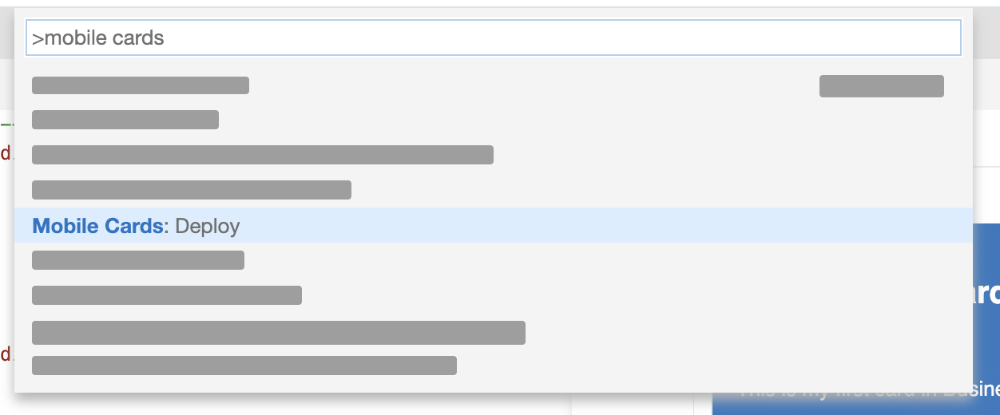

Replace the entire code in the file `userdata.json` with the following, and save your changes.

```JSON
{
	"d": {
	  "__metadata": {
		"id": "SalesOrderHeaders('cccd16d4-257c-47d5-8a90-c4a184d49830')",
		"uri": "SalesOrderHeaders('cccd16d4-257c-47d5-8a90-c4a184d49830')"
	  },
	  "CreatedAt": "/Date(1585558666126)/",
	  "CurrencyCode": "EUR",
	  "CustomerDetails": {
		"__deferred": {
		  "uri": "SalesOrderHeaders('cccd16d4-257c-47d5-8a90-c4a184d49830')/CustomerDetails"
		}
	  },
	  "CustomerId": "79f47b31-6364-45e9-8286-c39f2d817b1c",
	  "GrossAmount": "654.441",
	  "Items": {
		"__deferred": {
		  "uri": "SalesOrderHeaders('cccd16d4-257c-47d5-8a90-c4a184d49830')/Items"
		}
	  },
	  "LifeCycleStatus": "N",
	  "LifeCycleStatusName": "New",
	  "NetAmount": "549.950",
	  "SalesOrderId": "cccd16d4-257c-47d5-8a90-c4a184d49830",
	  "TaxAmount": "104.491"
	}
}
```

In your File Explorer, click **`template_en.html`**.

!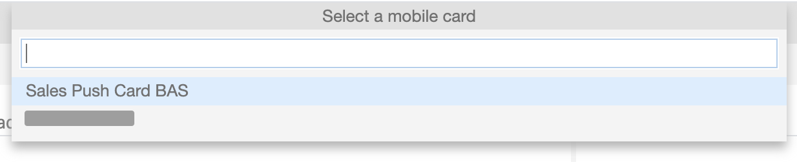

Replace the entire code in the file `template_en.html` with the following, and save your changes.

```HTML
<body>
    <div id="mySimpleTemplate" class="myTemplate" data-type="text/x-handlebars-template">
        <div class="header" style="height: 30px">
            <div style="text-align: left;">
                <span style="font-weight: bold; font-size: 24px; float: left; color: #ffffff; display: inline; padding-top: 8px">
                    Salesorder Push Card
                </span>
            </div>
            <div style="text-align: right;">
                <span style="float: right; display: inline; font-size: 16px; color:#CEDDEC; padding-top: 15px">
                    {{d.SalesOrderId}}
                </span>
            </div>
        </div>
        <br> <br>
          <div class="card-content">
             <div class="all">
                 <div class="title-content">
                     <span class="title">
                         Net Amount
                     </span>
                     <br>
                     <span class="content">
                        {{d.NetAmount}} {{d.CurrencyCode}}
                     </span>
                 </div>
                 <br>
                 <div class="title-content">
                     <span class="title">
                         Tax Amount
                     </span>
                     <br>
                     <span class="content">
                        {{d.TaxAmount}} {{d.CurrencyCode}}
                     </span>
                 </div>
                 <br>
                 <div class="title-content">
                     <span class="title">
                         Gross Amount
                     </span>
                     <br>
                     <span class="content">
                        {{d.GrossAmount}} {{d.CurrencyCode}}
                     </span>
                 </div>
                <br> <hr> <br>
                                 <div class="title-content">
                     <span class="title">
                         Lifecycle Status Name
                     </span>
                     <br>
                     <span class="content">
                        {{d.LifeCycleStatusName}}
                     </span>
                 </div>
                 <br>
                                  <div class="title-content">
                     <span class="title">
                        Lifecycle Status Tag
                     </span>
                     <br>
                     <span class="content">
                        {{d.LifeCycleStatus}}
                     </span>
                 </div>
             </div>
          </div>
    </div>
</body>
```

In your File Explorer, click **`templateBack_en.html`**.

!

Replace the entire code in the file `templateBack_en.html` with the following, and save your changes.

```HTML
<div id="mySimpleTemplate" data-type="text/x-handlebars-template">
    <div class="myTemplate" style="padding:25px;">
        Nothing to see here...
    </div>
</div>
```

> [Click here to learn more about designing a card in SAP Mobile Cards.](https://help.sap.com/doc/f53c64b93e5140918d676b927a3cd65b/Cloud/en-US/docs-en/guides/getting-started/mck/mck-2-3-development-features.html#design-the-card-ui)

Open Find Command, search for `mobile cards` and select **Mobile Cards: Preview**.

!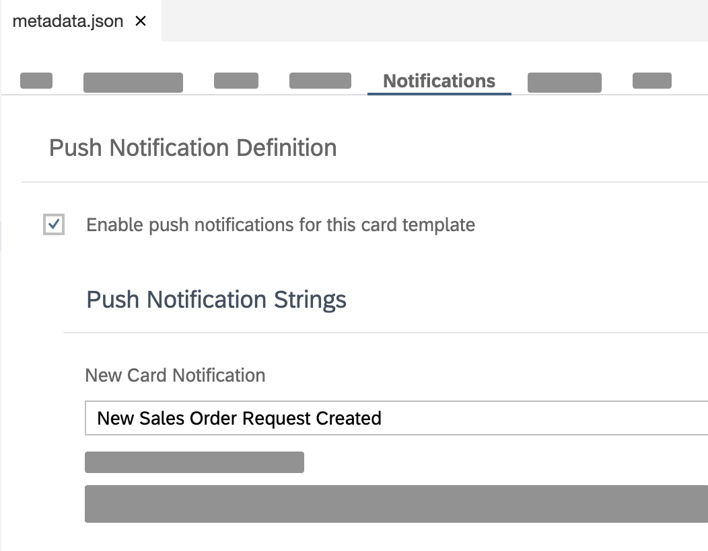

A preview window for your card will open to the side. It will preview the latest changes you've made.

!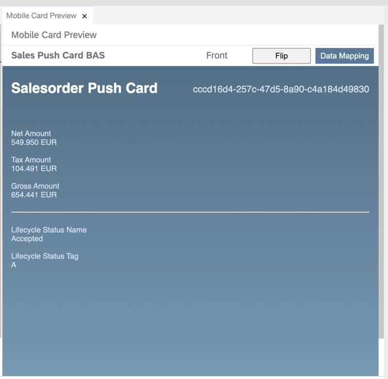

> The data you see in the card comes from userdata.json. [Click here to learn more about userdata.json in SAP Mobile Cards.](https://help.sap.com/doc/f53c64b93e5140918d676b927a3cd65b/Cloud/en-US/docs-en/guides/getting-started/mck/mck-2-3-development-features.html#test-data-for-designing)

[VALIDATE_1]
[ACCORDION-END]

[ACCORDION-BEGIN [Step 6: ](Deploy and publish card)]

Open Find Command, search for `mobile cards` and select **Mobile Cards: Deploy**.

!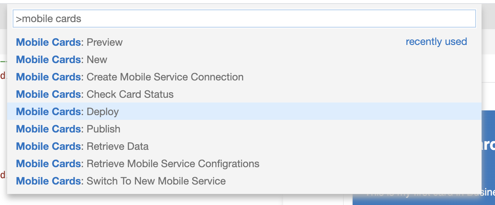

Select the card you have created; e.g. `Sales Push Card BAS`.

!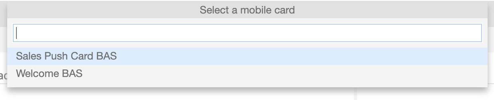

Upon successful deployment, you will see a toast message at the bottom right corner of your screen.

!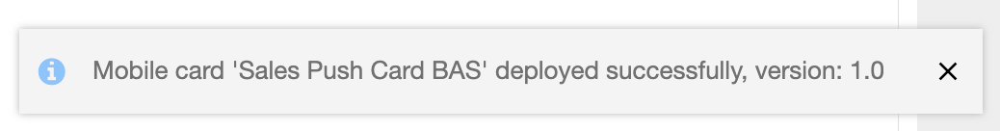

Open Find Command, search for `mobile cards` and select **Mobile Cards: Publish**.

!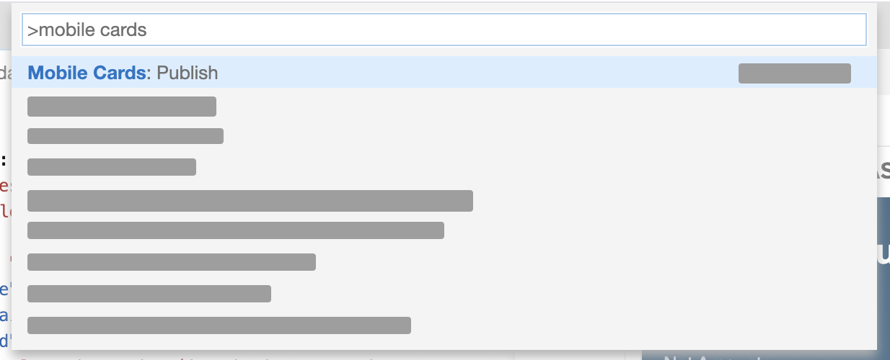

Select the card you have created; e.g. `Sales Push Card BAS`.

!

Upon successful publish, you will see a toast message at the bottom right corner of your screen.

!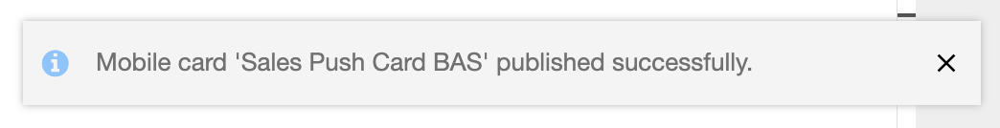

[DONE]
[ACCORDION-END]

[ACCORDION-BEGIN [Step 7: ](Subscribe to card on mobile device)]

>Make sure you are choosing the right device platform tab ( **Android** or **iOS** ) **above**.

[OPTION BEGIN [Android]]

In the SAP Mobile Cards Android client, tap **+** | **Subscriptions**.

!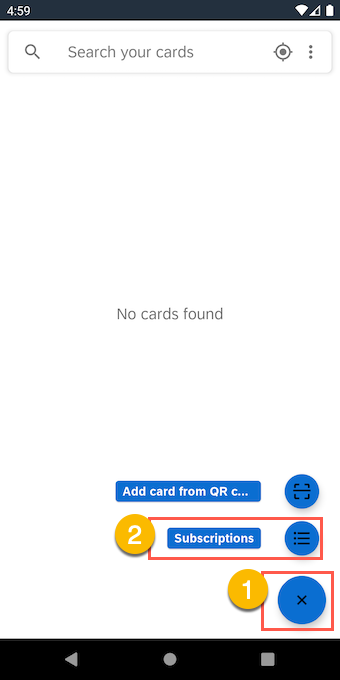

Tap **Sales Push Card BAS** under the **All Subscriptions** tab.

!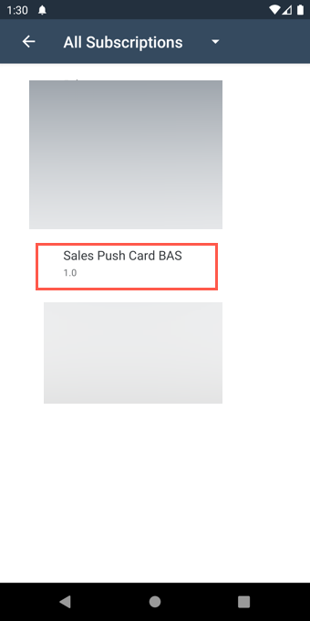

Tap **Subscribe** to trigger the download of the card in your SAP Mobile Cards app.

!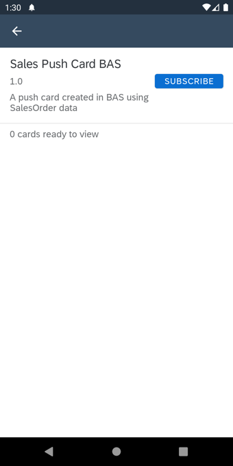

[OPTION END]

[OPTION BEGIN [iOS]]

In the SAP Mobile Cards iOS client, tap **More** &rarr; **Subscriptions**.

!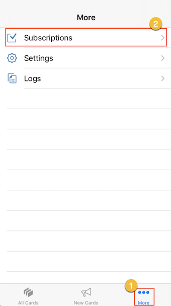

Tap **All** tab &rarr; **Sales Push Card BAS**.

!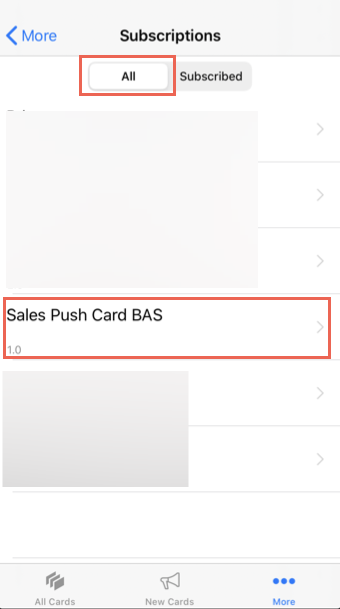

Tap **Subscribe** to trigger the download of the card in your SAP Mobile Cards app.

!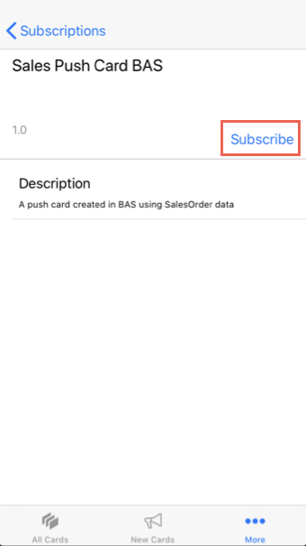

[OPTION END]

You have completed this tutorial. Web Page Matching Cards appear only when they are pushed to the device. Thus, you can now **either terminate the app or send it to background**, and proceed to the next tutorial in the mission.

[DONE]
[ACCORDION-END]


---
