## Details
### You will learn
- How to implement a logic in a card

Handlebars helper help developer to use JavaScript logic in rendering of the card.

---

[ACCORDION-BEGIN [Step 1: ](Get familiar with real world use case)]

A Company wants managers to have a set of `KPIs` available on a mobile device. In order to simplify the card, a sum of sales orders is represented in certain Colors. For example, if the sum is larger than 1000 Euros then the sales order's status is visualized and highlighted with traffic light symbols.

[DONE]
[ACCORDION-END]

[ACCORDION-BEGIN [Step 2: ](Create a new card)]

Make sure you have logged into the SAP Cloud Platform Mobile Services cockpit. Navigate to **SAP Mobile Cards** to look into Mobile Cards configuration.

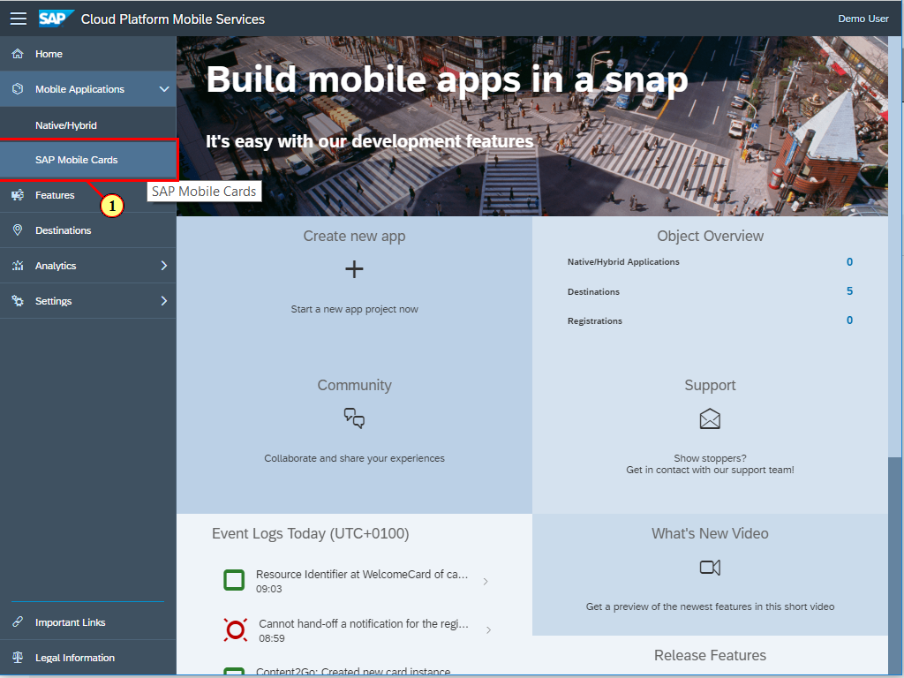

Click the **Create a New Card** icon.

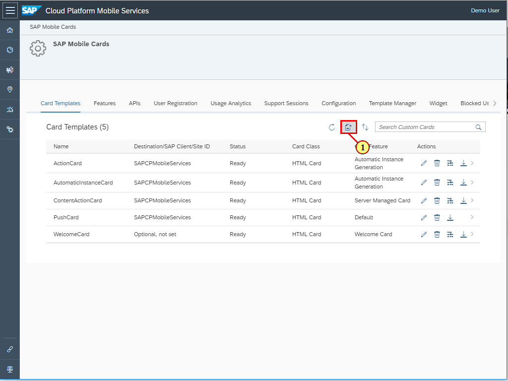

Provide the required information:

| Field | Value |
|----|----|
| **Name** | `HandlebarHelperCard` |
| **Destination** | `SAPCPMobileServices` |
| **Template Source** | `Template Manager` |
| **HTML Template** | `Sample Sales Orders Template` |
| **Card Template** | `Default` |

> If you see a pop-up, click **OK** for the confirmation.

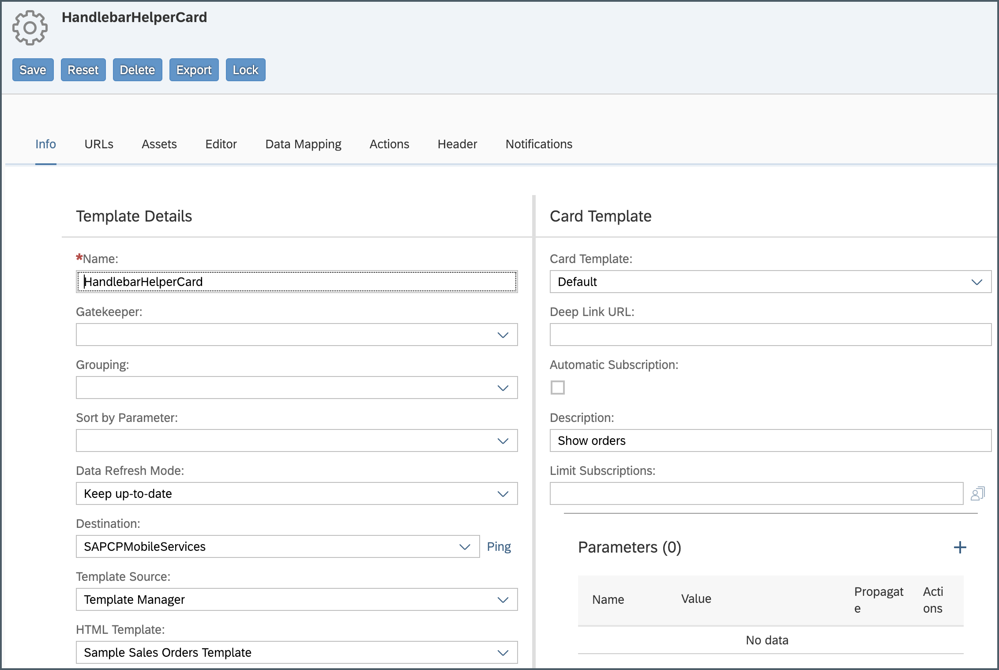

[DONE]
[ACCORDION-END]

[ACCORDION-BEGIN [Step 3: ](Insert JSON keys into handlebars)]

Click **Editor** to view the **HTML** which builds this card and to add handlebars classes.

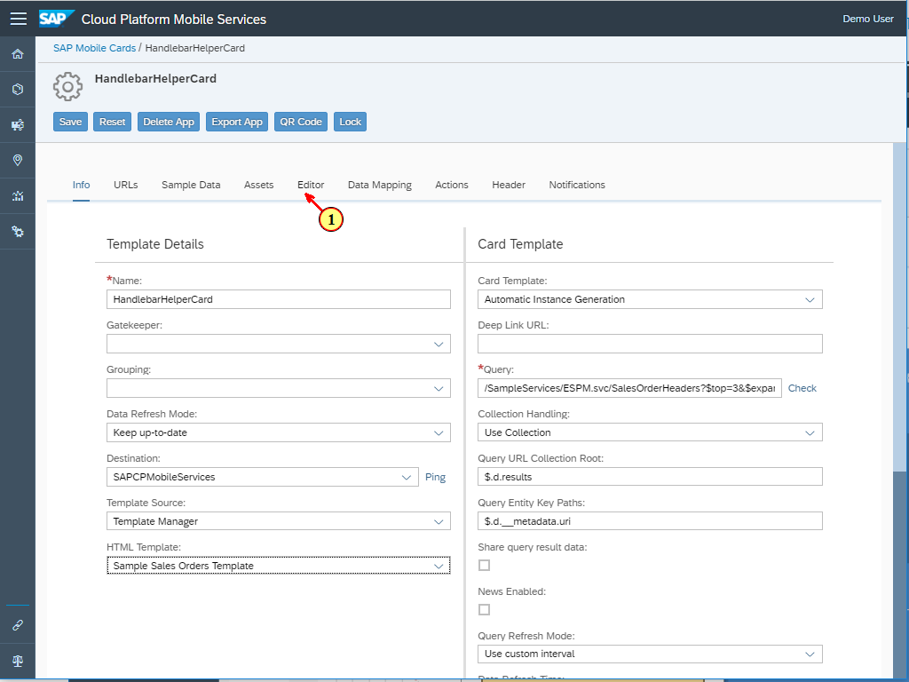

Check **Define source without mapping** to define the actual mapping of the data directly in the editor.

>In this template, you need to add a **d.** in front of all [Handlebars](https://handlebarsjs.com) expression.

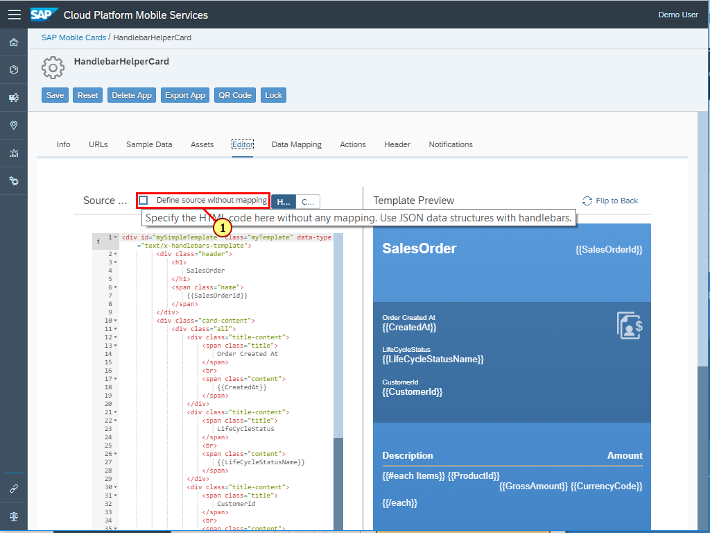

Replace `{{SalesOrderId}}` with `{{d.SalesOrderId}}`. By doing so, handlebars expression points to the correct JSON path.

```JSON
{{d.SalesOrderId}}
```

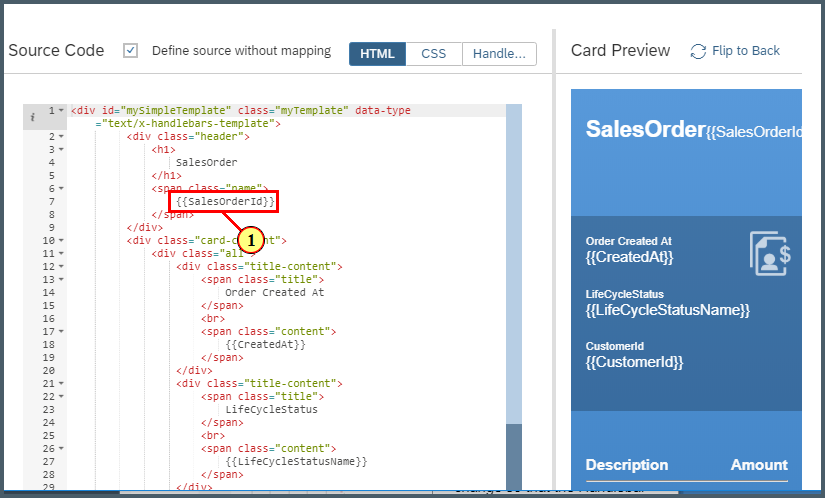

Repeat the same for below handlebars:

| Current | New |
|----|----|
| `{{CreatedAt}}` | `{{d.CreatedAt}}` |
| `{{LifeCycleStatusName}}` | `{{d.LifeCycleStatusName}}` |
| `{{CustomerId}}`| `{{d.CustomerId}}` |

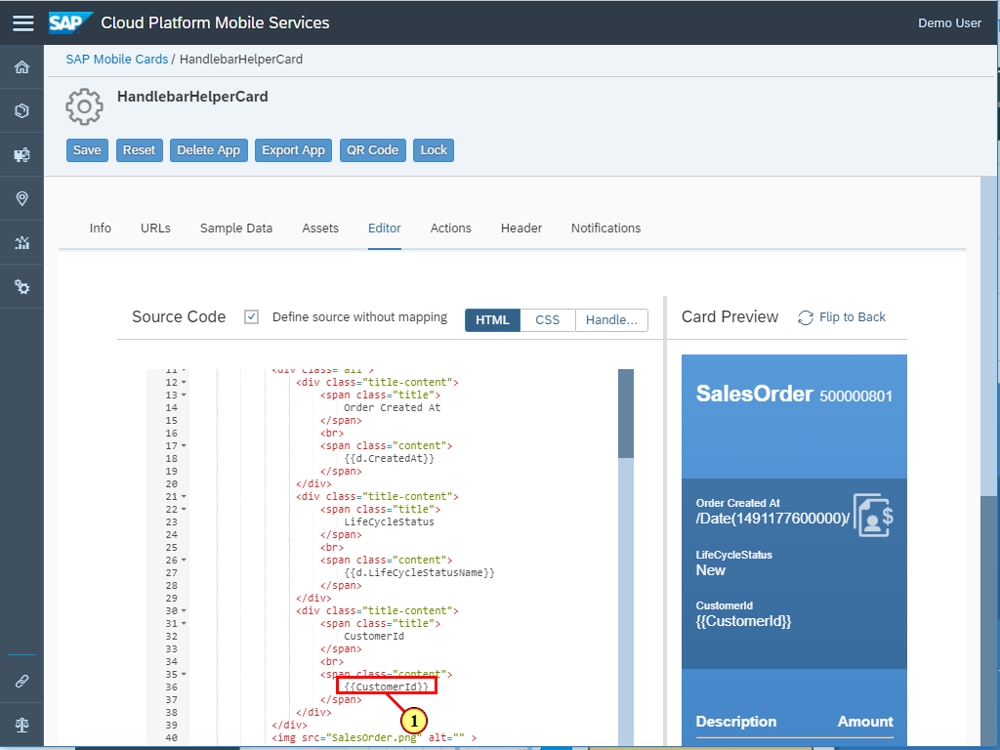

Replace `{{#each Items}}` with `{{#each d.Items.results}}`  

>[Handlebars block helper](https://handlebarsjs.com/block_helpers.html) function **each** points to the correct JSON path of the items result set.

```JSON
{{#each d.Items.results}}
```
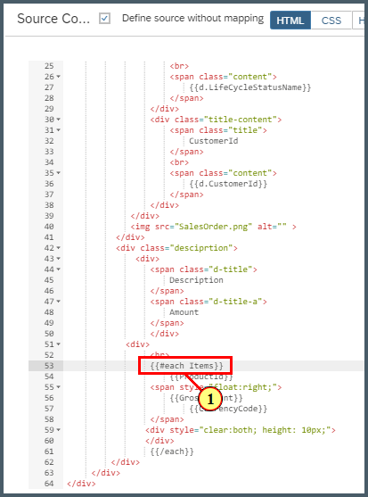

Add below Handlebars helper function in front of `{{d.LifeCycleStatusName}}` class.

```JSON
{{lcsHelper d.LifeCycleStatus}}
```
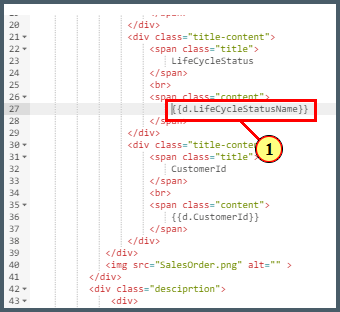

You will see a pop-up window alerting on missing helper function. Click **Close** to implement it.

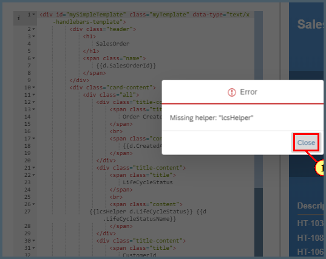

Click **Handle...** to switch to the **Handlebars** tab where missing Handlebars helper function can be implemented.

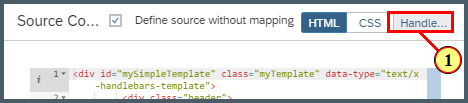

Copy and paste the following code.

```JavaScript
Handlebars.registerHelper("lcsHelper", function (passedString) {
if (passedString.includes("A")) {
return new Handlebars.SafeString( "");
}
if (passedString.includes("R")) {
return new Handlebars.SafeString("");
}
return new Handlebars.SafeString( "");
});
```

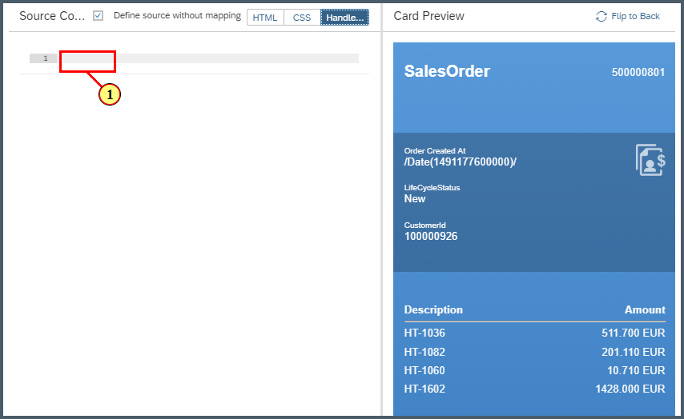

>This Handlebars helper function will evaluate the `passedString` which is the `LifeCycleStatus` JSON value. This function will insert an image depending on the status and return the related `HTML` snippet. If the Status is **C** (closed) than the function will not insert any image.

[VALIDATE_1]
[ACCORDION-END]

[ACCORDION-BEGIN [Step 4: ](Upload assets to the card)]

Open below links and save images on local machine. These images will be used as assets for this tutorial.

[Orange Traffic light](https://openclipart.org/image/300px/svg_to_png/195672/Traffic-light-3.png)

[Red  Traffic light](https://openclipart.org/image/300px/svg_to_png/195670/Traffic-light-1.png)

[Green Traffic light](https://openclipart.org/image/300px/svg_to_png/195669/Traffic-light.png)

Once done, click **Assets** to upload asset files.


Click the **upload** icon to upload the images.


Navigate to folder where you have saved all three images and upload them one by one.

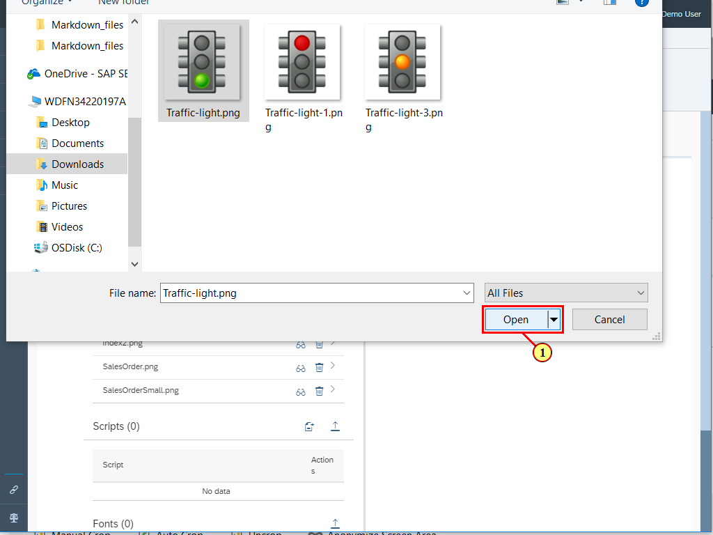

Make sure you have all three images uploaded.

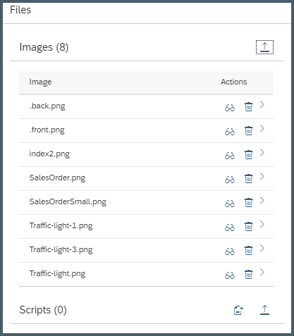

[DONE]
[ACCORDION-END]

[ACCORDION-BEGIN [Step 5: ](Implement logic for gross amount)]

Click the **Editor** tab.

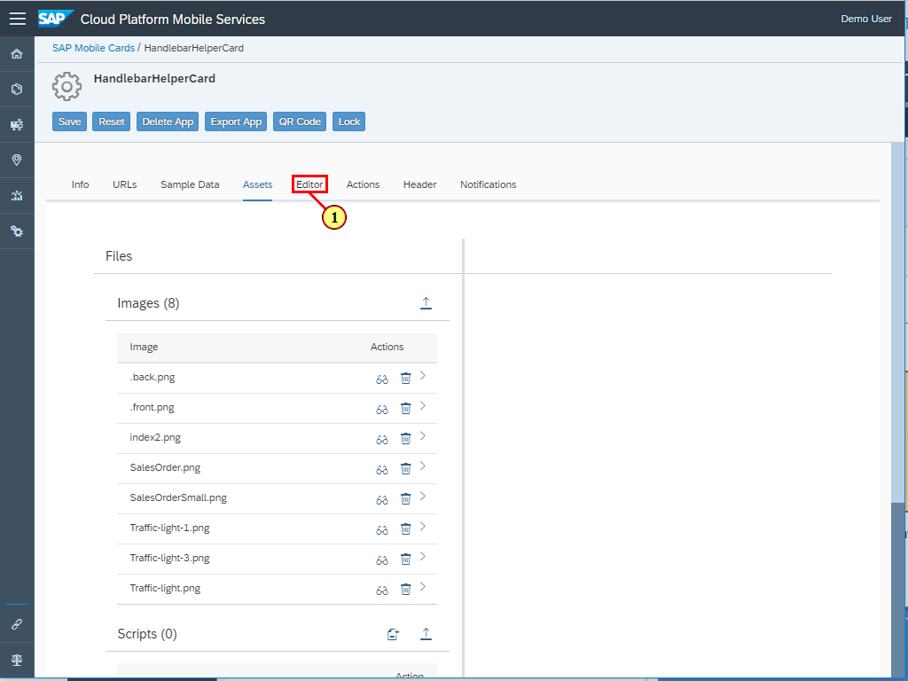

Click **Handle...**.

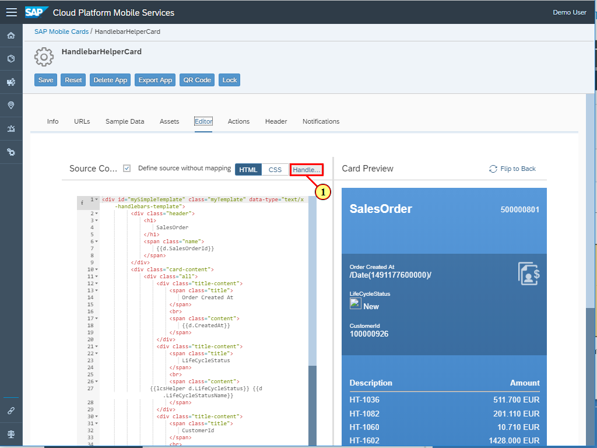

Copy and paste the following code below the existing function:

```JavaScript
Handlebars.registerHelper("gaCheckHelper", function (grossAmount) {
if (grossAmount > 1000) {
return new Handlebars.SafeString( "<b> <font color=\"GreenYellow\">" + grossAmount + "</b> </font>");
}
return new Handlebars.SafeString( grossAmount);
});
```

>This handlebars helper function will evaluate the  `grossAmount` which is the `grossAmount` JSON value. If the value is above 1000 it will Color it green.

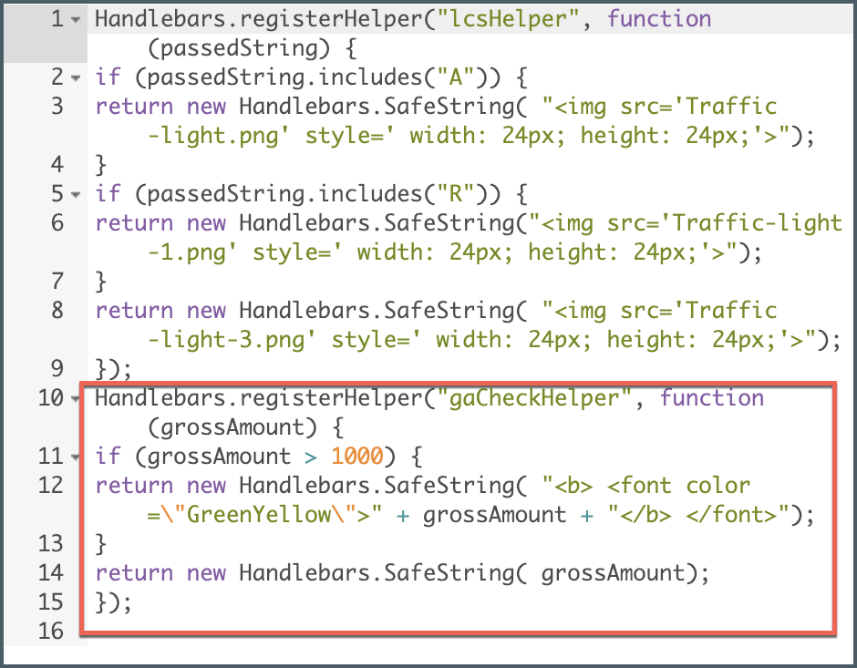

Switch to **HTML** editor.

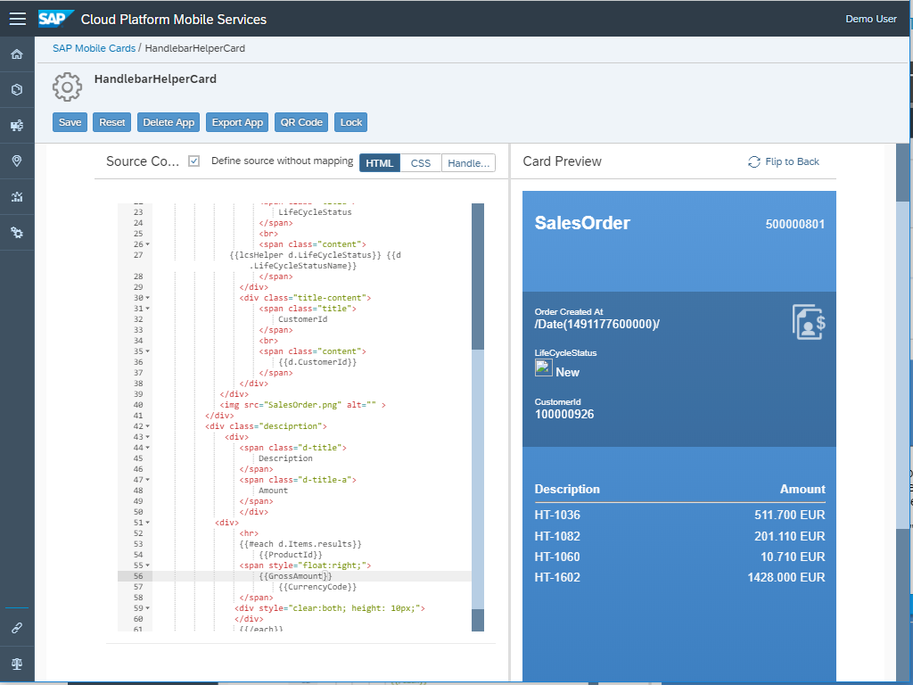

Replace `{{GrossAmount}}` with `{{gaCheckHelper GrossAmount}}` .

```JSON
{{gaCheckHelper GrossAmount}}
```

>`gaCheckHelper` handlebars helper function is getting the value `GrossAmount` passed in. `GrossAmount` does not need the path as this function is getting called in the Handlebars helper block with `d.Items.results` path.

As a result, the value above 1000 is coloured green.

>If the editor does not refreshed by itself, you can force it to reload by switching tabs. Click `css` and then back on `HTML`.

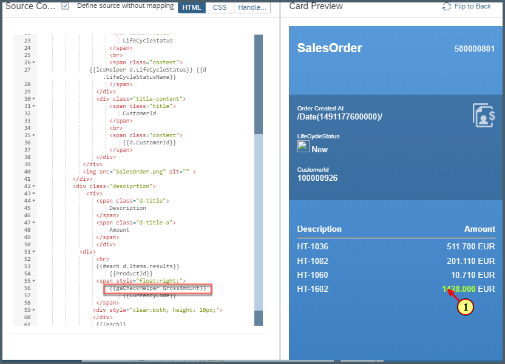

Click **Save**.

[DONE]
[ACCORDION-END]

[ACCORDION-BEGIN [Step 6: ](Subscribe to the card)]

In the SAP Mobile Cards application, click the **+** icon to open the subscriptions.

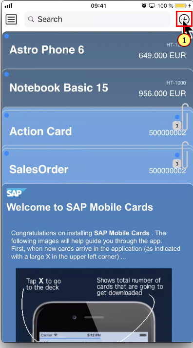

Click `HandlebarsHelperCard` under the **All** tab.

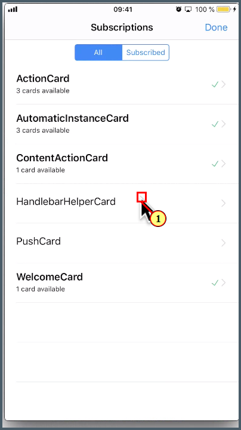

Click **Subscribe** to activate the `HandlebarsHelperCard` subscription.

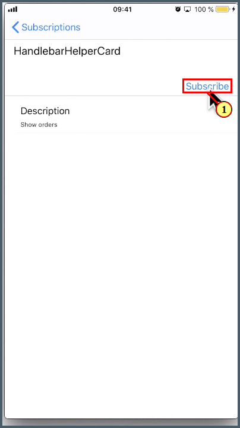

Click any card to open it.

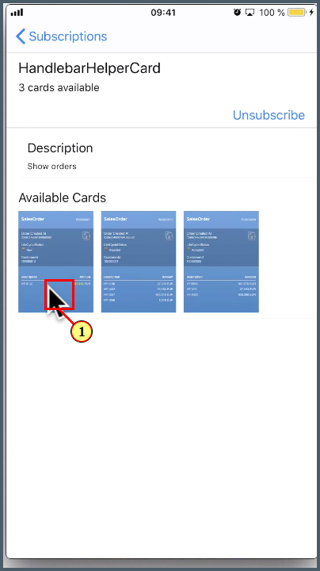

Here, you can see a preview of the card. Click **Done**.

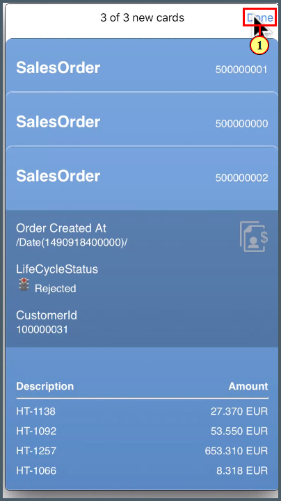

Congratulations, you have successfully implemented handlebars helper in your card.

>These helpers are only called when the card is updating, this means, if there is no change in data the handlebar functions are not going to be called.

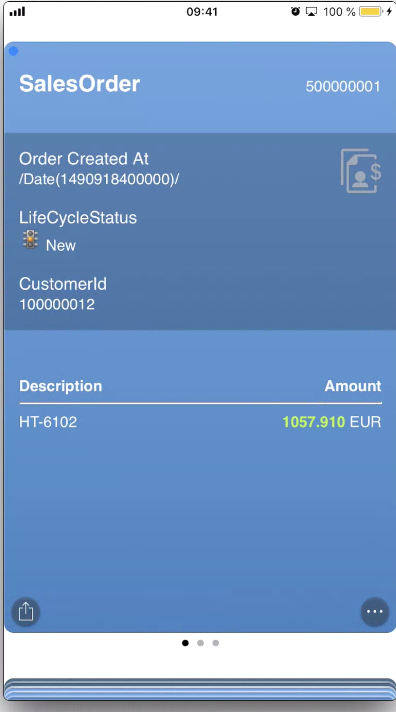

[DONE]
[ACCORDION-END]
