## Prerequisites
- [Sign up for a free trial account on SAP Cloud Platform](hcp-create-trial-account)
- [Enable SAP Cloud Platform Mobile Services](fiori-ios-hcpms-setup)
- **Install SAP Mobile Cards Application:** Download and install on your [iPhone](https://itunes.apple.com/us/app/sap-content-to-go/id1168110623?mt=8) or [Android](https://play.google.com/store/apps/details?id=com.sap.content2go)

## Details
### You will learn
  - How to connect the SAP Mobile Cards application to your SAP Cloud Platform Mobile Services

---

[ACCORDION-BEGIN [Step 1: ](Understand the SAP Mobile Cards feature)]

SAP Mobile Cards is a feature within SAP Cloud Platform Mobile Services which provides our customers access to a micro application platform to publish data into a consumer grade wallet or passbook-style app. It allows companies to quickly create simple, yet highly valuable quick-win apps.

You can find more details in the [SAP Mobile Cards developer page](https://developers.sap.com/topics/mobile-cards.html).

[DONE]
[ACCORDION-END]
[ACCORDION-BEGIN [Step 2: ](Log into Mobile Services cockpit)]

Go to [https://cloudplatform.sap.com/index.html](https://cloudplatform.sap.com/index.html "") and click **Login**.

Enter your SAP Cloud Platform account credentials and click **Log On**.

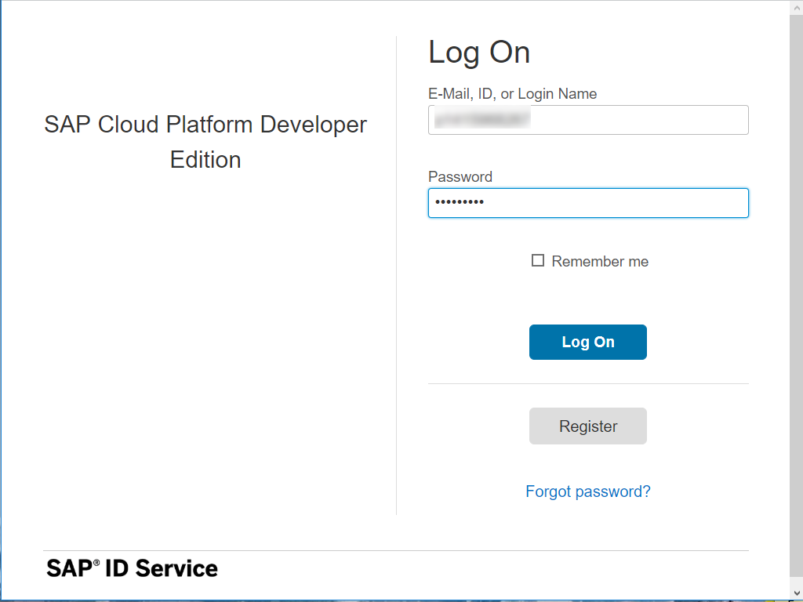

Click **Neo Trial** to navigate into SAP Cloud Platform cockpit.

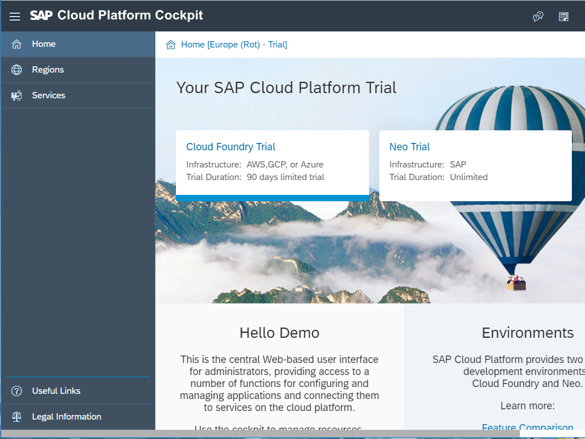

Click **Services** to look for Mobile Services.

Click **Mobile** from the list of available categories.

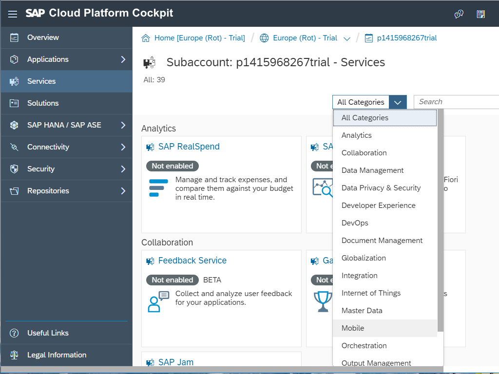

Click **Mobile Services, users**.  

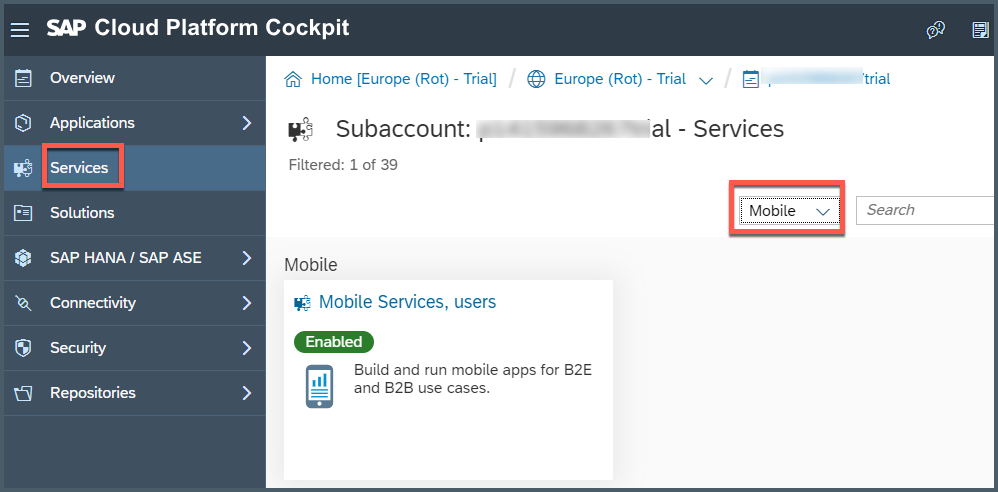

Click **Go to Service** to open the SAP Cloud Platform Mobile Services Cockpit.

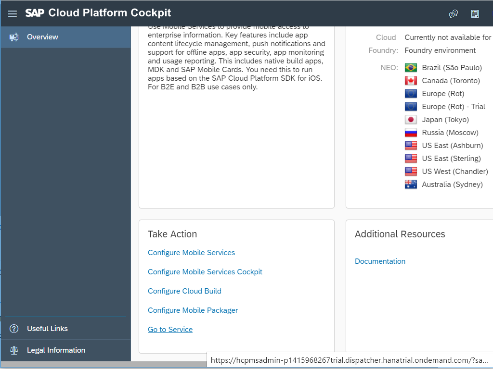

Click **Close** to close this information window.

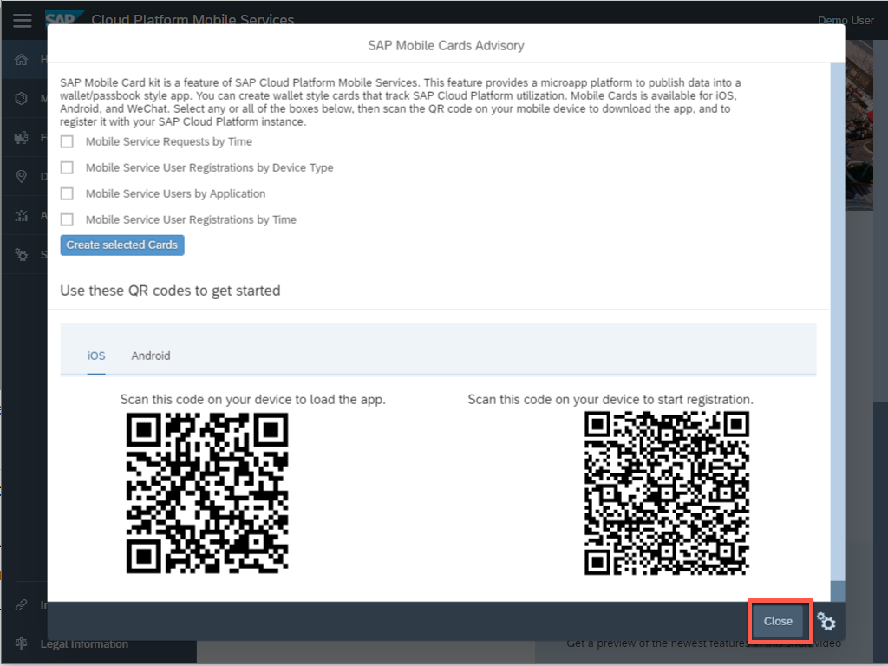

[DONE]
[ACCORDION-END]

[ACCORDION-BEGIN [Step 3: ](Get familiar with default configuration)]

Navigate to **SAP Mobile Cards** to look into the Mobile Cards configuration.

Click **Features**.

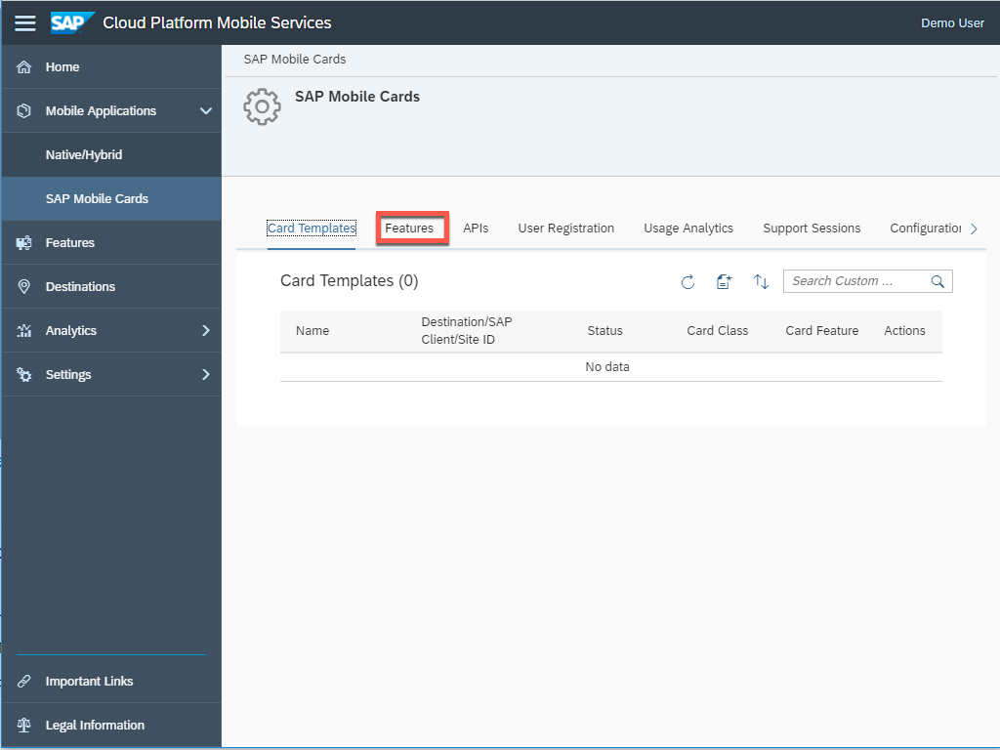

Click **Connectivity** to look into destination endpoints, where you can create a new destination connecting to backend endpoint or select from any existing destinations.

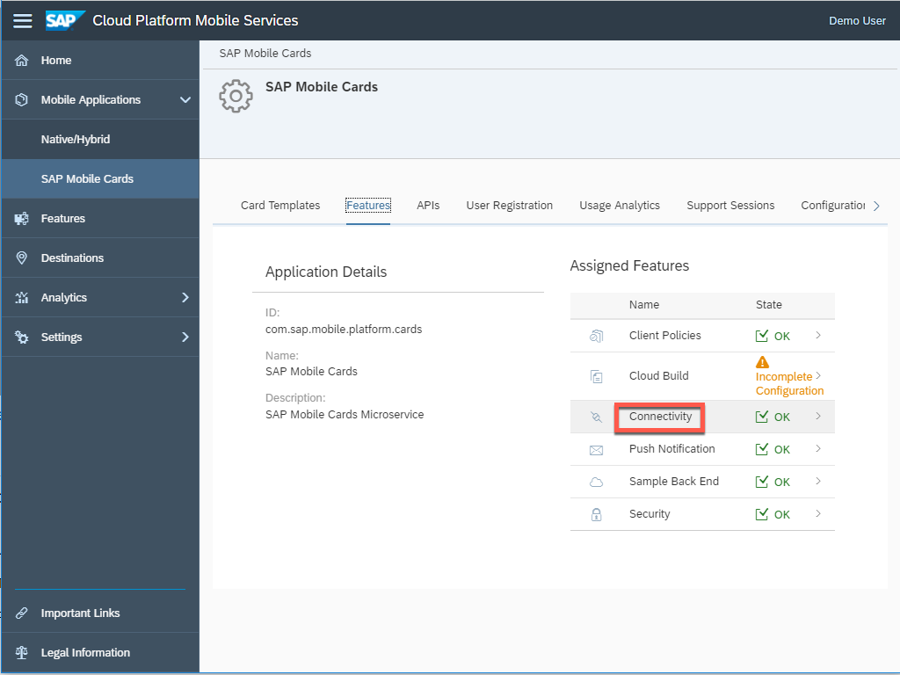

Below is a list of destinations from which the SAP Mobile Cards service can fetch data. For this tutorial, the `SAPCPMobileServices` destination is used. It's important that all destinations are only pointing to the root of the service.

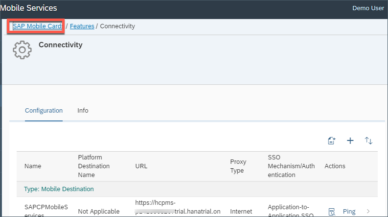

Click **SAP Mobile Cards** navigation bar to go back to Mobile Cards admin page.

[DONE]
[ACCORDION-END]

[ACCORDION-BEGIN [Step 4: ](Configure SAP Mobile Cards client)]

Follow the next steps to trigger the configuration of the SAP Mobile Cards client with this SAP Cloud Platform account.

Click **APIs**.

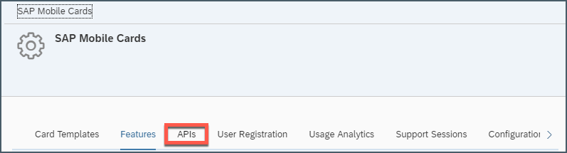

Open your phone camera app and start scanning the QR code, as shown below. For Android devices, look for a QR code scanning app and scan with the same.

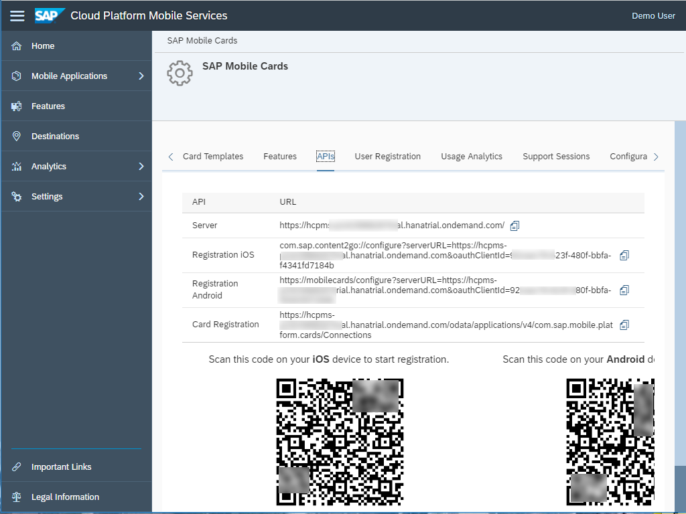

Click the toast message to launch SAP Mobile Cards.

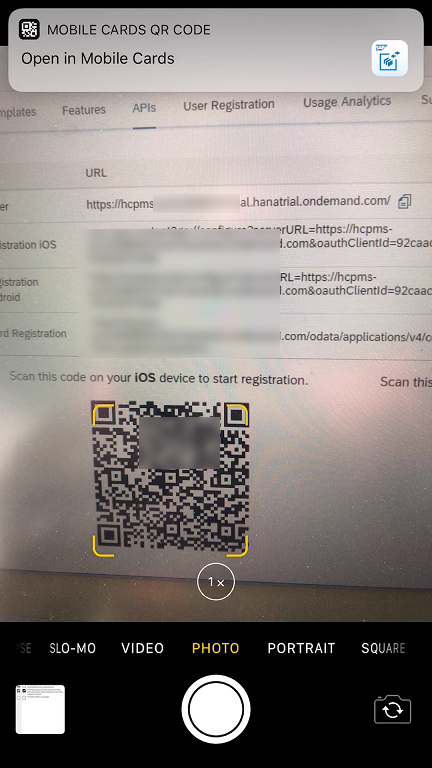

Enter your SAP Cloud Platform credentials and click **Log On** to authenticate.

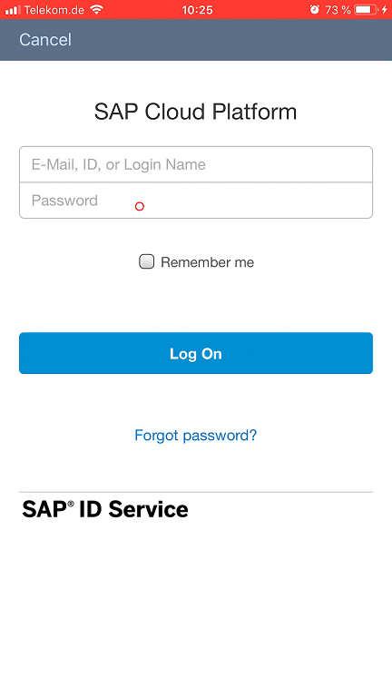

You now have connected your SAP Mobile Cards client with your SAP Cloud Platform account.

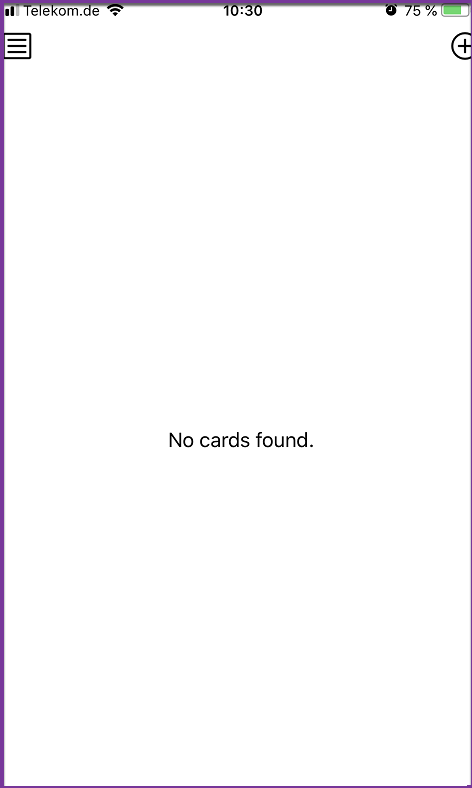

[VALIDATE_1]
[ACCORDION-END]

---
