## Prerequisites
- [Get a Free Trial Account on SAP Cloud Platform](hcp-create-trial-account)
- [Enable SAP Cloud Platform Mobile Services](fiori-ios-hcpms-setup)
- **Install SAP Mobile Cards Application:** Download and install on your [iPhone](https://itunes.apple.com/us/app/sap-content-to-go/id1168110623?mt=8) or [Android](https://play.google.com/store/apps/details?id=com.sap.content2go)
- Download and install [Lightning QR Scanner](https://play.google.com/store/apps/details?id=com.application_4u.qrcode.barcode.scanner.reader.flashlight&hl=en_IN) (required only for Android device)

## Details
### You will learn
  - How to connect the SAP Mobile Cards application to your SAP Cloud Platform Mobile Services

---

[ACCORDION-BEGIN [Step 1: ](Understand the SAP Mobile Cards feature)]

SAP Mobile Cards is a feature within SAP Cloud Platform Mobile Services which provides our customers access to a micro application platform to publish data into a consumer grade wallet or passbook-style app. It allows companies to quickly create simple, yet highly valuable quick-win apps.

You can find more details in the [SAP Mobile Cards developer page](https://developers.sap.com/topics/mobile-cards.html).

[DONE]
[ACCORDION-END]
[ACCORDION-BEGIN [Step 2: ](Log into Mobile Services cockpit)]

Go to [https://cloudplatform.sap.com/index.html](https://cloudplatform.sap.com/index.html "") and click **Login**.

Enter your SAP Cloud Platform account credentials and click **Log On**.

Click **Neo Trial** to navigate into SAP Cloud Platform cockpit.

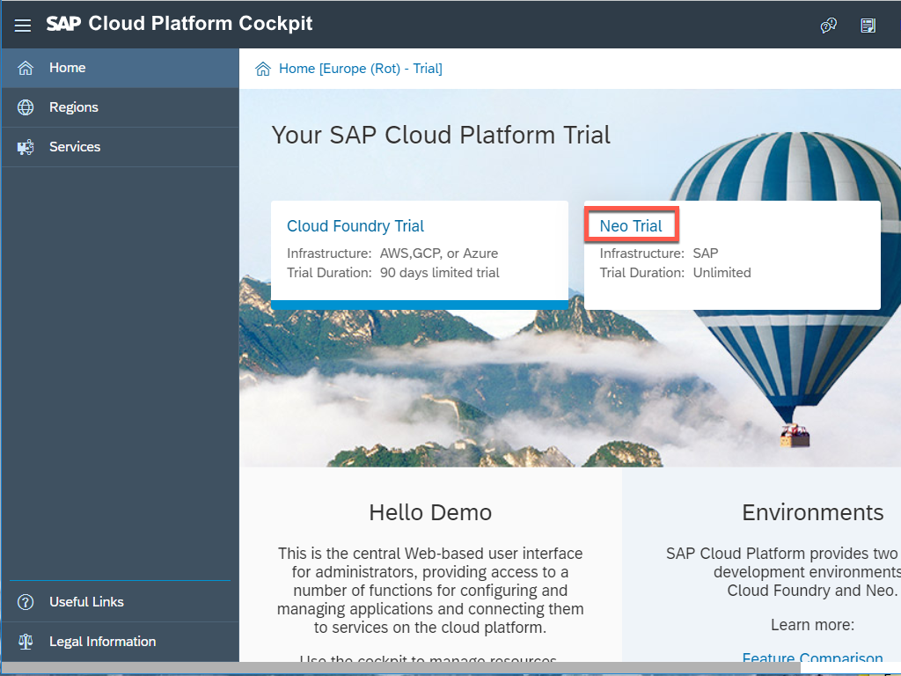

Choose **Services**, look for the **Mobile** category, and click **Mobile Services, users**.  

Click **Go to Service** to open the SAP Cloud Platform Mobile Services Cockpit.

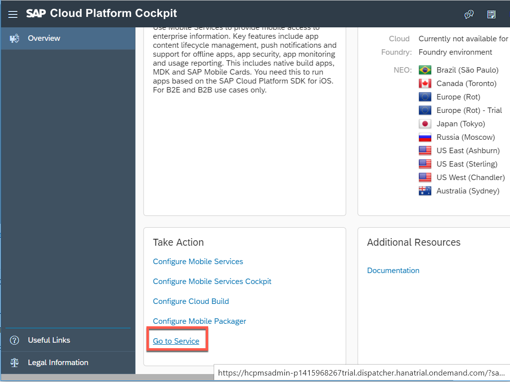

Click **Close** to close this information window.

[DONE]
[ACCORDION-END]

[ACCORDION-BEGIN [Step 3: ](Get familiar with available configuration)]

Navigate to **SAP Mobile Cards** to look into the Mobile Cards configuration.

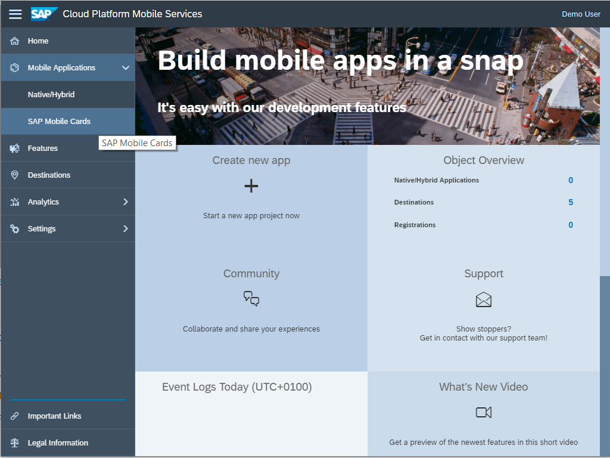

Click **Features**.

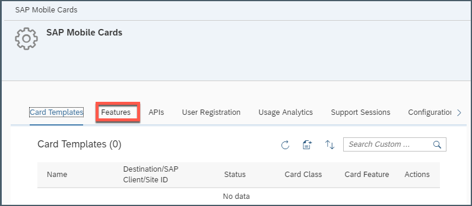

Click **Sample Back End** to look into available OData V2 and V4 sample endpoints.

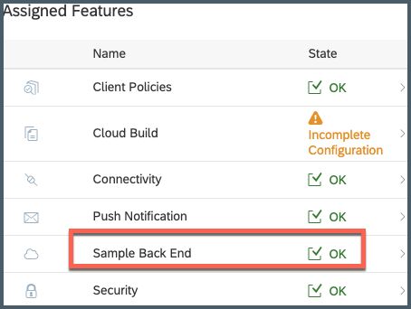

Select **OData Version** V2 and, click **Save**.

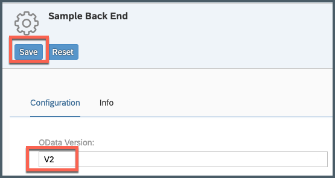

Click **Connectivity** to look into destination endpoints, where you can create a new destination connecting to backend endpoint or select from any existing destinations.

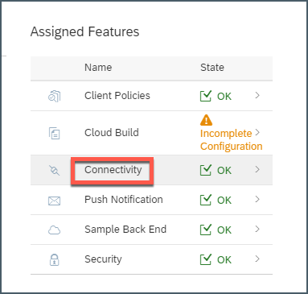

Below is a list of destinations from which the SAP Mobile Cards service can fetch data. For this tutorial, the `com.sap.edm.sampleservice.v2` destination is used. It's important that all destinations are only pointing to the root of the service.

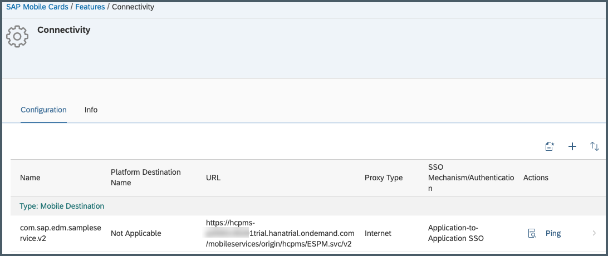

Click **SAP Mobile Cards** navigation bar to go back to Mobile Cards admin page.

[DONE]
[ACCORDION-END]

[ACCORDION-BEGIN [Step 4: ](Configure SAP Mobile Cards client)]

Follow the next steps to trigger the configuration of the SAP Mobile Cards client with this SAP Cloud Platform account.

Click **APIs**.

Open your phone camera app and start scanning the QR code, as shown below.

>For Android device, you can install _Lightning QR_ app on your device. Open this app and scan the QR code (make sure you scan the QR code displaying for Android device), once scan is done, click on _open link_ option showing up on the screen, it will launch SAP Mobile Cards app installed on the device.

Click the toast message to launch SAP Mobile Cards.

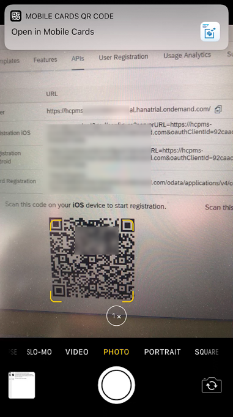

Enter your SAP Cloud Platform credentials and click **Log On** to authenticate.

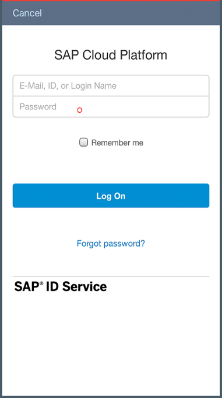

You now have connected your SAP Mobile Cards client with your SAP Cloud Platform account.

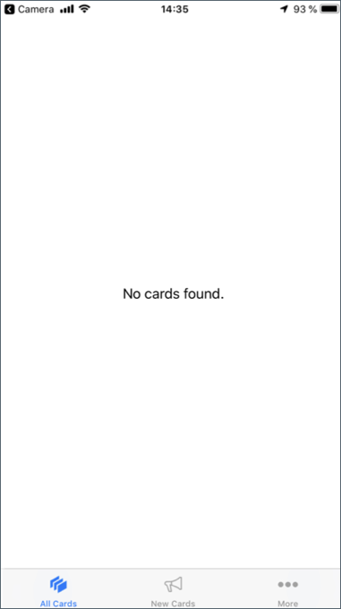

[VALIDATE_1]
[ACCORDION-END]

---
