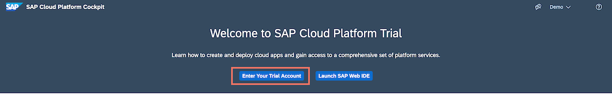

## Prerequisites
- [Get a Free Trial Account on SAP Cloud Platform](hcp-create-trial-account)
- [Enable SAP Cloud Platform Mobile Services](fiori-ios-hcpms-setup)
- **Install SAP Mobile Cards Application:** Download and install on your [iPhone](https://itunes.apple.com/us/app/sap-content-to-go/id1168110623?mt=8) or [Android](https://play.google.com/store/apps/details?id=com.sap.content2go)

## Details
### You will learn
  - How to connect the SAP Mobile Cards application to your SAP Cloud Platform Mobile Services

---

[ACCORDION-BEGIN [Step 1: ](Understand SAP Mobile Cards)]

SAP Mobile Cards is a feature within SAP Cloud Platform Mobile Services which provides our customers access to a micro-application platform to publish data into a consumer-grade wallet or passbook-style app. It allows companies to quickly create simple, yet highly valuable quick-win apps. These apps can give access to useful organisational tools like to do lists, payslip, time sheets and workflows like Leave request approvals, Purchase Order approvals.

You can find more details on the [SAP Mobile Cards developer page](https://developers.sap.com/topics/mobile-cards.html).

[DONE]
[ACCORDION-END]

[ACCORDION-BEGIN [Step 2: ](Go to SAP Mobile Services cockpit)]

On the [SAP Cloud Platform Trial landing page](https://cockpit.hanatrial.ondemand.com), choose **Enter your Trial Account** to see your global account.

Navigate to subaccount by clicking on the tile named **trial** (this name may vary if you created the subaccount manually).

Under **Spaces**, choose the available space as highlighted below.

In the left pane, choose **Services** > **Service Marketplace**.

>The **Service Marketplace** is where you can find services to attach to any of your applications. These services are provided by SAP Cloud Platform to create, and produce applications quickly and easily.

Search for **Mobile Card Kit**, and click on the tile.  

SAP Cloud Platform Mobile Services provides services to mobile applications, such as application analytics, app resources, onboarding, HTTP/HTTPS configuration and so on. Choose **Support** to open **SAP Cloud Platform Mobile Services Cockpit**.

Choose the relevant **Organization** and **Space** from the dropdown list, and then select **Open**.

>**Organization:** Organizations in CF enable collaboration among users and enable grouping of resources.

>**Space:** Cloud Foundry has a standard working environment for individual applications: it is called a space. Spaces are individual working areas, which normally contain a single application.

You have now logged in to the SAP Mobile Services cockpit.

Bookmark the **Mobile Services cockpit URL** for quick access.

[DONE]
[ACCORDION-END]

[ACCORDION-BEGIN [Step 3: ](Get familiar with available configuration)]

Navigate to **SAP Mobile Cards** to look into the Mobile Cards configuration.

>If the SAP Mobile Cards Advisory screen pops up, choose **Close** to close it.

Click **Initialize**. This will create a new service instance for Mobile Cards.

Click **Features**.

Click **Mobile Sample OData ESPM** to look into available OData Version 2 and Version 4 sample endpoints.

Select **OData Version** Version 2 and, click **Save**.

Go back to the **Features** Tab and click **Mobile Connectivity** to look into destination endpoints, where you can create a new destination connecting to backend endpoint or select from any existing destinations.

Below is a list of destinations from which the SAP Mobile Cards service can fetch data.

>For this tutorial, the `com.sap.edm.sampleservice.v2` destination is used. It's important that all destinations are only pointing to the root of the service.

Click **SAP Mobile Cards** navigation bar to go back to Mobile Cards admin page.

[DONE]
[ACCORDION-END]

[ACCORDION-BEGIN [Step 4: ](Configure SAP Mobile Cards Client)]

>Make sure you are choosing the right device platform tab **above**.

>Make sure you have installed the SAP Mobile Cards app on your phone.

You will configure the SAP Mobile Cards client with your SAP Cloud Platform account.

Click **APIs**. You will now scan the respective QR Card to onboard your SAP Mobile Cards Client.

[OPTION BEGIN [Android]]

Tap **SCAN QR CODE**.

>In CF trial accounts, all applications are stopped every night for saving resources. This is by design.

>If you see some trouble during on-boarding process, make sure that Mobile Services app state is in **Started** mode. In SAP Cloud Platform cockpit, navigate to subaccount > Spaces> Applications
>

Tap **I AGREE** on `End User License Agreement`.

Enter your SAP Cloud Platform credentials, and tap **Log On**.

Choose a passcode with at least 8 characters to unlock the app, and tap **NEXT**.

Confirm the passcode and tap **DONE**.

You now have connected your SAP Mobile Cards client with your SAP Cloud Platform account.

[OPTION END]

[OPTION BEGIN [iOS]]

Scan the QR code with your camera and select the toast message to launch the SAP Mobile Cards app.

>In CF trial accounts, all applications are stopped every night for saving resources. This is by design.

>If you see some trouble during on-boarding process, make sure that Mobile Services app state is in **Started** mode. In SAP Cloud Platform cockpit, navigate to subaccount > Spaces> Applications
>

Enter your SAP Cloud Platform credentials and choose **Log On**.

Choose a passcode with at least 8 characters to unlock the app.

Confirm the passcode and choose **Done**.

You now have connected your SAP Mobile Cards client with your SAP Cloud Platform account.

[OPTION END]

[VALIDATE_1]
[ACCORDION-END]

---
