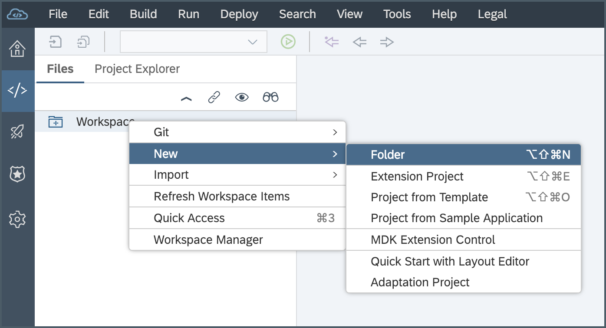
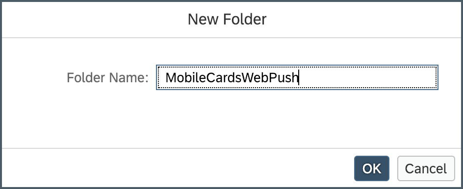
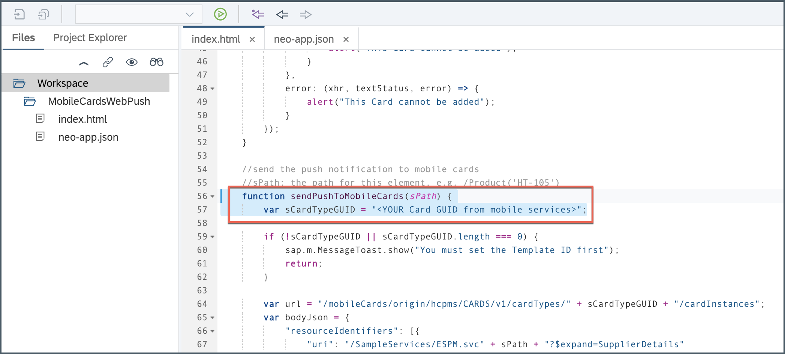
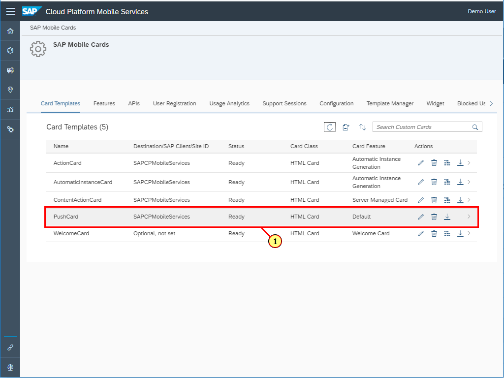
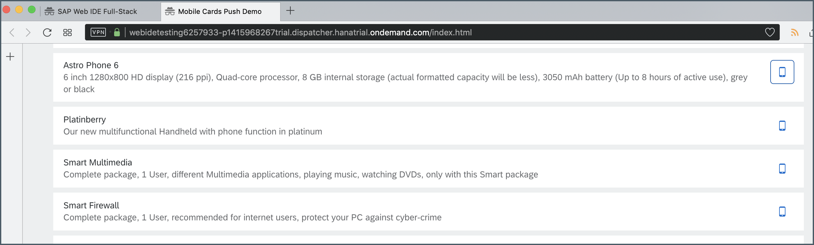

## Prerequisites
- [Sign up for a free trial account on SAP Cloud Platform](hcp-create-trial-account)
- [Enable SAP Cloud Platform Mobile Services](fiori-ios-hcpms-setup)
- **Install SAP Mobile Cards Application:** Download and install on your [iPhone](https://apps.apple.com/us/app/sap-mobile-cards/id1168110623) or [Android](https://play.google.com/store/apps/details?id=com.sap.content2go)

## Details
### You will learn
 - How to push content from a web application to SAP Mobile Cards with Default card template
 - JavaScript code needed to embed in your webpage

The Default card allows you to mobilize content, which the user can push from any system. The content will be updated in the background so that the cards are always up to date.

---

[ACCORDION-BEGIN [Step 1: ](Get familiar with real world use case)]

A company wants to enable its sales team to have the latest information about certain products. Each salesperson should be able to decide on what products he or she wants to have on their mobile devices.

The salesperson can do this by sending the selected product from a webpage to the mobile device. From this point on, the product will be on the mobile device available offline and the product details will update in the background so that the data on the mobile device is always up to date.

[DONE]
[ACCORDION-END]

[ACCORDION-BEGIN [Step 2: ](Create a new card)]

Make sure you have logged into the SAP Cloud Platform Mobile Services cockpit. Navigate to **SAP Mobile Cards** to look into Mobile Cards configuration.


Click the **Create a New Card** icon.


Provide the required information:

| Field | Value |
|----|----|
| **Name** | `PushCard` |
| **Destination** | `SAPCPMobileServices` |
| **Template Source** | `Template Manager` |
| **HTML Template** | `Sample Product Template` |
| **Card Template** | `Default` |

> If you see a pop-up, click **OK** for the confirmation.


> **Destination** defines the root for the queries that are going to be used for this card.

Click **Save**.

[DONE]
[ACCORDION-END]

[ACCORDION-BEGIN [Step 3: ](Subscribe to the card)]

In the SAP Mobile Cards application, click the **+** icon to open the subscriptions.


Click `PushCard` under the **All** tab.


Click **Subscribe** to activate the `PushCard` subscription.


It will show **No Card available** as there is no card yet pushed from the web application.


[DONE]
[ACCORDION-END]

[ACCORDION-BEGIN [Step 4: ](Create a project in SAP Web IDE)]

Open SAP Web IDE Full-Stack.

> If SAP Web IDE Full-Stack service is not enabled, enable it first. Follow [this](webide-multi-cloud) tutorial for more details.

Right click on **Workspace** and select **New** > **Folder**.



Provide a name to the Folder and click **OK**.



Right click on the folder and select **New** > **File**.


Name this file to `index.html`.


Copy and paste the following code.

```HTML
<!DOCTYPE html>
<html>
<head>
	<meta http-equiv="X-UA-Compatible" content="IE=edge" />
	<meta http-equiv="Content-Type" content="text/html;charset=UTF-8"/>
	<meta name="viewport" content="width=device-width, initial-scale=1.0" />
	<title>Mobile Cards Push Demo</title>

	<script src="https://code.jquery.com/jquery-3.3.1.min.js"></script>
	<link href="//unpkg.com/fiori-fundamentals@latest/dist/fiori-fundamentals.min.css" rel="stylesheet">
<script>

	//get the product list
	function getProductList() {
		var url = "/mobileservices/SampleServices/ESPM.svc/" + "Products" + "?$format=json"

		jQuery.ajax({
			url: url,
			async: true,
			type: "GET",
			success: (data, textStatus, xhr) => {
				console.log(data);
				if (xhr.status === 200) {
					//append each product as fiori tile to the dom
					data.d.results.forEach((product) => {
						$("#productList").append(
							"<div class='fd-tile fd-has-margin-tiny'><div class='fd-tile__content'>"
							  + `<h2 class='fd-tile__title'>${product.Name}</h2>`
							  + `<p>${product.ShortDescription}</p>`
							  + "</div><div class='fd-tile__actions'><div class='fd-popover fd-popover--right'><div class='fd-popover__control'>"
							  + `<button class='sendButton fd-button--light sap-icon--iphone' aria-label='Send to phone' data-productId='${product.ProductId}'></button>`
							  + "</div></div> </div></div>"
							);
					});
					//add button click listener to all buttons
					$('.sendButton').click((button) => {
						var productId = button.target.attributes.getNamedItem("data-productId").value;
						if (productId !== undefined) {
							console.log("Push to mobile cards", productId)
							//build the correct sPath e.g. /Products('HT-105') from the productId HT-105
							sendPushToMobileCards(`/Products('${productId}')`);
						}
					})
				} else {
					alert("This Card cannot be added");
				}
			},
			error: (xhr, textStatus, error) => {
				alert("This Card cannot be added");
			}
		});
	}

	//send the push notification to mobile cards
	//sPath: the path for this element, e.g. /Product('HT-105')
	function sendPushToMobileCards(sPath) {
		var sCardTypeGUID = "<YOUR Card GUID from mobile services>";

		if (!sCardTypeGUID || sCardTypeGUID.length === 0) {
			sap.m.MessageToast.show("You must set the Template ID first");
			return;
		}

		var url = "/mobileCards/origin/hcpms/CARDS/v1/cardTypes/" + sCardTypeGUID + "/cardInstances";
		var bodyJson = {
			"resourceIdentifiers": [{
				"uri": "/SampleServices/ESPM.svc" + sPath + "?$expand=SupplierDetails"
			}]
		};

		jQuery.ajax({
			url: url,
			async: true,
			type: "POST",
			data: JSON.stringify(bodyJson),
			headers: {
				'content-type': 'application/json'
			},
			success: (data, textStatus, xhr) => {
				if (xhr.status === 201) {
					alert("Successfully added Card");
				} else if (xhr.status === 200) {
					alert("Card has already been added");
				} else {
					alert("This Card cannot be added");
				}
			},
			error: (xhr, textStatus, error) => {
				alert("This Card cannot be added");
			}
		});
	}
	//init
	getProductList();

</script>

</head>
<body>
	<div id="productList" class="fd-page__content" style="max-width: 1200px; margin: auto;">

	</div>
</body>
</html>
```

Similarly, create another file and name it to `neo-app.json`.


Copy and paste the following code to this file:

```JSON
{
  "routes": [

    {
      "path": "/mobileCards",
      "target": {
        "type": "destination",
        "name": "mobileservices",
        "entryPath": "mobileservices"
      },
      "description": "mobileCards"
    },
    {
      "path": "/mobileservices",
      "target": {
        "type": "destination",
        "name": "mobileservices"
      },
      "description": "mobileservices"
    }
  ],
  "sendWelcomeFileRedirect": true
}
```

In `index.html` file, scroll down until you see the function `sendPushToMobileCards`.



> `Card GUID` is a placeholder for the Mobile Cards ID. When a new card is created in Mobile Services Cockpit, a unique identifier is assigned to it.

[DONE]
[ACCORDION-END]

[ACCORDION-BEGIN [Step 5: ](Copy Mobile Cards ID)]

Switch back to SAP Cloud Platform Mobile Services Cockpit, go to `PushCard` configuration.



Copy the **ID**.


[DONE]
[ACCORDION-END]

[ACCORDION-BEGIN [Step 6: ](Paste ID into SAP Web IDE project)]

Switch back to SAP Web IDE and paste the ID in place of `<YOUR Card GUID from mobile services>`.


Click the **Save** icon.


[DONE]
[ACCORDION-END]

[ACCORDION-BEGIN [Step 7: ](Push product info from web application)]

Click on run icon to run the web application.


>If you see **Disable pop-up blocker**, click the right-most icon in the address bar and select the **Always allow** option, and click **Done**.

>If you still see nothing happening, close the blocker pop-up and re-run the app by clicking the run icon.


Click on mobile icon next to the available products.



Once the card has been added, you will see a success message.


[VALIDATE_1]
[ACCORDION-END]

[ACCORDION-BEGIN [Step 8: ](View product info in Mobile Cards application)]

In the SAP Mobile Cards application, you will see a new card that has been shared from the web application.


[DONE]
[ACCORDION-END]
