## Prerequisites

## Details
### You will learn
- How to create an SAP Mobile Card using SAP Cloud Platform Boosters

---

[ACCORDION-BEGIN [Step 1: ](Get familiar with real world use case)]

An organization wants to share a welcome message to a new employee. Upon successful authentication in the SAP Mobile Cards app, the new employee sees a welcome card. In this card, the organization shows basic details to help the employee have a great first day. This card is available to the user without the user having to subscribe to the card.

Welcome Cards are Server Managed Cards that are automatically subscribed. When such a card is created, users automatically get instances of the card because they are automatically subscribed to the card.

[DONE]
[ACCORDION-END]

[ACCORDION-BEGIN [Step 2: ](Create A Welcome Card using Boosters)]

SAP Mobile Cards can be created in multiple ways. In this tutorial, you will create a card using SAP Cloud Platform Boosters.

> SAP Cloud Platform Boosters are sets of guided interactive steps which help you achieve specific goals.

In your web browser, open the [SAP Cloud Platform trial cockpit](https://cockpit.hanatrial.ondemand.com/).

Navigate to the trial global account by clicking **Enter Your Trial Account**.

!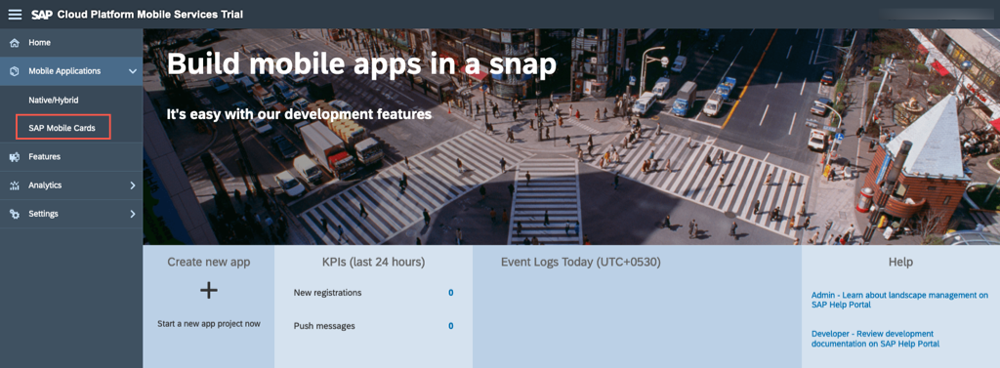

In the side navigation bar, click **Boosters**.

!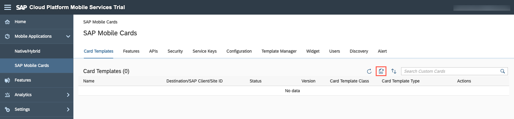

Click the **Build a Micro App for SAP Mobile Cards** tile.

!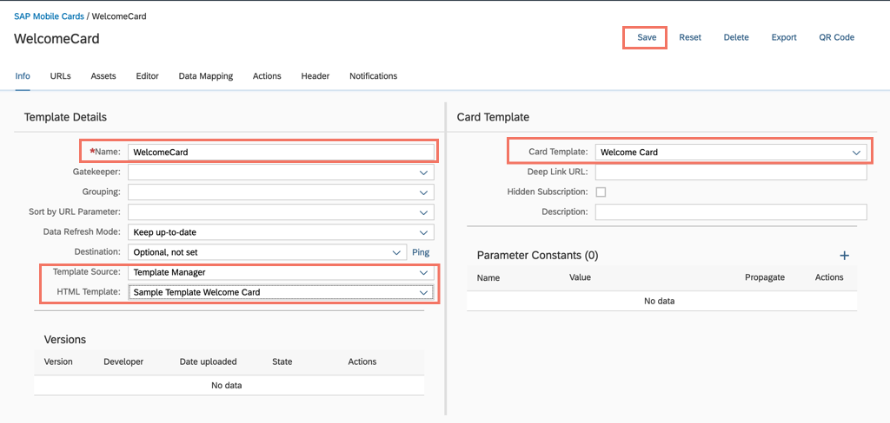

Go through the details mentioned and click **Start**.

!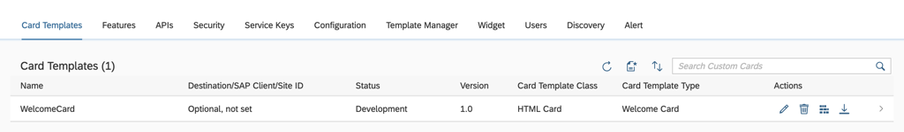

In the *Check Prerequisites* tab of the wizard, click **Next**.

!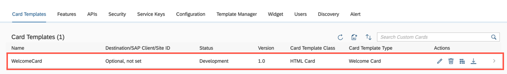

In the *Select Subaccount* tab of the wizard, select the following and click **Next**.

|Field|Value|
|----|---|
|Subaccount| trial |
|Space| dev |

!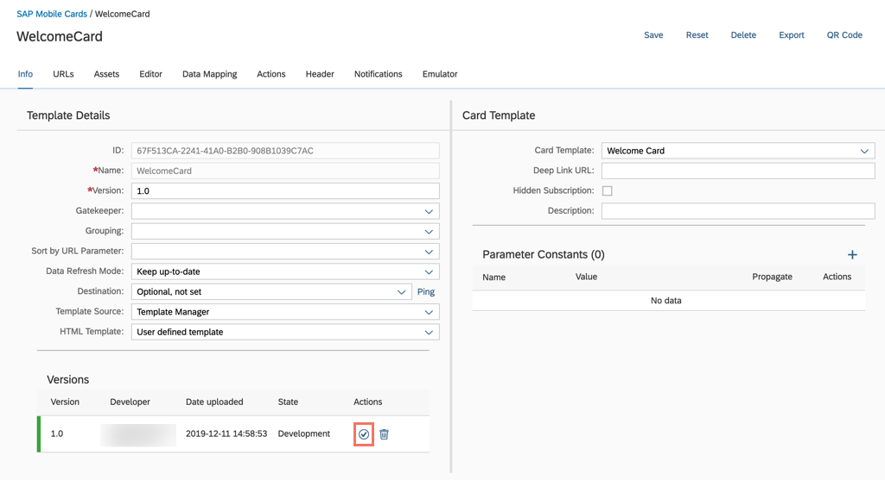

> If your Mobile Card Kit status is not **Available** please complete the [previous tutorial](https://developers.sap.com/tutorials/cp-mobile-cards-setup.html) in this mission.

In the *Select Cards* tab of the wizard, select the **Sample Template Welcome Card** and click **Next**.

!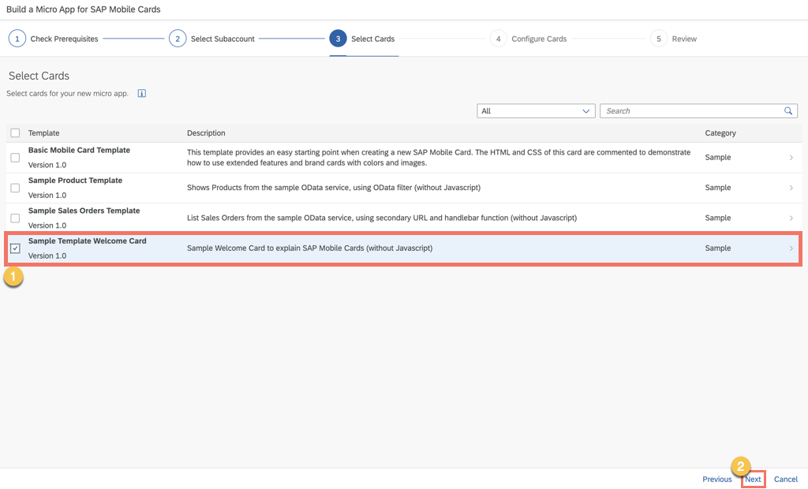

In the *Configure Cards* tab of the wizard, enter the name as following and click **Next**.

|Field|Value|
|----|---|
|Name| Booster Welcome Card |

!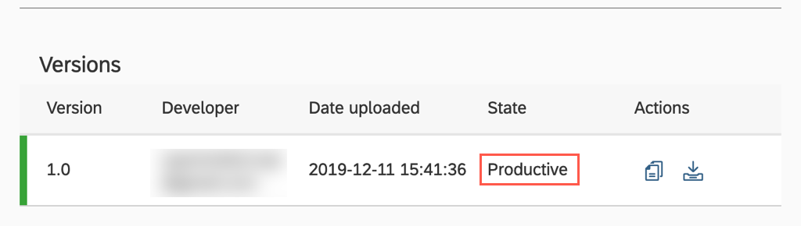

In the *Review* tab of the wizard, review the details you've entered and click **Finish**.

!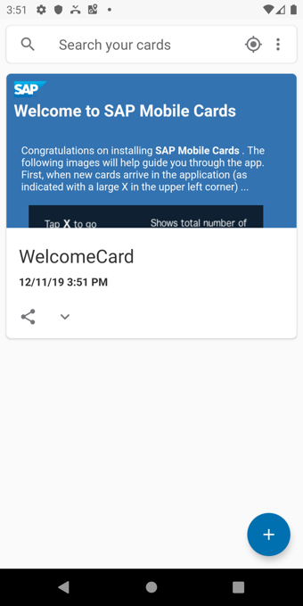

Upon successful creation you will see a success message; click **Close** and proceed to the next step.

!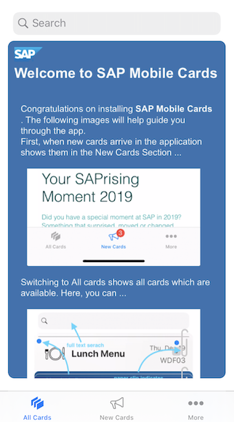

[DONE]
[ACCORDION-END]

[ACCORDION-BEGIN [Step 3: ](View the Created Card in Mobile Services Cockpit)]
Log into SAP Cloud Platform Mobile Services cockpit and navigate to **SAP Mobile Cards** to look into the Mobile Cards configuration.

!

In the SAP Cloud Platform Mobile Services Cockpit, you will now see the *Booster Welcome Card* we have created.

!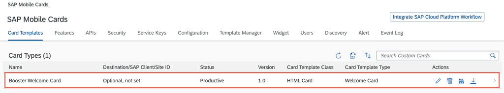

[VALIDATE_2]
[ACCORDION-END]

[ACCORDION-BEGIN [Step 4: ](View the Welcome Card in Mobile Cards Client)]

>Make sure you are choosing the right device platform tab ( **Android** or **iOS** ) **above**.

Welcome cards are auto subscribed by default and downloaded automatically after registration.

You should see the Welcome Card created using SAP Cloud Platform Booster for SAP Mobile Cards.

> To view the card immediately, perform a pull refresh.

[OPTION BEGIN [Android]]

!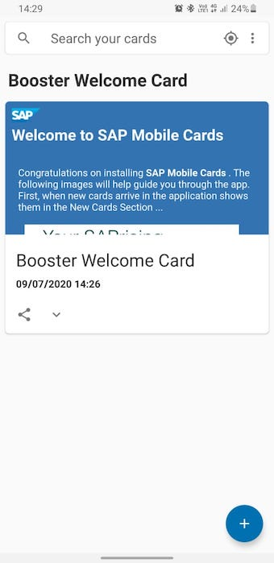

[OPTION END]

[OPTION BEGIN [iOS]]

!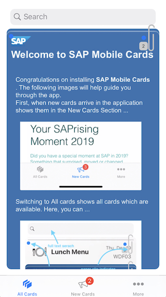

[OPTION END]

You can now view your first SAP Mobile card on the device.

**Congratulations!** You have learnt how to create an SAP Mobile Card using a Booster. In the [next tutorial](https://developers.sap.com/tutorials/cp-mobile-cards-automatic-instance-generation.html) you will learn how to create the card manually.

[DONE]
[ACCORDION-END]
