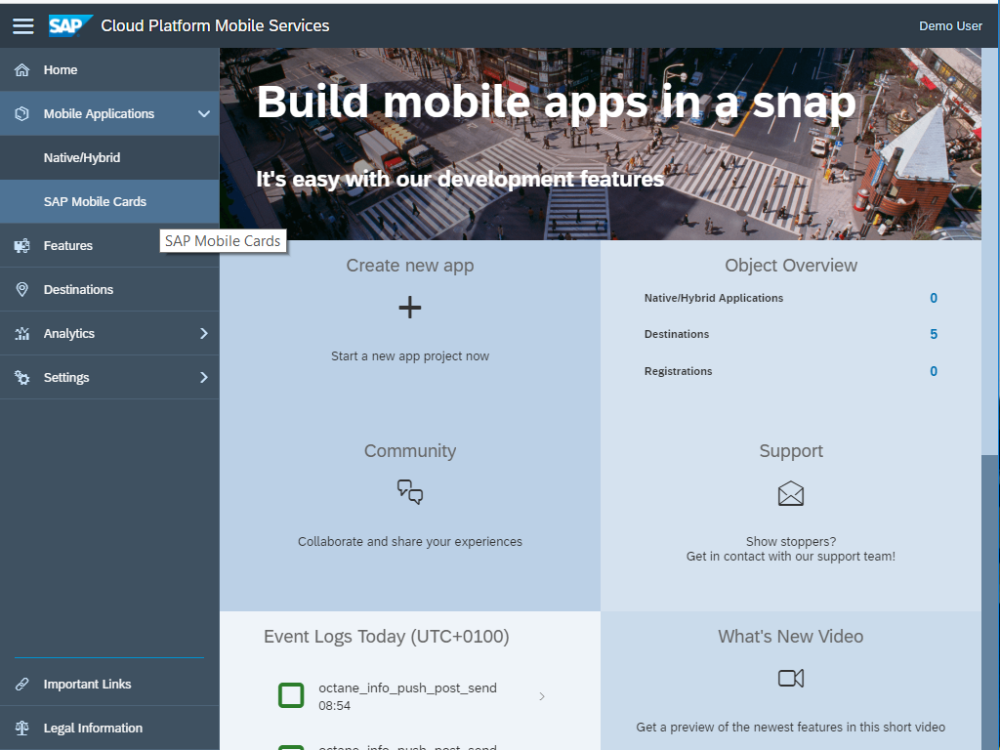
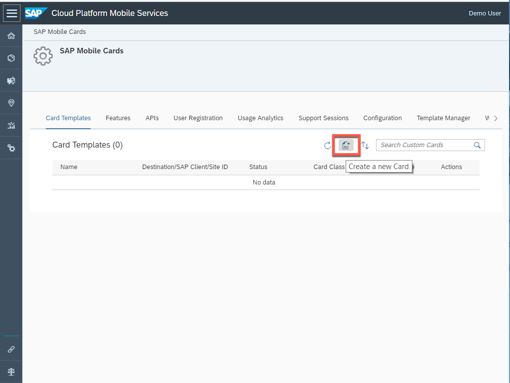
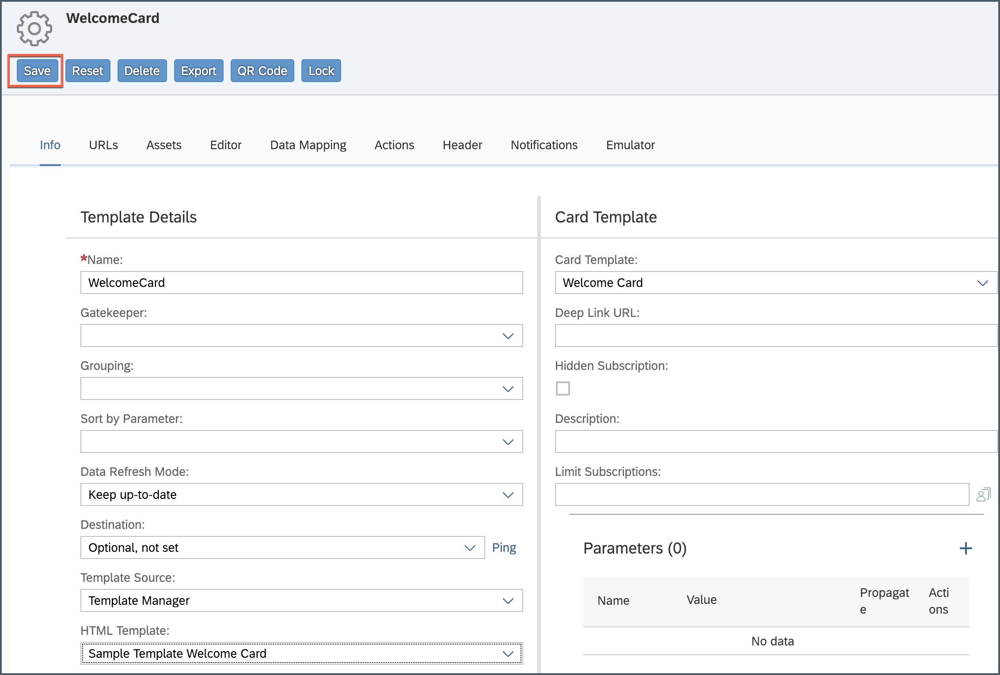
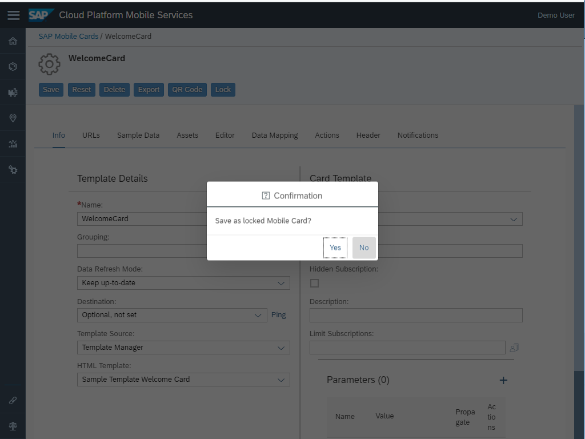
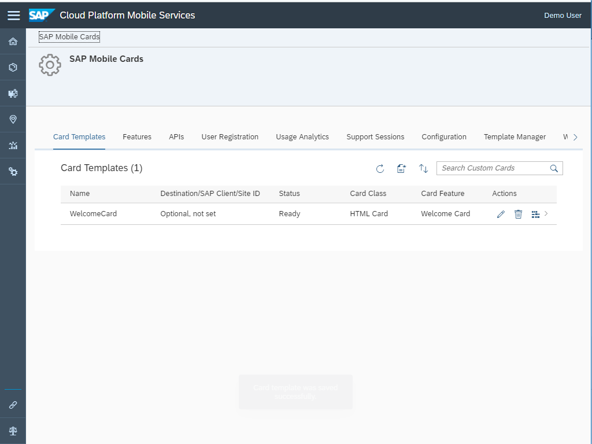
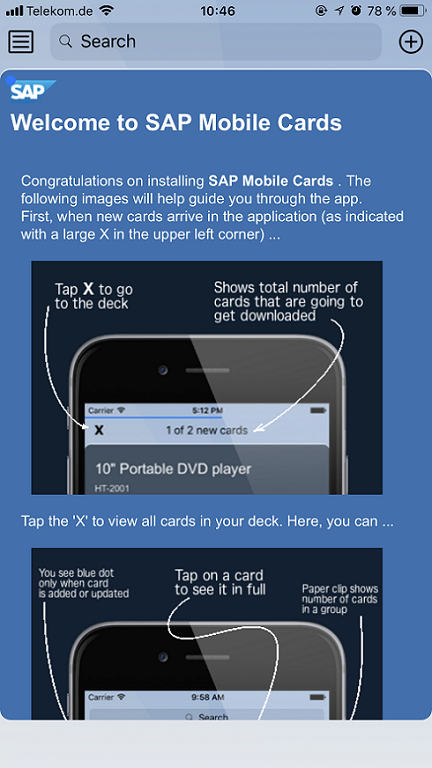

## Prerequisites

## Details
### You will learn
- How to create a Welcome card

---

[ACCORDION-BEGIN [Step 1: ](Create a Welcome card)]
Make sure you have logged into SAP Cloud Platform Mobile Services cockpit. In the cockpit, navigate to **SAP Mobile Cards** to look into the Mobile Cards configuration.

Click on the **Create a New Card** icon to create a new card.

Provide the required information as per below.

| Field | Value |
|----|----|
| **Name** | `WelcomeCard` |
| **Template Source** | `Template Manager` |
| **HTML Template** | `Sample Template Welcome Card` |

> If you see a pop-up, click **OK** for the confirmation.

Click **Save**.

You will see a pop-up asking whether you want to lock this mobile card or not.

**Yes** means that when you do any modifications to this card, you need to unlock it first. For this tutorial, click on **No**.

You will then see a list of existing mobile cards created in your account.

[VALIDATE_1]
[ACCORDION-END]

[ACCORDION-BEGIN [Step 2: ](View the Welcome Card in Mobile Cards client)]

Congratulations, you have your first SAP Mobile card on the device.

> Welcome cards are auto subscribed by default and downloaded automatically after registration.

[DONE]
[ACCORDION-END]
