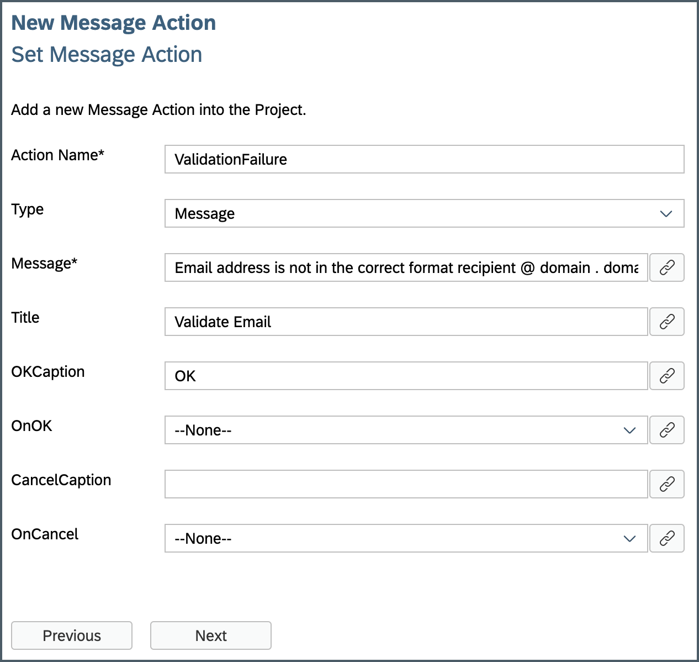
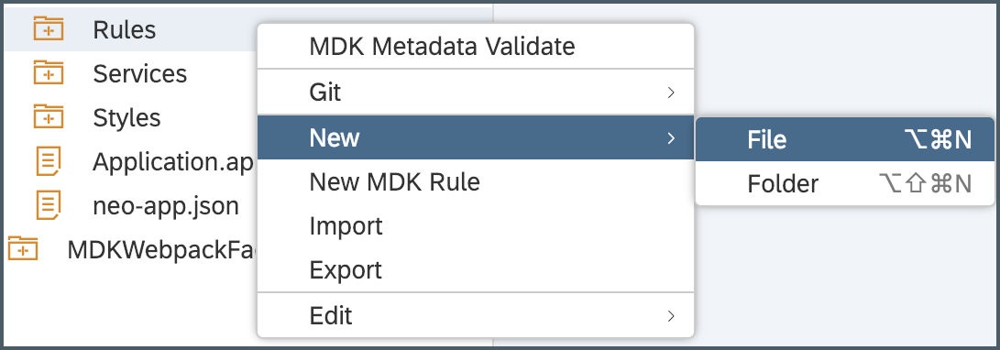
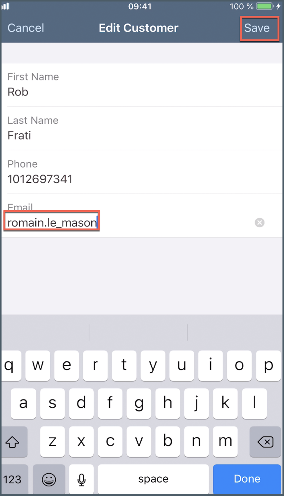
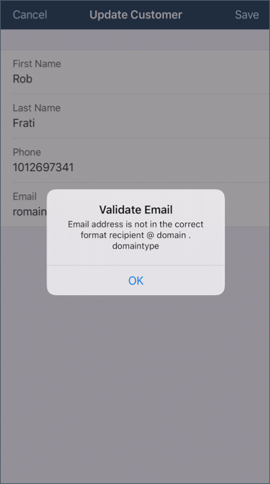

## Details
### You will learn
  - How to write a rule to validate an UI field

---

[ACCORDION-BEGIN [Step 1: ](Create a validation message)]

When allowing end-users to make updates to data, it is important to add validation rules to verify that they are entering valid information.

If the Update action fails due to the validation rule, the application will display a validation failure message to the end-user. You can customize this message by creating a Message action and adding the action to the validation Failure Message field in the Update action.

Right click on the **Actions** | **New MDK Action** | **Message Action** | **Next**.

Provide the below information:

| Field | Value |
|----|----|
| `Action Name`| `ValidationFailure` |
| `Type` | `Message` |
| `Message`| `Email address is not in the correct format recipient @ domain . domaintype` |
| `Title` |  `Validate Email` |
| `OK Caption`| `OK` |



Click **Next** and then **Finish** on the Confirmation step.

[DONE]
[ACCORDION-END]


[ACCORDION-BEGIN [Step 2: ](Create a new rule)]

In the MDK editor, you will create a new JavaScript file called `EmailValidation.js` to handle validation if a **@** symbol exists in the email address. In the validation rule, you will grab the data entered by the end-user, validate it and check for the **@** symbol then return true if the email address is of a valid format or false if it is not. The returning result of the validation rule can be used in the Update action to determine whether the action succeeds or fails.

>You can find more details about [writing a Rule](https://help.sap.com/viewer/977416d43cd74bdc958289038749100e/Latest/en-US/ef1e3404ff5f4ca68676acbda10e4bd0.html).

Right click on the **Rules** folder | **New** | **File**.



Enter the file name `EmailValidation.js`, click **OK**.

Copy and paste the following code.

```JavaScript
export default function EmailValidation(atSign) {

//The following evaluateTargetPath will retrieve the current value of the email control
if((atSign.evaluateTargetPath('#Control:FCEmail/#Value').indexOf('@') + 1) == 0) {

//If email value does not contain @ display a validation failure message to the end-user
  atSign.executeAction('/DemoSampleApp/Actions/ValidationFailure.action');
  } else {

//If @ is present in the email value, return true to indicate validation is successful
    return true;
  }
}
```

>The `indexOf()` method returns the index within the calling String object of the first occurrence of the specified value.

[DONE]
[ACCORDION-END]

[ACCORDION-BEGIN [Step 3: ](Add the validtion rule to the Update entity)]

Now that you have created the validation rule and the validation failure message, you will add both to the Update action. This will tell the Update action to run the validation rule before saving any data. If the validation rule is successful, the Update action will save the changes as expected. If the validation rule fails, the end-user receives the validation failure message telling them useful information so they can fix the problem before continuing.

Open `UpdateCustomer.action` by double clicking on the action in the project explorer pane.

Expand the **Common Action Properties** and select `EmailValidation.js` rule for **Validation Rule** and `ValidationFailure` action for **Validation Failure Action** fields.


[DONE]
[ACCORDION-END]

[ACCORDION-BEGIN [Step 4: ](Deploy, activate and test the application)]

Deploy the updated application to your MDK client.

Right click on the MDK Application in the project explorer pane and select **MDK Deploy and Activate**, click **Next** and deploy to Mobile Services.

>Make sure to select same App ID as you chose in previous tutorial.

Re-launch the app on your device, you may asked to authenticate with passcode or Touch ID. You will see a _Confirmation_ pop-up, click **OK**.

>By default, there is a standard 25-35 minutes time duration for App update. In case, you don't see _Confirmation_ pop-up, kill the MDK client app from the background and open it again.

Update a record with no contain of **@** in Email property throws a validation failure message.





[VALIDATE_1]
[ACCORDION-END]

---
