## Prerequisites
- **Tutorial:** [Set Up Initial Configuration for an MDK App](cp-mobile-dev-kit-ms-setup)
- **Tutorial:** [Enable SAP Web IDE Full-Stack](webide-multi-cloud)
- **Tutorial:** [Enable Mobile Services App Development Tools](cp-mobile-dev-tools-setup)
- **Download and install** **SAP Mobile Services Client** on your [iOS](https://itunes.apple.com/us/app/sap-mobile-services-client/id1413653544?mt=8) or [Android](https://play.google.com/store/apps/details?id=com.sap.mobileservices.client) device
- **Download and install** [Barcode Scanner](https://play.google.com/store/apps/details?id=com.google.zxing.client.android&hl=en) (required only for Android device)

## Details
### You will learn
  - How to retrieve OData annotations for Products in Mobile Services sample OData service
  - How to create a fully functional Mobile app

---

Mobile Development Kit brings OData annotations capabilities to your native mobile applications. MDK editor supports generating List-Detail pages based on annotations. List-Detail pages are similar to a Master-Detail page, but it is two pages instead of one. The MDK editor parses existing annotations to give you a huge leap forward in your native mobile application.

[ACCORDION-BEGIN [Step 1: ](Understand the SAP Fiori Elements)]

If you are a Fiori app designer, you may already be familiar with OData annotations and smart templates.  

SAP Fiori elements provide designs for UI patterns and predefined templates for common application use cases. App developers can use SAP Fiori elements to create SAP Fiori applications based on OData services and annotations. With little or no coding, you can create SAP Fiori applications. UI5 has a Web solution, named smart templates, that builds a starter application by parsing the annotations in your OData service.

You can also check out more information on the Fiori elements
[List Report](https://experience.sap.com/fiori-design-ios/article/list-report/) and [Smart templates](https://experience.sap.com/fiori-design-web/smart-templates/)

[DONE]
[ACCORDION-END]

[ACCORDION-BEGIN [Step 2: ](Create a new MDK project in SAP Web IDE)]

Ensure that you have already created a new destination `mobileservices_cf` as per [this](fiori-ios-hcpms-setup) tutorial. This is required to connect SAP Web IDE to Mobile Services in Cloud Foundry environment.

This step includes creating the Mobile Development Kit project in the Editor.

Launch the SAP Web IDE and select the **MDK perspective** by clicking on the icon in the left panel.

Right click on Workspace folder and select **New** | **MDK List-Detail Project**.

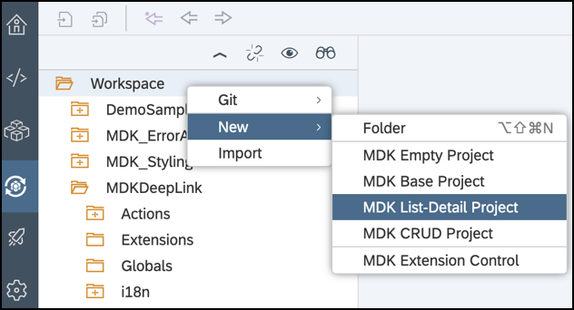

>More details on _MDK template_ is available in [help documentation](https://help.sap.com/viewer/977416d43cd74bdc958289038749100e/Latest/en-US/cfd84e66bde44d8da09f250f1b8ecee6.html).

Enter the Project Name as `MDK_Annotations` and click **Next**.

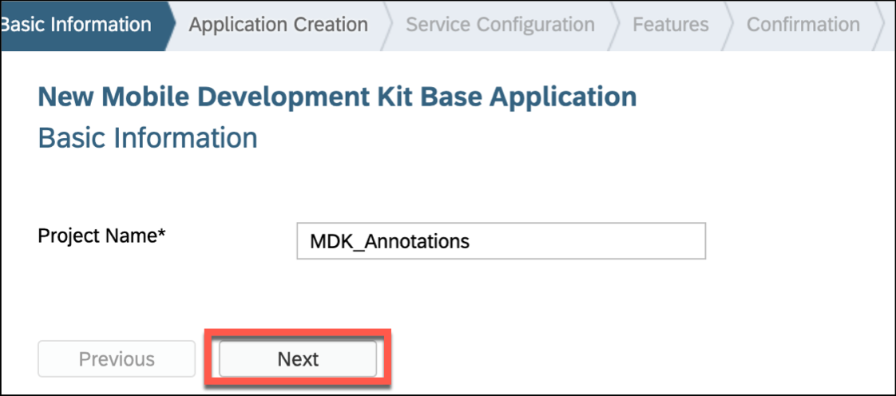

Leave the default values in _Application Creation_ step as it is, click **Next**.

In _Service Creation_ step, provide and select the below information:

| Field | Value |
|----|----|
| `Name`| `SampleServiceV2` |
| `Service URL` | `/destinations/mobileservices_cf` |
| `Application ID` | `com.sap.mdk.demo` |
| `Service URL` | `com.sap.edm.sampleservice.v2` |
| `Enable Offline Store` | `Should be unchecked` |

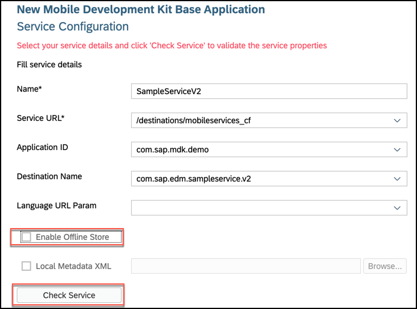

Regardless of whether you are creating an online or offline application, this step is needed app to connect to an OData service. When building an Mobile Development Kit application, it assumes the OData service created and the destination that points to this service is setup in Mobile Services and SAP Cloud Platform.

Since you will create an online based app, hence _Enable Offline Store_ option is unchecked.

Click **Check Service** to validate the service properties. If all the details are fine, you will see a success message. Click **Next**.

>More details on _Sample Back End_ is available in [help documentation](https://help.sap.com/viewer/468990a67780424a9e66eb096d4345bb/Cloud/en-US/1c2e51a24361487f8b0649702d59dd0f.html).

In **Metadata Source** step, select **Customers** Entity Type and click **Next**.

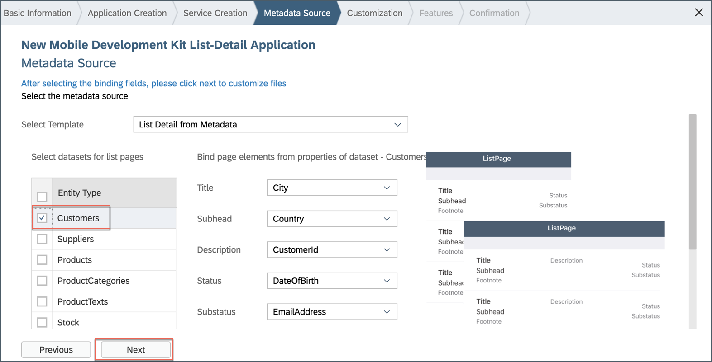

In **Customization** step, select **Customer** Entity Type.

Click **Next** and let's stick to the defaults.

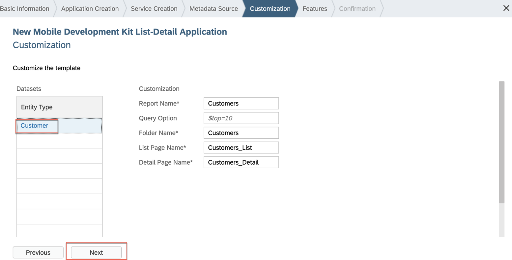

In **Features** step, click **Finish**.

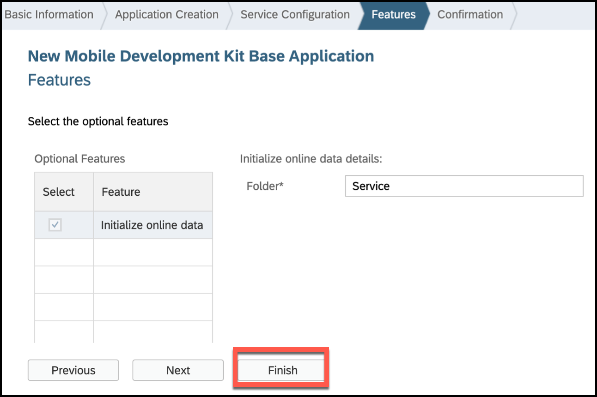

After clicking Finish, the wizard will generate your MDK Application based on your selections. You should now see the `MDK_Annotations` project in the project explorer.

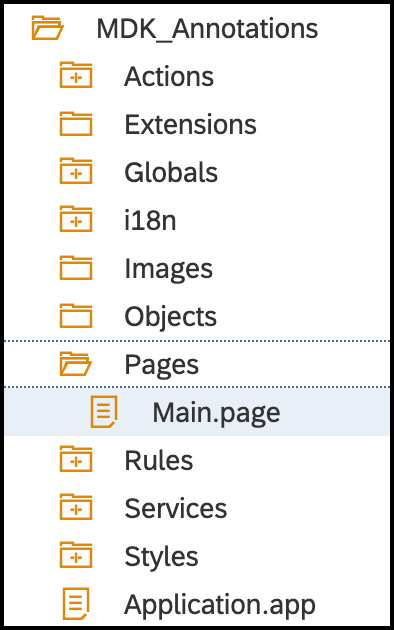

[DONE]
[ACCORDION-END]

[ACCORDION-BEGIN [Step 3: ](Deploy and activate the application)]

So far, you have learned how to build an MDK application in the SAP Web IDE editor. Now, we deploy this application definition to Mobile Services.

Right click on the `MDK_Annotations` MDK Application in the project explorer pane and select **MDK Deploy and Activate**.

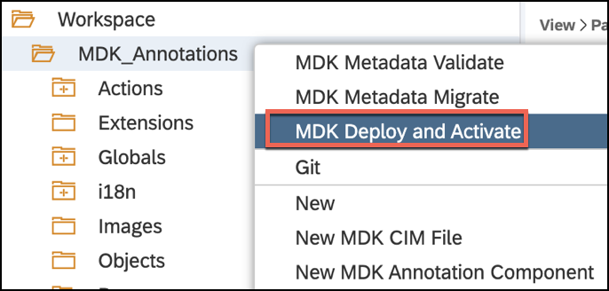

Let the default configuration as it is and click **Next**.

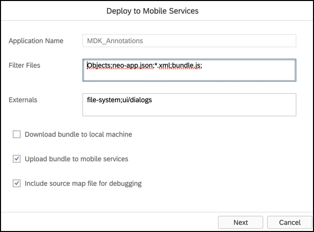

>_Filter Files_ will be filtered and ignored in web packing process.

>_Externals_ is the list of NPM modules that are part of the MDK Client application and should not be validated in the bundle.

>By default, automatically deploy option is selected, In other words, the application is automatically deployed from Mobile Services to your MDK client.

Click the drop down for Destination Name and select the `mobileservices_cf` destination , you will find list of existing application IDs , select the one you have chosen while creating the project in step 2.

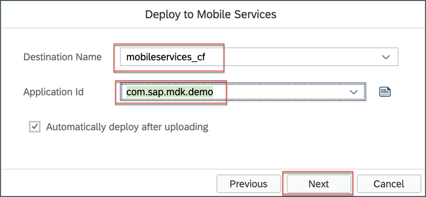

Click **Next** to finish the deployment from SAP Web IDE.

You should see **Application deployed successfully** message in console log.

[DONE]
[ACCORDION-END]

[ACCORDION-BEGIN [Step 4: ](Populate the QR code for app on-boarding)]

SAP Web IDE has a feature to generate QR code for app on-boarding.

Right click on the `MDK_Annotations` MDK Application in the project explorer pane and select **MDK Deploy and Activate**.

Let the default configuration as it is and click **Next**.

Click on QR code icon to populate QR code for app on-boarding.

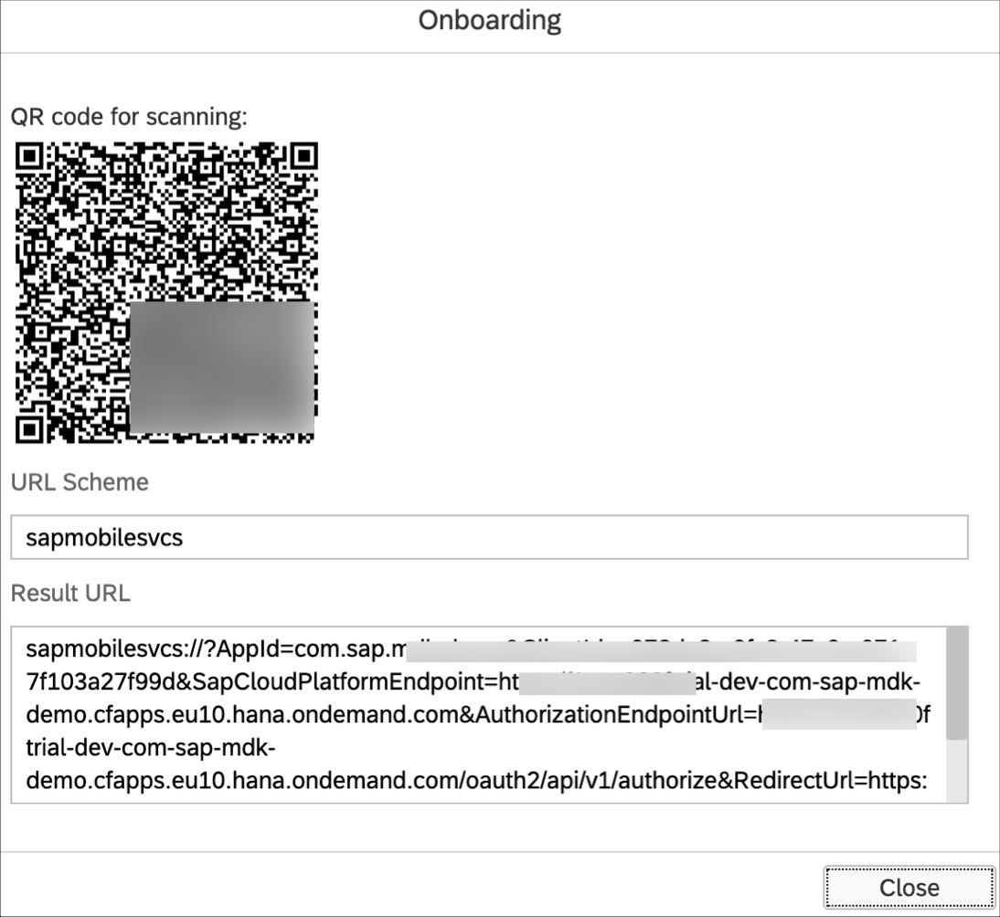

[DONE]
[ACCORDION-END]

[ACCORDION-BEGIN [Step 5: ](Run the app in MDK client)]

>Make sure you are choosing the right device platform tab above.

[OPTION BEGIN [Android]]

On Android, camera app does not support scanning the QR code. You can use [Barcode Scanner](hhttps://play.google.com/store/apps/details?id=com.google.zxing.client.android&hl=en) app to scan it.

Open the Barcode scanner app and start scanning the QR code showing in SAP Web IDE.

Tap **Open browser**. It will open SAP Mobile Services Client app.

Tap **GET STARTED** to connect MDK client to SAP Cloud Platform.

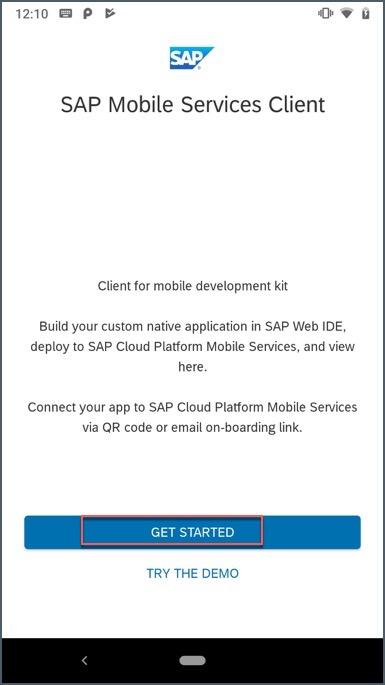

Enter Email address and password to login to SAP Cloud Platform and tap **Log On** to authenticate.

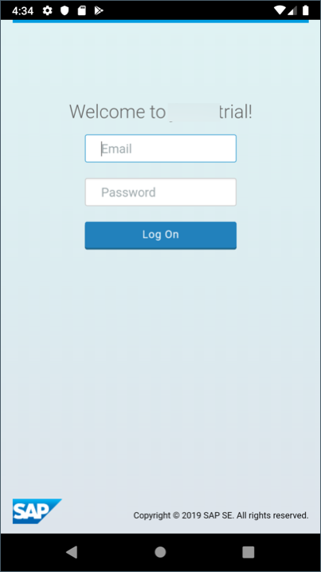

Tap **AGREE** on `End User License Agreement`.

Choose a passcode with at least 8 characters for unlocking the app and tap **NEXT**.

Confirm the passcode and tap **DONE**.

Optionally, you can enable fingerprint to get faster access to the app data.

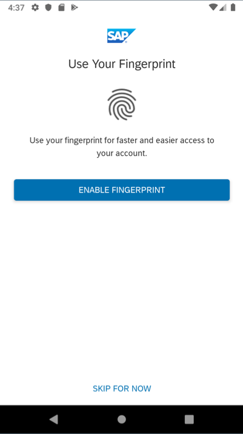

Tap **OK**.

The MDK client receives deployed metadata definitions as a bundle.

Now, you will see the **Main** page (with **Logout** and **Sync** options at bottom of the page) being displayed and Offline store is being initialized.

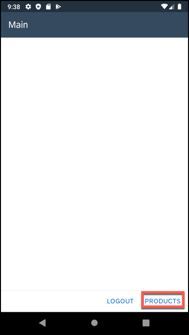

You will navigate to see Customer List. Tap on a record.

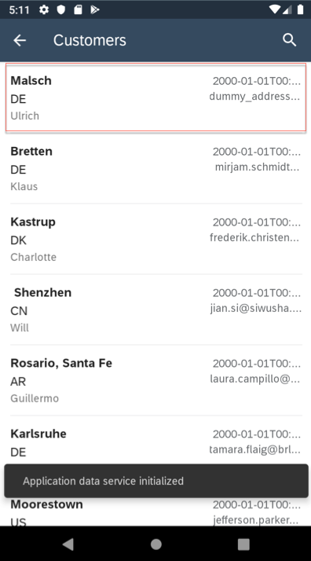

You will see related details.

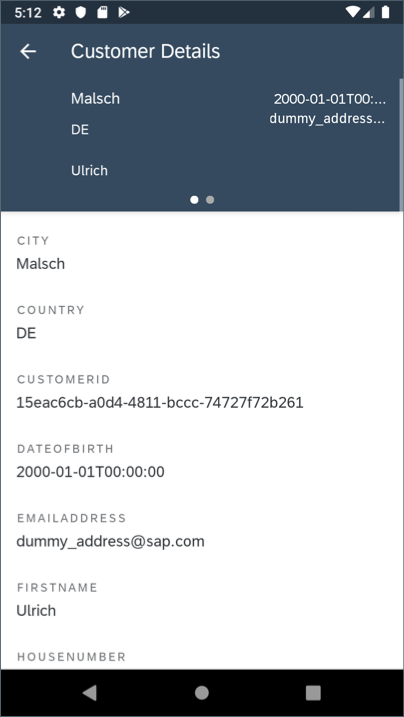

[OPTION END]

[OPTION BEGIN [iOS]]

On iPhone, open your camera app and start scanning the QR code, as shown below.

Tap the toast message to launch **SAP Mobile Services Client**. It will open SAP Mobile Services Client app.

Tap **Start** to connect MDK client to SAP Cloud Platform.

Enter Email address and password to login to SAP Cloud Platform and tap **Log On** to authenticate.

Tap **Agree** on `End User License Agreement`.

Choose a passcode with at least 8 characters for unlocking the app and tap **Next**.

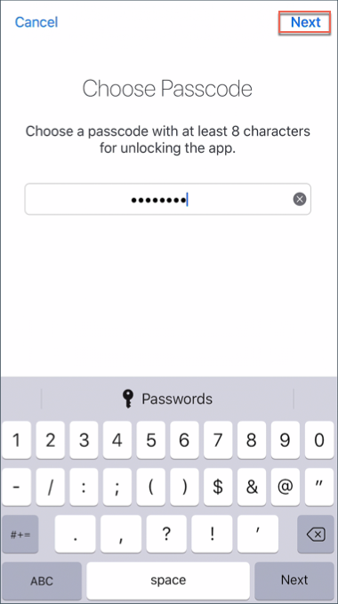

Confirm the passcode and tap **Done**.

Optionally, you can enable Touch ID to get faster access to the app data, click **Enable**.

Tap **OK**.

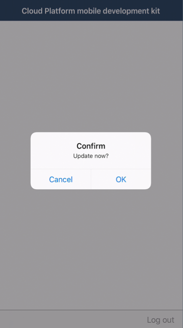

The MDK client receives deployed metadata definitions as a bundle.

Now, you will see the **Main** page (with **Logout** and **Sync** options at bottom of the page) and a **Customers** button to navigate to List-Detail pages. Click **Customers** to view available records.

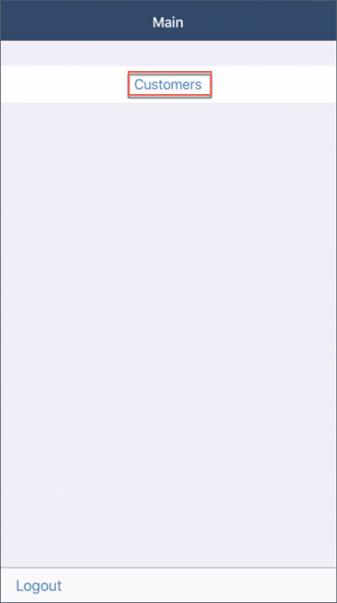

You will navigate to see Customer List. Tap on a record.

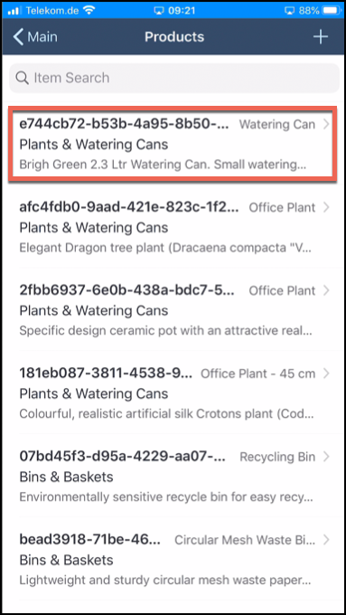

You will see related details.

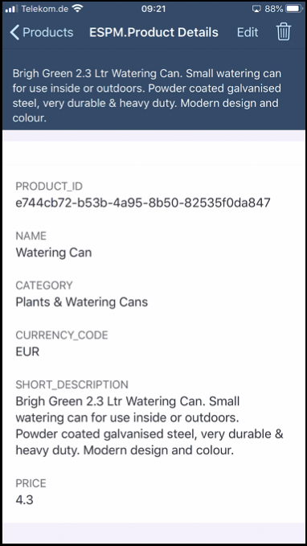

[OPTION END]

[DONE]
[ACCORDION-END]

[ACCORDION-BEGIN [Step 6: ](Add annotation information in the backend destination)]

Sample backend in SAP Cloud Platform Mobile Services provides annotation functionality for **Products**. If you add annotation path in given backend endpoint, the same annotation information can be Leveraged by MDK editor to generate related CRUD pages.

Make sure you have already configured an app in Mobile Services cockpit and have added Sample service as per [this](cp-mobile-dev-tools-setup) tutorial.

In SAP MDK Demo App configuration, click **Mobile Connectivity**.

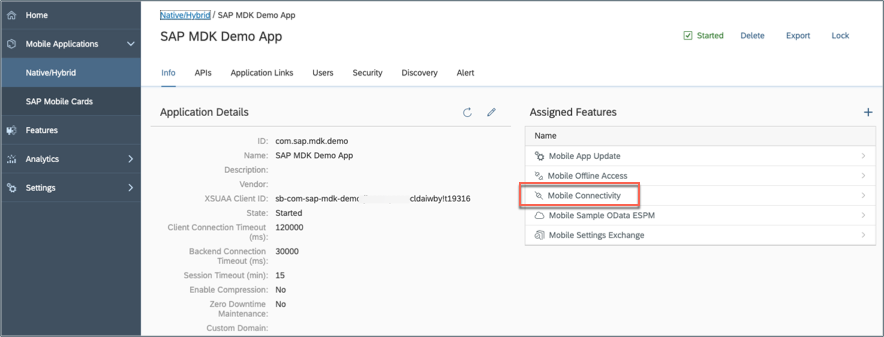

Click on **pencil icon** to add OData Annotations details.

In Edit Destination screen, click **Next**.

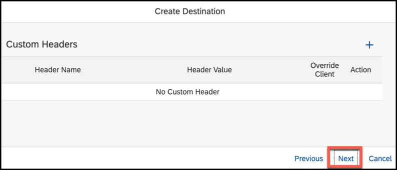

For this tutorial, there is no Custom Headers required, click **Next**.

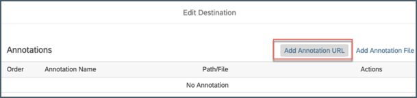

Click **Add Annotation URL** to add OData Annotations to the Sample service.

Provide the below information and click Next:

| Field | Value |
|----|----|
| `Annotation Name`| `Product` |
| `Path/File` | `/annotations/Products` |

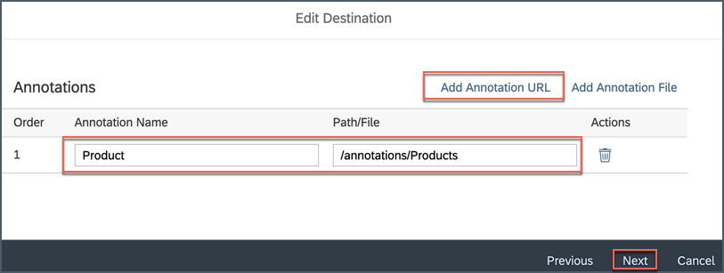

In following screens, let the default settings as it is. Click **Next** and **Finish**.

You should see a Toast Message **Destination Updated** at bottom of the page.

Click on `com.sap.edm.sampleservice.v2` to look into changes we just did.

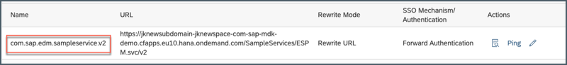

Here you can see that OData Annotation information is available in given sample service.

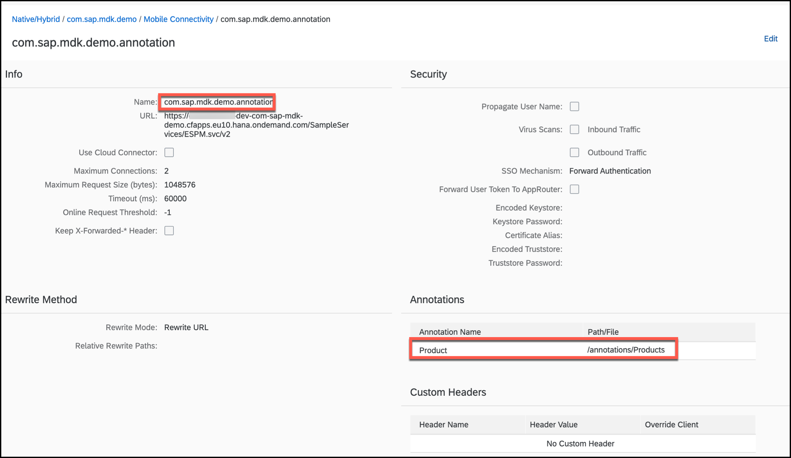

[DONE]
[ACCORDION-END]

[ACCORDION-BEGIN [Step 7: ](Add MDK Annotation component to MDK project)]

In previous step, you have updated sample backend with Annotations details, now, to reflect this change in SAP Web IDE, you will refresh backend Metadata so that MDK editor can pick up these changes.

Expand `MDK_Annotations` MDK project and double click `SampleServiceV2.service`. Click **Refresh Objects**.

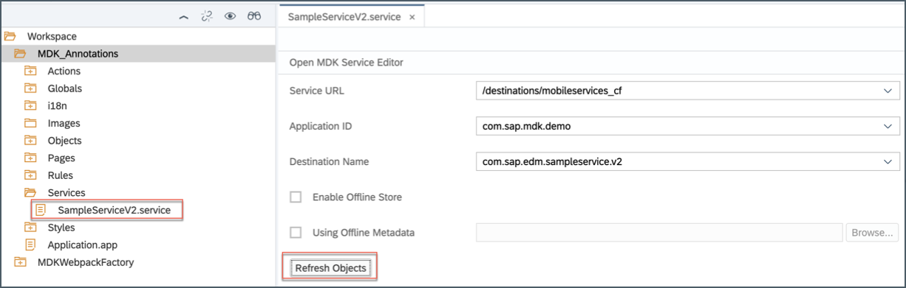

Click **OK**.

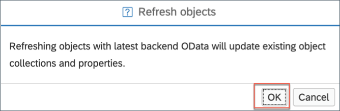

On completion, you will see successful message.

Right-click on the `MDK_Annotations` MDK Application in the project explorer pane and click **New MDK Annotation Component**.

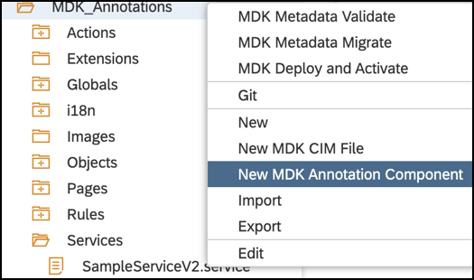

MDK editor fetches annotation details, select **Product** Annotation and click **Next**.

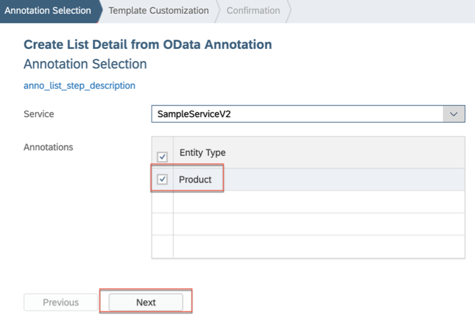

In **Template Customization** step, click **Next**.

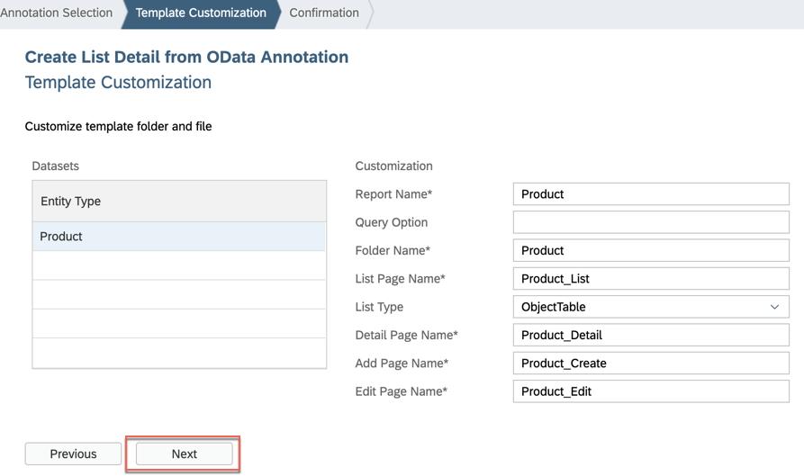

Click **Finish** to create list detail from OData Annotation.

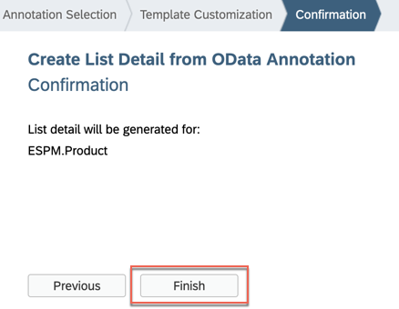

In MDK project, you will see new pages for Product.

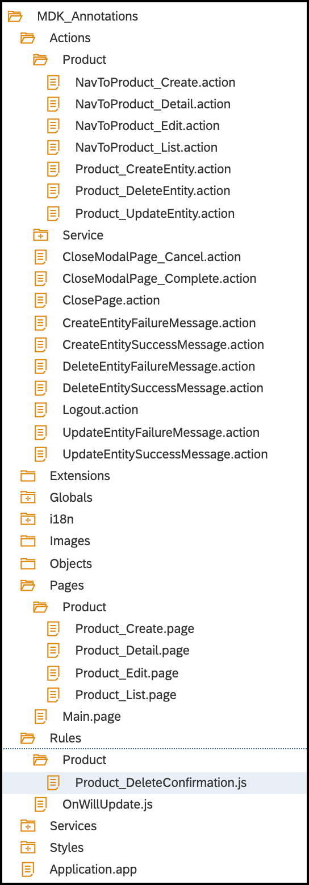

Next, you will add a button on `Main.page` to navigate to `Product_List.page`.

In `Main.page`, drag and drop **Section Button** item control on the page area (right below `Customers`).

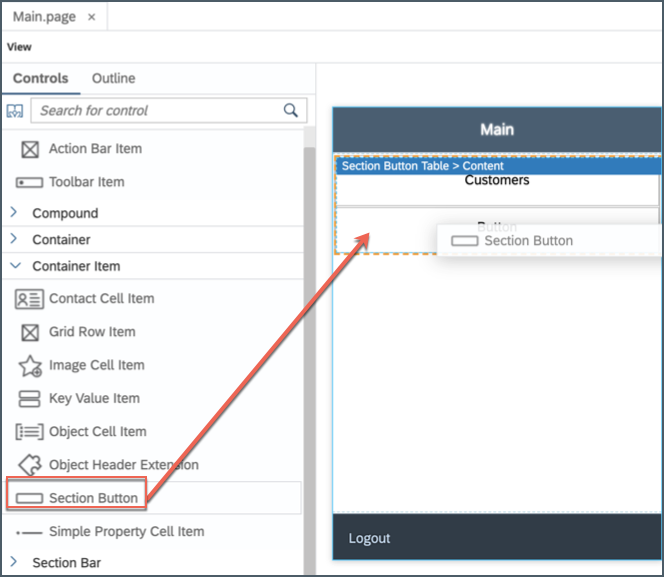

Change its title to **Products**.

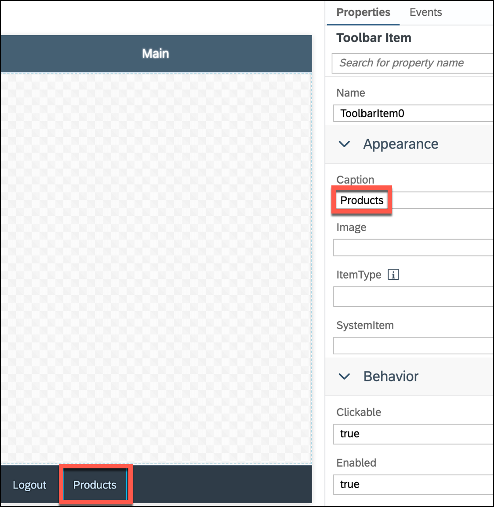

Now, you will set `onPress` to `NavToProduct_List.action`.

In **Events** tab, click the **link icon** for the `OnPress` property to open the object browser.

Double click on the `NavToProduct_List.action` and click **OK** to set it as the `OnPress` action.

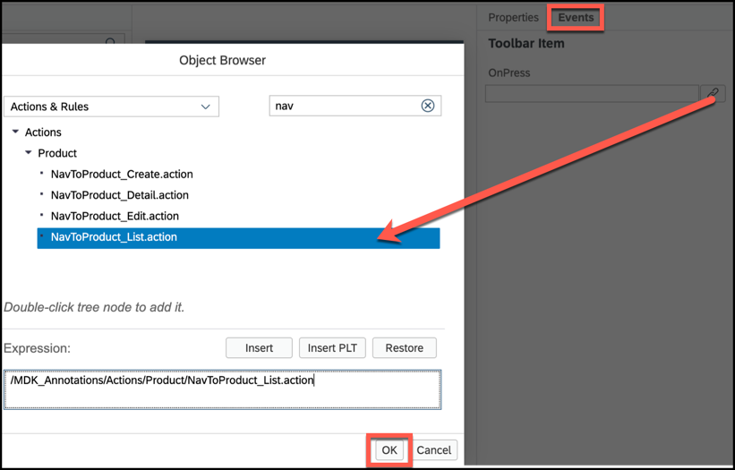

Pages, actions and rules created are a starting point. You can edit those pages and make it your own.  At this point the MDK editor is no longer reading the annotations from OData.

For the List page, MDK supports the List Report. To create a Detail page, MDK requires `UI.LineItem` and `UI.HeaderInfo` in the annotation file.

>If the OData designer updates the backend services data schema (annotations), the MDK pages will stay as originally created. It will not automatically update the pages or overwrite your changes. You are *disconnected* from the annotations at this point.

[VALIDATE_1]
[ACCORDION-END]

[ACCORDION-BEGIN [Step 8: ](Redeploy, re-activate and retest the application)]

>Make sure you are choosing the right device platform tab above.

Right click on the `MDK_Annotations` MDK Application in the project explorer pane and select **MDK Deploy and Activate**. Since we have deployed already both the destination and app id should be pre-selected based on the last time we deployed our application.  Confirm the Destination Name is `mobileservices_cf` and the Application Id is `com.sap.mdk.demo` and click Next.

Let the default configuration as it is and tap **Next**.

Tap **Next** to deploy to Mobile Services.

[OPTION BEGIN [Android]]

Once you see **Application deployed successfully** message in console then re-launch the app on your device, you may asked to authenticate with passcode or Fingerprint. You will see a confirmation pop-up, click **OK**. If your client was still running and you do not see the Confirm dialog return to the home screen and re-enter the MDK client.

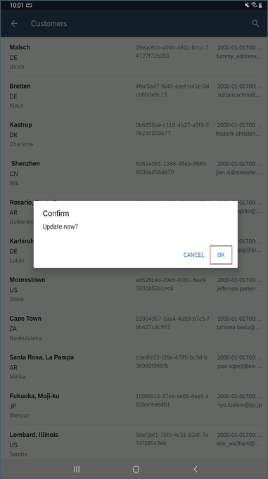

Tap **PRODUCTS**, you will navigate to Product List page.

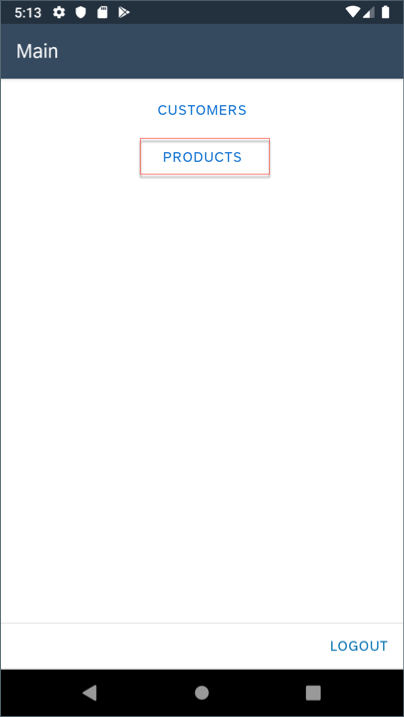

In following pages, you can create a new record, modify an existing record and even delete the record.

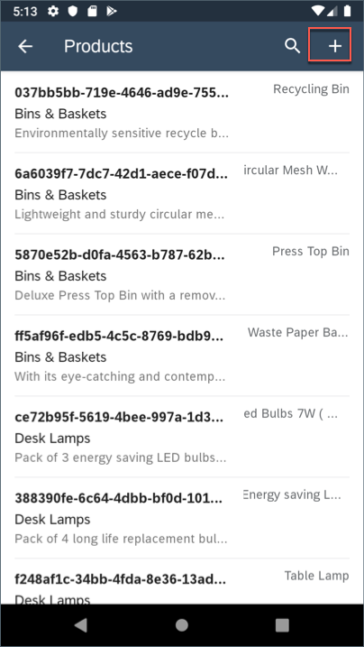
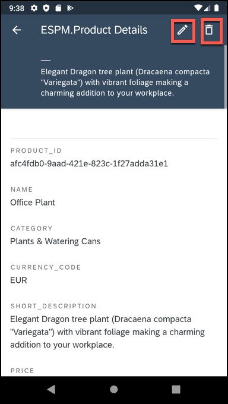

[OPTION END]

[OPTION BEGIN [iOS]]

Once you see **Application deployed successfully** message in console then re-launch the app on your device, you may asked to authenticate with passcode or Touch ID. You will see a confirmation pop-up, click **OK**.
If your client was still running and you do not see the Confirm dialog return to the home screen and re-enter the MDK client.

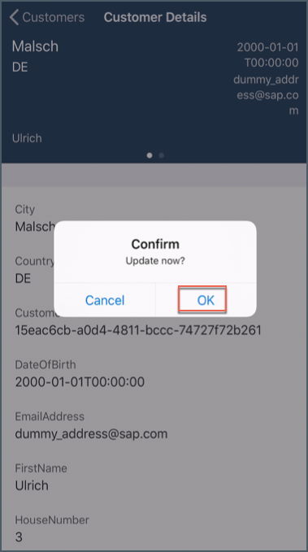

Tap **Products**, you will navigate to Product List page.

In following pages, you can create a new record, modify an existing record and even delete the record.

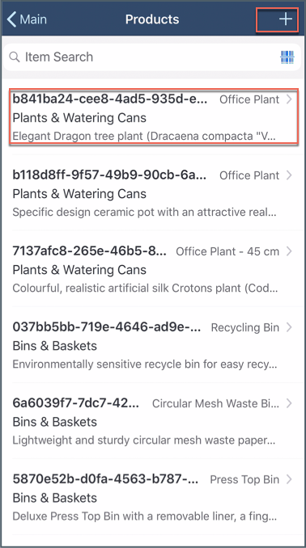
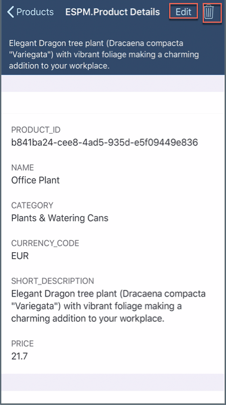

[OPTION END]

[DONE]
[ACCORDION-END]

---
