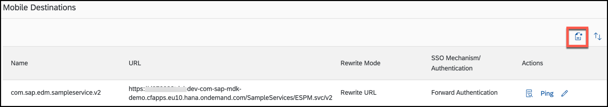
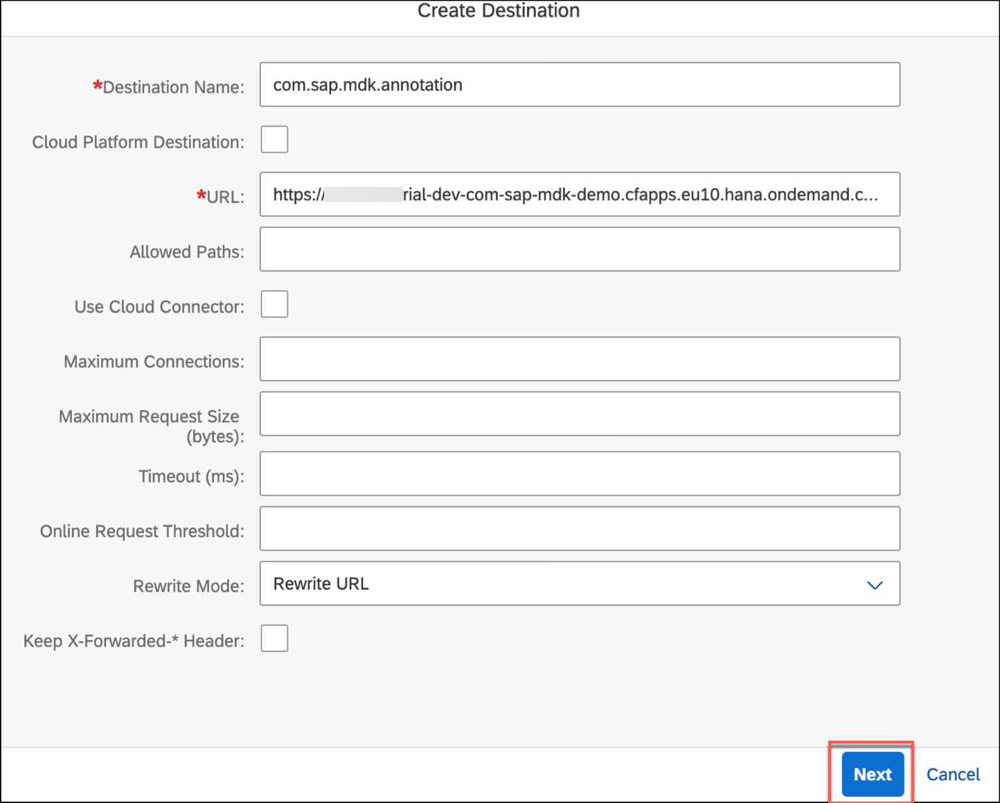
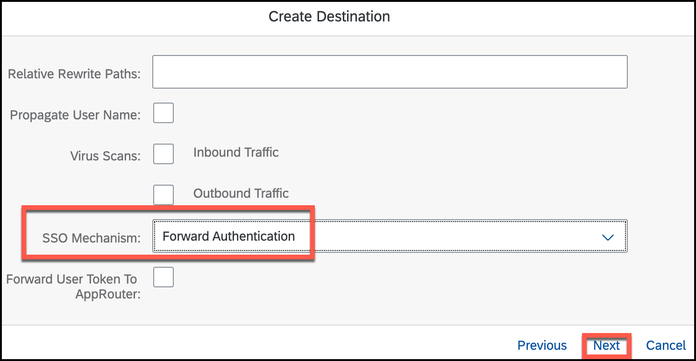
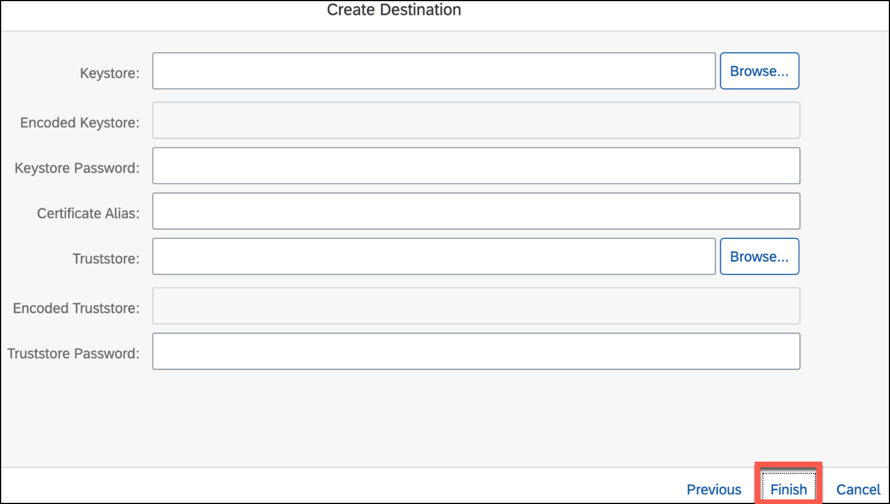
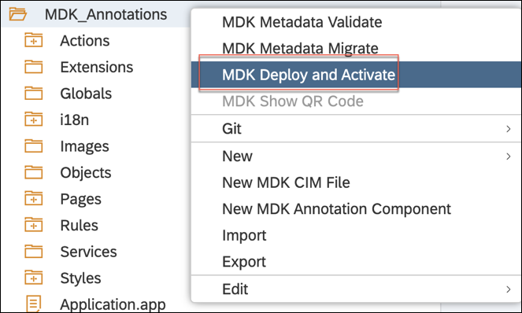

## Prerequisites
- **Tutorial group:** [Set Up for the Mobile Development Kit (MDK)](group.mobile-dev-kit-setup)
- **Download and install:** **SAP Mobile Services Client** on your [iOS](https://apps.apple.com/us/app/sap-mobile-services-client/id1413653544) or [Android](https://play.google.com/store/apps/details?id=com.sap.mobileservices.client) device
- **Download and install** [Barcode Scanner](https://play.google.com/store/apps/details?id=com.google.zxing.client.android&hl=en) (required only for Android device)

## Details
### You will learn
  - How to retrieve OData annotations for Products in Mobile Services sample OData service
  - How to create a fully functional Mobile app

You may clone an existing project from [GitHub repository](https://github.com/SAP-samples/cloud-mdk-tutorial-samples/tree/master/4-Level-Up-with-the-Mobile-Development-Kit/5-Use-OData-Annotations-to-Add-CRUD-Functionality-to-an-MDK-App) and start directly with step 5 in this tutorial but make sure you complete step 2.

---

Mobile Development Kit brings OData annotations capabilities to your native mobile applications. MDK editor supports generating List-Detail pages based on annotations. List-Detail pages are similar to a Master-Detail page, but it is two pages instead of one. The MDK editor parses existing annotations to give you a huge leap forward in your native mobile application.

[ACCORDION-BEGIN [Step 1: ](Understand the SAP Fiori Elements)]

If you are a Fiori app designer, you may already be familiar with OData annotations and smart templates.

SAP Fiori elements provide designs for UI patterns and predefined templates for common application use cases. App developers can use SAP Fiori elements to create SAP Fiori applications based on OData services and annotations. With little or no coding, you can create SAP Fiori applications. UI5 has a Web solution, named smart templates, that builds a starter application by parsing the annotations in your OData service.

You can also check out more information on the Fiori elements [List Report](https://experience.sap.com/fiori-design-ios/article/list-report/) and [Smart templates](https://experience.sap.com/fiori-design-web/smart-templates/)

[DONE]
[ACCORDION-END]

[ACCORDION-BEGIN [Step 2: ](Add annotation information in the backend destination)]

Sample backend in SAP Cloud Platform Mobile Services provides annotation functionality for **Products**. If you add annotation path in given backend endpoint, the same annotation information can be Leveraged by MDK editor to generate related CRUD pages.

Make sure you have already configured an app in Mobile Services cockpit and have added Sample service as per [this](https://developers.sap.com/tutorials/cp-mobile-dev-kit-ms-setup.html#44007b61-2d8b-4cca-a53a-7f13c24396f7) tutorial.

As admin changes to the default sample service destinations (`com.sap.edm.sampleservice.v2` and `com.sap.edm.sampleservice.v4`) are not allowed, you need to copy the destination URL from the sample service destination `com.sap.edm.sampleservice.v2` and create a new destination with the new name e.g., `com.sap.mdk.annotation` and add the required annotations.

1. In SAP MDK Demo App configuration, click **Mobile Connectivity**.

    

2. Copy the destination URL from the sample service destination `com.sap.edm.sampleservice.v2`.

    

3. Click create icon to create a new destination.

    

4. Enter a new destination name `com.sap.mdk.annotation` and paste the URL. Click **Next**.

    

5. For this tutorial, there is no Custom Headers required, click **Next**.

    

6. Click **Add Annotation URL** to add OData Annotations to the Sample service.

    

7. Provide the below information and click **Next**:

    | Field | Value |
    |----|----|
    | `Annotation Name`| `Product` |
    | `Path/File` | `/annotations/Products` |

    

8. In **Create Destination** screen, select **SSO Mechanism** as Forward Authentication and click **Next**.

    

9. In the following screen, let the default settings as it is. Click **Finish**.

    

    You should see a Toast Message **Destination Created** at bottom of the page.

    Here you can see that OData Annotation information is available in the new destination.

    

[DONE]
[ACCORDION-END]

[ACCORDION-BEGIN [Step 3: ](Create a new MDK project in SAP Web IDE)]

Ensure that you have already created a new destination `mobileservices_cf` as per [this](fiori-ios-hcpms-setup) tutorial. This is required to connect SAP Web IDE to Mobile Services in Cloud Foundry environment.

This step includes creating the Mobile Development Kit project in the Editor.

1. Launch the SAP Web IDE and select the **MDK perspective** by clicking on the icon in the left panel.

2. Right-click Workspace folder and select **New** | **MDK Base Project**.

    

    >More details on _MDK template_ is available in [help documentation](https://help.sap.com/doc/f53c64b93e5140918d676b927a3cd65b/Cloud/en-US/docs-en/guides/getting-started/mdk/webide.html#creating-a-new-project).

3. Enter the Project Name as `MDK_Annotations` and click **Next**.

    

4. Leave the default values in _Application Creation_ step as it is, click **Next**.

5. In _Service Creation_ step, provide and select the below information:

    | Field | Value |
    |----|----|
    | `Name`| `SampleServiceV2` |
    | `Service URL` | `/destinations/mobileservices_cf` |
    | `Application ID` | `com.sap.mdk.demo` |
    | `Destination Name` | `com.sap.mdk.annotation` |
    | `Enable Offline Store` | `Uncheck it` |

    

    > If you do not find `mobileservices_cf` destination, please ensure that you have followed [this tutorial](fiori-ios-hcpms-setup) to setup this destination in SAP Cloud Platform cockpit.

    >If a pop-up appears then enter your cloud platform User Name and password to authenticate.

    >For Offline OData capability only OData V2 is supported. OData V2 and V4 are supported for Online OData.

    Regardless of whether you are creating an online or offline application, this step is needed app to connect to an OData service. When building an Mobile Development Kit application, it assumes the OData service created and the destination that points to this service is setup in Mobile Services and SAP Cloud Platform.

    Since you will create an online based app, hence _Enable Offline Store_ option is unchecked.

6. Click **Check Service** to validate the service properties. If all the details are fine, you will see a success message. Click **Next**.

    

    >More details on _Sample Back End_ is available in [help documentation](https://help.sap.com/doc/f53c64b93e5140918d676b927a3cd65b/Cloud/en-US/docs-en/guides/features/backend-connectivity/sample.html).

7. In **Features** step, click **Finish**.

    

    After clicking Finish, the wizard will generate your MDK Application based on your selections. You should now see the `MDK_Annotations` project in the project explorer.

    

[DONE]
[ACCORDION-END]

[ACCORDION-BEGIN [Step 4: ](Add MDK Annotation component to MDK project)]

1. Right-click the `MDK_Annotations` MDK Application in the project explorer pane and click **New MDK Annotation Component**.

    

2. MDK editor fetches annotation details, select **Product** Annotation and click **Next**.

    

3. In **Template Customization** step, click **Next**.

    

4. Click **Finish** to create list detail from OData Annotation.

    

    In MDK project, you will see new pages, actions, rules have been generated for **Product**.

    

5. Next, you will add a Toolbar item on `Main.page` to navigate to `Product_List.page`.

    In `Main.page`, drag and drop **Toolbar Item** control on the page.

    

6. Change its **Caption** to **Products**.

    

7. Now, you will set the `onPress` event to `NavToProduct_List.action`.

    In **Events** tab, click the **link icon** for the `OnPress` property to open the object browser.

    Double click the `NavToProduct_List.action` and click **OK** to set it as the `OnPress` action.

    

    Pages, actions and rules created are a starting point. You can edit those pages and make it your own.  At this point the MDK editor is no longer reading the annotations from OData.

    For the List page, MDK supports the List Report. To create a Detail page, MDK requires `UI.LineItem` and `UI.HeaderInfo` in the annotation file.

    >If the OData designer updates the backend services data schema (annotations), the MDK pages will stay as originally created. It will not automatically update the pages or overwrite your changes. You are *disconnected* from the annotations at this point.

[VALIDATE_1]
[ACCORDION-END]

[ACCORDION-BEGIN [Step 5: ](Deploy and activate the application)]

So far, you have learned how to build an MDK application in the SAP Web IDE editor. Now, we deploy this application definition to Mobile Services.

1. Right click the `MDK_Annotations` MDK Application in the project explorer pane and select **MDK Deploy and Activate**.

    

2. Let the default configuration as it is and click **Next**.

    

    >_Filter Files_ will be filtered and ignored in web packing process.

    >_Externals_ is the list of NPM modules that are part of the MDK Client application and should not be validated in the bundle.

3. Confirm the destination name and application id match where you want to deploy.

    

    >By default, automatically deploy option is selected, In other words, the application is automatically deployed from Mobile Services to your MDK client.

4. Click **Next** to finish the deployment from SAP Web IDE.

    You should see **Application deployed successfully** message in console log.

[DONE]
[ACCORDION-END]

[ACCORDION-BEGIN [Step 6: ](Populate the QR code for app onboarding)]

SAP Web IDE has a feature to generate QR code for app onboarding.

Right click the `MDK_Annotations` MDK Application in the project explorer pane and select **MDK Show QR Code**.

>**MDK Show QR Code** option is greyed out if MDK project is not yet deployed and activated as per step 5.

[DONE]
[ACCORDION-END]

[ACCORDION-BEGIN [Step 7: ](Run the app in MDK client)]

>Make sure you are choosing the right device platform tab above. Once you have scanned and onboarded using the onboarding URL, it will be remembered. When you Log out and onboard again, same onboarding URL settings will be reused without the need to scan. You will need to use 3rd party QR scanner app in Android or device Camera in iOS, if you would like to scan a different onboarding URL.

[OPTION BEGIN [Android]]

1. Launch **`Mobile Svcs`** app on your Android device. Tap **GET STARTED** to connect MDK client to SAP Cloud Platform.

    

2. Tap **QR CODE SCAN** to start the device camera for scanning the onboarding QR code.

    

3. Once scan is succeeded, tap **CONTINUE**.

    

4. Enter Email address and password to login to SAP Cloud Platform and tap **Log On** to authenticate.

    

5. Tap **AGREE** on `End User License Agreement`.

    

6. Choose a passcode with at least 8 characters for unlocking the app and tap **NEXT**.

    

7. Confirm the passcode and tap **DONE**.

    

    Optionally, you can enable fingerprint to get faster access to the app data.

    

8. Tap **OK**.

    

    The MDK client receives deployed metadata definitions as a bundle.

    Now, you will see the **Main** page with **LOGOUT** and **PRODUCTS** options at bottom of the page. Tap **PRODUCTS**, you will navigate to Product List page.

    

9. In following pages, you can create a new record, modify an existing record and even delete the record.

    
    

    >Once you have scanned and onboarded using the onboarding URL, it will be remembered. When you Log out and onboard again, same onboarding URL settings will be reused without the need to scan. You will need to use 3rd party QR scanner app in Android or device Camera in iOS, if you would like to scan a different onboarding URL.

[OPTION END]

[OPTION BEGIN [iOS]]

1. Launch **`Mobile Svcs`** app on your iOS device. Tap **Scan** to start the device camera for scanning the onboarding QR code.

    

2. Once scan is succeeded, tap **Continue**.

    

3. Enter Email address and password to login to SAP Cloud Platform and tap **Log On** to authenticate.

    

4. Tap **Agree** on `End User License Agreement`.

    

5. Choose a passcode with at least 8 characters for unlocking the app and tap **Next**.

    

6. Confirm the passcode and tap **Done**.

    

    Optionally, you can enable Touch ID to get faster access to the app data, click **Enable**.

    

7. Tap **OK**.

    

    The MDK client receives deployed metadata definitions as a bundle.

    Now, you will see the **Main** page with **Logout** and **Products** options at bottom of the page. Tap **Products**, you will navigate to Product List page.

    

8. In following pages, you can create a new record, modify an existing record and even delete the record.

    
    

[OPTION END]

Congratulations, you have successfully created a fully functional CRUD native mobile application based on OData annotations and you are now continue with next tutorial.

[DONE]
[ACCORDION-END]

---
