## Prerequisites
- **Tutorial**: [Set Up Initial Configuration for an MDK App](cp-mobile-dev-kit-ms-setup)
- **Download the latest version of Mobile Development Kit SDK** either from [SAP Software Content Downloads](https://www.sap.com/developer/trials-downloads/additional-downloads/mobile-development-kit-client-14516.html) or [SAP Marketplace](https://launchpad.support.sap.com/#/softwarecenter/template/products/%20_APP=00200682500000001943&_EVENT=DISPHIER&HEADER=Y&FUNCTIONBAR=N&EVENT=TREE&NE=NAVIGATE&ENR=73555000100900002601&V=MAINT&TA=ACTUAL&PAGE=SEARCH/MDK%20CLIENT%203.0) if you are a SAP Cloud Platform Mobile Services customer

## Details
### You will learn
  - How to install a Mobile development kit client SDK on Mac and Windows OS
  - How to build a Mobile development kit client for iOS and Android
  - How to connect to SAP Cloud Platform Mobile application

---

[ACCORDION-BEGIN [Step 1: ](Run MDK Dependencies Installer)]

Make sure that you have download latest version of MDK SDK as described in Prerequisites.

[OPTION BEGIN [Mac]]

Extract the downloaded zip file on your Mac OS.

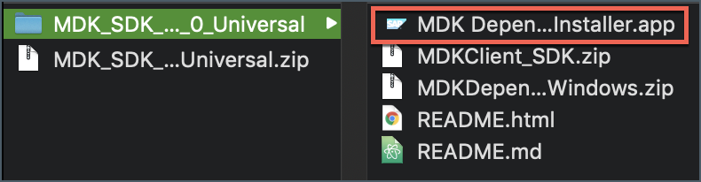

>You will find also other files in the extracted folder. `README` file contains information about version requirements, dependencies matrix and some help guide.

MDK Dependencies Installer checks the status of the MDK dependencies and will install or upgrade the dependencies for you. Double click `MDK Dependencies Installer.app` file, click **Open**.

>If you find some issues (for example: app cant be opened because the identity of the developer cannot be confirmed) while opening this file, go to System Preferences > Security & Privacy and click **Open Anyway**.

Enter Admin user password and click **OK**.

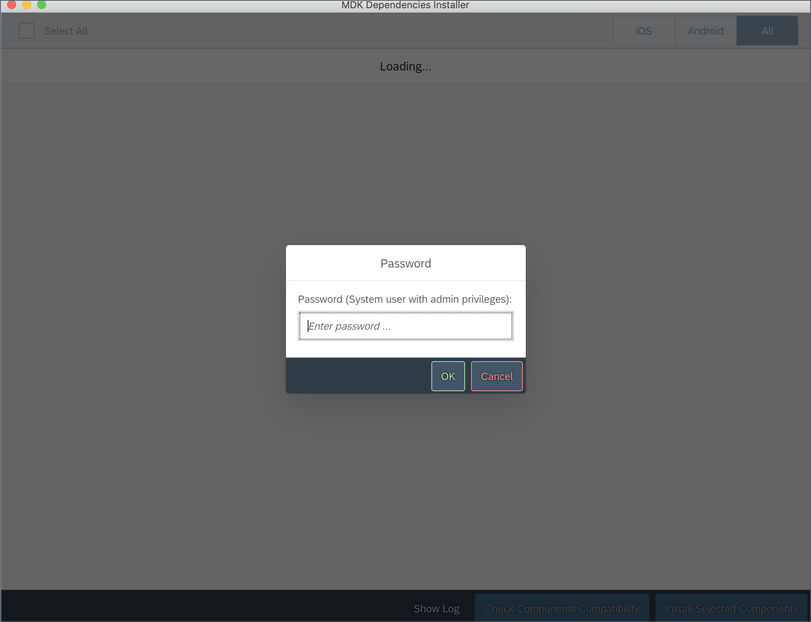

The installer will list all required components for iOS and Android platform and automatically check if they are already installed in the machine. Follow the installer UI to install the components you selected.

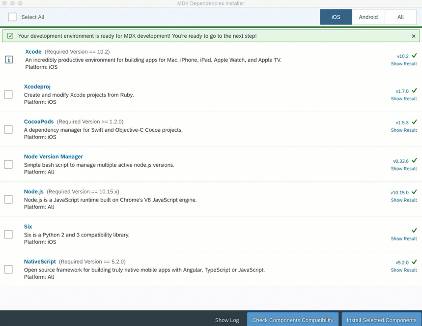

[OPTION END]

[OPTION BEGIN [Windows]]

Extract the downloaded zip file on your Windows OS.

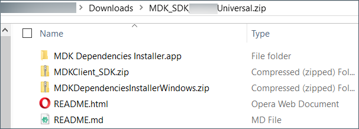

>You will find also other files in the extracted folder. `README` file contains information about version requirements, dependencies matrix and some help guide.

Extract `MDKDependenciesInstallerWindows.zip` file.

MDK Dependencies Installer checks the status of the MDK dependencies and will install or upgrade the dependencies for you. Double click `MDK_Dependencies_Installer.exe` file to open it.

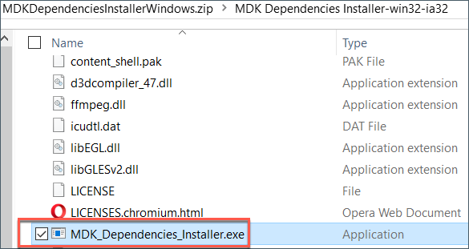

The installer will list all required components for Android platform and automatically check if they are already installed in the machine. Follow the installer UI to install the components you selected.

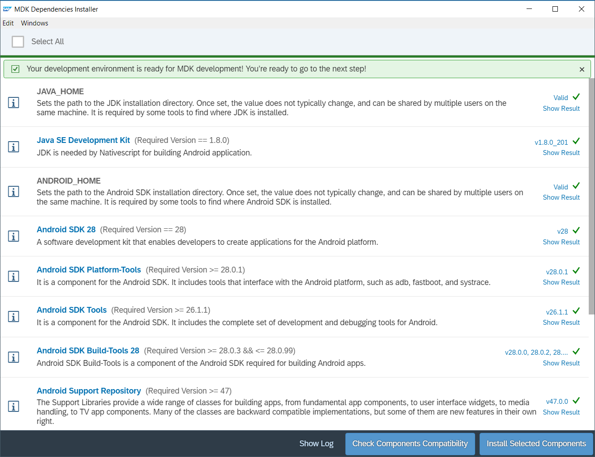

>If MDK Dependencies Installer keeps showing `Loading...` then use command `MDK_Dependencies_Installer.exe –debug –debug` to see more information.
There might be some issue due to Security Policy. It can be fixed by executing this in `PowerShell`:
>`Set-ExecutionPolicy -ExecutionPolicy Bypass -Scope CurrentUser`

[OPTION END]

>You can look into console by clicking **Show Log** for execution of each dependencies.

Once you've installed these prerequisites, your machine is ready to generate and build an MDK project.

[DONE]
[ACCORDION-END]

[ACCORDION-BEGIN [Step 2: ](Installing the SDK dependencies)]

[OPTION BEGIN [Mac]]

To use the SDK to generate a mobile development kit client, the first step is to install some dependencies. Unzip `MDKClient_SDK.zip` if it is not already extracted.

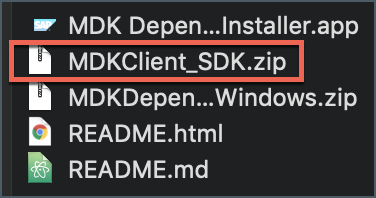

From a terminal window, navigate to the `[path] -> MDKClient_SDK` folder and execute `./install.command`. If everything is fine, you will a success message in the console followed by next steps.

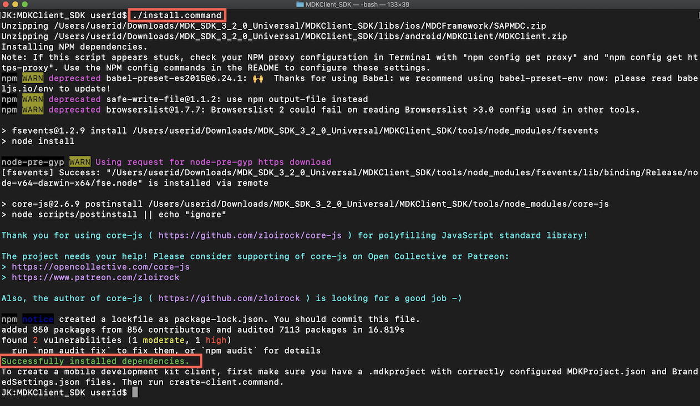

Once this completes, close the window. Notice that the `create-client.command` file has appeared in the SDK directory.

[OPTION END]

[OPTION BEGIN [Windows]]

To use the SDK to generate a mobile development kit client, the first step is to install some dependencies. Unzip `MDKClient_SDK.zip` if it is not already extracted.

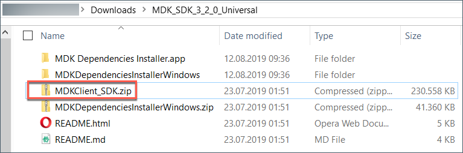

From a command line window, navigate to the `[path] -> MDKClient_SDK` folder and execute `install.cmd`.

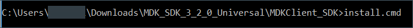

If everything is fine, you will a success message in the console followed by next steps.

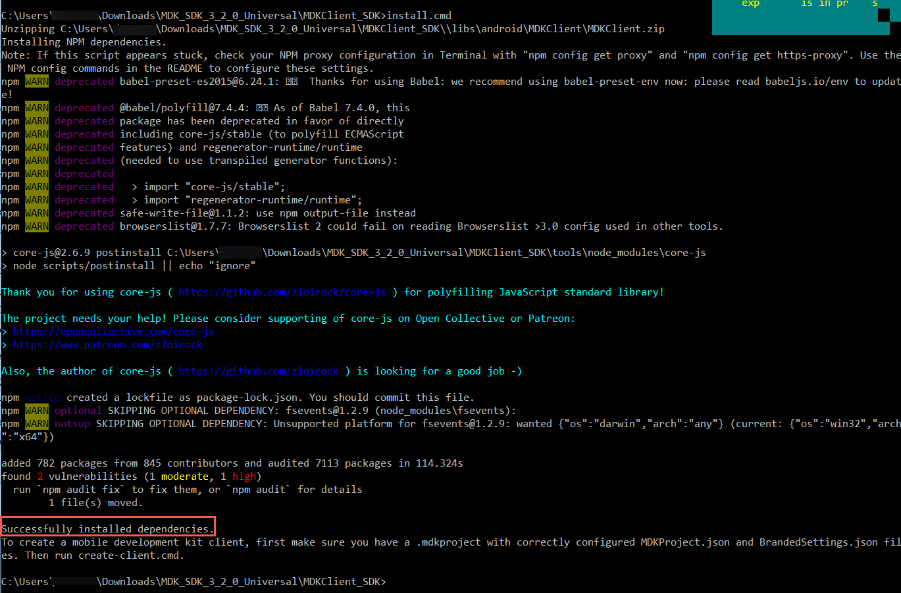

Once this completes, close the window. Notice that the `create-client.cmd` file has appeared in the SDK directory.

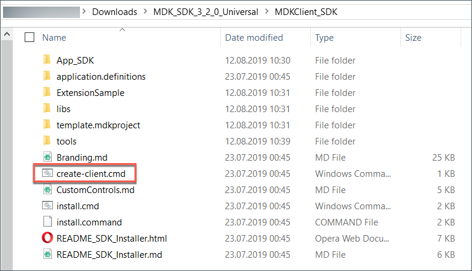

[OPTION END]

[DONE]
[ACCORDION-END]

[ACCORDION-BEGIN [Step 3: ](Create your .mdkproject folder)]

[OPTION BEGIN [Mac]]

In the `MDKClient_SDK` folder, you will find the `template.mdkproject` folder. It is recommended that you copy this folder to another location to use it for future builds and paste it anywhere want and rename it what ever you want.

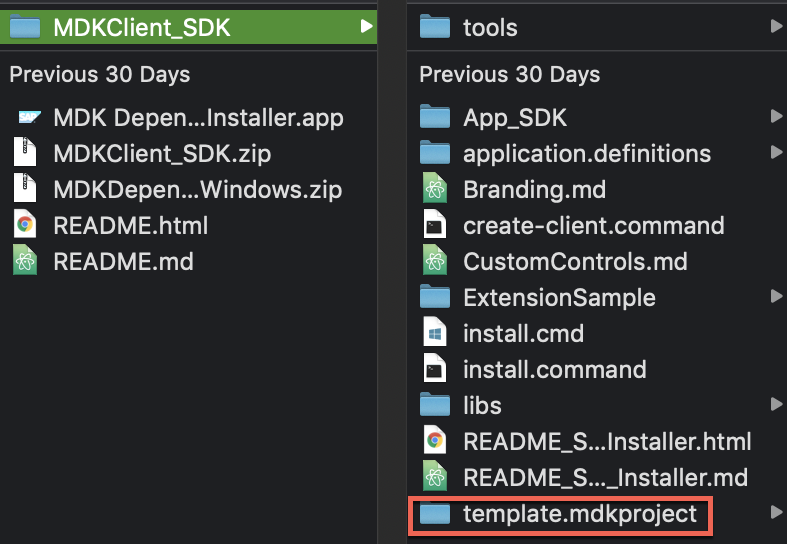

Idea of retaining `.mdkproject` folder is have a backup in case `create-client` script fails.

>For this tutorial, I have named my `.mdkproject` folder `demosampleapp.mdkproject` and put it outside of the MDK Client folder structure. I will refer this name for the rest of this tutorial.
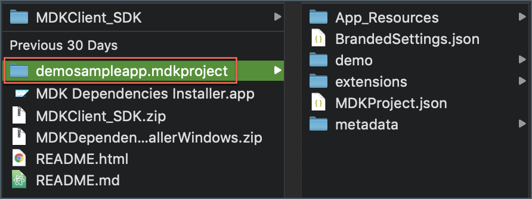

Next, you will need to update the `BrandedSettings.json` and `MDKProject.json` files as needed for your client. Go into the `demosampleapp.mdkproject` folder.

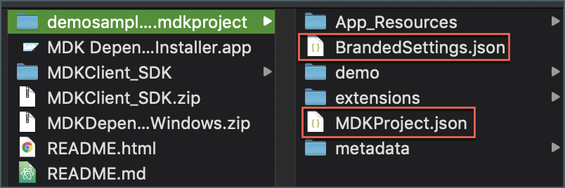

[OPTION END]

[OPTION BEGIN [Windows]]

In the `MDKClient_SDK` folder, you will find the `template.mdkproject` folder. It is recommended that you copy this folder to another location to use it for future builds and paste it anywhere want and rename it what ever you want.

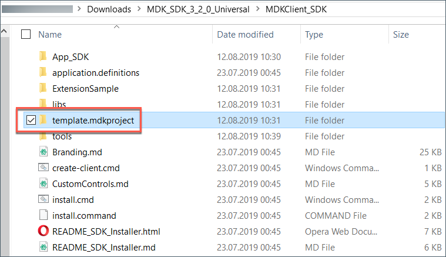

Idea of retaining `.mdkproject` folder is have a backup in case `create-client` script fails.

>For this tutorial, I have named my `.mdkproject` folder `demosampleapp.mdkproject` and put it outside of the MDK Client folder structure. I will refer this name for the rest of this tutorial.

>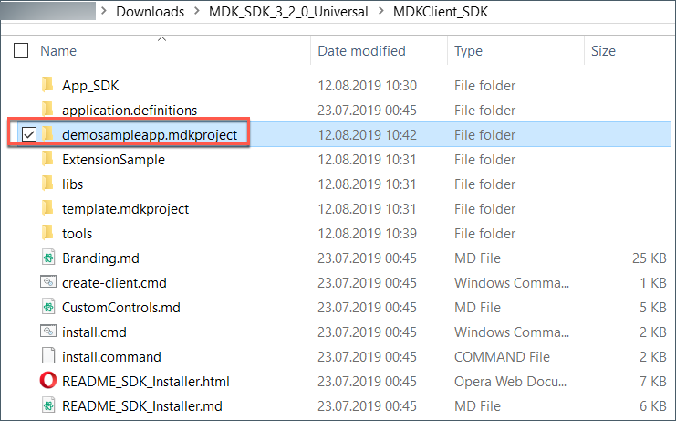

Next, you will need to update the `BrandedSettings.json` and `MDKProject.json` files as needed for your client. Go into the `demosampleapp.mdkproject` folder.

[OPTION END]

Open the `MDKProject.json` file and update it as needed. This file has some build-time configurations such as the application name, version and bundle ID.

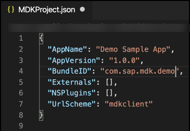

>For iOS `MDKProject.json's BundleID` should be the same **Identifier** `(AppID)` that is registered in Apple Developer account.
Without matching them, trying to run the custom client in iOS device will result in failure.

>You can find more details about configuration of `MDKProject.json` file in [this](https://help.sap.com/viewer/977416d43cd74bdc958289038749100e/Latest/en-US/01e70c3bd0914761bb37f800029c0e24.html) help documentation.

Now open the `BrandedSettings.json` file and update it with information from your MDK Mobile Services application.

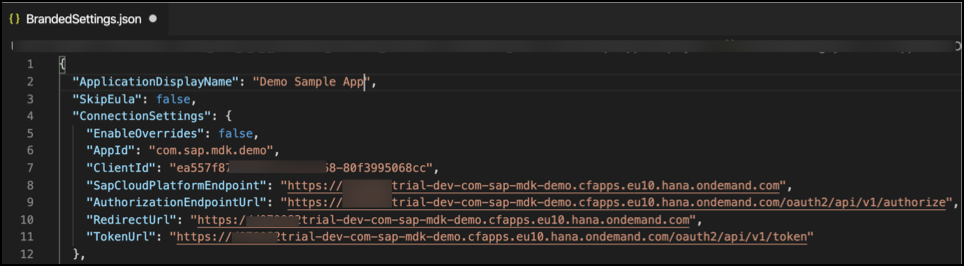

To find the correct URLs for your client, you should go to [Mobile Services cockpit](https://developers.sap.com/tutorials/cp-mobile-dev-kit-ms-setup.html#00512449-638b-4de6-aa68-87609545f186) and find your MDK application that you want to link to this client.  Click on **Security** from the MDK app main page, then click on the OAuth client link.

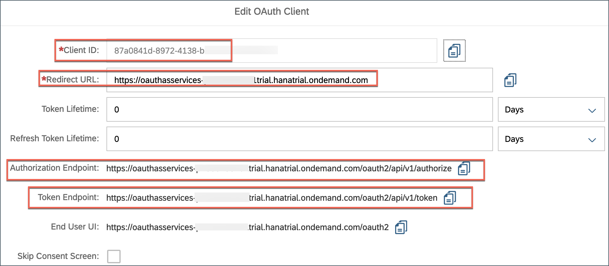

`AppId`: App ID from App info page.

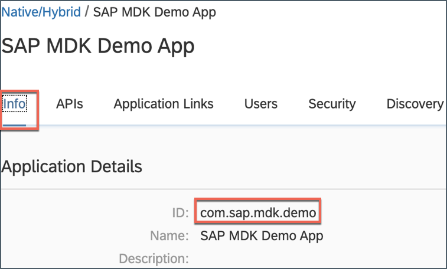

`SapCloudPlatformEndpoint`: Server URL from App API page.

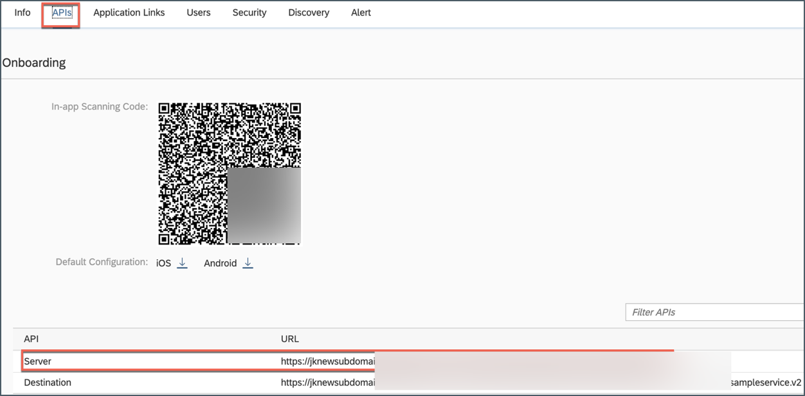

>For android client, screen sharing or taking screen shots are disabled by default. To enable it, `add "EnableScreenSharing": true` in `ConnectionSettings` section.

Regarding other properties:
**Debug settings**: The settings in the `DebugSettings` property are for development use and should not be enabled in a production setting.

**Log Settings**: Use the property if you would like the logger to be started as soon as the client is launched.

**Demo**: If you want to access the app in the demo mode, you can configure required settings.

In the last section of `BrandedSettings.json` file, make these changes:

| Field | Value |
|----|----|
| `DetailLabelViewText` | `My sample custom client` |
| `EncryptDatabase` | `false` |
| `SigninButtonText` | `Start` |

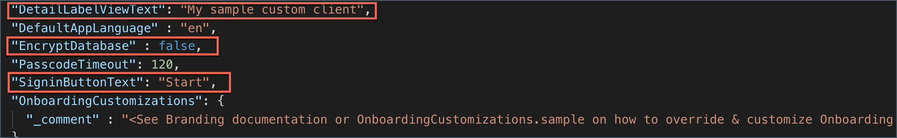

>It is recommended to encrypt the database in production scenarios. You might want to set this property to false to extract the database for debugging purposes.

>You can find more details about branding in [this](https://help.sap.com/viewer/977416d43cd74bdc958289038749100e/Latest/en-US/01e70c3bd0914761bb37f800029c0e24.html) help documentation.

[DONE]
[ACCORDION-END]

[ACCORDION-BEGIN [Step 4: ](Create the MDK Client)]

[OPTION BEGIN [Mac]]

You can create a client by running `./create-client.command` and providing the path to a valid `.mdkproject` directory.

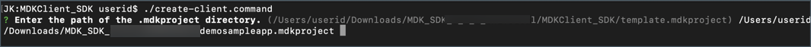

You will be asked whether you would like to build for iOS or Android or All?

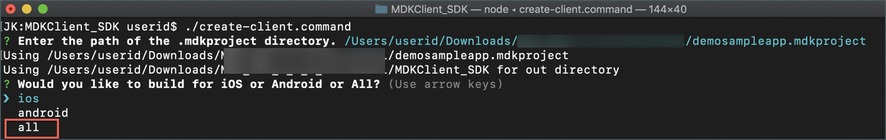

>**All** option was chosen in this tutorial as you will learn how to create the MDK client for iOS and Android.

Then, you will be asked whether you would like to build for device or simulator?

>**device** option was chosen for this tutorial.

Once the `create-client.command` script executed successfully, you will see **Application ready** message in terminal console.

You will also find your app created under the `MDKClient_SDK` folder.

[OPTION END]

[OPTION BEGIN [Windows]]

You can create a client by running `create-client.cmd` and providing the path to a valid `.mdkproject` directory.

Once the `create-client.cmd` script executed successfully, you will see **Application ready** message in terminal console.

 You will also find your app created under the `MDKClient_SDK` folder.

[OPTION END]

>This name of this folder is based on the `<App Name>` provided in the `MDKProject.json file` and this is the `NativeScript` project.

[VALIDATE_1]
[ACCORDION-END]

[ACCORDION-BEGIN [Step 5: ](Run the MDK Client)]

[OPTION BEGIN [iOS]]

In this step, you will run the app on an iOS device. Attach the device to your Mac and run `tns device ios` command to print a list of attached devices.

Copy the **Device Identifier** value for your device.

In terminal window, navigate to the app name folder **Demo Sample App** (in `MDClient_SDK` path) and use `tns run ios --device <device identifier>` command to run the MDK client on iOS device.

You can also run the app in Xcode. Open the project in Xcode with the command `open platforms/ios/<app name>.xcworkspace`, or open the workspace using the `File -> Open...` dialog in Xcode. Configure the application's code signing settings, then run the application for the target device.

>To run the MDK client on iOS simulator, use `tns run ios --emulator` command.

Once, above command gets successfully executed, you will see new MDK client up and running in your device.

Here, you will notice that **app name**, **detailed label text** and **signing button text** have been updated as per changes done in step 3.

Click **Start** to connect MDK client to SAP Cloud Platform.

Enter your SAP Cloud Platform credentials and click **Log On** to authenticate.

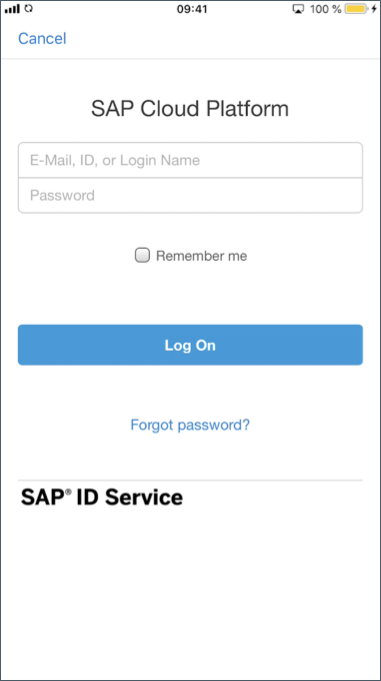

**Agree** on `End User License Agreement`.

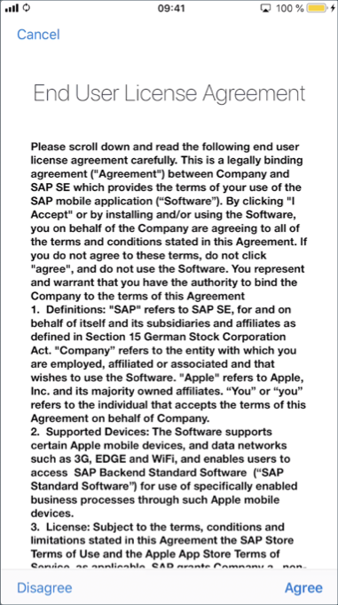

Choose a passcode with at least 8 characters for unlocking the app and click **Next**.

Confirm the passcode and click **Done**.

Optionally, you can enable Touch ID to get faster access to the app data, click **Enable**.

Since there is no app metadata deployed yet to Mobile Services, hence you will see an empty screen.

>You can always interrupt running process in terminal window by pressing `control + C`.

>To build an **IPA for an iOS device**, use `tns build ios --for-device --release`. This can also be accomplished in Xcode by opening the workspace and selecting the Archive option. More information about archiving can be found in Apple's documentation [here](https://developer.apple.com/library/content/documentation/IDEs/Conceptual/AppDistributionGuide/UploadingYourApptoiTunesConnect/UploadingYourApptoiTunesConnect.html).

[OPTION END]

[OPTION BEGIN [Android]]

In this step, you will run the app on an android device. Attach the device to your Mac or Windows machine and run `tns device android` command to print a list of attached devices.

>Make sure **Developer option** and **USB debugging** option is enabled in android device.

Copy the **Device Identifier** value for your device.

In terminal or command line window, navigate to the app name folder **Demo Sample App** (in `MDClient_SDK` path) and use `tns run android --device <device identifier>` command to run the MDK client on android device.

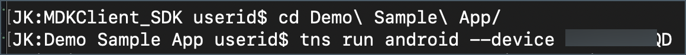

>To run the MDK client on iOS simulator, use `tns run android --emulator` command. Make sure that you have created a virtual device in Android Studio prior to running this command.

Once, above command gets successfully executed, you will see new MDK client up and running in Android device.

Here, you will notice that **app name**, **detailed label text** and **signing button text** have been updated as per changes done in step 3.

Click **START** to connect MDK client to SAP Cloud Platform.

Enter your SAP Cloud Platform credentials and click **Log On** to authenticate.

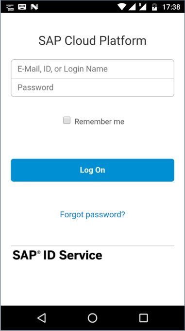

**AGREE** on `End User License Agreement`.

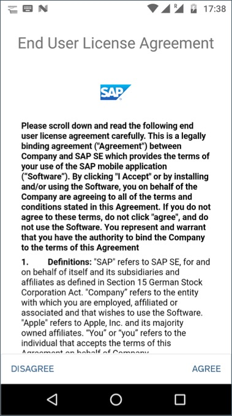

Choose a passcode with at least 8 characters for unlocking the app and click **NEXT**.

Confirm the passcode and click **DONE**.

Optionally, you can enable fingerprint to get faster access to the app data.

Since there is no app metadata deployed yet to Mobile Services, hence you will see an empty screen.

>You can always interrupt running process in terminal window by pressing `control + C`.

>To build an **`APK` for an Android device**, use `tns build android --release`. More information about archiving can be found in `NativeScript` documentation [here](https://docs.nativescript.org/tooling/docs-cli/project/testing/build-android).

[OPTION END]

[DONE]
[ACCORDION-END]

---
