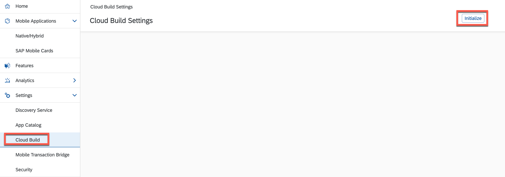
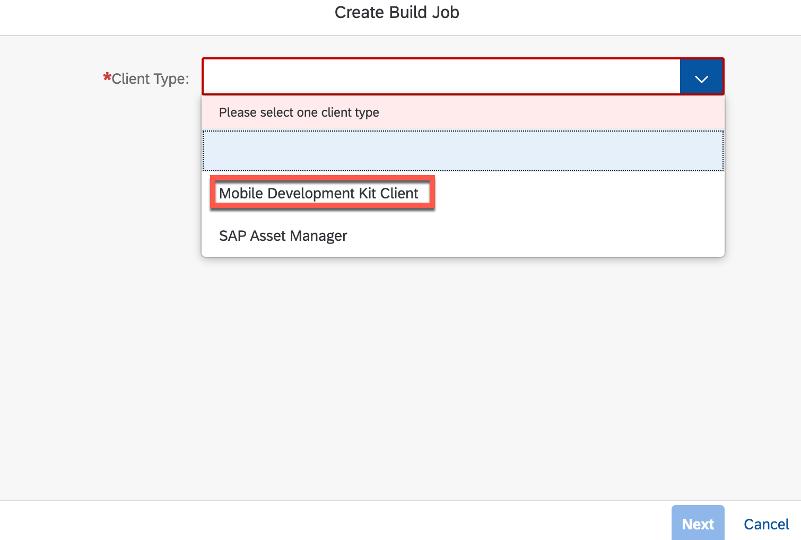
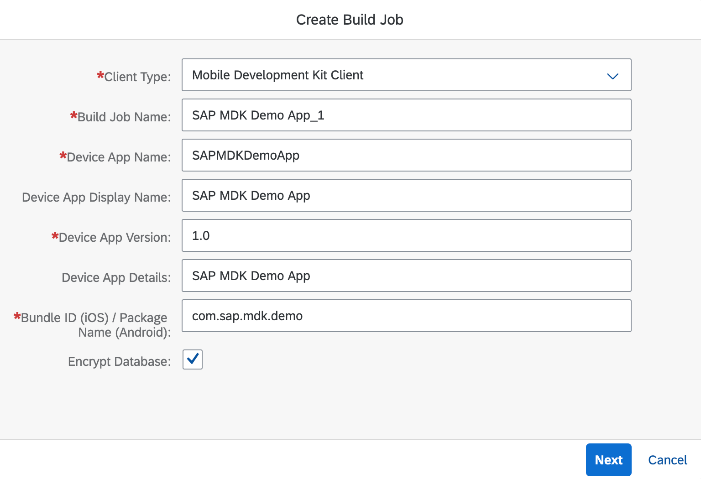
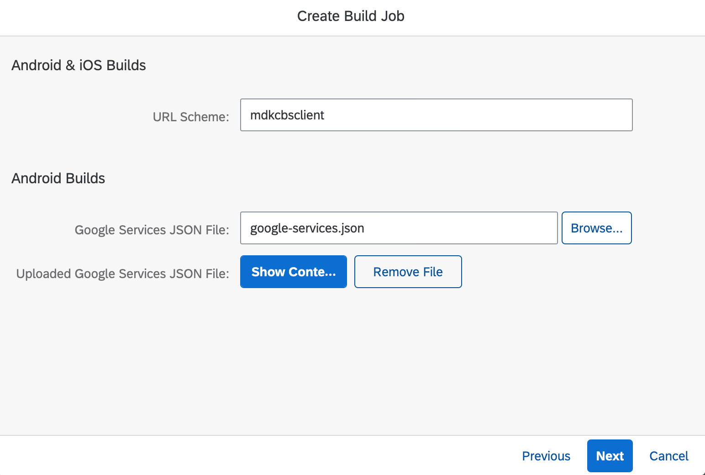
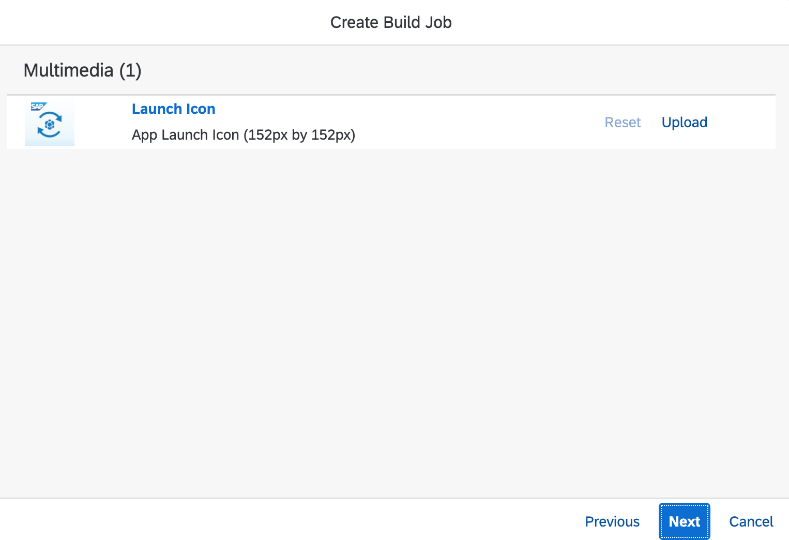
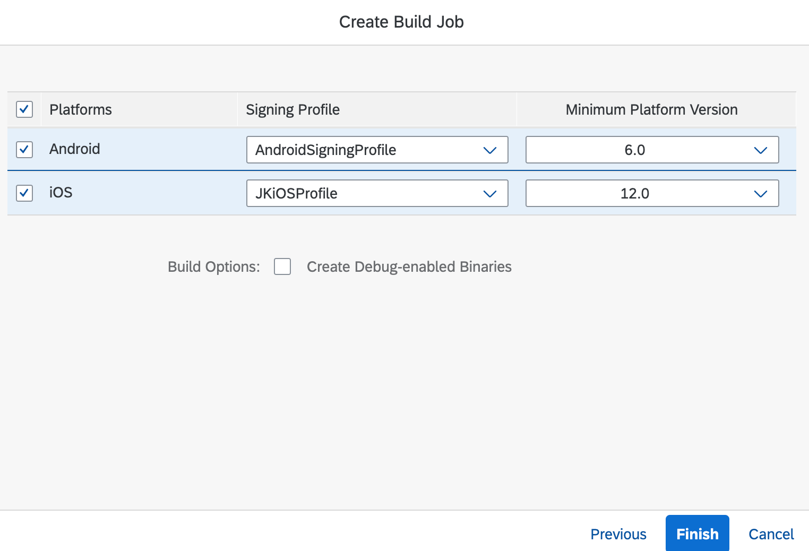
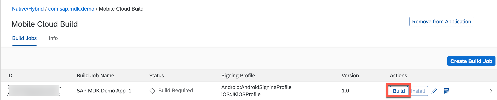
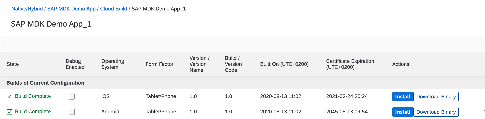
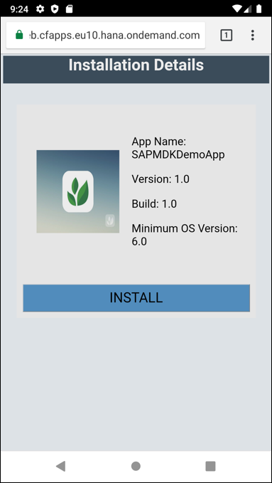
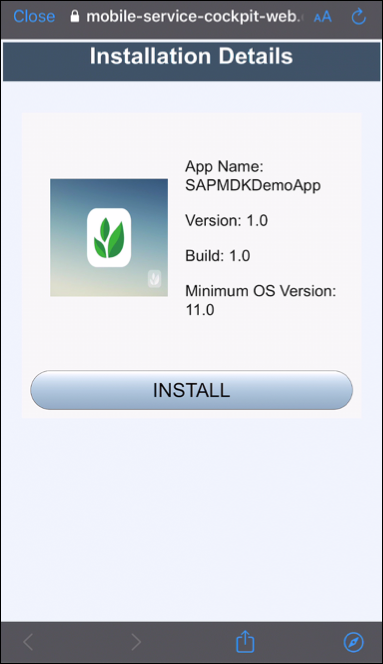

## Prerequisites
- **Tutorial**: [Set Up Initial Configuration for an MDK App](cp-mobile-dev-kit-ms-setup)
- **Apple ID**: A paid Apple developer account is required

## Details
### You will learn
  - How to create a custom MDK client using Cloud Build service
  - How to add your company logo and company name to the custom client

There are 3 options for mobile development kit client:

1. Install the SAP Mobile Services client from the public store
2. Use the Cloud Build feature in SAP Mobile Services to generate a customized client
3. [Build and customize a client on your local machine in your organization development environment](cp-mobile-dev-kit-build-client)

In this tutorial, you will learn how to use Cloud Build service to generate a custom MDK client (option 2).

SAP Mobile Services provides the capability to build the MDK client without client-side installations.

You need to:

- Add Cloud Build service feature to your MDK app configuration
- Upload signing profiles and/or app information
- Upload app icon
- Initiate the build

After a successful build, you can download the IPA or APK file.

---

[ACCORDION-BEGIN [Step 1: ](Generate required configuration to build custom client)]

>Make sure you are choosing the right device platform tab above.

[OPTION BEGIN [Android]]

1. Open the [Firebase console](https://console.firebase.google.com/u/0/?pli=1), login with your Google account and click **Create Project** or **Add Project** (you will see this option if you already have any existing projects).

    !

2. Provide a Project Name, click **Continue**.

    !

3. Uncheck **Enable Google Analytics for this project** option and click **Create Project**.

    !

4. Once the project is ready, click **Continue**.

    !

5. Click **Android** icon to add Firebase to your Android app.

    !

6. Provide a unique name to Android package name, click **Register app**.

    !

7. `Download goole-services.json` file, click **Next**.

    !

8. In **Add Firebase SDK** step, click **Next**.

9. In the following step, click **Next** and then click **Continue to console**.

    !

[OPTION END]

[OPTION BEGIN [iOS]]

In order to implement Push Notifications, a paid Apple developer account is required. Students or other developers with a personal Apple ID for their team will not be able to use push notifications, because they will not have access to the Developer Portal to generate the required certificate.

To enable your app for push notifications, you need to carry out the following tasks:

* Obtain a certificate signing request
* Register an iOS App ID
* Create a new development certificate `.cer` file
* Install the `.cer` file and create the .p12 file
* Register your device
* Create a development provisioning profile

1. Obtain a certificate signing request

    In order to use the **Apple Push Notification service**, you need to create a **CSR file**.

    On your Mac, open the **Keychain Access** application, and navigate to **Keychain Access > Certificate Assistant > Request a Certificate From a Certificate Authority...**

    !

    In the dialog, enter the email address which is associated with your Apple Developer account. Also, make sure you check the **Request is saved to disk** option.

    !

    Click **Continue**.

    Choose a folder to store the certificate -- it is good practice to store generated files in a separate folder for each project -- and click **Save**.

    Once you see a dialog saying the certificate is saved successfully, click **Done** to finish.

    !

2. Create a new development certificate `.cer` file

    Go to your [Apple Developer Account](https://developer.apple.com/account) and Click **Certificates, Identifiers & Profiles**.

    !

    Click **+** icon to create a **Certificate** for your app.

    !

    Select **Apple Development** and click **Continue**.

    !

    Click **Choose File** and browse to the downloaded Signing Request `CSR` file, click **Continue**.

    Apple will now create a `.cer` file for you which is issued by the **Apple Worldwide Developer Relations Certification Authority**.

    !

    Click **Download** to download your certificate.

    !

3.  Install the `.cer` file and create the .p12 file

    In order to create a signing profile on **SAP Mobile Services**, you need to install the `.cer` file and create the needed `.p12` file.

    >A `.p12` file is a encrypted container for the certificate and private key. This file is needed by Mobile Services for creating a signing profile.

    Locate your downloaded `.cer` file and double-click it in order to install the certificate.

    >In case the **Add Certificate** dialog pops up make sure to choose **Login** from the dropdown and click **Add**.

    If the certificate is added correctly to the Keychain you should see it in the `MyCertificates` section, make sure you selected **login** as keychain.

    !

    Select the certificate as well as the private key and right-click to export those 2 items.

    !

    Make sure that in the dropdown **Personal Information Exchange (.p12)** is selected and click **Save**. You will be prompted to enter a password, click **OK** to export the files.

    !

4. Register an iOS App ID

    Click **+** icon to register a unique **Identifiers** for your app.

    !

    Select **App IDs** and click **Continue**.

    !

    Provide a unique **Bundle ID** name, **Description** and click **Continue**.

    !

    In the following screen, select option for **Deployment Details** and then click **Continue**.

    Confirm your App ID by clicking on **Register**.

5. Register your device

    Click **+** icon to register your iOS device.

    !

    Provide **Device Name** & **Device ID (UDID)** and then click **Continue**.

    !

6. Create a development provisioning profile

    Click **+** icon to create a development provisioning profile.

    !    

    Select **iOS App Development** to create a provisioning profile to install development apps on test devices and click **Continue**.

    !

    Select an App ID from the dropdown list and click **Continue**.

    !

    Select the required certificate to include in this provisioning profile and click **Continue**.

    !

    Select the device to include in this provisioning profile and click **Continue**.

    !

    Provide a unique name to the profile and click **Generate**.

    !

    In next step, download the generated provisioning profile on your local machine.

    !

[OPTION END]

[DONE]
[ACCORDION-END]

[ACCORDION-BEGIN [Step 2: ](Configure device platform signing profile in Mobile Services)]

>Make sure you are choosing the right device platform tab above.

[OPTION BEGIN [Android]]

1. Open the [SAP Mobile Services cockpit](cp-mobile-dev-kit-ms-setup) and navigate to **Settings** | **Cloud Build**. Initialise the **Cloud Build Settings** if not done before.

    !

2. You have an option to generate a new signing profile in the Mobile Services cockpit by providing mandatory info like Profile Name, Validity, Common Name (user name). Other information are optional.

    !

    Or you have an option to to upload an Android Signing profile, if you already have one.

    !

[OPTION END]

[OPTION BEGIN [iOS]]

1. Open the [SAP Mobile Services cockpit](cp-mobile-dev-kit-ms-setup) and navigate to **Settings** | **Cloud Build**. Initialize the **Cloud Build Settings** if not done before.

    !

2. Click **Upload** to upload iOS Signing profile and provide below information:

    | Property | Value |
    |----|----|
    | `Platforms`| `iOS` |
    | `Profile Name`| `provide a name of your choice` |
    | `Signing Certificate`| `Browse to .p12 certificate` |
    | `Private Key Passphrase`| `Enter the password that you chose while exporting .p12 certificate` |
    | `provisioning Profile`| `Browse to .mobileprovision file` |

    Click **OK**.

    !

    [OPTION END]

You can find more details about Cloud Build service in [help documentation](https://help.sap.com/doc/f53c64b93e5140918d676b927a3cd65b/Cloud/en-US/docs-en/guides/features/cloud-build/overview.html).

[DONE]
[ACCORDION-END]

[ACCORDION-BEGIN [Step 3: ](Create a build job in Cloud Build service)]

1. In Mobile Services cockpit, navigate to `Mobile Applications` | `Native/Hybrid` | `com.sap.mdk.demo` | `Mobile Cloud Build`.

    Click **Create Build Job** to build your first build job.

    !

2. Select **Mobile Development Kit Client** from **Client Type** dropdown.

    !

3. Provide required values and click **Next**.

    !

    >**Encrypt Database**: Whether the database must be encrypted. Unselect this field to extract the database for debugging purposes.

4. Provide a unique value to the **URL Scheme** and browse to `google-services.json` file for Android build  values and click **Next**.

    !

    >**Google Services JSON File**: The Firebase Android configuration file associated with your app in your Firebase project.

5. You may upload your company logo for the app icon and click **Next**.

    !

6. Upload respective Signing profile(s), set minimum platform version and click **Finish**.

    !

7. Click **Build** to start the Build job.

    !

    After few minutes, Build should be completed. You can select each cloud build history row to view its current state, install, and download binaries.

    !

    You can find more details about packaging details in [help documentation](https://help.sap.com/doc/f53c64b93e5140918d676b927a3cd65b/Cloud/en-US/docs-en/guides/features/cloud-build/admin/customization.html#packaging-details-overview).

[VALIDATE_1]
[ACCORDION-END]

[ACCORDION-BEGIN [Step 4: ](Install/download binary)]

[OPTION BEGIN [Android]]

You can install this new custom MDK client app either by scanning QR code from Android phone camera app (click **Install**) or download binary (APK) locally and install in your device via IDEs like Android Studio or via other means.

!

!
!

[OPTION END]

[OPTION BEGIN [iOS]]

You can install this new custom MDK client app either by scanning QR code from iPhone phone camera app (click **Install**) or download binary (IPA) locally and install in your device via IDEs like Xcode or via other means.

!

!
!

[OPTION END]

Congratulations, you have successfully built Your Mobile Development Kit Client Using Cloud Build Service and and you can continue with the remaining tutorials in this mission.

[VALIDATE_4]
[ACCORDION-END]

---
