## Prerequisites
- **Tutorial**: [Set Up Initial Configuration for an MDK App](cp-mobile-dev-kit-ms-setup)
- **Apple ID**: A paid Apple developer account is required

## Details
### You will learn
  - How to generate platform specific configurations required for your MDK client
  - How to build a standard MDK client
  - How to upload your local `.mdkproject` to the Cloud Build service to build a customized MDK client
  - How to install the binary on your device

Cloud Build Service provides 2 options for creating a Mobile development kit client:

1. Create a standard MDK client by providing your own app icon and app logo.
2. Create a customized MDK client by importing your local `.mdkproject` similar to what you might have done via MDK SDK locally on your machine.

You need to:

- Add Cloud Build service feature to your MDK app configuration
- Upload signing profiles and/or app information
- Upload your local `.mdkproject` (applies for custom MDK client)
- Initiate the build

After a successful build, you can download the APK or IPA file.

---

[ACCORDION-BEGIN [Step 1: ](Generate required configuration to build the MDK client)]

>Make sure you are choosing the right device platform tab above.

[OPTION BEGIN [Android]]

> This step is required only if you will be using Push notification in your Android MDK client. If not using the Push, proceed to next step.

1. Open the [Firebase console](https://console.firebase.google.com/u/0/?pli=1), login with your Google account and click **Create Project** or **Add Project** (you will see this option if you already have any existing projects).

    !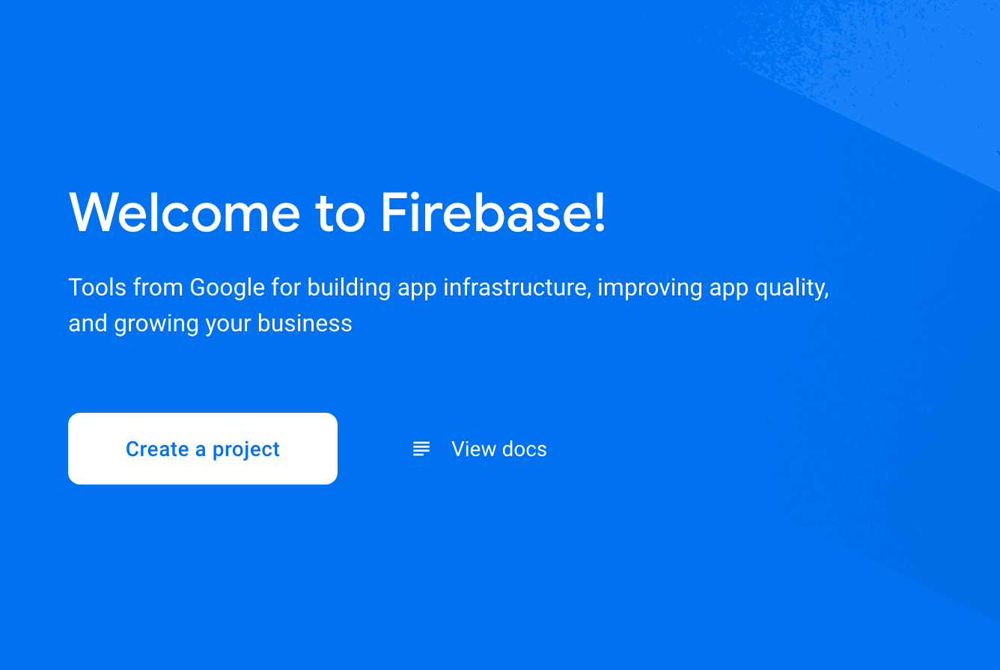

2. Provide a Project Name, click **Continue**.

    !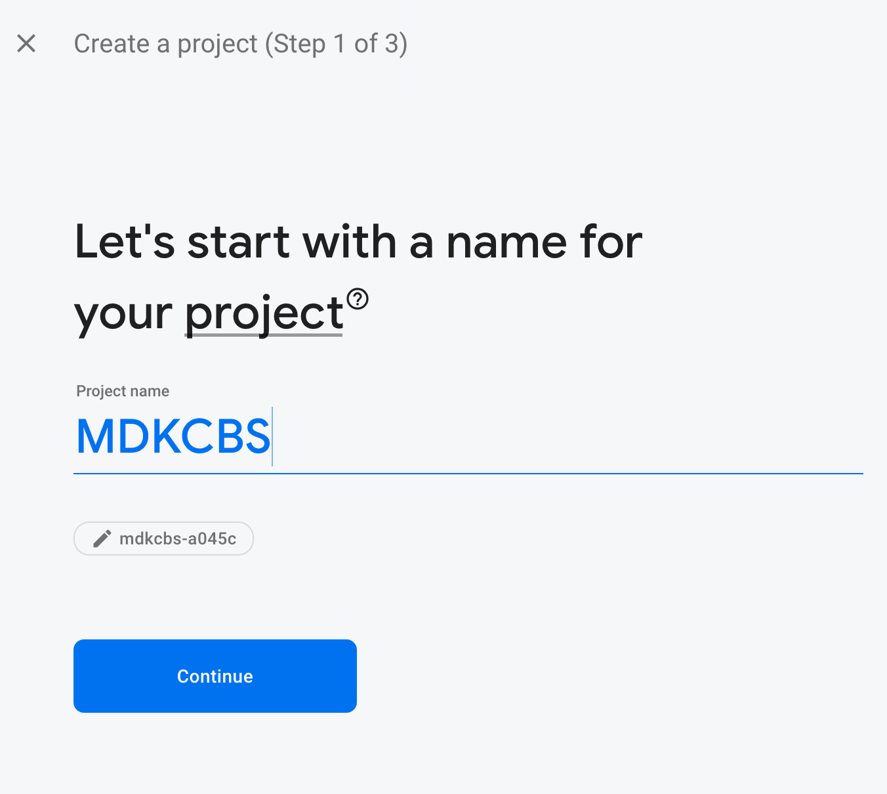

3. Uncheck **Enable Google Analytics for this project** option and click **Create Project**.

    !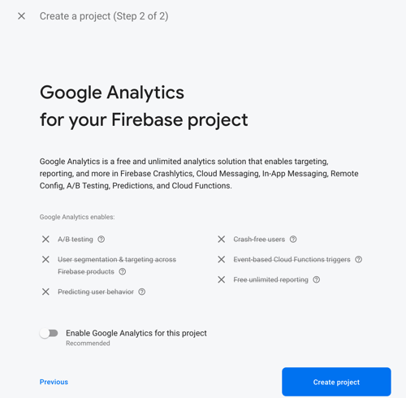

4. Once the project is ready, click **Continue**.

    !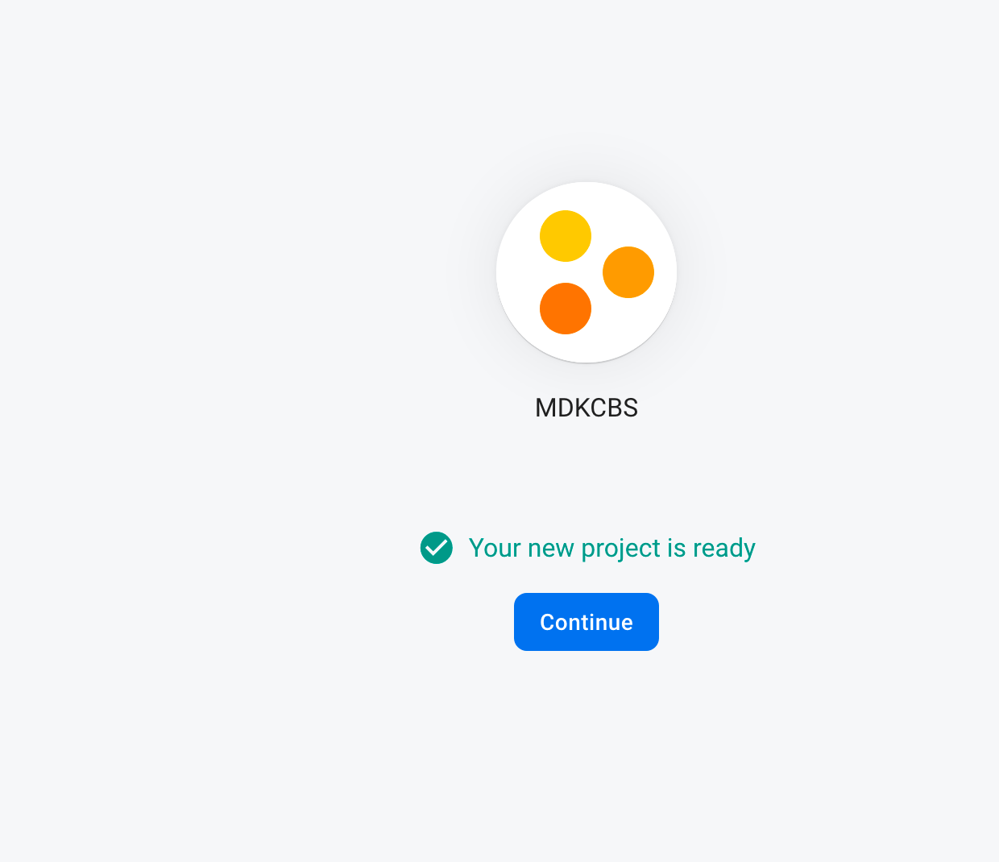

5. Click **Android** icon to add Firebase to your Android app.

    !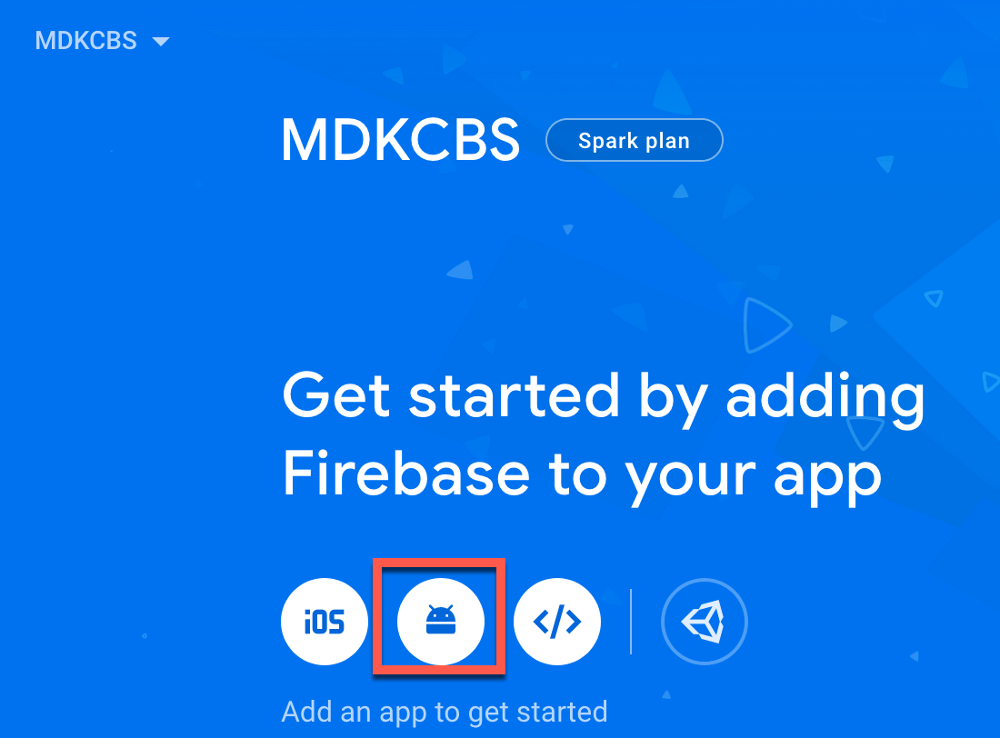

6. Provide a unique name to Android package name, click **Register app**.

    !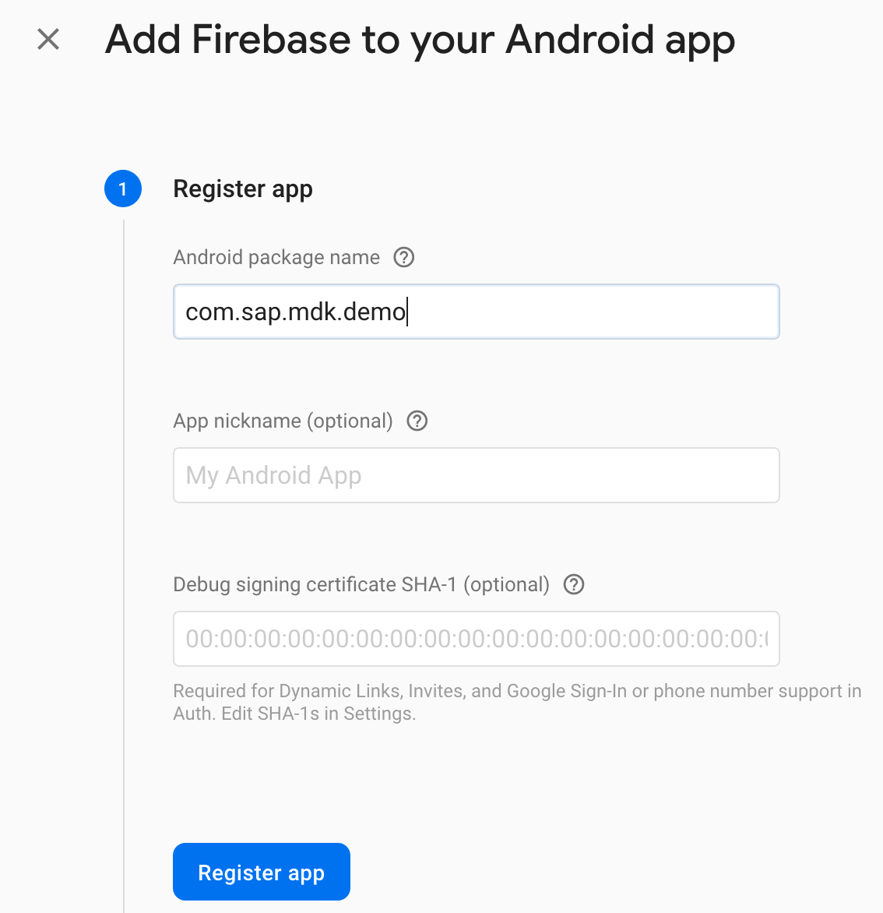

7. `Download goole-services.json` file, click **Next**.

    !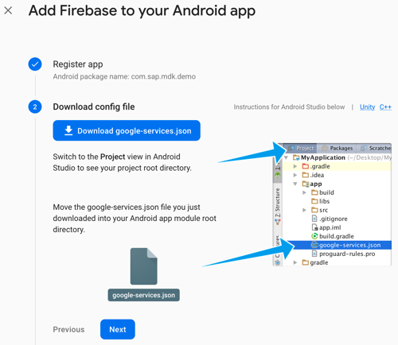

8. In **Add Firebase SDK** step, click **Next**.

9. In the following step, click **Next** and then click **Continue to console**.

    !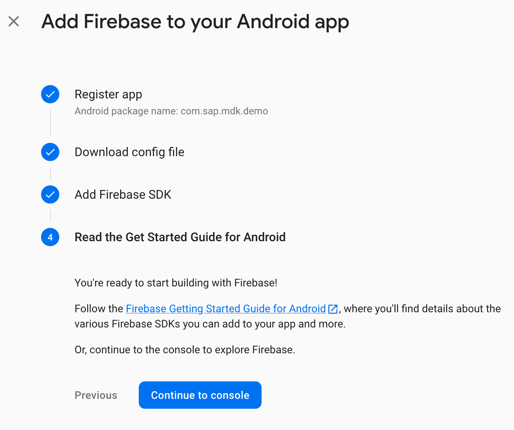

[OPTION END]

[OPTION BEGIN [iOS]]

In order to implement Push Notifications, a paid Apple developer account is required. Students or other developers with a personal Apple ID for their team will not be able to use push notifications, because they will not have access to the Developer Portal to generate the required certificate.

To enable your app for push notifications, you need to carry out the following tasks:

* Obtain a certificate signing request
* Register an iOS App ID
* Create a new development certificate `.cer` file
* Install the `.cer` file and create the .p12 file
* Register your device
* Create a development provisioning profile

1. Obtain a certificate signing request

    In order to use the **Apple Push Notification service**, you need to create a **CSR file**.

    On your Mac, open the **Keychain Access** application, and navigate to **Keychain Access > Certificate Assistant > Request a Certificate From a Certificate Authority...**

    !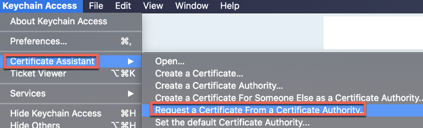

    In the dialog, enter the email address which is associated with your Apple Developer account. Also, make sure you check the **Request is saved to disk** option.

    !

    Click **Continue**.

    Choose a folder to store the certificate -- it is good practice to store generated files in a separate folder for each project -- and click **Save**.

    Once you see a dialog saying the certificate is saved successfully, click **Done** to finish.

    !

2. Create a new development certificate `.cer` file

    Go to your [Apple Developer Account](https://developer.apple.com/account) and Click **Certificates, Identifiers & Profiles**.

    !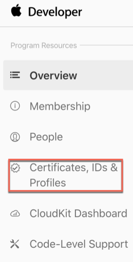

    Click **+** icon to create a **Certificate** for your app.

    !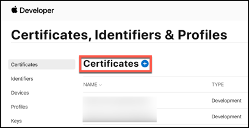

    Select **Apple Development** and click **Continue**.

    !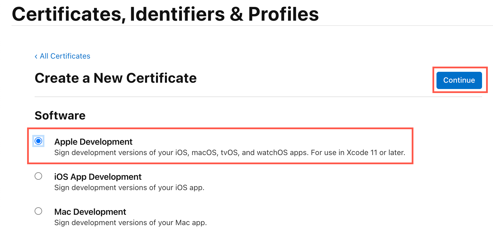

    Click **Choose File** and browse to the downloaded Signing Request `CSR` file, click **Continue**.

    Apple will now create a `.cer` file for you which is issued by the **Apple Worldwide Developer Relations Certification Authority**.

    !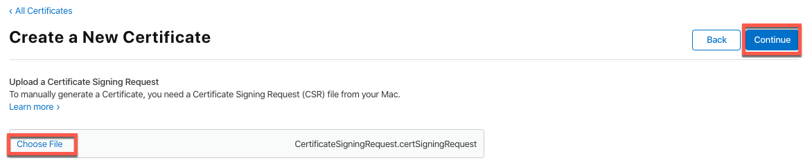

    Click **Download** to download your certificate.

    !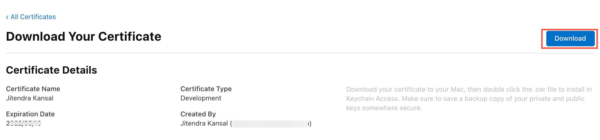

3.  Install the `.cer` file and create the .p12 file

    In order to create a signing profile on **SAP Mobile Services**, you need to install the `.cer` file and create the needed `.p12` file.

    >A `.p12` file is a encrypted container for the certificate and private key. This file is needed by Mobile Services for creating a signing profile.

    Locate your downloaded `.cer` file and double-click it in order to install the certificate.

    >In case the **Add Certificate** dialog pops up make sure to choose **Login** from the dropdown and click **Add**.

    If the certificate is added correctly to the Keychain you should see it in the `MyCertificates` section, make sure you selected **login** as keychain.

    !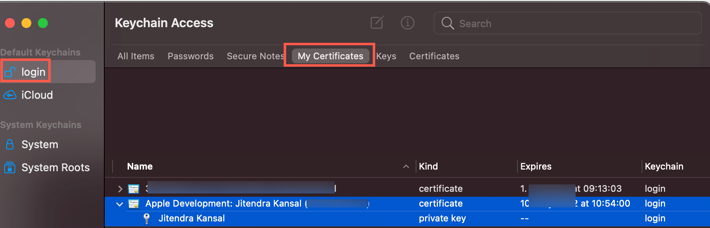

    Select the certificate as well as the private key and right-click to export those 2 items.

    !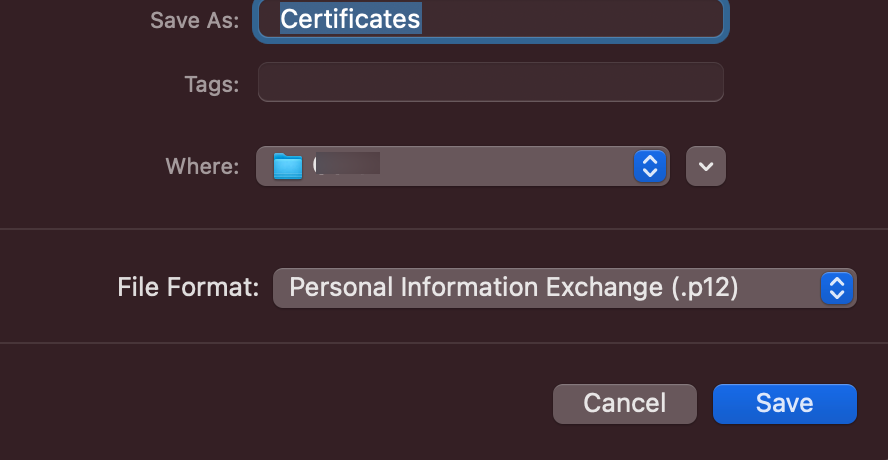

    Make sure that in the dropdown **Personal Information Exchange (.p12)** is selected and click **Save**. You will be prompted to enter a password, click **OK** to export the files.

    !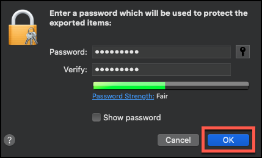

4. Register an iOS App ID

    Click **+** icon to register a unique **Identifiers** for your app.

    !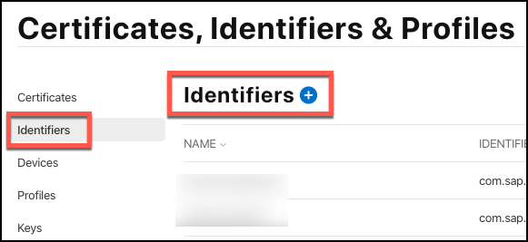

    Select **App IDs** and click **Continue**.

    !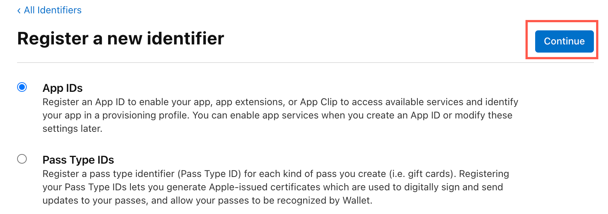

    Provide a unique **Bundle ID** name, **Description** and click **Continue**.

    !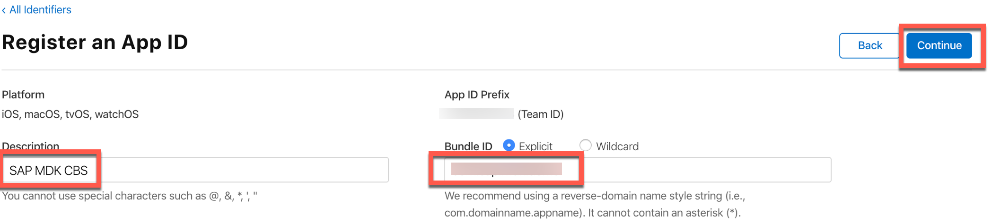

    In the following screen, select option for **Deployment Details** and then click **Continue**.

    Confirm your App ID by clicking on **Register**.

5. Register your device

    Click **+** icon to register your iOS device.

    !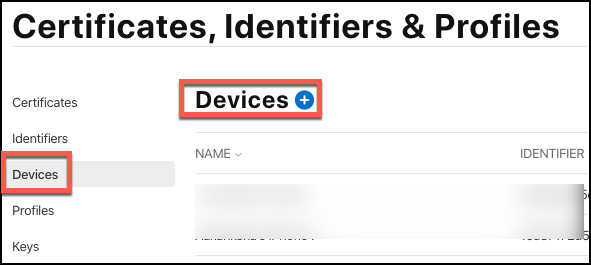

    Provide **Device Name** & **Device ID (UDID)** and then click **Continue**.

    !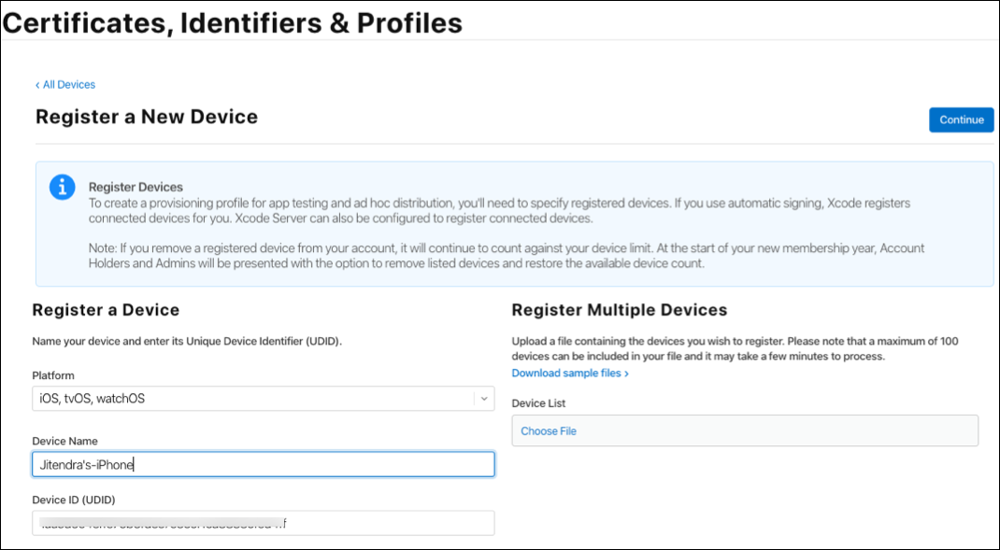

6. Create a development provisioning profile

    Click **+** icon to create a development provisioning profile.

    !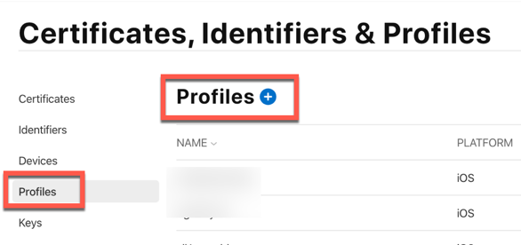    

    Select **iOS App Development** to create a provisioning profile to install development apps on test devices and click **Continue**.

    !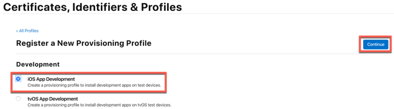

    Select an App ID from the dropdown list and click **Continue**.

    !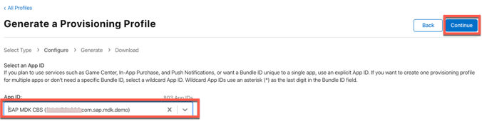

    Select the required certificate to include in this provisioning profile and click **Continue**.

    !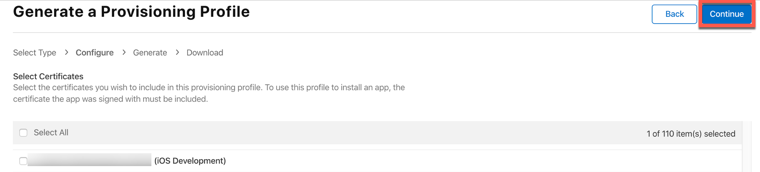

    Select the device to include in this provisioning profile and click **Continue**.

    !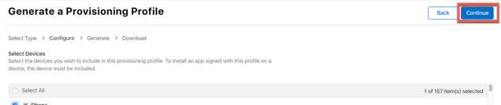

    Provide a unique name to the profile and click **Generate**.

    !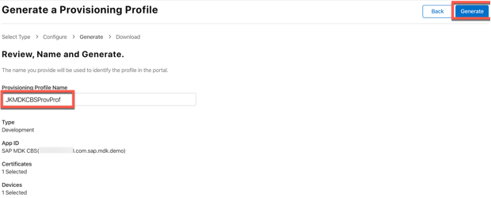

    In next step, download the generated provisioning profile on your local machine.

    !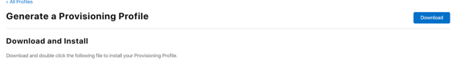

[OPTION END]

[DONE]
[ACCORDION-END]

[ACCORDION-BEGIN [Step 2: ](Compress your .mdkproject (Required for a customized client))]

If you haven't created your local `.mdkproject`, have a look at step 3 from [this](cp-mobile-dev-kit-build-client) tutorial.

Compress your `.mdkproject` folder, the resulting zip file will be used to create a build job for a customized Mobile Development Kit client in Mobile Services cockpit.

[DONE]
[ACCORDION-END]

[ACCORDION-BEGIN [Step 3: ](Configure device platform signing profile in Mobile Services)]

>Make sure you are choosing the right device platform tab above.

[OPTION BEGIN [Android]]

1. Open the [SAP Mobile Services cockpit](cp-mobile-dev-kit-ms-setup) and navigate to **Settings** | **Cloud Build**. Initialize the **Cloud Build Settings** if not done before.

    !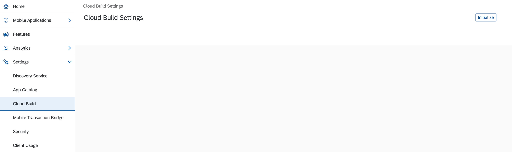

2. You have an option to generate a new signing profile in the Mobile Services cockpit by providing mandatory info like Profile Name, Validity, Common Name (user name). Other information are optional.

    !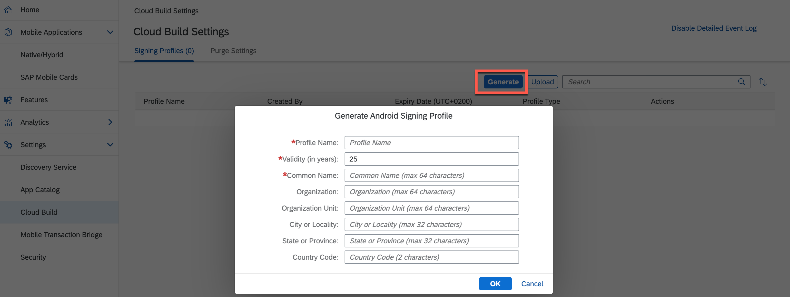

    Or you have an option to to upload an Android Signing profile, if you already have one.

    !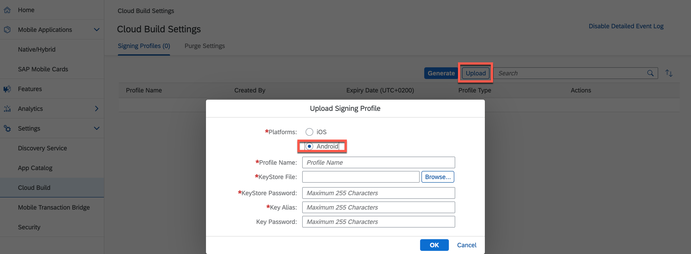

[OPTION END]

[OPTION BEGIN [iOS]]

1. Open the [SAP Mobile Services cockpit](cp-mobile-dev-kit-ms-setup) and navigate to **Settings** | **Cloud Build**. Initialise the **Cloud Build Settings** if not done before.

    !

2. Click **Upload** to upload iOS Signing profile and provide below information:

    | Property | Value |
    |----|----|
    | `Platforms`| `iOS` |
    | `Profile Name`| `provide a name of your choice` |
    | `Signing Certificate`| `Browse to .p12 certificate` |
    | `Private Key Passphrase`| `Enter the password that you chose while exporting .p12 certificate` |
    | `provisioning Profile`| `Browse to .mobileprovision file` |

    Click **OK**.

    !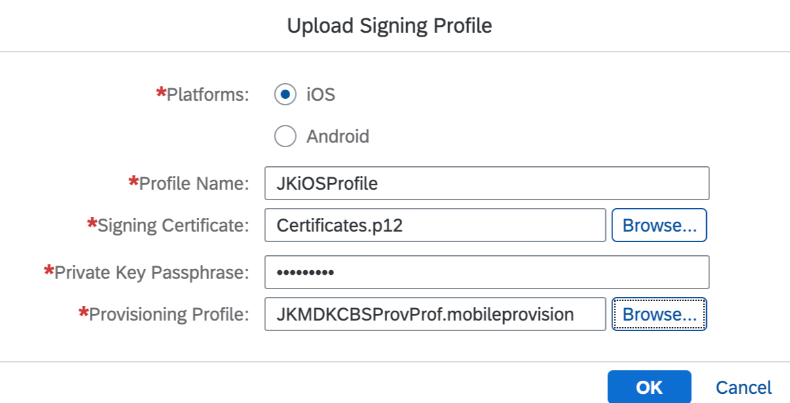

    [OPTION END]

You can find more details about Cloud Build service in [help documentation](https://help.sap.com/doc/f53c64b93e5140918d676b927a3cd65b/Cloud/en-US/docs-en/guides/features/cloud-build/overview.html).

[DONE]
[ACCORDION-END]

[ACCORDION-BEGIN [Step 4: ](Create a build job in Cloud Build service)]

>Make sure you are choosing the right tab above to build a MDK client as per your requirement.

[OPTION BEGIN [Standard Client]]

1. In Mobile Services cockpit, navigate to `Mobile Applications` | `Native/MDK` | `com.sap.mdk.demo` | `Mobile Cloud Build`.

    > If you do not see **Mobile Cloud Build** feature in the **Assigned Features** list, click the **+** icon to add it.

2. Click **Create Build Job** to build your first build job.

    !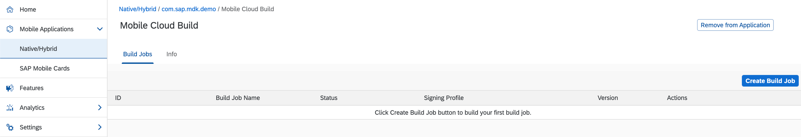

3. Select **Mobile Development Kit Client** from **Client Type** dropdown.

    !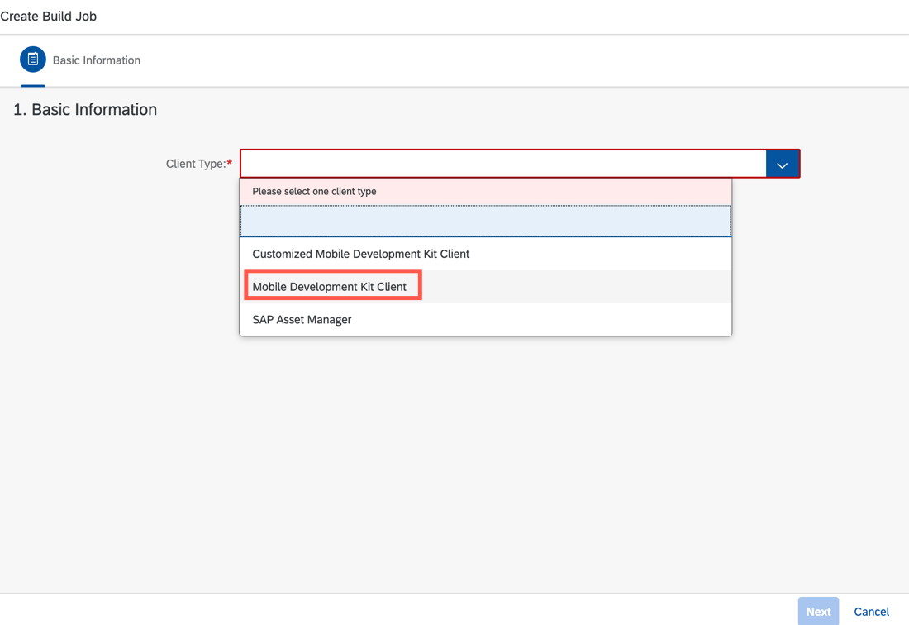

4. Provide required values and click **Next**.

    !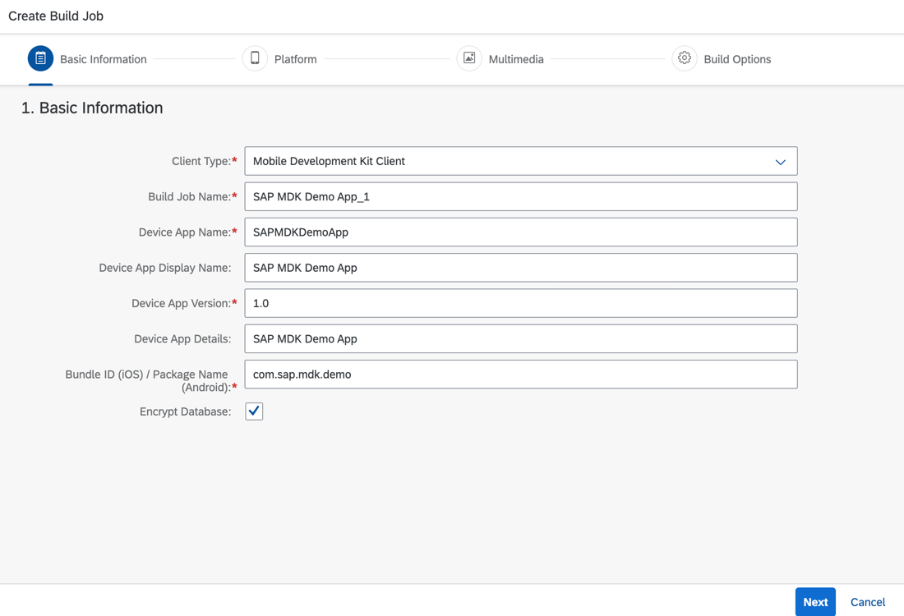

5. In **Platform** step, provide a unique value to the **URL Scheme**.

    If you have a Firebase configuration for your client, browse to select the `google-services.json` file and click **Next**.

    !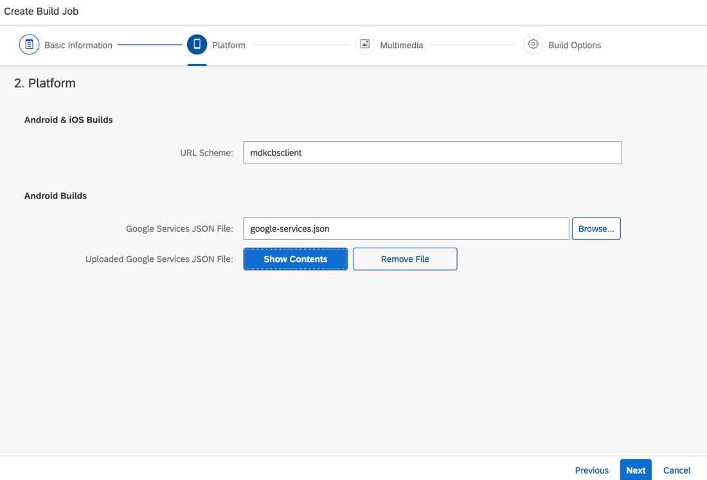

    >**Google Services JSON File**: The Firebase Android configuration file associated with your app in your Firebase project.

    >For Android builds: The packaging format to use for the build, including APK (Android Package Kit, the default) or AAB (Android App Bundle). Since Google requires applications uploaded to the Google Play Store be built in the AAB format, select this option if that is your plan. To install an AAB binary without using Google Play Store, you must download the AAB and use Google's `bundletool` to extract an install-ready binary from the AAB and to install that binary. Refer to their documentation on `bundletool` for more details.

6. In **Multimedia** step, you may upload an image to use for the app logo and click **Next**.

    !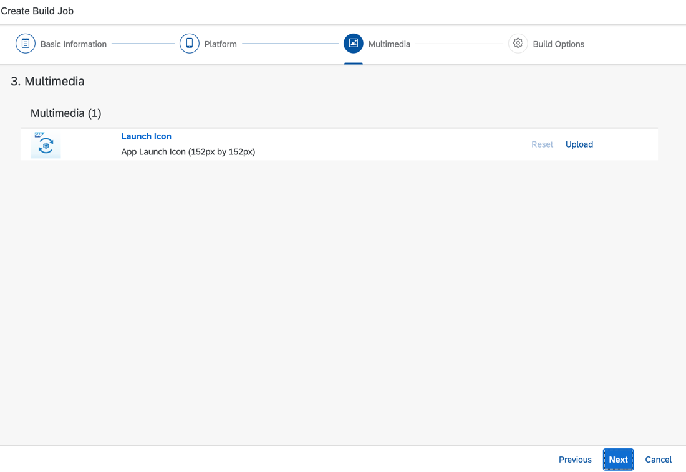

7. In **Build Options** step, select respective Signing profile(s), set minimum platform version, select a supported SDK version and click **Finish**.

    !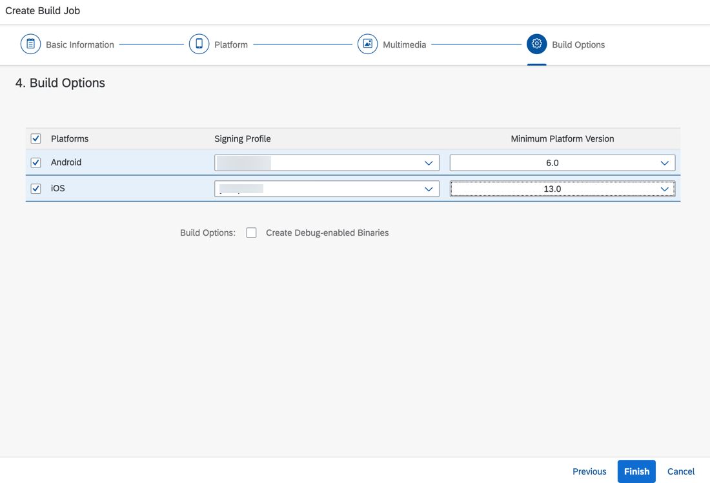

    >The default version is always recommended (it will vary over time), but you can select an older SDK version.

8. Click **Build** to start the Build job.

    !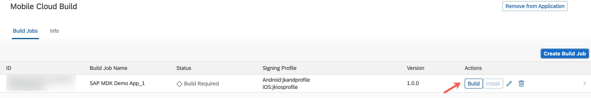

    After few minutes, Build should be completed. You can select each cloud build history row to view its current state, install, and download binaries.

    !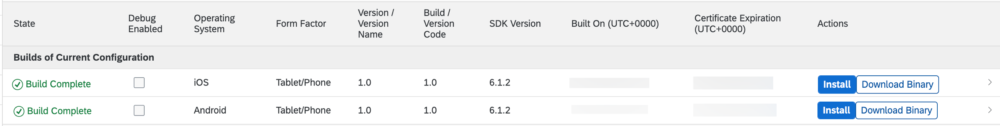

    You can find more details about packaging details in [help documentation](https://help.sap.com/doc/f53c64b93e5140918d676b927a3cd65b/Cloud/en-US/docs-en/guides/features/cloud-build/admin/customization.html#packaging-details-overview).

[OPTION END]

[OPTION BEGIN [Custom Client]]

1. In Mobile Services cockpit, navigate to `Mobile Applications` | `Native/MDK` | `com.sap.mdk.demo` | `Mobile Cloud Build`.

    > If you do not see **Mobile Cloud Build** feature in the **Assigned Features** list, click the **+** icon to add it.

2. Click **Create Build Job** to build your first build job.

    !

3. Select **Customized Mobile Development Kit Client** from **Client Type** dropdown.

    !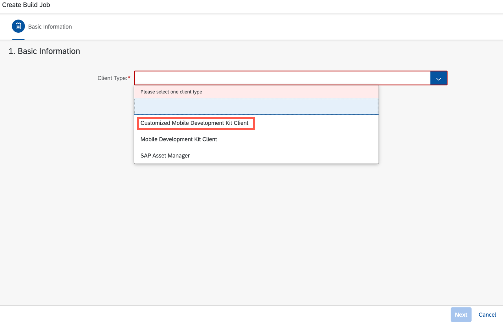

    >The build includes functionality to run customized extensions, application resources, and onboarding, and to include demo mode in your application.

4. Browse to your compressed MDK project as previously created.

    !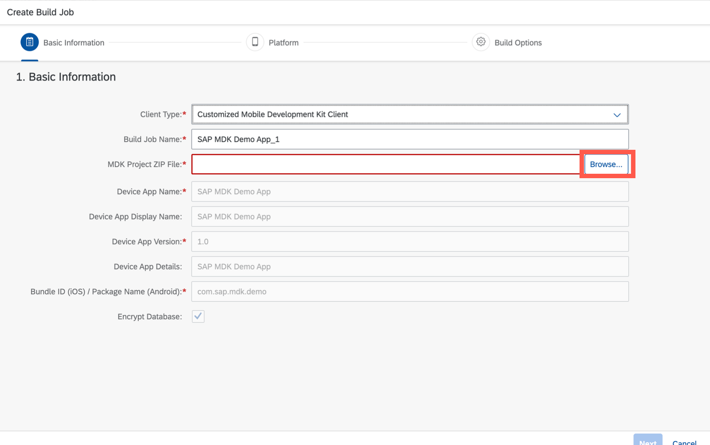

    Upon upload, Cloud Build service starts validating the ZIP file. If the ZIP file doesn't conform to the  `.mdkproject` structure, you may see build failures. Check the [documentation](https://help.sap.com/doc/f53c64b93e5140918d676b927a3cd65b/Cloud/en-US/docs-en/guides/features/cloud-build/admin/create.html#creating-a-build-job-for-customized-mobile-development-kit-clients) for more details.

    Once validation is successful, you will notice the values like Device App Name, Device App Display Name, Device App Version, Device App Details, Bundle ID, and Encrypt Database have been auto-filled/selected. These values were provided in your `MDKProject.json` and `BrandedSettings.json` as part of your local `.mdkproject`.

    !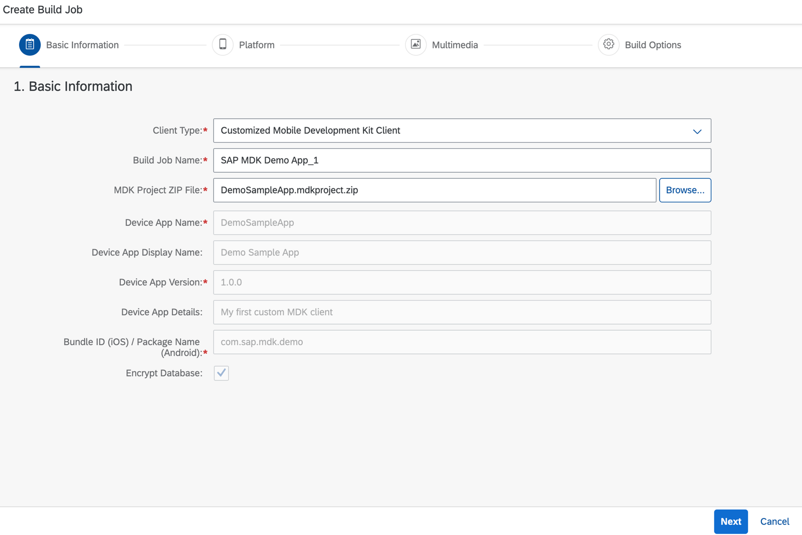

    Click **Next**.

5. In the **Platform** step, URL Scheme has been retrieved from the MDKProject.json. Click **Next**.   

    If you have a Firebase configuration for your client, browse to select the `google-services.json` file and click **Next**.

    !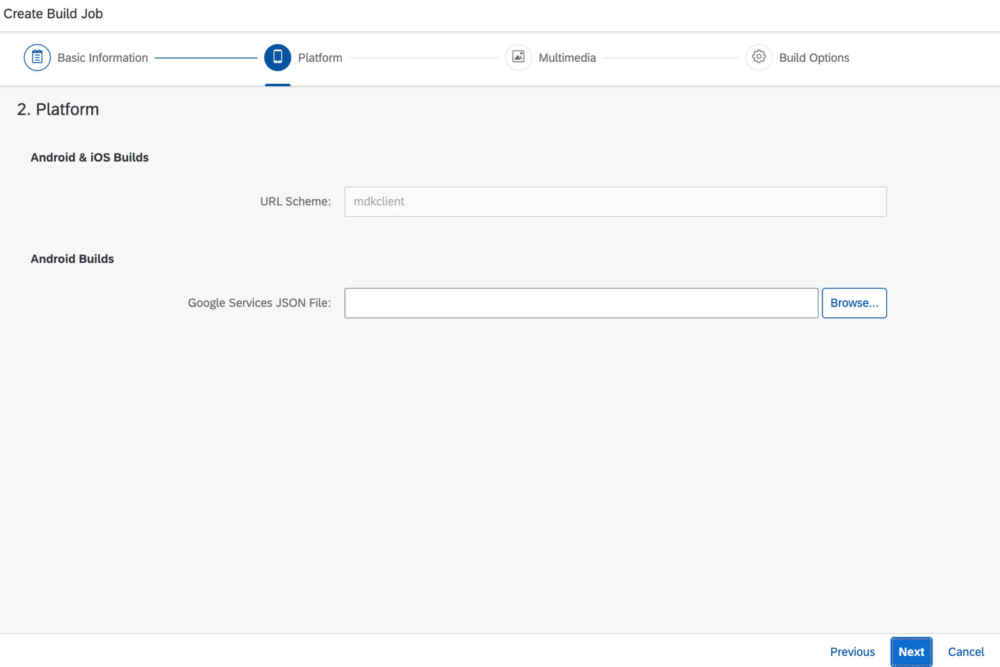

    >**Google Services JSON File**: The Firebase Android configuration file associated with your app in your Firebase project.
    If the google-services.json is available in the uploaded ZIP file, you will see option _Show Contents_ to view the contents of the JSON file. If it is not the right file, click _Remove File_ and then you can upload a new google-services.json file to override it.

    >For Android builds: The packaging format to use for the build, including APK (Android Package Kit, the default) or AAB (Android App Bundle). Since Google requires applications uploaded to the Google Play Store be built in the AAB format, select this option if that is your plan. To install an AAB binary without using Google Play Store, you must download the AAB and use Google's `bundletool` to extract an install-ready binary from the AAB and to install that binary. Refer to their documentation on `bundletool` for more details.

6. In **Multimedia** step, you may upload an image to use for the app logo and click **Next**.

    !

7. In **Build Options** step, select respective Signing profile(s), set minimum platform version, select a supported SDK version and click **Finish**.

    !

    >The default version is always recommended (it will vary over time), but you can select an older SDK version.

8. Click **Build** to start the Build job.

    !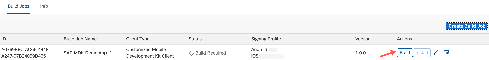

    After few minutes, Build should be completed. You can select each cloud build history row to view its current state, install, and download binaries.

    !

    You can find more details about packaging details in [help documentation](https://help.sap.com/doc/f53c64b93e5140918d676b927a3cd65b/Cloud/en-US/docs-en/guides/features/cloud-build/admin/customization.html#packaging-details-overview).

[OPTION END]

[VALIDATE_1]
[ACCORDION-END]

[ACCORDION-BEGIN [Step 4: ](Install/download binary)]

[OPTION BEGIN [Android]]

You can install this new custom MDK client app either by scanning QR code from Android phone camera app (click **Install**) or download binary (APK) locally and install in your device via IDEs like Android Studio or via other means.

!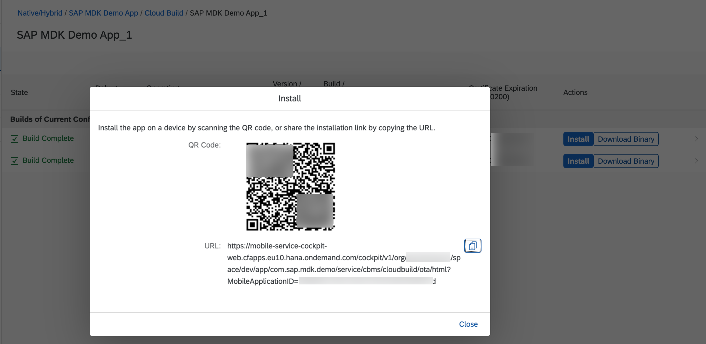

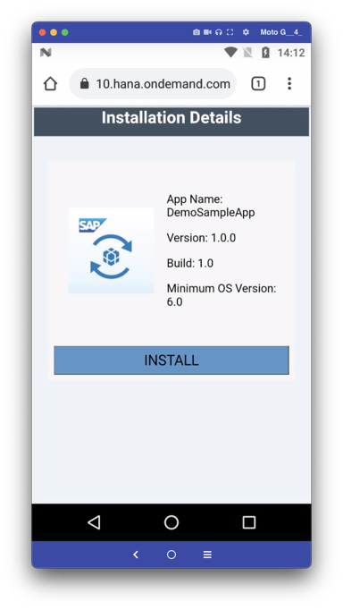
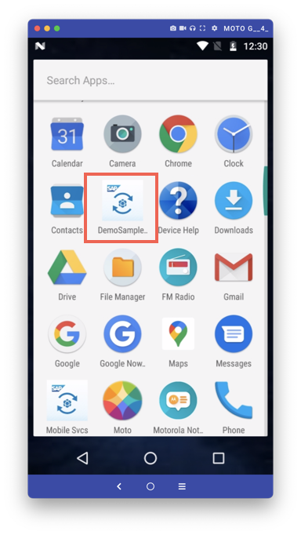

[OPTION END]

[OPTION BEGIN [iOS]]

You can install this new custom MDK client app either by scanning QR code from iPhone phone camera app (click **Install**) or download binary (IPA) locally and install in your device via IDEs like Xcode or via other means.

!

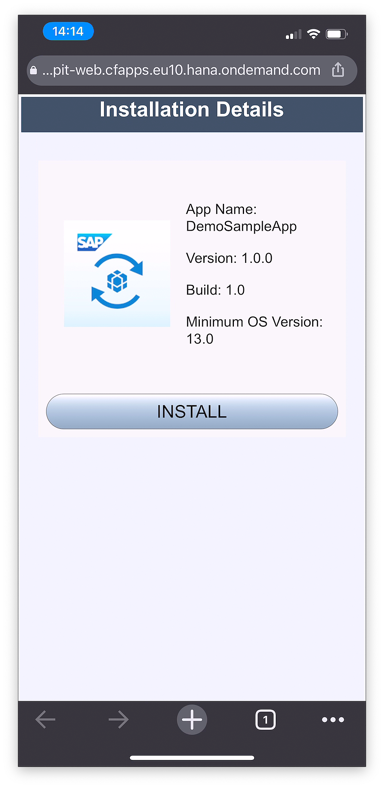
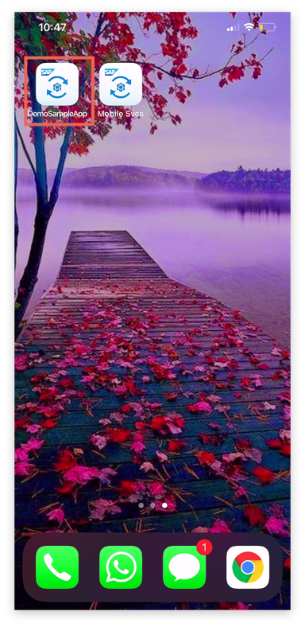

[OPTION END]

[VALIDATE_4]
[ACCORDION-END]

---
