## Prerequisites
- You have created an MDK app as described in [Get Started with the Mobile Development Kit](https://developers.sap.com/mission.mobile-dev-kit-get-started.html).

## Details
### You will learn
  - How to create a customer record with information such as name, email, phone number & date of birth
  - How to store this record locally
  - How to sync local changes with backend

---

[ACCORDION-BEGIN [Step 1: ](Create new page for new customer record)]

Make sure that you have created an MDK app as described in [Get Started with the Mobile Development Kit](https://developers.sap.com/mission.mobile-dev-kit-get-started.html).

In this step, you will create the _Create Customer_ page as a **Form Cell Page**. This type of page allows for form input style changes. The page will provide only a subset of items available on the Customer Detail page. You will add the fields that will be editable by the end-user.

Right click on the **Pages** folder | **New MDK Page** | **Form Cell Page** | **Next**.

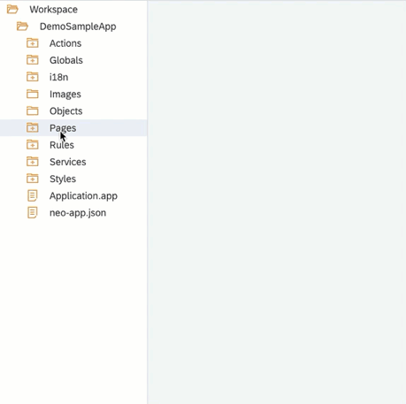

>A Form Cell Page is suitable for pages that generate new objects or modify existing objects. It includes a form cell container by default. You can add form sections, multiple containers or action controls to this page. Under each container section, you can add various container items.

>You can find more details about [Form Cell page](https://help.sap.com/viewer/977416d43cd74bdc958289038749100e/Latest/en-US/65c0ed1f448346cb89fa84992dc5df9c.html).

Enter the Page Name `CreateCustomer` and click **Next** and the **Finish** on the Confirmation step.

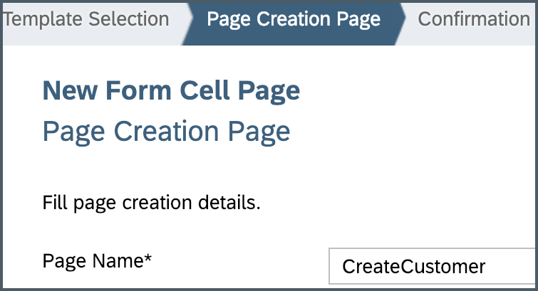

In the Properties pane, set the **Caption** to **Create Customer**.

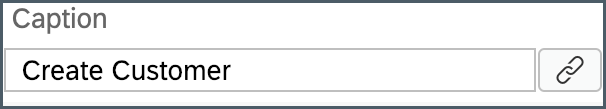

Now, you will add the fields (like first name, last name, phone, email address & date of birth) for creating a new customer record by the end-user.

In the Layout Editor, expand the **Control** | **Container Item** section.

>You can find more details about [available controls in Form Cell page](https://help.sap.com/viewer/977416d43cd74bdc958289038749100e/Latest/en-US/a0358d7a9c3b46e0819f28ae779def24.html).

Drag and drop a **Simple Property** onto the Page area.

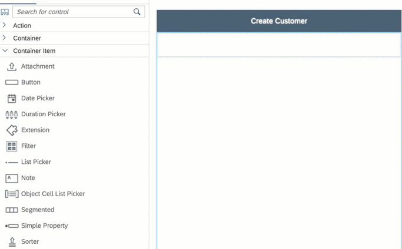

Drag and drop three additional Simple Property controls onto the page so you have four total controls.

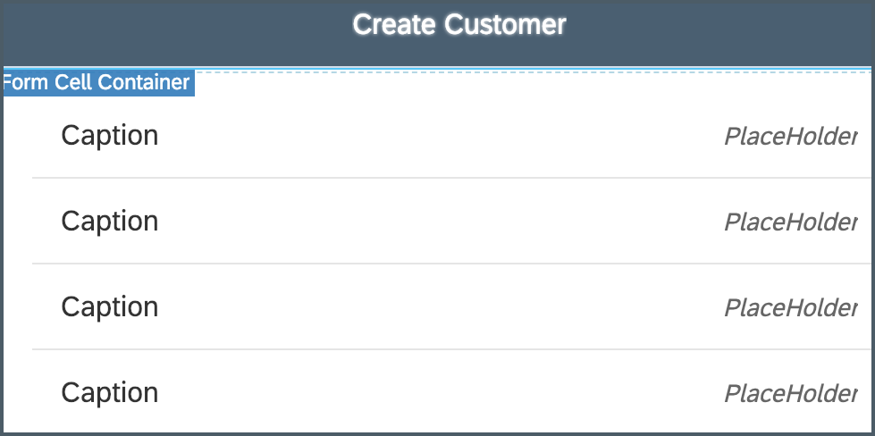

Select the first **Simple Property control** and provide the below information:

| Property | Value |
|----|----|
| `Name`| `FCCreateFirstName` |
| `Caption` | `First Name` |
| `isEditable`| `true` |

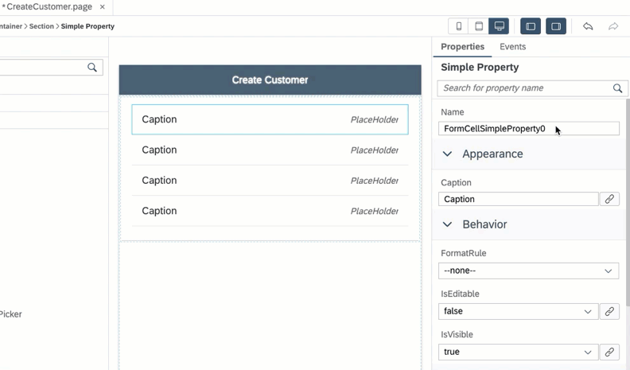

Select the second **Simple Property control** and provide the below information:

| Property | Value |
|----|----|
| `Name`| `FCCreateLastName` |
| `Caption` | `Last Name` |
| `isEditable`| `true` |

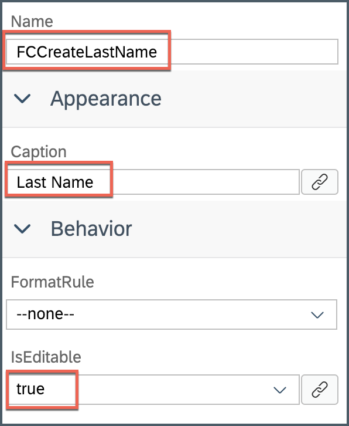

Select the third **Simple Property control** and provide the below information:

| Property | Value |
|----|----|
| `Name`| `FCCreatePhone` |
| `Caption` | `Phone` |
| `isEditable`| `true` |

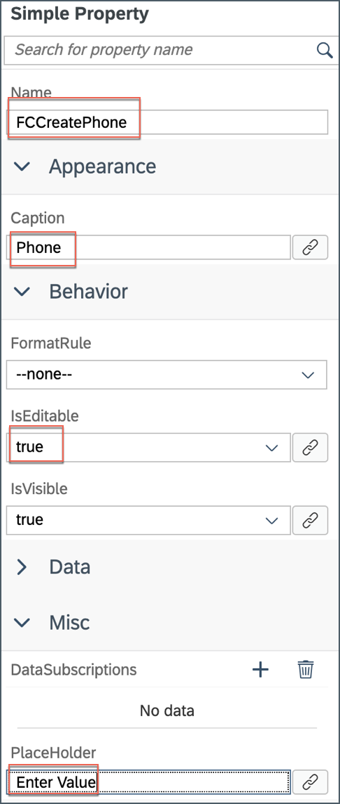

Select the last **Simple Property control** and provide the below information:

| Property | Value |
|----|----|
| `Name`| `FCCreateEmail` |
| `Caption` | `Email` |
| `isEditable`| `true` |

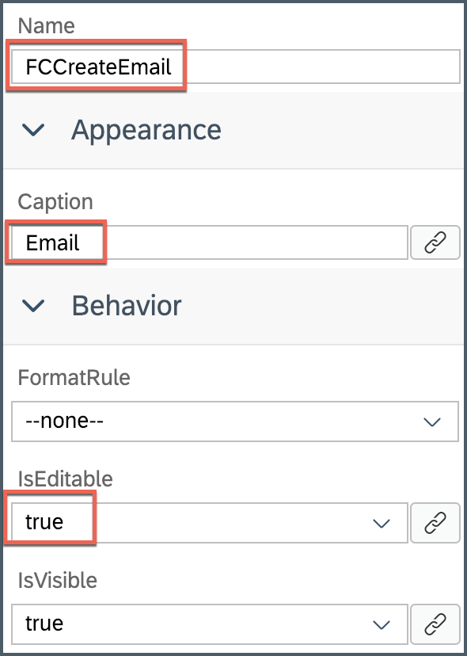

Drag and drop a **Date Picker** control onto the page area for date of birth parameter.

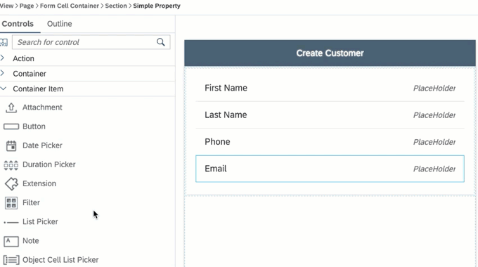

Provide the below information:

| Property | Value |
|----|----|
| `Name`| `FCCreateDOB` |
| `Caption` | `DOB` |

Save the changes to the `CreateCustomer` page.

[DONE]
[ACCORDION-END]

[ACCORDION-BEGIN [Step 2: ](Add cancel button on create customer page)]

Now, you will add a button on the Create Customer page and set it's `onPress` to **Close Page-Cancel action**.

Drag and drop an **Action Bar Item** to the upper left corner of the action bar.

>Action Bar Item is a button that users can use to fire actions when pressed. You can add an Action Bar Item only to the Action Bar (normally at the top of the page).

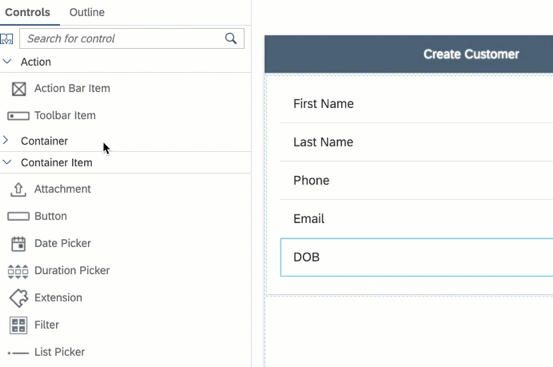

In the **Properties** pane, click the **link icon** to open the object browser for the **System Item** property.

Double click on the **Cancel** type and click **OK**.

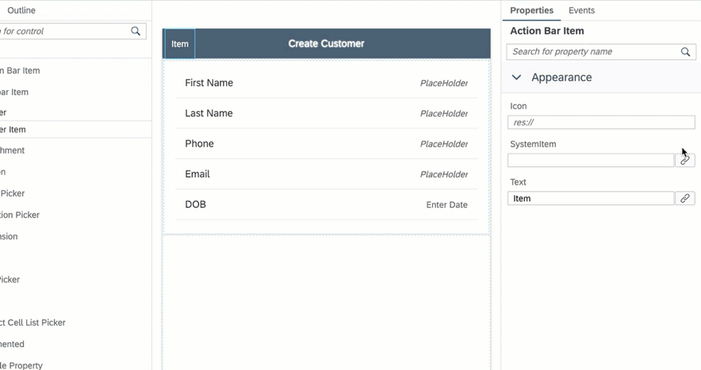

>System Item are predefined system-supplied icon or text. Overwrites _Text_ and _Icon_ if specified.

Now, you will set `onPress` to **Close Page-Cancel action**.

In **Events** tab, click the **link icon** for the `OnPress` property to open the object browser.

Double click on the `ClosePageCancel` action and click **OK** to set it as the `OnPress` Action.

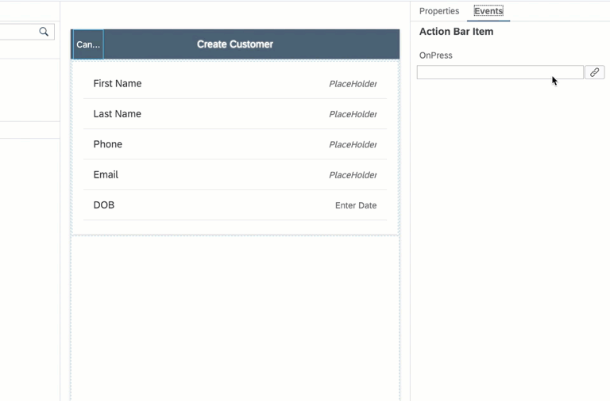

Save the changes to the `CreateCustomer` page.

[DONE]
[ACCORDION-END]

[ACCORDION-BEGIN [Step 3: ](Create navigation action)]

Now, create a navigation action that will open the _Create Customer page_ when executed.

Right click on the **Actions** folder | **New MDK Action** | **Navigation Action** | **Next**.

Provide the below information:

| Property | Value |
|----|----|
| `Action Name`| `ShowCreateCustomer` |
| `Page To Open` | select `CreateCustomer.page` |
| `ModalPage`| check this option |
| `ModalPage Fullscreen`| check this option |

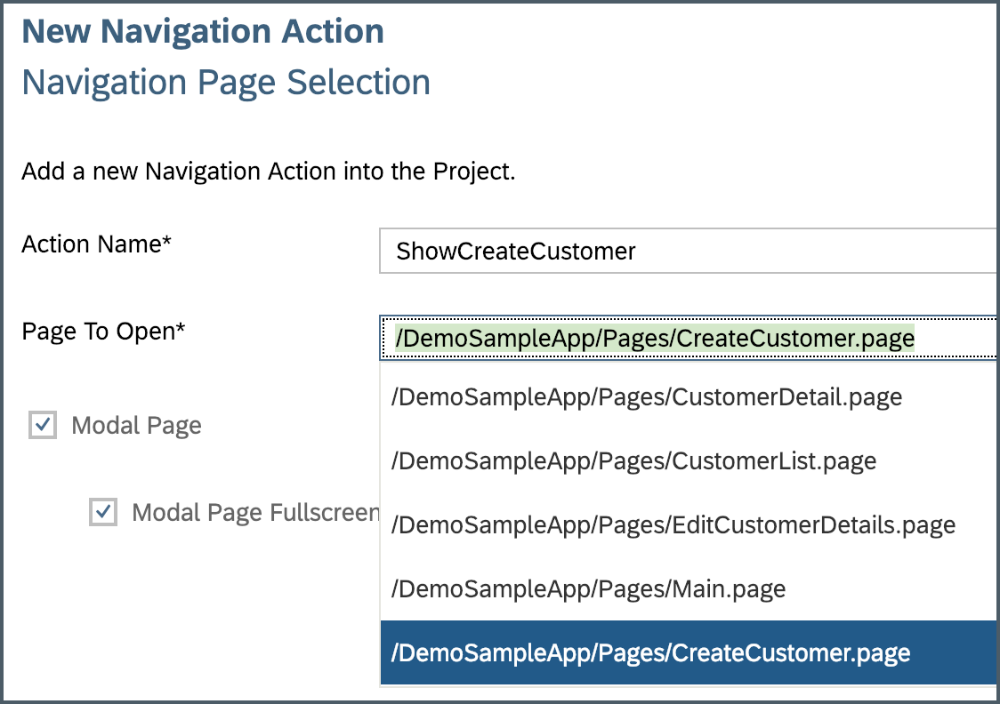

Click **Next** and then **Finish** on the confirmation step.

[DONE]
[ACCORDION-END]

[ACCORDION-BEGIN [Step 4: ](Add create button to customer list page)]

You will add a button to the _Customer list page_ called **Add**. You will link this button to the navigation action you just created. This event will open the _Create Customer page_ when the Add button is pressed by the end-user.

In `CustomerList` page, drag and drop an **Action Bar Item** to the upper right of the action bar.

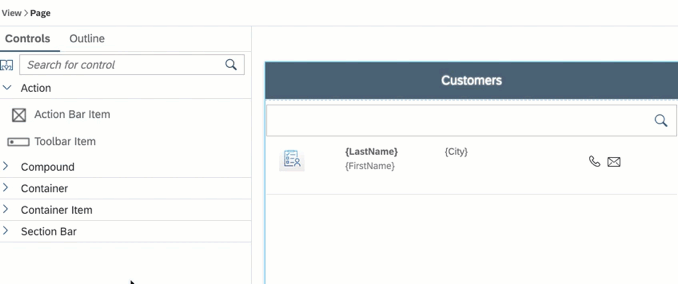

In the Properties pane, set **Position** to **Right**.

Click the **link icon** to open the object browser for the System Item property.

Double click on the **Add** type and click **OK**.

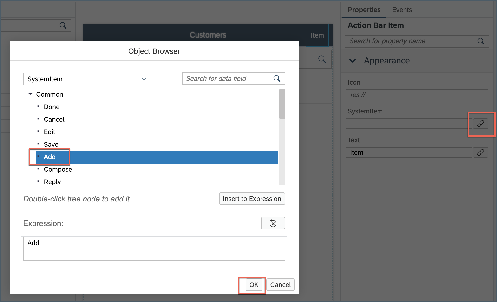

In the Properties pane, click the **Events** tab, click the **link icon** for the `OnPress` property to open the object browser.

Double Click on the `ShowCreateCustomer` action and click **OK** to set it as the `OnPress` Action.

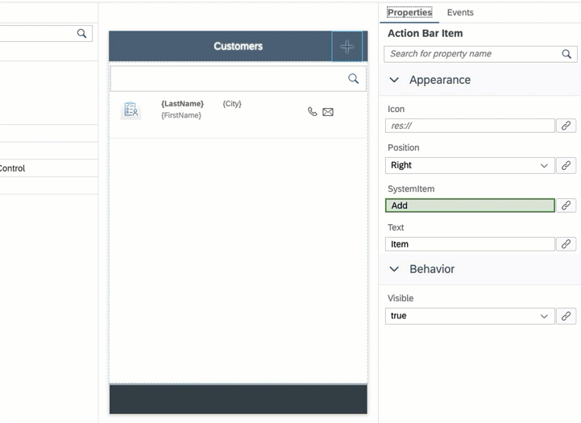

Save the changes to the `CustomerList` page.

[DONE]
[ACCORDION-END]

[ACCORDION-BEGIN [Step 5: ](Store the created data locally)]

The next step is to store newly created record locally for an offline application or send the new record directly back to the backed for online applications. You will now create an action to map the changes received from the Create Customer page to the corresponding field in the OData service. You will also show a failure message if the create action fails to save the changes.

First, define a failure message.

Right click on the **Actions** folder | **New MDK Action** | **Message Action** | **Next**.

Provide the below information:

| Property | Value |
|----|----|
| `Action Name`| `CreateCustomerFailure` |
| `Type` | select `Message` |
| `Message` | `Failed to Create Customer record` |
| `Title` | `Create Customer` |
| `OKCaption` | `OK` |
| `OnOK` | `--None--` |
| `CancelCaption` | leave it blank |
| `OnCancel` | `--None--`|

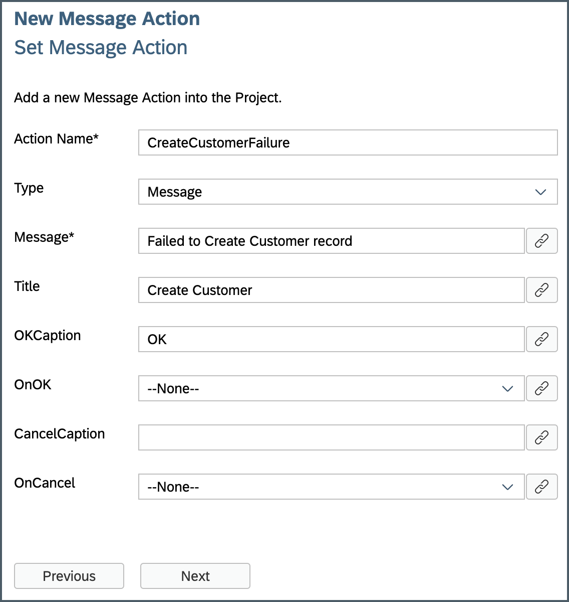

Click **Next** and then **Finish** on the Confirmation step.

Next, you will create the **OData Create action** to update entity action that will map the changes to the correct entities in the OData service and save the changes.

>You can find more details about [Create Entity Action](https://help.sap.com/viewer/977416d43cd74bdc958289038749100e/Latest/en-US/9cafb37ca8ad49e6930dba857352a3e6.html).

Right click on the **Actions** folder | **New MDK Action** | **OData Action** | **Next**.

Provide the below information:

| Property | Value |
|----|----|
| `Action Name`| `CreateCustomer` |
| `Type` | `CreateEntity` |
| `Service`| `SampleServiceV2` |
| `EntitySet` | `Customers` |

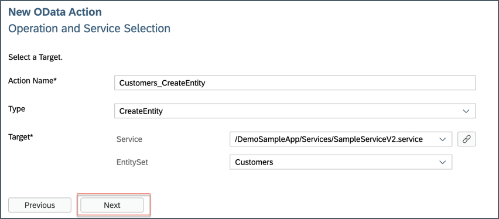

Click **Next**.

In **Property and Create Links** step, uncheck **City**.

Since in _Create Customer page_, we defined five properties (First Name, Last Name, Phone, Email & date of birth) to be added, now in this step, we will bind them to respective UI Controls.

Check the `DateOfBirth` property and click the **link icon** to open the object browser.

Change the drop down in the object browser to `Controls & ClientData`, click the **Current Page** radio button.

In the search box start typing the control name `FCCreateDOB`. The list will filter down to show the matching values. Double click on the **Value (Value)** entry under the `FCCreateDOB` field and click **OK** to set binding.

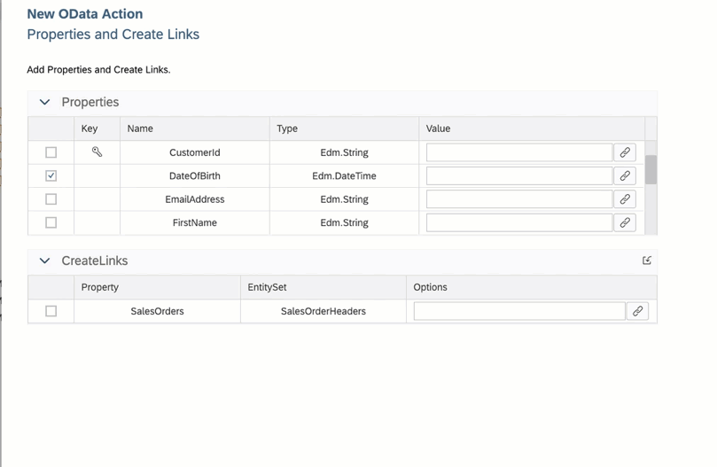

Repeat the above step for remaining properties: `EmailAddress`, `FirstName`, `LastName` and `PhoneNumber`.

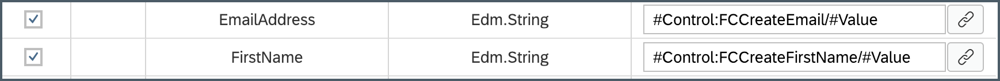

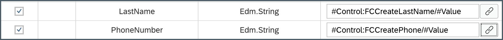

Click **Next** and **Finish** on the confirmation screen. The action editor will open with the `CreateCustomer` action loaded.

Next, define _Success_ and _Failure_ actions for `CreateCustomer` action.

In the action editor for the new action, expand the **Common Action Properties** and select `ClosePageComplete` action for **Success Action** and `CreateCustomerFailure` action for **Failure Action**.

>When `CreateCustomer` action gets executed successfully then `ClosePageComplete` action will be triggered or if `CreateCustomer` action fails then `CreateCustomerFailure` action will be triggered.

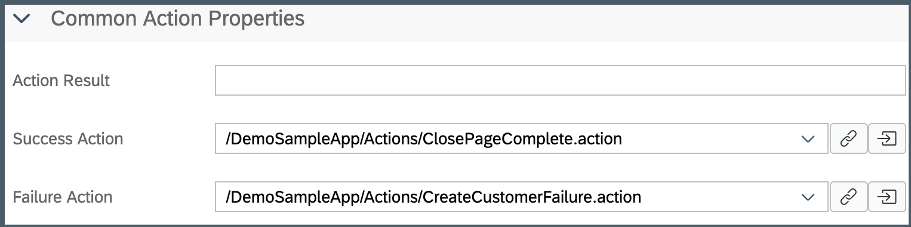

Save the changes to the `CreateCustomer` action.

Next, you will set the `OnPress` of the _Create_ button.

Now that the Create action is created, you will need to call the Create action when the end-user presses the **Save** button. You will add a **Save** button on the `CreateCustomer.page` and link it to the `CreateCustomer` action.

In `CreateCustomer.page`, **drag and drop** an **Action Bar Item** to the upper right corner of the action bar.

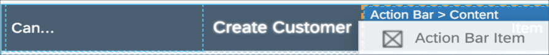

In the Properties pane, set **Position** to **Right**.

Click the **link** icon to open the object browser for the **System Item** property.

Double click on the **Save** type and click **OK**.

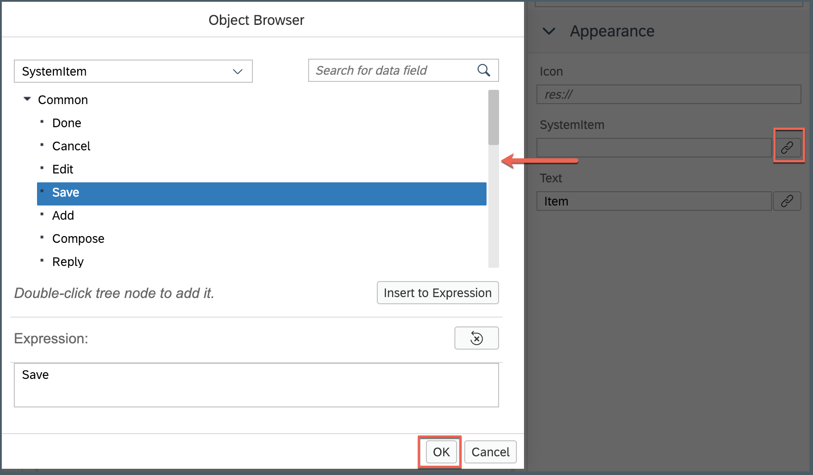

In the Properties pane | **Events** tab, click the **link** icon for the `OnPress` property to open the object browser, bind it to `CreateCustomer` action.

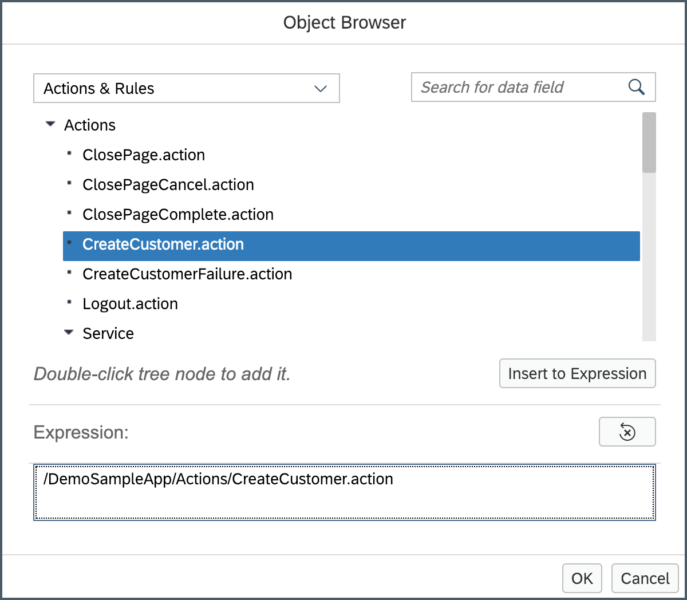

Save the changes to the `CreateCustomer` page.

[DONE]
[ACCORDION-END]

[ACCORDION-BEGIN [Step 6: ](Deploy, activate and test the application)]

Deploy the updated application to your MDK client.

Right click on the MDK Application in the project explorer pane and select **MDK Deploy and Activate**, click **Next** and deploy to Mobile Services.

>Make sure to select required **Destination Name** and **Application Id** as per your target environment (Neo or Cloud Foundry).

[OPTION BEGIN [iOS]]

Re-launch the app on your device, you may asked to authenticate with passcode or Touch ID. You will see a _Confirmation_ pop-up, click **OK**.

Click **Customer List**, click **+** icon to create a new record.

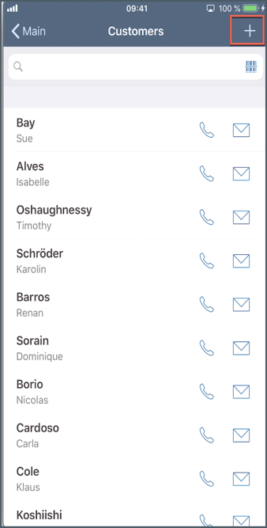

Enter the values, and click **Save**.

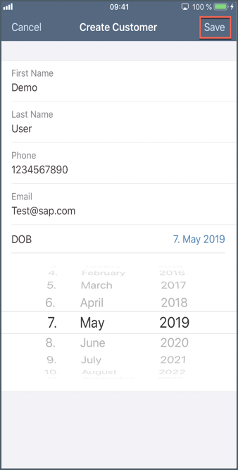

Local record gets created accordingly.

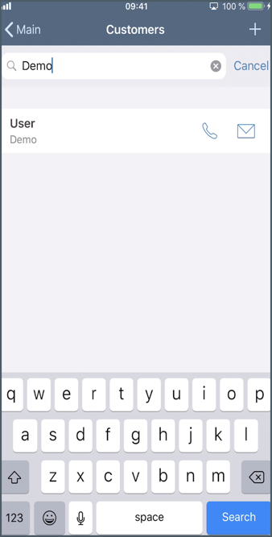

Since this is an Offline application, new entry is added to the request queue of the local store which needs to be sent or uploaded to the backend explicitly.  

>MDK base template has added a **Sync** button on main page of the app to upload local changes from device to the backend and to download the latest changes from backend to the device. Actions | Service | `UploadOffline.action` & `DownloadOffline.action`.

On Main page, click **Sync**, a successful message will be shown.

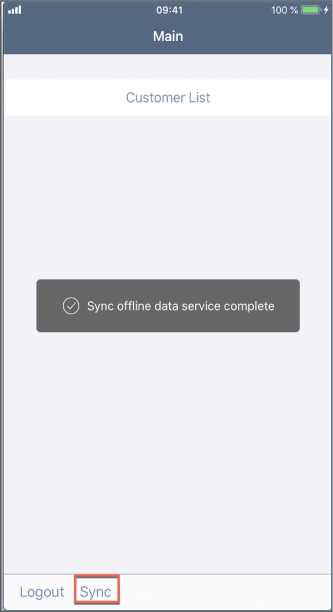

[OPTION END]

[OPTION BEGIN [Android]]

Re-launch the app on your device, you may asked to authenticate with passcode or Fingerprint. You will see a _Confirmation_ pop-up, click **OK**.

Click **Customer List**, click **+** icon to create a new record.

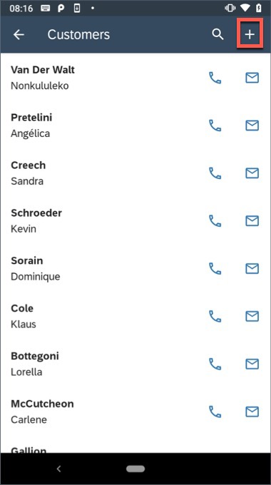

Enter the values, and click save icon.

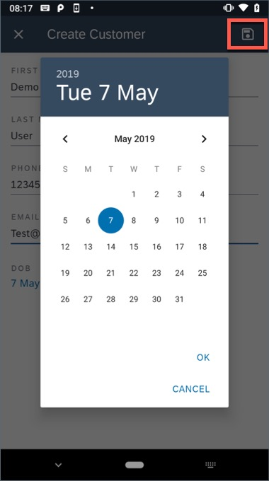

Local record gets created accordingly.

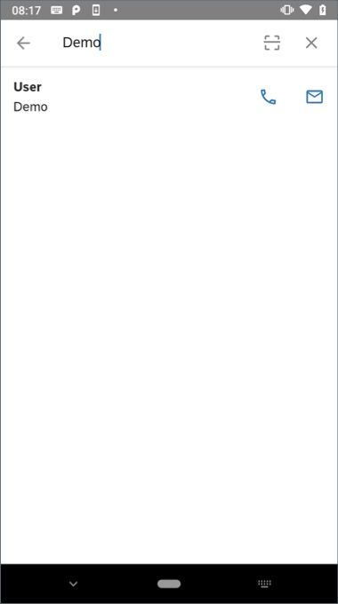

Since this is an Offline application, new entry is added to the request queue of the local store which needs to be sent or uploaded to the backend explicitly.  

>MDK base template has added a **Sync** button on main page of the app to upload local changes from device to the backend and to download the latest changes from backend to the device. Actions | Service | `UploadOffline.action` & `DownloadOffline.action`.

On Main page, click **SYNC**, a successful message will be shown.

[OPTION END]

You can cross verify if a record has been updated in the backend.

>Backend URL can be found in Mobile Services Cockpit.

>Mobile Applications | Native/Hybrid | Click on the MDK App | Sample Back End | click Root URL `v2` | append `/Customers`

>As Sync is pressed, `UploadOffline.action` gets trigger to upload local changes from device to the backend and on success of this call, `DownloadOffline.action` is being called.

[VALIDATE_1]
[ACCORDION-END]

---
