## Prerequisites
- You have created an MDK app as described in [Create Your First Mobile App with the Mobile Development Kit (MDK)](mission.mobile-dev-kit-get-started).

## Details
### You will learn
  - How to create a customer record
  - How to store changes locally on Mobile app and sync these changes with backend
  - How to update a record in web application

If you didn't follow the prerequisite then you may clone an existing project from [GitHub repository](https://github.com/SAP-samples/cloud-mdk-tutorial-samples/tree/master/2-Create-Your-First-Mobile-App-with-the-Mobile-Development-Kit) to start with this tutorial.

---

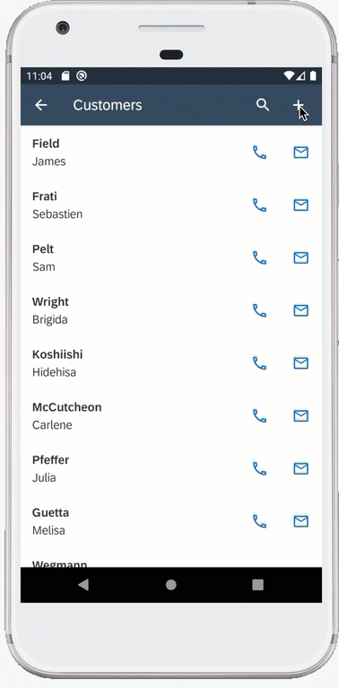

[ACCORDION-BEGIN [Step 1: ](Create new page for new customer record)]

In this step, you will create the `Customers_Create.page` as a **Form Cell Page**. This type of page allows for form input style changes. The page will provide only a subset of items available on the Customer Detail page. You will add the fields that will be editable by the end-user.

1. Right-click the **Pages** folder | **MDK: New Page** | **Form Cell Page** | **Next**.

    !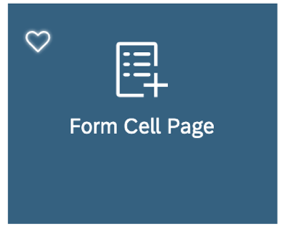

    >A Form Cell Page is suitable for pages that generate new objects or modify existing objects. It includes a form cell container by default. You can add form sections, multiple containers or action controls to this page. Under each container section, you can add various container items.

    >You can find more details about [Form Cell page](https://help.sap.com/doc/f53c64b93e5140918d676b927a3cd65b/Cloud/en-US/docs-en/guides/features/fiori-ui/mdk/formcell-page.html).

2. Enter the Page Name `Customers_Create` and click **Next** and the **Finish** on the Confirmation step.

    !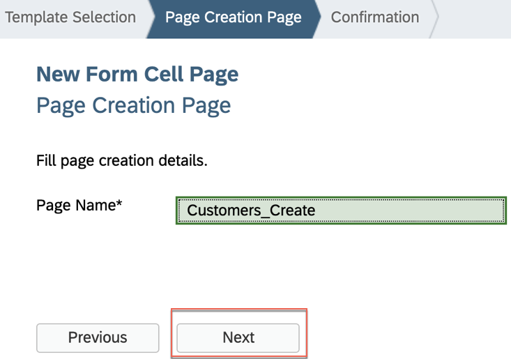

3. In the **Properties** pane, set the **Caption** to **Create Customer**.

    !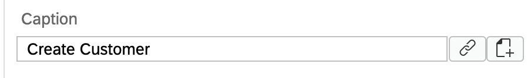

    Now, you will add the fields (like first name, last name, phone, email address & date of birth) for creating a new customer record by the end-user.

4. In the Layout Editor, expand the **Controls** section, drag and drop a **Simple Property** onto the Page area.

    !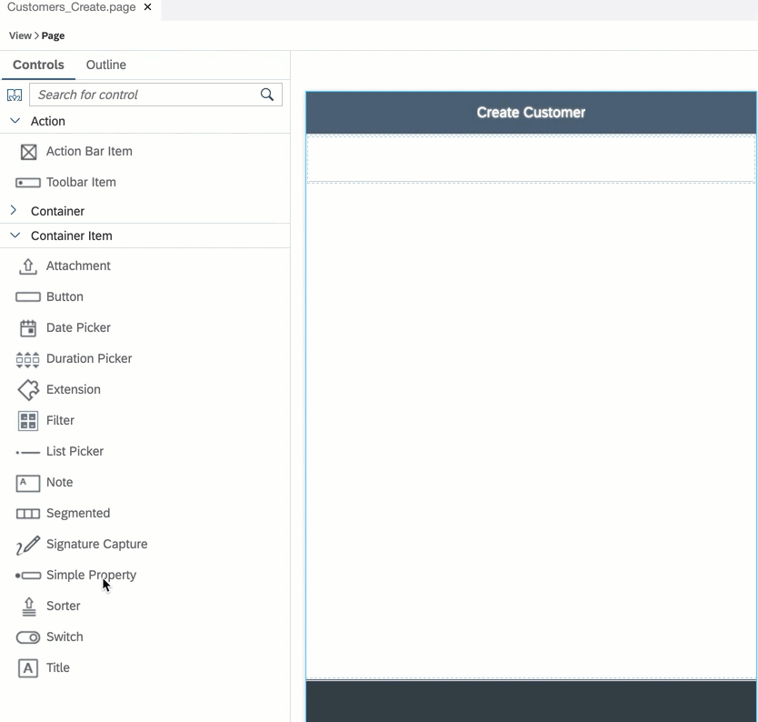

    >You can find more details about [available controls in Form Cell page](https://help.sap.com/doc/69c2ce3e50454264acf9cafe6c6e442c/Latest/en-US/docs-en/reference/schemadoc/Page/FormCell/Container.schema.html).

5. Drag and drop three additional Simple Property controls onto the page so you have four total controls.

    !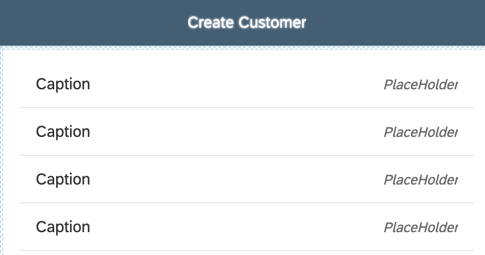

6. Select the first **Simple Property control** and provide the below information:

    | Property | Value |
    |----|----|
    | `Name`| `FCCreateFirstName` |
    | `Caption` | `First Name` |
    | `PlaceHolder`| `Enter Value` |

    !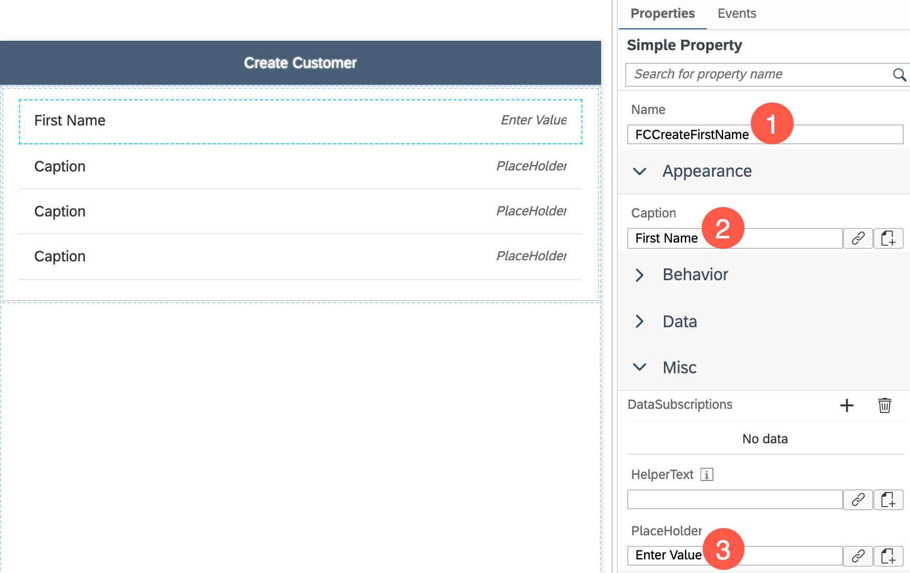

7. Select the second **Simple Property control** and provide the below information:

    | Property | Value |
    |----|----|
    | `Name`| `FCCreateLastName` |
    | `Caption` | `Last Name` |
    | `PlaceHolder`| `Enter Value` |

    !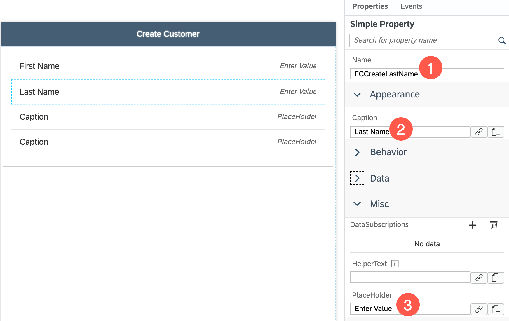

8. Select the third **Simple Property control** and provide the below information:

    | Property | Value |
    |----|----|
    | `Name`| `FCCreatePhone` |
    | `Caption` | `Phone` |
    | `PlaceHolder`| `Enter Value` |

    !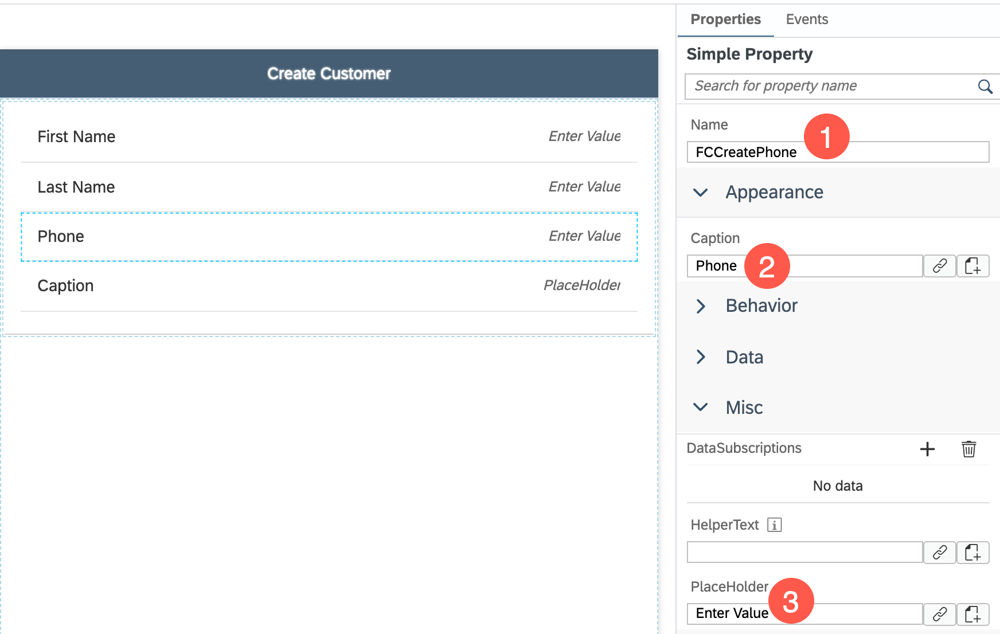

9. Select the last **Simple Property control** and provide the below information:

    | Property | Value |
    |----|----|
    | `Name`| `FCCreateEmail` |
    | `Caption` | `Email` |
    | `KeyboardType` | `Email` |
    | `PlaceHolder`| `Enter Value` |

    !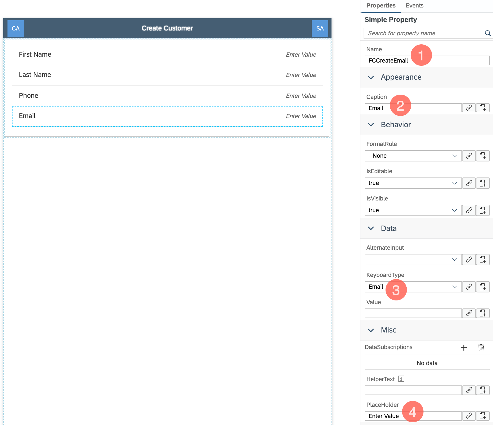

    >[`KeyboardType`](https://help.sap.com/doc/69c2ce3e50454264acf9cafe6c6e442c/Latest/en-US/docs-en/reference/schemadoc/Page/FormCell/SimpleProperty.schema.html#keyboardtype) streamlines the data entry. When entering an email address, it would display the email address keyboard in mobile clients.

10. Drag and drop a **Date Picker** control onto the page area for date of birth parameter.

    !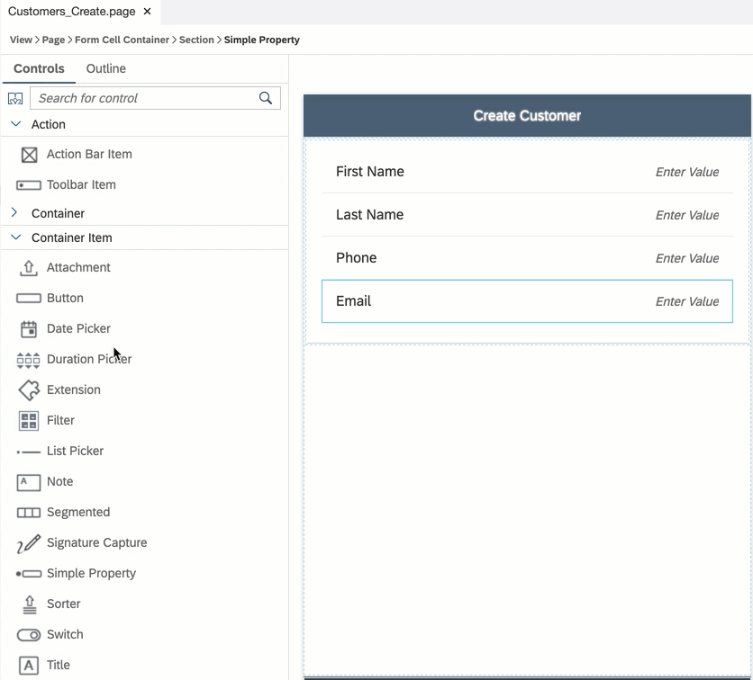

    Provide the below information:

    | Property | Value |
    |----|----|
    | `Name`| `FCCreateDOB` |
    | `Caption` | `DOB` |

[VALIDATE_2]
[ACCORDION-END]

[ACCORDION-BEGIN [Step 2: ](Add cancel button on create customer page)]

Now, you will add a button on the Create Customer page and set it's `onPress` to `CloseModalPage_Cancel.action`.

1. Drag and drop an **Action Bar Item** to the upper left corner of the action bar.

    >Action Bar Item is a button that users can use to fire actions when pressed. You can add an Action Bar Item only to the Action Bar (at the top of the page).

    !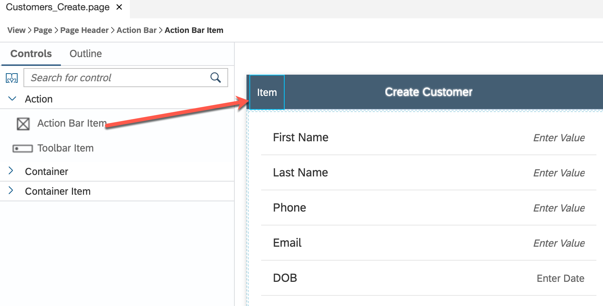

2. In the **Properties** pane, click the **link icon** to open the **Object Browser** for the **System Item** property. Double click the **Cancel** type and click **OK**.

    !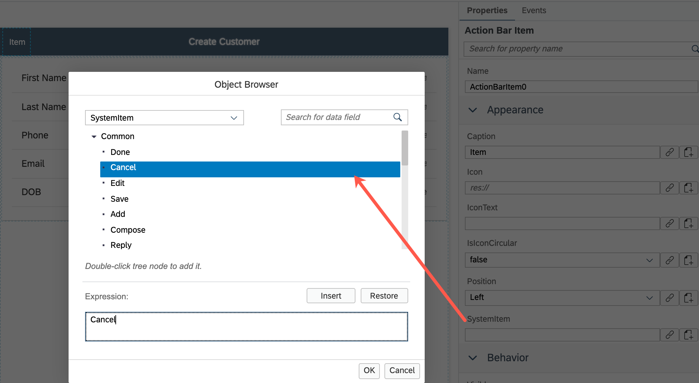

    >System Item are predefined system-supplied icon or text. Overwrites _Text_ and _Icon_ if specified.

3. Now, you will set the `onPress` event to `CloseModalPage_Cancel.action`.

    In **Events** tab, click the 3 dots icon for the `OnPress` property to open the object browser. Double click the `CloseModalPage_Cancel.action` and click **OK** to set it as the `OnPress` Action.

    !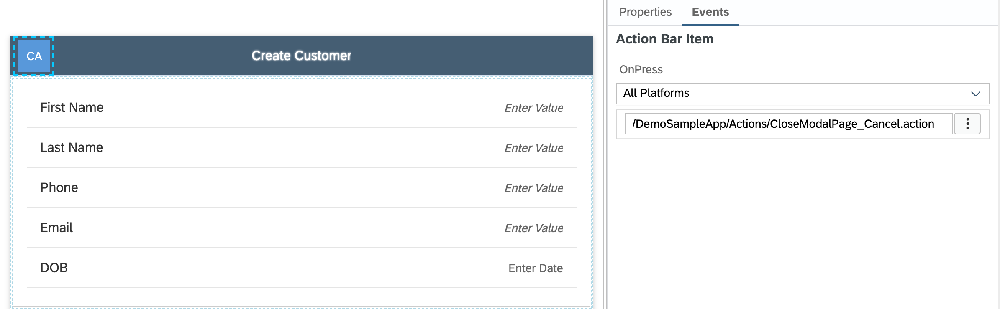

[DONE]
[ACCORDION-END]

[ACCORDION-BEGIN [Step 3: ](Create navigation action)]

Now, create a navigation action that will open the `Customers_Create.page` when executed.

1. Right-click the **Actions** folder | **MDK: New Action** | choose **MDK UI Actions** in **Category** | click **Navigation Action** | **Next**.

    !

2. Provide the below information:

    | Property | Value |
    |----|----|
    | `Action Name`| `NavToCustomers_Create` |
    | `PageToOpen` | Select `Customers_Create.page` from the dropdown |
    | `ModalPage`| Select `true` from the dropdown |

    !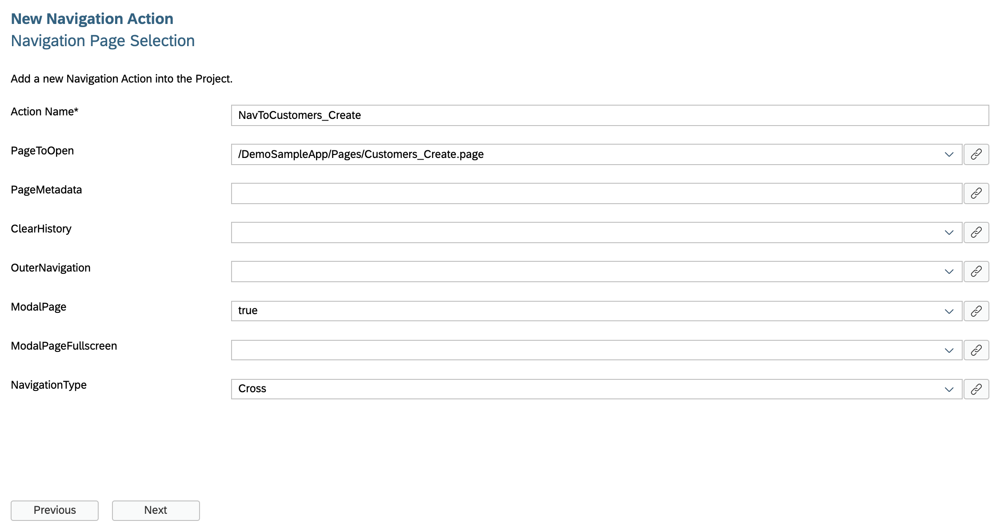

3. Click **Next** and then **Finish** on the confirmation step.

[DONE]
[ACCORDION-END]

[ACCORDION-BEGIN [Step 4: ](Add create button to customer list page)]

You will add a button to the `Customers_List.page` called **Add**. You will link this button to the navigation action you just created. This event will open the `NavToCustomers_Create.action` when the Add button is pressed by the end-user.

1. In `Customers_List.page`, drag and drop an **Action Bar Item** to the upper right of the action bar.

    !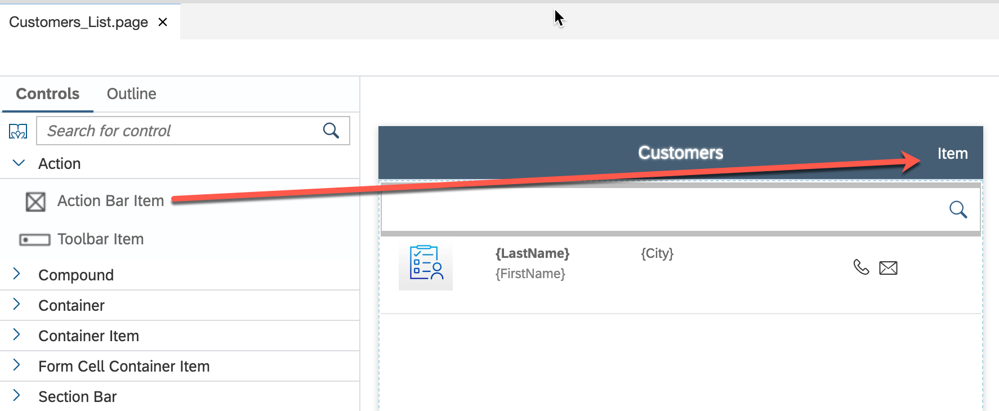

2. Click the **link icon** to open the object browser for the `SystemItem` property. Double click the **Add** type and click **OK**.

    !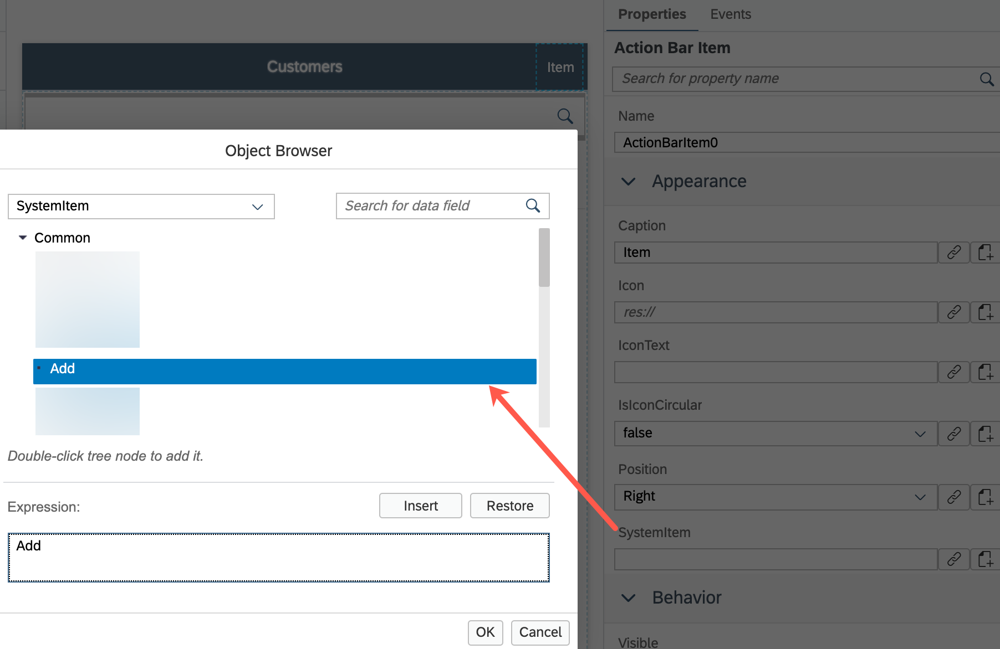

3. In the Properties pane, click the **Events** tab, click the 3 dots icon for the `OnPress` property to open the **Object Browser**. Double click the `NavToCustomers_Create.action` action and click **OK** to set it as the `OnPress` Action.

    !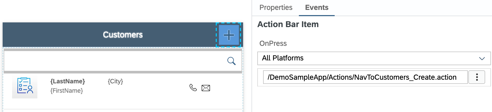

[DONE]
[ACCORDION-END]

[ACCORDION-BEGIN [Step 5: ](Store the created data locally)]

The next step is to store newly created record locally for an offline application or send the new record directly back to the backed for online applications. You will now create an action to map the changes received from the `Customers_Create.page` to the corresponding field in the OData service. You will also show a failure message if the create action fails to save the changes.

1. Right-click the **Actions** folder | **MDK: New Action** | choose **MDK Message Actions** in **Category** | click **Message Action** | **Next**.

    !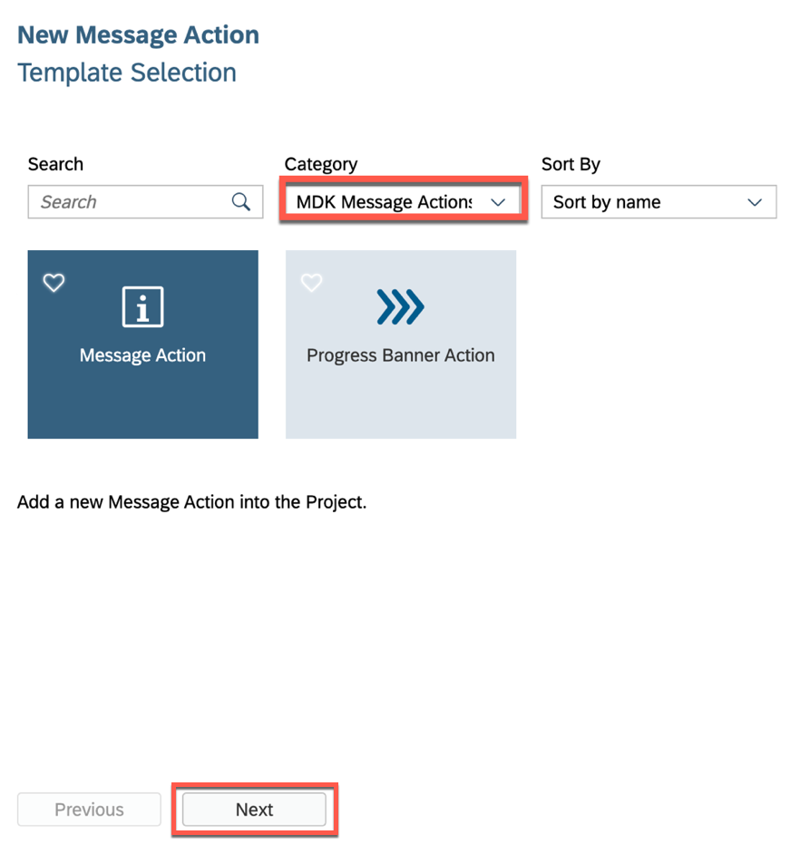

    Provide the below information:

    | Property | Value |
    |----|----|
    | `Action Name`| `CreateCustomerEntityFailureMessage` |
    | `Type` | Select `Message` from the dropdown |
    | `Message` | `Failed to Create Customer record` |
    | `Title` | `Create Customer` |
    | `OKCaption` | `OK` |
    | `OnOK` | `--None--` |
    | `CancelCaption` | leave it blank |
    | `OnCancel` | `--None--`|

    !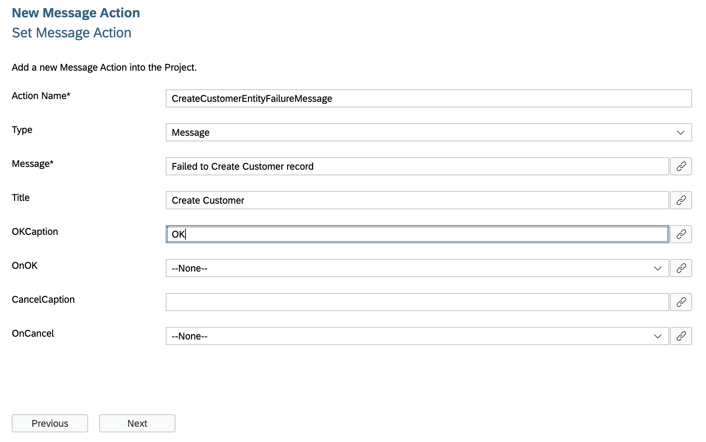

    Click **Next** and then **Finish** on the Confirmation step.

2. Next, you will create the **OData Create action** to update entity action that will map the changes to the correct entities in the OData service and save the changes.

    >You can find more details about [Create Entity Action](https://help.sap.com/doc/69c2ce3e50454264acf9cafe6c6e442c/Latest/en-US/docs-en/reference/schemadoc/Action/ODataService/CreateEntity.schema.html).

    Right-click the **Actions** folder | **MDK: New Action** | choose **MDK Data Actions** in **Category** | click **OData Action** | **Next**.

    !

    Provide the below information:

    | Property | Value |
    |----|----|
    | `Action Name`| `Customers_CreateEntity` |
    | `Type` | Select `CreateEntity` from the dropdown |
    | `Service`| Select `SampleServiceV2.service` from the dropdown |
    | `EntitySet` | Select `Customers` from the dropdown |

    !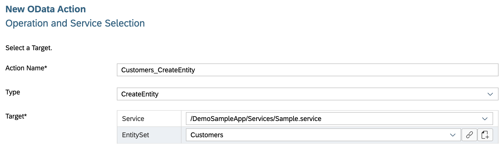

    Click **Next**.

    In **Property and Create Links** step, uncheck **City**.

    Since in `Customer_Create.page`, you defined five properties (First Name, Last Name, Phone, Email & date of birth) to be added, now in this step, you will bind them to respective UI Controls.

    Check the `DateOfBirth` property and click the **link icon** to open the object browser.

    Change the drop down in the object browser to `Controls & ClientData`, click the **Current Page** radio button.

    In the search box start typing the control name `FCCreateDOB`. The list will filter down to show the matching values. Double click the **Value (Value)** entry under the `FCCreateDOB` field and click **OK** to set binding.

    !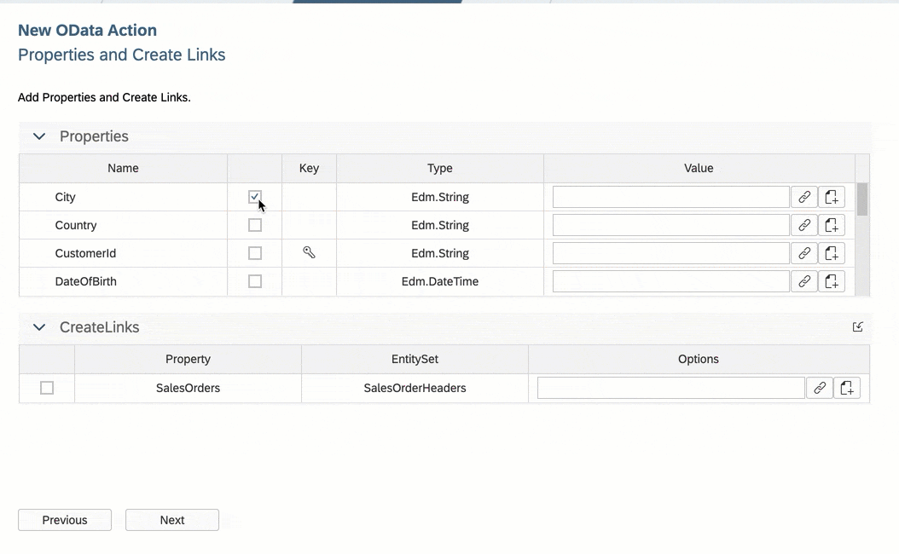

    Repeat the above step for remaining properties: `EmailAddress`, `FirstName`, `LastName` and `PhoneNumber`.

    !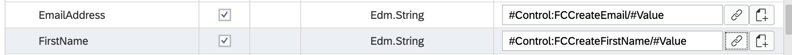

    !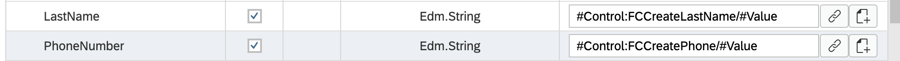

    Click **Next** and **Finish** on the confirmation screen. The action editor will open with the `Customers_CreateEntity.action` loaded.

3. Next, define _Success_ and _Failure_ actions for `Customers_CreateEntity.action`.

    In the action editor for the new action, expand the **Common Action Properties** and provide the below information:

    | Property | Value |
    |----|----|
    | `Success Action` | Click the link icon and bind it to `CloseModalPage_Complete.action` |
    | `Failure Action` | Click the link icon and bind it to `CreateCustomerEntityFailureMessage.action` |

    !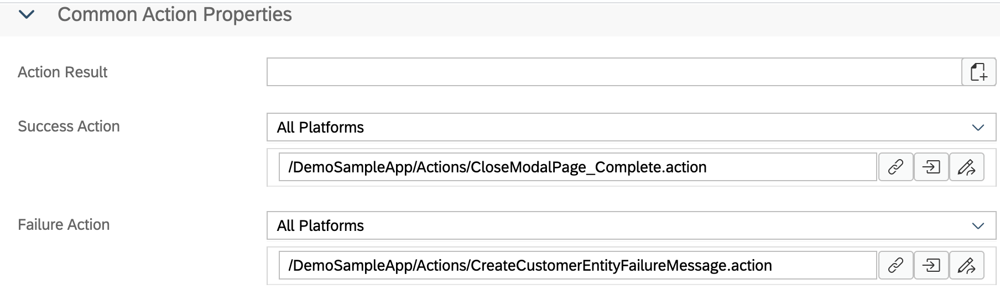

    >When `Customers_CreateEntity.action` gets executed successfully then `CloseModalPage_Complete.action` will be triggered or if `Customers_CreateEntity.action` fails then `CreateCustomerEntityFailureMessage.action` will be triggered.

4. Next, you will set the `OnPress` event of the _Save_ button.

    Now, that the Create action is created, you will need to call the Create action when the end-user presses the **Save** button. You will add a **Save** button on the `Customers_Create.page` and link it to the `Customers_CreateEntity.action`.

    In `Customers_Create.page`, **drag and drop** an **Action Bar Item** to the upper right corner of the action bar.

    !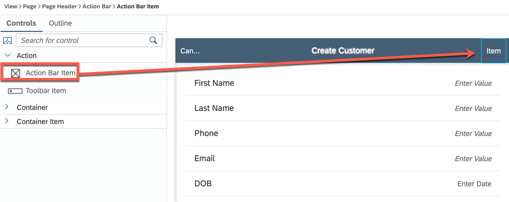

    Click the **link** icon to open the object browser for the **System Item** property.

    Double click the **Save** type and click **OK**.

    !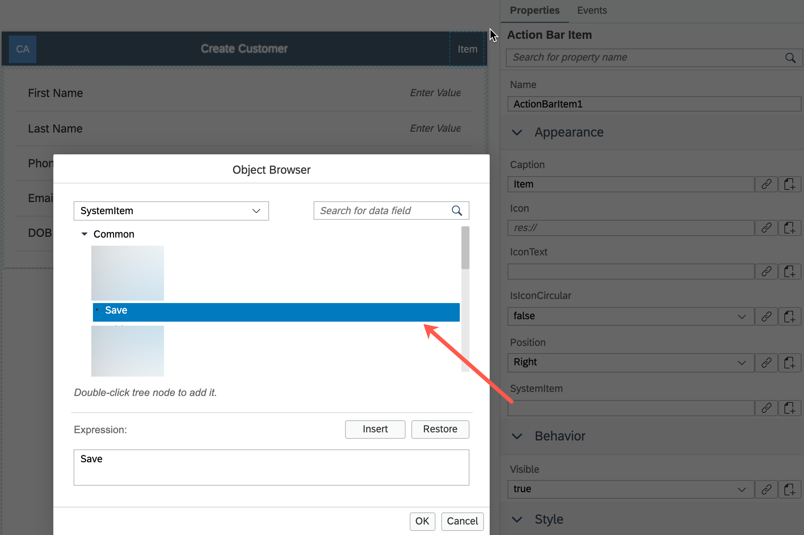

    In the **Events** tab, click the 3 dots icon for the `OnPress` property to open the **Object Browser**, bind it to `Customers_CreateEntity.action`.

    !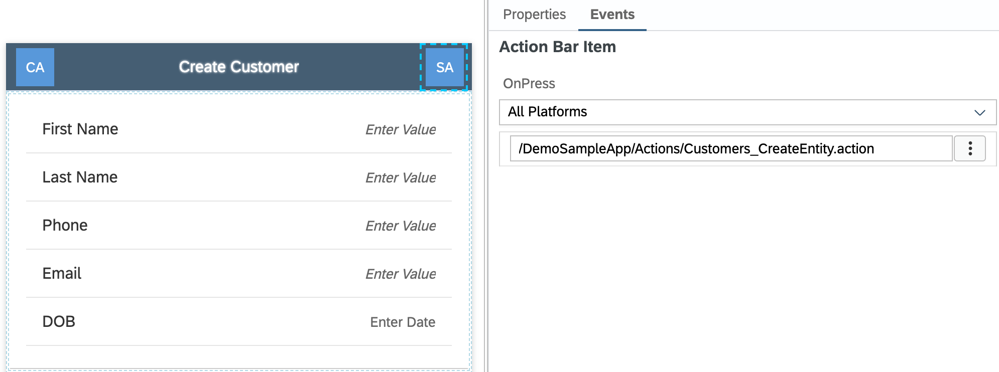

[VALIDATE_3]
[ACCORDION-END]

[ACCORDION-BEGIN [Step 6: ](Deploy the application)]

Deploy the updated application to your MDK client.

1. Right-click `Application.app` and select **MDK: Deploy**.

    !

2. Select deploy target as **Mobile & Cloud**.

    !

    You should see success message for both deployments.

    !

    >Alternatively, you can select *MDK: Redeploy* in the command palette (View menu>Find Command OR press Command+Shift+p on Mac OR press Ctrl+Shift+P on Windows machine), it will perform the last deployment.

    >!

[DONE]
[ACCORDION-END]

[ACCORDION-BEGIN [Step 7: ](Run the app)]

>Make sure you are choosing the right device platform tab above.

[OPTION BEGIN [Android]]

1. Re-launch the app on your device, you may asked to authenticate with passcode or Biometric authentication. You will see a _Confirmation_ pop-up, tap **OK**.

2. Tap **Customer List**, click **+** icon to create a new record.

    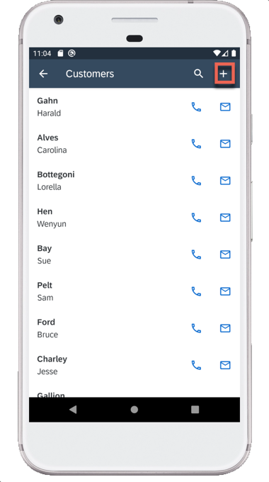

3. Enter the values, and tap save icon.

    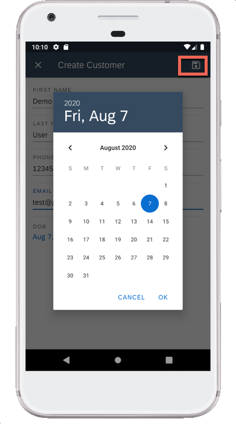

    Local record gets created accordingly.

    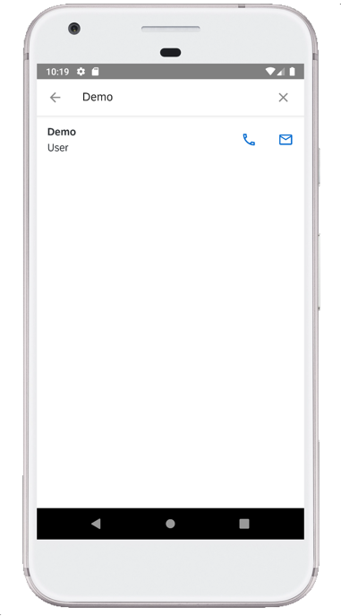

    Since this is an Offline application, new entry is added to the request queue of the local store which needs to be sent or uploaded to the backend explicitly.  

    >MDK base template has added a **Sync** button on main page of the app to upload local changes from device to the backend and to download the latest changes from backend to the device. Actions | Service | `UploadOffline.action` & `DownloadOffline.action`.

4. On Main page, tap **Sync**, a successful message will be shown.

    

[OPTION END]

[OPTION BEGIN [iOS]]

1. Re-launch the app on your device, you may asked to authenticate with passcode or Biometric authentication. You will see a _Confirmation_ pop-up, tap **OK**.

2. Tap **Customer List**, click **+** icon to create a new record.

    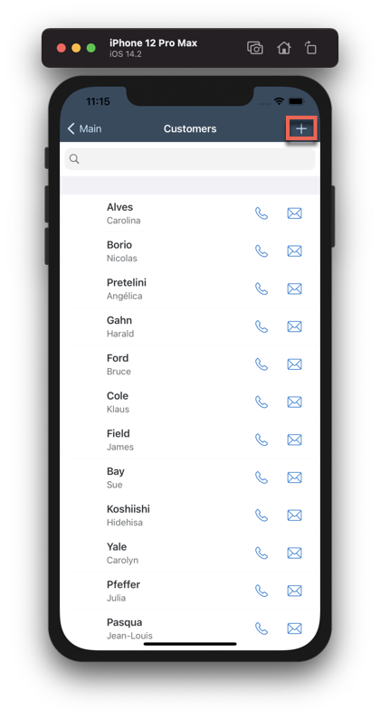

3. Enter the values, and tap **Save**.

    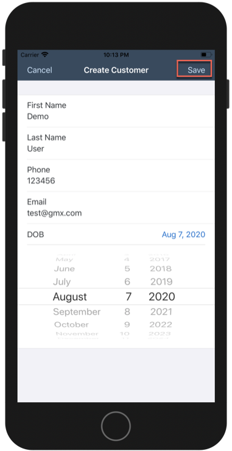

    Local record gets created accordingly.

    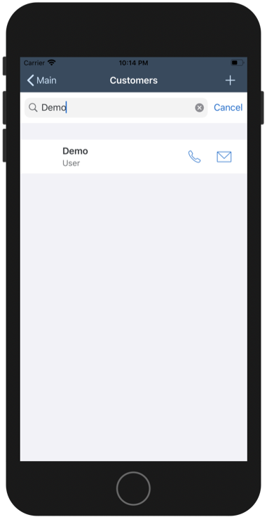

    Since this is an Offline application, new entry is added to the request queue of the local store which needs to be sent or uploaded to the backend explicitly.  

    >MDK base template has added a **Sync** button on main page of the app to upload local changes from device to the backend and to download the latest changes from backend to the device. Actions | Service | `UploadOffline.action` & `DownloadOffline.action`.

4. On `Main` page, tap **Sync**, a successful message will be shown. As Sync is pressed, `UploadOffline.action` gets triggered to upload local changes from device to the backend and on success of this call, `DownloadOffline.action` is being called.

    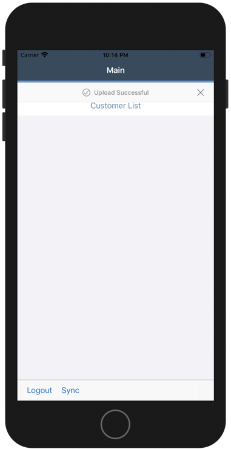

[OPTION END]

[OPTION BEGIN [Web]]

1. Either click the highlighted button or refresh the web page to load the changes.

    !

    >If you see the error `404 Not Found: Requested route ('xxxxx-dev-nsdemosampleapp-approuter.cfapps.xxxx.hana.ondemand.com') does not exist.` while accessing the web application, make sure that in your space cockpit, highlight applications are in started state.

    >!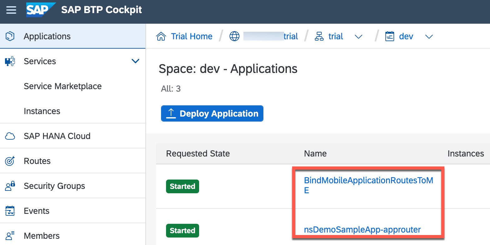   

2. Click **Customer List**, click **+ Add** icon to create a new record.

    !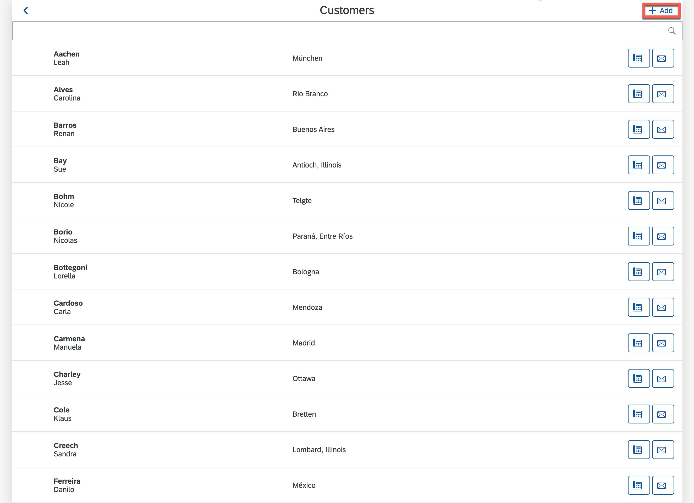

3. Enter the values, and click **Save**.

    !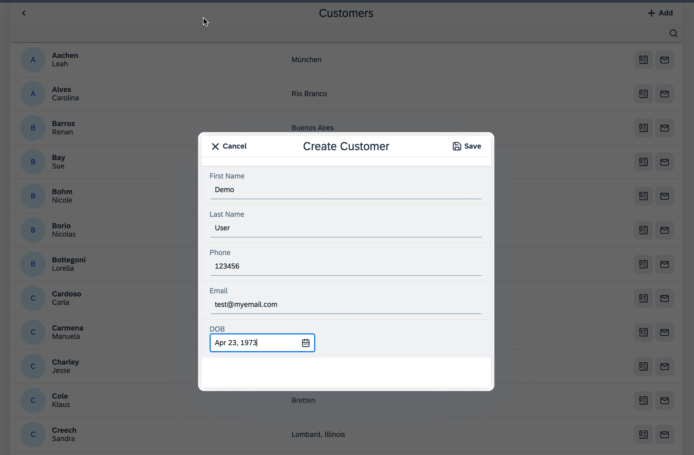

    Local record gets created accordingly.

    !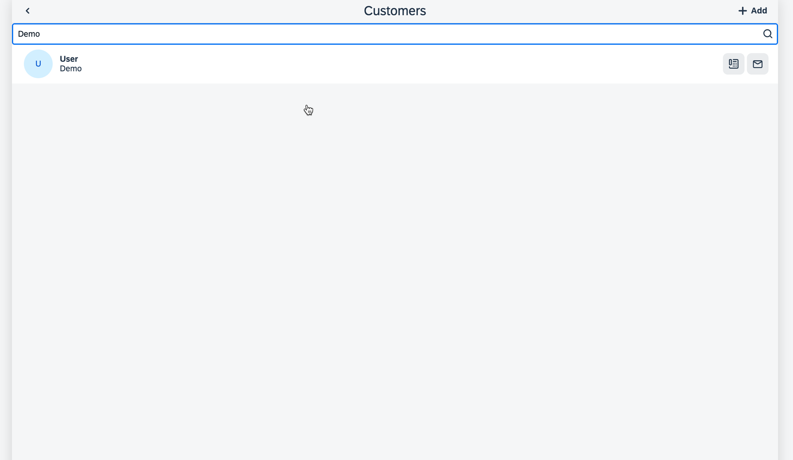

[OPTION END]

You can cross verify if a record has been updated in the backend.

>Backend URL can be found in [Mobile Services Cockpit](cp-mobile-dev-kit-ms-setup).

>**Mobile Applications** | **Native/Hybrid** | click the MDK App **com.sap.mdk.demo** | **Mobile Connectivity** | click **Launch in Browser** icon

>!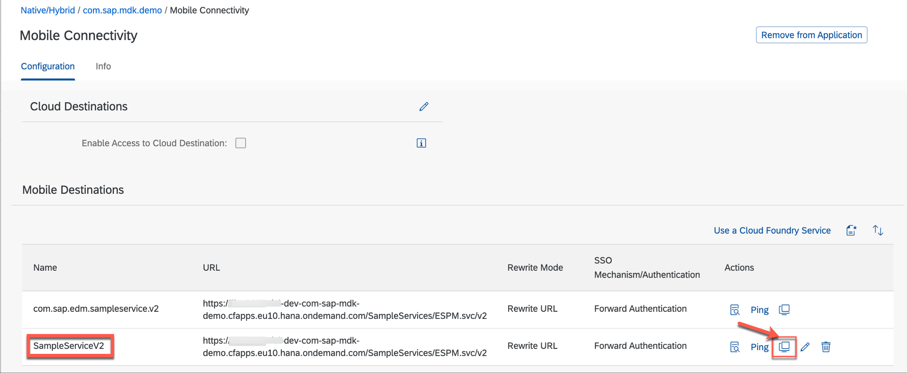

>It will open the URL in a new tab, remove `?auth=uaa` and add `/Customers` at the end of the URL.

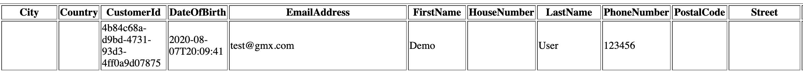

[VALIDATE_1]
[ACCORDION-END]

---
