## Details
### You will learn
  - How to enhance customer details with its order information
  - How to create a new page for displaying the order details

---

To enhance your MDK app with customer order information, you need to carry out the following tasks:

*  Create a new order list page
*  Create a new order details page
*  Create a new navigation action to the new order details page
*  Write a JavaScript logic to calculate total number of orders for a customer
*  Display top 5 orders in customer detail page
*  Add a header control to the orders grid of the customer detail page to display a text label
*  Add a footer control to the orders grid of customer detail page to show total order count


[ACCORDION-BEGIN [Step 1: ](Create a new order list page)]

This page will display customer orders list, you will add an **Object Table** control that is used to display information (like Sales order ID, order creation date, gross amount and life cycle status name) about an object.

>You can find more details about [available controls in section page](https://help.sap.com/viewer/977416d43cd74bdc958289038749100e/Latest/en-US/65c0ed1f448346cb89fa84992dc5df9c.html).

In SAP Web IDE project, right-click the **Pages** folder | **New MDK Page** | **Section Page** | **Next**.


>You can find more details about [section pages](https://help.sap.com/viewer/977416d43cd74bdc958289038749100e/Latest/en-US/65c0ed1f448346cb89fa84992dc5df9c.html).

Enter the **Page Name** `CustomerOrders` and click **Next** and then **Finish** on the confirmation step.

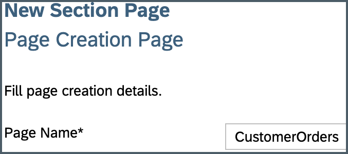

In the **Properties** pane, set the caption to **Customer Orders**.

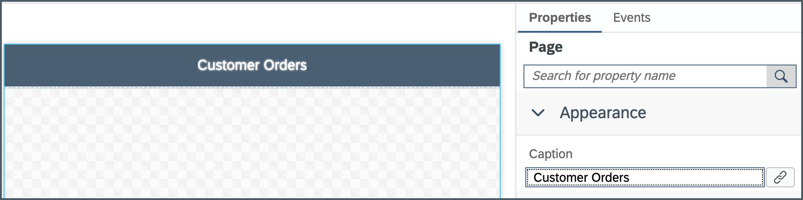

Next, add an **Object Table** compound to display information like sales order ID, order creation date, gross amount and life cycle status name.

In the Layout Editor, expand the **Controls** | **Compound** section, drag and drop the **Object Table** control onto the page area.

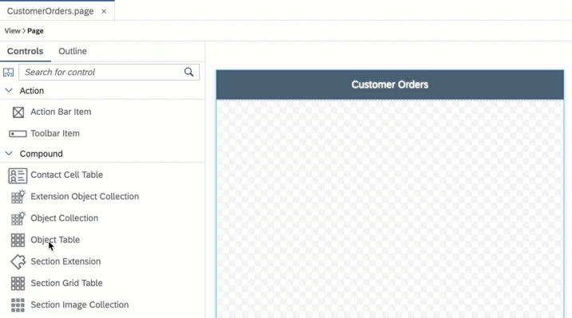

>A **Compound** control contains a group of other controls. Unlike in a container control where you can add your own child controls (container items), the child controls in a compound control are fixed. You can populate each of its child control by defining its data binding, depending on which the child controls are created.

In the **Properties** pane, select the previously added service from the **Service** drop down and then select `SalesOrderHeaders` entity set from the dropdown. This way, the Object Table has been bound to `SalesOrderHeaders` entity.

Provide below Properties:

| Property | Value |
|----|----|
| `Service`| `SampleServiceV2.service` |
| `Entity` | `SalesOrderHeaders` |
| `Query`| `$filter=CustomerId eq '{{#Property:CustomerId}}'&$orderby=CreatedAt desc` |

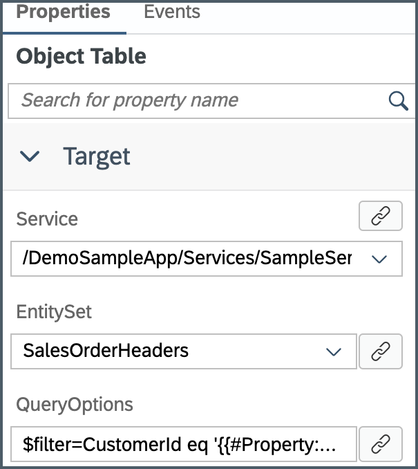

>For a given customer ID, the query expression will filter order entries returned in descending when sorted by the order creation date property.

Now start binding Object Table properties with `SalesOrderHeaders` entity set properties.

Provide the below information:

| Property | Value |
|----|----|
| `Description`| `$(D,{CreatedAt})` |
| `Footnote` | Leave it blank |
| `PreserveIconStackSpacing`| `false` |
| `ProgressIndicator` | Leave it blank |
| `Status`| `$(C,{GrossAmount},{CurrencyCode},'',{maximumFractionDigits:2,useGrouping:true})` |
| `Subhead` | `{CustomerId}` |
| `Substatus`| `{LifeCycleStatusName}` |
| `Title`| `{SalesOrderId}` |

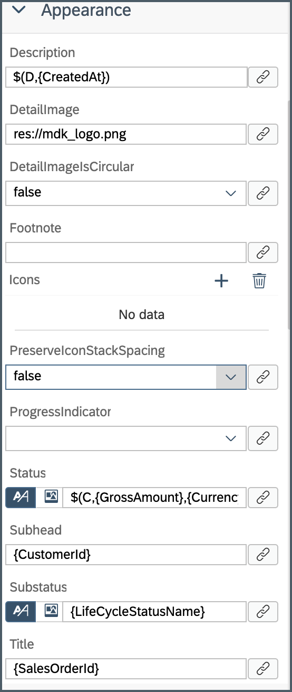

>`$(D,{CreatedAt})` is an expression of how to format a date, end result would be like 8. Jun 2018. By default it will be formatted to the device's locale setting.

>`$(C,{GrossAmount},{CurrencyCode},'',{maximumFractionDigits:2,useGrouping:true})` is an expression of how to format currency value, end result would be like 200.44 €. By default it will be formatted to the device's locale setting.

In the **Search** section of the **Properties** pane, change both the **Search Enabled** property and **Barcode Scanner** property to **`true`**.


In the **Behavior** section of the **Properties** pane, select `DisclosureIndicator` to **`AccessoryType`** property.

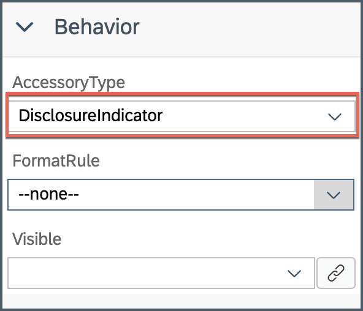

In the **Empty** section of the **Properties** pane, provide **`No Orders Found`** for the **caption** property.

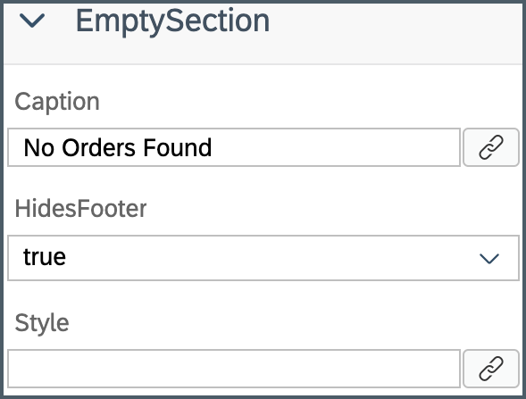

Save your changes to the **Customer Orders** page.

[DONE]
[ACCORDION-END]

[ACCORDION-BEGIN [Step 2: ](Create a new order details page)]

This page will show related details for an order. In this page, you will add an **Object Header** control that is used to display information (like first name, last name, date of birth, email address & phone number) about the header of an object and **Static Key Value** control to display key value pair items like address, city, postal code & country.

In SAP Web IDE project, right-click the **Pages** folder | **New MDK Page** | **Section Page** | **Next**.


Enter the Page Name `OrderDetails` and click **Next** and the **Finish** on the confirmation step.

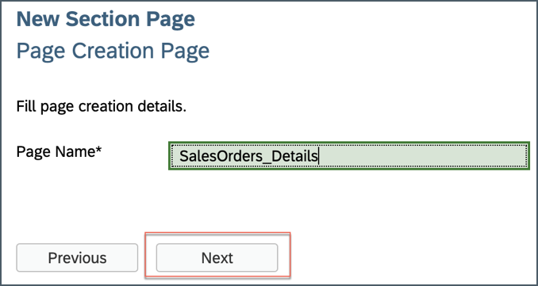

In the **Properties** pane set the Caption to **Order Details**.

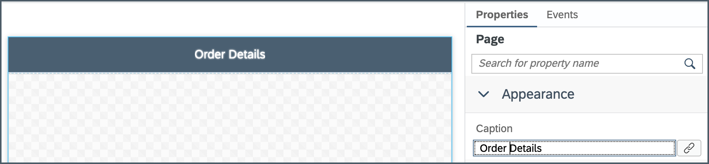

Next, you will add an **Static Key Value** container and its container item **Key Value Item** to display information like sales order id, life cycle status & date of order creation name.

>**Static Key Value** is a container that can display one or more key value pair items on a section page. In this container, you can include a Key Value Item, a simple key value cell that displays a label and a text pair. You can find more details [here](https://help.sap.com/viewer/977416d43cd74bdc958289038749100e/Latest/en-US/33d37d7e3e1b4d0ca7e11f0930282cf8.html) about this container.

In the Layout Editor, expand the **Controls** | **Container** section, drag and drop the **Static Key Value** control onto the page area.

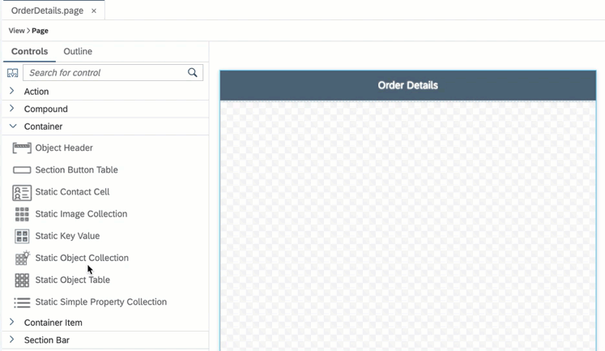

Now, add key value item to this container. In the Layout Editor, expand the **Controls** | **Container Item** section, drag and drop the **Key Value Item** control onto the page area.

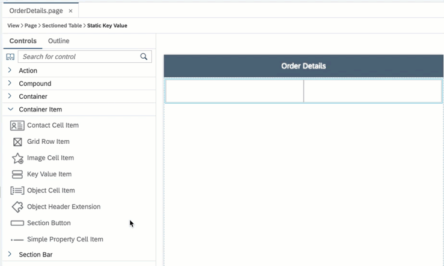

Provide the below information:

| Property | Value |
|----|----|
| `KeyName`| `Order Number` |
| `Value` | `{SalesOrderId}` |

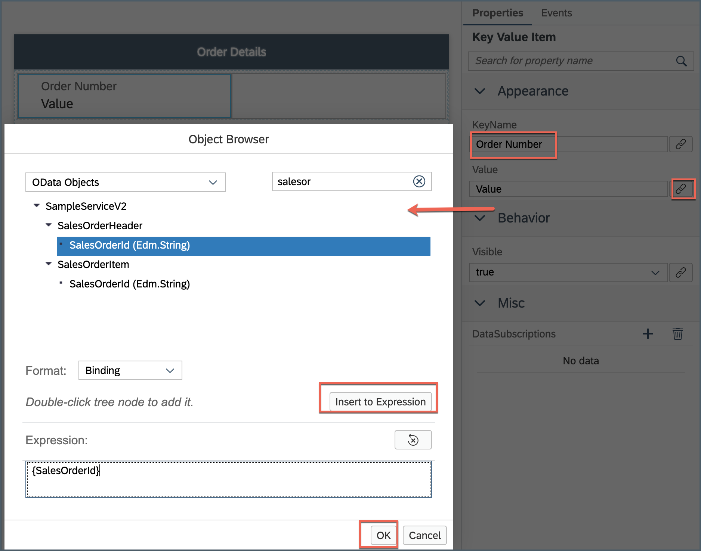

>Make sure to select values for the mentioned properties only from `SalesOrderHeader` entity. You may find similar values from other entities.

Repeat the above step by adding 5 more **Key Value Item** on the page.

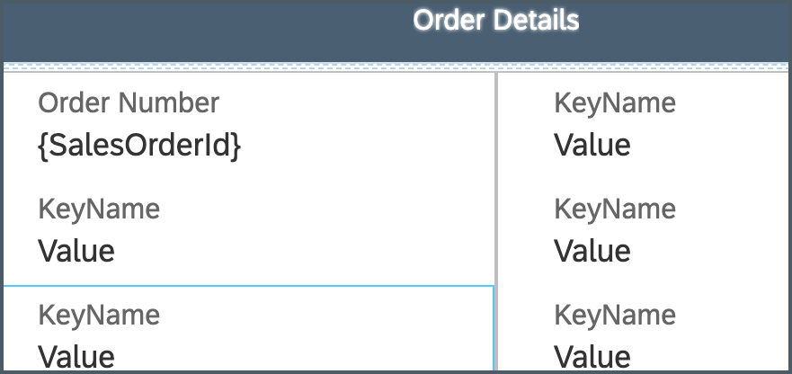

Provide the below information:

| Property | Value |
|----|----|
| `KeyName`| `Status` |
| `Value` | `{LifeCycleStatusName}` |

| Property | Value |
|----|----|
| `KeyName`| `Created At` |
| `Value` | `$(D,{CreatedAt})` |

| Property | Value |
|----|----|
| `KeyName`| `Price` |
| `Value` | `$(C,{NetAmount},{CurrencyCode},'',{maximumFractionDigits:2,useGrouping:true})` |

| Property | Value |
|----|----|
| `KeyName`| `Tax` |
| `Value` | `$(C,{TaxAmount},{CurrencyCode},'',{maximumFractionDigits:2,useGrouping:true})` |

| Property | Value |
|----|----|
| `KeyName`| `Total` |
| `Value` | `$(C,{GrossAmount},{CurrencyCode},'',{maximumFractionDigits:2,useGrouping:true})` |

You should have final binding for all key value items as below:

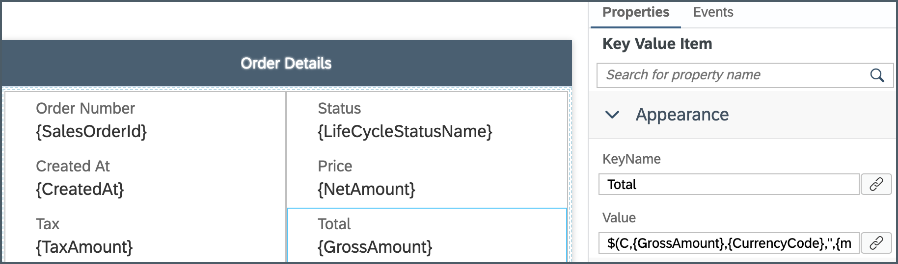

Save your changes to the **Order Details** page.

[VALIDATE_1]
[ACCORDION-END]

[ACCORDION-BEGIN [Step 3: ](Create navigation actions)]

Now, you will create two **Navigation actions** that opens the **Order List** and **Order Details** page when called.

Right-click the **Actions** folder | **New MDK Action** | **Navigation Action** | **Next**.


Provide the below information:

| Field | Value |
|----|----|
| `Action Name`| `ShowAllOrders` |
| `Page to Open` | `CustomerOrders.page` |

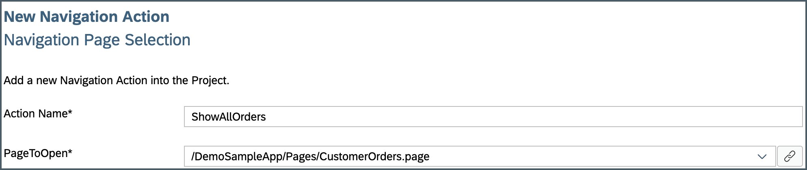

Click **Next** and then **Finish** on the confirmation step.

Repeat the above step and create a new navigation action.


Provide the below information:

| Field | Value |
|----|----|
| `Action Name`| `ShowOrderDetails` |
| `Page to Open` | `OrderDetails.page` |

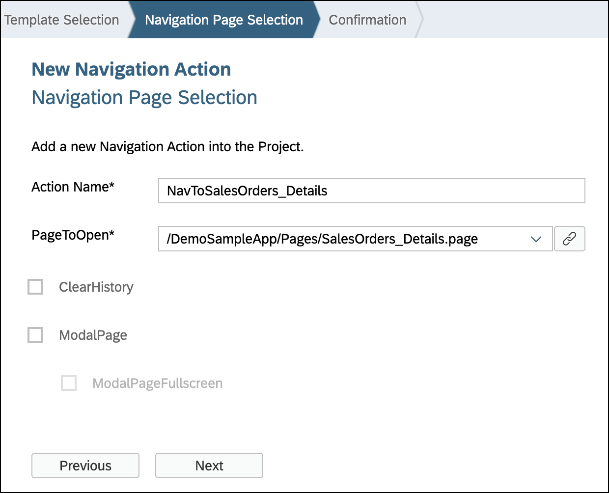

Click **Next** and then **Finish** on the confirmation step.

[DONE]
[ACCORDION-END]

[ACCORDION-BEGIN [Step 4: ](Set the OnPress of the customer Orders)]

Go back to the **Customer Orders page** and set the `OnPress` event of the Object Table. You will link the Object Table to the `ShowOrderDetails` action so that when an end-user selects a order, the **Order Details** page will open. MDK automatically passes the selected order to the details page.

In `CustomerOrders` page, select the Object Table, **click** the link icon under the **Events** tab for the `OnPress` property to open the Object Browser.

Double-click the `ShowOrderDetails` action and click **OK** to set it as the `OnPress` Action.

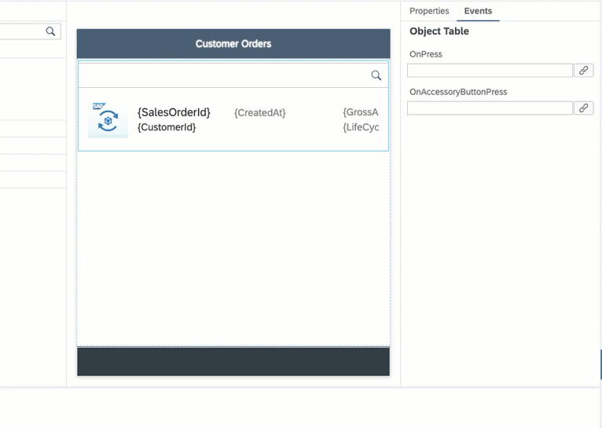

Save the changes to the `CustomerOrders` page.

[DONE]
[ACCORDION-END]

[ACCORDION-BEGIN [Step 5: ](Write JavaScript logic to calculate total number of orders)]

You will show a total count of orders for a customer in `CustomerDetail` page. You will write a JavaScript logic for this calculation.

Right-click the **Rules** folder | **New** | **File**.

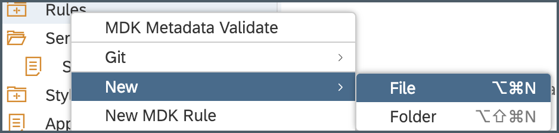

Enter the file name `CustomerOrderCount.js`, click **OK**.

Copy and paste the following code.

```JavaScript
export default function CustomerOrderCount(sectionProxy) {
  //The following currentCustomer will retrieve the current customer record
	const currentCustomer = sectionProxy.getPageProxy().binding.CustomerId;

  //The following expression will retrieve the total count of the orders for a given customer
	return sectionProxy.count('/DemoSampleApp/Services/SampleServiceV2.service', 'SalesOrderHeaders', `$filter=CustomerId eq '${currentCustomer}'`).then((count) => {
        return count;
    });
}
```

Save the changes to the `CustomerOrderCount.js` file.

[DONE]
[ACCORDION-END]

[ACCORDION-BEGIN [Step 6: ](Display top 5 orders in customer detail page)]

Next, you will add an **Object Table** compound to display top 5 orders information in the **Customer Detail** page.

In the Layout Editor, expand the **Controls** | **Compound** section, drag and drop the **Object Table** control onto the page area.

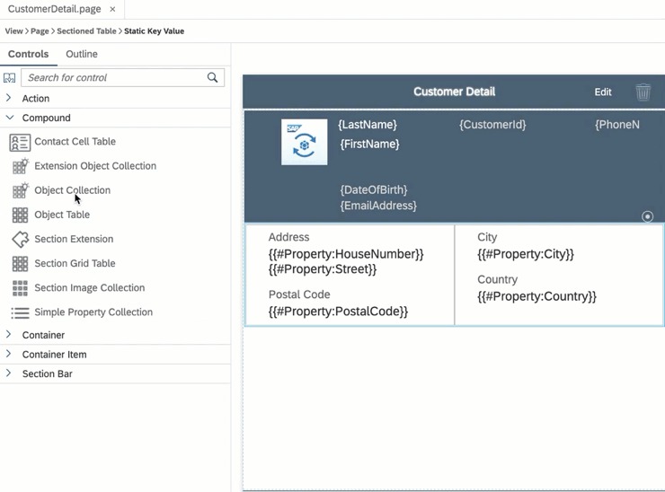

In the **Properties** pane, select the previously added service from the **Service** drop down and then select `SalesOrderHeaders` entity set from the dropdown. This way, the Object Table has been bound to `SalesOrderHeaders` entity.

Provide below Properties:

| Property | Value |
|----|----|
| `Service`| `SampleServiceV2.service` |
| `Entity` | `SalesOrderHeaders` |
| `Query`| `$filter=CustomerId eq '{{#Property:CustomerId}}'&$top=5&$orderby=CreatedAt desc` |


>For a given customer id, query expression will filter top 5 order entries returned in descending when sorted by the order creation date property.

Now start binding Object Table properties with `SalesOrderHeaders` entity set properties.

In the **Appearance** section of the **Properties** pane, provide the below information:

| Property | Value |
|----|----|
| `Description`| Leave it blank |
| `Footnote` | Leave it blank |
| `PreserveIconStackSpacing`| `false` |
| `ProgressIndicator` | Leave it blank |
| `Status`| `$(C,{GrossAmount},{CurrencyCode},'',{maximumFractionDigits:2,useGrouping:true})` |
| `Subhead` | `$(D,{CreatedAt})` |
| `Substatus`| `{CurrencyCode}` |
| `Title`| `{SalesOrderId}` |

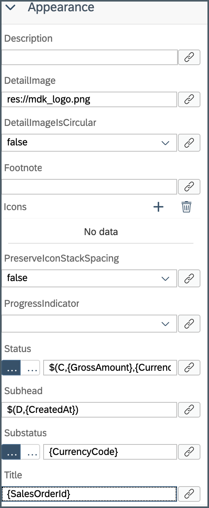

>`$(D,{CreatedAt})` is an expression of how to format a date, end result would be like 8. Jun 2018. By default it will be formatted to the device's locale setting.

>`$(C,{GrossAmount},{CurrencyCode},'',{maximumFractionDigits:2,useGrouping:true})` is an expression of how to format currency value, end result would be like 200.44 €. By default it will be formatted to the device's locale setting.

In the **Behavior** section of the **Properties** pane, select `DisclosureIndicator` to **`AccessoryType`** property.


In the **Empty** section of the **Properties** pane, provide  **`No Customer Orders Found`** to **Caption** property.

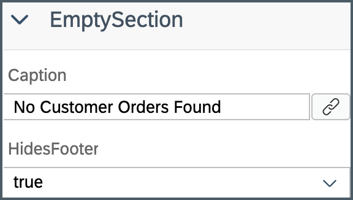

You may also want to open **Order Details** page when clicking on any order in customer detail page. For this, you will set `OnPress` event of the **Object Collection** and link it to `ShowOrderDetails.action` so that when an end-user selects a order, the Order Details page will open. MDK automatically passes the selected order to the details page.

In `CustomerDetail` page, select the Object Collection, **click** the link icon under the **Events** tab for the `OnPress` property to open the Object Browser.

Double-click the `ShowOrderDetails` action and click **OK** to set it as the `OnPress` Action.

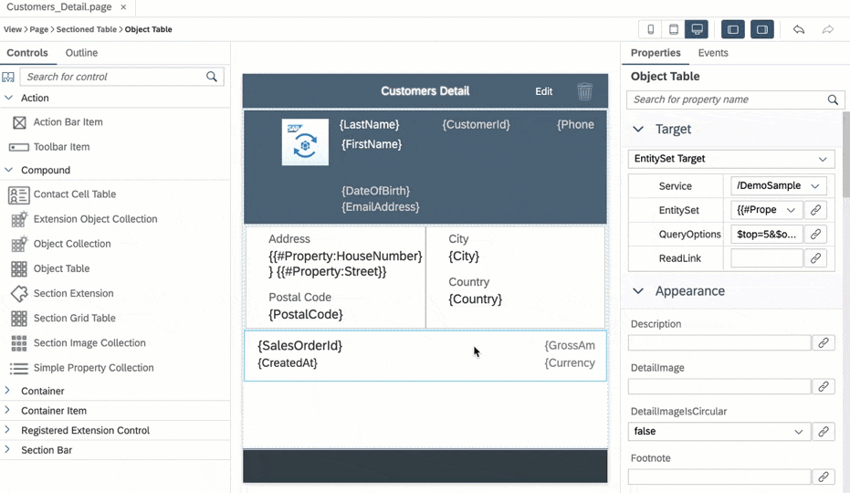

Save the changes to the `CustomerDetail` page.

[DONE]
[ACCORDION-END]

[ACCORDION-BEGIN [Step 7: ](Add Header control to  orders grid)]

For orders grid area, you will add a header to display some text label.

In the Layout Editor, expand the **Controls** | **Section Bar** section, drag and drop the **Header** control above the order grid area.

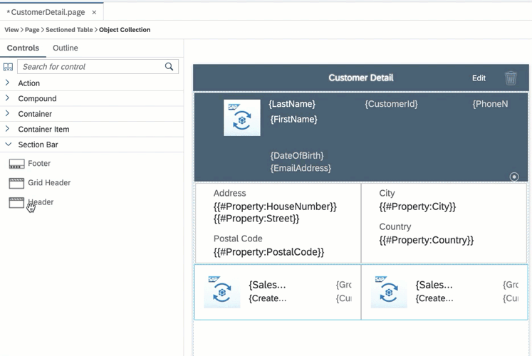

Provide the below information:

| Property | Value |
|----|----|
| `Caption`| `Customer Orders` |

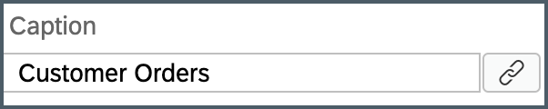

Save the changes to the `CustomerDetail` page.

>You can find more details about [Header controls](https://help.sap.com/viewer/977416d43cd74bdc958289038749100e/Latest/en-US/c71b8b1f71294fcbb199613439c51222.html).

[DONE]
[ACCORDION-END]

[ACCORDION-BEGIN [Step 8: ](Add Footer control to show total order count)]

For orders grid area, you will also add a footer to display total count of orders for a customer.

In the Layout Editor, expand the **Controls** | **Section Bar** section, drag and drop the **Footer** control above the order grid area.

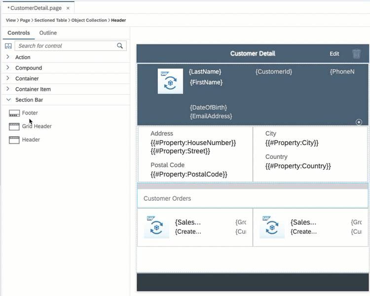

Provide the below information:

| Property | Value |
|----|----|
| `Attribute Label`| bind it to `CustomerOrderCount.js` |
| `Caption`| `See All` |
| `FooterStyle`| `attribute` |
| `AccessoryType`| `DisclosureIndicator` |

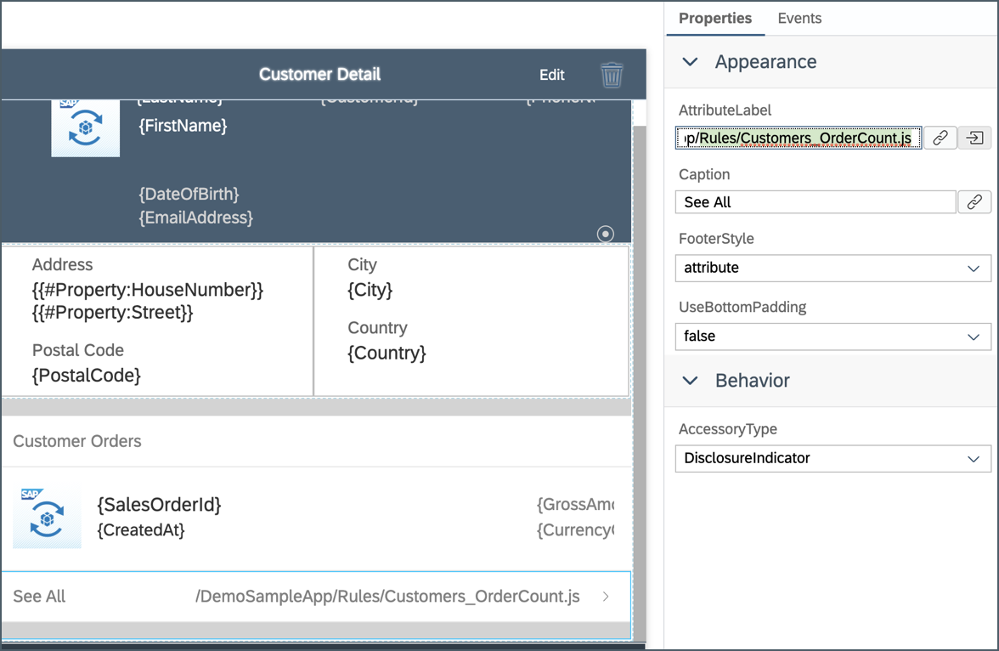

>You can find more details about [Footer controls](https://help.sap.com/viewer/977416d43cd74bdc958289038749100e/Latest/en-US/df3e0a2efa2948d2b66e8f5071f5b48e.html).

You may also want to open **Customer Orders** page when clicking on **See All**. For this, you will set `OnPress` event of the **Footer** control and link it to `ShowAllOrders.action` so that when an end-user clicks on **See All**, the **Customer Orders** page will open.

In `CustomerDetail` page, select the Footer control, **click** the link icon under the **Events** tab for the `OnPress` property to open the Object Browser.

Double-click the `ShowAllOrders.action` and click **OK** to set it as the `OnPress` Action.


Save the changes to the `CustomerDetail` page.

[DONE]
[ACCORDION-END]

[ACCORDION-BEGIN [Step 9: ](Deploy, activate and test the application)]

Deploy the updated application to your MDK client.

Right-click the MDK application in the project explorer pane and select **MDK Deploy and Activate**, click **Next**, and deploy to Mobile Services.


>Make sure to select same App ID as you chose in the previous tutorial.

Re-launch the app on your device, you may asked to authenticate with passcode or Touch ID or fingerprint. When you see a confirmation pop-up, click **OK**.

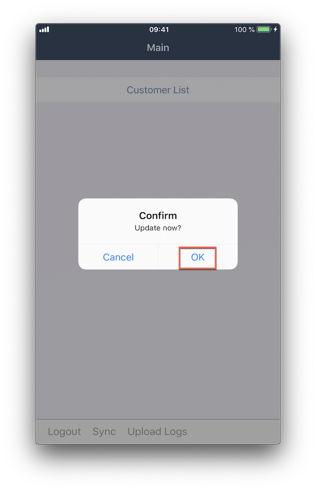

You will see the **Customer Orders** area in customer detail page and also total count of orders.

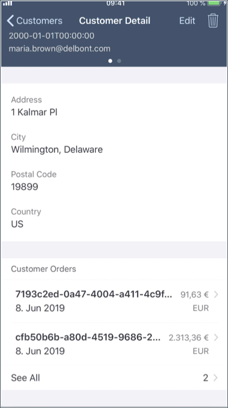

Clicking on any order navigates to its details page.

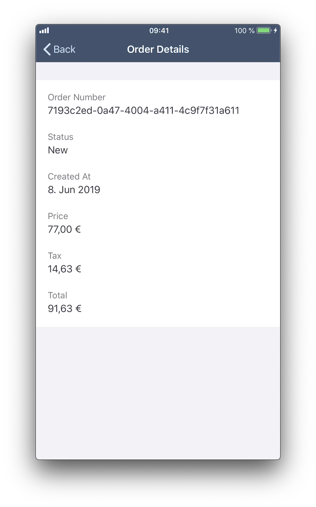

Click **See All**, which navigates to the **Customer Orders** page.  

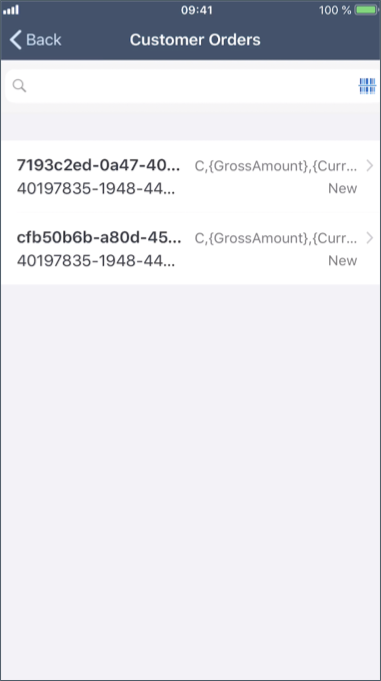

>_Are you wondering how exactly MDK knew that clicking on a record in  list page would display respective record in detail page?_

>The MDK sets the current object to the selected record when running the on press action on the list.  The detail page then just needs to reference the correct properties assuming they are part of the object from the list page.

[DONE]
[ACCORDION-END]


---
