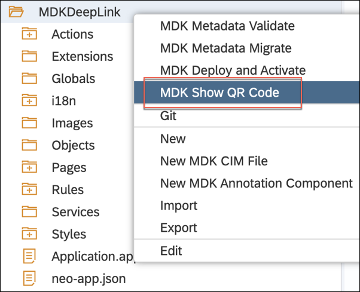

## Prerequisites
- **Tutorial group:** [Set Up for the Mobile Development Kit (MDK)](group.mobile-dev-kit-setup)
- **Download and install:** **SAP Mobile Services Client** on your [iOS](https://apps.apple.com/us/app/sap-mobile-services-client/id1413653544) or [Android](https://play.google.com/store/apps/details?id=com.sap.mobileservices.client) device
- **Download and install** [Barcode Scanner](https://play.google.com/store/apps/details?id=com.google.zxing.client.android&hl=en) (required only for Android device)
- **Download and install** **SAP Mobile Cards** on your [iOS](https://apps.apple.com/us/app/sap-mobile-cards/id1168110623) or [Android](https://play.google.com/store/apps/details?id=com.sap.content2go&hl=en) device
- **Download and install** **SAP Fiori Client** on your [iOS](https://apps.apple.com/us/app/sap-fiori-client/id824997258) or [Android](https://play.google.com/store/apps/details?id=com.sap.fiori.client&hl=en) device

## Details
### You will learn
  - How to open SAP standard apps like Mobile Cards, Fiori Client from MDK generic client
  - How to open an UI5 app running in a  Fiori Client from an MDK generic client
  - How to open a web page

You may clone an existing project from [GitHub repository](https://github.com/SAP-samples/cloud-mdk-tutorial-samples/tree/master/4-Level-Up-with-the-Mobile-Development-Kit/4-Implement-Deep-Linking-to-Another-App-from-an-MDK-App) and start directly with step 5 in this tutorial.

---

Deep links are used to send users directly to an app instead of a website or a store saving users the time and energy locating a particular page themselves – significantly improving the user experience.

If an app is already installed, you can specify a custom URL scheme (iOS Universal Links) or an intent URL (on Android devices) that opens that app. Using deep link, you can also navigate to specific events or pages, which could tie into campaigns that you may want to run.


>**This tutorial has been executed using public store MDK client which has out of the box functionality to open the SAP standard apps like SAP Mobile Cards and SAP Fiori Client.
If you are building a custom version of Mobile development kit client, there you can implement deep links by specifying related custom URL scheme.**

[ACCORDION-BEGIN [Step 1: ](Set up the application foundation)]

1. Make sure that you have completed required pre-Prerequisites mentioned in this tutorial.

    This step includes creating the Mobile Development Kit project in the Editor.

2. Launch the SAP Web IDE and select the **MDK perspective** by clicking on the icon in the left panel.

3. Right-click Workspace folder and select **New** | **MDK Empty Project**.

    

    >The _MDK Empty Project_ template creates a Logout action, Close page action, rule and an empty page (`Main.page`). After using this template, you can focus on creating your pages, other actions, and rules needed for your application.

    >More details on _MDK template_ is available in [help documentation](https://help.sap.com/doc/f53c64b93e5140918d676b927a3cd65b/Cloud/en-US/docs-en/guides/getting-started/mdk/webide.html#creating-a-new-project).

4. Enter the Project Name as `MDKDeepLink` and click **Next**.

    

5. Leave the default values in _Application Creation_ step as it is, click **Finish**.

    After clicking Finish, the wizard will generate your MDK Application based on your selections. You should now see the `MDKDeepLink` project in the project explorer.

    

[DONE]
[ACCORDION-END]

[ACCORDION-BEGIN [Step 2: ](Create a new rule)]

In the MDK editor, you will create 4 new JavaScript files:

  * `OpenSAPMobileCards.js` to open SAP Mobile Cards app
  * `OpenSAPFioriClient.js` to open SAP Fiori Client app
  * `OpenUI5.js` to open an UI5 app running in SAP Fiori Client app
  * `OpenSAPcom.js` to open `SAP.com` web page

    >You can find more details about [writing a Rule](https://help.sap.com/doc/f53c64b93e5140918d676b927a3cd65b/Cloud/en-US/docs-en/guides/getting-started/mdk/development/rules.html).

1. Right-click the **Rules** folder | **New** | **File**.

    

2. Enter the file name `OpenSAPMobileCards.js`, click **OK**.

    Copy and paste the following code.

    ```JavaScript
    export default function openurl(clientAPI) {
    // Get the Nativescript UI Dialogs Module
    const dialogs = clientAPI.nativescript.uiDialogsModule;
    // Get the Nativescript Utils Module
    const utilsModule = clientAPI.nativescript.utilsModule;
    return dialogs.confirm("Do you want to leave the current app?").then((result) => {
        if (result === true) {
            //This will open SAP Mobile Cards app
       return utilsModule.openUrl("com.sap.content2go://").then(	                
                (success) => Promise.resolve(success),
                (failure) => Promise.reject('The requested app or page is not available ' + failure));
        } else {
            return Promise.reject('User Deferred');
        }
    });
    }
    ```
    

    >`openUrl` is a `NativeScript` API to open an URL on device. You can find more details about [this API](https://docs.nativescript.org/core-concepts/utils#openurl-function).

3. Repeat the above step and create another new file:

    Enter the file name `OpenSAPFioriClient.js`, click **OK**.

    Copy and paste the following code.

    ```JavaScript
    export default function openurl(clientAPI) {
    // Get the Nativescript UI Dialogs Module
    const dialogs = clientAPI.nativescript.uiDialogsModule;
    // Get the Nativescript Utils Module
    const utilsModule = clientAPI.nativescript.utilsModule;
    return dialogs.confirm("Do you want to leave the current app?").then((result) => {
        if (result === true) {
            //This will open SAP Fiori Client App
        return utilsModule.openUrl("com.sap.fiori.client.xcallbackurl://x-callback-url").then(               
                (success) => Promise.resolve(success),
                (failure) => Promise.reject('The requested app or page is not available ' + failure));
        } else {
            return Promise.reject('User Deferred');
        }
    });
    }
    ```

    

4. Repeat the above step and create another new file:

    Enter the file name `OpenUI5.js`, click **OK**.

    Copy and paste the following code.

    ```JavaScript
    export default function openurl(clientAPI) {
    // Get the Nativescript UI Dialogs Module
    const dialogs = clientAPI.nativescript.uiDialogsModule;
    // Get the Nativescript Utils Module
    const utilsModule = clientAPI.nativescript.utilsModule;
    return dialogs.confirm("Do you want to leave the current app?").then((result) => {
        if (result === true) {
            //This will open Software Downloads app running in SAP Fiori Client
    return utilsModule.openUrl("com.sap.fiori.client.xcallbackurl://x-callback-url/openFioriUrl?url=https://launchpad.support.sap.com/#/softwarecenter").then(                  
                (success) => Promise.resolve(success),
                (failure) => Promise.reject('The requested app or page is not available ' + failure));
        } else {
            return Promise.reject('User Deferred');
        }
    });
    }
    ```

    

5. Create one more file and name it to `OpenSAPcom.js`.

    Copy and paste the following code.

    ```JavaScript
    export default function openurl(clientAPI) {
    // Get the Nativescript UI Dialogs Module
    const dialogs = clientAPI.nativescript.uiDialogsModule;
    // Get the Nativescript Utils Module
    const utilsModule = clientAPI.nativescript.utilsModule;
    return dialogs.confirm("Do you want to leave the current app?").then((result) => {
        if (result === true) {
            //This will open SAP.com website
    return utilsModule.openUrl("https://www.sap.com").then( 	                
                (success) => Promise.resolve(success),
                (failure) => Promise.reject('The requested app or page is not available ' + failure));
        } else {
            return Promise.reject('User Deferred');
        }
    });
    }
```

6. Save the changes.

[DONE]
[ACCORDION-END]

[ACCORDION-BEGIN [Step 3: ](Add buttons on main page to open other apps or web pages)]

1. Next, on **Main page**, drag and drop the **Section Button Table** Container control onto the Page.

    

    >The controls available in Container section includes controls that act as containers for other controls, such as container items. A container is constant for all pages. The size of a container depends on the controls and contents included inside.  
    You can find more details about [Containers](https://help.sap.com/doc/69c2ce3e50454264acf9cafe6c6e442c/Latest/en-US/docs-en/reference/schemadoc/Page/SectionedTable/Container/ButtonTable.schema.html).

2. Now, you will add items to this Container control.

    Drag and drop the **Section Button** Container Item control onto the page.

    

3. Repeat the above step, and drag and drop 3 more such **Section Button** Container Item controls.

    

4. Select the first control and change its title to **Open SAP Mobile Cards**.

    

5. Repeat the above step and change the title for other controls as below:

    

6. Save the changes to the `Main.page`.

[VALIDATE_1]
[ACCORDION-END]

[ACCORDION-BEGIN [Step 4: ](Set onPress handler to the buttons)]

1. In this step, you will bind the JavaScript files to the `OnPress` of each button.

    In `Main.page`, select **Open SAP Mobile Cards** button. In the Properties pane, click the **Events** tab, click the **link icon** for the `Handler` property to open the object browser.

2. Double click the `OpenSAPMobileCards.js` and click **OK** to set it as the `OnPress` action.

    

3. Repeat the same and do the following:

    Set the handler for **Open SAP Fiori Client** button to `OpenSAPFioriClient.js`.

    Set the handler for **Open UI5 App** button to `OpenUI5.js`.

    Set the handler for **Open SAP.com page** button to `OpenSAPcom.js`.

4. Save the changes to `Main.page`.

[DONE]
[ACCORDION-END]

[ACCORDION-BEGIN [Step 5: ](Deploy and activate the application)]

So far, you have learned how to build an MDK application in the SAP Web IDE editor. Now, we deploy this application definition to Mobile Services.

1. Right-click the `MDKDeepLink` MDK Application in the project explorer pane and select **MDK Deploy and Activate**.

    

2. Let the default configuration as it is and click **Next**.

    

    >_Filter Files_ will be filtered and ignored in web packing process.

    >_Externals_ are the list of NPM modules that are part of the MDK Client application and should not be validated in the bundle.

3. Confirm the destination name and application id match where you want to deploy.

    

4. Click **Next** to finish the deployment from SAP Web IDE.

    You should see **Application deployed successfully** message in console log.

    

[DONE]
[ACCORDION-END]

[ACCORDION-BEGIN [Step 6: ](Populate the QR code for app onboarding)]

SAP Web IDE has a feature to generate QR code for app onboarding.

Right-click the `MDKDeepLink` MDK Application in the project explorer pane and select **MDK Show QR Code**.



>**MDK Show QR Code** option is greyed out if MDK project is not yet deployed and activated as per step 3.


[DONE]
[ACCORDION-END]

[ACCORDION-BEGIN [Step 7: ](Run the app in MDK client)]

>Make sure you are choosing the right device platform tab above. Once you have scanned and onboarded using the onboarding URL, it will be remembered. When you Log out and onboard again, same onboarding URL settings will be reused without the need to scan. You will need to use 3rd party QR scanner app in Android or device Camera in iOS, if you would like to scan a different onboarding URL.

[OPTION BEGIN [Android]]

1. Launch **`Mobile Svcs`** app on your Android device. Tap **GET STARTED** to connect MDK client to SAP Cloud Platform.

    

2. Tap **QR CODE SCAN** to start the device camera for scanning the onboarding QR code.

    

3. Once scan is succeeded, tap **CONTINUE**.

    

4. Enter Email address and password to login to SAP Cloud Platform and tap **Log On** to authenticate.

    

5. Tap **AGREE** on `End User License Agreement`.

    

6. Choose a passcode with at least 8 characters for unlocking the app and click **NEXT**.

    

7. Confirm the passcode and tap **DONE**.

    

    Optionally, you can enable fingerprint to get faster access to the app data.

    

8. Tap **OK**.

    

    The MDK client receives deployed metadata definitions as a bundle.

    Now, you will see **Main** page with the buttons you added in previous step 3.

    

9. Tap **OPEN SAP MOBILE CARDS** and then tap **OK**.

    

    If you have already installed SAP Mobile Cards app, then MDK app will open it.

    

10. Tapping on **OPEN SAP FIORI CLIENT** will open **SAP Fiori Client** app.

    >If you have access to any Fiori app or Fiori Launchpad page for example [SAP Support Launchpad](https://launchpad.support.sap.com), then enter that URL in your Fiori Client app.

    

11. Tapping on **OPEN UI5 APP** will open a specific app running in SAP Fiori Client as per `OpenUI5.js` file.

    In below screenshot, there is one Software Downloads UI5 app part of SAP Support Launchpad.

    

12. Tapping on **OPEN SAP.COM PAGE** will open SAP website.

    

    >Once you have scanned and onboarded using the onboarding URL, it will be remembered. When you Log out and onboard again, same onboarding URL settings will be reused without the need to scan. You will need to use 3rd party QR scanner app in Android or device Camera in iOS, if you would like to scan a different onboarding URL.

[OPTION END]

[OPTION BEGIN [iOS]]

1. Launch **`Mobile Svcs`** app on your iOS device. Tap **Scan** to start the device camera for scanning the onboarding QR code.

    

2. Once scan is succeeded, tap **Continue**.

    

3. Enter Email address and password to login to SAP Cloud Platform and tap **Log On** to authenticate.

    

4. Tap **Agree** on `End User License Agreement`.

    

5. Choose a passcode with at least 8 characters for unlocking the app and tap **Next**.

    

6. Confirm the passcode and tap **Done**.

    

    Optionally, you can enable Touch ID to get faster access to the app data.

    

7. Tap **OK**.

    

    Now, you will see **Main** page with the buttons you added in previous step 3.

    

8. Tap **Open SAP Mobile Cards** and then tap **OK**.

    

    If you already installed SAP Mobile Cards app, then MDK app will open it.

    

9. Tapping on **Open SAP Fiori Client** will open **SAP Fiori Client** app.

    >If you have access to any Fiori app or Fiori Launchpad page for example [SAP Support Launchpad](https://launchpad.support.sap.com), then enter that URL in your Fiori Client app.

    

10. Tapping on **Open UI5 App** will open a specific app running in SAP Fiori Client as per `OpenUI5.js` file.

    In below screenshot, there is one Software Downloads UI5 app part of SAP Support Launchpad.

    

11. Tapping on **Open SAP.com page** will open SAP website.

    

    >Once you have scanned and onboarded using the onboarding URL, it will be remembered. When you Log out and onboard again, same onboarding URL settings will be reused without the need to scan. You will need to use 3rd party QR scanner app in Android or device Camera in iOS, if you would like to scan a different onboarding URL.

[OPTION END]

Congratulations, you have successfully implemented Deep Linking to Another App from your MDK App and you are now all set to [Use OData Annotations to Add CRUD Functionality to an MDK App](cp-mobile-dev-kit-annotations).

[DONE]
[ACCORDION-END]

---
