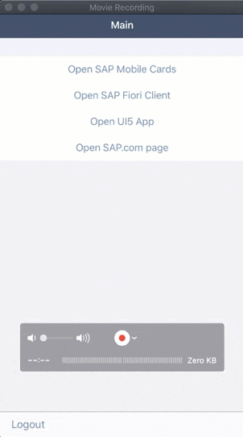
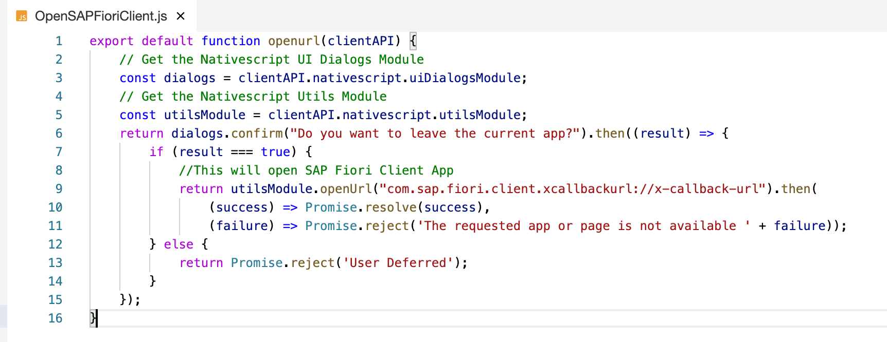
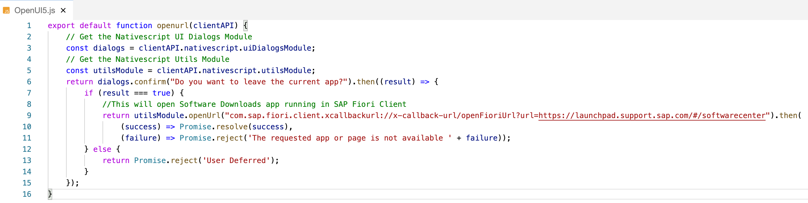
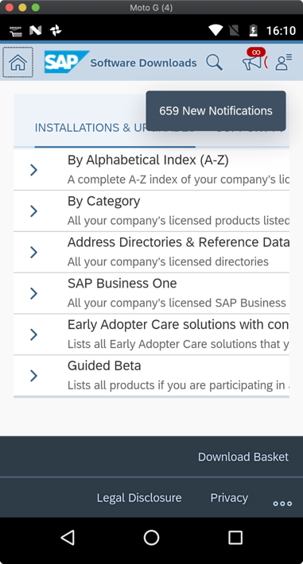
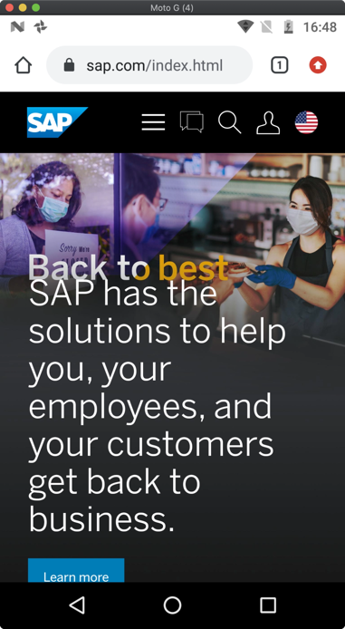

## Prerequisites
- **Tutorial group:** [Set Up for the Mobile Development Kit (MDK)](group.mobile-dev-kit-setup)
- **Download and install:** **SAP Mobile Services Client** on your [iOS](https://apps.apple.com/us/app/sap-mobile-services-client/id1413653544) or [Android](https://play.google.com/store/apps/details?id=com.sap.mobileservices.client) device (If you are connecting to `AliCloud` accounts then you will need to brand your [custom MDK client](cp-mobile-dev-kit-build-client) by allowing custom domains.)
- **Download and install** **SAP Mobile Cards** on your [iOS](https://apps.apple.com/us/app/sap-mobile-cards/id1168110623) or [Android](https://play.google.com/store/apps/details?id=com.sap.content2go&hl=en) device
- **Download and install** **SAP Fiori Client** on your [iOS](https://apps.apple.com/us/app/sap-fiori-client/id824997258) or [Android](https://play.google.com/store/apps/details?id=com.sap.fiori.client&hl=en) device

## Details
### You will learn
  - How to open SAP standard apps like Mobile Cards, Fiori Client from MDK public store client
  - How to open an UI5 app running in a  Fiori Client from an MDK public store client
  - How to open a web page

You may clone an existing project from [GitHub repository](https://github.com/SAP-samples/cloud-mdk-tutorial-samples/tree/master/4-Level-Up-with-the-Mobile-Development-Kit/4-Implement-Deep-Linking-to-Another-App-from-an-MDK-App) and start directly with step 5 in this tutorial.

---

Deep links are used to send users directly to an app instead of a website or a store saving users the time and energy locating a particular page themselves – significantly improving the user experience.

If an app is already installed, you can specify a custom URL scheme (iOS Universal Links) or an intent URL (on Android devices) that opens that app. Using deep link, you can also navigate to specific events or pages, which could tie into campaigns that you may want to run.

!

>**This tutorial has been executed using public store MDK client which has out of the box functionality to open the SAP standard apps like SAP Mobile Cards and SAP Fiori Client.
If you are building a custom version of Mobile development kit client, there you can implement deep links by specifying related custom URL scheme.**

[ACCORDION-BEGIN [Step 1: ](Create a new MDK project in SAP Business Application Studio)]

1. Launch the [Dev space](cp-mobile-bas-setup) in SAP Business Application Studio.

2. Click **Start from template** on Welcome page.

    !

    >If you do not see Welcome page, you can access it via **Help** menu.

3. Select **MDK Project** and click **Start**.

    !  

4. In *Type* step, select or provide the below information and click **Next**:

    | Field | Value |
    |----|----|
    | `MDK template type`| Select `Empty` from the dropdown |
    | `Your project name` | `MDKDeepLink` |
    | `Your application name` | <default name is same as project name, you can provide any name of your choice> |

    !

    >The _MDK Empty Project_ template creates a Logout action, Close page action, rule and an empty page (`Main.page`). After using this template, you can focus on creating your pages, other actions, and rules needed for your application. More details on _MDK template_ is available in [help documentation](https://help.sap.com/doc/f53c64b93e5140918d676b927a3cd65b/Cloud/en-US/docs-en/guides/getting-started/mdk/webide.html#creating-a-new-project).

    >If you see *Cloud foundry token expired, continue without mobile services connection?* message, then set up the Cloud Foundry environment again by navigating to **View** menu > **Find Command**> **CF: Login to Cloud foundry** to initiate a valid session and click Start Over.  

5. After clicking **Next**, the wizard will generate your MDK Application based on your selections. You should now see the `MDKDeepLink` project in the project explorer.

[DONE]
[ACCORDION-END]

[ACCORDION-BEGIN [Step 2: ](Create a new rule)]

In the MDK editor, you will create 4 new Rule files:

  * `OpenSAPMobileCards.js` to open SAP Mobile Cards app
  * `OpenSAPFioriClient.js` to open SAP Fiori Client app
  * `OpenUI5.js` to open an UI5 app running in SAP Fiori Client app
  * `OpenSAPcom.js` to open `SAP.com` web page

    >You can find more details about [writing a Rule](https://help.sap.com/doc/f53c64b93e5140918d676b927a3cd65b/Cloud/en-US/docs-en/guides/getting-started/mdk/development/rules.html).

1. Right-click the **Rules** folder | **MDK: New Rule File** | select **Empty JS Rule**.

    !

2. Enter the Rule name `OpenSAPMobileCards`, press `Enter`.

    !

    Replace the generated snippet with below code.

    ```JavaScript
    export default function OpenSAPMobileCards(context) {
        // Get the Nativescript UI Dialogs Module
        const dialogs = context.nativescript.uiDialogsModule;
        // Get the Nativescript Utils Module
        const utilsModule = context.nativescript.utilsModule;
        return dialogs.confirm("Do you want to leave the current app?").then((result) => {
            if (result === true) {
                //This will open SAP Mobile Cards app
                return utilsModule.openUrl("com.sap.content2go://");
            } else {
                return Promise.reject('User Deferred');
            }
        });
    }
    ```
    !

    >`openUrl` is a `NativeScript` API to open an URL on device. You can find more details about [this API](https://v6.docs.nativescript.org/core-concepts/utils#openurl-function).

3. Save your changes to the `OpenSAPMobileCards.js` file.

4. Repeat the above step and create another new Rule file:

    Enter the file name `OpenSAPFioriClient`, click **OK**.

    Replace the generated snippet with below code.

    ```JavaScript
    export default function OpenSAPFioriClient(context) {
        // Get the Nativescript UI Dialogs Module
        const dialogs = context.nativescript.uiDialogsModule;
        // Get the Nativescript Utils Module
        const utilsModule = context.nativescript.utilsModule;
        return dialogs.confirm("Do you want to leave the current app?").then((result) => {
            if (result === true) {
                //This will open SAP Fiori Client App
                return utilsModule.openUrl("com.sap.fiori.client.xcallbackurl://x-callback-url");
            } else {
                return Promise.reject('User Deferred');
            }
        });
    }
    ```

    !

5. Save your changes to the `OpenSAPFioriClient.js` file.    

6. Repeat the above step and create another new Rule file:

    Enter the file name `OpenUI5`, click **OK**.

    Replace the generated snippet with below code.

    ```JavaScript
    export default function OpenUI5(context) {
        // Get the Nativescript UI Dialogs Module
        const dialogs = context.nativescript.uiDialogsModule;
        // Get the Nativescript Utils Module
        const utilsModule = context.nativescript.utilsModule;
        return dialogs.confirm("Do you want to leave the current app?").then((result) => {
            if (result === true) {
                //This will open Software Downloads app running in SAP Fiori Client
                return utilsModule.openUrl("com.sap.fiori.client.xcallbackurl://x-callback-url/openFioriUrl?url=https://launchpad.support.sap.com/#/softwarecenter");
            } else {
                return Promise.reject('User Deferred');
            }
        });
    }
    ```

    !

7. Save your changes to the `OpenUI5.js` file.   

8. Create one more Rule file and name it to `OpenSAPcom`.

    Replace the generated snippet with below code.

    ```JavaScript
    export default function OpenSAPcom(context) {
        // Get the Nativescript UI Dialogs Module
        const dialogs = context.nativescript.uiDialogsModule;
        // Get the Nativescript Utils Module
        const utilsModule = context.nativescript.utilsModule;
        return dialogs.confirm("Do you want to leave the current app?").then((result) => {
            if (result === true) {
                //This will open SAP.com website
                return utilsModule.openUrl("https://www.sap.com");
            } else {
                return Promise.reject('User Deferred');
            }
        });
    }
    ```

    !

9. Save your changes to the `OpenSAPcom.js` file.

[DONE]
[ACCORDION-END]

[ACCORDION-BEGIN [Step 3: ](Add buttons on main page to open other apps or web pages)]

1. Next, on `Main.page`, drag and drop the **Section Button Table** Container control onto the Page.

    !

    >The controls available in Container section includes controls that act as containers for other controls, such as container items. A container is constant for all pages. The size of a container depends on the controls and contents included inside.  
    You can find more details about [Containers](https://help.sap.com/doc/69c2ce3e50454264acf9cafe6c6e442c/Latest/en-US/docs-en/reference/schemadoc/Page/SectionedTable/Container/ButtonTable.schema.html).

2. Now, you will add items to this Container control.

    Drag and drop the **Section Button** Container Item control onto the page.

    !

3. Repeat the above step, and drag and drop 3 more such **Section Button** Container Item controls.

    !

4. Select the first control and change its title to **Open SAP Mobile Cards**.

    !

5. Repeat the above step and change the title for other controls as below:

    !

[VALIDATE_1]
[ACCORDION-END]

[ACCORDION-BEGIN [Step 4: ](Set onPress handler to the buttons)]

1. In this step, you will bind the JavaScript files to the `OnPress` of each button.

    In `Main.page`, select **Open SAP Mobile Cards** button. In the Properties pane, click the **Events** tab, click the **link icon** for the `Handler` property to open the object browser.

    Double-click the `OpenSAPMobileCards.js` and click **OK** to set it as the `OnPress` action.

    !

3. Repeat the same and do the following:

    Set the handler for **Open SAP Fiori Client** button to `OpenSAPFioriClient.js`.

    Set the handler for **Open UI5 App** button to `OpenUI5.js`.

    Set the handler for **Open SAP.com page** button to `OpenSAPcom.js`.

[DONE]
[ACCORDION-END]

[ACCORDION-BEGIN [Step 5: ](Deploy the application)]

So far, you have learned how to build an MDK application in the SAP Business Application Studio editor. Now, you will deploy this application definition to Mobile Services.


1. Right-click `Application.app` and select **MDK: Deploy**.

    !

2. Select deploy target as **Mobile Services**.

    !

3. Select **Mobile Services Landscape**.

    !    

4. Select application from **Mobile Services**.

    !   

    You should see **Deploy to Mobile Services successfully!** message.

    !

[DONE]
[ACCORDION-END]

[ACCORDION-BEGIN [Step 6: ](Display the QR code for app onboarding)]

SAP Business Application Studio has a feature to generate QR code for app onboarding.

Click the `Application.app` to open it in MDK Application Editor and click **Application QR Code** icon to display the QR code.

!

!

>Leave the Onboarding dialog box open for step 7.

[DONE]
[ACCORDION-END]

[ACCORDION-BEGIN [Step 7: ](Run the app in MDK client)]

>Make sure you are choosing the right device platform tab above. Once you have scanned and onboarded using the onboarding URL, it will be remembered. When you Log out and onboard again, you will be asked either to continue to use current application or to scan new QR code.

[OPTION BEGIN [Android]]

1. Follow [these steps](https://github.com/SAP-samples/cloud-mdk-tutorial-samples/blob/master/Onboarding-Android-client/Onboarding-Android-client.md) to on-board the MDK client.

    Once you accept app update, you will see **Main** page with the buttons you added in previous step 3.

    !

2. Tap **OPEN SAP MOBILE CARDS** and then tap **OK**.

    !

    If you have already installed SAP Mobile Cards app, then MDK app will open it.

    !

3. Tapping **OPEN SAP FIORI CLIENT** will open **SAP Fiori Client** app.

    >If you have access to any Fiori app or Fiori Launchpad page for example [SAP Support Launchpad](https://launchpad.support.sap.com), then enter that URL in your Fiori Client app.

    !

4. Tapping on **OPEN UI5 APP** will open a specific app running in SAP Fiori Client as per `OpenUI5.js` file.

    In below screenshot, there is one Software Downloads UI5 app part of SAP Support Launchpad.

    !

5. Tapping on **OPEN SAP.COM PAGE** will open SAP website.

    !

[OPTION END]

[OPTION BEGIN [iOS]]

1. Follow [these steps](https://github.com/SAP-samples/cloud-mdk-tutorial-samples/blob/master/Onboarding-iOS-client/Onboarding-iOS-client.md) to on-board the MDK client.

    Once you accept app update, you will see **Main** page with the buttons you added in previous step 3.

    !

2. Tap **Open SAP Mobile Cards** and then tap **OK**.

    !

    If you already installed SAP Mobile Cards app, then MDK app will open it.

    !

3. Tapping **Open SAP Fiori Client** will open **SAP Fiori Client** app.

    >If you have access to any Fiori app or Fiori Launchpad page for example [SAP Support Launchpad](https://launchpad.support.sap.com), then enter that URL in your Fiori Client app.

    !

4. Tapping on **Open UI5 App** will open a specific app running in SAP Fiori Client as per `OpenUI5.js` file.

    In below screenshot, there is one Software Downloads UI5 app part of SAP Support Launchpad.

    !

5. Tapping on **Open SAP.com page** will open SAP website.

    !

    >To run this app in your branded client, you need to add Mobile Cards and Fiori Client app URL schemes (`com.sap.content2go`,`com.sap.fiori.client.xcallbackurl`)  in the info.plist.   

[OPTION END]

[VALIDATE_3]
[ACCORDION-END]

---

Congratulations, you have successfully implemented Deep Linking to Another App from your MDK App and you can continue with the remaining tutorials in this mission.

---
