## Details
### You will learn
  - How to delete a customer record
  - How to store changes locally
  - How to sync local changes with backend

---

[ACCORDION-BEGIN [Step 1: ](Store the deleted record locally)]

The next step is to store deleted record locally for an offline application or delete directly back to the backed for online applications. You will now create an OData delete action to delete a customer record. You will also show a failure message if the delete action fails.

First, define a failure message action for displaying a message in case deleting of a customer fails.

Right-click on the **Actions** folder | **New MDK Action** | choose **MDK Message Actions** in **Category** | click **Message Action** | **Next**.

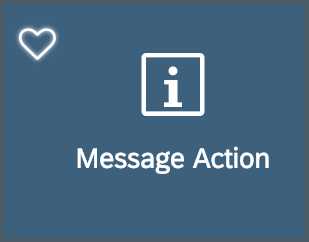

Provide the below information:

| Property | Value |
|----|----|
| `Action Name`| `DeleteCustomerEntityFailureMessage` |
| `Type` | select `Message` |
| `Message` | `Delete entity failure - {{#ActionResults:delete/#Property:error}}` |
| `Title` | `Delete Customer` |
| `OKCaption` | `OK` |
| `OnOK` | `--None--` |
| `CancelCaption` | leave it blank |
| `OnCancel` | `--None--` |

>In this expression `{{#ActionResults:delete/#Property:error}}`, _delete_ is a reference to the **Action Result** name in the _Delete Entity action_ (you will create this action in following step). This reference is used to pass the results to subsequent actions in the chain. These actions can reference the action result as needed. In this case if there is a failure, you access the error property of the action result to display the OData failure message.

>This is the standard Binding Target Path (also called Dynamic Target Path) syntax used when you need to include a binding with other bindings or within a string as used in the message here.

>You could exclude above expression and can just display a generic message.

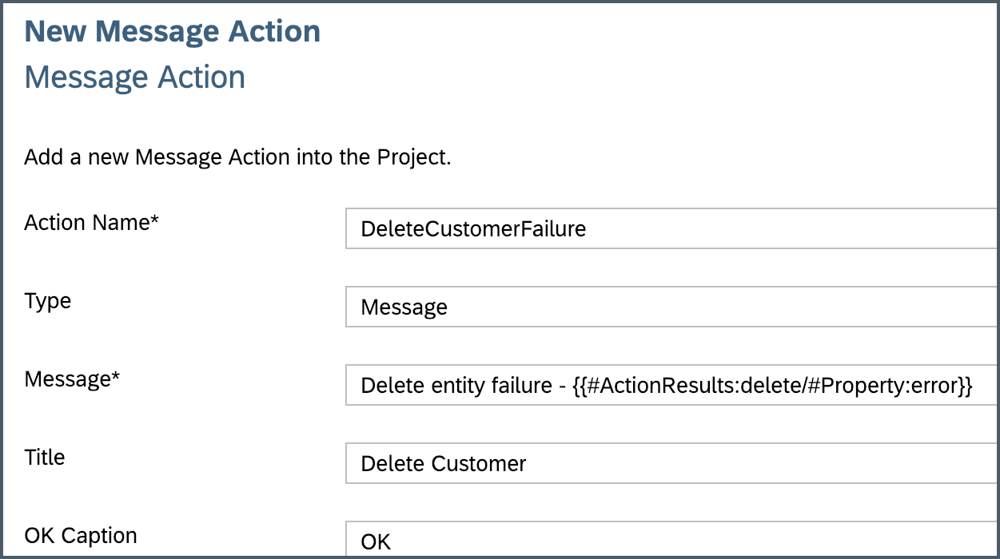

Click **Next** and then **Finish** on the Confirmation step.

Next, you will create the **OData Delete action** to delete a customer record.

>You can find more details about [Delete Entity Action](https://help.sap.com/viewer/977416d43cd74bdc958289038749100e/Latest/en-US/a7fb91f8f07148c4bcadc4774da5e114.html).

Right-click on the **Actions** folder | **New MDK Action** | choose **MDK Data Actions** in **Category** | click **OData Action** | **Next**.


Provide the below information:

| Property | Value |
|----|----|
| `Action Name`| `Customers_DeleteEntity` |
| `Type` | `DeleteEntity` |
| `Service`| `SampleServiceV2` |
| `EntitySet` | `Customers` |
| `ReadLink`| click on link icon and double click on `readLink` |

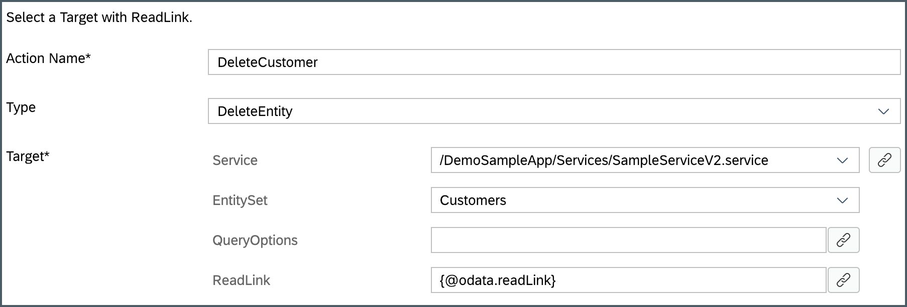

>The `readlink` is a direct reference to an individual entity set entry.

Click **Next** and **Finish** on the confirmation screen. The action editor will open with the `Customers_DeleteEntity.action` loaded.

Next, define _Success_ and _Failure_ actions for `Customers_DeleteEntity.action`.

In the action editor for the new action, expand the **Common Action Properties** and provide the below information:

| Property | Value |
|----|----|
| `Action Result`| `delete` |
| `Success Action` | `CloseModalPage_Complete.action` |
| `Failure Action` | `DeleteCustomerEntityFailureMessage.action` |

>When `Customers_DeleteEntity.action` gets executed successfully then `CloseModalPage_Complete.action` will be triggered or if `Customers_DeleteEntity.action` fails then `DeleteCustomerEntityFailureMessage.action` will be triggered.

>`delete` value for **Action Result** is reference to `DeleteCustomerEntityFailureMessage.action` created in step 1.

>You could also show a success message for `Success Action` or chain a message to success of `CloseModalPage_Complete.action`.

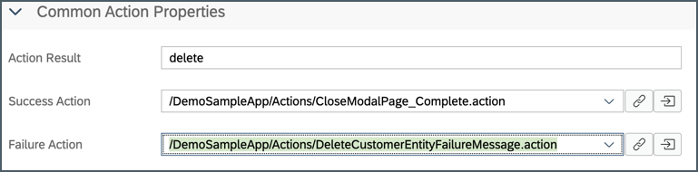

Save the changes to the `Customers_DeleteEntity.action`.

[DONE]
[ACCORDION-END]

[ACCORDION-BEGIN [Step 2: ](Create a new dialog confirmation)]

In the MDK editor, you will write a rule in JavaScript called `Customers_DeleteConfirmation.js` to display a dialog to confirm if user wants to delete current record. On it's confirmation, _customer delete entity action_ is executed.

>You can find more details about [writing a Rule](https://help.sap.com/viewer/977416d43cd74bdc958289038749100e/Latest/en-US/ef1e3404ff5f4ca68676acbda10e4bd0.html).

Right click on the **Rules** folder | **New** | **File**.


Enter the file name `Customers_DeleteConfirmation.js`, click **OK**.

Copy and paste the following code.

```JavaScript
export default function DeleteConfirmation(clientAPI) {
	let dialogs = clientAPI.nativescript.uiDialogsModule;
	return dialogs.confirm("Delete current record?").then((result) => {
		if (result === true) {
			return clientAPI.executeAction('/DemoSampleApp/Actions/Customers_DeleteEntity.action').then(
				(success) => Promise.resolve(success),
				(failure) => Promise.reject('Delete entity failed ' + failure));
		} else {
			return Promise.reject('User Deferred');
		}
	});
}
```

>In above code there is a reference to `Customers_DeleteEntity.action` , you can navigate directly from here to the MDK file by right clicking on it.
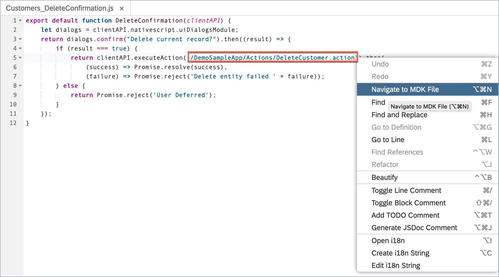

[DONE]
[ACCORDION-END]

[ACCORDION-BEGIN [Step 3: ](Add a trash button to customer details page)]

You will add a button to the _Customer Detail page_ called **Trash**. You will link this button to the `Customers_DeleteConfirmation.js` rule you just created. This event will display a dialog when the **Trash** button is pressed by the end-user.

In `Customers_Detail.page`, drag and drop an **Action Bar Item** to the upper right of the action bar.

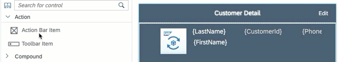

>**Action Bar Item** is a button that users can use to fire actions when pressed. You can add an Action Bar Item only to the Action Bar (at the top of the page).

Click the **link icon** to open the object browser for the **System Item** property.

Double click on the **Trash** type and click **OK**.

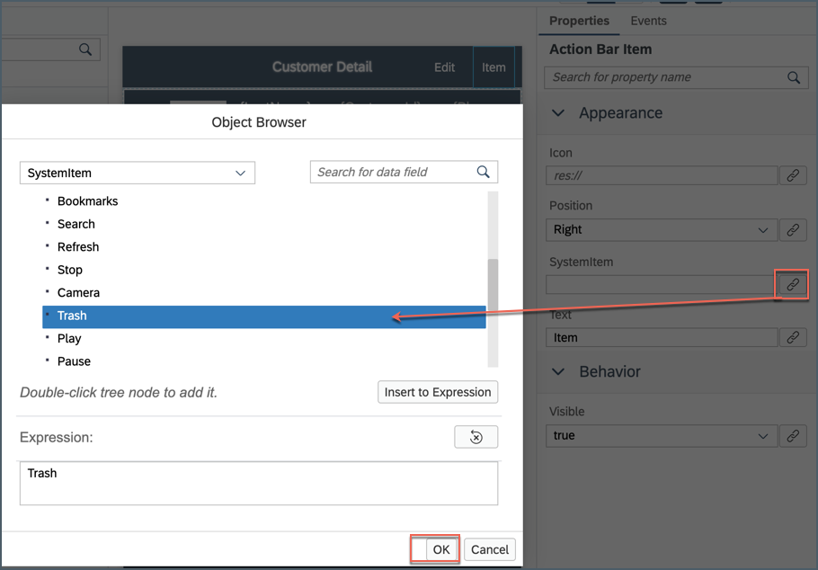

Next, click the **Events** tab, click the **link icon** for the `OnPress` property to open the object browser.

Double Click on the `Customers_DeleteConfirmation.js` rule and click **OK** to set it as the `OnPress` Action.

>You could link `OnPress` property directly to OData delete action directly instead to this JavaScript file. Idea of linking to  JavaScript file is to let you understand another way to achieve similar functionality.

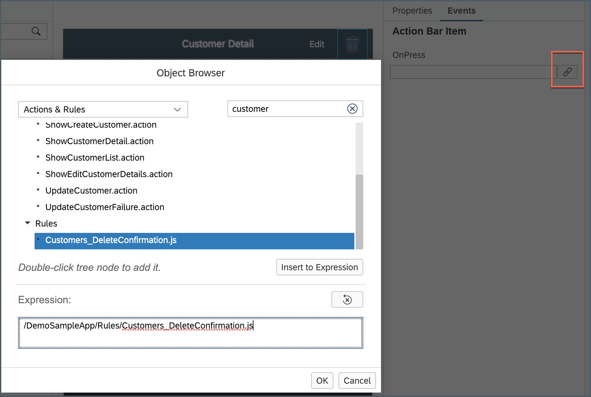

Save the changes to the `Customers_Detail.page`.

[DONE]
[ACCORDION-END]

[ACCORDION-BEGIN [Step 4: ](Deploy and activate the application)]

Deploy the updated application to your MDK client.

Right-click on the `DemoSampleApp` MDK Application in the project explorer pane and select **MDK Deploy and Activate**.


Since we have deployed already both the destination and app id should be pre-selected based on the last time you deployed our application.  Confirm the **Destination Name** is `mobileservices_cf` and the **Application Id** is `com.sap.mdk.demo` and click **Next**.

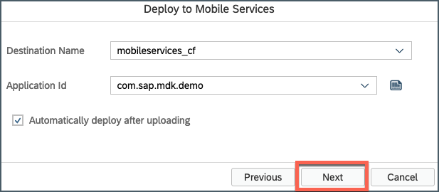

[DONE]
[ACCORDION-END]

[ACCORDION-BEGIN [Step 5: ](Test the application)]

>Make sure you are choosing the right device platform tab above.

[OPTION BEGIN [Android]]

Re-launch the app on your device, you may asked to authenticate with passcode or Fingerprint. You will see a _Confirmation_ pop-up, tap **OK**.

Tap **CUSTOMER LIST** | tap any record | tap trash icon.

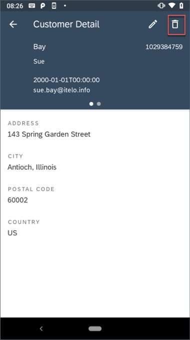

A confirmation dialog appears for user action, tap **OK**.

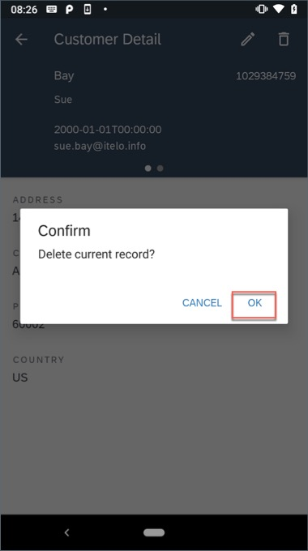

Since this is an Offline application, record has been removed from local store and deletion request has been added to request queue. This has to be sent or uploaded to the backend explicitly.  

>MDK base template has added a **Sync** button on main page of the app to upload local changes from device to the backend and to download the latest changes from backend to the device. Actions | Service | `UploadOffline.action` & `DownloadOffline.action`.

On Main page, tap **SYNC**, a successful message will be shown.

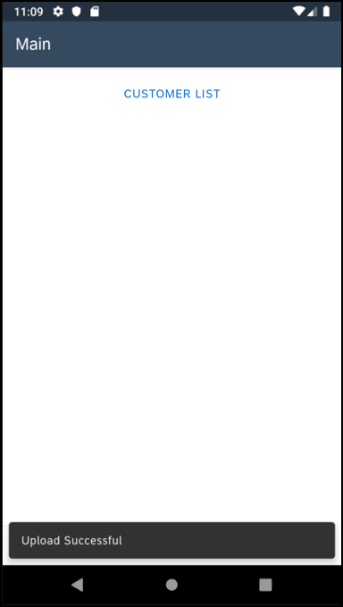

[OPTION END]

[OPTION BEGIN [iOS]]

Re-launch the app on your device, you may asked to authenticate with passcode or Touch ID. You will see a _Confirmation_ pop-up, tap **OK**.

Tap **Customer List** | tap any record | tap trash icon.

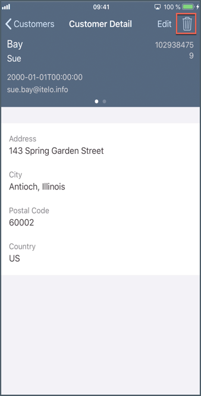

A confirmation dialog appears for user action, tap **OK**.

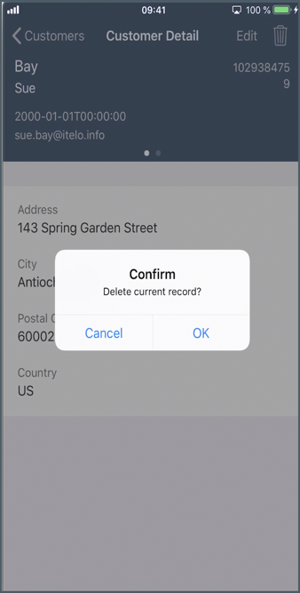

Since this is an Offline application, record has been removed from local store and deletion request has been added to request queue. This has to be sent or uploaded to the backend explicitly.  

>MDK base template has added a **Sync** button on main page of the app to upload local changes from device to the backend and to download the latest changes from backend to the device. Actions | Service | `UploadOffline.action` & `DownloadOffline.action`.

On Main page, tap **Sync**, a successful message will be shown.

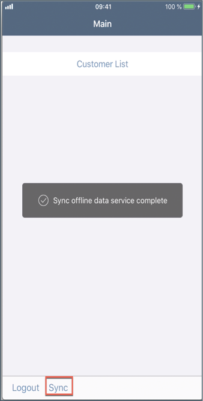

[OPTION END]

You can cross verify if this record has been deleted in the backend.

>Backend URL can be found in [Mobile Services Cockpit](https://developers.sap.com/tutorials/cp-mobile-dev-kit-ms-setup.html).

>Mobile Applications | Native/Hybrid | Click on the MDK App com.sap.mdk.demo | Mobile Sample OData ESPM | click Root URL `v2` | add `/Customers`/ at the end of the URL

>As Sync is pressed, `UploadOffline.action` gets trigger to upload local changes from device to the backend and on success of this call, `DownloadOffline.action` is being called.

[VALIDATE_1]
[ACCORDION-END]

---
