## Details
### You will learn
  - How to delete a customer record
  - How to store changes locally on Mobile app and sync these changes with backend
  - How to update a record in web application

You may clone an existing project from [GitHub repository](https://github.com/SAP-samples/cloud-mdk-tutorial-samples/tree/master/3-Enhance-Your-First-MDK-App-with-Additional-Functionalities/1-cp-mobile-dev-kit-create-customer) to start with this tutorial.

---


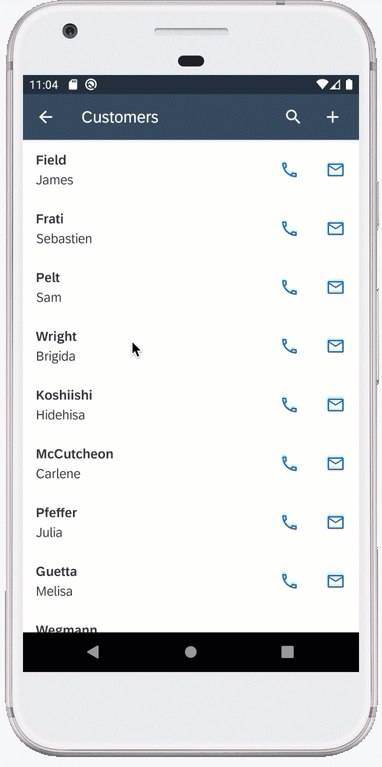


[ACCORDION-BEGIN [Step 1: ](Store the deleted record locally)]

The next step is to store deleted record locally for an offline application or delete directly back to the backed for online applications. You will now create an OData delete action to delete a customer record. You will also show a failure message if the delete action fails.

1. Define a failure message action for displaying a message in case deleting of a customer fails.

    Right-click the **Actions** folder | **MDK: New Action** | choose **MDK Message Actions** in **Category** | click **Message Action** | **Next**.

    !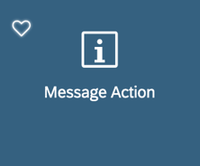

    Provide the below information:

    | Property | Value |
    |----|----|
    | `Action Name`| `DeleteCustomerEntityFailureMessage` |
    | `Type` | Select `Message` from the dropdown |
    | `Message` | `Delete entity failure - {#ActionResults:delete/error}` |
    | `Title` | `Delete Customer` |
    | `OKCaption` | `OK` |
    | `OnOK` | `--None--` |
    | `CancelCaption` | leave it blank |
    | `OnCancel` | `--None--` |

    !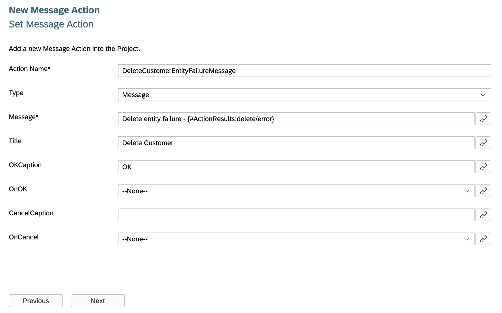

    >In this expression `{#ActionResults:delete/error}`, _delete_ is a reference to the **Action Result** name in the _Delete Entity action_ (you will create this action in following step). This reference is used to pass the results to subsequent actions in the chain. These actions can reference the action result as needed. In this case if there is a failure, you access the error property of the action result to display the OData failure message.

    >This is the standard Binding Target Path (also called Dynamic Target Path) syntax used when you need to include a binding with other bindings or within a string as used in the message here.

    >You could exclude above expression and can just display a generic message.

    Click **Next** and then **Finish** on the Confirmation step.

    >Ignore the error *cannot get action result for delete* as *delete* reference is currently missing, it will be fixed after sub-step 3.

2. Next, you will create the **OData Delete action** to delete a customer record.

    >You can find more details about [Delete Entity Action](https://help.sap.com/doc/69c2ce3e50454264acf9cafe6c6e442c/Latest/en-US/docs-en/reference/schemadoc/Action/ODataService/DeleteEntity.schema.html).

    Right-click the **Actions** folder | **MDK: New Action** | choose **MDK Data Actions** in **Category** | click **OData Action** | **Next**.

    !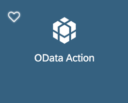

    Provide the below information:

    | Property | Value |
    |----|----|
    | `Action Name`| `Customers_DeleteEntity` |
    | `Type` | Select `DeleteEntity` from the dropdown |
    | `Service`| Select `SampleServiceV2.service` from the dropdown |
    | `EntitySet` | Select `Customers` from the dropdown |
    | `ReadLink`| click link icon and double click `readLink` |

    !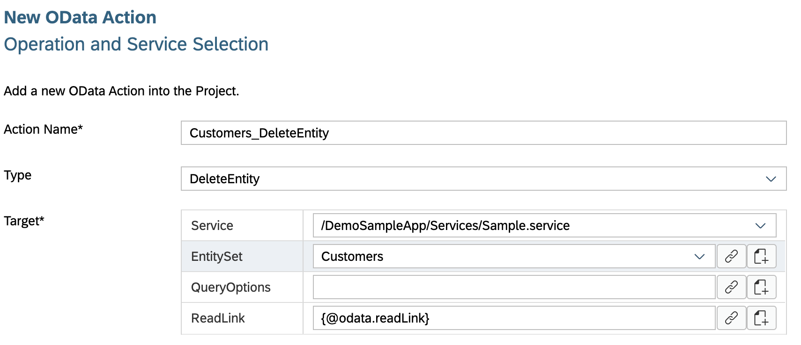

    >The `readLink` is a direct reference to an individual entity set entry.

    Click **Next** and **Finish** on the confirmation screen. The action editor will open with the `Customers_DeleteEntity.action` loaded.

3. Next, define _Success_ and _Failure_ actions for `Customers_DeleteEntity.action`.

    In the action editor for the new action, expand the **Common Action Properties** and provide the below information:

    | Property | Value |
    |----|----|
    | `Action Result`| `delete` |
    | `Success Action` | Click the link icon and bind it to `CloseModalPage_Complete.action` |
    | `Failure Action` | Click the link icon and bind it to `DeleteCustomerEntityFailureMessage.action` |

    !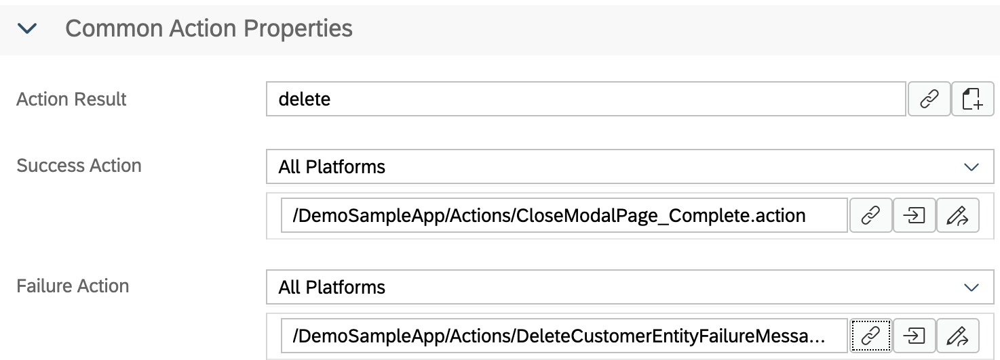

    >When `Customers_DeleteEntity.action` gets executed successfully then `CloseModalPage_Complete.action` will be triggered or if `Customers_DeleteEntity.action` fails then `DeleteCustomerEntityFailureMessage.action` will be triggered.

    >`delete` value for **Action Result** is reference to `DeleteCustomerEntityFailureMessage.action` created in sub-step 1.

    >You could also show a success message for `Success Action` or chain a message to success of `CloseModalPage_Complete.action`.    

[DONE]
[ACCORDION-END]

[ACCORDION-BEGIN [Step 2: ](Create a new message confirmation)]

In the MDK editor, you will write a rule in JavaScript called `Customers_DeleteConfirmation.js` to display a message to confirm if user wants to delete current record. On it's confirmation, _customer delete entity action_ is executed.

1. Right-click the **Actions** folder | **MDK: New Action** | choose **MDK Message Actions** in **Category** | click **Message Action** | **Next**.

    !

    Provide the below information:

    | Property | Value |
    |----|----|
    | `Action Name`| `DeleteConfirmation` |
    | `Type` | Select `Message` from the dropdown |
    | `Message` | `Delete current entity?` |
    | `Title` | `Delete Confirmation` |
    | `OKCaption` | `OK` |
    | `OnOK` | `--None--` |
    | `CancelCaption` | `CANCEL` |
    | `OnCancel` | `--None--` |

    !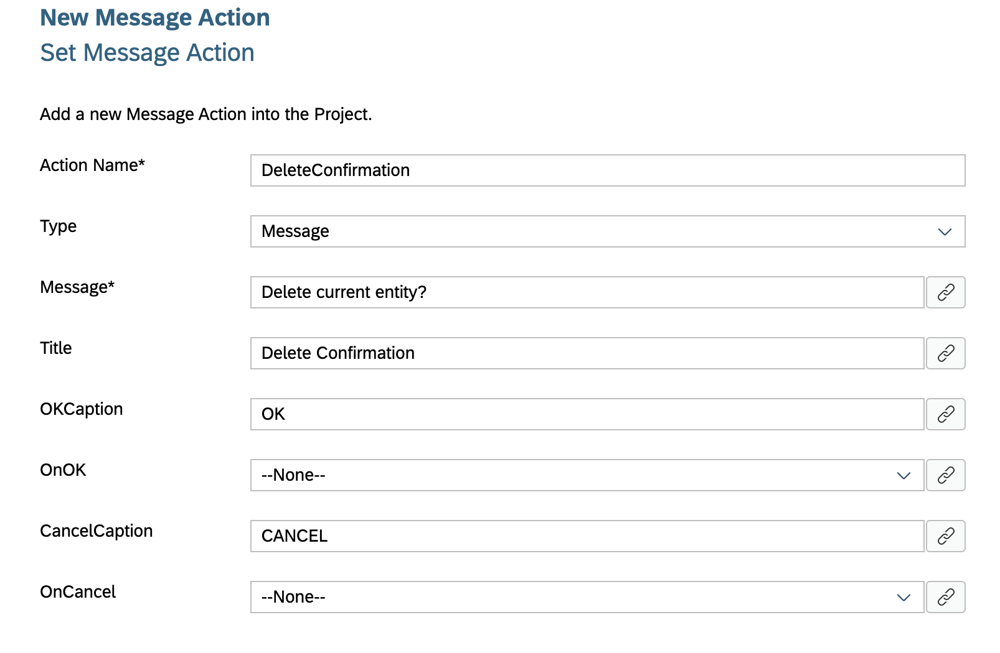

2. Right-click the **Rules** folder | **MDK: New Rule File** | select **Empty JS Rule**.

    !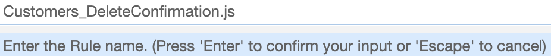

3. Enter the Rule name `Customers_DeleteConfirmation`, click **Next** and then **Finish** on the confirmation step.

    Copy and paste the following code.

    ```JavaScript
    export default function DeleteConfirmation(context) {
        return context.executeAction('/DemoSampleApp/Actions/DeleteConfirmation.action').then((result) => {
            if (result.data) {
                return context.executeAction('/DemoSampleApp/Actions/Customers_DeleteEntity.action').then(
                    (success) => Promise.resolve(success),
                    (failure) => Promise.reject('Delete entity failed ' + failure));
            } else {
                return Promise.reject('User Deferred');
            }
        });
    }
    ```

    >In above code there is a reference to `Customers_DeleteEntity.action` , you can navigate directly from here to the MDK file by right clicking on it.

    >!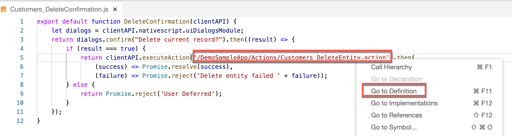

3. Save the changes.

[VALIDATE_2]
[ACCORDION-END]

[ACCORDION-BEGIN [Step 3: ](Add a trash button to customer details page)]

You will add a button to the _Customer Detail page_ called **Trash**. You will link this button to the `Customers_DeleteConfirmation.js` rule you just created. This event will display a dialog when the **Trash** button is pressed by the end-user.

1. In `Customers_Detail.page`, drag and drop an **Action Bar Item** to the upper right of the action bar.

    !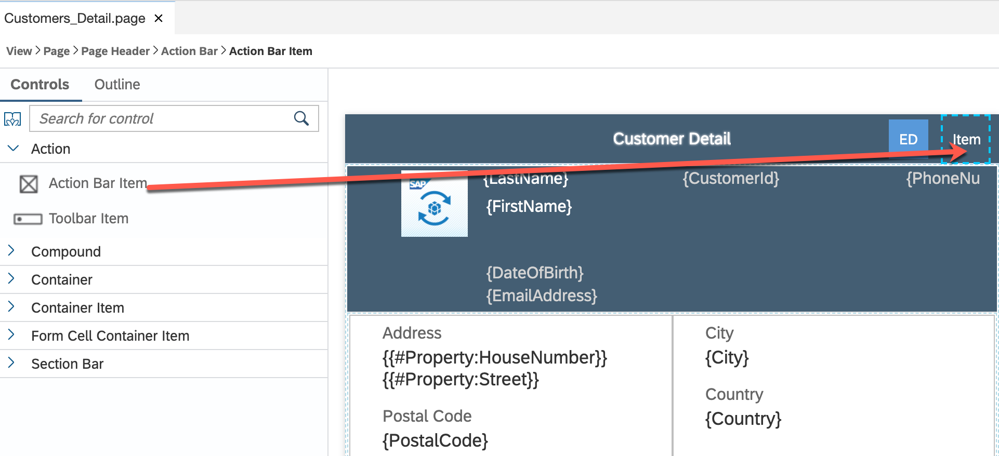

    >**Action Bar Item** is a button that users can use to fire actions when pressed. You can add an Action Bar Item only to the Action Bar (at the top of the page).

    Click the **link icon** to open the object browser for the **System Item** property.

    Double click the **Trash** type and click **OK**.

    !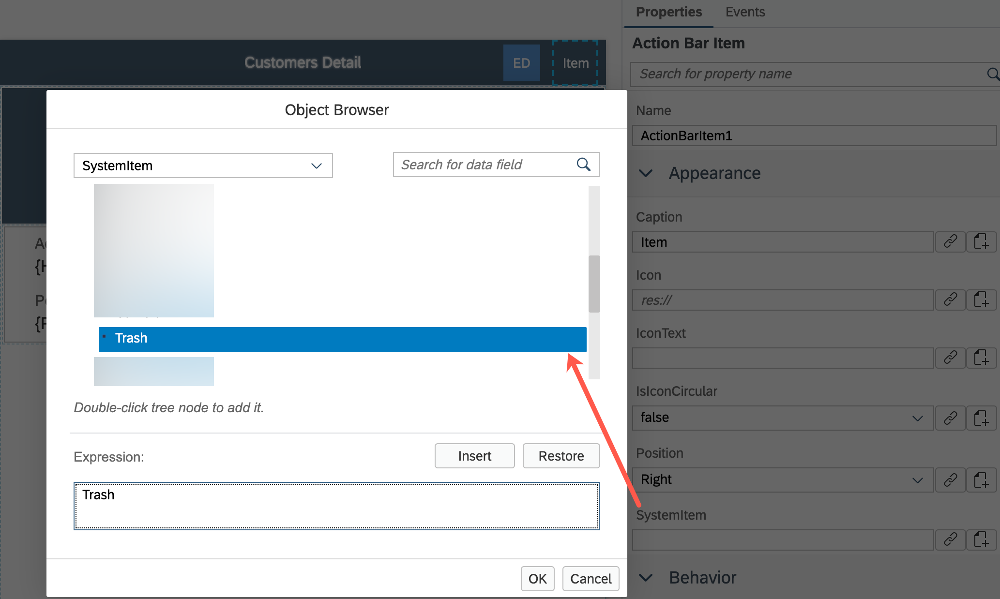

2. Next, click the **Events** tab, click the 3 dots icon for the `OnPress` property to open the **Object Browser**.

    Double click the `Customers_DeleteConfirmation.js` rule and click **OK** to set it as the `OnPress` Action.

    >You could link `OnPress` property directly to OData delete action directly instead to this JavaScript file. Idea of linking to  JavaScript file is to let you understand another way to achieve similar functionality.

    !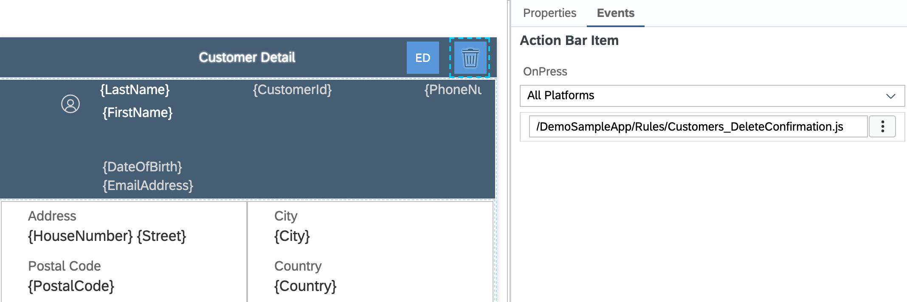

[DONE]
[ACCORDION-END]

[ACCORDION-BEGIN [Step 4: ](Deploy the application)]

Deploy the updated application to your MDK client.

1. Right-click `Application.app` and select **MDK: Deploy**.

    !

2. Select deploy target as **Mobile & Cloud**.

    !

    You should see success message for both deployments.

    !

    >Alternatively, you can select *MDK: Redeploy* in the command palette (View menu>Find Command OR press Command+Shift+p on Mac OR press Ctrl+Shift+P on Windows machine), it will perform the last deployment.

    >!

[DONE]
[ACCORDION-END]

[ACCORDION-BEGIN [Step 5: ](Run the app)]

>Make sure you are choosing the right device platform tab above.

[OPTION BEGIN [Android]]

1. Re-launch the app on your device, you may asked to authenticate with passcode or Biometric authentication. You will see a _Confirmation_ pop-up, tap **OK**.

2. Tap **Customer List** | tap any record | tap trash icon.

    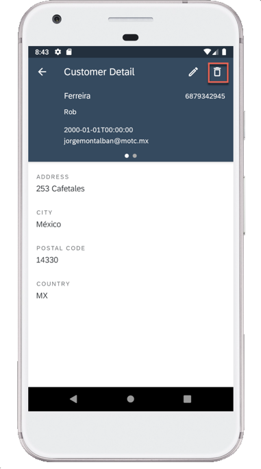

3. A confirmation dialog appears for user action, tap **OK**.

    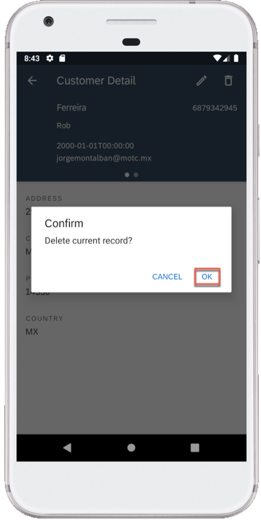

    Since this is an Offline application, record has been removed from local store and deletion request has been added to request queue. This has to be sent or uploaded to the backend explicitly.  

    >MDK base template has added a **Sync** button on main page of the app to upload local changes from device to the backend and to download the latest changes from backend to the device. Actions | Service | `UploadOffline.action` & `DownloadOffline.action`.

4. On Main page, tap **Sync**, a successful message will be shown.

    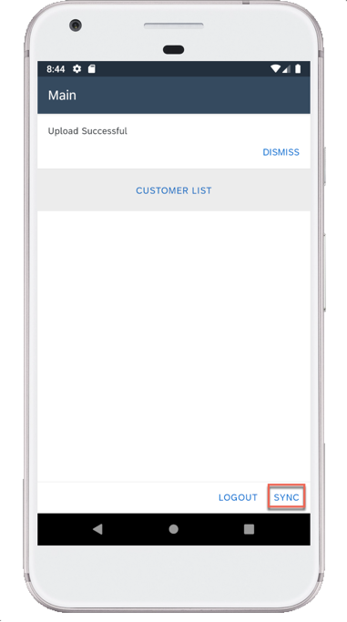

[OPTION END]

[OPTION BEGIN [iOS]]

1. Re-launch the app on your device, you may asked to authenticate with passcode or Biometric authentication. You will see a _Confirmation_ pop-up, tap **OK**.

2. Tap **Customer List** | tap any record | tap trash icon.

    

3. A confirmation dialog appears for user action, tap **OK**.

    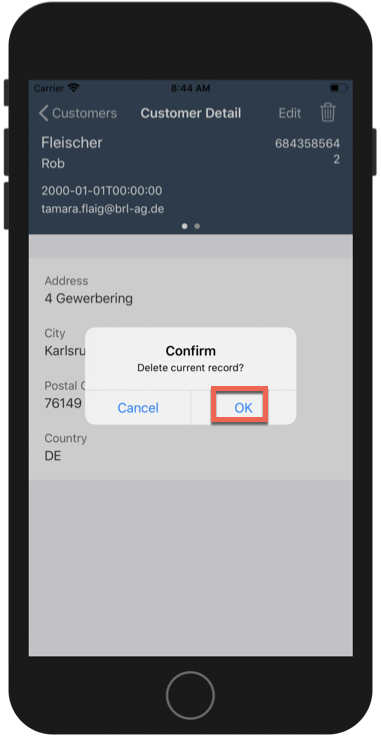

    Since this is an Offline application, record has been removed from local store and deletion request has been added to request queue. This has to be sent or uploaded to the backend explicitly.  

    >MDK base template has added a **Sync** button on main page of the app to upload local changes from device to the backend and to download the latest changes from backend to the device. Actions | Service | `UploadOffline.action` & `DownloadOffline.action`.

4. On Main page, tap **Sync**, a successful message will be shown. As Sync is pressed, `UploadOffline.action` gets triggered to upload local changes from device to the backend and on success of this call, `DownloadOffline.action` is being called.

    

[OPTION END]

[OPTION BEGIN [Web]]


1. Either click the highlighted button or refresh the web page to load the changes.

    !

    >If you see the error `404 Not Found: Requested route ('xxxxx-dev-nsdemosampleapp-approuter.cfapps.xxxx.hana.ondemand.com') does not exist.` while accessing the web application, make sure that in your space cockpit, highlight applications are in started state.

    >!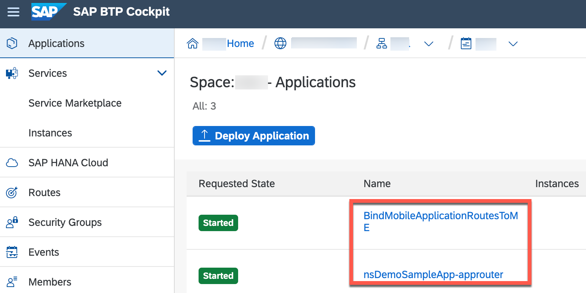

2. Click **Customer List**| click any record | click **Trash**.

    !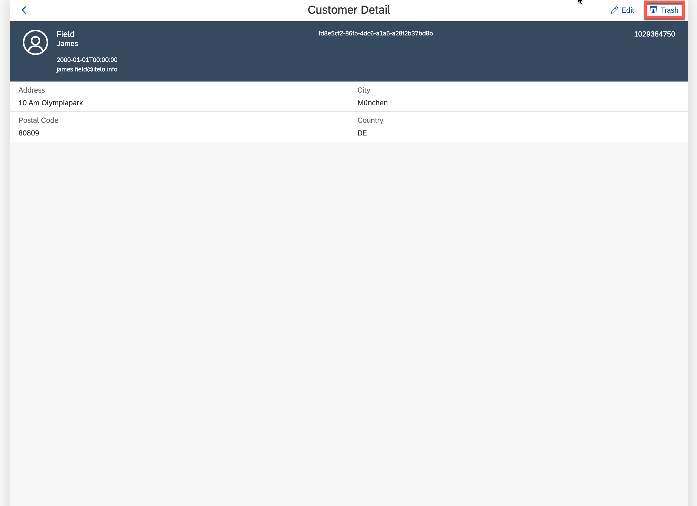

3. A confirmation dialog appears for user action, click **OK**.

    !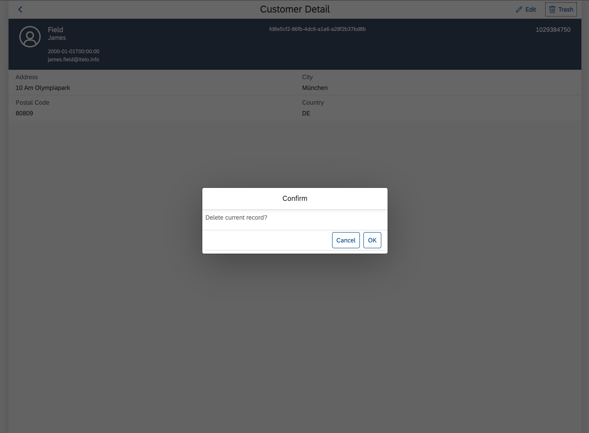

[OPTION END]

You can cross verify if this record has been deleted in the backend.

>Backend URL can be found in [Mobile Services Cockpit](cp-mobile-dev-kit-ms-setup).

>**Mobile Applications** | **Native/Hybrid** | click the MDK App **com.sap.mdk.demo** | **Mobile Connectivity** | click **Launch in Browser** icon

>!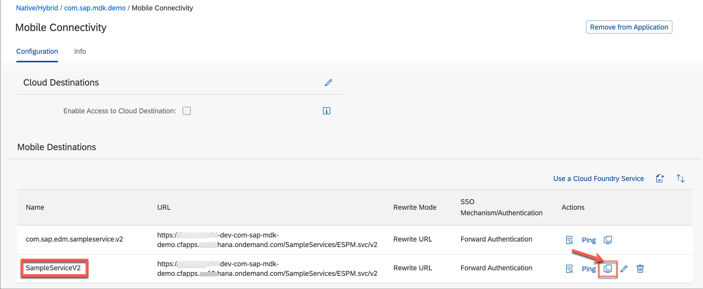

>It will open the URL in a new tab, remove `?auth=uaa` and add `/Customers` at the end of the URL.

[VALIDATE_3]
[ACCORDION-END]

---
