## Details
### You will learn
  - How to create a new page and add some controls to display customer information
  - How to navigate from one page to another page

---

To enhance your MDK app with customer details information, you need to carry out the following tasks:

*  Create a new customer details page
*  Add some controls to the page to display information like id, name, email, phone, address
*  Create a new navigation action to the customer details page
*  Navigate from customer list page to details page
*  Deploy the app metadata to SAP Mobile Services & Cloud Foundry
*  Update the app with new changes

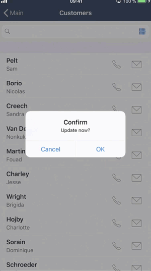

[ACCORDION-BEGIN [Step 1: ](Create the customer detail page)]

This page will show related details for a customer. In this page, you will add an **Object Header** control that is used to display information (like first name, last name, date of birth, email address & phone number) about the header of an object and **Static Key Value** control to display key value pair items like address, city, postal code & country.

1. In SAP Business Application Studio project, Right-click the **Pages** folder | **MDK: New Page** | **Section Page** | **Next**.

    !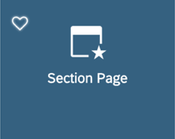

2. Enter the Page Name `Customers_Detail` and click **Next** and the **Finish** on the Confirmation step.

    !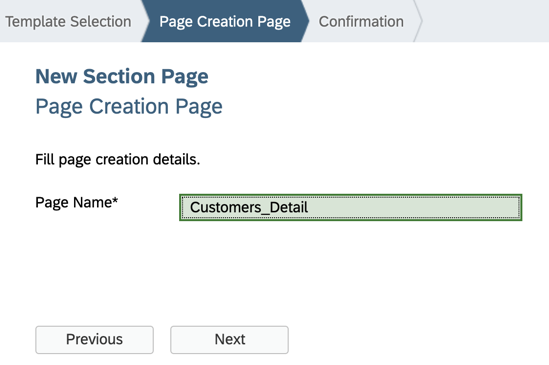

3. In the **Properties** pane set the Caption to **Customer Detail**.

    !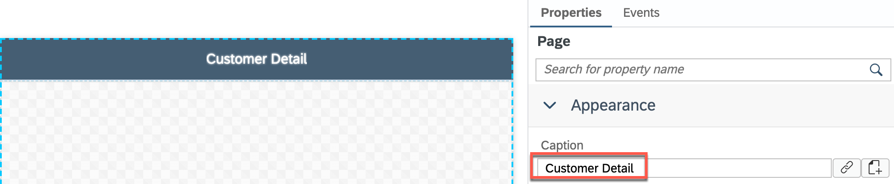

4. Next, you will add an **Object Header** container to display information like first name, last name, date of birth, email address & phone number.

    In the Layout Editor, expand the **Controls** | **Static Container** group, drag and drop the **Object Header** control onto the page area.

    !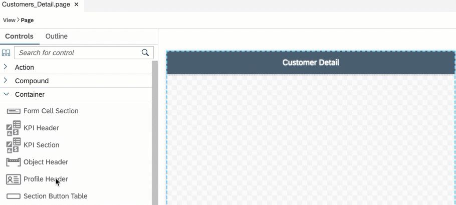

5. Now, you will replace the default values of the control's properties with the values from customer entity.

    In the Properties pane, click the **link icon** to open the Object Browser for the `BodyText` property.

    Double click the `DateOfBirth` property of the Customer entity to set it as the binding expression and click **OK**.

    !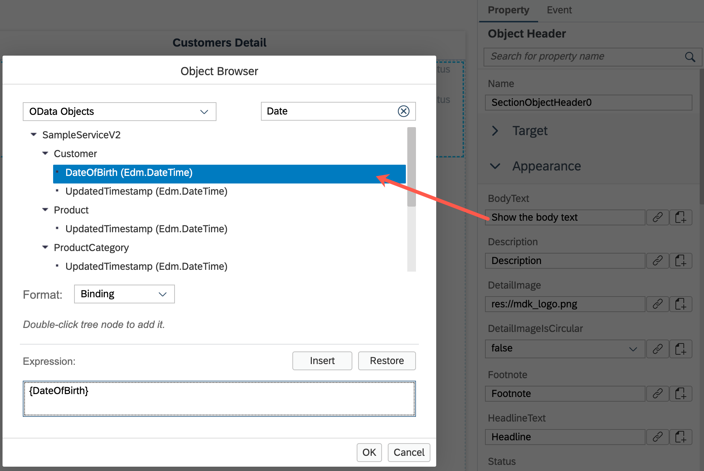

6. Repeat the above steps binding below Properties:

    | Property | Value |
    |----|----|
    | `Description` | `{CustomerId}` |
    | `DetailImage` | `sap-icon://customer` |
    | `FootNote`| `{EmailAddress}` |
    | `HeadlineText`| `{LastName}` |
    | `Status` | `{PhoneNumber}` |
    | `Subhead` | `{FirstName}` |

    >`DetailImage` property is referencing [SAP font icon](https://openui5.hana.ondemand.com/test-resources/sap/m/demokit/iconExplorer/webapp/index.html#/overview/SAP-icons).

    >Make sure to select values for the mentioned properties only from **Customer** Entity. You may find similar values from other entities. For example,

    >!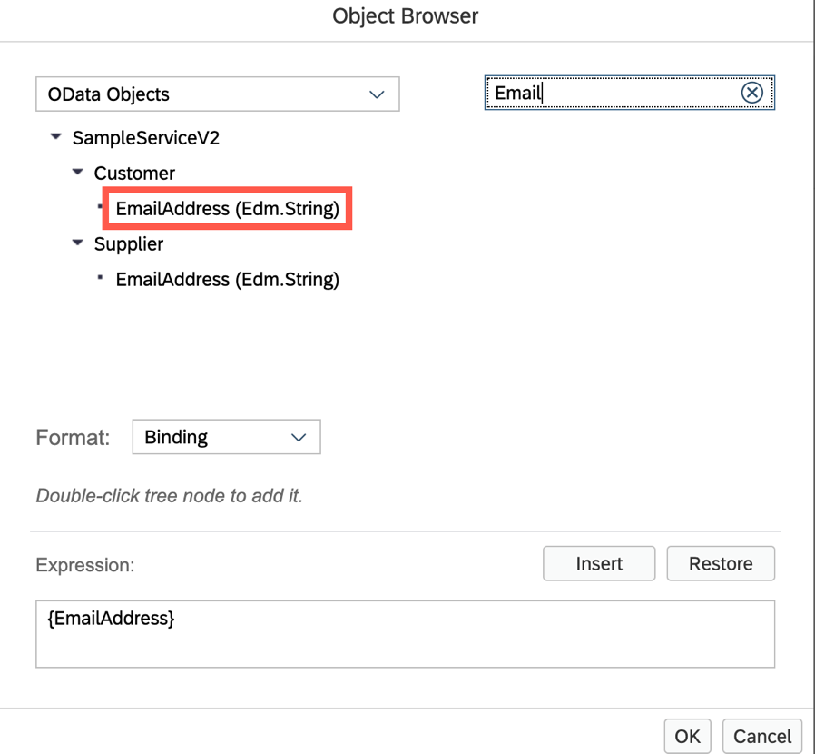

7. As enough fields have been selected to be displayed on the detail page, `Substatus` and `Tags` are not required for this tutorial. In a real use case, you may need these properties.

    Remove the default value for `Substatus` properties.

8. Also, delete items under `Tags`.

    !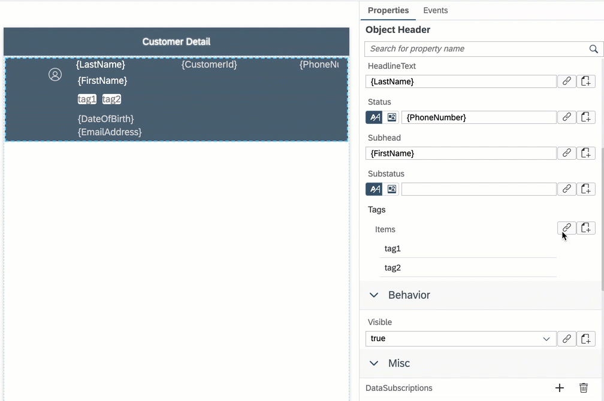

    Page should look like below.

    !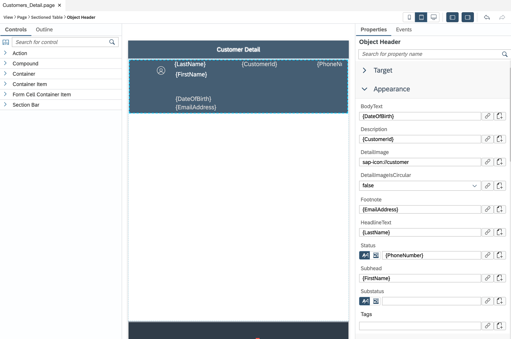

9. In the main area of the page, let's display some other details like; address, city, postal code, county.

    Drag and drop a **Static Key Value** container onto the page under the **Object Header**.

    !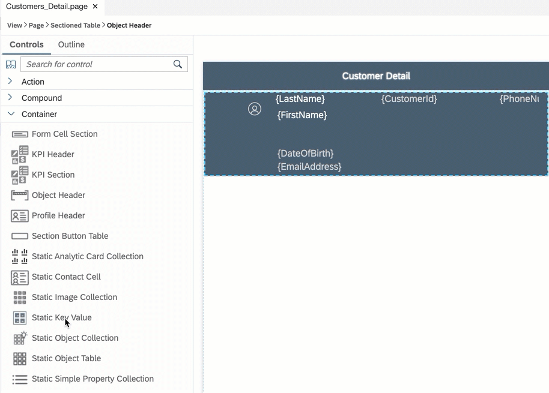

10. Expand the **Static Items** section of the Controls palette and drag and drop a **Key Value Item** onto the **Static Key Value** container on the page.

    !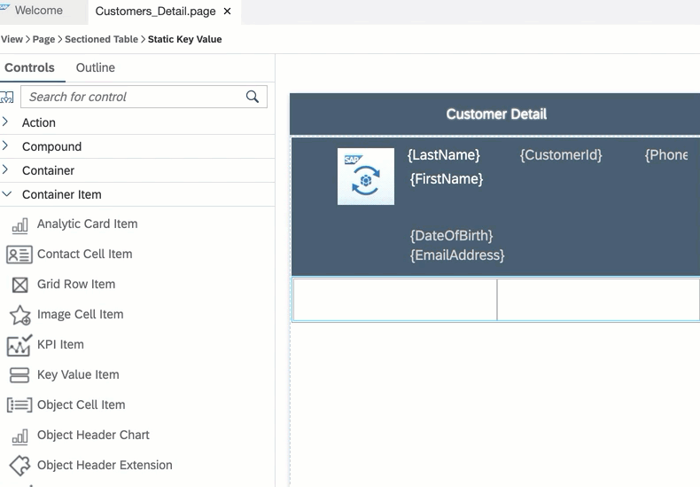

11. Repeat the process and drag three more Key Value Items onto the **Static Key Value** section so you have a total of four when you are done.

    !

12. Select the **upper left** Key Value Item and set the `KeyName` to **Address**.

      !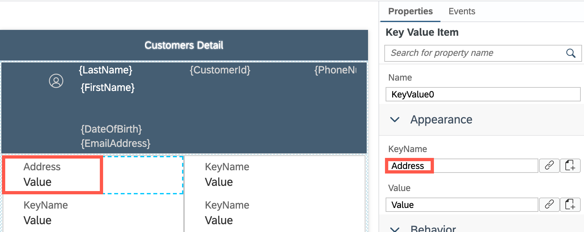

13. For this tutorial, you will set the value as a combined binding of house number and street. You can find more details about [Target Path](https://help.sap.com/doc/f53c64b93e5140918d676b927a3cd65b/Cloud/en-US/docs-en/guides/getting-started/mdk/development/property-binding/target-path.html).

    Start with first part of the binding for **Address** property.

    Click the **link icon** next to the **Value** field to display the Object Browser and double click `HouseNumber` to set it as the first part of the binding. **Don't click OK as you will set second part of the binding too.**

    !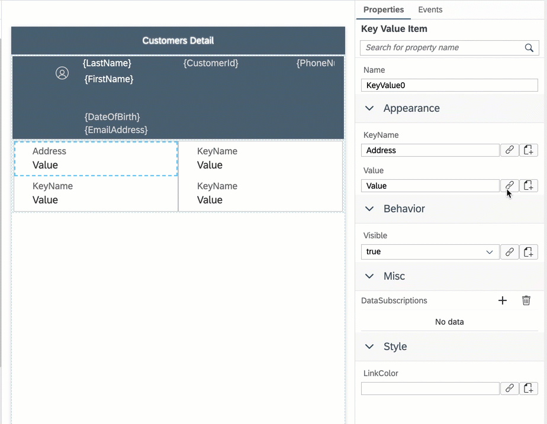

    >Be careful not to select `HouseNumber` from `Address (ESPM.Address)`, final expression should be as per above animation.

    Now, set second part of the binding.

    The cursor will be at the end of binding in the Expression field. Add a space and then select **Street** property and click **Insert**.

    Click **OK** to set the binding.

    !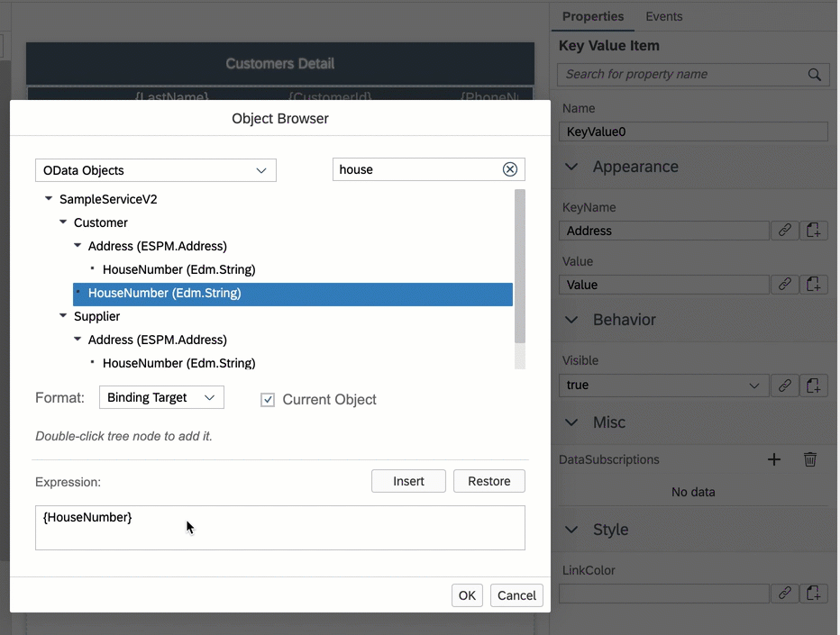

    >Be careful not to double click **Street** as that will replace the existing expression with just the Street property.

    >**Street** should be selected from **Customer** entity.

14. Repeat the process and set the **upper right** Key Value Item `KeyName` to **City** and bind the value to the `City` entity property.

15. Repeat the process and set the **lower left** Key Value Item `KeyName` to **Postal Code** and bind the value to the `PostalCode` entity property.

16. Repeat the process and set the **lower right** Key Value Item `KeyName` to **Country** and bind the value to the `Country` entity property.

    >Be careful not to select _City_, _Postal Code_ & _City_ from Customer.Address (ESPM.Address) collection.

    The page design should look like as below screenshot.

    !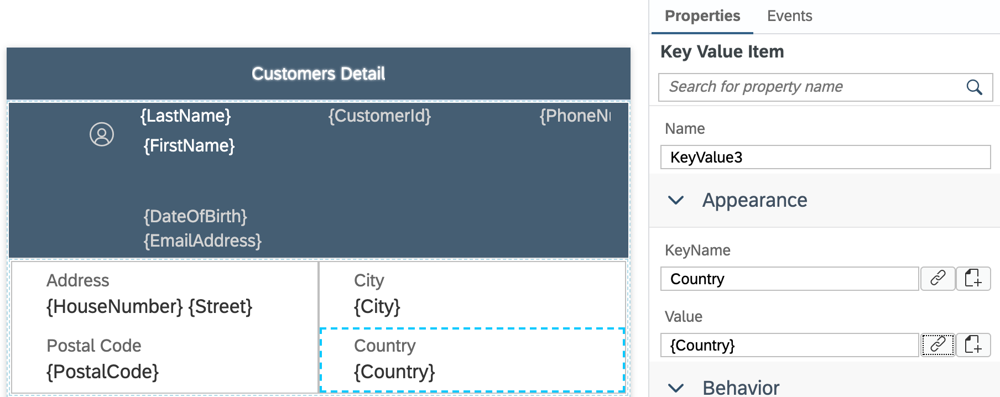

[DONE]
[ACCORDION-END]

[ACCORDION-BEGIN [Step 2: ](Create a navigation action)]

Now, you will create a Navigation action that opens the `Customers_Detail.page` when called.

1. In SAP Business Application Studio project, right-click the **Actions** folder | **MDK: New Action** | choose **MDK UI Actions** in **Category** | click **Navigation Action** | **Next**.

    !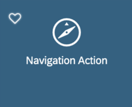

2. Provide the below information, click **Next** and then **Finish** on the confirmation step.

    | Field | Value |
    |----|----|
    | `Action Name`| `NavToCustomers_Detail` |
    | `PageToOpen` | Select `Customers_Detail.page` from the dropdown |

    !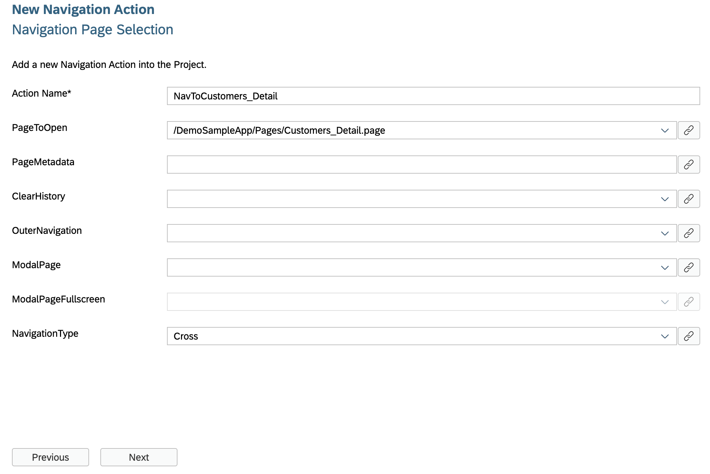

[DONE]
[ACCORDION-END]

[ACCORDION-BEGIN [Step 3: ](Set the OnPress of the customer list)]

In the`Customers_List.page` , you will set the `OnPress` event of the Contact Cell table control. You will link the Contact Cell table control to the `NavToCustomers_Detail.action` so that when an end-user selects a customer, the Customer Detail page will open. MDK automatically passes the selected customer to the detail page.

1. In `Customers_List page`, select the **Contact Cell Table** control, **click** the 3 dots icon under the **Events** tab for the `OnPress` property to click the **Object Browser**.

2. Double click the `NavToCustomers_Detail.action` and click **OK** to set it as the `OnPress` Action.

    !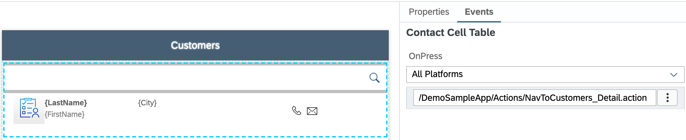

[DONE]
[ACCORDION-END]

[ACCORDION-BEGIN [Step 4: ](Deploy the application)]

Deploy the updated application to your MDK client.

1. Right-click `Application.app` and select **MDK: Deploy**.

    !

2. Select deploy target as **Mobile & Cloud**.

    !

    You should see success message for both deployments.

    !

    >Alternatively, you can select *MDK: Redeploy* in the command palette (View menu>Find Command OR press Command+Shift+p on Mac OR press Ctrl+Shift+P on Windows machine), it will perform the last deployment.

    >!

[DONE]
[ACCORDION-END]

[ACCORDION-BEGIN [Step 5: ](Run the app)]

>Make sure you are choosing the right device platform tab above.

[OPTION BEGIN [Android]]

1. Re-launch the app on your device, you may asked to authenticate with passcode or Biometric authentication. You will see a _Confirmation_ pop-up, tap **OK**.

    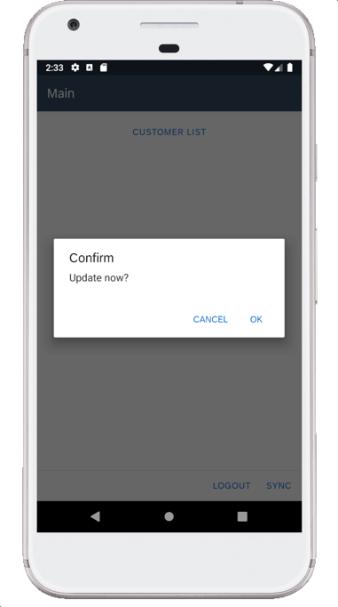

2. Tap **Customer List**, you will navigate to Customer List page.

    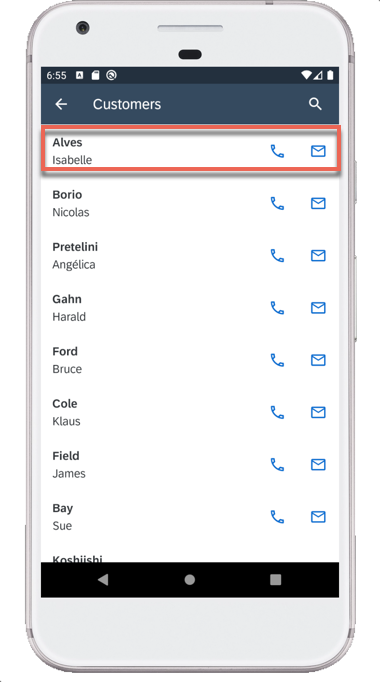

3. Tap any record from the list, you will navigate to it's detail page.

    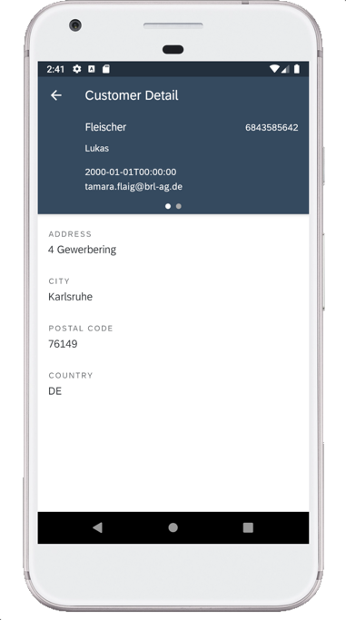

    >_Are you wondering how exactly MDK knew that clicking on a record in  list page would display respective record in detail page?_

    >The MDK sets the current object to the selected record when running the on press action on the list.  The detail page then just needs to reference the correct properties assuming they are part of the object from the list page. You can look at [documentation](https://help.sap.com/doc/f53c64b93e5140918d676b927a3cd65b/Cloud/en-US/docs-en/guides/getting-started/mdk/development/action-binding-and-result.html#auto-set-action-binding) for more details.

[OPTION END]

[OPTION BEGIN [iOS]]

1. Re-launch the app on your device, you may asked to authenticate with passcode or Biometric authentication. You will see a _Confirmation_ pop-up, tap **OK**.

    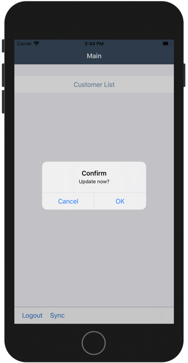

2. Tap **Customer List**, you will navigate to Customer List page.

    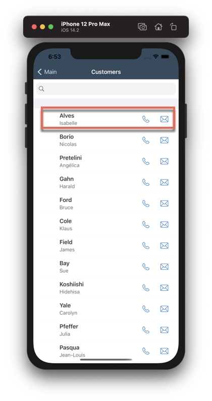

3. Tap any record from the list, you will navigate to it's detail page.

    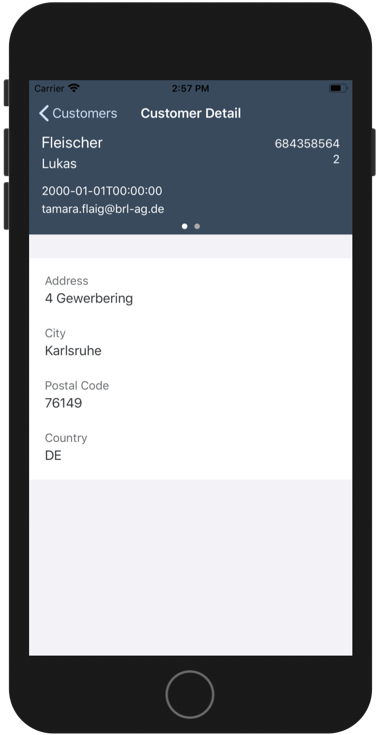

    >_Are you wondering how exactly MDK knew that clicking on a record in  list page would display respective record in detail page?_

    >The MDK sets the current object to the selected record when running the on press action on the list.  The detail page then just needs to reference the correct properties assuming they are part of the object from the list page. You can look at [documentation](https://help.sap.com/doc/f53c64b93e5140918d676b927a3cd65b/Cloud/en-US/docs-en/guides/getting-started/mdk/development/action-binding-and-result.html#auto-set-action-binding) for more details.

[OPTION END]

[OPTION BEGIN [Web]]

1. Either click the highlighted button or refresh the web page to load the changes.

    !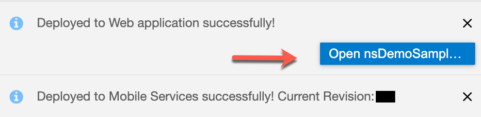

    >If you see the error `404 Not Found: Requested route ('xxxxx-dev-nsdemosampleapp-approuter.cfapps.xxxx.hana.ondemand.com') does not exist.` while accessing the web application, make sure that in your space cockpit, highlight applications are in started state.

    >!

2. Click **Customer List**, you will navigate to Customer List page.

    !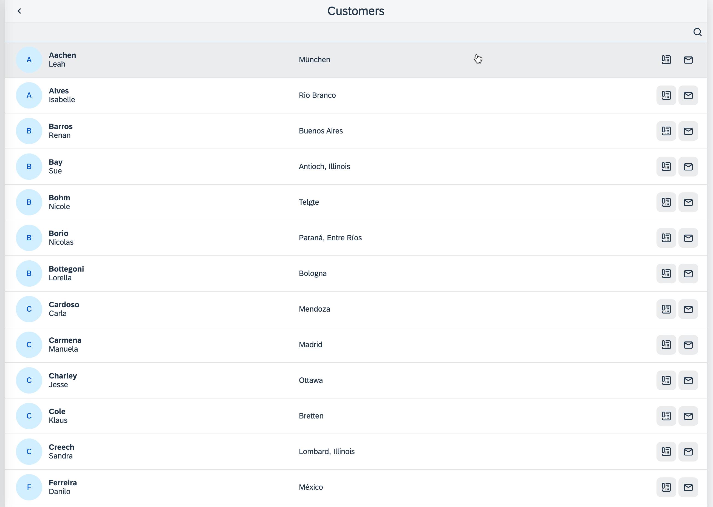

3. Click any record from the list, you will navigate to it's detail page.

    !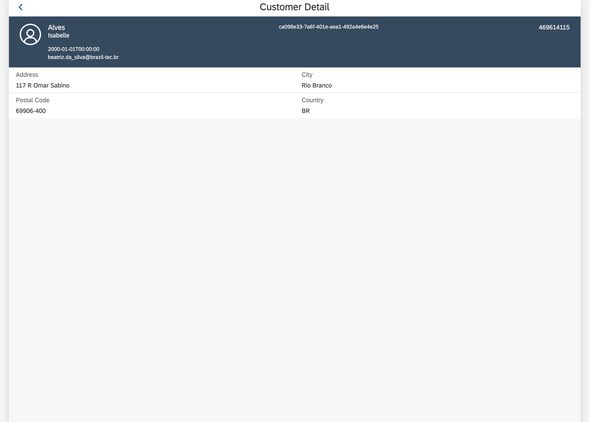

[OPTION END]

[VALIDATE_2]
[ACCORDION-END]

---
