## Details
### You will learn
  - How to create a new page for modifying customer details such as name, email and phone number
  - How to store changes locally
  - How to sync local changes with backend

---

[ACCORDION-BEGIN [Step 1: ](Define a close page-cancel action)]

Regardless of whether your application is online or offline, you can allow users to modify data in the application.

For online applications, the changes are saved to the backend immediately.

For offline applications, the changes are stored locally until they are synced using an Upload action.

First you will create a **Close Page-Cancel action** that closes the current page and cancels or interrupts any execution in process. This will be used with the cancel button on the **Edit Customer page**.

>You can close pages with the option to terminate ongoing events or wait until they are complete.

>You can find more details about [Close Page Action](https://help.sap.com/viewer/977416d43cd74bdc958289038749100e/Latest/en-US/2cd05c81255f49e3ae9258f9a5222a6c.html).

Right click on the **Actions** | **New MDK Action** | **Close Page Action** | **Next**.

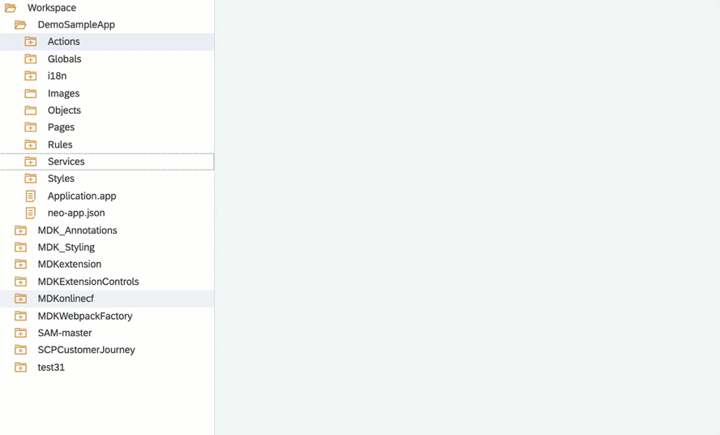

Provide the below information:

| Property | Value |
|----|----|
| `Action Name`| `ClosePageCancel` |
| `DismissModal` | `Canceled` |
| `CancelPendingActions`| `true` |

Click **Next** and then **Finish** on the Confirmation step.

[DONE]
[ACCORDION-END]

[ACCORDION-BEGIN [Step 2: ](Create a new page for modifying customer data)]

In this step, you will create the _Edit Customer Detail_ page as a **Form Cell Page**. This type of page allows for form input style changes. The page will provide only a subset of items available on the Customer Detail page. You will add the fields that will be editable by the end-user.

Right click on the **Pages** folder | **New MDK Page** | **Form Cell Page** | **Next**.

>A Form Cell Page is suitable for pages that generate new objects or modify existing objects. It includes a form cell container by default. You can add form sections, multiple containers or action controls to this page. Under each container section, you can add various container items.

>You can find more details about [Form Cell page](https://help.sap.com/viewer/977416d43cd74bdc958289038749100e/Latest/en-US/65c0ed1f448346cb89fa84992dc5df9c.html).

Enter the Page Name `EditCustomerDetails` and click **Next** and the **Finish** on the Confirmation step.

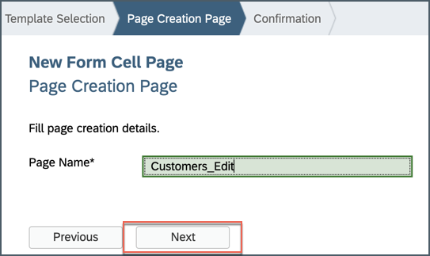

In the Properties pane, set the Caption to **Edit Customer**.

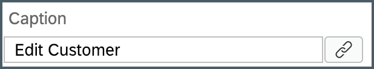

Now, you will add the fields (like first name, last name, phone & email address) that will be editable by the end-user.

In the Layout Editor, expand the **Control** | **Container Item** section.

>You can find more details about [available controls in Form Cell page](https://help.sap.com/viewer/977416d43cd74bdc958289038749100e/Latest/en-US/a0358d7a9c3b46e0819f28ae779def24.html).

Drag and drop a **Simple Property** onto the Page area.

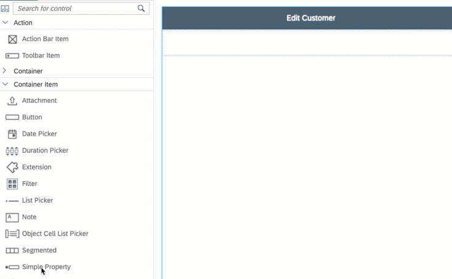

Drag and drop three additional Simple Property controls onto the page so you have four total controls.

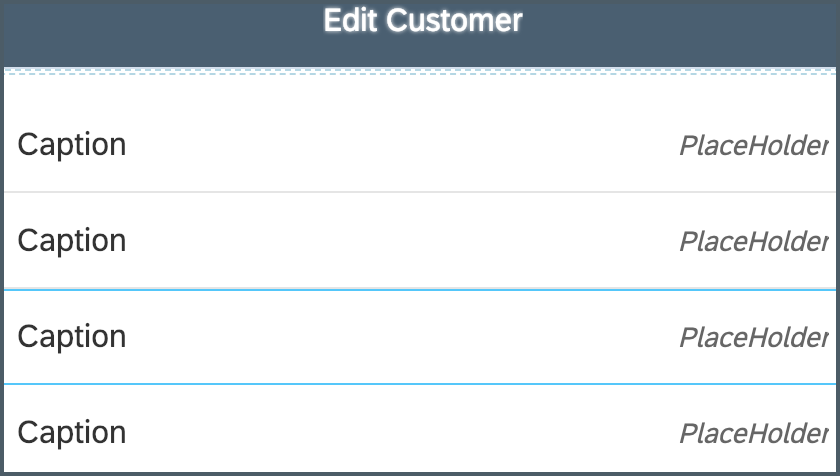

Select the first **Simple Property control** and provide the below information:

| Property | Value |
|----|----|
| `Name`| `FCFirstName` |
| `Caption` | `First Name` |
| `isEditable`| `true` |
| `Value`| bind it to `FirstName` property of the Customer entity |

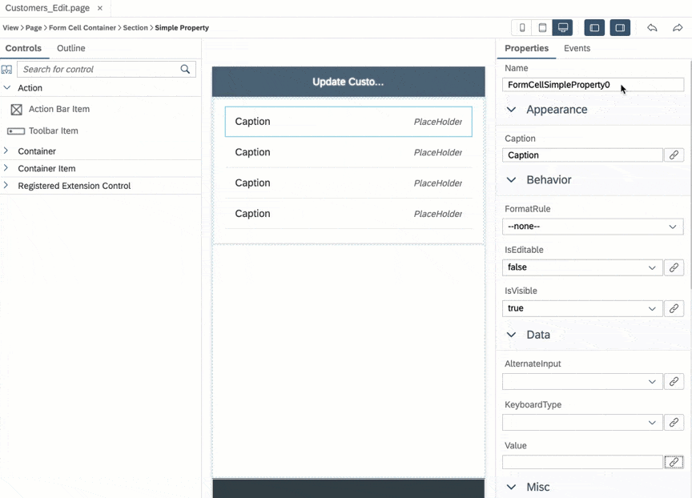

>Make sure, Format should be set as _Binding_.
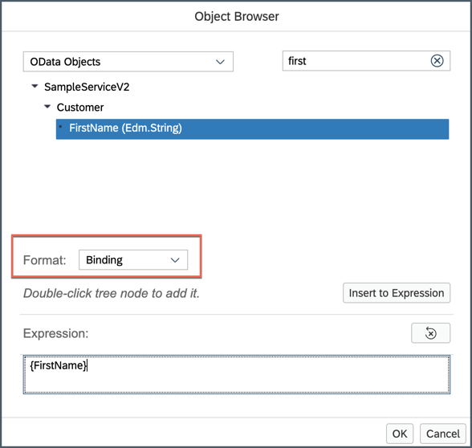

Select the second Simple Property control and provide the below information:

| Property | Value |
|----|----|
| `Name`| `FCLastName` |
| `Caption` | `Last Name` |
| `isEditable`| `true` |
| `Value`| bind it to `LastName` property of the Customer entity |

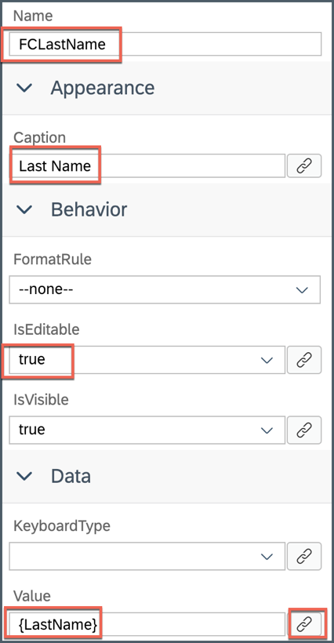

Select the third Simple Property control and provide the below information:

| Property | Value |
|----|----|
| `Name`| `FCPhone` |
| `Caption` | `Phone` |
| `isEditable`| `true` |
| `Value`| bind it to `PhoneNumber` property of the Customer entity |

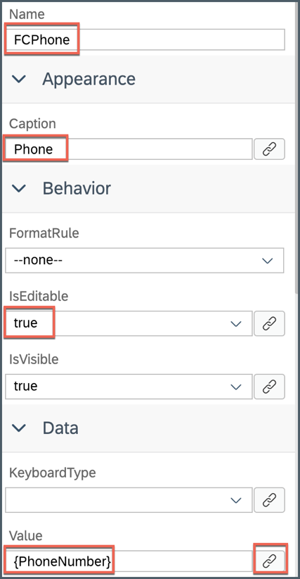

Select the last Simple Property control and provide the below information:

| Property | Value |
|----|----|
| `Name`| `FCEmail` |
| `Caption` | `Email` |
| `isEditable`| `true` |
| `Value`| bind it to `EmailAddress` property of the Customer entity |

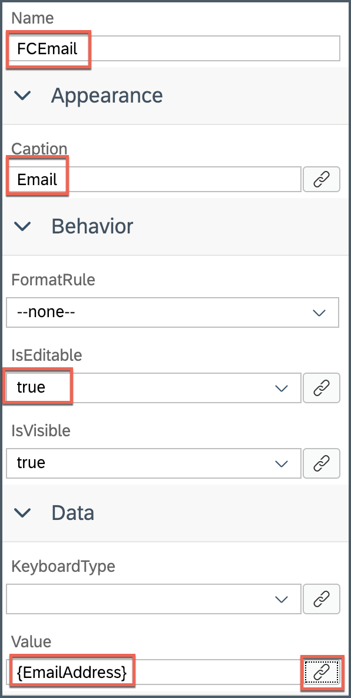

[DONE]
[ACCORDION-END]

[ACCORDION-BEGIN [Step 3: ](Add cancel button on the Edit Customer page)]

Now, you will add a button on the Edit Customer page and set it's `onPress` to **Close Page-Cancel action** created in step 1.

Drag and drop an **Action Bar Item** to the upper left corner of the action bar.

>Action Bar Item is a button that users can use to fire actions when pressed. You can add an Action Bar Item only to the Action Bar (normally at the top of the page).

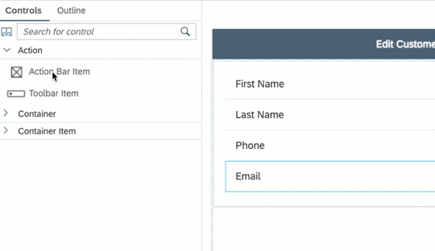

In the Properties pane, click the **link icon** to open the object browser for the **System Item** property.

Double click on the **Cancel** type and click **OK**.

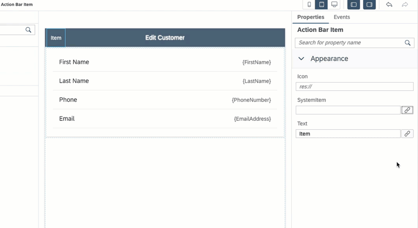

>System Item are predefined system-supplied icon or text. Overwrites _Text_ and _Icon_ if specified.

Now, you will set `onPress` to **Close Page-Cancel action**.

In **Events** tab, click the **link icon** for the `OnPress` property to open the object browser.

Double click on the `ClosePageCancel` action and click **OK** to set it as the `OnPress` Action.

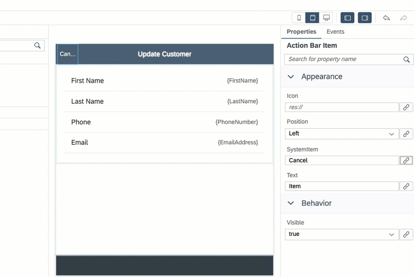

Save the changes to the `EditCustomerDetails` page.

[DONE]
[ACCORDION-END]

[ACCORDION-BEGIN [Step 4: ](Create navigation action)]

Now, create a navigation action that will open the _Edit Customer Detail page_ when executed.

Right click on the **Actions** folder | **New MDK Action** | **Navigation Action** | **Next**.

Provide the below information:

| Property | Value |
|----|----|
| `Action Name`| `ShowEditCustomerDetails` |
| `Page To Open` | select `EditCustomerDetails.page` |
| `ModalPage`| check this option |
| `ModalPage Fullscreen`| check this option |

Click **Next** and then **Finish** on the confirmation step.

[DONE]
[ACCORDION-END]

[ACCORDION-BEGIN [Step 5: ](Add edit button to customer details page)]

You will add a button to the _Customer Details page_ called **Edit**. You will link this button to the navigation action you just created. This event will open the _Edit Customer Details page_ when the Edit button is pressed by the end-user.

In `CustomerDetail` page, drag and drop an **Action Bar Item** to the upper right of the action bar.

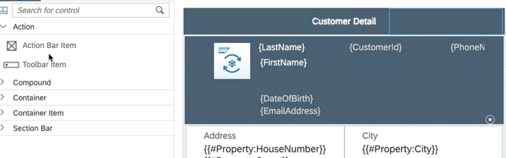

In the Properties pane, set **Position** to **Right**.

Click the **link icon** to open the object browser for the **System Item** property.

Double click on the **Edit** type and click **OK**.

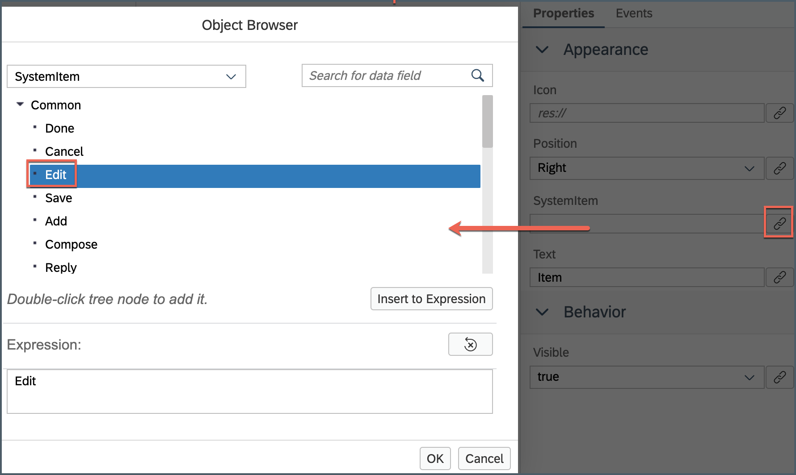

In the Properties pane, click the **Events** tab, click the **link icon** for the `OnPress` property to open the object browser.

Double Click on the `ShowEditCustomerDetails` action and click **OK** to set it as the `OnPress` Action.

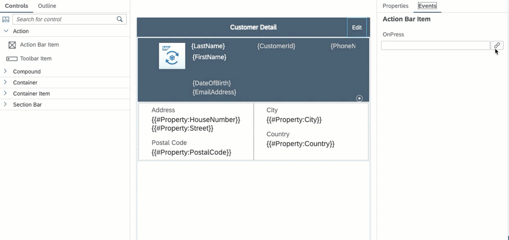

Save the changes to the `CustomerDetail` page.

[DONE]
[ACCORDION-END]

[ACCORDION-BEGIN [Step 6: ](Store the updated data locally)]

The next step is to take the updates received and store them locally for an offline application or send the updates directly back to the backed for online applications. You will now create an update action to map the changes received from the Edit Customer Detail page to the corresponding field in the OData service. You will also show a failure message if the update action fails to save the changes.

First, define a failure message.

Right click on the **Actions** folder | **New MDK Action** | **Message Action** | **Next**.

Provide the below information:

| Property | Value |
|----|----|
| `Action Name`| `UpdateCustomerFailure` |
| `Type` | select `Message` |
| `Message` | `Failed to Save Customer Updates` |
| `Title` | `Update Customer` |
| `OKCaption` | `OK` |
| `OnOK` | `--None--` |
| `CancelCaption` | leave it blank |
| `OnCancel` | `--None--` |

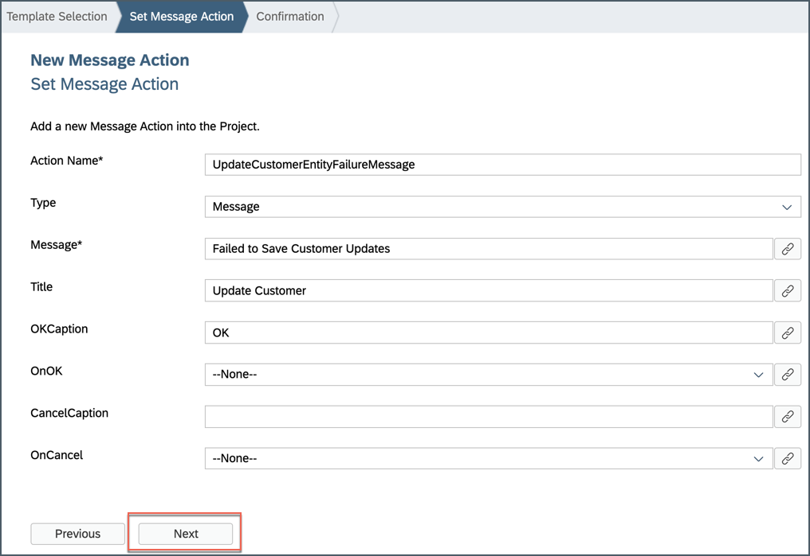

Click **Next** and then **Finish** on the Confirmation step.

Next, you will define **Close Page-Complete Action** which allows the end-user to close the page and allow any execution to continue. .

>You can close pages with the option to terminate ongoing events or wait until they are complete.

Create a **Close Page–Complete action**.

Right click on the **Actions** folder | **New MDK Action** | **Close Page Action** | **Next**.

Provide the below information:

| Property | Value |
|----|----|
| `Action Name` | `ClosePageComplete` |
| `DismissModal` | `Completed` |
| `CancelPendingActions` | `false` |

Click **Next** and then **Finish** on the confirmation step.

Next, you will create the **OData Update action** to update entity action that will map the changes to the correct entities in the OData service and save the changes.

>You can find more details about [Update Entity Action](https://help.sap.com/viewer/977416d43cd74bdc958289038749100e/Latest/en-US/20da3bdc0ced44858952f06fe63033d8.html).

Right click on the **Actions** folder | **New MDK Action** | **OData Action** | **Next**.

Provide the below information:

| Property | Value |
|----|----|
| `Action Name`| `UpdateCustomer` |
| `Type` | `UpdateEntity` |
| `Service`| `SampleServiceV2` |
| `EntitySet`| `Customers` |
| `ReadLink`| `{@odata.readLink}` |

>The `readLink` is a direct reference to an individual entity set entry.

Click **Next**.

In **Property and Update Links** step, uncheck **City**.

Since in _Edit Customer Details page_, we defined four properties (First Name, Last Name, Phone & Email) to be edited, now in this step, we will bind them to respective UI Controls.

Check the `EmailAddress` property and click the **link icon** to open the object browser.

Change the drop down in the object browser to `Controls & ClientData`, click the **Current Page** radio button.

In the search box start typing the control name `FCEmail`. The list will filter down to show the matching values. Double click on the **Value (Value)** entry under the `FCEmail` field and click **OK** to set binding.

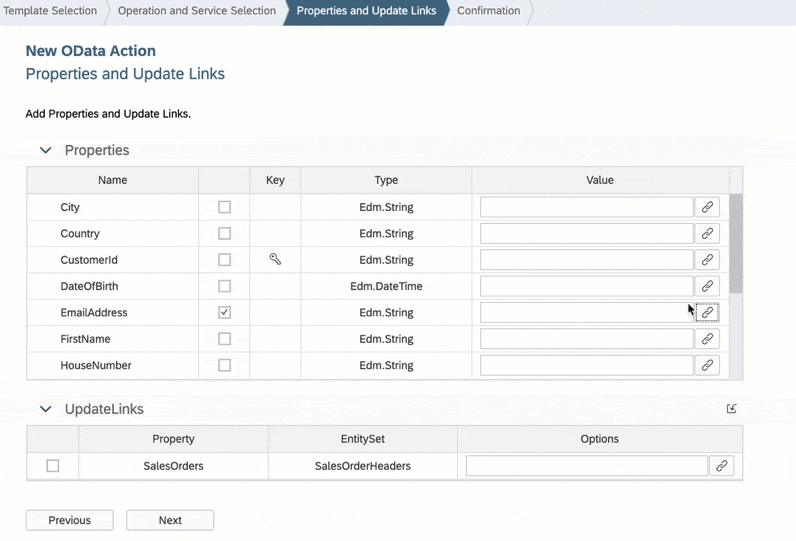

Repeat the above step for remaining properties: `FirstName`, `LastName` and `PhoneNumber`.

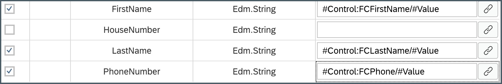

Click **Next** and **Finish** on the confirmation screen. The action editor will open with the `UpdateCustomer` action loaded.

Next, define _Success_ and _Failure_ actions for `UpdateCustomer` action.

In the action editor for the new action, expand the **Common Action Properties** and select `ClosePageComplete` action for **Success Action** and `UpdateCustomerFailure` action for **Failure Action**.

>When `UpdateCustomer` action gets executed successfully then `ClosePageComplete` action will be triggered or if `UpdateCustomer` action fails then `UpdateCustomerFailure` action will be triggered.

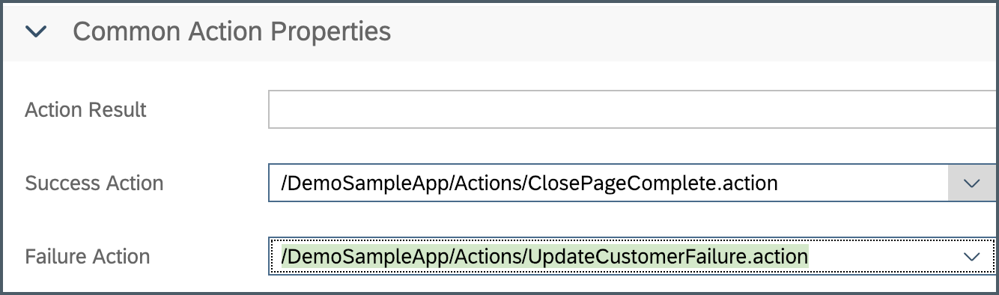

Save the changes to the `UpdateCustomer` action.

Next, you will set the `OnPress` of the _Save_ button.

Now that the Update action is created, you will need to call the Update action when the end-user presses the **Save** button. You will add a **Save** button on the `EditCustomerDetails.page` and link it to the `UpdateCustomer` action.

In `EditCustomerDetails.page`, **drag and drop** an **Action Bar Item** to the upper right corner of the action bar.

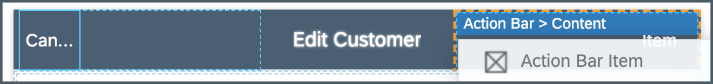

In the Properties pane, set **Position** to **Right**.

Click the **link** icon to open the object browser for the **System Item** property.

Double click on the **Save** type and click **OK**.

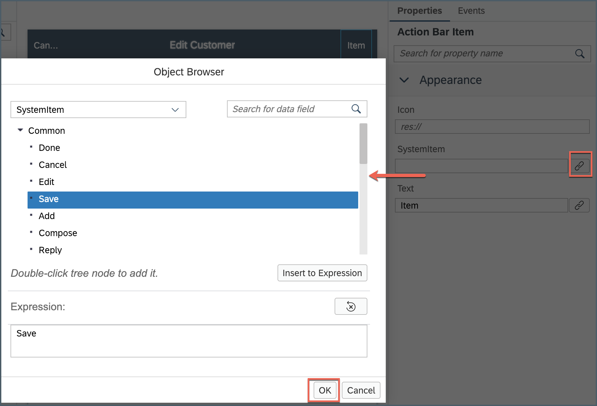

In the Properties pane | **Events** tab, click the **link** icon for the `OnPress` property to open the object browser, bind it to `UpdateCustomer` action.

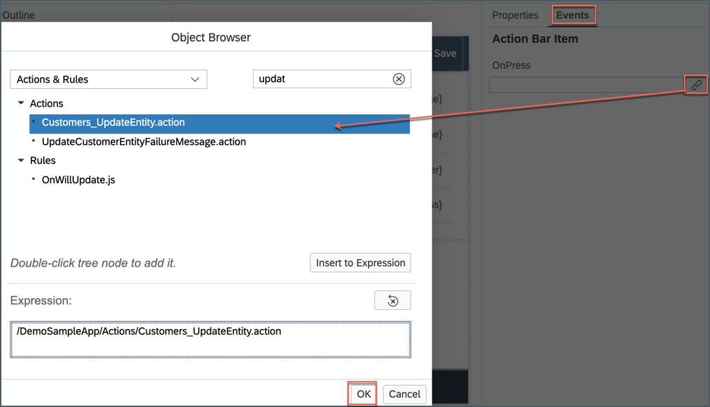

Save the changes to the `EditCustomerDetails` page.

[DONE]
[ACCORDION-END]

[ACCORDION-BEGIN [Step 7: ](Deploy, activate and test the application)]

Deploy the updated application to your MDK client.

Right click on the MDK Application in the project explorer pane and select **MDK Deploy and Activate**, click **Next** and deploy to Mobile Services.

>Make sure to select same App ID as you chose in previous tutorial.

Re-launch the app on your device, you may asked to authenticate with passcode or Touch ID or Fingerprint. You will see a _Confirmation_ pop-up, click **OK**.

Click Customer List, you will navigate to Customer detail page. Click **Edit**.

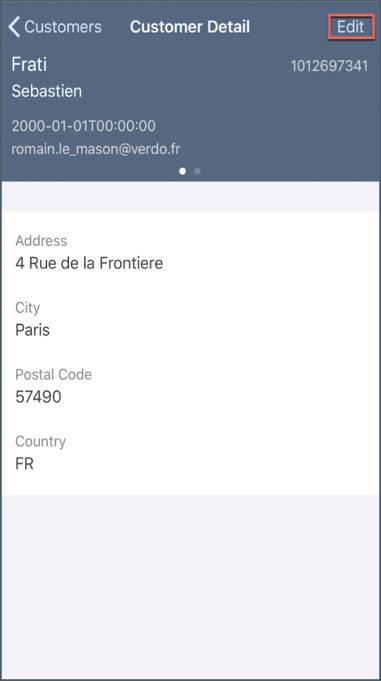

For example, updating First Name from `Sebastien` to `Rob`. Click **Save**.

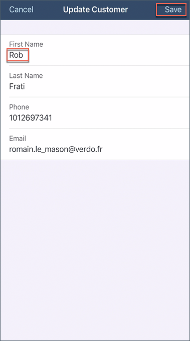

Local record gets updated accordingly.

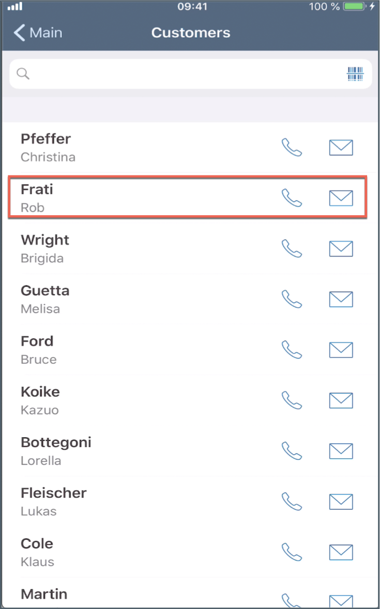

You can cross verify if a record has been updated in the backend. For trial account,

`https://hcpms-YOURIDtrial.hanatrial.ondemand.com/mobileservices/origin/hcpms/ESPM.svc/v2/Customers`

>This URL can be found in Mobile Services Cockpit. Mobile Applications | Native/Hybrid | Click on the MDK App | Connectivity

But here result is pointing to old First Name (`Sebastien`).

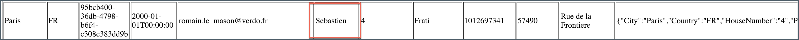

Since this is an Offline application, new entry is added to the request queue of the local store which needs to be sent or uploaded to the backend explicitly.  

>MDK base template has added a **Sync** button on main page of the app to upload local changes from device to the backend and to download the latest changes from backend to the device. Actions | Service | `UploadOffline.action` & `DownloadOffline.action`.

On Main page, click **Sync**, a successful message will be shown.

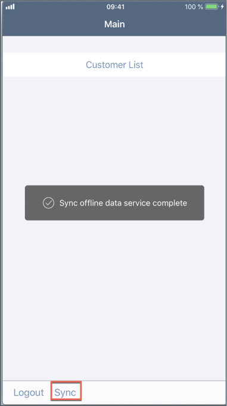

Now, refresh the URL to check if record has been updated in the backend.

>As Sync is pressed, `UploadOffline.action` gets trigger to upload local changes from device to the backend and on success of this call, `DownloadOffline.action` is being called.

[VALIDATE_1]
[ACCORDION-END]

---
