## Prerequisites
- **Tutorial group:** [Set Up for the Mobile Development Kit (MDK)](group.mobile-dev-kit-setup)
- **Download and install:** **SAP Mobile Services Client** on your [iOS](https://apps.apple.com/us/app/sap-mobile-services-client/id1413653544) or [Android](https://play.google.com/store/apps/details?id=com.sap.mobileservices.client) device
- **Download and install** [Barcode Scanner](https://play.google.com/store/apps/details?id=com.google.zxing.client.android&hl=en) (required only for Android device)

## Details
### You will learn
  - How to access Error Archive entity set to display local upload failure
  - How to handle a logic failure errors
  - How to fix these errors

You may clone an existing project from [GitHub repository](https://github.com/SAP-samples/cloud-mdk-tutorial-samples/tree/master/4-Level-Up-with-the-Mobile-Development-Kit/2-Handle-Error-Archive-in-an-MDK-App) and start directly with step 7 in this tutorial.

---

You have built an MDK app with offline functionality. In offline store, you make a change to a local record and upload this change (from request queue) to backend but backend prevents this change to accept due to some business logic failure. This error is recorded in an Offline OData specific entity set named as `ErrorArchive`. This entity set has detailed information about the errors. It's now up-to developers how they handle such errors and then let users to fix it from the app by providing the correct values.

>`ErrorArchive` is exposed to the application as an OData entity set and is accessible through the OData API in the same way that the application accesses any other entity sets from the offline store.

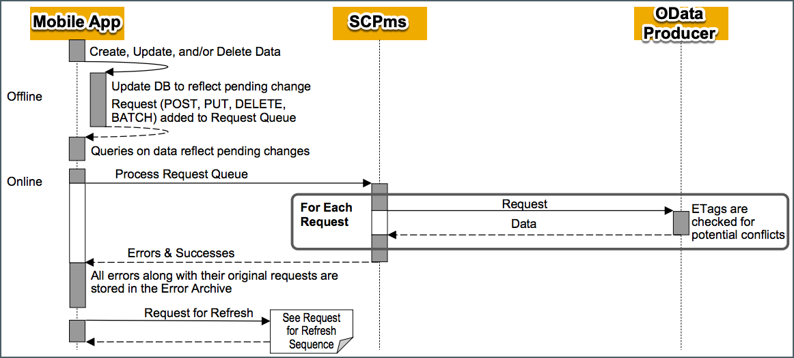

 In this tutorial, you need to carry out the following tasks in order to understand how to display and handle such errors:

*  Create a new project in SAP Web IDE using **MDK CRUD Project** template
*  Create two additional pages to display list of errors and their details
*  Create an action to navigate from error list page to its details page
*  Create a business logic to find the affected entity
*  Navigate to the affected record to handle the error

> For this tutorial, you will use **Mobile Services sample backend** destination. You will modify a `PurchaseOrderHeaders` record by changing `SupplierId` field. Offline store saves this record in request queue database and when you sync it with backend, backend prevents updating this record due to business logic failure. This failure record will be listed in Error list page, from here, you can navigate to details page for more information. You will implement a logic to navigate from details page to the affected record.


[ACCORDION-BEGIN [Step 1: ](Create a new MDK project in SAP Web IDE)]

This step includes creating the Mobile Development Kit project in the Editor.

1. Launch the SAP Web IDE and select the **MDK perspective** by clicking on the icon in the left panel.

2. Right click Workspace folder and select **New** | **MDK CRUD Project**.

    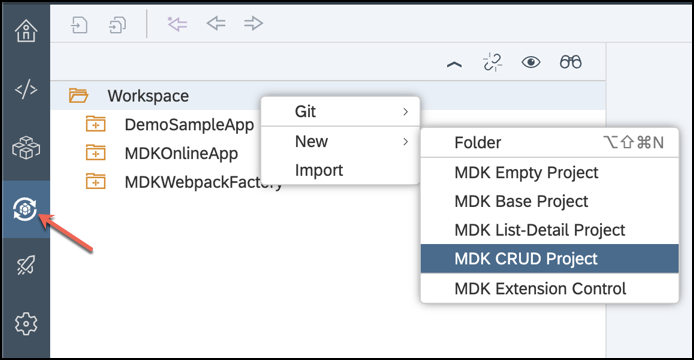

    >_The MDK CRUD Project_ template creates the offline or online actions, rules, messages and list detail pages along with editable capability in respective pages. You can use such template to handle error archive situation.

    >More details on _MDK template_ is available in [help documentation](https://help.sap.com/viewer/977416d43cd74bdc958289038749100e/Latest/en-US/cfd84e66bde44d8da09f250f1b8ecee6.html).

3. Enter the Project Name as `MDK_ErrorArchive` and click **Next**.

    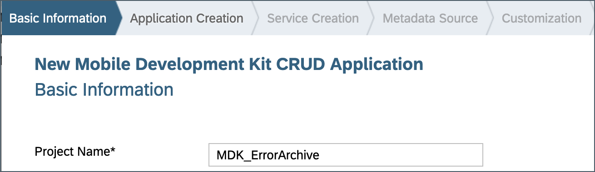

4. Leave the default values in _Application Creation_ step as it is, click **Next**.

5. In _Service Creation_ step, provide and select the below information:

    | Field | Value |
    |----|----|
    | `Name`| `SampleServiceV2` |
    | `Service URL` | `/destinations/mobileservices_cf` |
    | `Application ID` | `com.sap.mdk.demo` |
    | `Destination Name` | `com.sap.edm.sampleservice.v2` |
    | `Enable Offline Store` | `Should be checked` |

    > If you do not find `mobileservices_cf` destination, please ensure that you have followed [this tutorial](fiori-ios-hcpms-setup) to setup this destination in SAP Cloud Platform cockpit.

    >If you see a _Authentication Required_ pop-up, then enter your cloud platform User Name and password to authenticate.

    >For Offline OData capability only OData V2 is supported. OData V2 and V4 are supported for Online OData.

    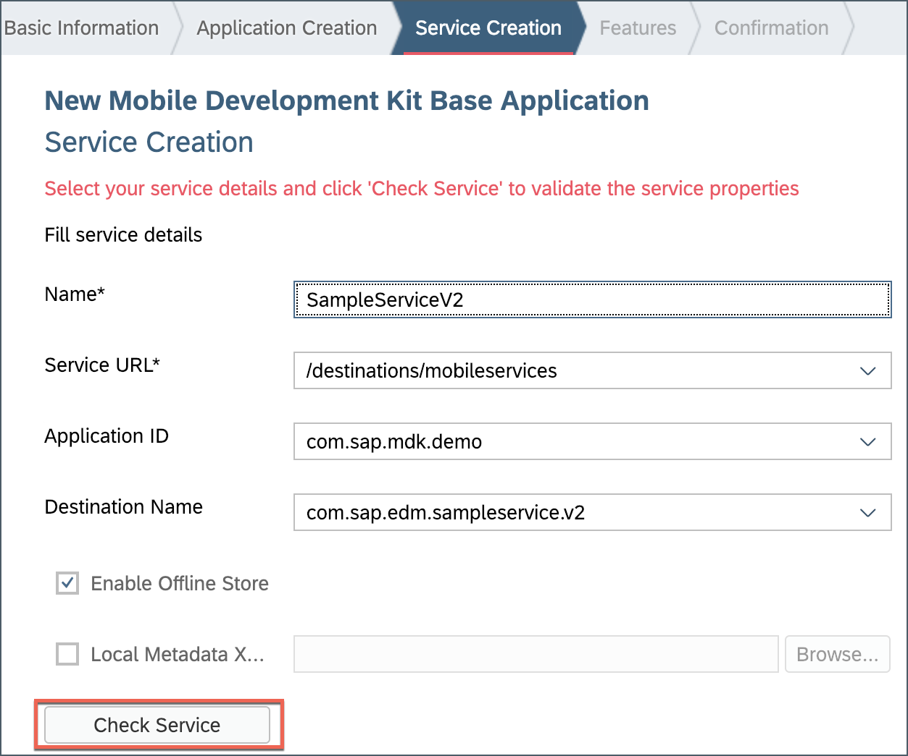

    Regardless of whether you are creating an online or offline application, this step is needed app to connect to an OData service. When building an Mobile Development Kit application, it assumes the OData service created and the destination that points to this service is setup in Mobile Services and SAP Cloud Platform.

    Since you will create an offline based app, hence _Enable Offline Store_ option is selected.

6. Click **Check Service** to validate the service properties. If all the details are fine, you will see a success message. Click **Next**.

    

    >More details on _Sample Back End_ is available in [help documentation](https://help.sap.com/viewer/468990a67780424a9e66eb096d4345bb/Cloud/en-US/1c2e51a24361487f8b0649702d59dd0f.html).

7. In **Metadata Source** step, select `PurchaseOrderHeaders` and `PurchaseOrderItems`‚ and click **Next**.

8. In following steps go with default selections and **Finish** the project creation.

    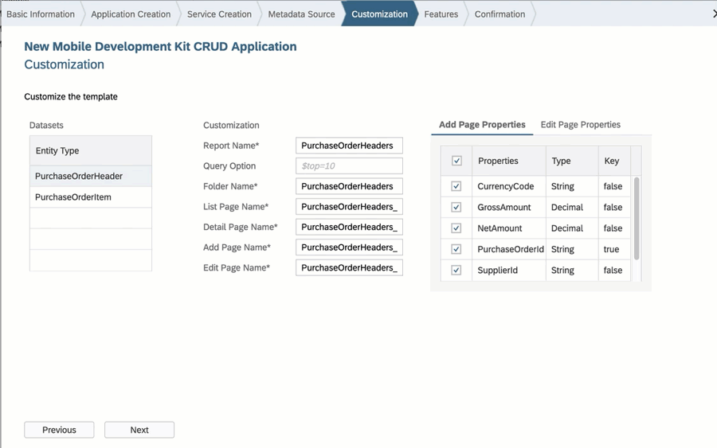

    After clicking Finish, the wizard will generate your MDK Application based on your selections. You should now see the `MDK_ErrorArchive` project in the project explorer.

[DONE]
[ACCORDION-END]

[ACCORDION-BEGIN [Step 2: ](Create a new page to display Error list)]

Generated project is offline enabled and includes two entity sets (`PurchaseOrderHeaders` and `PurchaseOrderItems`) on main page and these entities are fully CRUD enabled. You can create a new record and also modify an existing one.

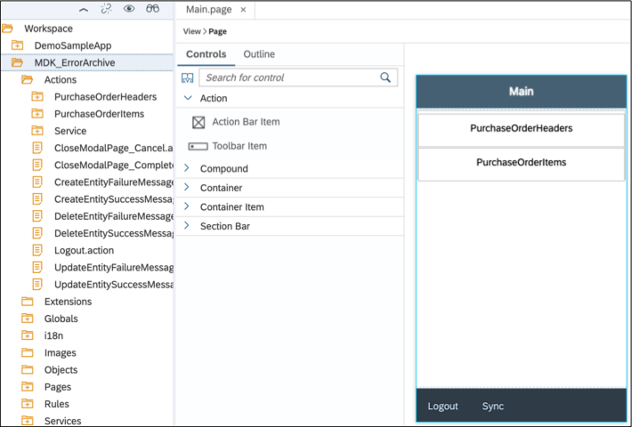

1. Now, you will create a new page to display list of errors.

2. In SAP Web IDE project, right-click the **Pages** folder | **New MDK Page** | **Section Page** | **Next**.

    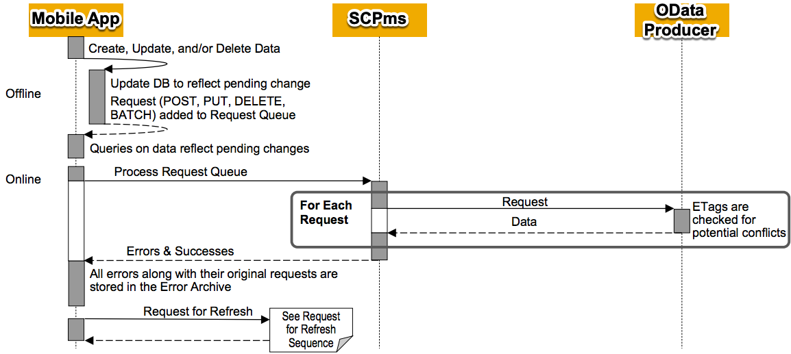

    >You can find more details about [section pages](https://help.sap.com/viewer/977416d43cd74bdc958289038749100e/Latest/en-US/65c0ed1f448346cb89fa84992dc5df9c.html).

3. Enter the **Page Name** as `ErrorList` and click **Next** and then **Finish** on the confirmation step.

    

4. In the **Properties** pane, set the caption to **Error List**.

    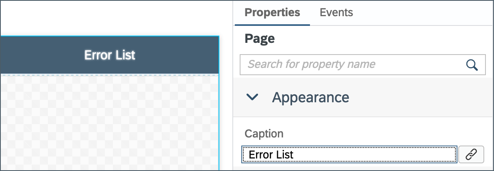

5. Next, add an **Object Table** control to display information like HTTP status code, HTTP method for the affected record.

    In the Layout Editor, expand the **Controls** | **Compound** section, drag and drop the **Object Table** control onto the page area.

    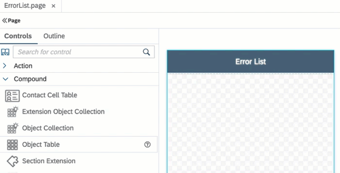

    >A **Compound** control contains a group of other controls. Unlike in a container control where you can add your own child controls (container items), the child controls in a compound control are fixed. You can populate each of its child control by defining its data binding, depending on which the child controls are created.

6. In the **Properties** pane, select the previously added service from the **Service** drop down and then select `ErrorArchive` entity set from the dropdown. This way, the Object Table has been bound to `ErrorArchive` entity.

7. Provide below properties:

    | Property | Value |
    |----|----|
    | `Service`| `SampleServiceV2.service` |
    | `Entity` | `ErrorArchive` |

    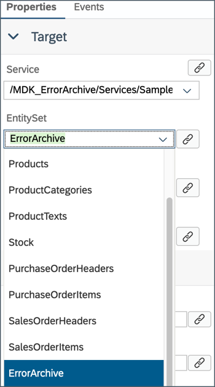

8. In **Appearance** section, provide below properties:

    | Property | Value |
    |----|----|
    | `Description`| leave it empty |
    | `DetailImage` | leave it empty |
    | `DetailImageIsCircular` | `false` |
    | `Footnote`| leave it empty |
    | `PreserveIconStackSpacing` | `false` |
    | `ProgessIndicator`| leave it empty |
    | `Status` | bind it to `{RequestMethod}` |
    | `Subhead` | bind it to `{RequestURL}` |
    | `SubStatus` | `leave it empty` |
    | `Title` | bind it to `{HTTPStatusCode}` |

    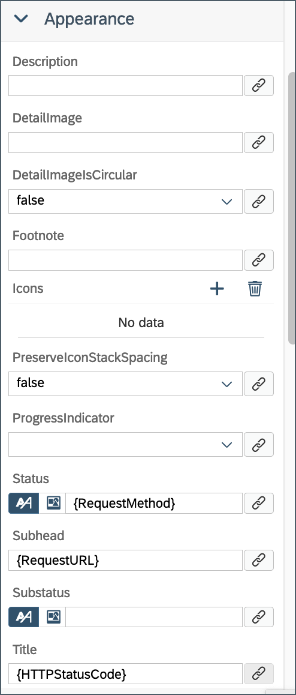

    >You can find more details about [`ErrorArchive` Entity Properties](https://help.sap.com/viewer/42dc90f1e1ed45d9aafad60c80646d10/3.0.15/en-US/ff35db37335f4bb8a1e188b997a2b111.html).

9. In **Search** section, update below properties:

    | Property | Value |
    |----|----|
    | `SearchEnabled`| `true` |

    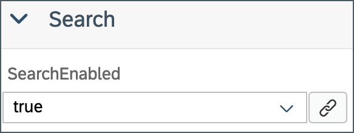

10. In **Behavior** section, update below properties:

    | Property | Value |
    |----|----|
    | `AccessoryType`| `disclosureIndicator` |

    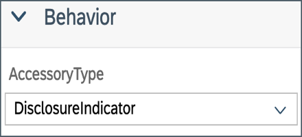

11. In `EmptySection` section, update below properties:

    | Property | Value |
    |----|----|
    | `Caption`| `No Sync Errors Found` |

    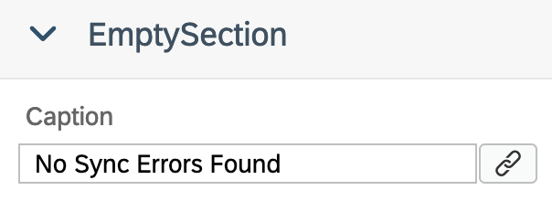

[DONE]
[ACCORDION-END]

[ACCORDION-BEGIN [Step 3: ](Create a new page to display Error details)]

1. Now, you will create another new page to display error details.

2. In SAP Web IDE project, right-click the **Pages** folder | **New MDK Page** | **Section Page** | **Next**.

    

3. Enter the **Page Name** as `ErrorDetails` and click **Next** and then **Finish** on the confirmation step.

    

4. In the **Properties** pane, set the caption to **Error Details**.

    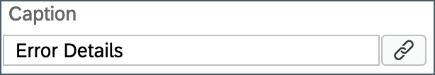

    In this page, you would show which entity has been affected due to business logic failure and also want to display other information like detailed error message, request body, request URL etc.

5. Next, write a business logic to get the **affected entity object** and this object value will be shown in error details page.

    Right click the **Rules** folder | **New** | **File**.

    

6. Enter the file name `GetAffectedEntityHeaderCaption.js`, click **OK**.

    Copy and paste the following code.

    ```JavaScript
    export default function GetAffectedEntityHeaderCaption(context) {
     //Current binding's root is the errorArchiveEntity:
     //Get the affectedEntity object out of it
     let affectedEntityType = "Unknown EntitySet";
     let affectedEntity = context.getPageProxy().binding.AffectedEntity;
     let id = affectedEntity["@odata.id"];
     if (id.indexOf("(") > 0) {
       affectedEntityType = id.substring(0, id.indexOf("("));
     }
     return "Affected Entity: " + affectedEntityType;
    }

    ```

    >`@odata.id`: an annotation that contains the entity-id. More details can be found [here](http://docs.oasis-open.org/odata/odata-json-format/v4.0/cs01/odata-json-format-v4.0-cs01.html#_Toc36546468).

    >`AffectedEntity`: A navigation property that allows applications to navigate from an `ErrorArchive` entity to an entity in the offline store that is affected by the error.

7. Save your changes to the `GetAffectedEntityHeaderCaption.js` file.

8. Next, add an **Object Table** control in `ErrorDetails.page` to display some information like affected entity and id for affected record.

    Open `ErrorDetails.page`, in the Layout Editor, expand the **Controls** | **Compound** section, drag and drop the **Object Table** control onto the page area.

    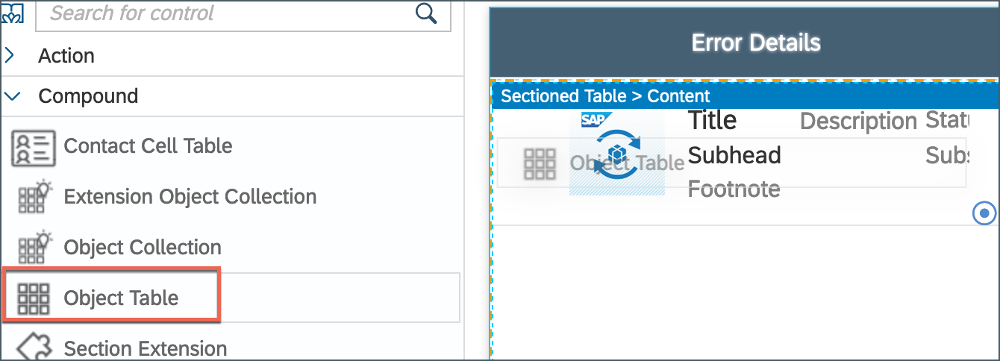

9. In the **Properties** | **Target** pane, choose **String Target** from the dropdown and provide `#Property:AffectedEntity` value.

    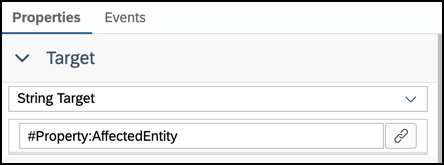

10. In **Appearance** section, provide below properties:

    | Property | Value |
    |----|----|
    | `Description`| leave it empty |
    | `DetailImage` | leave it empty |
    | `DetailImageIsCircular` | `false` |
    | `Footnote`| leave it empty |
    | `PreserveIconStackSpacing` | `false` |
    | `ProgessIndicator`| leave it empty |
    | `Status` | leave it empty  |
    | `Subhead` | `{@odata.id}` |
    | `SubStatus` | leave it empty  |
    | `Title` | `Edit Affected Entity` |

    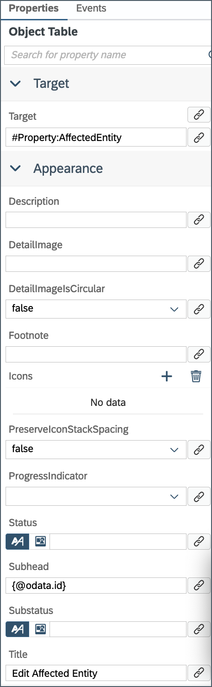

    >`@odata.id`: an annotation that contains the entity-id. More details can be found [here](http://docs.oasis-open.org/odata/odata-json-format/v4.0/cs01/odata-json-format-v4.0-cs01.html#_Toc36546468).

11. In **Behavior** section, update below properties:

    | Property | Value |
    |----|----|
    | `AccessoryType`| `disclosureIndicator` |

    

12. Next, add a **Header** section bar to display affected entity information.

    In the Layout Editor, expand the **Controls** | **Section Bar** section, drag and drop the **Header** control onto the **Object Table** control.

    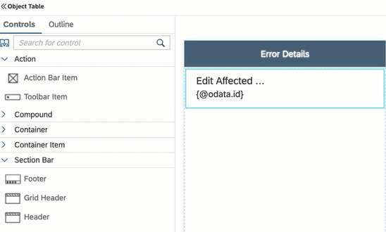

    Now, bind its **Caption** property to `GetAffectedEntityHeaderCaption.js` file.

    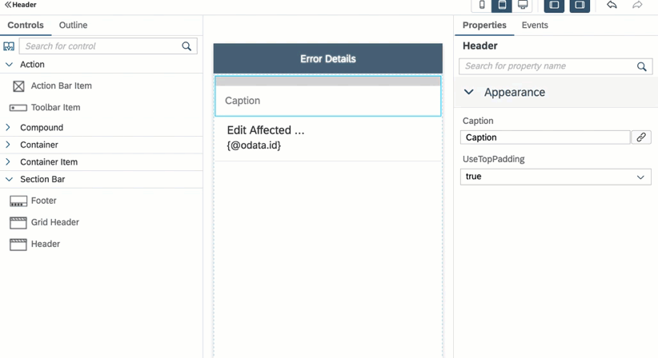

13. Next, you can also display additional information like detailed error message, request body, request URL etc.

    In the Layout Editor, expand the **Controls** | **Container** section, drag and drop the **Static Key Value** control on the page area.

    

    Update `NumberOfColumns` value to 1.

    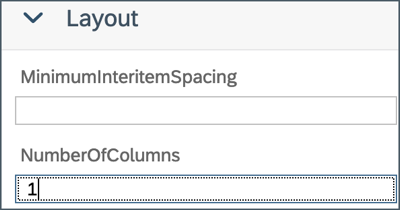

    >You can limit the number of columns to be displayed.

14. Next, you will add items to the container.

    In the Layout Editor, expand the **Controls** | **Container Item** section, drag and drop the **Key Value Item** control in the **Static Key Value** control.

    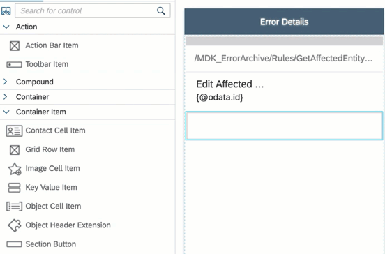

    Provide the below information:

    | Property | Value |
    |----|----|
    | `KeyName`| `HTTP Status Code` |
    | `Value` | `{HTTPStatusCode}` |

    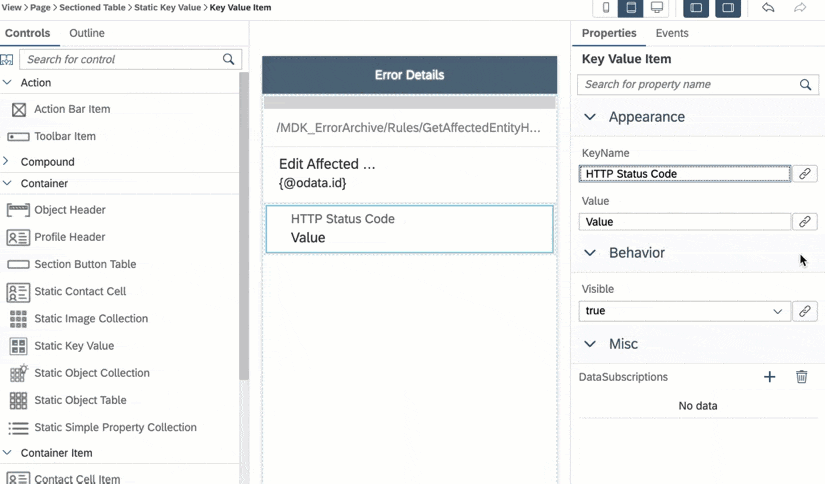

    Drag and drop 4 more **Key Value Item** control in the **Static Key Value** control and provide the below information:

    | Property | Value |
    |----|----|
    | `KeyName`| `Request Method` |
    | `Value` | `{RequestMethod}` |

    | Property | Value |
    |----|----|
    | `KeyName`| `Request URL` |
    | `Value` | `{RequestURL}` |

    | Property | Value |
    |----|----|
    | `KeyName`| `Request Body` |
    | `Value` | `{RequestBody}` |

    | Property | Value |
    |----|----|
    | `KeyName`| `Error Message` |
    | `Value` | `{Message}` |

    You should have final binding for all key value items as below:

    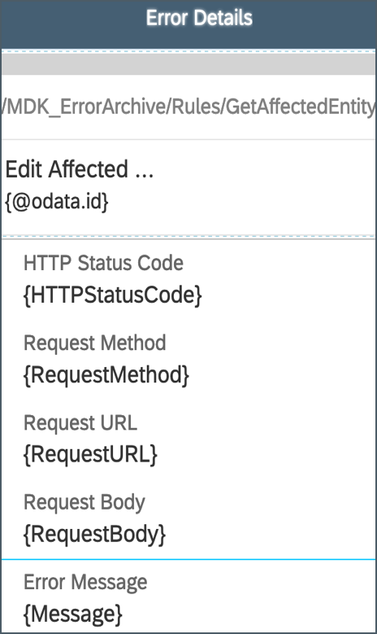

    >>More details on _`ErrorArchive` Entity Properties_ is available in [help documentation](https://help.sap.com/viewer/fc1a59c210d848babfb3f758a6f55cb1/Latest/en-US/ff35db37335f4bb8a1e188b997a2b111.html).

15. Save your changes to the **Error Details** page.

[DONE]
[ACCORDION-END]

[ACCORDION-BEGIN [Step 4: ](Navigate from Error list page to Error details page)]

When you click any record in **Error List** page, you want to navigate to **Error Details** page to view more information about this error.

1. Create a **Navigation Action**.

    Right click the Actions folder | **New MDK Action** | **Navigation Action** | **Next**.

    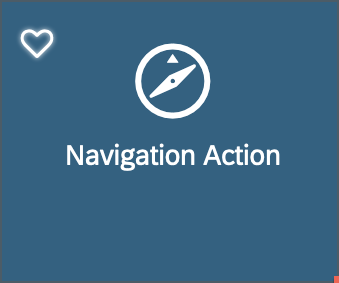

    Provide the below information:

    | Field | Value |
    |----|----|
    | `Action Name`| `ShowErrorDetails` |
    | `Page to Open` | `select ErrorDetails.page` |

    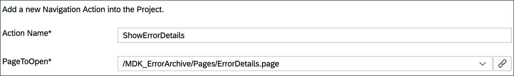

2. Bind this action to `onPress` of **Object Table** in **Error List** page.

    Open **Error List** page | **Events** tab, click the **link icon** for the `OnPress` property to open the object browser.

    Double click the `ShowErrorDetails.action` action and click **OK** to set it as the `OnPress` Action.

    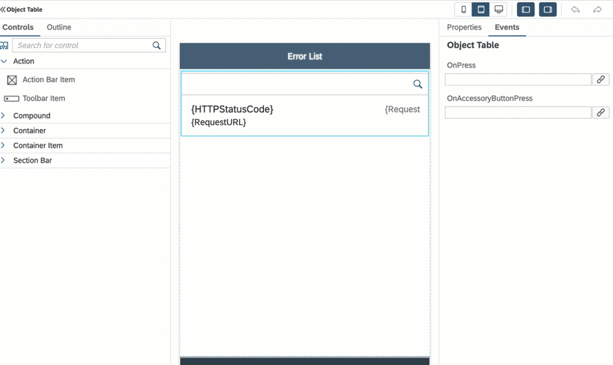

3. Save your changes to the `ErrorList.page` file.

[DONE]
[ACCORDION-END]

[ACCORDION-BEGIN [Step 5: ](Navigate from Error details page to affected record)]

When you click an **affected entity** in **Error details** page, you want to bring the affected record so that you can fix business failure by modifying previous changes right there.

You can write a logic in JavaScript to handle the `affectedEntity` and then decide which action to call depends on which `@odata.id` is the `affectedEntity` and if there is no handler for an affected entity, app will display a toast message.

1. Create a **Message Action** to display this toast message.

    Right click the **Actions** folder | **New MDK Action** | **Message Action** | **Next**.

    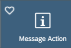

    Provide the below information:

    | Property | Value |
    |----|----|
    | `Action Name`| `UnknownAffectedEntityMessage` |
    | `Type` | select `ToastMessage` |
    | `Message` | `Affected Entity {{#Property:AffectedEntity/#Property:@odata.id}} doesn't have handler yet.` |
    | `Duration` | 4 |
    | `Animated` | `true` |

    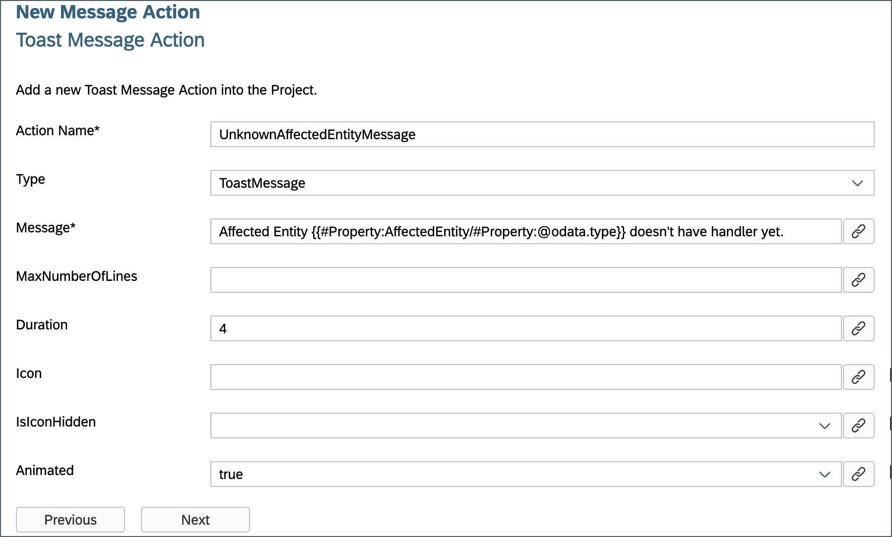

    Click **Next** and then **Finish** on the confirmation step.

2. Write a business logic to decide which action to call depends on which `@odata.type` is the `affectedEntity` and if there is no handler for an affected entity, app will display a toast message saying this affected entity doesn't have a handle yet.

3. Right click the **Rules** folder | **New** | **File**.

    

4. Enter the file name `DecideWhichEditPage.js`, click **OK**.

    Copy and paste the following code.

    ```JavaScript
    export default function DecideWhichEditPage(context) {
      //Current binding's root is the errorArchiveEntity:
      let errorArchiveEntity = context.binding;
      //Get the affectedEntity object out of it
      let affectedEntity = errorArchiveEntity.AffectedEntity;
      console.log("Affected Entity Is:");
      console.log(affectedEntity);

      let targetAction = null;
      let id = affectedEntity["@odata.id"]; //e.g. PurchaseOrderHeaders(12345)
      let affectedEntityType = "Unknown Entity Set"; //By default it's unknown type
      if (id.indexOf("(") > 0) {
        //Extracting the entity set type from @odata.id e.g. PurchaseOrderHeaders
        var patt = /\/?(.+)\(/i;
       var result = id.match(patt);
       affectedEntityType = result[1];
      }
      console.log("Affected Entity Type Is:");
      console.log(affectedEntityType);
      //Here we decide which action to call depends on which affectedEntityType is the affectedEntity
      // You can add more complex decision logic if needed
      switch (affectedEntityType) {
        case "PurchaseOrderHeaders":
            targetAction = "/MDK_ErrorArchive/Actions/PurchaseOrderHeaders/NavToPurchaseOrderHeaders_Edit.action";
          break;
        default:
            //Save the affected Entity's type in client data so that it can be displayed by the toast
            context.getPageProxy().getClientData().AffectedEntityType = affectedEntityType;
            // Show a toast for affectedEntityType that we do not handle yet
            return context.executeAction("/MDK_ErrorArchive/Actions/UnknownAffectedEntityMessage.action");
      }

      if (targetAction) {
        let pageProxy = context.getPageProxy();
        //Set the affectedEntity object to root the binding context.
        pageProxy.setActionBinding(affectedEntity);
        //Note: doing 'return' here is important to chain the current context to the action.
        // Without the return the ActionBinding will not be passed to the action because it will consider
        // you are executing this action independent of the current context.
        return context.executeAction(targetAction);
      }
    }
    ```

4. Save your changes to the `DecideWhichEditPage.js` file.

5. Bind this file to `onPress` of **Object Table** in **Error Details** page.

    Open **Error Details** page | Select **Object Table** control | **Events** tab, click the **link icon** for the `OnPress` property to open the object browser.

    Double click the `DecideWhichEditPage.js` action and click **OK** to set it as the `OnPress` Action.

    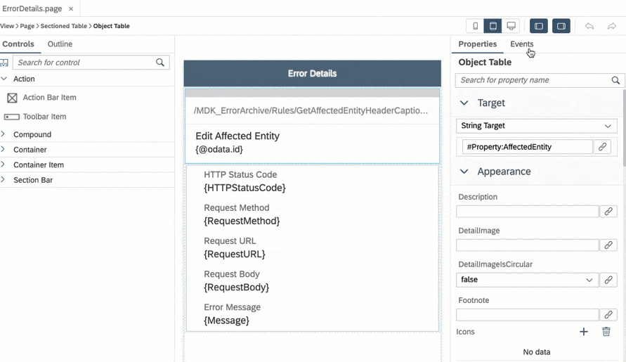

6. Save the changes to the `ErrorDetails` page.

[DONE]
[ACCORDION-END]

[ACCORDION-BEGIN [Step 6: ](Add a button on main page to view Error list)]

Now, that the **Error List** page is created, you will add a button on the **Main** page that navigates to **Error List** page.

1. Create a **Navigation Action**.

    Right click the Actions folder | **New MDK Action** | **Navigation Action** | **Next**.

    

    Provide the below information:

    | Field | Value |
    |----|----|
    | `Action Name`| `ShowErrorList` |
    | `Page to Open` | `select ErrorList.page` |

    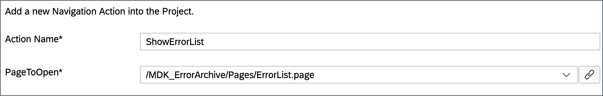

2. On **Main page**, drag and drop the **Section Button** Container Item control onto the Page.

      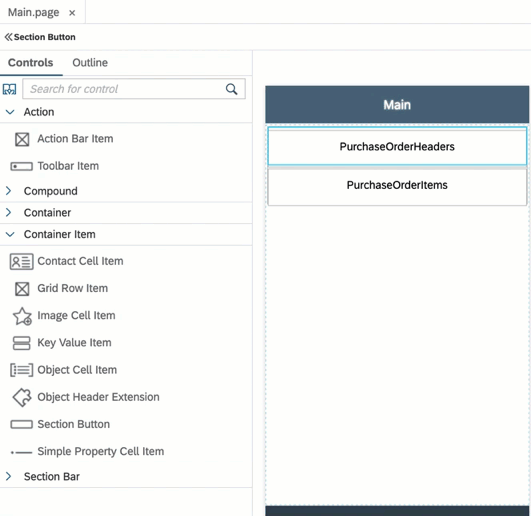

      Provide **Title** as **Error Archive**.

      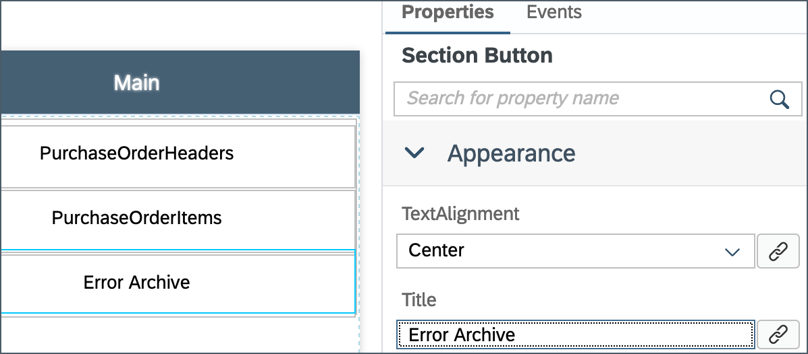

3. Bind `ShowErrorList.action` to the `onPress` of **Error Archive** section button in **Main** page.

      Go to **Events** tab, click the **link icon** for the `OnPress` property to open the object browser.

      Double click the `ShowErrorList.action` action and click **OK** to set it as the `OnPress` Action.

      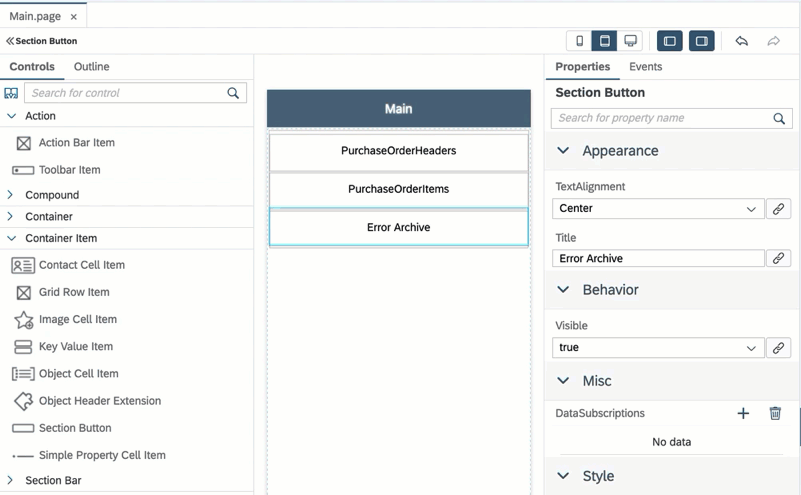

4. Save the changes to the `Main` page.

[DONE]
[ACCORDION-END]

[ACCORDION-BEGIN [Step 7: ](Deploy and activate the application)]

So far, you have learnt how to build an MDK application in the SAP Web IDE editor. Now, we deploy this application definition to Mobile Services.

1. Right-click the `MDK_ErrorArchive` MDK Application in the project explorer pane and select **MDK Deploy and Activate**.

    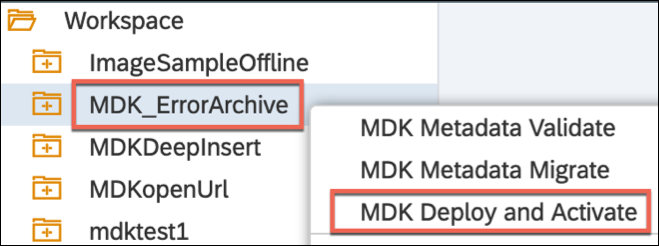

2. Let the default configuration as it is and click **Next**.

    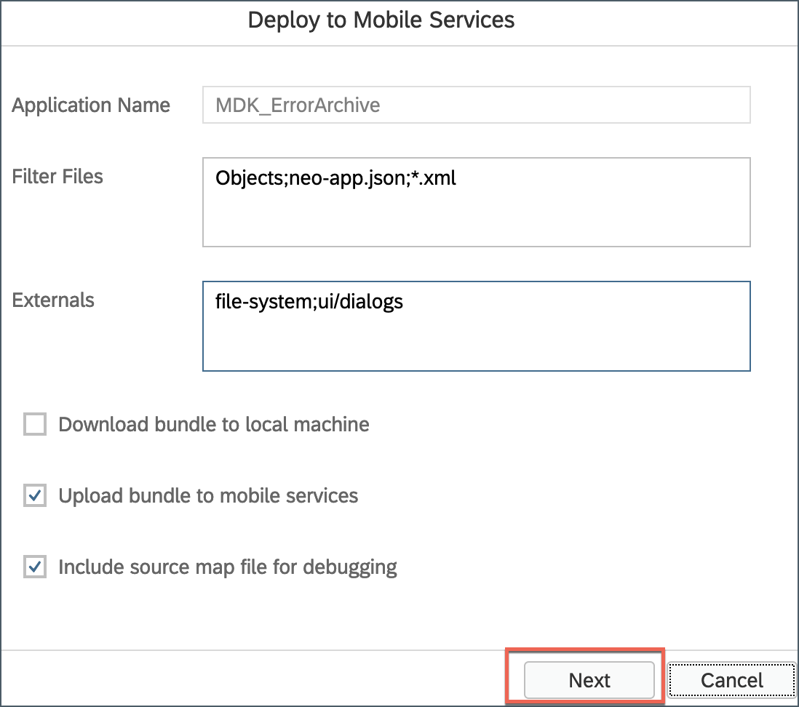

    >_Filter Files_ will be filtered and ignored in web packing process.

    >_Externals_ are the list of NPM modules that are part of the MDK Client application and should not be validated in the bundle.

3. Click the drop down for Destination Name and select the `mobileservices_cf` destination, you will find list of existing application IDs, select the one you have chosen while creating the project.

    >By default, automatically deploy option is selected, In other words, the application is automatically deployed from Mobile Services to your MDK client.

    

4. Click **Next** to finish the deployment from SAP Web IDE.

    You should see **Application deployed successfully** message in console log.

    

[DONE]
[ACCORDION-END]

[ACCORDION-BEGIN [Step 8: ](Populate the QR code for app on-boarding)]

SAP Web IDE has a feature to generate QR code for app on-boarding.

Right click the `MDK_ErrorArchive` MDK Application in the project explorer pane and select **MDK Show QR Code**.

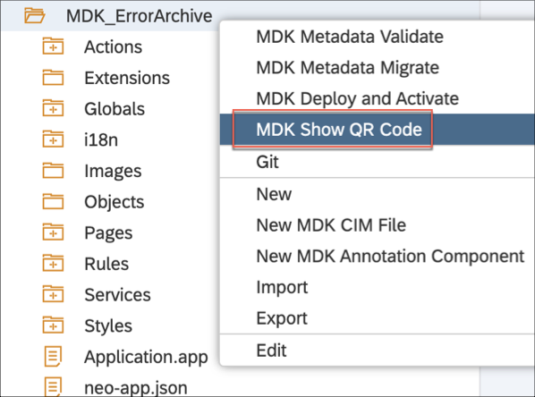

>**MDK Show QR Code** option is greyed out if MDK project is not yet deployed and activated as per step 3.

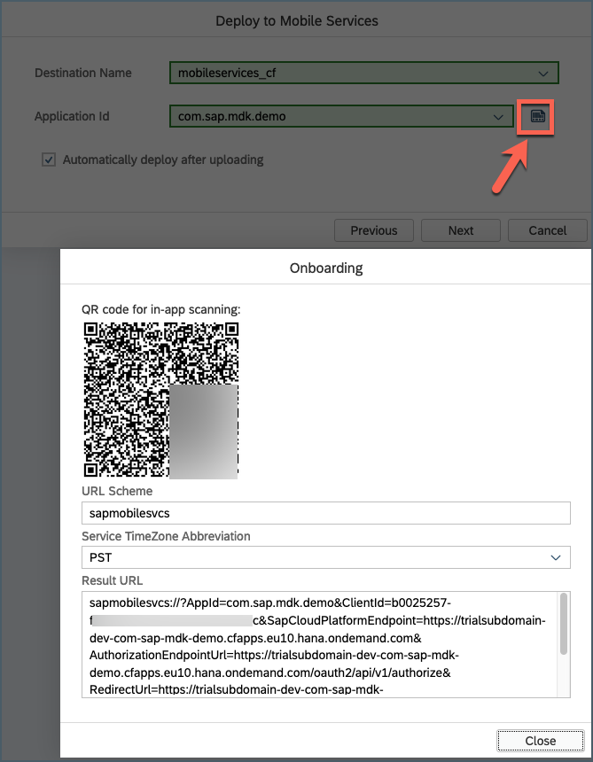

[DONE]
[ACCORDION-END]

[ACCORDION-BEGIN [Step 9: ](Run the app in MDK client)]

>Make sure you are choosing the right device platform tab above. Once you have scanned and onboarded using the onboarding URL, it will be remembered. When you Log out and onboard again, same onboarding URL settings will be reused without the need to scan. You will need to use 3rd party QR scanner app in Android or device Camera in iOS, if you would like to scan a different onboarding URL.

[OPTION BEGIN [Android]]

On Android, the camera app does not support scanning the QR-code. As alternative you can use the [Barcode scanner app](https://play.google.com/store/apps/details?id=com.application_4u.qrcode.barcode.scanner.reader.flashlight&hl=en_IN) to scan it.

1. Launch **`Mobile Svcs`** app on your Android device. Tap **GET STARTED** to connect MDK client to SAP Cloud Platform.

    

2. Tap **QR CODE SCAN** to start the device camera for scanning the on-boarding QR code.

    

3. Once scan is succeeded, tap **CONTINUE**.

    

4. Enter Email address and password to login to SAP Cloud Platform and tap **Log On** to authenticate.

    

5. Tap **AGREE** on `End User License Agreement`.

    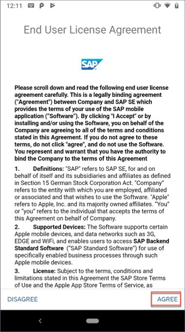

6. Choose a passcode with at least 8 characters for unlocking the app and tap **NEXT**.

    

7. Confirm the passcode and tap **DONE**.

    

    Optionally, you can enable fingerprint to get faster access to the app data.

    

8. Tap **OK**.

    

    The MDK client receives deployed metadata definitions as a bundle.

    Now, you will see **Main** page with some entity sets being displayed and Offline store is being initialized.

    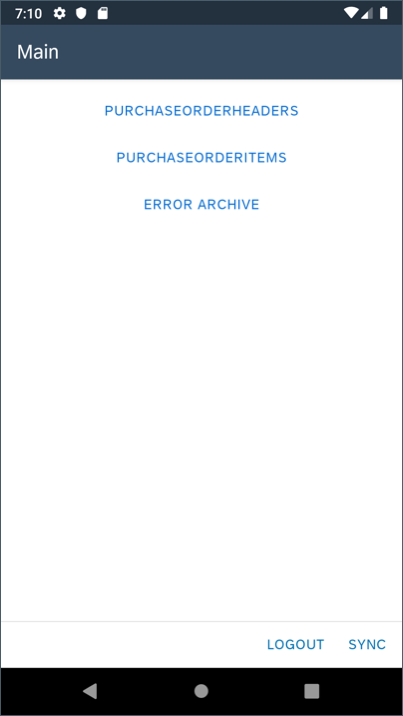

9. You will modify a `PURCHASEORDERHEADERS` record, save it locally, sync it to the backend and if backend doesn't accept this change due to some business logic failure, this record will appear in **Error Archive** list.

    Navigate to `PURCHASEORDERHEADERS` list, tap either one of the record.

    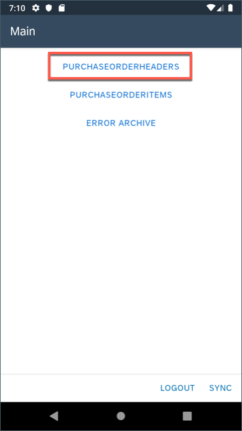

    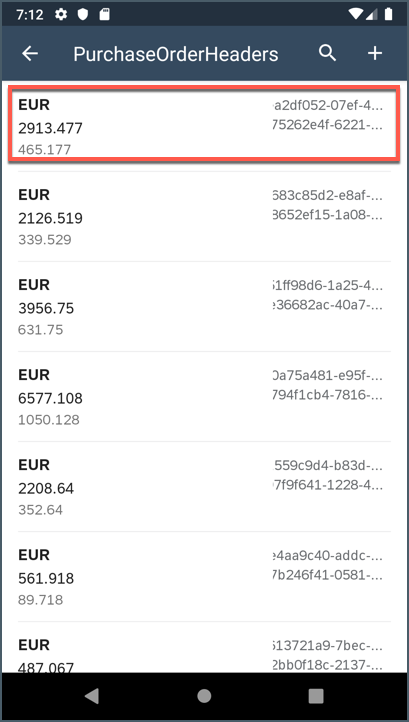

    Tap edit icon.

    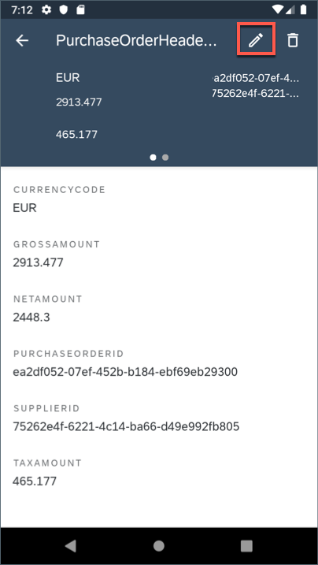

    Make some changes to `SUPPLIERID` value and **SAVE** it.

    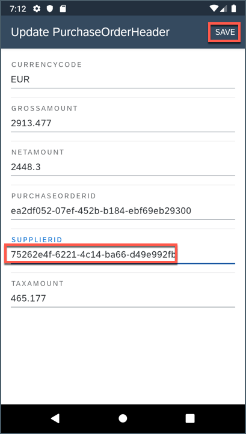

    You will see **Entity Updated** toast message. You can always see this updated record reflecting in `PURCHASEORDERHEADERS` list which means offline store has accepted this change.

9. Navigate to `Main.page`, click **SYNC** to upload local changes from device to the backend and to download the latest changes from backend to the device.

    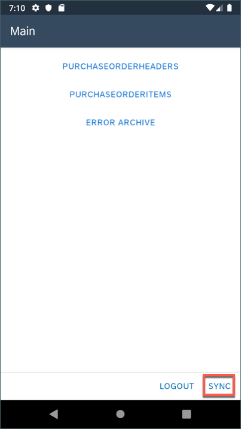

10. Once you see Sync success message, navigate to **ERROR ARCHIVE** list.

    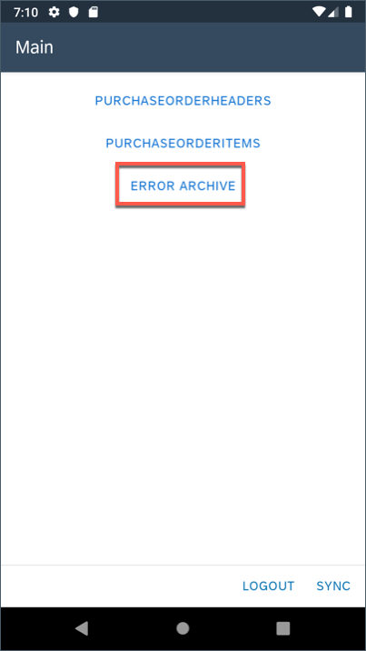

    There you will find affected entity which couldn't get accepted by backend due to some business logic failure.

    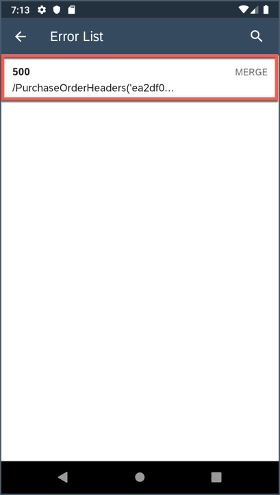

11. Tapping any record navigates to **Error Details** page with more information about error.

    Here in **ERROR MESSAGE** you will see `violates foreign key constraint` and in **REQUEST BODY**, it shows the property that caused this failure.

    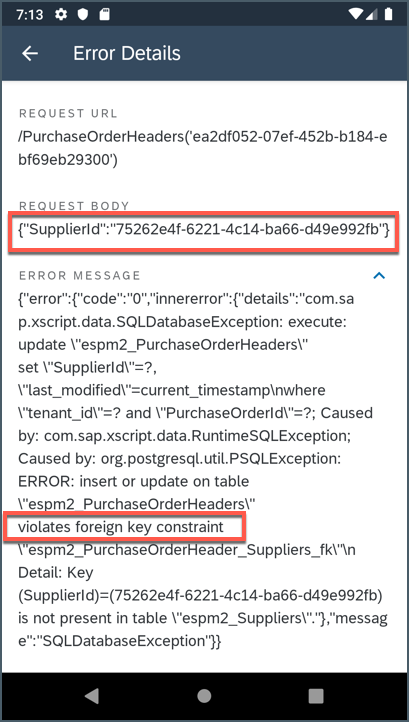

    It's now up-to developers how to handle such errors and let users to modify record with correct values.

    In this tutorial, we have added a business logic to find out which is affected entity and how to navigate to respective record to let users to modify this record with correct values. Once done, user can again **SYNC** it with backend.

12. Tap **Edit Affected Entity** and modify record with correct values.

    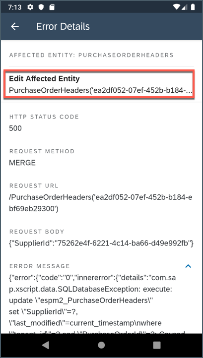

    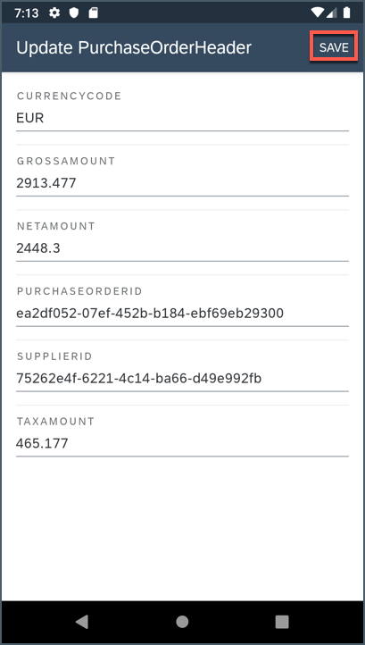

    >Once you have scanned and onboarded using the onboarding URL, it will be remembered. When you Log out and onboard again, same onboarding URL settings will be reused without the need to scan. You will need to use 3rd party QR scanner app in Android or device Camera in iOS, if you would like to scan a different onboarding URL.

[OPTION END]

[OPTION BEGIN [iOS]]

1. Launch **`Mobile Svcs`** app on your iOS device. Tap **Scan** to start the device camera for scanning the on-boarding QR code.

    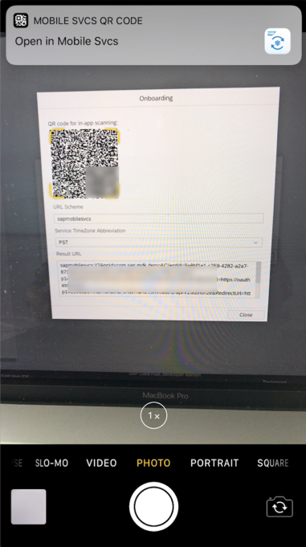

2. Once scan is succeeded, tap **Continue**.

    

3. Enter Email address and password to login to SAP Cloud Platform and tap **Log On** to authenticate.

    

4. Tap **Agree** on `End User License Agreement`.

    

5. Choose a passcode with at least 8 characters for unlocking the app and tap **Next**.

    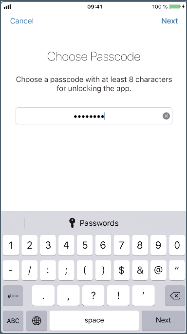

6. Confirm the passcode and tap **Done**.

    

    Optionally, you can enable Touch ID to get faster access to the app data, tap **Enable**.

    

7. Tap **OK**.

    

    Now, you will see **Main** page with some entity sets being displayed and Offline store is being initialized.

    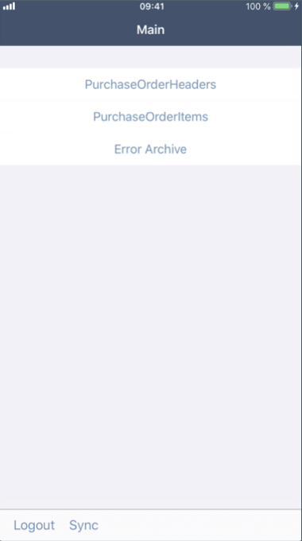

8. You will modify a `PurchaseOrderHeaders` record, save it locally, sync it to the backend and if backend doesn't accept this change due to some business logic failure, this record will appear in **Error Archive** list.

    Navigate to `PurchaseOrderHeaders` list, tap either one of the record.

    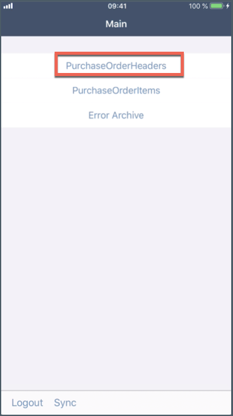

    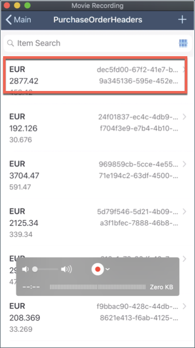

    Tap **Edit**.

    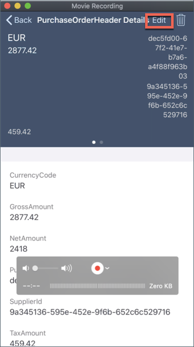

    Make some changes to `SupplierId` value and **Save** it.

    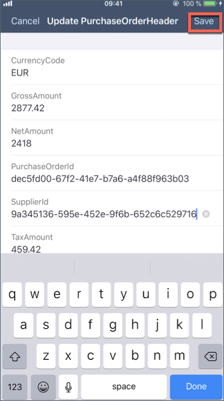

    You will see **Entity Updated** toast message. You can always see this updated record reflecting in `PurchaseOrderHeaders` list which means offline store has accepted this change.

9. Navigate to `Main.page`, click **Sync** to upload local changes from device to the backend and to download the latest changes from backend to the device.

    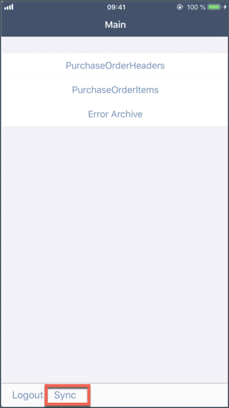

10. Once you see Sync success message, navigate to **Error Archive** list.

    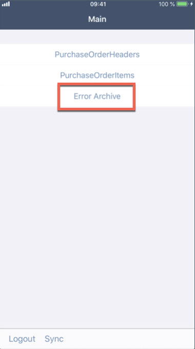

    There you will find affected entity which couldn't get accepted by backend due to some business logic failure.

    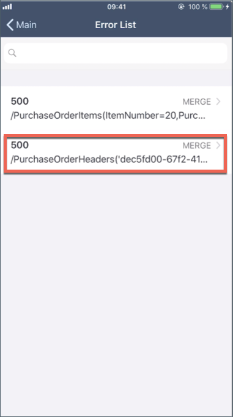

    Tapping any record navigates to **Error Details** page with more information about error.

    Here in **Error Message** you will see `SQL Exception: Foreign key constraint violation occurred` and in **Request Body**, it shows the property that caused this failure.

    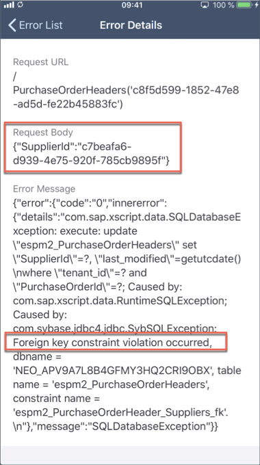

    It's now up-to developers how to handle such errors and let users to modify record with correct values.

    In this tutorial, we have added a business logic to find out which is affected entity and how to navigate to respective record to let users to modify this record with correct values. Once done, user can again **Sync** it with backend.

11. Tap **Edit Affected Entity** and modify record with correct values.

    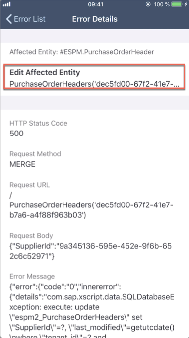

    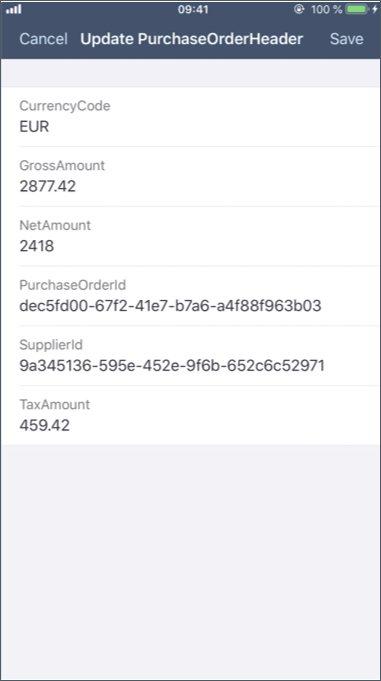

    >Once you have scanned and onboarded using the onboarding URL, it will be remembered. When you Log out and onboard again, same onboarding URL settings will be reused without the need to scan. You will need to use 3rd party QR scanner app in Android or device Camera in iOS, if you would like to scan a different onboarding URL.

[OPTION END]

Congratulations, you have successfully setup your app to handle Error Archive and you are now all set to [Add Styling to an MDK App](cp-mobile-dev-kit-style).

[VALIDATE_1]
[ACCORDION-END]

---
